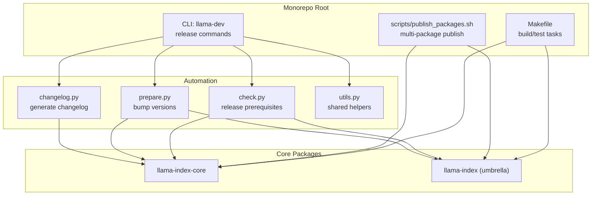
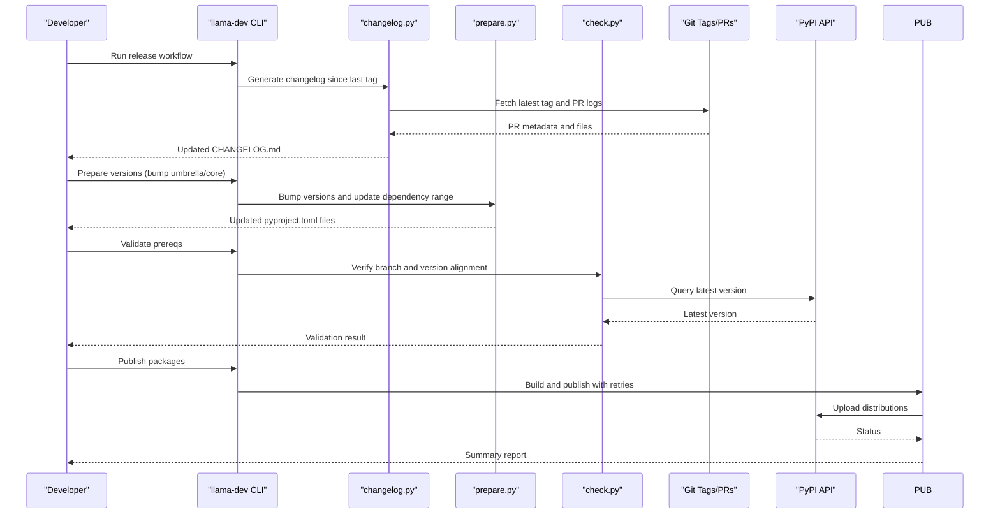
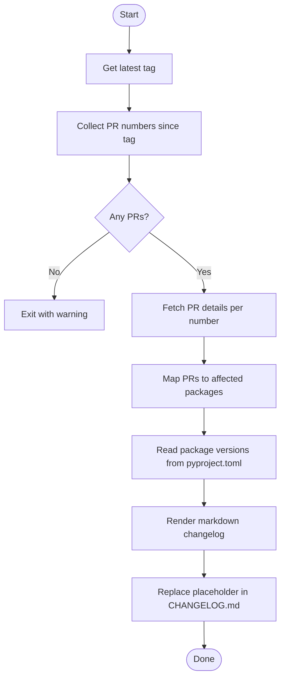
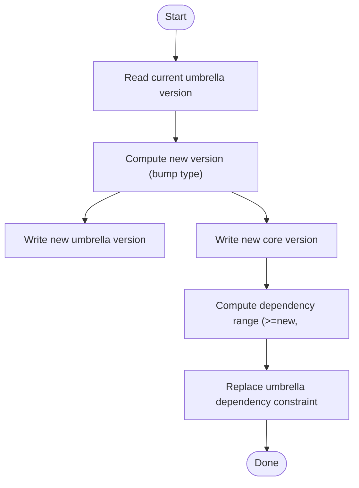
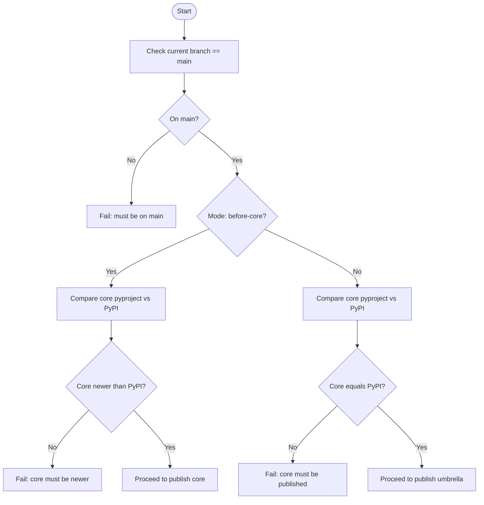
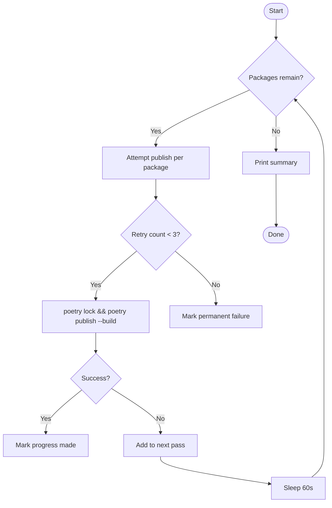
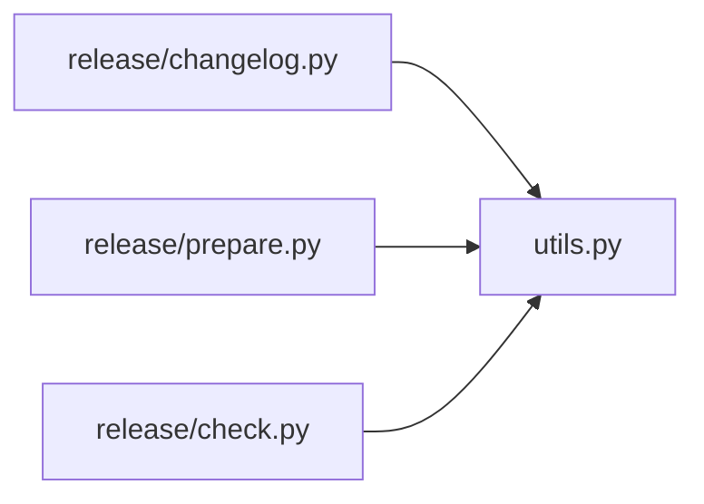

# Release Management

<cite>
**Referenced Files in This Document**
- [README.md](file://README.md)
- [RELEASE_HEAD.md](file://RELEASE_HEAD.md)
- [CHANGELOG.md](file://CHANGELOG.md)
- [Makefile](file://Makefile)
- [scripts/publish_packages.sh](file://scripts/publish_packages.sh)
- [llama-dev/llama_dev/cli.py](file://llama-dev/llama_dev/cli.py)
- [llama-dev/llama_dev/utils.py](file://llama-dev/llama_dev/utils.py)
- [llama-dev/llama_dev/release/changelog.py](file://llama-dev/llama_dev/release/changelog.py)
- [llama-dev/llama_dev/release/prepare.py](file://llama-dev/llama_dev/release/prepare.py)
- [llama-dev/llama_dev/release/check.py](file://llama-dev/llama_dev/release/check.py)
</cite>

## Table of Contents
1. [Introduction](#introduction)
2. [Project Structure](#project-structure)
3. [Core Components](#core-components)
4. [Architecture Overview](#architecture-overview)
5. [Detailed Component Analysis](#detailed-component-analysis)
6. [Dependency Analysis](#dependency-analysis)
7. [Performance Considerations](#performance-considerations)
8. [Troubleshooting Guide](#troubleshooting-guide)
9. [Conclusion](#conclusion)
10. [Appendices](#appendices)

## Introduction
This document describes the LlamaIndex release management processes for version control, changelog generation, and package distribution across a monorepo. It covers the release preparation workflow, version bumping procedures, quality checks, changelog automation, validation processes, and publishing workflows. Practical examples show how to prepare releases, generate release notes, coordinate multi-package releases, manage branches and hotfixes, maintain backward compatibility, automate CI/CD, and handle deployment verification. Guidance is also provided for release communication, stakeholder coordination, and rollback procedures, along with troubleshooting for common release failures.

## Project Structure
LlamaIndex is a monorepo composed of multiple Python packages under a shared versioning scheme. The release tooling is centered around:
- A dedicated CLI under llama-dev for release automation
- A changelog generator that aggregates PR activity since the last tag
- A version preparation utility to bump umbrella and core package versions
- A validation utility to ensure prerequisites are met before publishing
- A publishing script to build and publish packages with retries

**Diagram sources**
- [llama-dev/llama_dev/cli.py](file://llama-dev/llama_dev/cli.py#L24-L45)
- [llama-dev/llama_dev/release/changelog.py](file://llama-dev/llama_dev/release/changelog.py#L91-L148)
- [llama-dev/llama_dev/release/prepare.py](file://llama-dev/llama_dev/release/prepare.py#L27-L72)
- [llama-dev/llama_dev/release/check.py](file://llama-dev/llama_dev/release/check.py#L38-L95)
- [llama-dev/llama_dev/utils.py](file://llama-dev/llama_dev/utils.py#L125-L134)
- [scripts/publish_packages.sh](file://scripts/publish_packages.sh#L1-L114)
- [Makefile](file://Makefile#L1-L33)

**Section sources**
- [README.md](file://README.md#L1-L224)
- [llama-dev/llama_dev/cli.py](file://llama-dev/llama_dev/cli.py#L24-L45)
- [llama-dev/llama_dev/utils.py](file://llama-dev/llama_dev/utils.py#L125-L134)

## Core Components
- Changelog automation: Extracts PRs since the last tag, groups by affected package, and writes a dated entry to the monorepo changelog.
- Version preparation: Bumps the umbrella package and core package versions and updates the umbrella dependency range to target the new core.
- Release validation: Ensures the correct branch and version alignment with PyPI for staged releases.
- Package publishing: Builds and publishes packages with retry logic and failure reporting.

Key responsibilities:
- Changelog generation: [changelog.py](file://llama-dev/llama_dev/release/changelog.py#L91-L148)
- Version bumping: [prepare.py](file://llama-dev/llama_dev/release/prepare.py#L27-L72)
- Release prerequisites: [check.py](file://llama-dev/llama_dev/release/check.py#L38-L95)
- Multi-package publishing: [publish_packages.sh](file://scripts/publish_packages.sh#L1-L114)
- Shared helpers: [utils.py](file://llama-dev/llama_dev/utils.py#L14-L221)

**Section sources**
- [llama-dev/llama_dev/release/changelog.py](file://llama-dev/llama_dev/release/changelog.py#L91-L148)
- [llama-dev/llama_dev/release/prepare.py](file://llama-dev/llama_dev/release/prepare.py#L27-L72)
- [llama-dev/llama_dev/release/check.py](file://llama-dev/llama_dev/release/check.py#L38-L95)
- [scripts/publish_packages.sh](file://scripts/publish_packages.sh#L1-L114)
- [llama-dev/llama_dev/utils.py](file://llama-dev/llama_dev/utils.py#L14-L221)

## Architecture Overview
The release pipeline integrates Git metadata, GitHub PRs, and PyPI checks to automate changelog generation, version bumps, and publishing.

**Diagram sources**
- [llama-dev/llama_dev/release/changelog.py](file://llama-dev/llama_dev/release/changelog.py#L91-L148)
- [llama-dev/llama_dev/release/prepare.py](file://llama-dev/llama_dev/release/prepare.py#L27-L72)
- [llama-dev/llama_dev/release/check.py](file://llama-dev/llama_dev/release/check.py#L38-L95)
- [scripts/publish_packages.sh](file://scripts/publish_packages.sh#L1-L114)

## Detailed Component Analysis

### Changelog Automation System
Purpose:
- Aggregate merged PRs since the last release tag
- Group changes by affected package
- Generate a dated changelog entry for the monorepo

Workflow:
- Determine the latest semantic tag
- Parse commit messages to extract PR numbers
- Fetch PR details via GitHub CLI
- Detect which packages were changed by the PRs
- Load each package’s current version from pyproject.toml
- Render markdown grouped by package and date
- Replace placeholder in CHANGELOG.md

**Diagram sources**
- [llama-dev/llama_dev/release/changelog.py](file://llama-dev/llama_dev/release/changelog.py#L24-L89)

**Section sources**
- [llama-dev/llama_dev/release/changelog.py](file://llama-dev/llama_dev/release/changelog.py#L91-L148)
- [CHANGELOG.md](file://CHANGELOG.md#L1-L20)

### Version Bumping Procedures
Purpose:
- Increment the umbrella package version
- Synchronize the core package version
- Update the umbrella dependency constraint to target the new core

Behavior:
- Accept bump type: major, minor, or patch
- Compute new version string
- Update umbrella and core pyproject.toml
- Rewrite umbrella dependency to a compatible range

**Diagram sources**
- [llama-dev/llama_dev/release/prepare.py](file://llama-dev/llama_dev/release/prepare.py#L27-L72)
- [llama-dev/llama_dev/utils.py](file://llama-dev/llama_dev/utils.py#L20-L38)

**Section sources**
- [llama-dev/llama_dev/release/prepare.py](file://llama-dev/llama_dev/release/prepare.py#L27-L72)
- [llama-dev/llama_dev/utils.py](file://llama-dev/llama_dev/utils.py#L20-L38)

### Release Validation Processes
Purpose:
- Enforce branch and version alignment before and after publishing the core package

Preconditions:
- Must be on the main branch
- Pre-release check: core version must be newer than PyPI
- Post-release check: core version must match the latest on PyPI

**Diagram sources**
- [llama-dev/llama_dev/release/check.py](file://llama-dev/llama_dev/release/check.py#L38-L95)

**Section sources**
- [llama-dev/llama_dev/release/check.py](file://llama-dev/llama_dev/release/check.py#L38-L95)

### Package Publishing Workflows
Purpose:
- Build and publish multiple packages with retry logic and failure reporting

Mechanics:
- Lock dependencies per package
- Build and publish
- Track transient failures and retry up to three times
- Report permanent failures and unresolved dependency issues

**Diagram sources**
- [scripts/publish_packages.sh](file://scripts/publish_packages.sh#L58-L95)

**Section sources**
- [scripts/publish_packages.sh](file://scripts/publish_packages.sh#L1-L114)

### Practical Examples

- Prepare a release
  - Bump versions and update dependency constraints:
    - Command: [prepare.py](file://llama-dev/llama_dev/release/prepare.py#L27-L72)
    - Dry-run to preview changes: [prepare.py](file://llama-dev/llama_dev/release/prepare.py#L36-L40)
  - Validate prerequisites:
    - Pre-release check (core must be newer than PyPI): [check.py](file://llama-dev/llama_dev/release/check.py#L71-L84)
    - Post-release check (core must match PyPI): [check.py](file://llama-dev/llama_dev/release/check.py#L84-L95)

- Generate release notes
  - Generate changelog since last tag:
    - Command: [changelog.py](file://llama-dev/llama_dev/release/changelog.py#L91-L148)
    - Dry-run to preview output: [changelog.py](file://llama-dev/llama_dev/release/changelog.py#L92-L96)

- Coordinate multi-package releases
  - Use the publishing script to build and publish packages with retries:
    - Script: [publish_packages.sh](file://scripts/publish_packages.sh#L1-L114)
  - Ensure umbrella depends on the newly released core within a compatible range:
    - Logic: [prepare.py](file://llama-dev/llama_dev/release/prepare.py#L55-L71)

- Backward compatibility maintenance
  - Keep umbrella dependency range aligned with the bumped core:
    - Range computation: [prepare.py](file://llama-dev/llama_dev/release/prepare.py#L55-L57)
  - Validate version alignment against PyPI:
    - Checks: [check.py](file://llama-dev/llama_dev/release/check.py#L71-L95)

- Release branching strategy and hotfixes
  - Branch requirement: main branch for publishing:
    - Check: [check.py](file://llama-dev/llama_dev/release/check.py#L62-L69)
  - Hotfix procedure:
    - Create a hotfix branch from the last successful release tag
    - Apply minimal fixes and cherry-pick to main
    - Regenerate changelog and bump patch versions
    - Publish core first, then umbrella, validating against PyPI

- CI/CD integration and deployment verification
  - Build and test tasks:
    - Makefile targets: [Makefile](file://Makefile#L13-L32)
  - Build assets verification:
    - README guidance for verifying static assets:
      - [README.md](file://README.md#L191-L208)

**Section sources**
- [llama-dev/llama_dev/release/prepare.py](file://llama-dev/llama_dev/release/prepare.py#L27-L72)
- [llama-dev/llama_dev/release/check.py](file://llama-dev/llama_dev/release/check.py#L38-L95)
- [llama-dev/llama_dev/release/changelog.py](file://llama-dev/llama_dev/release/changelog.py#L91-L148)
- [scripts/publish_packages.sh](file://scripts/publish_packages.sh#L1-L114)
- [Makefile](file://Makefile#L13-L32)
- [README.md](file://README.md#L191-L208)

## Dependency Analysis
The release tooling relies on shared utilities for package discovery, version parsing, and dependency analysis.

**Diagram sources**
- [llama-dev/llama_dev/utils.py](file://llama-dev/llama_dev/utils.py#L125-L134)
- [llama-dev/llama_dev/release/changelog.py](file://llama-dev/llama_dev/release/changelog.py#L10-L10)
- [llama-dev/llama_dev/release/prepare.py](file://llama-dev/llama_dev/release/prepare.py#L5-L10)
- [llama-dev/llama_dev/release/check.py](file://llama-dev/llama_dev/release/check.py#L1-L8)

**Section sources**
- [llama-dev/llama_dev/utils.py](file://llama-dev/llama_dev/utils.py#L125-L134)
- [llama-dev/llama_dev/release/changelog.py](file://llama-dev/llama_dev/release/changelog.py#L10-L10)
- [llama-dev/llama_dev/release/prepare.py](file://llama-dev/llama_dev/release/prepare.py#L5-L10)
- [llama-dev/llama_dev/release/check.py](file://llama-dev/llama_dev/release/check.py#L1-L8)

## Performance Considerations
- Changelog generation performs network calls per PR; batching or limiting PRs can reduce latency.
- Publishing script retries introduce delays; tune retry limits and intervals for your CI throughput.
- Version bumping and dependency replacement operate on pyproject.toml files; ensure deterministic ordering for reproducibility.

## Troubleshooting Guide
Common issues and resolutions:
- No pull requests found since last tag
  - Cause: Missing PR merges or incorrect tag
  - Action: Verify tag existence and PRs merged after the tag
  - Reference: [changelog.py](file://llama-dev/llama_dev/release/changelog.py#L117-L118)

- Not on main branch
  - Cause: Attempting to publish outside main
  - Action: Switch to main and re-run validation
  - Reference: [check.py](file://llama-dev/llama_dev/release/check.py#L62-L69)

- Core version not newer than PyPI (pre-release)
  - Cause: Version not bumped or mismatch
  - Action: Bump core version and re-run validation
  - Reference: [check.py](file://llama-dev/llama_dev/release/check.py#L71-L84)

- Core version not available on PyPI (post-release)
  - Cause: Not yet published or version mismatch
  - Action: Publish core and confirm PyPI availability
  - Reference: [check.py](file://llama-dev/llama_dev/release/check.py#L84-L95)

- Package publish failures
  - Symptom: Transient errors or dependency conflicts
  - Action: Inspect logs, retry, or adjust dependency constraints
  - Reference: [publish_packages.sh](file://scripts/publish_packages.sh#L74-L85)

- Changelog placeholder not replaced
  - Cause: Placeholder missing or file write error
  - Action: Ensure placeholder exists and file permissions are writable
  - Reference: [changelog.py](file://llama-dev/llama_dev/release/changelog.py#L82-L89)

**Section sources**
- [llama-dev/llama_dev/release/changelog.py](file://llama-dev/llama_dev/release/changelog.py#L117-L118)
- [llama-dev/llama_dev/release/check.py](file://llama-dev/llama_dev/release/check.py#L62-L95)
- [scripts/publish_packages.sh](file://scripts/publish_packages.sh#L74-L85)
- [llama-dev/llama_dev/release/changelog.py](file://llama-dev/llama_dev/release/changelog.py#L82-L89)

## Conclusion
LlamaIndex employs a robust, automated release pipeline that spans changelog generation, version bumping, validation, and multi-package publishing. By enforcing branch discipline, validating against PyPI, and automating retries, the system minimizes human error and accelerates reliable releases across the monorepo. Adopting the documented workflows and troubleshooting steps ensures smooth coordination among stakeholders and maintains backward compatibility.

## Appendices

### Appendix A: Release Checklist
- Confirm on main branch
- Generate changelog since last tag
- Bump versions (umbrella and core)
- Validate core version alignment with PyPI
- Publish core package(s)
- Validate core availability on PyPI
- Publish umbrella package(s)
- Announce release and update release notes

**Section sources**
- [llama-dev/llama_dev/release/check.py](file://llama-dev/llama_dev/release/check.py#L62-L95)
- [llama-dev/llama_dev/release/changelog.py](file://llama-dev/llama_dev/release/changelog.py#L91-L148)
- [llama-dev/llama_dev/release/prepare.py](file://llama-dev/llama_dev/release/prepare.py#L27-L72)
- [scripts/publish_packages.sh](file://scripts/publish_packages.sh#L1-L114)