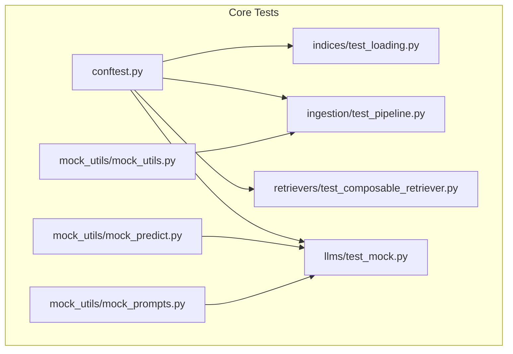
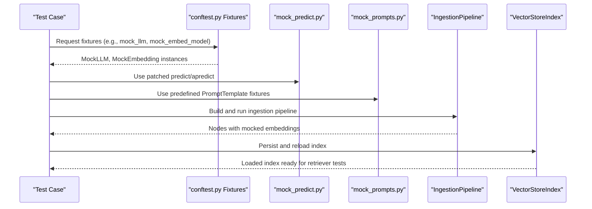
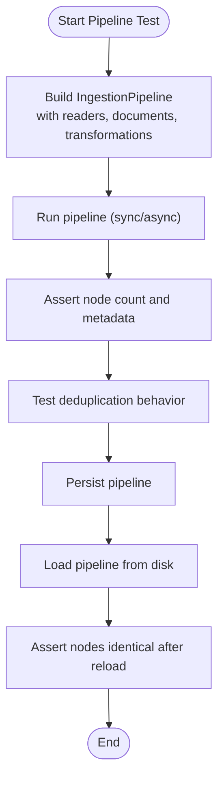
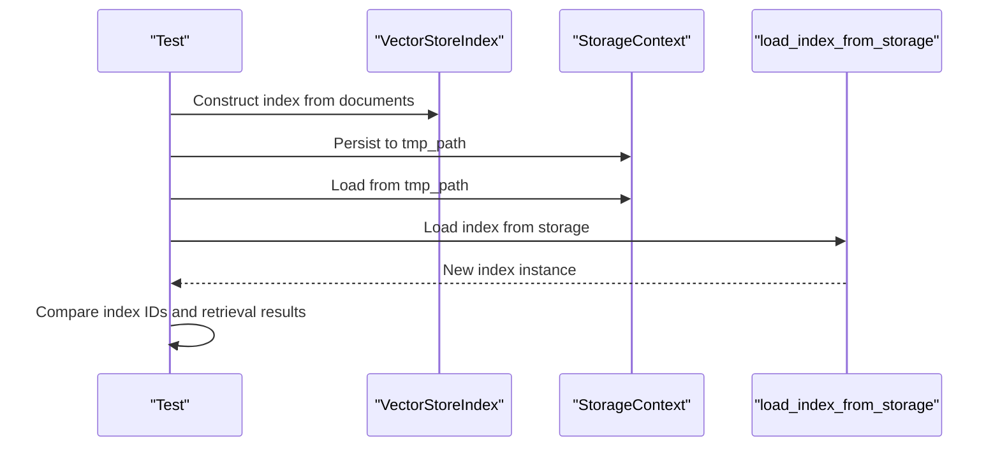
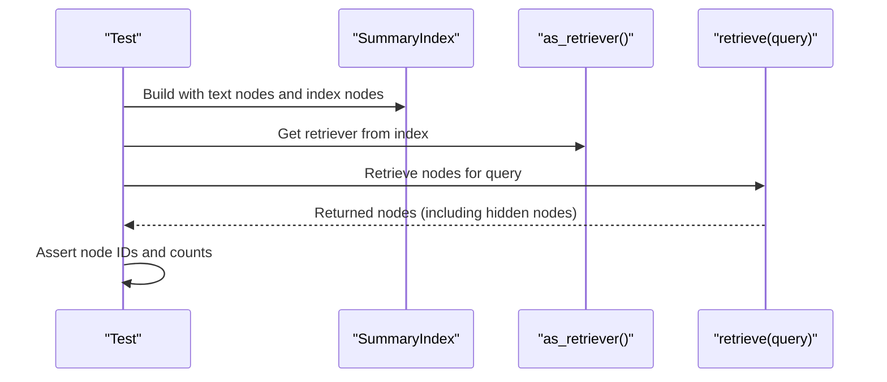
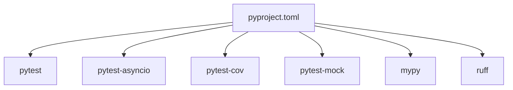

# Testing Framework

<cite>
**Referenced Files in This Document**
- [llama-index-core/tests/conftest.py](file://llama-index-core/tests/conftest.py)
- [llama-index-core/tests/mock_utils/mock_utils.py](file://llama-index-core/tests/mock_utils/mock_utils.py)
- [llama-index-core/tests/mock_utils/mock_predict.py](file://llama-index-core/tests/mock_utils/mock_predict.py)
- [llama-index-core/tests/mock_utils/mock_prompts.py](file://llama-index-core/tests/mock_utils/mock_prompts.py)
- [llama-index-core/tests/indices/test_loading.py](file://llama-index-core/tests/indices/test_loading.py)
- [llama-index-core/tests/ingestion/test_pipeline.py](file://llama-index-core/tests/ingestion/test_pipeline.py)
- [llama-index-core/tests/retrievers/test_composable_retriever.py](file://llama-index-core/tests/retrievers/test_composable_retriever.py)
- [llama-index-core/tests/llms/test_mock.py](file://llama-index-core/tests/llms/test_mock.py)
- [llama-index-core/pyproject.toml](file://llama-index-core/pyproject.toml)
</cite>

## Table of Contents
1. [Introduction](#introduction)
2. [Project Structure](#project-structure)
3. [Core Components](#core-components)
4. [Architecture Overview](#architecture-overview)
5. [Detailed Component Analysis](#detailed-component-analysis)
6. [Dependency Analysis](#dependency-analysis)
7. [Performance Considerations](#performance-considerations)
8. [Troubleshooting Guide](#troubleshooting-guide)
9. [Conclusion](#conclusion)
10. [Appendices](#appendices)

## Introduction
This document describes the testing framework used in the LlamaIndex codebase with a focus on unit and integration testing patterns, test configuration, fixtures, and mocking utilities. It explains how to write effective tests for custom components such as data ingestion pipelines, indexing systems, and retrieval engines. It also covers best practices for asynchronous operations, database connections, and external API integrations, along with guidance on test isolation, dependency injection, cleanup procedures, running test suites, interpreting results, debugging failures, and performance testing approaches.

## Project Structure
The testing infrastructure is primarily located under the core module’s tests directory and includes:
- Global test configuration via pytest fixtures and markers
- Mock utilities for LLMs, prompts, and text splitting
- Example tests for ingestion pipelines, index loading, retrievers, and LLM mocks

**Diagram sources**
- [llama-index-core/tests/conftest.py](file://llama-index-core/tests/conftest.py#L1-L192)
- [llama-index-core/tests/mock_utils/mock_utils.py](file://llama-index-core/tests/mock_utils/mock_utils.py#L1-L62)
- [llama-index-core/tests/mock_utils/mock_predict.py](file://llama-index-core/tests/mock_utils/mock_predict.py#L1-L249)
- [llama-index-core/tests/mock_utils/mock_prompts.py](file://llama-index-core/tests/mock_utils/mock_prompts.py#L1-L78)
- [llama-index-core/tests/indices/test_loading.py](file://llama-index-core/tests/indices/test_loading.py#L1-L106)
- [llama-index-core/tests/ingestion/test_pipeline.py](file://llama-index-core/tests/ingestion/test_pipeline.py#L1-L466)
- [llama-index-core/tests/retrievers/test_composable_retriever.py](file://llama-index-core/tests/retrievers/test_composable_retriever.py#L1-L24)
- [llama-index-core/tests/llms/test_mock.py](file://llama-index-core/tests/llms/test_mock.py#L1-L232)

**Section sources**
- [llama-index-core/tests/conftest.py](file://llama-index-core/tests/conftest.py#L1-L192)
- [llama-index-core/tests/mock_utils/mock_utils.py](file://llama-index-core/tests/mock_utils/mock_utils.py#L1-L62)
- [llama-index-core/tests/mock_utils/mock_predict.py](file://llama-index-core/tests/mock_utils/mock_predict.py#L1-L249)
- [llama-index-core/tests/mock_utils/mock_prompts.py](file://llama-index-core/tests/mock_utils/mock_prompts.py#L1-L78)
- [llama-index-core/tests/indices/test_loading.py](file://llama-index-core/tests/indices/test_loading.py#L1-L106)
- [llama-index-core/tests/ingestion/test_pipeline.py](file://llama-index-core/tests/ingestion/test_pipeline.py#L1-L466)
- [llama-index-core/tests/retrievers/test_composable_retriever.py](file://llama-index-core/tests/retrievers/test_composable_retriever.py#L1-L24)
- [llama-index-core/tests/llms/test_mock.py](file://llama-index-core/tests/llms/test_mock.py#L1-L232)

## Core Components
- Pytest configuration and global fixtures:
  - Environment setup and cleanup
  - Network control fixture
  - Token splitter patching
  - LLM predictor patching and MockLLM/MockEmbedding fixtures
  - Settings override fixture
  - OpenAI credentials management context
  - CLI option and marker for integration tests
- Mock utilities:
  - Tokenizer and keyword extraction mocks
  - Prompt templates for common prompt types
  - Predict/async predict mocks for LLMPredictor and MockLLM

Key responsibilities:
- Provide deterministic behavior for LLM calls and text splitting
- Enable isolated tests without network access by default
- Support both synchronous and asynchronous test flows
- Allow easy switching of embedding and LLM backends for tests

**Section sources**
- [llama-index-core/tests/conftest.py](file://llama-index-core/tests/conftest.py#L32-L192)
- [llama-index-core/tests/mock_utils/mock_utils.py](file://llama-index-core/tests/mock_utils/mock_utils.py#L9-L62)
- [llama-index-core/tests/mock_utils/mock_predict.py](file://llama-index-core/tests/mock_utils/mock_predict.py#L167-L249)
- [llama-index-core/tests/mock_utils/mock_prompts.py](file://llama-index-core/tests/mock_utils/mock_prompts.py#L6-L78)

## Architecture Overview
The testing architecture centers around pytest fixtures and monkeypatching to isolate components under test. The global conftest defines autouse fixtures for environment variables and optional network access, while module-specific fixtures replace LLM and embedding behavior with deterministic mocks. Tests exercise ingestion pipelines, index persistence/loading, and retriever composition.

**Diagram sources**
- [llama-index-core/tests/conftest.py](file://llama-index-core/tests/conftest.py#L100-L119)
- [llama-index-core/tests/mock_utils/mock_predict.py](file://llama-index-core/tests/mock_utils/mock_predict.py#L167-L249)
- [llama-index-core/tests/mock_utils/mock_prompts.py](file://llama-index-core/tests/mock_utils/mock_prompts.py#L6-L78)
- [llama-index-core/tests/ingestion/test_pipeline.py](file://llama-index-core/tests/ingestion/test_pipeline.py#L16-L53)
- [llama-index-core/tests/indices/test_loading.py](file://llama-index-core/tests/indices/test_loading.py#L15-L37)

## Detailed Component Analysis

### Unit Testing Patterns
- Deterministic LLM behavior:
  - Use MockLLM and patched LLMPredictor to avoid real LLM calls
  - Control token counts and streaming behavior deterministically
- Prompt-driven tests:
  - Use predefined PromptTemplate fixtures to simulate various prompt types
- Text splitting control:
  - Patch token/text splitters to ensure consistent chunking across runs

Best practices:
- Prefer fixtures for shared setup/teardown
- Keep tests hermetic by disabling network access by default
- Use monkeypatch sparingly and only where necessary

**Section sources**
- [llama-index-core/tests/llms/test_mock.py](file://llama-index-core/tests/llms/test_mock.py#L87-L139)
- [llama-index-core/tests/mock_utils/mock_prompts.py](file://llama-index-core/tests/mock_utils/mock_prompts.py#L6-L78)
- [llama-index-core/tests/conftest.py](file://llama-index-core/tests/conftest.py#L47-L57)

### Integration Testing Strategies
- Integration marker and CLI option:
  - Mark tests with integration marker and run with --integration flag
- Controlled environment:
  - Use CachedOpenAIApiKeys context to temporarily set credentials
  - Optionally enable networking via allow_networking fixture

Guidance:
- Separate integration tests from unit tests
- Use environment variables and contexts to manage secrets
- Scope integration tests to avoid flakiness (e.g., rate limits, external availability)

**Section sources**
- [llama-index-core/tests/conftest.py](file://llama-index-core/tests/conftest.py#L169-L192)
- [llama-index-core/tests/conftest.py](file://llama-index-core/tests/conftest.py#L127-L167)

### Test Fixtures and Mocking Utilities
- Global fixtures:
  - set_env_vars: sets IS_TESTING flag and cleans up after
  - allow_networking: reverts network restrictions
  - patch_token_text_splitter: replaces splitter behavior
  - patch_llm_predictor: patches LLMPredictor predict/apredict and injects MockLLM
  - mock_llm, mock_embed_model, mock_settings: provide deterministic backends
  - mock_openai_credentials: ensures OPENAI_API_KEY presence
- Mock utilities:
  - mock_utils: tokenizer and keyword extraction mocks
  - mock_predict: deterministic responses for various prompt types
  - mock_prompts: common PromptTemplate fixtures

Usage tips:
- Apply module-level fixtures to reduce boilerplate
- Combine mock_prompts with mock_predict to simulate end-to-end prompt flows
- Use CachedOpenAIApiKeys to temporarily override credentials for external API tests

**Section sources**
- [llama-index-core/tests/conftest.py](file://llama-index-core/tests/conftest.py#L32-L119)
- [llama-index-core/tests/mock_utils/mock_utils.py](file://llama-index-core/tests/mock_utils/mock_utils.py#L9-L62)
- [llama-index-core/tests/mock_utils/mock_predict.py](file://llama-index-core/tests/mock_utils/mock_predict.py#L167-L249)
- [llama-index-core/tests/mock_utils/mock_prompts.py](file://llama-index-core/tests/mock_utils/mock_prompts.py#L6-L78)

### Writing Effective Tests for Custom Components

#### Data Ingestion Pipelines
- Build and run ingestion pipelines with deterministic transformers
- Verify node count, metadata propagation, and deduplication behavior
- Test both sync and async pipeline execution
- Persist and load pipelines to validate serialization

**Diagram sources**
- [llama-index-core/tests/ingestion/test_pipeline.py](file://llama-index-core/tests/ingestion/test_pipeline.py#L16-L53)
- [llama-index-core/tests/ingestion/test_pipeline.py](file://llama-index-core/tests/ingestion/test_pipeline.py#L248-L265)
- [llama-index-core/tests/ingestion/test_pipeline.py](file://llama-index-core/tests/ingestion/test_pipeline.py#L291-L311)

**Section sources**
- [llama-index-core/tests/ingestion/test_pipeline.py](file://llama-index-core/tests/ingestion/test_pipeline.py#L16-L53)
- [llama-index-core/tests/ingestion/test_pipeline.py](file://llama-index-core/tests/ingestion/test_pipeline.py#L248-L265)
- [llama-index-core/tests/ingestion/test_pipeline.py](file://llama-index-core/tests/ingestion/test_pipeline.py#L291-L311)

#### Indexing Systems
- Persist indices to disk and reload them
- Validate index IDs and retrieval results remain consistent after reload
- Test loading multiple indices and selective loading by ID

**Diagram sources**
- [llama-index-core/tests/indices/test_loading.py](file://llama-index-core/tests/indices/test_loading.py#L15-L37)
- [llama-index-core/tests/indices/test_loading.py](file://llama-index-core/tests/indices/test_loading.py#L81-L106)

**Section sources**
- [llama-index-core/tests/indices/test_loading.py](file://llama-index-core/tests/indices/test_loading.py#L15-L37)
- [llama-index-core/tests/indices/test_loading.py](file://llama-index-core/tests/indices/test_loading.py#L81-L106)

#### Retrieval Engines
- Compose retrievers from indices and verify returned nodes
- Ensure hidden nodes referenced by index nodes are surfaced appropriately

**Diagram sources**
- [llama-index-core/tests/retrievers/test_composable_retriever.py](file://llama-index-core/tests/retrievers/test_composable_retriever.py#L5-L24)

**Section sources**
- [llama-index-core/tests/retrievers/test_composable_retriever.py](file://llama-index-core/tests/retrievers/test_composable_retriever.py#L5-L24)

### Asynchronous Operations, Database Connections, and External APIs
- Asynchronous testing:
  - Use pytest.mark.asyncio and await pipeline.arun()/retriever.aretrieve()
- External API integrations:
  - Manage credentials via CachedOpenAIApiKeys context
  - Use allow_networking fixture to enable outbound requests when needed
- Database connections:
  - Use StorageContext defaults for in-memory storage in unit tests
  - For integration tests, configure persistent storage backends as needed

**Section sources**
- [llama-index-core/tests/ingestion/test_pipeline.py](file://llama-index-core/tests/ingestion/test_pipeline.py#L291-L311)
- [llama-index-core/tests/llms/test_mock.py](file://llama-index-core/tests/llms/test_mock.py#L124-L139)
- [llama-index-core/tests/conftest.py](file://llama-index-core/tests/conftest.py#L42-L48)
- [llama-index-core/tests/conftest.py](file://llama-index-core/tests/conftest.py#L127-L167)

### Test Isolation, Dependency Injection, and Cleanup
- Isolation:
  - Autouse environment fixture sets and unsets IS_TESTING
  - Monkeypatch is scoped per fixture to avoid cross-test interference
- Dependency injection:
  - Use mock_settings to inject MockEmbedding globally via Settings
  - Inject MockLLM into components (e.g., KeywordExtractor) via constructor arguments
- Cleanup:
  - Fixture teardown restores environment variables and openai state
  - Ensure temporary directories and persisted artifacts are cleaned up by test frameworks

**Section sources**
- [llama-index-core/tests/conftest.py](file://llama-index-core/tests/conftest.py#L32-L38)
- [llama-index-core/tests/conftest.py](file://llama-index-core/tests/conftest.py#L111-L119)
- [llama-index-core/tests/conftest.py](file://llama-index-core/tests/conftest.py#L162-L167)

### Running Test Suites, Interpreting Results, and Debugging Failures
- Running tests:
  - Use pytest to run unit tests by default
  - Add --integration to run integration tests marked with integration
- Coverage and linting:
  - Coverage configuration excludes instrumentation and workflow modules
  - Dev dependencies include pytest, pytest-asyncio, pytest-cov, ruff, mypy
- Debugging:
  - Use pytest markers and verbose output to narrow down failing tests
  - Temporarily disable network restrictions with allow_networking fixture
  - Inspect fixtures and monkeypatch targets to confirm deterministic behavior

**Section sources**
- [llama-index-core/tests/conftest.py](file://llama-index-core/tests/conftest.py#L169-L192)
- [llama-index-core/pyproject.toml](file://llama-index-core/pyproject.toml#L19-L23)
- [llama-index-core/pyproject.toml](file://llama-index-core/pyproject.toml#L99-L104)

### Performance Testing, Load Testing, and Regression Testing Methodologies
- Performance testing:
  - Benchmark ingestion throughput by varying num_workers and chunk sizes
  - Measure retrieval latency across different index types and retriever configurations
- Load testing:
  - Simulate concurrent ingestion and retrieval workloads using asyncio and threading
  - Monitor resource usage and error rates under sustained load
- Regression testing:
  - Maintain a suite of representative ingestion and retrieval scenarios
  - Use persisted indices and pipelines to compare behavior across versions

[No sources needed since this section provides general guidance]

## Dependency Analysis
The testing stack relies on pytest and related plugins, with optional dev dependencies for linting, coverage, and type checking. The core module’s pyproject.toml lists pytest, pytest-asyncio, pytest-cov, and related tools.

**Diagram sources**
- [llama-index-core/pyproject.toml](file://llama-index-core/pyproject.toml#L18-L23)

**Section sources**
- [llama-index-core/pyproject.toml](file://llama-index-core/pyproject.toml#L18-L23)

## Performance Considerations
- Prefer in-memory storage and small datasets for unit tests to keep runs fast
- Use minimal chunk sizes and worker counts for baseline performance checks
- For integration tests, measure end-to-end latency and throughput with realistic data volumes
- Cache expensive operations (e.g., embeddings) using MockEmbedding to avoid repeated computation

[No sources needed since this section provides general guidance]

## Troubleshooting Guide
Common issues and resolutions:
- Network errors in tests:
  - Confirm allow_networking fixture is applied only when necessary
  - Use CachedOpenAIApiKeys context for external API tests
- Mock mismatches:
  - Verify prompt_type matches in mock_predict to ensure correct responses
  - Ensure patch_llm_predictor is applied before constructing components that rely on LLMPredictor
- Async test failures:
  - Ensure tests are decorated with pytest.mark.asyncio and use await where appropriate
- Environment variable conflicts:
  - Check IS_TESTING and OPENAI_API_KEY are properly set/unset by fixtures

**Section sources**
- [llama-index-core/tests/conftest.py](file://llama-index-core/tests/conftest.py#L42-L48)
- [llama-index-core/tests/conftest.py](file://llama-index-core/tests/conftest.py#L127-L167)
- [llama-index-core/tests/mock_utils/mock_predict.py](file://llama-index-core/tests/mock_utils/mock_predict.py#L167-L222)

## Conclusion
The LlamaIndex testing framework leverages pytest fixtures and targeted mocking to deliver reliable unit and integration tests. By controlling LLM and embedding behavior, managing credentials, and isolating tests from external dependencies, developers can confidently validate ingestion pipelines, indexing systems, and retrieval engines. The provided patterns and utilities serve as a blueprint for writing robust, maintainable tests across the ecosystem.

## Appendices
- Example test references:
  - Ingestion pipeline tests: [test_build_pipeline](file://llama-index-core/tests/ingestion/test_pipeline.py#L16-L33), [test_run_pipeline](file://llama-index-core/tests/ingestion/test_pipeline.py#L35-L54), [test_pipeline_parallel](file://llama-index-core/tests/ingestion/test_pipeline.py#L248-L265)
  - Index loading tests: [test_load_index_from_storage_simple](file://llama-index-core/tests/indices/test_loading.py#L15-L37), [test_load_index_from_storage_retrieval_result_identical](file://llama-index-core/tests/indices/test_loading.py#L81-L106)
  - Retriever tests: [test_composable_retrieval](file://llama-index-core/tests/retrievers/test_composable_retriever.py#L5-L24)
  - LLM mock tests: [test_mock_function_calling_llm_sync_methods](file://llama-index-core/tests/llms/test_mock.py#L110-L122), [test_mock_function_calling_llm_async_methods](file://llama-index-core/tests/llms/test_mock.py#L125-L139)

[No sources needed since this section aggregates previously cited references]