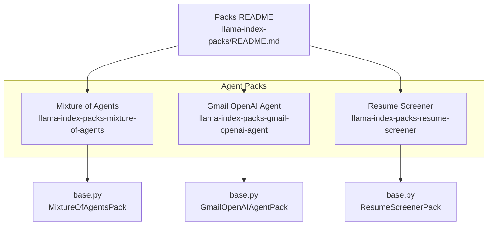
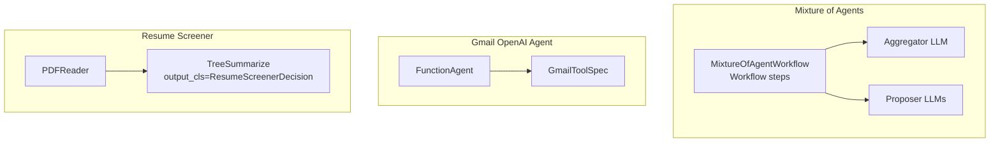
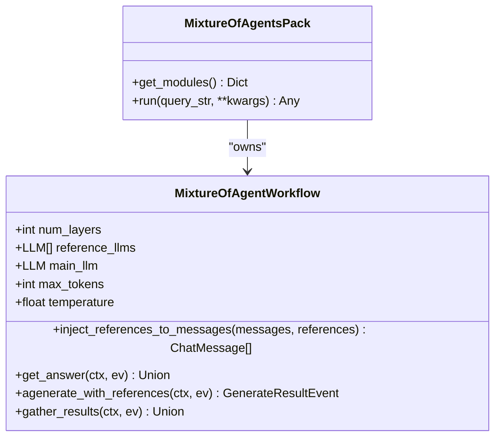
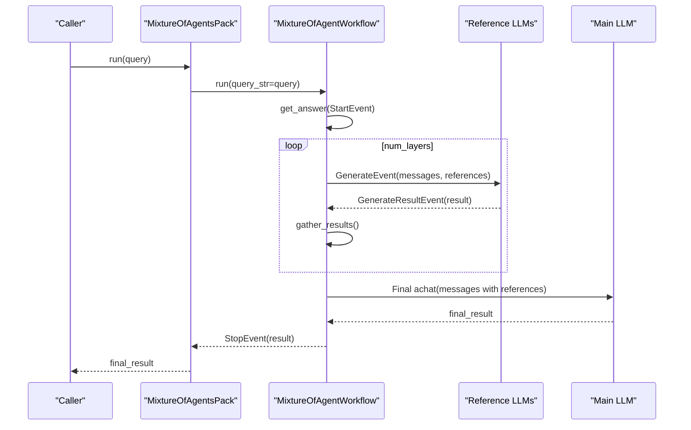
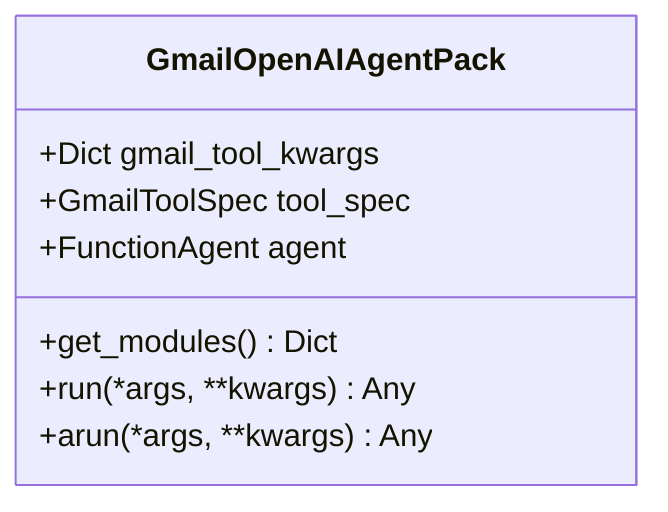
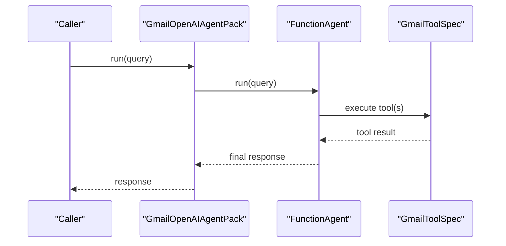
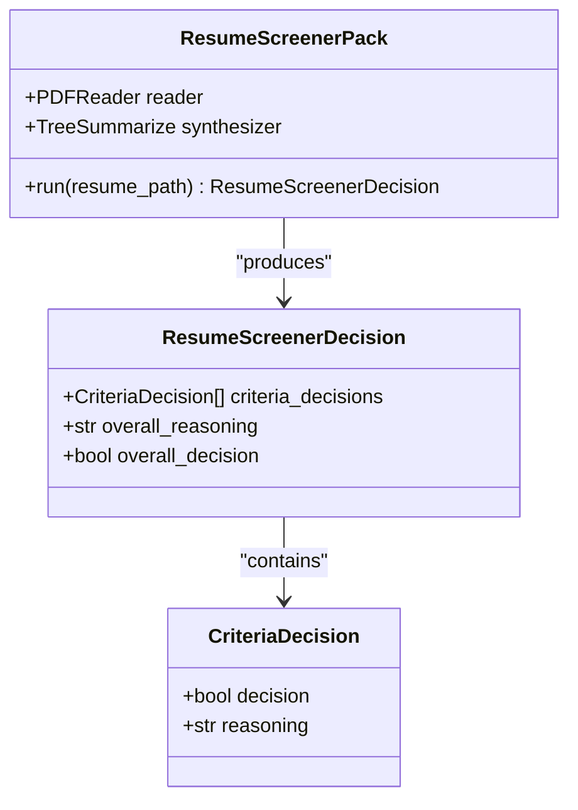
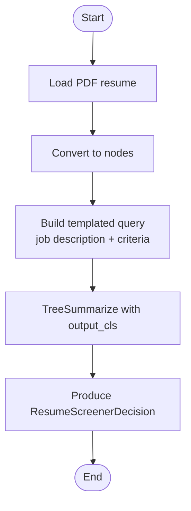
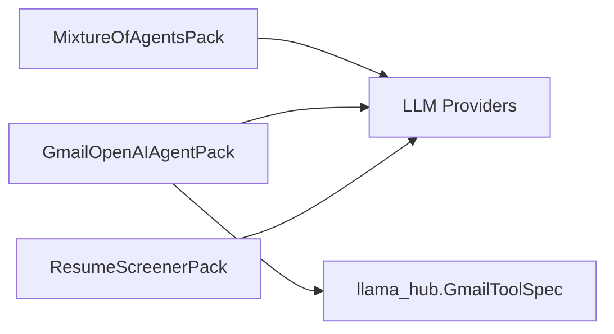

# Agent Packs

<cite>
**Referenced Files in This Document**
- [README.md](file://llama-index-packs/README.md)
- [README.md](file://llama-index-packs/llama-index-packs-mixture-of-agents/README.md)
- [base.py](file://llama-index-packs/llama-index-packs-mixture-of-agents/llama_index/packs/mixture_of_agents/base.py)
- [README.md](file://llama-index-packs/llama-index-packs-gmail-openai-agent/README.md)
- [base.py](file://llama-index-packs/llama-index-packs-gmail-openai-agent/llama_index/packs/gmail_openai_agent/base.py)
- [README.md](file://llama-index-packs/llama-index-packs-resume-screener/README.md)
- [base.py](file://llama-index-packs/llama-index-packs-resume-screener/llama_index/packs/resume_screener/base.py)
</cite>

## Table of Contents
1. [Introduction](#introduction)
2. [Project Structure](#project-structure)
3. [Core Components](#core-components)
4. [Architecture Overview](#architecture-overview)
5. [Detailed Component Analysis](#detailed-component-analysis)
6. [Dependency Analysis](#dependency-analysis)
7. [Performance Considerations](#performance-considerations)
8. [Troubleshooting Guide](#troubleshooting-guide)
9. [Conclusion](#conclusion)
10. [Appendices](#appendices)

## Introduction
This document explains three Agent Packs that provide ready-to-use intelligent agent workflows:
- Mixture of Agents: Orchestrates multiple LLMs in a layered aggregation pattern to refine responses iteratively.
- Gmail OpenAI Agent: Deploys an OpenAI-powered agent preloaded with a Gmail tool for email processing workflows.
- Resume Screener: Automates candidate evaluation by reviewing resumes against a job description and screening criteria.

It covers agent coordination strategies, tool integration patterns, decision-making processes, configuration parameters, personality settings, workflow customization, deployment examples, monitoring and performance optimization, safety considerations, error handling, fallback mechanisms, and integrations with external tools and APIs.

## Project Structure
Agent Packs are distributed as separate Python packages under the llama-index-packs namespace. Each pack includes:
- A base implementation module exporting a BaseLlamaPack subclass
- A README with installation, CLI usage, and code usage examples
- Optional tests and packaging metadata

**Diagram sources**
- [README.md](file://llama-index-packs/README.md#L1-L33)
- [base.py](file://llama-index-packs/llama-index-packs-mixture-of-agents/llama_index/packs/mixture_of_agents/base.py#L156-L183)
- [base.py](file://llama-index-packs/llama-index-packs-gmail-openai-agent/llama_index/packs/gmail_openai_agent/base.py#L13-L38)
- [base.py](file://llama-index-packs/llama-index-packs-resume-screener/llama_index/packs/resume_screener/base.py#L58-L83)

**Section sources**
- [README.md](file://llama-index-packs/README.md#L1-L33)

## Core Components
- Mixture of Agents Pack
  - Implements a layered workflow where proposer LLMs generate diverse responses and aggregator LLMs synthesize them iteratively.
  - Provides configurable layers, token limits, temperature, and timeout.
  - Exposes a run method to execute the workflow.

- Gmail OpenAI Agent Pack
  - Instantiates a FunctionAgent preloaded with a Gmail tool spec powered by OpenAI.
  - Offers a unified run method and exposes internal modules for reuse.

- Resume Screener Pack
  - Loads a PDF resume, synthesizes a structured decision using a templated query, and returns a Pydantic model with per-criterion and overall decisions.

**Section sources**
- [README.md](file://llama-index-packs/llama-index-packs-mixture-of-agents/README.md#L1-L81)
- [base.py](file://llama-index-packs/llama-index-packs-mixture-of-agents/llama_index/packs/mixture_of_agents/base.py#L45-L183)
- [README.md](file://llama-index-packs/llama-index-packs-gmail-openai-agent/README.md#L1-L51)
- [base.py](file://llama-index-packs/llama-index-packs-gmail-openai-agent/llama_index/packs/gmail_openai_agent/base.py#L13-L38)
- [README.md](file://llama-index-packs/llama-index-packs-resume-screener/README.md#L1-L72)
- [base.py](file://llama-index-packs/llama-index-packs-resume-screener/llama_index/packs/resume_screener/base.py#L58-L83)

## Architecture Overview
The Agent Packs leverage LlamaIndex’s LlamaPack base class and core components:
- LlamaPack base class for standardized initialization, module exposure, and execution.
- LLM abstractions for model orchestration.
- Tool specs for integrating external APIs (e.g., Gmail).
- Workflows for multi-step orchestration (Mixture of Agents).
- Readers and response synthesizers for document processing (Resume Screener).

**Diagram sources**
- [base.py](file://llama-index-packs/llama-index-packs-mixture-of-agents/llama_index/packs/mixture_of_agents/base.py#L45-L154)
- [base.py](file://llama-index-packs/llama-index-packs-gmail-openai-agent/llama_index/packs/gmail_openai_agent/base.py#L13-L26)
- [base.py](file://llama-index-packs/llama-index-packs-resume-screener/llama_index/packs/resume_screener/base.py#L58-L82)

## Detailed Component Analysis

### Mixture of Agents Pack
- Purpose: Iterative refinement of LLM responses across multiple layers using proposer and aggregator models.
- Key orchestration:
  - Layered loop: For each layer, proposer LLMs generate references; aggregator synthesizes a final response after all references are collected.
  - Message augmentation: Injects references into the system prompt for the aggregator.
  - Asynchronous workflow: Uses events and a workflow engine to coordinate concurrent proposer calls and collect results.
- Configuration parameters:
  - Aggregator LLM (main_llm)
  - Proposer LLMs (reference_llms)
  - num_layers
  - max_tokens
  - temperature
  - timeout (passed to workflow)
- Personality settings: Controlled via LLM configuration (model selection, temperature, max_tokens).
- Customization options:
  - Adjust num_layers for depth of refinement.
  - Tune temperature for diversity vs. determinism.
  - Swap LLM providers by changing main_llm and reference_llms.
- Safety and error handling:
  - Timeout is configured at the pack level; ensure appropriate values for long-running chains.
  - Consider adding retries and circuit breakers around LLM calls if extending the workflow.
- Monitoring and performance:
  - Track latency per layer and per LLM.
  - Use structured logs and metrics to measure throughput and cost.
  - Consider caching references for repeated queries.

**Diagram sources**
- [base.py](file://llama-index-packs/llama-index-packs-mixture-of-agents/llama_index/packs/mixture_of_agents/base.py#L45-L183)

**Diagram sources**
- [base.py](file://llama-index-packs/llama-index-packs-mixture-of-agents/llama_index/packs/mixture_of_agents/base.py#L84-L154)

**Section sources**
- [README.md](file://llama-index-packs/llama-index-packs-mixture-of-agents/README.md#L1-L81)
- [base.py](file://llama-index-packs/llama-index-packs-mixture-of-agents/llama_index/packs/mixture_of_agents/base.py#L45-L183)

### Gmail OpenAI Agent Pack
- Purpose: Email processing workflows using an OpenAI agent integrated with Gmail.
- Tool integration:
  - GmailToolSpec provides a tool list consumable by FunctionAgent.
  - Requires llama_hub installation for Gmail tool support.
- Agent personality settings:
  - Configurable via LLM model selection and tool usage.
- Customization options:
  - Pass gmail_tool_kwargs during initialization to configure the Gmail tool.
  - Replace the agent type or LLM if needed.
- Safety and error handling:
  - Import-time check ensures llama_hub is present.
  - Wrap run calls with timeouts and retry logic when invoking external APIs.
- Monitoring and performance:
  - Track agent tool invocations and LLM calls.
  - Monitor Gmail API quotas and rate limits.

**Diagram sources**
- [base.py](file://llama-index-packs/llama-index-packs-gmail-openai-agent/llama_index/packs/gmail_openai_agent/base.py#L13-L38)

**Diagram sources**
- [base.py](file://llama-index-packs/llama-index-packs-gmail-openai-agent/llama_index/packs/gmail_openai_agent/base.py#L31-L37)

**Section sources**
- [README.md](file://llama-index-packs/llama-index-packs-gmail-openai-agent/README.md#L1-L51)
- [base.py](file://llama-index-packs/llama-index-packs-gmail-openai-agent/llama_index/packs/gmail_openai_agent/base.py#L13-L38)

### Resume Screener Pack
- Purpose: Automated candidate evaluation by scoring resumes against a job description and criteria.
- Decision-making process:
  - Reads resume PDF into nodes.
  - Builds a templated query incorporating job description and criteria.
  - Uses TreeSummarize with a structured output class to produce per-criterion and overall decisions.
- Configuration parameters:
  - job_description: Target role requirements.
  - criteria: List of screening items.
  - llm: Optional override for the underlying LLM.
- Personality settings:
  - Controlled by the chosen LLM model and summarization settings.
- Customization options:
  - Modify QUERY_TEMPLATE to adjust reasoning prompts.
  - Extend criteria dynamically per use case.
- Safety and error handling:
  - Ensure PDF parsing succeeds; handle missing files and invalid content gracefully.
  - Validate that the LLM returns a complete Pydantic response.
- Monitoring and performance:
  - Track summarization cost and latency.
  - Cache repeated evaluations for identical resumes and criteria.

**Diagram sources**
- [base.py](file://llama-index-packs/llama-index-packs-resume-screener/llama_index/packs/resume_screener/base.py#L30-L49)
- [base.py](file://llama-index-packs/llama-index-packs-resume-screener/llama_index/packs/resume_screener/base.py#L58-L83)

**Diagram sources**
- [base.py](file://llama-index-packs/llama-index-packs-resume-screener/llama_index/packs/resume_screener/base.py#L75-L82)

**Section sources**
- [README.md](file://llama-index-packs/llama-index-packs-resume-screener/README.md#L1-L72)
- [base.py](file://llama-index-packs/llama-index-packs-resume-screener/llama_index/packs/resume_screener/base.py#L58-L83)

## Dependency Analysis
- External tool dependencies:
  - Gmail OpenAI Agent requires llama_hub for GmailToolSpec.
- Model provider dependencies:
  - Mixture of Agents and Resume Screener default to OpenAI; can be adapted to other providers by swapping LLM instances.
- Packaging and distribution:
  - Each pack is published as a separate pip package for easy installation and templating.

**Diagram sources**
- [base.py](file://llama-index-packs/llama-index-packs-gmail-openai-agent/llama_index/packs/gmail_openai_agent/base.py#L16-L25)
- [base.py](file://llama-index-packs/llama-index-packs-mixture-of-agents/llama_index/packs/mixture_of_agents/base.py#L56-L60)
- [base.py](file://llama-index-packs/llama-index-packs-resume-screener/llama_index/packs/resume_screener/base.py#L6-L8)

**Section sources**
- [README.md](file://llama-index-packs/README.md#L1-L33)
- [base.py](file://llama-index-packs/llama-index-packs-gmail-openai-agent/llama_index/packs/gmail_openai_agent/base.py#L16-L25)

## Performance Considerations
- Parallelism:
  - Mixture of Agents executes proposer LLM calls concurrently; ensure adequate concurrency limits and timeouts.
- Token and cost control:
  - Set max_tokens and temperature thoughtfully; monitor per-layer costs.
- Caching:
  - Cache references and intermediate results where feasible to reduce redundant LLM calls.
- Throughput:
  - Batch or pipeline document processing (Resume Screener) and limit concurrent agent runs.
- Observability:
  - Instrument LLM calls, tool invocations, and workflow steps with timing and error metrics.

## Troubleshooting Guide
- Missing dependencies:
  - Gmail OpenAI Agent raises an ImportError if llama_hub is not installed; install the required extras.
- Timeout handling:
  - Configure timeout in the Mixture of Agents pack to avoid hanging workflows.
- Output validation:
  - Resume Screener expects a complete structured response; validate output_cls compliance and handle partial outputs.
- Tool failures:
  - Wrap tool execution with retries and circuit breakers; log errors and provide fallback responses.

**Section sources**
- [base.py](file://llama-index-packs/llama-index-packs-gmail-openai-agent/llama_index/packs/gmail_openai_agent/base.py#L16-L25)
- [base.py](file://llama-index-packs/llama-index-packs-mixture-of-agents/llama_index/packs/mixture_of_agents/base.py#L164-L168)
- [base.py](file://llama-index-packs/llama-index-packs-resume-screener/llama_index/packs/resume_screener/base.py#L75-L82)

## Conclusion
Agent Packs deliver production-ready templates for multi-agent orchestration, email automation, and document-driven decision-making. By leveraging LlamaIndex’s LlamaPack interface, these packs enable rapid deployment, customization, and safe operation across diverse workflows. Use the provided configuration knobs, integrate external tools, and instrument for observability to achieve robust and scalable agent systems.

## Appendices
- Deployment checklist:
  - Install the desired pack via pip or download as a template.
  - Configure environment variables for model providers.
  - Initialize packs with appropriate LLMs and parameters.
  - Integrate tools and external APIs securely.
  - Monitor latency, tokens, and costs; implement retries and fallbacks.
- Example references:
  - Mixture of Agents usage and parameters are demonstrated in the pack’s README and base implementation.
  - Gmail OpenAI Agent usage and tool integration are documented in its README and base implementation.
  - Resume Screener usage and decision schema are described in its README and base implementation.