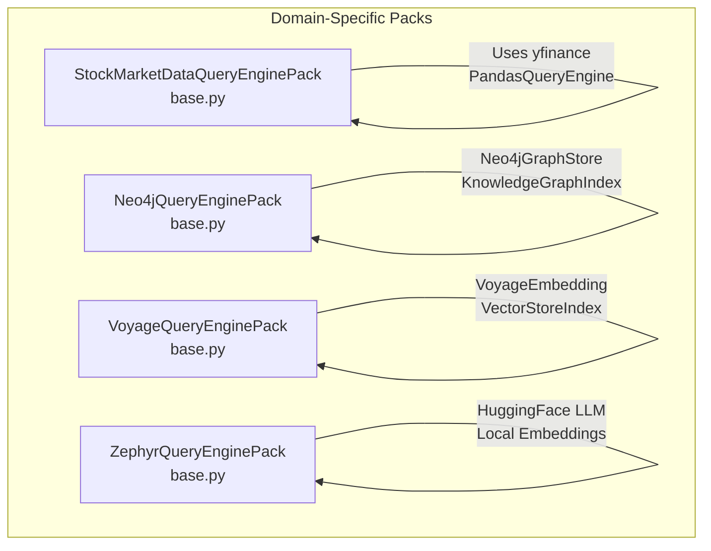
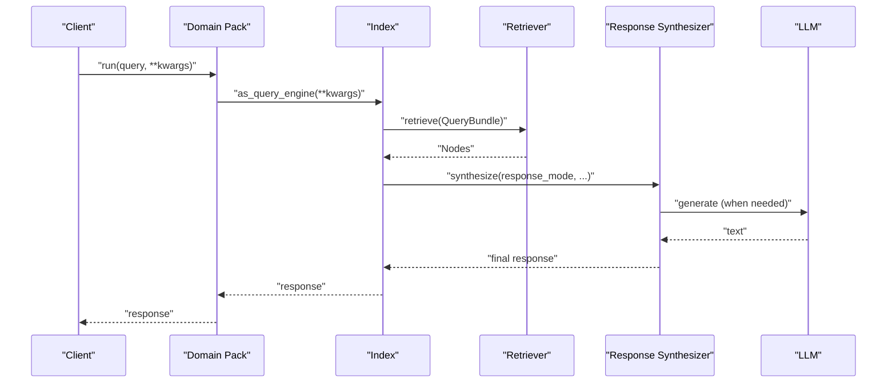
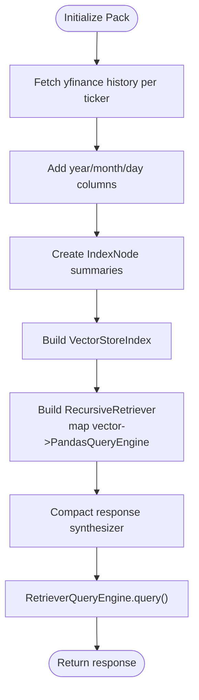
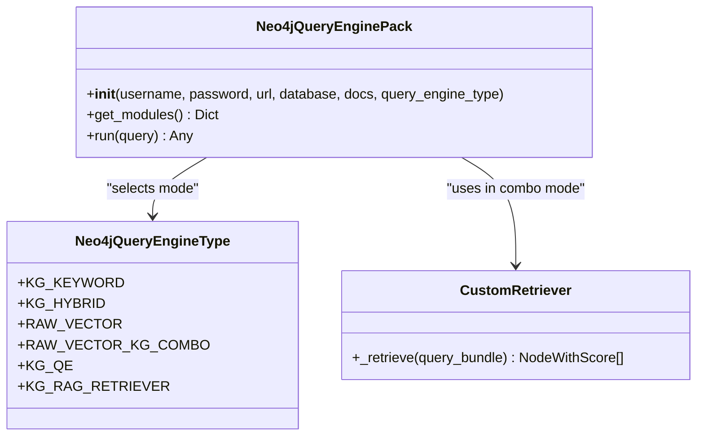
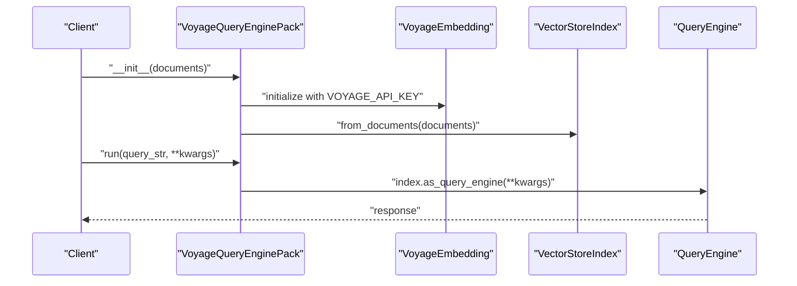
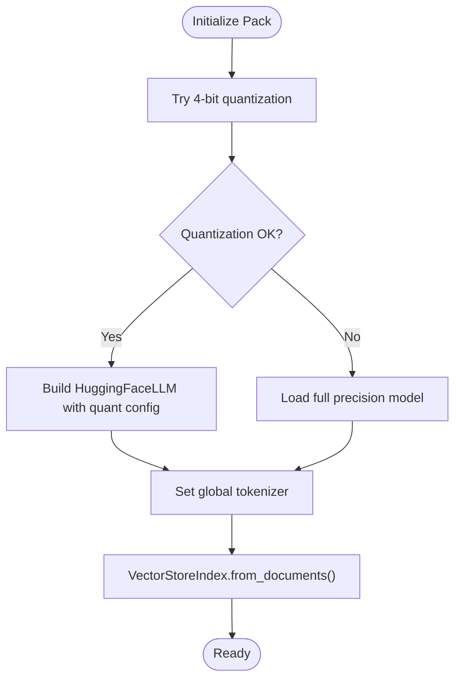
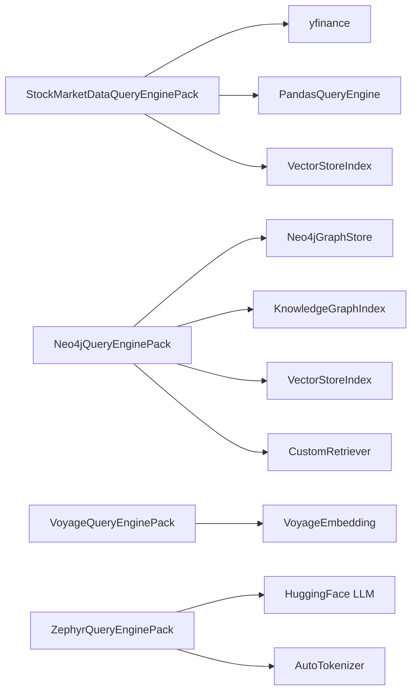

# Domain-Specific Packs

<cite>
**Referenced Files in This Document**
- [README.md](file://llama-index-packs/README.md)
- [README.md](file://llama-index-packs/llama-index-packs-stock-market-data-query-engine/README.md)
- [base.py](file://llama-index-packs/llama-index-packs-stock-market-data-query-engine/llama_index/packs/stock_market_data_query_engine/base.py)
- [README.md](file://llama-index-packs/llama-index-packs-neo4j-query-engine/README.md)
- [base.py](file://llama-index-packs/llama-index-packs-neo4j-query-engine/llama_index/packs/neo4j_query_engine/base.py)
- [README.md](file://llama-index-packs/llama-index-packs-voyage-query-engine/README.md)
- [base.py](file://llama-index-packs/llama-index-packs-voyage-query-engine/llama_index/packs/voyage_query_engine/base.py)
- [README.md](file://llama-index-packs/llama-index-packs-zephyr-query-engine/README.md)
- [base.py](file://llama-index-packs/llama-index-packs-zephyr-query-engine/llama_index/packs/zephyr_query_engine/base.py)
</cite>

## Table of Contents
1. [Introduction](#introduction)
2. [Project Structure](#project-structure)
3. [Core Components](#core-components)
4. [Architecture Overview](#architecture-overview)
5. [Detailed Component Analysis](#detailed-component-analysis)
6. [Dependency Analysis](#dependency-analysis)
7. [Performance Considerations](#performance-considerations)
8. [Troubleshooting Guide](#troubleshooting-guide)
9. [Conclusion](#conclusion)
10. [Appendices](#appendices)

## Introduction
This document describes Domain-Specific Packs designed for specialized use cases and industries. It focuses on four packs:
- Stock Market Data Query Engine for financial analysis
- Neo4j Query Engine for graph-based queries
- Voyage Query Engine for multi-modal retrieval leveraging Voyage embeddings
- Zephyr Query Engine for specialized LLM integration using fully local/private models

It explains domain-specific optimizations, data processing workflows, configuration requirements, security and compliance considerations, and integration patterns with domain-specific tools and platforms.

## Project Structure
The Domain-Specific Packs are distributed as separate Python packages under the llama-index-packs namespace. Each pack provides:
- A base implementation class extending BaseLlamaPack
- A README with installation, usage, and examples
- Optional example notebooks or scripts
- Tests and packaging metadata

Key locations:
- Stock Market Data Query Engine Pack: [README.md](file://llama-index-packs/llama-index-packs-stock-market-data-query-engine/README.md), [base.py](file://llama-index-packs/llama-index-packs-stock-market-data-query-engine/llama_index/packs/stock_market_data_query_engine/base.py)
- Neo4j Query Engine Pack: [README.md](file://llama-index-packs/llama-index-packs-neo4j-query-engine/README.md), [base.py](file://llama-index-packs/llama-index-packs-neo4j-query-engine/llama_index/packs/neo4j_query_engine/base.py)
- Voyage Query Engine Pack: [README.md](file://llama-index-packs/llama-index-packs-voyage-query-engine/README.md), [base.py](file://llama-index-packs/llama-index-packs-voyage-query-engine/llama_index/packs/voyage_query_engine/base.py)
- Zephyr Query Engine Pack: [README.md](file://llama-index-packs/llama-index-packs-zephyr-query-engine/README.md), [base.py](file://llama-index-packs/llama-index-packs-zephyr-query-engine/llama_index/packs/zephyr_query_engine/base.py)

**Diagram sources**
- [base.py](file://llama-index-packs/llama-index-packs-stock-market-data-query-engine/llama_index/packs/stock_market_data_query_engine/base.py#L1-L96)
- [base.py](file://llama-index-packs/llama-index-packs-neo4j-query-engine/llama_index/packs/neo4j_query_engine/base.py#L1-L200)
- [base.py](file://llama-index-packs/llama-index-packs-voyage-query-engine/llama_index/packs/voyage_query_engine/base.py#L1-L31)
- [base.py](file://llama-index-packs/llama-index-packs-zephyr-query-engine/llama_index/packs/zephyr_query_engine/base.py#L1-L91)

**Section sources**
- [README.md](file://llama-index-packs/README.md#L1-L33)

## Core Components
- Stock Market Data Query Engine Pack
  - Purpose: Historical stock price retrieval and summarization using Yahoo Finance and PandasQueryEngine, integrated with a recursive retriever and compact response synthesis.
  - Key parameters: tickers list, period and other yfinance history kwargs, optional LLM override.
  - Output: Query engine configured for time-series data queries.

- Neo4j Query Engine Pack
  - Purpose: Multiple query engine modes over a knowledge graph built from documents and persisted in Neo4j, including keyword/hybrid/kg query engines, raw vector retrieval, and a custom combo retriever.
  - Key parameters: Neo4j connection (username, password, url, database), documents, query_engine_type selection.
  - Output: Configurable query engine supporting graph-aware retrieval and synthesis.

- Voyage Query Engine Pack
  - Purpose: Query engine using GPT-4 and Voyage embeddings for multi-modal retrieval scenarios.
  - Key parameters: Documents, Voyage API key via environment variable.
  - Output: Index and query engine configured with Voyage embeddings.

- Zephyr Query Engine Pack
  - Purpose: Fully local/private deployment using Zephyr-7B LLM and BAAI bge-base-en-v1.5 embeddings; includes 4-bit quantization fallback.
  - Key parameters: Documents, environment-dependent model loading.
  - Output: Local LLM and index with local embeddings.

**Section sources**
- [README.md](file://llama-index-packs/llama-index-packs-stock-market-data-query-engine/README.md#L1-L47)
- [base.py](file://llama-index-packs/llama-index-packs-stock-market-data-query-engine/llama_index/packs/stock_market_data_query_engine/base.py#L1-L96)
- [README.md](file://llama-index-packs/llama-index-packs-neo4j-query-engine/README.md#L1-L110)
- [base.py](file://llama-index-packs/llama-index-packs-neo4j-query-engine/llama_index/packs/neo4j_query_engine/base.py#L1-L200)
- [README.md](file://llama-index-packs/llama-index-packs-voyage-query-engine/README.md#L1-L49)
- [base.py](file://llama-index-packs/llama-index-packs-voyage-query-engine/llama_index/packs/voyage_query_engine/base.py#L1-L31)
- [README.md](file://llama-index-packs/llama-index-packs-zephyr-query-engine/README.md#L1-L53)
- [base.py](file://llama-index-packs/llama-index-packs-zephyr-query-engine/llama_index/packs/zephyr_query_engine/base.py#L1-L91)

## Architecture Overview
Each pack composes domain-specific components into a cohesive query pipeline:
- Data ingestion and preprocessing (where applicable)
- Index construction (vector, knowledge graph, or hybrid)
- Retrieval and synthesis
- Optional integration with external APIs or local models

[No sources needed since this diagram shows conceptual workflow, not actual code structure]

## Detailed Component Analysis

### Stock Market Data Query Engine Pack
- Data ingestion: Iterates tickers, fetches historical OHLCV data via yfinance, enriches with year/month/day features, and stores per-ticker DataFrames.
- Indexing: Creates IndexNode summaries per ticker and builds a VectorStoreIndex for retrieval.
- Retrieval: Uses a RecursiveRetriever mapping vector similarity to individual PandasQueryEngine instances per ticker.
- Synthesis: Applies a compact response synthesizer to produce concise answers.
- LLM: Defaults to OpenAI GPT-4; can be overridden.

**Diagram sources**
- [base.py](file://llama-index-packs/llama-index-packs-stock-market-data-query-engine/llama_index/packs/stock_market_data_query_engine/base.py#L24-L83)

**Section sources**
- [README.md](file://llama-index-packs/llama-index-packs-stock-market-data-query-engine/README.md#L1-L47)
- [base.py](file://llama-index-packs/llama-index-packs-stock-market-data-query-engine/llama_index/packs/stock_market_data_query_engine/base.py#L1-L96)

### Neo4j Query Engine Pack
- Graph store: Neo4jGraphStore persists triplets extracted from documents.
- Indexing: KnowledgeGraphIndex built from documents with embeddings; optional raw vector index from chunked nodes.
- Retrievers: Supports keyword, hybrid, and custom combo retrievers combining vector and KG retrievers.
- Modes: Multiple query engine types selectable via enum, including KG query engine and RAG retriever variants.
- LLM: Defaults to OpenAI GPT-3.5-turbo; configurable.

**Diagram sources**
- [base.py](file://llama-index-packs/llama-index-packs-neo4j-query-engine/llama_index/packs/neo4j_query_engine/base.py#L26-L35)
- [base.py](file://llama-index-packs/llama-index-packs-neo4j-query-engine/llama_index/packs/neo4j_query_engine/base.py#L167-L200)

**Section sources**
- [README.md](file://llama-index-packs/llama-index-packs-neo4j-query-engine/README.md#L1-L110)
- [base.py](file://llama-index-packs/llama-index-packs-neo4j-query-engine/llama_index/packs/neo4j_query_engine/base.py#L1-L200)

### Voyage Query Engine Pack
- Embeddings: Uses Voyage AI embeddings via VoyageEmbedding with API key from environment.
- Indexing: Builds a VectorStoreIndex from documents.
- Querying: Returns a query engine configured with Voyage embeddings and GPT-4 LLM.

**Diagram sources**
- [base.py](file://llama-index-packs/llama-index-packs-voyage-query-engine/llama_index/packs/voyage_query_engine/base.py#L11-L31)

**Section sources**
- [README.md](file://llama-index-packs/llama-index-packs-voyage-query-engine/README.md#L1-L49)
- [base.py](file://llama-index-packs/llama-index-packs-voyage-query-engine/llama_index/packs/voyage_query_engine/base.py#L1-L31)

### Zephyr Query Engine Pack
- LLM: HuggingFace LLM using Zephyr-7B with 4-bit quantization when CUDA is available; falls back to full precision otherwise.
- Embeddings: Local BGE embeddings via "local:BAAI/bge-base-en-v1.5".
- Indexing: VectorStoreIndex from documents.
- Tokenizer: Global tokenizer set for accurate token counting.

**Diagram sources**
- [base.py](file://llama-index-packs/llama-index-packs-zephyr-query-engine/llama_index/packs/zephyr_query_engine/base.py#L13-L91)

**Section sources**
- [README.md](file://llama-index-packs/llama-index-packs-zephyr-query-engine/README.md#L1-L53)
- [base.py](file://llama-index-packs/llama-index-packs-zephyr-query-engine/llama_index/packs/zephyr_query_engine/base.py#L1-L91)

## Dependency Analysis
- External libraries and integrations:
  - yfinance for stock market data
  - Neo4jGraphStore for graph persistence
  - VoyageEmbedding for embeddings
  - HuggingFace LLM and tokenizer for local inference
- Internal LlamaIndex components:
  - VectorStoreIndex, KnowledgeGraphIndex, RecursiveRetriever, RetrieverQueryEngine, ResponseSynthesizer, StorageContext

**Diagram sources**
- [base.py](file://llama-index-packs/llama-index-packs-stock-market-data-query-engine/llama_index/packs/stock_market_data_query_engine/base.py#L1-L96)
- [base.py](file://llama-index-packs/llama-index-packs-neo4j-query-engine/llama_index/packs/neo4j_query_engine/base.py#L1-L200)
- [base.py](file://llama-index-packs/llama-index-packs-voyage-query-engine/llama_index/packs/voyage_query_engine/base.py#L1-L31)
- [base.py](file://llama-index-packs/llama-index-packs-zephyr-query-engine/llama_index/packs/zephyr_query_engine/base.py#L1-L91)

**Section sources**
- [base.py](file://llama-index-packs/llama-index-packs-stock-market-data-query-engine/llama_index/packs/stock_market_data_query_engine/base.py#L1-L96)
- [base.py](file://llama-index-packs/llama-index-packs-neo4j-query-engine/llama_index/packs/neo4j_query_engine/base.py#L1-L200)
- [base.py](file://llama-index-packs/llama-index-packs-voyage-query-engine/llama_index/packs/voyage_query_engine/base.py#L1-L31)
- [base.py](file://llama-index-packs/llama-index-packs-zephyr-query-engine/llama_index/packs/zephyr_query_engine/base.py#L1-L91)

## Performance Considerations
- Stock Market Data Query Engine Pack
  - Data preprocessing adds derived date features; ensure appropriate chunk sizes for downstream retrievers.
  - Using a compact response synthesizer reduces overhead for time-series summaries.
  - Consider caching or precomputing frequently accessed periods to reduce repeated yfinance calls.

- Neo4j Query Engine Pack
  - Hybrid retrieval and KG combo modes increase latency; tune similarity_top_k and explore_global_knowledge for balance.
  - Persist triplets and embeddings in Neo4j to avoid recomputation; batch document ingestion for large corpora.

- Voyage Query Engine Pack
  - Embedding latency depends on API throughput; consider batching queries and caching frequent results.
  - Tune similarity_top_k to balance recall and latency.

- Zephyr Query Engine Pack
  - 4-bit quantization improves throughput but may reduce accuracy; monitor quality vs. speed trade-offs.
  - Device_map="auto" enables GPU utilization; ensure sufficient VRAM for batch sizes.

[No sources needed since this section provides general guidance]

## Troubleshooting Guide
- Stock Market Data Query Engine Pack
  - Missing yfinance dependency: Install via pip as indicated in the pack’s import guard.
  - Unexpected empty results: Verify tickers and period arguments passed to history().

- Neo4j Query Engine Pack
  - Authentication failures: Confirm username, password, url, and database parameters.
  - Mode selection: Ensure query_engine_type matches supported enum values.

- Voyage Query Engine Pack
  - Missing VOYAGE_API_KEY: Set the environment variable before initialization.
  - Slow responses: Check network connectivity and consider reducing similarity_top_k.

- Zephyr Query Engine Pack
  - CUDA/accelerate issues: The pack attempts 4-bit quantization and falls back to full precision; ensure torch and transformers are installed.
  - Tokenizer errors: Global tokenizer is set during initialization; ensure consistent encoding behavior.

**Section sources**
- [base.py](file://llama-index-packs/llama-index-packs-stock-market-data-query-engine/llama_index/packs/stock_market_data_query_engine/base.py#L24-L28)
- [base.py](file://llama-index-packs/llama-index-packs-neo4j-query-engine/llama_index/packs/neo4j_query_engine/base.py#L40-L64)
- [base.py](file://llama-index-packs/llama-index-packs-voyage-query-engine/llama_index/packs/voyage_query_engine/base.py#L14-L16)
- [base.py](file://llama-index-packs/llama-index-packs-zephyr-query-engine/llama_index/packs/zephyr_query_engine/base.py#L15-L22)
- [base.py](file://llama-index-packs/llama-index-packs-zephyr-query-engine/llama_index/packs/zephyr_query_engine/base.py#L49-L69)

## Conclusion
These Domain-Specific Packs encapsulate best practices for financial time-series retrieval, graph-based knowledge discovery, multi-modal embedding-driven retrieval, and fully local LLM integration. They provide modular, configurable pipelines suitable for production deployment with careful attention to performance, security, and compliance.

[No sources needed since this section summarizes without analyzing specific files]

## Appendices

### Configuration Requirements and Parameters
- Stock Market Data Query Engine Pack
  - Parameters: tickers (list), period and other yfinance history kwargs, optional LLM override.
  - Dependencies: yfinance.

- Neo4j Query Engine Pack
  - Parameters: username, password, url, database, docs (List[Document]), query_engine_type (enum).
  - Dependencies: Neo4jGraphStore, KnowledgeGraphIndex, VectorStoreIndex.

- Voyage Query Engine Pack
  - Parameters: documents (List[Document]).
  - Environment: VOYAGE_API_KEY.
  - Dependencies: VoyageEmbedding.

- Zephyr Query Engine Pack
  - Parameters: documents (List[Document]).
  - Dependencies: HuggingFace LLM, transformers, torch, bitsandbytes (optional for quantization).

**Section sources**
- [README.md](file://llama-index-packs/llama-index-packs-stock-market-data-query-engine/README.md#L30-L38)
- [base.py](file://llama-index-packs/llama-index-packs-stock-market-data-query-engine/llama_index/packs/stock_market_data_query_engine/base.py#L16-L21)
- [README.md](file://llama-index-packs/llama-index-packs-neo4j-query-engine/README.md#L53-L81)
- [base.py](file://llama-index-packs/llama-index-packs-neo4j-query-engine/llama_index/packs/neo4j_query_engine/base.py#L40-L49)
- [README.md](file://llama-index-packs/llama-index-packs-voyage-query-engine/README.md#L15-L29)
- [base.py](file://llama-index-packs/llama-index-packs-voyage-query-engine/llama_index/packs/voyage_query_engine/base.py#L12-L21)
- [README.md](file://llama-index-packs/llama-index-packs-zephyr-query-engine/README.md#L15-L29)
- [base.py](file://llama-index-packs/llama-index-packs-zephyr-query-engine/llama_index/packs/zephyr_query_engine/base.py#L13-L82)

### Security, Compliance, and Data Governance
- Data handling
  - Stock Market Data: Ensure compliance with data provider terms; apply access controls on data sources.
  - Neo4j: Enforce secure credentials and TLS; restrict database permissions.
  - Voyage: Protect API keys; limit embedding usage according to vendor SLAs.
  - Zephyr: Keep models and embeddings local; enforce data residency policies.
- Privacy
  - Minimize sensitive data exposure; consider anonymization or synthetic data for training.
- Auditability
  - Log query intents and responses where feasible; track model and embedding usage.

[No sources needed since this section provides general guidance]

### Integration Patterns
- Financial dashboards and ETL pipelines: Use the Stock Market Data Query Engine Pack to power analytics and alerts.
- Knowledge graphs and semantic search: Integrate Neo4j Query Engine Pack with graph databases for regulatory or scientific domains.
- Multi-modal retrieval: Combine Voyage embeddings with document loaders for heterogeneous content.
- Edge and offline systems: Deploy Zephyr Query Engine Pack for private, on-premises deployments.

[No sources needed since this section provides general guidance]