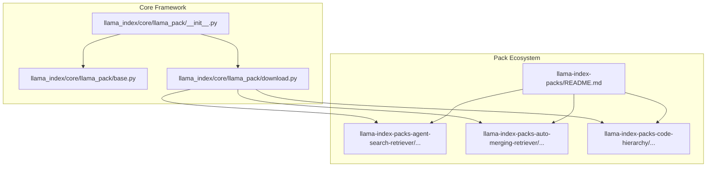
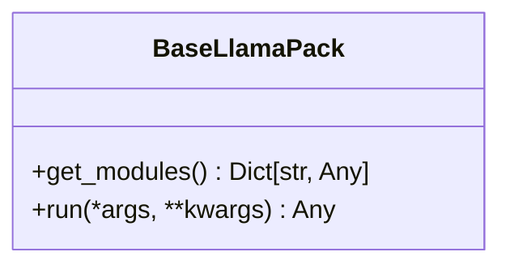
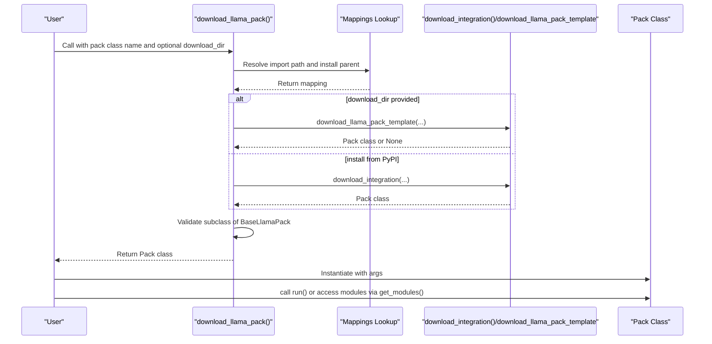
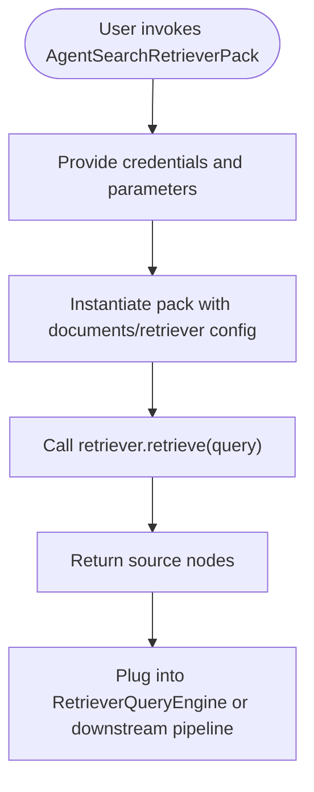
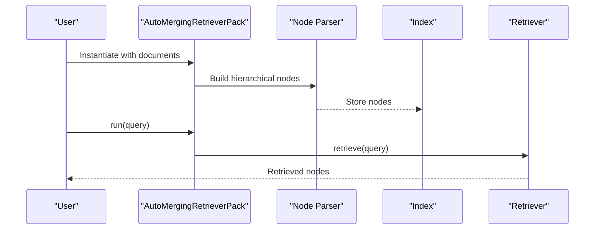
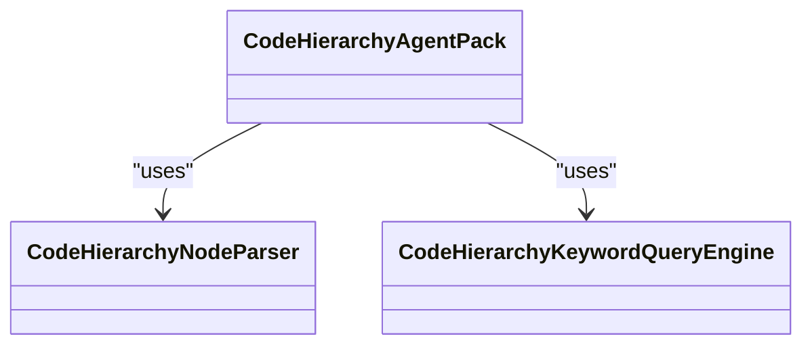
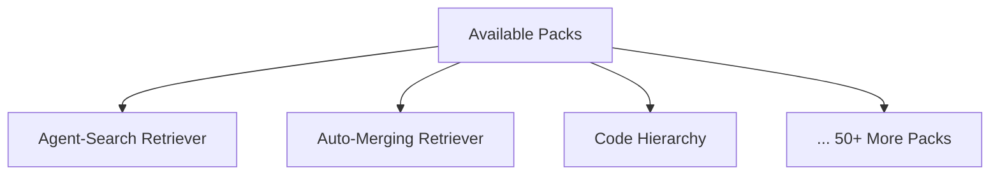
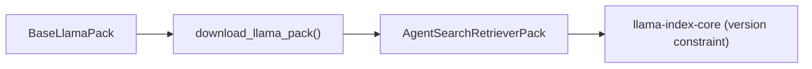

# LlamaPacks

<cite>
**Referenced Files in This Document**
- [README.md](file://llama-index-packs/README.md)
- [base.py](file://llama-index-core/llama_index/core/llama_pack/base.py)
- [download.py](file://llama-index-core/llama_index/core/llama_pack/download.py)
- [__init__.py](file://llama-index-core/llama_index/core/llama_pack/__init__.py)
- [README.md](file://llama-index-packs/llama-index-packs-agent-search-retriever/README.md)
- [pyproject.toml](file://llama-index-packs/llama-index-packs-agent-search-retriever/pyproject.toml)
- [README.md](file://llama-index-packs/llama-index-packs-auto-merging-retriever/README.md)
- [example.py](file://llama-index-packs/llama-index-packs-auto-merging-retriever/examples/example.py)
- [__init__.py](file://llama-index-packs/llama-index-packs-agent-search-retriever/llama_index/packs/agent_search_retriever/__init__.py)
- [__init__.py](file://llama-index-packs/llama-index-packs-auto-merging-retriever/llama_index/packs/auto_merging_retriever/__init__.py)
- [__init__.py](file://llama-index-packs/llama-index-packs-code-hierarchy/llama_index/packs/code_hierarchy/__init__.py)
</cite>

## Table of Contents
1. [Introduction](#introduction)
2. [Project Structure](#project-structure)
3. [Core Components](#core-components)
4. [Architecture Overview](#architecture-overview)
5. [Detailed Component Analysis](#detailed-component-analysis)
6. [Dependency Analysis](#dependency-analysis)
7. [Performance Considerations](#performance-considerations)
8. [Troubleshooting Guide](#troubleshooting-guide)
9. [Conclusion](#conclusion)
10. [Appendices](#appendices)

## Introduction
LlamaPacks are pre-built application templates designed to accelerate common Retrieval-Augmented Generation (RAG) use cases. They encapsulate end-to-end workflows (e.g., retrieval, query engines, agents) into reusable, configurable components that integrate seamlessly with the core LlamaIndex framework. Users can either install ready-made packs from PyPI or download them as templates for customization.

Key goals:
- Provide production-ready RAG building blocks
- Standardize pack interfaces and lifecycle
- Enable rapid prototyping and deployment
- Support extensibility and customization

## Project Structure
The LlamaPacks ecosystem is organized into two primary areas:
- Core pack framework: Defines the BaseLlamaPack interface and the download mechanism used to fetch packs from PyPI or as templates.
- Pack implementations: Individual repositories under llama-index-packs/<pack-name>, each exposing a Python package with a consistent structure (package namespace, entry points, examples, and metadata).

**Diagram sources**
- [__init__.py](file://llama-index-core/llama_index/core/llama_pack/__init__.py#L1-L10)
- [base.py](file://llama-index-core/llama_index/core/llama_pack/base.py#L1-L15)
- [download.py](file://llama-index-core/llama_index/core/llama_pack/download.py#L1-L75)
- [README.md](file://llama-index-packs/README.md#L1-L33)

**Section sources**
- [README.md](file://llama-index-packs/README.md#L1-L33)
- [__init__.py](file://llama-index-core/llama_index/core/llama_pack/__init__.py#L1-L10)
- [base.py](file://llama-index-core/llama_index/core/llama_pack/base.py#L1-L15)
- [download.py](file://llama-index-core/llama_index/core/llama_pack/download.py#L1-L75)

## Core Components
- BaseLlamaPack: An abstract interface requiring two methods:
  - get_modules(): returns a dictionary of internal modules (e.g., retriever, query engine, node parser)
  - run(*args, **kwargs): executes the pack’s primary workflow
- download_llama_pack(): A function that resolves pack class names to their Python package names, installs or downloads the template, and validates that the resulting class inherits from BaseLlamaPack.

**Diagram sources**
- [base.py](file://llama-index-core/llama_index/core/llama_pack/base.py#L7-L15)

**Section sources**
- [base.py](file://llama-index-core/llama_index/core/llama_pack/base.py#L1-L15)

## Architecture Overview
The LlamaPacks architecture follows a standardized pattern:
- Discovery and resolution: The framework maps a pack class name to its Python package name and determines whether to install from PyPI or download a template.
- Template acquisition: If a download directory is provided, the pack is fetched as a template and validated against BaseLlamaPack.
- Instantiation and usage: The returned class is instantiated with user-provided arguments and exposes get_modules() and run() for integration into larger systems.

**Diagram sources**
- [download.py](file://llama-index-core/llama_index/core/llama_pack/download.py#L14-L75)
- [__init__.py](file://llama-index-core/llama_index/core/llama_pack/__init__.py#L3-L9)

**Section sources**
- [download.py](file://llama-index-core/llama_index/core/llama_pack/download.py#L1-L75)
- [__init__.py](file://llama-index-core/llama_index/core/llama_pack/__init__.py#L1-L10)

## Detailed Component Analysis

### Agent-Search Retriever Pack
- Purpose: Provides a retriever backed by the AgentSearch API or hosted search providers, enabling retrieval from large-scale indexed datasets or web search engines.
- Usage patterns:
  - CLI download via llamaindex-cli
  - Programmatic download using download_llama_pack() and instantiation with configuration (e.g., API key, top-k, provider)
  - Integration with RetrieverQueryEngine or direct retriever usage
- Key capabilities:
  - Exposes retriever and run() wrapper around retriever.retrieve()
  - Supports integration with LlamaIndex query engines

**Diagram sources**
- [README.md](file://llama-index-packs/llama-index-packs-agent-search-retriever/README.md#L21-L60)

**Section sources**
- [README.md](file://llama-index-packs/llama-index-packs-agent-search-retriever/README.md#L1-L60)
- [pyproject.toml](file://llama-index-packs/llama-index-packs-agent-search-retriever/pyproject.toml#L26-L40)
- [__init__.py](file://llama-index-packs/llama-index-packs-agent-search-retriever/llama_index/packs/agent_search_retriever/__init__.py#L1-L7)

### Auto-Merging Retriever Pack
- Purpose: Demonstrates hierarchical node parsing and retrieval with auto-merging, useful for long documents and multi-level indexing.
- Usage patterns:
  - Download as template
  - Instantiate with documents
  - Access node_parser, retriever, and query_engine individually or use run() wrapper

**Diagram sources**
- [README.md](file://llama-index-packs/llama-index-packs-auto-merging-retriever/README.md#L21-L66)
- [example.py](file://llama-index-packs/llama-index-packs-auto-merging-retriever/examples/example.py#L1-L18)

**Section sources**
- [README.md](file://llama-index-packs/llama-index-packs-auto-merging-retriever/README.md#L1-L66)
- [example.py](file://llama-index-packs/llama-index-packs-auto-merging-retriever/examples/example.py#L1-L18)
- [__init__.py](file://llama-index-packs/llama-index-packs-auto-merging-retriever/llama_index/packs/auto_merging_retriever/__init__.py#L1-L4)

### Code Hierarchy Pack
- Purpose: Specialized for codebases, offering a CodeHierarchyNodeParser and a CodeHierarchyKeywordQueryEngine, along with a CodeHierarchyAgentPack for agent-driven code exploration.
- Key exports: CodeHierarchyAgentPack, CodeHierarchyNodeParser, CodeHierarchyKeywordQueryEngine

**Diagram sources**
- [__init__.py](file://llama-index-packs/llama-index-packs-code-hierarchy/llama_index/packs/code_hierarchy/__init__.py#L1-L12)

**Section sources**
- [__init__.py](file://llama-index-packs/llama-index-packs-code-hierarchy/llama_index/packs/code_hierarchy/__init__.py#L1-L12)

### Conceptual Overview
Beyond the specific packs documented above, the LlamaPacks ecosystem includes many more specialized packs covering domains such as multimodal retrieval, graph query engines, streaming chatbots, and evaluation frameworks. While this document focuses on the core framework and three representative packs, the same BaseLlamaPack interface and download mechanisms apply uniformly across the ecosystem.

[No sources needed since this diagram shows conceptual workflow, not actual code structure]

## Dependency Analysis
- Core framework dependencies:
  - BaseLlamaPack defines the contract
  - download_llama_pack resolves pack classes to packages and validates inheritance
- Pack-specific dependencies:
  - Example: Agent-Search Retriever Pack depends on llama-index-core within a version range
  - Packaging metadata includes tooling and example markers

**Diagram sources**
- [base.py](file://llama-index-core/llama_index/core/llama_pack/base.py#L7-L15)
- [download.py](file://llama-index-core/llama_index/core/llama_pack/download.py#L14-L75)
- [pyproject.toml](file://llama-index-packs/llama-index-packs-agent-search-retriever/pyproject.toml#L40-L40)

**Section sources**
- [pyproject.toml](file://llama-index-packs/llama-index-packs-agent-search-retriever/pyproject.toml#L26-L40)
- [download.py](file://llama-index-core/llama_index/core/llama_pack/download.py#L1-L75)

## Performance Considerations
- Retrieval depth and cost: Adjust similarity_top_k and provider quotas to balance recall and latency.
- Hierarchical indexing: Auto-merging reduces index size and speeds up retrieval for long documents.
- Modularity: Using individual modules (node_parser, retriever, query_engine) enables targeted optimization and caching strategies.
- Streaming and UI: Some packs expose streaming or UI-friendly components; choose accordingly for real-time applications.

[No sources needed since this section provides general guidance]

## Troubleshooting Guide
Common issues and resolutions:
- Pack class not found: Ensure the pack class name matches the mapping and that the package is installed or downloaded correctly.
- Version mismatch: Verify that the pack’s llama-index-core dependency aligns with your environment’s installed version.
- Missing credentials: Many packs require API keys or tokens; set environment variables or pass them explicitly during instantiation.
- Template download failures: Confirm network connectivity and that the download directory is writable.

**Section sources**
- [download.py](file://llama-index-core/llama_index/core/llama_pack/download.py#L45-L49)
- [pyproject.toml](file://llama-index-packs/llama-index-packs-agent-search-retriever/pyproject.toml#L31-L31)

## Conclusion
LlamaPacks streamline the development of RAG applications by providing standardized, modular templates that integrate cleanly with the LlamaIndex core. By adhering to the BaseLlamaPack interface and leveraging the download mechanism, developers can quickly adopt, customize, and distribute packs tailored to diverse use cases—from general retrieval to code-specific reasoning.

[No sources needed since this section summarizes without analyzing specific files]

## Appendices

### Installation and Usage Patterns
- Install a pack from PyPI:
  - Use pip to install the appropriate package for the desired pack.
- Download a pack as a template:
  - Use llamaindex-cli or the download_llama_pack() function to fetch and validate the template in a local directory.

**Section sources**
- [README.md](file://llama-index-packs/README.md#L5-L32)
- [download.py](file://llama-index-core/llama_index/core/llama_pack/download.py#L14-L75)

### Pack Interface and Integration Patterns
- Interface: Implement get_modules() to expose internal components and run() for end-to-end execution.
- Integration: Instantiate the pack, optionally configure parameters, and plug modules into existing LlamaIndex pipelines.

**Section sources**
- [base.py](file://llama-index-core/llama_index/core/llama_pack/base.py#L9-L14)

### Practical Examples
- Agent-Search Retriever Pack:
  - CLI and programmatic usage documented with examples for retriever and query engine integration.
- Auto-Merging Retriever Pack:
  - Example demonstrates instantiating the pack with documents and invoking run().

**Section sources**
- [README.md](file://llama-index-packs/llama-index-packs-agent-search-retriever/README.md#L21-L60)
- [example.py](file://llama-index-packs/llama-index-packs-auto-merging-retriever/examples/example.py#L1-L18)