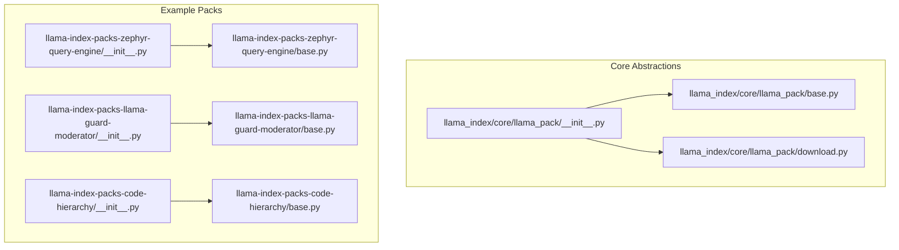
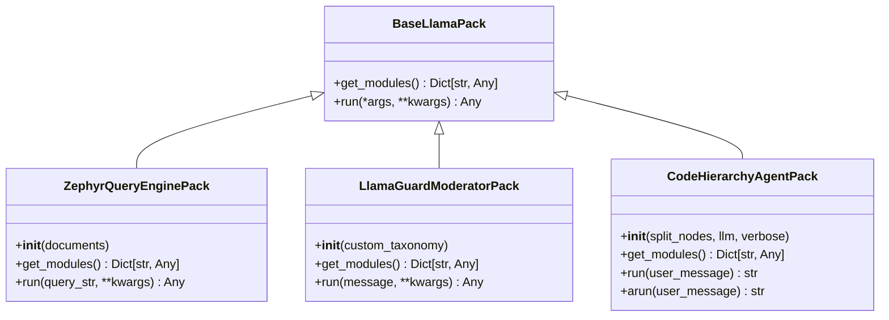
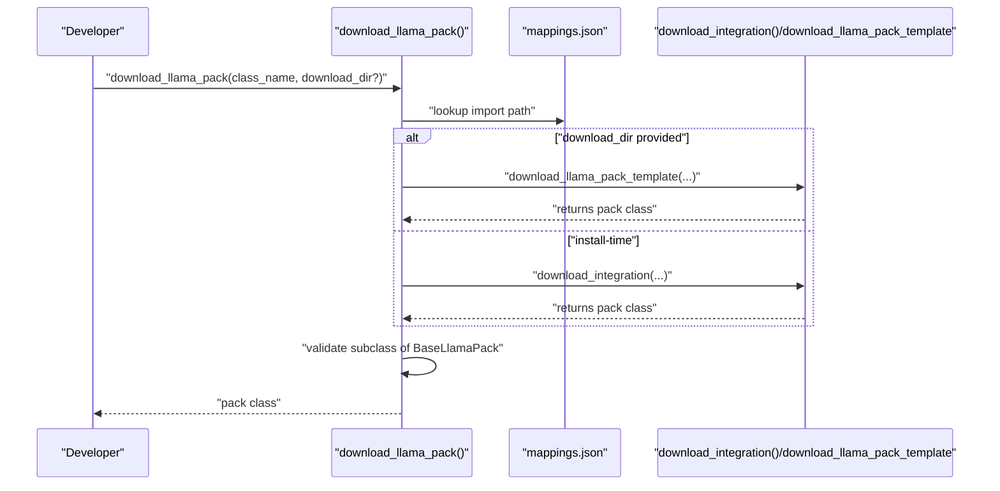

# Pack Development and Customization

<cite>
**Referenced Files in This Document**
- [base.py](file://llama-index-core/llama_index/core/llama_pack/base.py)
- [download.py](file://llama-index-core/llama_index/core/llama_pack/download.py)
- [__init__.py](file://llama-index-core/llama_index/core/llama_pack/__init__.py)
- [README.md](file://llama-index-packs/README.md)
- [base.py](file://llama-index-packs/llama-index-packs-zephyr-query-engine/llama_index/packs/zephyr_query_engine/base.py)
- [base.py](file://llama-index-packs/llama-index-packs-llama-guard-moderator/llama_index/packs/llama_guard_moderator/base.py)
- [base.py](file://llama-index-packs/llama-index-packs-code-hierarchy/llama_index/packs/code_hierarchy/base.py)
- [__init__.py](file://llama-index-packs/llama-index-packs-zephyr-query-engine/llama_index/packs/zephyr_query_engine/__init__.py)
- [__init__.py](file://llama-index-packs/llama-index-packs-llama-guard-moderator/llama_index/packs/llama_guard_moderator/__init__.py)
</cite>

## Table of Contents
1. [Introduction](#introduction)
2. [Project Structure](#project-structure)
3. [Core Components](#core-components)
4. [Architecture Overview](#architecture-overview)
5. [Detailed Component Analysis](#detailed-component-analysis)
6. [Dependency Analysis](#dependency-analysis)
7. [Performance Considerations](#performance-considerations)
8. [Troubleshooting Guide](#troubleshooting-guide)
9. [Conclusion](#conclusion)
10. [Appendices](#appendices)

## Introduction
This document explains how to develop custom LlamaPacks and extend existing functionality in the LlamaIndex ecosystem. It covers the pack development lifecycle from concept to distribution, including pack structure, metadata definition, and dependency management. It also details the pack interface requirements, base class inheritance, implementation patterns, testing strategies, documentation standards, and quality assurance processes. Step-by-step tutorials guide you through creating custom packs, modifying existing packs, and integrating third-party components. Packaging, publishing workflows, and version management are addressed alongside best practices for performance optimization, security considerations, and maintainability. Finally, troubleshooting guidance helps resolve common development and deployment issues.

## Project Structure
LlamaPacks are distributed as separate Python packages under the llama-index-packs namespace. Each pack provides:
- A public API surface via an __init__.py that re-exports the main pack class
- A base implementation class inheriting from BaseLlamaPack
- Optional examples, tests, and packaging metadata (pyproject.toml, requirements.txt, Makefile, uv.lock)

Key locations:
- Core pack abstractions live in llama-index-core under llama_index/core/llama_pack
- Example pack implementations live under llama-index-packs/<pack-name>
- Pack usage and download instructions are documented in llama-index-packs/README.md

**Diagram sources**
- [__init__.py](file://llama-index-core/llama_index/core/llama_pack/__init__.py#L1-L10)
- [base.py](file://llama-index-core/llama_index/core/llama_pack/base.py#L1-L15)
- [download.py](file://llama-index-core/llama_index/core/llama_pack/download.py#L1-L75)
- [__init__.py](file://llama-index-packs/llama-index-packs-zephyr-query-engine/llama_index/packs/zephyr_query_engine/__init__.py#L1-L4)
- [base.py](file://llama-index-packs/llama-index-packs-zephyr-query-engine/llama_index/packs/zephyr_query_engine/base.py#L1-L91)
- [__init__.py](file://llama-index-packs/llama-index-packs-llama-guard-moderator/llama_index/packs/llama_guard_moderator/__init__.py#L1-L4)
- [base.py](file://llama-index-packs/llama-index-packs-llama-guard-moderator/llama_index/packs/llama_guard_moderator/base.py#L1-L134)
- [__init__.py](file://llama-index-packs/llama-index-packs-code-hierarchy/llama_index/packs/code_hierarchy/__init__.py#L1-L4)
- [base.py](file://llama-index-packs/llama-index-packs-code-hierarchy/llama_index/packs/code_hierarchy/base.py#L1-L49)

**Section sources**
- [README.md](file://llama-index-packs/README.md#L1-L33)
- [__init__.py](file://llama-index-core/llama_index/core/llama_pack/__init__.py#L1-L10)

## Core Components
This section defines the foundational pack interface and runtime behaviors.

- BaseLlamaPack: Defines two required methods:
  - get_modules(): returns a dictionary of modules/components exposed by the pack
  - run(*args, **kwargs): executes the pack’s primary workflow and returns a result

- download_llama_pack(): Provides two modes:
  - Install-time resolution via mappings and pip installation
  - Template download mode for local customization with dependency installation

- Pack API exports: Each pack exposes its main class via __all__ in its package __init__.py

Implementation highlights:
- Packs encapsulate initialization logic, optional fallbacks, and environment checks
- Packs expose runtime artifacts (e.g., LLMs, indexes, tools, agents) via get_modules()
- Packs implement run() to orchestrate their internal components

**Section sources**
- [base.py](file://llama-index-core/llama_index/core/llama_pack/base.py#L1-L15)
- [download.py](file://llama-index-core/llama_index/core/llama_pack/download.py#L1-L75)
- [__init__.py](file://llama-index-core/llama_index/core/llama_pack/__init__.py#L1-L10)

## Architecture Overview
The pack architecture follows a consistent pattern:
- Abstraction: BaseLlamaPack defines the contract
- Implementation: Concrete packs inherit BaseLlamaPack and implement get_modules() and run()
- Discovery and instantiation: download_llama_pack resolves the class and returns a subclass of BaseLlamaPack
- Consumption: Users import the pack class, instantiate it, and call run()

**Diagram sources**
- [base.py](file://llama-index-core/llama_index/core/llama_pack/base.py#L1-L15)
- [base.py](file://llama-index-packs/llama-index-packs-zephyr-query-engine/llama_index/packs/zephyr_query_engine/base.py#L1-L91)
- [base.py](file://llama-index-packs/llama-index-packs-llama-guard-moderator/llama_index/packs/llama_guard_moderator/base.py#L1-L134)
- [base.py](file://llama-index-packs/llama-index-packs-code-hierarchy/llama_index/packs/code_hierarchy/base.py#L1-L49)

## Detailed Component Analysis

### BaseLlamaPack Contract
- Purpose: Define a minimal, consistent interface for all packs
- Methods:
  - get_modules(): return a mapping of named modules (e.g., LLM, index, tool, agent)
  - run(): execute the pack’s workflow; supports arbitrary arguments and keyword arguments

Best practices:
- Keep get_modules() deterministic and include only necessary runtime artifacts
- Ensure run() handles errors gracefully and returns meaningful outputs

**Section sources**
- [base.py](file://llama-index-core/llama_index/core/llama_pack/base.py#L1-L15)

### Pack Download and Resolution
- download_llama_pack():
  - Resolves pack class names to Python import paths via mappings
  - Supports two modes:
    - Pip-installable integration mode (no download_dir)
    - Template download mode (with download_dir) for local customization

Behavioral notes:
- Validates that the resolved class is a subclass of BaseLlamaPack
- Tracks downloads for telemetry
- Raises clear errors when mappings are missing or dependencies are not installed

**Diagram sources**
- [download.py](file://llama-index-core/llama_index/core/llama_pack/download.py#L1-L75)

**Section sources**
- [download.py](file://llama-index-core/llama_index/core/llama_pack/download.py#L1-L75)

### Example Pack: ZephyrQueryEnginePack
- Purpose: Build a query engine with a quantized Hugging Face LLM and a vector index
- Initialization:
  - Attempts to load a 4-bit quantized model with fallback to full precision
  - Sets global tokenizer for accurate token counting
  - Configures LLM and embedding model in global settings
  - Builds a VectorStoreIndex from provided documents
- get_modules(): Exposes LLM and index
- run(): Creates a query engine from the index and queries it

Security and environment considerations:
- Requires external libraries; raises import errors if missing
- Falls back to CPU when GPU/CUDA is unavailable

**Section sources**
- [base.py](file://llama-index-packs/llama-index-packs-zephyr-query-engine/llama_index/packs/zephyr_query_engine/base.py#L1-L91)
- [__init__.py](file://llama-index-packs/llama-index-packs-zephyr-query-engine/llama_index/packs/zephyr_query_engine/__init__.py#L1-L4)

### Example Pack: LlamaGuardModeratorPack
- Purpose: Moderate conversational content using a Hugging Face model behind a taxonomy
- Initialization:
  - Requires a Hugging Face access token via environment variable
  - Logs into the hub and loads a model/tokenizer onto a device
  - Stores a customizable taxonomy
- get_modules(): Exposes tokenizer, model, device, and taxonomy
- run(): Converts input into a moderation prompt and generates a safety assessment

Security considerations:
- Enforces presence of a valid access token
- Uses device-specific dtypes and device mapping

**Section sources**
- [base.py](file://llama-index-packs/llama-index-packs-llama-guard-moderator/llama_index/packs/llama_guard_moderator/base.py#L1-L134)
- [__init__.py](file://llama-index-packs/llama-index-packs-llama-guard-moderator/llama_index/packs/llama_guard_moderator/__init__.py#L1-L4)

### Example Pack: CodeHierarchyAgentPack
- Purpose: Orchestrate a FunctionAgent with a specialized query engine tool
- Initialization:
  - Builds a query engine from pre-split nodes
  - Wraps it in a QueryEngineTool
  - Constructs a FunctionAgent with system prompts and tools
- get_modules(): Exposes the query engine, tool, and agent
- run(): Synchronously runs the agent asynchronously using a helper

Operational note:
- Uses asynchronous execution internally while exposing a synchronous run method

**Section sources**
- [base.py](file://llama-index-packs/llama-index-packs-code-hierarchy/llama_index/packs/code_hierarchy/base.py#L1-L49)

## Dependency Analysis
Pack dependencies fall into three categories:
- Core dependencies: LlamaIndex core abstractions (BaseLlamaPack)
- Runtime dependencies: LLMs, embeddings, vector stores, or other integrations
- Optional or environment-specific dependencies: e.g., GPU libraries, access tokens

Coupling and cohesion:
- Packs depend on BaseLlamaPack for interface consistency
- Packs may depend on each other indirectly via shared components (e.g., indexes, tools)
- Cohesion is strong within each pack; coupling is minimized by exposing modules via get_modules()

Potential circular dependencies:
- None observed among the analyzed packs; ensure new packs avoid importing each other directly

External integration points:
- Hugging Face Hub for model/tokenizer loading
- Environment variables for credentials
- Pip install for resolving pack classes

**Section sources**
- [base.py](file://llama-index-core/llama_index/core/llama_pack/base.py#L1-L15)
- [base.py](file://llama-index-packs/llama-index-packs-zephyr-query-engine/llama_index/packs/zephyr_query_engine/base.py#L1-L91)
- [base.py](file://llama-index-packs/llama-index-packs-llama-guard-moderator/llama_index/packs/llama_guard_moderator/base.py#L1-L134)
- [base.py](file://llama-index-packs/llama-index-packs-code-hierarchy/llama_index/packs/code_hierarchy/base.py#L1-L49)

## Performance Considerations
- Quantization and device placement:
  - Prefer quantized models when available and feasible
  - Use device mapping and appropriate dtypes to leverage accelerators
- Token counting and context windows:
  - Set global tokenizers to ensure accurate token accounting
  - Configure context windows and generation parameters carefully
- Asynchronous execution:
  - Use async run methods internally when appropriate to improve throughput
- Caching and reuse:
  - Reuse initialized components (e.g., LLMs, indexes) across runs
- Fallback strategies:
  - Provide robust fallbacks (e.g., CPU-only) to avoid hard failures

[No sources needed since this section provides general guidance]

## Troubleshooting Guide
Common issues and resolutions:
- Missing dependencies during import:
  - Ensure required packages are installed; packs often raise import errors with guidance
- CUDA/GPU availability:
  - Falls back to CPU when GPU is unavailable; verify device configuration
- Missing environment variables:
  - Some packs require tokens or keys; ensure environment variables are set
- Incorrect pack class resolution:
  - Verify pack class names and mappings; use download_llama_pack with correct identifiers
- Template download validation:
  - Confirm the returned class is a subclass of BaseLlamaPack

**Section sources**
- [base.py](file://llama-index-packs/llama-index-packs-zephyr-query-engine/llama_index/packs/zephyr_query_engine/base.py#L1-L91)
- [base.py](file://llama-index-packs/llama-index-packs-llama-guard-moderator/llama_index/packs/llama_guard_moderator/base.py#L1-L134)
- [download.py](file://llama-index-core/llama_index/core/llama_pack/download.py#L1-L75)

## Conclusion
LlamaPacks provide a standardized, extensible framework for building reusable RAG and agent components. By adhering to the BaseLlamaPack contract, organizing dependencies thoughtfully, and following the testing and documentation practices outlined here, developers can create robust, maintainable packs that integrate seamlessly with the broader LlamaIndex ecosystem.

[No sources needed since this section summarizes without analyzing specific files]

## Appendices

### A. Pack Development Lifecycle
- Concept and design:
  - Define the problem, desired inputs/outputs, and runtime components
- Structure and metadata:
  - Create a package with a clear __init__.py exporting the main class
  - Add pyproject.toml, requirements.txt, and packaging files
- Implementation:
  - Inherit BaseLlamaPack and implement get_modules() and run()
  - Encapsulate initialization, environment checks, and fallbacks
- Testing:
  - Write unit tests for initialization and run() behavior
  - Include integration tests where applicable
- Documentation:
  - Provide README with usage examples and prerequisites
- Distribution:
  - Publish to PyPI and update mappings for discovery

**Section sources**
- [base.py](file://llama-index-core/llama_index/core/llama_pack/base.py#L1-L15)
- [README.md](file://llama-index-packs/README.md#L1-L33)

### B. Creating a Custom Pack
- Steps:
  - Create a new package directory under llama-index-packs
  - Implement a class inheriting BaseLlamaPack
  - Export the class in __all__ within the package’s __init__.py
  - Add pyproject.toml and requirements.txt
  - Test locally and publish to PyPI

**Section sources**
- [base.py](file://llama-index-core/llama_index/core/llama_pack/base.py#L1-L15)
- [__init__.py](file://llama-index-core/llama_index/core/llama_pack/__init__.py#L1-L10)

### C. Modifying an Existing Pack
- Steps:
  - Use download_llama_pack with a download_dir to fetch the template
  - Modify the base implementation to adjust behavior or dependencies
  - Reinstall or run locally with updated code

**Section sources**
- [download.py](file://llama-index-core/llama_index/core/llama_pack/download.py#L1-L75)
- [README.md](file://llama-index-packs/README.md#L1-L33)

### D. Integrating Third-Party Components
- Patterns:
  - Wrap external clients or models in the pack’s constructor
  - Expose relevant modules via get_modules()
  - Validate environment variables and credentials early
- Examples:
  - Hugging Face models and tokenizers
  - Vector stores and retrieval components

**Section sources**
- [base.py](file://llama-index-packs/llama-index-packs-zephyr-query-engine/llama_index/packs/zephyr_query_engine/base.py#L1-L91)
- [base.py](file://llama-index-packs/llama-index-packs-llama-guard-moderator/llama_index/packs/llama_guard_moderator/base.py#L1-L134)

### E. Packaging, Publishing, and Version Management
- Packaging:
  - Use pyproject.toml and requirements.txt to declare dependencies
  - Include a Makefile or script for local builds
- Publishing:
  - Publish to PyPI; ensure class mappings are updated for discovery
- Versioning:
  - Follow semantic versioning; increment patch/minor/major appropriately
  - Maintain backward compatibility for get_modules() and run() signatures

**Section sources**
- [README.md](file://llama-index-packs/README.md#L1-L33)