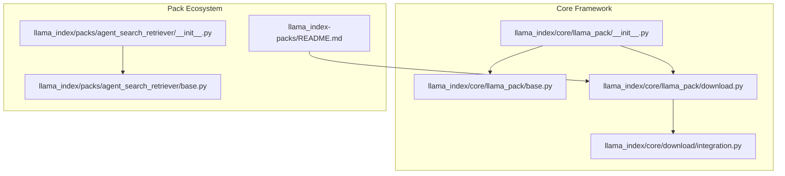
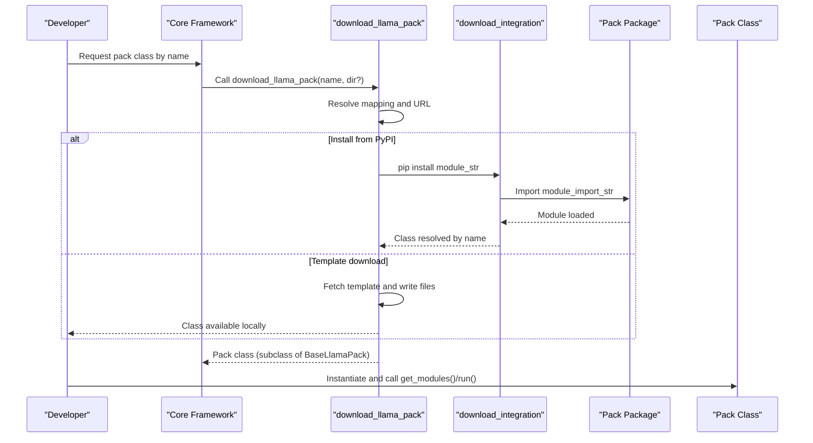
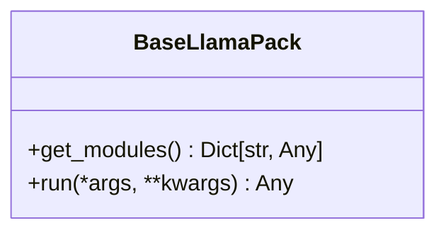
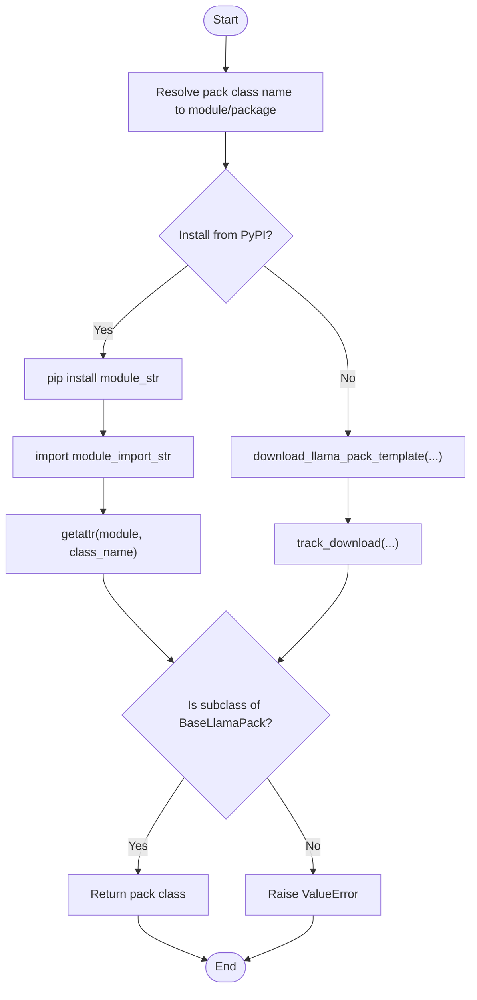
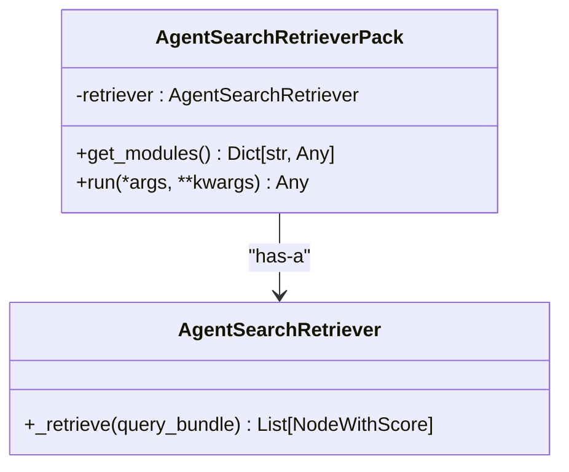
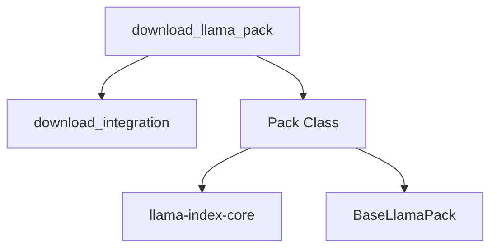

# Pack Overview and Architecture

<cite>
**Referenced Files in This Document**
- [llama_index/core/llama_pack/__init__.py](file://llama_index/core/llama_pack/__init__.py)
- [llama_index/core/llama_pack/base.py](file://llama_index/core/llama_pack/base.py)
- [llama_index/core/llama_pack/download.py](file://llama_index/core/llama_pack/download.py)
- [llama_index/core/download/integration.py](file://llama_index/core/download/integration.py)
- [llama_index-packs/README.md](file://llama_index-packs/README.md)
- [llama_index/packs/agent_search_retriever/__init__.py](file://llama_index/packs/agent_search_retriever/__init__.py)
- [llama_index/packs/agent_search_retriever/base.py](file://llama_index/packs/agent_search_retriever/base.py)
- [llama_index/packs/llama_guard_moderator/__init__.py](file://llama_index/packs/llama_guard_moderator/__init__.py)
- [llama_index/packs/llava_completion/__init__.py](file://llama_index/packs/llava_completion/__init__.py)
- [llama-index-packs-agent-search-retriever/pyproject.toml](file://llama-index-packs-agent-search-retriever/pyproject.toml)
</cite>

## Table of Contents
1. [Introduction](#introduction)
2. [Project Structure](#project-structure)
3. [Core Components](#core-components)
4. [Architecture Overview](#architecture-overview)
5. [Detailed Component Analysis](#detailed-component-analysis)
6. [Dependency Analysis](#dependency-analysis)
7. [Performance Considerations](#performance-considerations)
8. [Troubleshooting Guide](#troubleshooting-guide)
9. [Conclusion](#conclusion)
10. [Appendices](#appendices)

## Introduction
This document explains the LlamaPacks architecture and core concepts in the LlamaIndex ecosystem. It covers the pack system design, the base pack interface, lifecycle, and dependency management. It also documents the pack discovery and installation mechanisms, runtime loading, and metadata structure. Finally, it provides architectural diagrams, development principles, best practices, and examples of pack structure and configuration patterns.

## Project Structure
LlamaPacks are organized as separate Python packages under the llama-index-packs monorepo. Each pack provides a cohesive feature set (e.g., retrieval, moderation, multimodal completion) and exposes a class that extends the base pack interface. The core framework defines the base pack contract and the discovery/installation utilities.

**Diagram sources**
- [llama_index/core/llama_pack/__init__.py](file://llama_index/core/llama_pack/__init__.py#L1-L10)
- [llama_index/core/llama_pack/base.py](file://llama_index/core/llama_pack/base.py#L1-L15)
- [llama_index/core/llama_pack/download.py](file://llama_index/core/llama_pack/download.py#L1-L75)
- [llama_index/core/download/integration.py](file://llama_index/core/download/integration.py#L1-L28)
- [llama_index-packs/README.md](file://llama_index-packs/README.md#L1-L33)
- [llama_index/packs/agent_search_retriever/base.py](file://llama_index/packs/agent_search_retriever/base.py#L1-L95)
- [llama_index/packs/agent_search_retriever/__init__.py](file://llama_index/packs/agent_search_retriever/__init__.py#L1-L7)

**Section sources**
- [llama_index/core/llama_pack/__init__.py](file://llama_index/core/llama_pack/__init__.py#L1-L10)
- [llama_index/core/llama_pack/base.py](file://llama_index/core/llama_pack/base.py#L1-L15)
- [llama_index/core/llama_pack/download.py](file://llama_index/core/llama_pack/download.py#L1-L75)
- [llama_index/core/download/integration.py](file://llama_index/core/download/integration.py#L1-L28)
- [llama_index-packs/README.md](file://llama_index-packs/README.md#L1-L33)
- [llama_index/packs/agent_search_retriever/base.py](file://llama_index/packs/agent_search_retriever/base.py#L1-L95)
- [llama_index/packs/agent_search_retriever/__init__.py](file://llama_index/packs/agent_search_retriever/__init__.py#L1-L7)

## Core Components
- Base pack interface: Defines the contract that all packs must implement, including methods to expose internal modules and to execute the pack’s workflow.
- Discovery and installation: Utilities to locate, download, and load pack classes either from PyPI or as templates.
- Runtime loading: Mechanisms to dynamically install and import pack modules for immediate use.

Key responsibilities:
- BaseLlamaPack: Enforces get_modules() and run() contracts.
- download_llama_pack(): Resolves pack class to a package, installs it, and returns the class.
- download_integration(): Installs a package via pip and imports the requested class.

**Section sources**
- [llama_index/core/llama_pack/base.py](file://llama_index/core/llama_pack/base.py#L7-L15)
- [llama_index/core/llama_pack/download.py](file://llama_index/core/llama_pack/download.py#L14-L75)
- [llama_index/core/download/integration.py](file://llama_index/core/download/integration.py#L13-L28)

## Architecture Overview
The pack architecture separates concerns between the core framework and individual packs. Packs are distributed as standalone Python packages and can be installed or downloaded as templates. At runtime, the framework resolves the pack class, ensures it adheres to the base interface, and exposes its modules for composition.

**Diagram sources**
- [llama_index/core/llama_pack/download.py](file://llama_index/core/llama_pack/download.py#L14-L75)
- [llama_index/core/download/integration.py](file://llama_index/core/download/integration.py#L13-L28)

## Detailed Component Analysis

### BaseLlamaPack Contract
The base pack interface defines two essential methods:
- get_modules(): Returns a dictionary of internal modules exposed by the pack (e.g., retrievers, engines, tools).
- run(): Executes the pack’s primary workflow and returns a result.

**Diagram sources**
- [llama_index/core/llama_pack/base.py](file://llama_index/core/llama_pack/base.py#L7-L15)

**Section sources**
- [llama_index/core/llama_pack/base.py](file://llama_index/core/llama_pack/base.py#L7-L15)

### Pack Discovery and Installation
Discovery relies on a mapping of pack class names to their canonical module/package names. The system supports:
- Installing from PyPI: Uses pip to install the package and imports the class.
- Downloading a template: Fetches the pack template and writes it to a local directory for customization.

**Diagram sources**
- [llama_index/core/llama_pack/download.py](file://llama_index/core/llama_pack/download.py#L14-L75)
- [llama_index/core/download/integration.py](file://llama_index/core/download/integration.py#L13-L28)

**Section sources**
- [llama_index/core/llama_pack/download.py](file://llama_index/core/llama_pack/download.py#L14-L75)
- [llama_index/core/download/integration.py](file://llama_index/core/download/integration.py#L13-L28)
- [llama_index-packs/README.md](file://llama_index-packs/README.md#L13-L33)

### Example Pack: AgentSearchRetrieverPack
This pack demonstrates a retriever-based pack that integrates with an external search provider. It exposes a retriever module and delegates run() to the underlying retriever.

**Diagram sources**
- [llama_index/packs/agent_search_retriever/base.py](file://llama_index/packs/agent_search_retriever/base.py#L68-L95)

**Section sources**
- [llama_index/packs/agent_search_retriever/base.py](file://llama_index/packs/agent_search_retriever/base.py#L1-L95)
- [llama_index/packs/agent_search_retriever/__init__.py](file://llama_index/packs/agent_search_retriever/__init__.py#L1-L7)

### Pack Metadata and Requirements
Pack metadata and requirements are defined per pack package. Typical fields include:
- name: Unique package name.
- version: Semantic version.
- description: Short description.
- requires-python: Supported interpreter range.
- dependencies: Core and optional dependencies.
- tool.llamahub: Import path and example presence flags.

Example metadata fields are visible in the pack’s build configuration.

**Section sources**
- [llama-index-packs-agent-search-retriever/pyproject.toml](file://llama-index-packs-agent-search-retriever/pyproject.toml#L26-L67)

### Pack Usage Patterns
- Using a pack from PyPI: Install the specific pack package and import the pack class.
- Downloading a template: Use the CLI or the download function to fetch a copy for customization.

**Section sources**
- [llama_index-packs/README.md](file://llama_index-packs/README.md#L1-L33)

## Dependency Analysis
The core pack system depends on:
- BaseLlamaPack for the interface contract.
- download_llama_pack for discovery and installation.
- download_integration for dynamic installation and import.

Packs depend on the core framework and may depend on external integrations. The pack metadata specifies core and optional dependencies.

**Diagram sources**
- [llama_index/core/llama_pack/base.py](file://llama_index/core/llama_pack/base.py#L7-L15)
- [llama_index/core/llama_pack/download.py](file://llama_index/core/llama_pack/download.py#L14-L75)
- [llama_index/core/download/integration.py](file://llama_index/core/download/integration.py#L13-L28)

**Section sources**
- [llama_index/core/llama_pack/base.py](file://llama_index/core/llama_pack/base.py#L7-L15)
- [llama_index/core/llama_pack/download.py](file://llama_index/core/llama_pack/download.py#L14-L75)
- [llama_index/core/download/integration.py](file://llama_index/core/download/integration.py#L13-L28)

## Performance Considerations
- Lazy initialization: Initialize heavy dependencies (e.g., external clients) only when needed.
- Caching: Cache repeated computations or network calls where appropriate.
- Resource cleanup: Ensure long-lived resources are closed or reset after use.
- Batch operations: Prefer batch retrieval or processing when supported by the underlying integrations.

## Troubleshooting Guide
Common issues and resolutions:
- Missing external dependency: Ensure the pack’s required third-party libraries are installed.
- Incorrect class resolution: Verify the pack class name matches the mapping and that the package is installed.
- Non-subclass of BaseLlamaPack: Confirm the returned class implements the required interface.
- Import errors during runtime: Validate the package installation and import path.

**Section sources**
- [llama_index/core/llama_pack/download.py](file://llama_index/core/llama_pack/download.py#L69-L72)
- [llama_index/core/download/integration.py](file://llama_index/core/download/integration.py#L20-L26)

## Conclusion
LlamaPacks provide a modular, extensible way to compose and share reusable components within the LlamaIndex ecosystem. The base pack interface enforces a consistent contract, while the discovery and installation utilities enable flexible distribution and runtime loading. By following the documented patterns and best practices, developers can create high-quality packs that integrate seamlessly with the core framework.

## Appendices

### Pack Development Principles and Best Practices
- Keep packs focused: Each pack should encapsulate a single, coherent capability.
- Expose modules via get_modules(): Return a minimal, useful set of internal components.
- Delegate run(): Implement run() to orchestrate the pack’s workflow.
- Document metadata: Provide accurate version, dependencies, and import paths.
- Test and validate: Include tests and example usage to demonstrate correct behavior.
- Version compatibility: Align dependencies with supported core versions.

### Examples of Pack Structure Organization
- A retriever pack exposes a retriever instance and delegates run() to retrieve().
- A moderation pack exposes a validator and run() validates inputs.
- A multimodal completion pack exposes a model and run() generates completions.

These patterns are illustrated by the AgentSearchRetrieverPack and other pack examples.