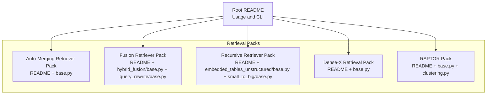
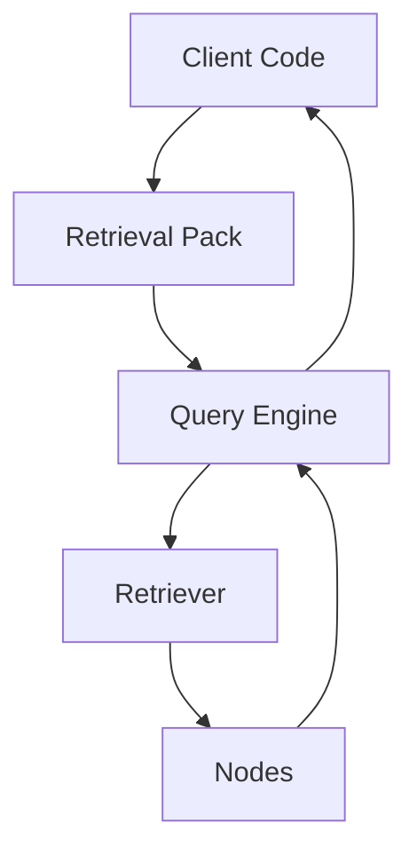
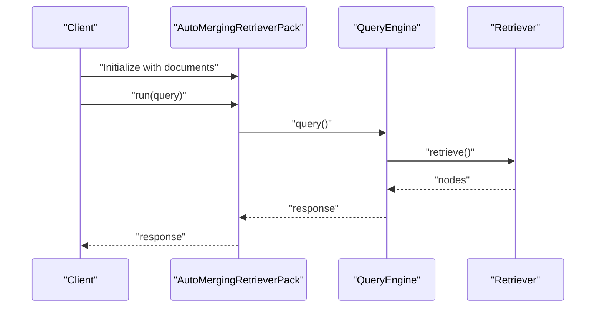
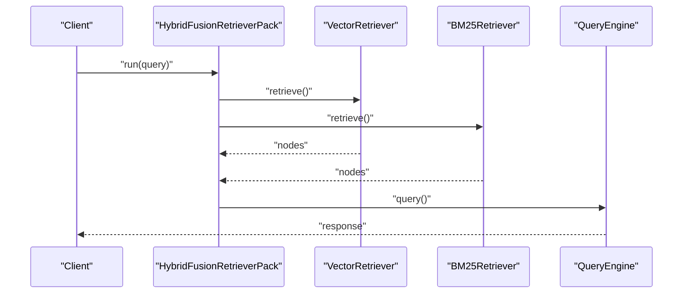
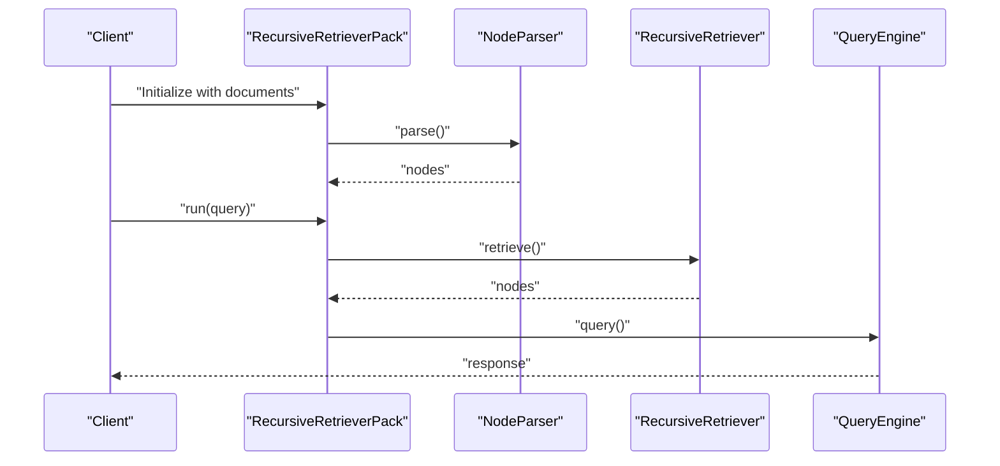
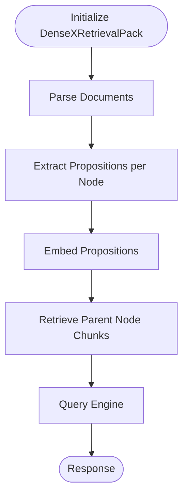
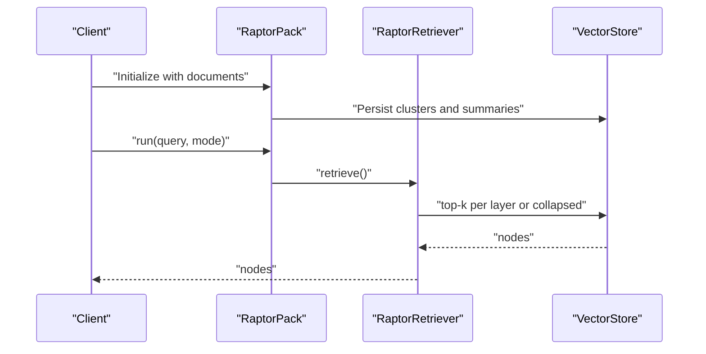
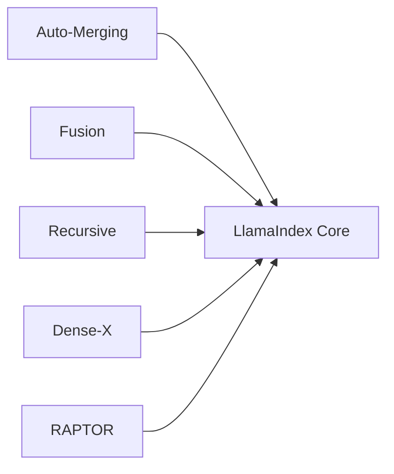

# Retrieval Packs

<cite>
**Referenced Files in This Document**
- [README.md](file://llama-index-packs/README.md)
- [README.md](file://llama-index-packs/llama-index-packs-auto-merging-retriever/README.md)
- [base.py](file://llama-index-packs/llama-index-packs-auto-merging-retriever/llama_index/packs/auto_merging_retriever/base.py)
- [README.md](file://llama-index-packs/llama-index-packs-fusion-retriever/README.md)
- [base.py](file://llama-index-packs/llama-index-packs-fusion-retriever/llama_index/packs/fusion_retriever/hybrid_fusion/base.py)
- [base.py](file://llama-index-packs/llama-index-packs-fusion-retriever/llama_index/packs/fusion_retriever/query_rewrite/base.py)
- [README.md](file://llama-index-packs/llama-index-packs-recursive-retriever/README.md)
- [base.py](file://llama-index-packs/llama-index-packs-recursive-retriever/llama_index/packs/recursive_retriever/embedded_tables_unstructured/base.py)
- [base.py](file://llama-index-packs/llama-index-packs-recursive-retriever/llama_index/packs/recursive_retriever/small_to_big/base.py)
- [README.md](file://llama-index-packs/llama-index-packs-dense-x-retrieval/README.md)
- [base.py](file://llama-index-packs/llama-index-packs-dense-x-retrieval/llama_index/packs/dense_x_retrieval/base.py)
- [README.md](file://llama-index-packs/llama-index-packs-raptor/README.md)
- [base.py](file://llama-index-packs/llama-index-packs-raptor/llama_index/packs/raptor/base.py)
- [clustering.py](file://llama-index-packs/llama-index-packs-raptor/llama_index/packs/raptor/clustering.py)
</cite>

## Table of Contents
1. [Introduction](#introduction)
2. [Project Structure](#project-structure)
3. [Core Components](#core-components)
4. [Architecture Overview](#architecture-overview)
5. [Detailed Component Analysis](#detailed-component-analysis)
6. [Dependency Analysis](#dependency-analysis)
7. [Performance Considerations](#performance-considerations)
8. [Troubleshooting Guide](#troubleshooting-guide)
9. [Conclusion](#conclusion)
10. [Appendices](#appendices)

## Introduction
This document provides a comprehensive guide to Retrieval Packs that enhance Retrieval-Augmented Generation (RAG) systems with advanced retrieval strategies. It focuses on five Retrieval Packs:
- Auto-Merging Retriever Pack for hierarchical document processing
- Fusion Retriever Pack for combining multiple retrieval sources
- Recursive Retriever Pack for deep document exploration
- Dense-X Retrieval Pack for hybrid search
- RAPTOR Pack for recursive retrieval

For each pack, we explain the algorithmic approach, configuration options, performance characteristics, and typical use cases. Practical examples show installation, configuration, and integration into RAG pipelines. We also provide guidance on parameter tuning, optimization strategies, troubleshooting, and selection criteria based on document types, scale, and performance needs.

## Project Structure
The Retrieval Packs are distributed as separate Python packages under the llama-index-packs namespace. Each pack includes:
- A README with usage instructions and examples
- A base module implementing the pack’s core logic
- Optional examples and tests

**Diagram sources**
- [README.md](file://llama-index-packs/README.md#L1-L33)
- [README.md](file://llama-index-packs/llama-index-packs-auto-merging-retriever/README.md#L1-L66)
- [README.md](file://llama-index-packs/llama-index-packs-fusion-retriever/README.md#L1-L128)
- [README.md](file://llama-index-packs/llama-index-packs-recursive-retriever/README.md#L1-L132)
- [README.md](file://llama-index-packs/llama-index-packs-dense-x-retrieval/README.md#L1-L68)
- [README.md](file://llama-index-packs/llama-index-packs-raptor/README.md#L1-L106)

**Section sources**
- [README.md](file://llama-index-packs/README.md#L1-L33)

## Core Components
This section summarizes the capabilities and configuration surface of each Retrieval Pack.

- Auto-Merging Retriever Pack
  - Purpose: Build a hierarchical node graph from documents and retrieve using parent-child relationships.
  - Typical use cases: Long-form documents, hierarchical knowledge bases, multi-level summarization pipelines.
  - Key configuration: Documents input; retrieval behavior via the underlying retriever and query engine exposed by the pack.
  - Integration: Provides run(), and exposes node_parser, retriever, and query_engine for modular usage.

- Fusion Retriever Pack
  - Purpose: Fuse results from multiple retrievers (e.g., vector and BM25) or generate multiple queries for a single retriever and fuse outcomes.
  - Typical use cases: Hybrid retrieval, robust query understanding, improved recall across diverse corpora.
  - Key configuration: Similarity top-k for vector and BM25 retrievers; optional query rewriting pipeline.
  - Integration: Exposes fusion_retriever, vector_retriever, bm25_retriever, and query_engine.

- Recursive Retriever Pack
  - Purpose: Explore documents recursively via hierarchical nodes; supports embedded tables and small-to-big traversal.
  - Typical use cases: Structured content (tables), financial reports, nested document hierarchies.
  - Key configuration: Node parsing and hierarchical traversal parameters; retrieval depth and merging strategies.
  - Integration: Exposes node_parser, recursive_retriever, and query_engine.

- Dense-X Retrieval Pack
  - Purpose: Extract atomic propositions per node, embed them, and retrieve parent node chunks for dense retrieval granularity.
  - Typical use cases: Fine-grained retrieval, fact-centric queries, hybrid dense-sparse retrieval.
  - Key configuration: Streaming option; LLM-driven proposition extraction cost considerations.
  - Integration: Provides run() wrapper around query_engine.query().

- RAPTOR Pack
  - Purpose: Recursively cluster and summarize document clusters across layers for retrieval.
  - Typical use cases: Large-scale corpora, hierarchical summarization, scalable retrieval with tree traversal or collapsed modes.
  - Key configuration: Modes “tree_traversal” and “collapsed”; persistence via vector store; configurable summary module (LLM, prompt, worker count).
  - Integration: run() wraps retriever.retrieve(); retriever and pack expose persistence and reload mechanisms.

**Section sources**
- [README.md](file://llama-index-packs/llama-index-packs-auto-merging-retriever/README.md#L1-L66)
- [README.md](file://llama-index-packs/llama-index-packs-fusion-retriever/README.md#L1-L128)
- [README.md](file://llama-index-packs/llama-index-packs-recursive-retriever/README.md#L1-L132)
- [README.md](file://llama-index-packs/llama-index-packs-dense-x-retrieval/README.md#L1-L68)
- [README.md](file://llama-index-packs/llama-index-packs-raptor/README.md#L1-L106)

## Architecture Overview
Each Retrieval Pack composes standard LlamaIndex components (node parsers, retrievers, query engines) into a cohesive workflow. The packs expose:
- A constructor accepting documents or nodes
- A run() method wrapping query_engine.query() or retriever.retrieve()
- Accessors to internal modules (node_parser, retriever, query_engine) for advanced usage

[No sources needed since this diagram shows conceptual workflow, not actual code structure]

## Detailed Component Analysis

### Auto-Merging Retriever Pack
- Algorithm overview
  - Builds a hierarchical node graph from input documents.
  - Uses a retriever over the hierarchy to return relevant nodes.
  - Exposes a query engine for end-to-end querying.
- Configuration options
  - Documents input to the pack.
  - Retrieval behavior controlled by the underlying retriever and query engine.
- Performance characteristics
  - Hierarchical retrieval can improve precision for long documents.
  - Complexity depends on graph depth and retriever cost.
- Use cases
  - Multi-level document exploration, hierarchical knowledge graphs, long-form content.
- Practical example
  - Install: pip install llama-index-packs-auto-merging-retriever
  - Download template: llamaindex-cli download-llamapack AutoMergingRetrieverPack
  - Initialize pack with documents and call run() or use node_parser, retriever, query_engine individually.

**Diagram sources**
- [README.md](file://llama-index-packs/llama-index-packs-auto-merging-retriever/README.md#L36-L65)
- [base.py](file://llama-index-packs/llama-index-packs-auto-merging-retriever/llama_index/packs/auto_merging_retriever/base.py)

**Section sources**
- [README.md](file://llama-index-packs/llama-index-packs-auto-merging-retriever/README.md#L1-L66)
- [base.py](file://llama-index-packs/llama-index-packs-auto-merging-retriever/llama_index/packs/auto_merging_retriever/base.py)

### Fusion Retriever Pack
- Algorithm overview
  - Hybrid fusion: combine vector and BM25 retrievers.
  - Query rewriting fusion: rewrite query and run a single retriever multiple times, then fuse results.
- Configuration options
  - vector_similarity_top_k and bm25_similarity_top_k for hybrid fusion.
  - chunk_size and vector_similarity_top_k for query rewriting fusion.
- Performance characteristics
  - Hybrid fusion improves recall by combining lexical and semantic signals.
  - Query rewriting fusion increases robustness to paraphrases.
- Use cases
  - Cross-modal retrieval, noisy queries, multi-source corpora.
- Practical example
  - Install: pip install llama-index-packs-fusion-retriever
  - Download template: llamaindex-cli download-llamapack HybridFusionRetrieverPack or QueryRewritingRetrieverPack
  - Initialize pack with nodes and call run() or use individual retrievers and query_engine.

**Diagram sources**
- [README.md](file://llama-index-packs/llama-index-packs-fusion-retriever/README.md#L36-L64)
- [base.py](file://llama-index-packs/llama-index-packs-fusion-retriever/llama_index/packs/fusion_retriever/hybrid_fusion/base.py)

**Section sources**
- [README.md](file://llama-index-packs/llama-index-packs-fusion-retriever/README.md#L1-L128)
- [base.py](file://llama-index-packs/llama-index-packs-fusion-retriever/llama_index/packs/fusion_retriever/hybrid_fusion/base.py)
- [base.py](file://llama-index-packs/llama-index-packs-fusion-retriever/llama_index/packs/fusion_retriever/query_rewrite/base.py)

### Recursive Retriever Pack
- Algorithm overview
  - Builds hierarchical nodes and retrieves across levels.
  - Supports embedded tables and small-to-big traversal strategies.
- Configuration options
  - Node parsing parameters and hierarchical traversal settings.
- Performance characteristics
  - Enables deep exploration of nested content; retrieval cost scales with graph depth.
- Use cases
  - Financial filings, technical documents with tables, nested sections.
- Practical example
  - Install: pip install llama-index-packs-recursive-retriever
  - Download template: llamaindex-cli download-llamapack EmbeddedTablesUnstructuredRetrieverPack or RecursiveRetrieverSmallToBigPack
  - Initialize pack and call run() or use node_parser and recursive_retriever.

**Diagram sources**
- [README.md](file://llama-index-packs/llama-index-packs-recursive-retriever/README.md#L39-L68)
- [base.py](file://llama-index-packs/llama-index-packs-recursive-retriever/llama_index/packs/recursive_retriever/embedded_tables_unstructured/base.py)
- [base.py](file://llama-index-packs/llama-index-packs-recursive-retriever/llama_index/packs/recursive_retriever/small_to_big/base.py)

**Section sources**
- [README.md](file://llama-index-packs/llama-index-packs-recursive-retriever/README.md#L1-L132)
- [base.py](file://llama-index-packs/llama-index-packs-recursive-retriever/llama_index/packs/recursive_retriever/embedded_tables_unstructured/base.py)
- [base.py](file://llama-index-packs/llama-index-packs-recursive-retriever/llama_index/packs/recursive_retriever/small_to_big/base.py)

### Dense-X Retrieval Pack
- Algorithm overview
  - Extracts atomic propositions per node using an LLM prompt, embeds propositions, and retrieves parent node chunks.
- Configuration options
  - streaming flag for response streaming.
- Performance characteristics
  - Proposition extraction is LLM-intensive; suitable for moderate-scale datasets or when fine-grained retrieval is critical.
- Use cases
  - Factoid queries, hybrid dense-sparse retrieval, knowledge verification.
- Practical example
  - Install: pip install llama-index-packs-dense-x-retrieval
  - Download template: llamaindex-cli download-llamapack DenseXRetrievalPack
  - Initialize pack with documents and call run() with optional streaming.

**Diagram sources**
- [README.md](file://llama-index-packs/llama-index-packs-dense-x-retrieval/README.md#L27-L68)
- [base.py](file://llama-index-packs/llama-index-packs-dense-x-retrieval/llama_index/packs/dense_x_retrieval/base.py)

**Section sources**
- [README.md](file://llama-index-packs/llama-index-packs-dense-x-retrieval/README.md#L1-L68)
- [base.py](file://llama-index-packs/llama-index-packs-dense-x-retrieval/llama_index/packs/dense_x_retrieval/base.py)

### RAPTOR Pack
- Algorithm overview
  - Recursively clusters and summarizes document clusters across layers; supports “tree_traversal” and “collapsed” retrieval modes.
- Configuration options
  - mode selection (“tree_traversal” or “collapsed”).
  - Persistence via vector store; reload with empty documents and the same vector store.
  - SummaryModule allows configuring LLM, summary prompt, and num_workers.
- Performance characteristics
  - Effective for large corpora; retrieval cost depends on clustering depth and summarization overhead.
- Use cases
  - Massive corpora, hierarchical summarization, scalable retrieval.
- Practical example
  - Install: pip install llama-index-packs-raptor
  - Download template: llamaindex-cli download-llamapack RaptorPack
  - Initialize pack with documents and call run(mode=...) or use retriever directly.
  - For persistence, pass a vector store during initialization and reload by passing an empty document list with the same vector store.

**Diagram sources**
- [README.md](file://llama-index-packs/llama-index-packs-raptor/README.md#L54-L78)
- [base.py](file://llama-index-packs/llama-index-packs-raptor/llama_index/packs/raptor/base.py)
- [clustering.py](file://llama-index-packs/llama-index-packs-raptor/llama_index/packs/raptor/clustering.py)

**Section sources**
- [README.md](file://llama-index-packs/llama-index-packs-raptor/README.md#L1-L106)
- [base.py](file://llama-index-packs/llama-index-packs-raptor/llama_index/packs/raptor/base.py)
- [clustering.py](file://llama-index-packs/llama-index-packs-raptor/llama_index/packs/raptor/clustering.py)

## Dependency Analysis
- Pack-level dependencies
  - Each Retrieval Pack depends on the LlamaIndex core pack infrastructure and exposes a run() interface.
- Internal dependencies
  - Packs rely on standard LlamaIndex components: node parsers, retrievers, and query engines.
- External dependencies
  - Some packs integrate with external libraries (e.g., unstructured for embedded tables).
- Coupling and cohesion
  - Packs maintain high cohesion around retrieval tasks and moderate coupling to core LlamaIndex components.

[No sources needed since this diagram shows conceptual relationships, not specific code structure]

## Performance Considerations
- Auto-Merging Retriever
  - Favor smaller chunk sizes for deeper hierarchies to reduce retrieval cost.
  - Monitor graph depth; very deep hierarchies increase traversal cost.
- Fusion Retriever
  - Tune vector_similarity_top_k and bm25_similarity_top_k to balance precision and recall.
  - Query rewriting adds latency; use judiciously for noisy queries.
- Recursive Retriever
  - Control hierarchical depth and merging thresholds to limit fan-out.
  - For embedded tables, ensure robust parsing to avoid fragmented retrieval.
- Dense-X Retrieval
  - Streaming reduces latency for large responses.
  - Consider caching or batching proposition extraction for repeated queries.
- RAPTOR
  - Choose “collapsed” mode for speed; “tree_traversal” for richer recall.
  - Persist vector store to avoid recomputation; tune num_workers for summary concurrency.

[No sources needed since this section provides general guidance]

## Troubleshooting Guide
- Installation and CLI
  - Use pip install for ready-to-use packs.
  - Use llamaindex-cli download-llamapack to obtain templates for customization.
- Auto-Merging Retriever
  - If retrieval is slow, reduce hierarchical depth or adjust retriever top-k.
  - Verify node parser configuration matches document structure.
- Fusion Retriever
  - If fused results are poor, adjust similarity top-k or enable query rewriting.
  - Ensure vector and BM25 retrievers are configured consistently.
- Recursive Retriever
  - For missing facts, increase recursion depth or adjust node parsing parameters.
  - For embedded tables, validate table extraction and parsing steps.
- Dense-X Retrieval
  - Expect higher LLM costs; consider rate limits and caching.
  - If proposition extraction fails, review prompts and chunk sizes.
- RAPTOR
  - For reload issues, ensure the same vector store is passed during re-initialization.
  - If summaries are slow, reduce num_workers or switch to a simpler summary prompt.

**Section sources**
- [README.md](file://llama-index-packs/README.md#L1-L33)
- [README.md](file://llama-index-packs/llama-index-packs-auto-merging-retriever/README.md#L1-L66)
- [README.md](file://llama-index-packs/llama-index-packs-fusion-retriever/README.md#L1-L128)
- [README.md](file://llama-index-packs/llama-index-packs-recursive-retriever/README.md#L1-L132)
- [README.md](file://llama-index-packs/llama-index-packs-dense-x-retrieval/README.md#L1-L68)
- [README.md](file://llama-index-packs/llama-index-packs-raptor/README.md#L1-L106)

## Conclusion
Retrieval Packs offer modular, production-ready solutions to advance RAG retrieval. Select a pack based on document characteristics and scale:
- Use Auto-Merging for hierarchical documents.
- Use Fusion for robust hybrid retrieval.
- Use Recursive for nested or structured content.
- Use Dense-X for fine-grained, fact-centric retrieval.
- Use RAPTOR for large-scale, hierarchical summarization and retrieval.

Tune parameters carefully, leverage persistence where supported, and monitor performance to match your workload.

[No sources needed since this section summarizes without analyzing specific files]

## Appendices
- Pack installation and usage
  - Install via pip install llama-index-packs-<name>.
  - Download templates via llamaindex-cli download-llamapack <PackName>.
- Integration tips
  - Use run() for quick end-to-end queries.
  - Access node_parser, retriever, and query_engine for advanced customization.
  - For persistence, pass a vector store and reuse it across reloads.

**Section sources**
- [README.md](file://llama-index-packs/README.md#L1-L33)
- [README.md](file://llama-index-packs/llama-index-packs-raptor/README.md#L54-L78)