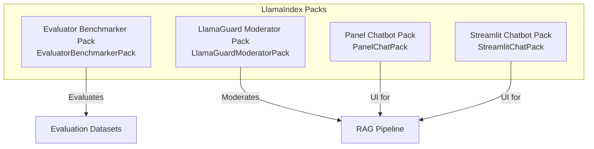
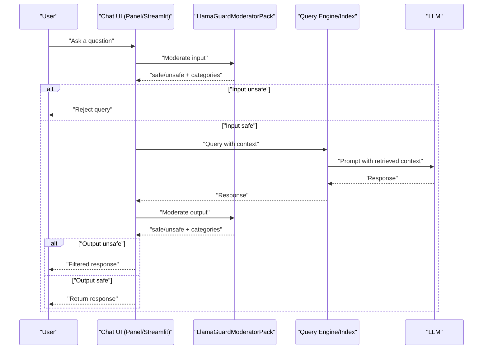
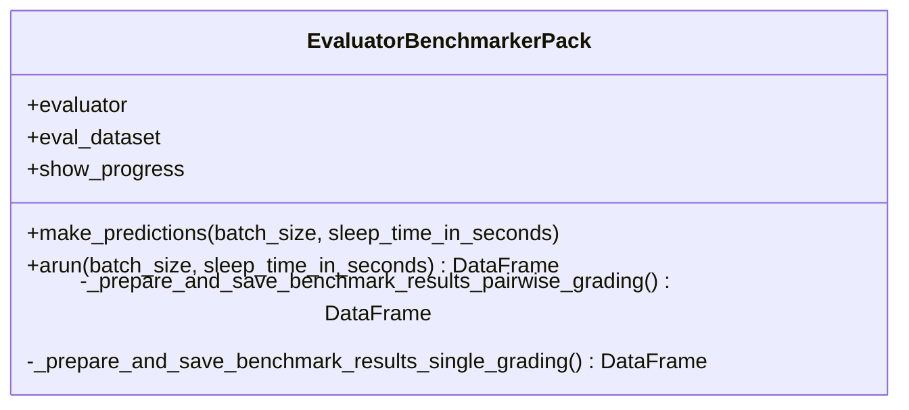
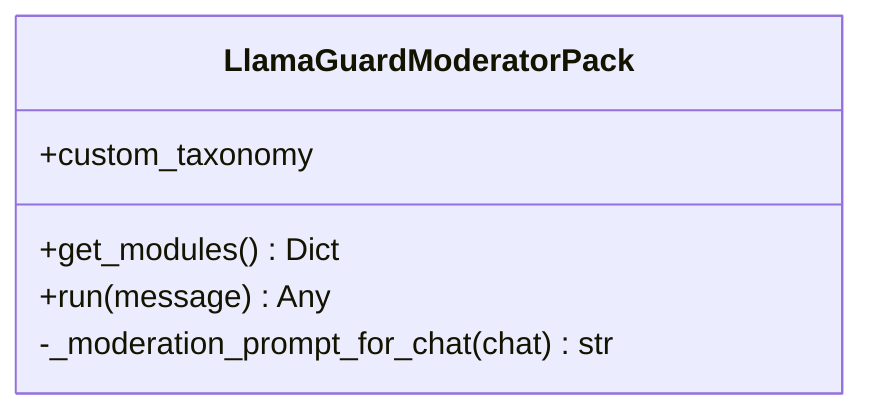
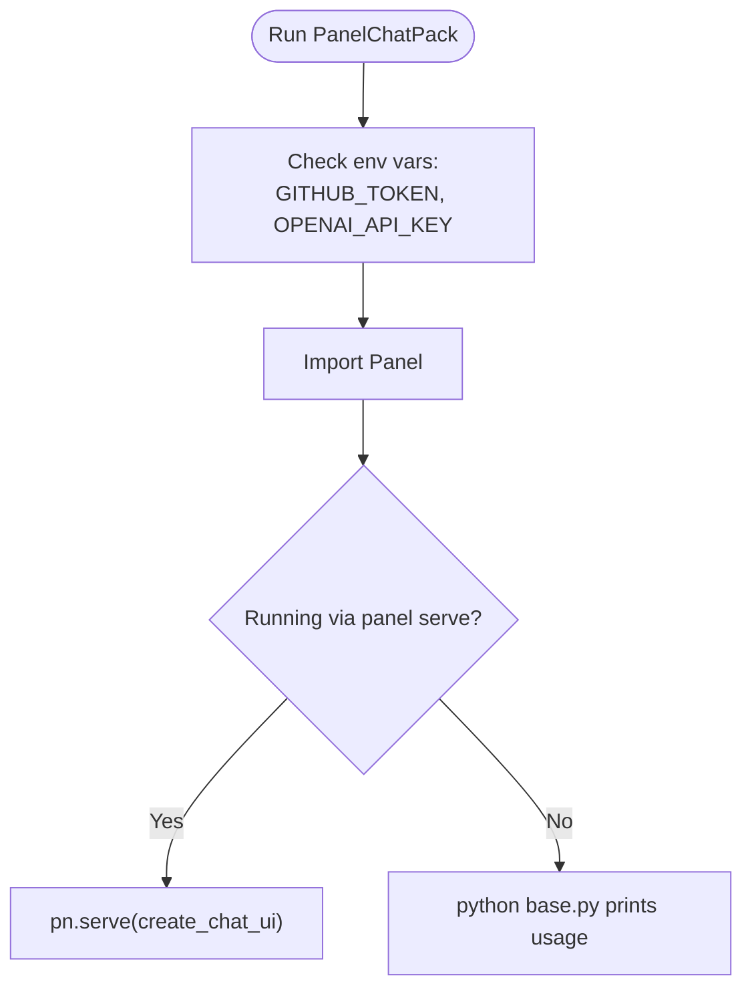
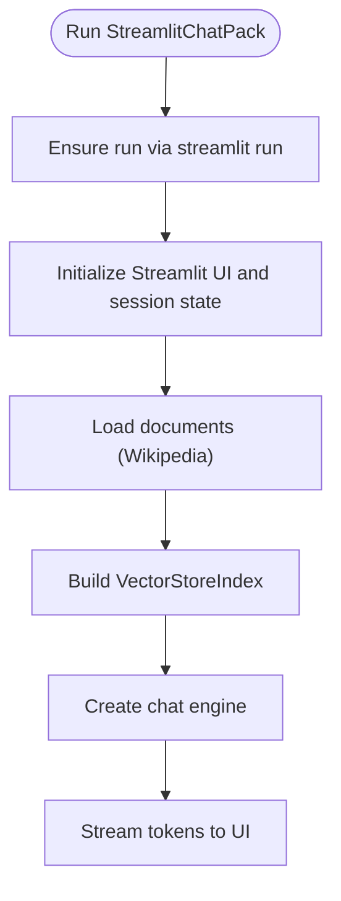
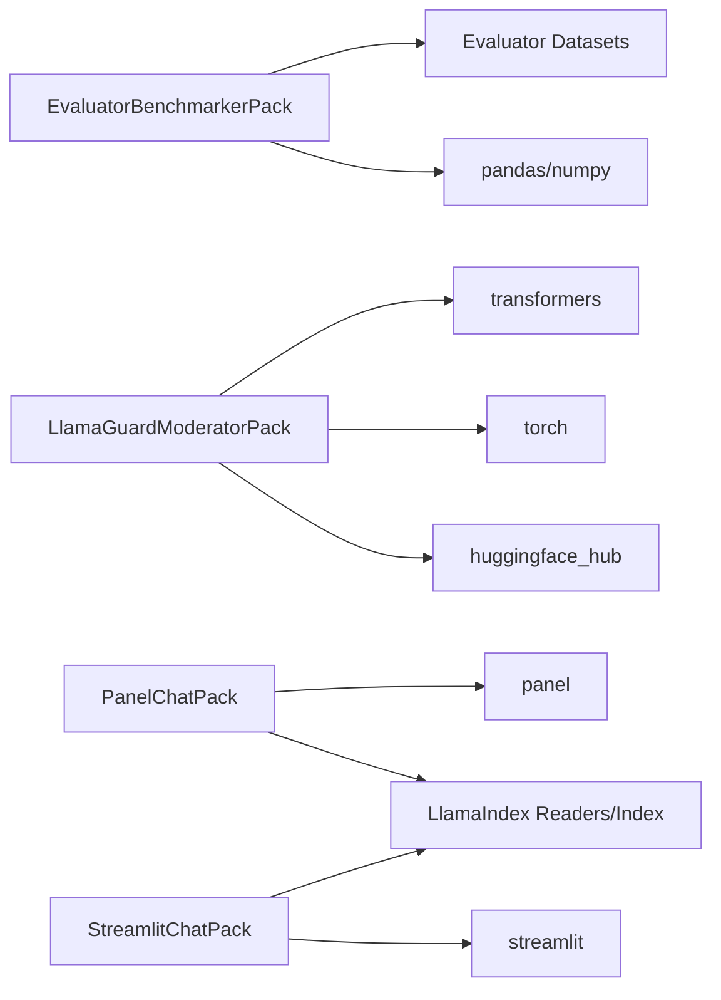

# Utility and Support Packs

<cite>
**Referenced Files in This Document**
- [README.md](file://llama-index-packs/README.md)
- [README.md](file://llama-index-packs/llama-index-packs-evaluator-benchmarker/README.md)
- [base.py](file://llama-index-packs/llama-index-packs-evaluator-benchmarker/llama_index/packs/evaluator_benchmarker/base.py)
- [README.md](file://llama-index-packs/llama-index-packs-llama-guard-moderator/README.md)
- [base.py](file://llama-index-packs/llama-index-packs-llama-guard-moderator/llama_index/packs/llama_guard_moderator/base.py)
- [README.md](file://llama-index-packs/llama-index-packs-panel-chatbot/README.md)
- [base.py](file://llama-index-packs/llama-index-packs-panel-chatbot/llama_index/packs/panel_chatbot/base.py)
- [README.md](file://llama-index-packs/llama-index-packs-streamlit-chatbot/README.md)
- [base.py](file://llama-index-packs/llama-index-packs-streamlit-chatbot/llama_index/packs/streamlit_chatbot/base.py)
</cite>

## Table of Contents
1. [Introduction](#introduction)
2. [Project Structure](#project-structure)
3. [Core Components](#core-components)
4. [Architecture Overview](#architecture-overview)
5. [Detailed Component Analysis](#detailed-component-analysis)
6. [Dependency Analysis](#dependency-analysis)
7. [Performance Considerations](#performance-considerations)
8. [Troubleshooting Guide](#troubleshooting-guide)
9. [Conclusion](#conclusion)
10. [Appendices](#appendices)

## Introduction
This document explains the Utility and Support Packs that accelerate building, evaluating, and deploying Retrieval-Augmented Generation (RAG) systems. It focuses on:
- Evaluator Benchmarker: benchmarking evaluators on labeled datasets to assess quality and reliability.
- LlamaGuard Moderator: content safety moderation for inputs and outputs in RAG pipelines.
- Panel Chatbot and Streamlit Chatbot: ready-to-use interactive UIs for conversational RAG apps.

It covers pack functionality, integration patterns, configuration, customization, monitoring, and operational guidance for development and production.

## Project Structure
The LlamaIndex repository organizes reusable packs under llama-index-packs. Each pack provides:
- A README with usage instructions and examples
- A base implementation module under llama_index/packs/<pack_name>
- Optional examples and tests

**Diagram sources**
- [README.md](file://llama-index-packs/README.md#L1-L33)
- [base.py](file://llama-index-packs/llama-index-packs-evaluator-benchmarker/llama_index/packs/evaluator_benchmarker/base.py#L16-L38)
- [base.py](file://llama-index-packs/llama-index-packs-llama-guard-moderator/llama_index/packs/llama_guard_moderator/base.py#L55-L89)
- [base.py](file://llama-index-packs/llama-index-packs-panel-chatbot/llama_index/packs/panel_chatbot/base.py#L14-L26)
- [base.py](file://llama-index-packs/llama-index-packs-streamlit-chatbot/llama_index/packs/streamlit_chatbot/base.py#L19-L39)

**Section sources**
- [README.md](file://llama-index-packs/README.md#L1-L33)

## Core Components
- Evaluator Benchmarker Pack: Runs an evaluator against a labeled dataset and computes benchmark metrics (agreement rates, MAE, correlation, Hamming score). Supports both single-grading and pairwise-grading datasets.
- LlamaGuard Moderator Pack: Integrates LlamaGuard-7b to classify user prompts and model outputs as safe or unsafe, using a configurable taxonomy.
- Panel Chatbot Pack: Provides a Panel-based chat UI that indexes a GitHub repository and streams answers from a VectorStoreIndex-backed chat engine.
- Streamlit Chatbot Pack: Provides a Streamlit-based chat UI that loads and indexes data (default Wikipedia) and streams model responses.

**Section sources**
- [README.md](file://llama-index-packs/llama-index-packs-evaluator-benchmarker/README.md#L1-L83)
- [base.py](file://llama-index-packs/llama-index-packs-evaluator-benchmarker/llama_index/packs/evaluator_benchmarker/base.py#L16-L38)
- [README.md](file://llama-index-packs/llama-index-packs-llama-guard-moderator/README.md#L1-L274)
- [base.py](file://llama-index-packs/llama-index-packs-llama-guard-moderator/llama_index/packs/llama_guard_moderator/base.py#L55-L89)
- [README.md](file://llama-index-packs/llama-index-packs-panel-chatbot/README.md#L1-L68)
- [base.py](file://llama-index-packs/llama-index-packs-panel-chatbot/llama_index/packs/panel_chatbot/base.py#L14-L26)
- [README.md](file://llama-index-packs/llama-index-packs-streamlit-chatbot/README.md#L1-L29)
- [base.py](file://llama-index-packs/llama-index-packs-streamlit-chatbot/llama_index/packs/streamlit_chatbot/base.py#L19-L39)

## Architecture Overview
The packs integrate with LlamaIndex core abstractions and external libraries. The typical RAG pipeline with safety moderation and UIs looks like:

**Diagram sources**
- [base.py](file://llama-index-packs/llama-index-packs-llama-guard-moderator/llama_index/packs/llama_guard_moderator/base.py#L99-L108)
- [base.py](file://llama-index-packs/llama-index-packs-panel-chatbot/llama_index/packs/panel_chatbot/base.py#L21-L41)
- [base.py](file://llama-index-packs/llama-index-packs-streamlit-chatbot/llama_index/packs/streamlit_chatbot/base.py#L100-L143)

## Detailed Component Analysis

### Evaluator Benchmarker Pack
Purpose:
- Benchmark an evaluator on labeled datasets to quantify quality and consistency.

Key behaviors:
- Accepts a BaseEvaluator and a labeled dataset (single-grading or pairwise).
- Generates predictions in batched fashion with optional progress reporting.
- Computes metrics:
  - Pairwise: counts of ties, inconclusives, invalid predictions, agreement rates with/without ties.
  - Single-grading: MAE, correlation, Hamming score.
- Saves a CSV report named benchmark.csv.

**Diagram sources**
- [base.py](file://llama-index-packs/llama-index-packs-evaluator-benchmarker/llama_index/packs/evaluator_benchmarker/base.py#L16-L38)
- [base.py](file://llama-index-packs/llama-index-packs-evaluator-benchmarker/llama_index/packs/evaluator_benchmarker/base.py#L54-L63)
- [base.py](file://llama-index-packs/llama-index-packs-evaluator-benchmarker/llama_index/packs/evaluator_benchmarker/base.py#L141-L147)

Usage highlights:
- Supports async run via arun with rate-limit warning for large batch sizes.
- Works with LabelledEvaluatorDataset and LabelledPairwiseEvaluatorDataset.

**Section sources**
- [README.md](file://llama-index-packs/llama-index-packs-evaluator-benchmarker/README.md#L1-L83)
- [base.py](file://llama-index-packs/llama-index-packs-evaluator-benchmarker/llama_index/packs/evaluator_benchmarker/base.py#L16-L38)
- [base.py](file://llama-index-packs/llama-index-packs-evaluator-benchmarker/llama_index/packs/evaluator_benchmarker/base.py#L141-L165)

### LlamaGuard Moderator Pack
Purpose:
- Safeguard RAG pipelines by classifying user prompts and model outputs for safety.

Key behaviors:
- Initializes a tokenizer and LlamaGuard-7b model from Hugging Face Transformers.
- Requires a Hugging Face access token via environment variable.
- Builds a moderation prompt embedding the conversation and applies the model to classify as safe or unsafe and optionally list violated categories.

**Diagram sources**
- [base.py](file://llama-index-packs/llama-index-packs-llama-guard-moderator/llama_index/packs/llama_guard_moderator/base.py#L55-L89)
- [base.py](file://llama-index-packs/llama-index-packs-llama-guard-moderator/llama_index/packs/llama_guard_moderator/base.py#L99-L108)
- [base.py](file://llama-index-packs/llama-index-packs-llama-guard-moderator/llama_index/packs/llama_guard_moderator/base.py#L110-L133)

Safety taxonomy:
- Includes default categories (violence, hate, sexual content, guns, controlled substances, self-harm).
- Supports custom taxonomy extension for domain-specific risks (e.g., sensitive financial data, prompt issues).

Operational notes:
- Requires CUDA-capable device and sufficient RAM; tested on A100.
- Environment variable HUGGINGFACE_ACCESS_TOKEN must be set.

**Section sources**
- [README.md](file://llama-index-packs/llama-index-packs-llama-guard-moderator/README.md#L1-L274)
- [base.py](file://llama-index-packs/llama-index-packs-llama-guard-moderator/llama_index/packs/llama_guard_moderator/base.py#L55-L89)
- [base.py](file://llama-index-packs/llama-index-packs-llama-guard-moderator/llama_index/packs/llama_guard_moderator/base.py#L99-L133)

### Panel Chatbot Pack
Purpose:
- Provide a Panel-based chat UI that indexes a GitHub repository and streams answers from a VectorStoreIndex-backed chat engine.

Key behaviors:
- Validates required environment variables (GitHub and OpenAI keys).
- Serves a Panel ChatInterface app via panel serve or runs locally with python.
- Delegates UI rendering and streaming to an app module.

**Diagram sources**
- [base.py](file://llama-index-packs/llama-index-packs-panel-chatbot/llama_index/packs/panel_chatbot/base.py#L21-L41)

**Section sources**
- [README.md](file://llama-index-packs/llama-index-packs-panel-chatbot/README.md#L1-L68)
- [base.py](file://llama-index-packs/llama-index-packs-panel-chatbot/llama_index/packs/panel_chatbot/base.py#L14-L46)

### Streamlit Chatbot Pack
Purpose:
- Provide a Streamlit-based chat UI that loads and indexes data (default Wikipedia) and streams model responses.

Key behaviors:
- Enforces running via streamlit run.
- Loads data using a reader, builds a VectorStoreIndex, and creates a chat engine.
- Streams tokens from the chat engine to the UI and maintains message history.

**Diagram sources**
- [base.py](file://llama-index-packs/llama-index-packs-streamlit-chatbot/llama_index/packs/streamlit_chatbot/base.py#L41-L143)

**Section sources**
- [README.md](file://llama-index-packs/llama-index-packs-streamlit-chatbot/README.md#L1-L29)
- [base.py](file://llama-index-packs/llama-index-packs-streamlit-chatbot/llama_index/packs/streamlit_chatbot/base.py#L19-L39)
- [base.py](file://llama-index-packs/llama-index-packs-streamlit-chatbot/llama_index/packs/streamlit_chatbot/base.py#L73-L99)
- [base.py](file://llama-index-packs/llama-index-packs-streamlit-chatbot/llama_index/packs/streamlit_chatbot/base.py#L100-L143)

## Dependency Analysis
Pack-level dependencies and integration points:
- Evaluator Benchmarker Pack depends on LlamaIndex evaluation datasets and evaluator abstractions, plus pandas/numpy for metrics.
- LlamaGuard Moderator Pack depends on PyTorch and Hugging Face Transformers; requires a Hugging Face access token.
- Panel Chatbot Pack depends on Panel and LlamaIndex readers/indexes; requires GitHub and OpenAI credentials.
- Streamlit Chatbot Pack depends on Streamlit and LlamaIndex readers/indexes; uses an OpenAI LLM by default.

**Diagram sources**
- [base.py](file://llama-index-packs/llama-index-packs-evaluator-benchmarker/llama_index/packs/evaluator_benchmarker/base.py#L4-L13)
- [base.py](file://llama-index-packs/llama-index-packs-llama-guard-moderator/llama_index/packs/llama_guard_moderator/base.py#L61-L86)
- [base.py](file://llama-index-packs/llama-index-packs-panel-chatbot/llama_index/packs/panel_chatbot/base.py#L27-L37)
- [base.py](file://llama-index-packs/llama-index-packs-streamlit-chatbot/llama_index/packs/streamlit_chatbot/base.py#L4-L11)

**Section sources**
- [base.py](file://llama-index-packs/llama-index-packs-evaluator-benchmarker/llama_index/packs/evaluator_benchmarker/base.py#L4-L13)
- [base.py](file://llama-index-packs/llama-index-packs-llama-guard-moderator/llama_index/packs/llama_guard_moderator/base.py#L61-L86)
- [base.py](file://llama-index-packs/llama-index-packs-panel-chatbot/llama_index/packs/panel_chatbot/base.py#L27-L37)
- [base.py](file://llama-index-packs/llama-index-packs-streamlit-chatbot/llama_index/packs/streamlit_chatbot/base.py#L4-L11)

## Performance Considerations
- Evaluator Benchmarker Pack:
  - Batch size impacts throughput and rate limits; large batch sizes increase risk of rate limiting when using cloud LLMs as judges.
  - Progress reporting helps monitor long-running evaluations.
- LlamaGuard Moderator Pack:
  - Model inference is compute-intensive; ensure adequate GPU memory and consider batching strategies if extending usage.
  - Tokenizer and model are loaded once during initialization.
- Panel and Streamlit Chatbot Packs:
  - Streaming responses improves perceived latency; ensure backend resources scale with concurrent users.
  - Indexing cost can be amortized by caching or pre-building indexes.

[No sources needed since this section provides general guidance]

## Troubleshooting Guide
Common issues and resolutions:
- Missing environment variables:
  - Panel Chatbot Pack requires GITHUB_TOKEN and OPENAI_API_KEY.
  - Streamlit Chatbot Pack requires OPENAI_API_KEY.
  - LlamaGuard Moderator Pack requires HUGGINGFACE_ACCESS_TOKEN.
- LlamaGuard runtime errors:
  - Ensure CUDA device availability and sufficient memory; verify access token validity.
- Rate limits during benchmarking:
  - Reduce batch size to avoid rate limit errors when using cloud LLMs as judges.
- Running UI packs incorrectly:
  - Panel Chatbot Pack must be served with panel serve or run via python as instructed.
  - Streamlit Chatbot Pack must be run with streamlit run.

**Section sources**
- [base.py](file://llama-index-packs/llama-index-packs-panel-chatbot/llama_index/packs/panel_chatbot/base.py#L21-L26)
- [base.py](file://llama-index-packs/llama-index-packs-streamlit-chatbot/llama_index/packs/streamlit_chatbot/base.py#L29-L33)
- [base.py](file://llama-index-packs/llama-index-packs-llama-guard-moderator/llama_index/packs/llama_guard_moderator/base.py#L71-L77)
- [base.py](file://llama-index-packs/llama-index-packs-evaluator-benchmarker/llama_index/packs/evaluator_benchmarker/base.py#L148-L157)

## Conclusion
These Utility and Support Packs streamline RAG development by providing:
- Automated benchmarking of evaluators
- Safety moderation with customizable taxonomies
- Production-ready UIs for rapid prototyping and demos

Adopt the packs by downloading them as templates, configuring environment variables, and integrating into your RAG pipeline. Monitor performance, enforce safety, and iterate quickly with built-in metrics and UIs.

[No sources needed since this section summarizes without analyzing specific files]

## Appendices

### Practical Integration Patterns
- Benchmarking workflow:
  - Download a labeled dataset, define an evaluator, instantiate the EvaluatorBenchmarkerPack, and run to produce a benchmark CSV.
- Safety-first RAG:
  - Wrap your query engine with LlamaGuardModeratorPack to filter unsafe inputs and outputs.
- Interactive demos:
  - Use PanelChatPack or StreamlitChatPack to build a chat UI around your index and deploy as a standalone app.

**Section sources**
- [README.md](file://llama-index-packs/llama-index-packs-evaluator-benchmarker/README.md#L22-L65)
- [README.md](file://llama-index-packs/llama-index-packs-llama-guard-moderator/README.md#L75-L125)
- [README.md](file://llama-index-packs/llama-index-packs-panel-chatbot/README.md#L17-L41)
- [README.md](file://llama-index-packs/llama-index-packs-streamlit-chatbot/README.md#L9-L28)