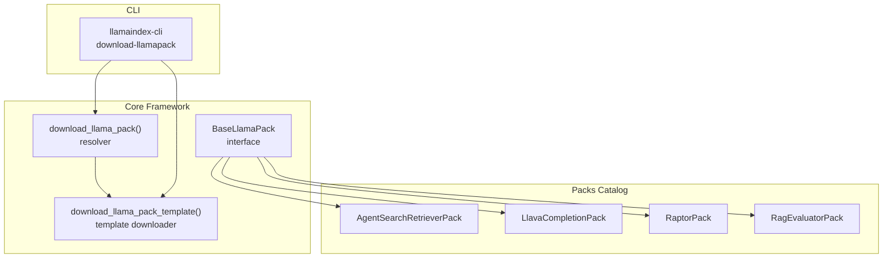
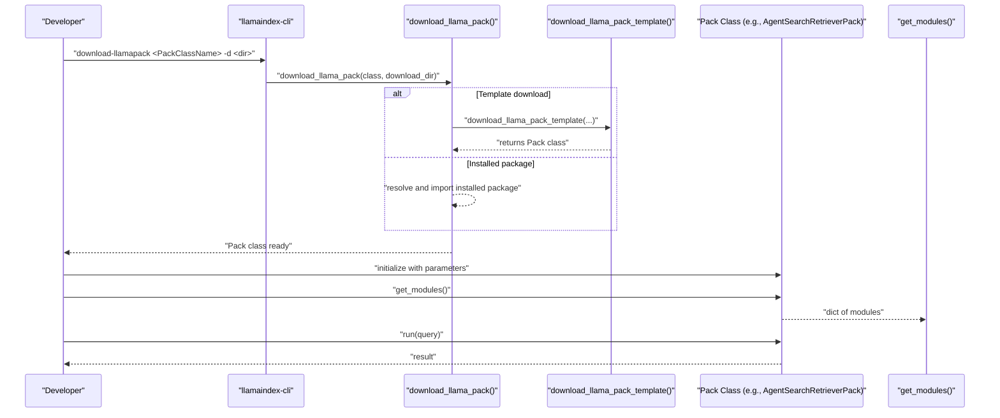
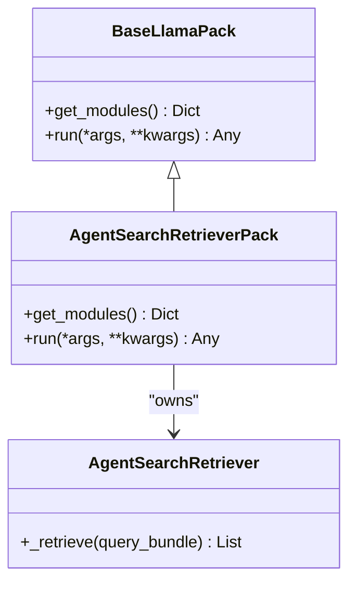
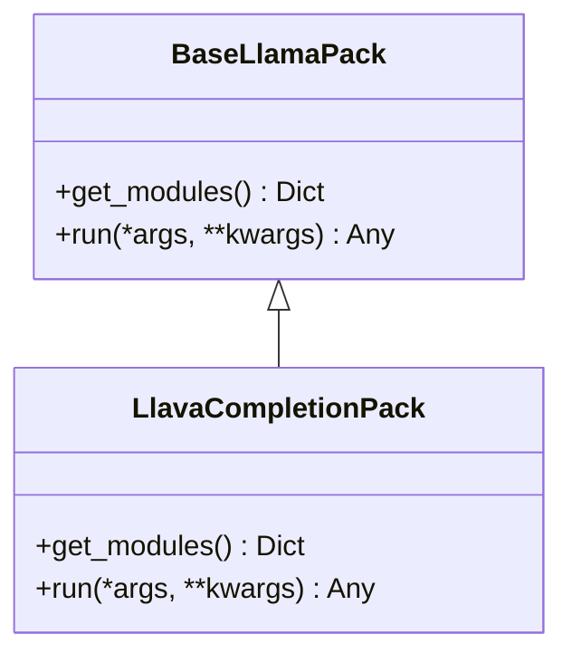
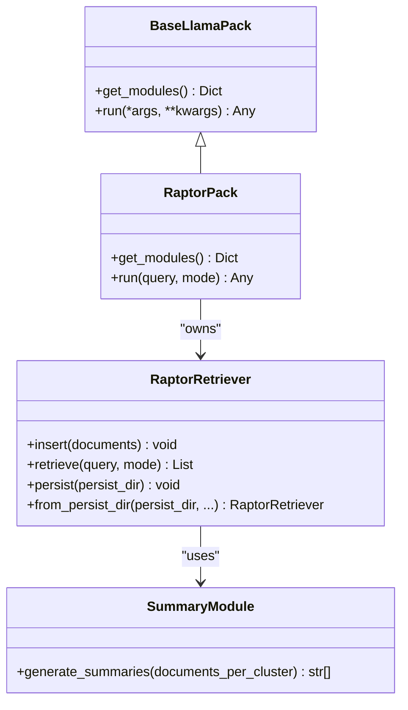
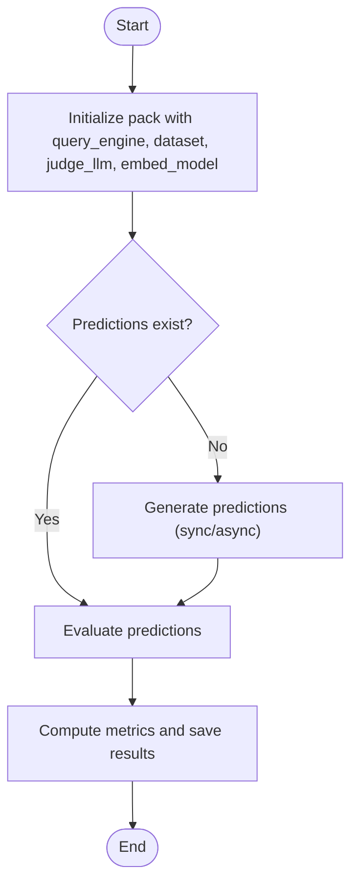
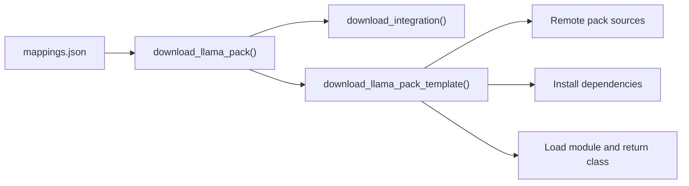

# Application Templates (Packs)

<cite>
**Referenced Files in This Document**
- [README.md](file://llama-index-packs/README.md)
- [base.py](file://llama-index-core/llama_index/core/llama_pack/base.py)
- [download.py](file://llama-index-core/llama_index/core/llama_pack/download.py)
- [pack.py](file://llama-index-core/llama_index/core/download/pack.py)
- [__init__.py](file://llama-index-core/llama_index/core/llama_pack/__init__.py)
- [command_line.py](file://llama-index-cli/llama_index/cli/command_line.py)
- [AgentSearchRetrieverPack base.py](file://llama-index-packs/llama-index-packs-agent-search-retriever/llama_index/packs/agent_search_retriever/base.py)
- [LlavaCompletionPack base.py](file://llama-index-packs/llama-index-packs-llava-completion/llama_index/packs/llava_completion/base.py)
- [RaptorPack base.py](file://llama-index-packs/llama-index-packs-raptor/llama_index/packs/raptor/base.py)
- [RagEvaluatorPack base.py](file://llama-index-packs/llama-index-packs-rag-evaluator/llama_index/packs/rag_evaluator/base.py)
- [_example.py](file://llama-index-packs/llama-index-packs-agent-search-retriever/examples/_example.py)
</cite>

## Table of Contents
1. [Introduction](#introduction)
2. [Project Structure](#project-structure)
3. [Core Components](#core-components)
4. [Architecture Overview](#architecture-overview)
5. [Detailed Component Analysis](#detailed-component-analysis)
6. [Dependency Analysis](#dependency-analysis)
7. [Performance Considerations](#performance-considerations)
8. [Troubleshooting Guide](#troubleshooting-guide)
9. [Conclusion](#conclusion)
10. [Appendices](#appendices)

## Introduction
LlamaIndex Packs are pre-built application modules designed to accelerate development by combining core LlamaIndex components with integration packages into ready-to-use templates. They encapsulate common RAG, retrieval, evaluation, and multi-modal workflows behind a simple interface, enabling rapid prototyping and production deployment. Packs expose a uniform contract: a class inheriting from a base pack interface and implementing methods to retrieve internal modules and run the pipeline. Users can consume packs directly from PyPI or download them as templates for customization.

## Project Structure
The Packs ecosystem is organized around:
- Core Pack framework: base class and download utilities
- CLI integration: commands to discover, download, and initialize packs
- Pack catalog: individual pack packages under a dedicated namespace
- Examples and tests: usage demonstrations and validation

**Diagram sources**
- [base.py](file://llama-index-core/llama_index/core/llama_pack/base.py#L7-L15)
- [download.py](file://llama-index-core/llama_index/core/llama_pack/download.py#L14-L75)
- [pack.py](file://llama-index-core/llama_index/core/download/pack.py#L99-L134)
- [command_line.py](file://llama-index-cli/llama_index/cli/command_line.py#L161-L188)
- [AgentSearchRetrieverPack base.py](file://llama-index-packs/llama-index-packs-agent-search-retriever/llama_index/packs/agent_search_retriever/base.py#L68-L95)
- [LlavaCompletionPack base.py](file://llama-index-packs/llama-index-packs-llava-completion/llama_index/packs/llava_completion/base.py#L9-L40)
- [RaptorPack base.py](file://llama-index-packs/llama-index-packs-raptor/llama_index/packs/raptor/base.py#L349-L388)
- [RagEvaluatorPack base.py](file://llama-index-packs/llama-index-packs-rag-evaluator/llama_index/packs/rag_evaluator/base.py#L33-L462)

**Section sources**
- [README.md](file://llama-index-packs/README.md#L1-L33)
- [base.py](file://llama-index-core/llama_index/core/llama_pack/base.py#L1-L15)
- [download.py](file://llama-index-core/llama_index/core/llama_pack/download.py#L1-L75)
- [pack.py](file://llama-index-core/llama_index/core/download/pack.py#L1-L152)
- [command_line.py](file://llama-index-cli/llama_index/cli/command_line.py#L149-L281)

## Core Components
- BaseLlamaPack: Defines the contract for all packs with two methods:
  - get_modules(): returns a dictionary of internal modules (e.g., retrievers, LLMs, indexes)
  - run(): executes the pack’s pipeline and returns results
- download_llama_pack(): resolves a pack class name to its package, installs or fetches it, and validates it inherits from BaseLlamaPack
- download_llama_pack_template(): downloads a pack as a template into a local directory, installs dependencies, and returns the resolved class
- CLI download-llamapack: exposes a command-line interface to download packs into a target directory

Typical pack composition:
- Initialize pack with parameters (e.g., credentials, model choices, retrieval settings)
- Access internal modules via get_modules()
- Invoke run() with query or data inputs

**Section sources**
- [base.py](file://llama-index-core/llama_index/core/llama_pack/base.py#L7-L15)
- [download.py](file://llama-index-core/llama_index/core/llama_pack/download.py#L14-L75)
- [pack.py](file://llama-index-core/llama_index/core/download/pack.py#L99-L134)
- [__init__.py](file://llama-index-core/llama_index/core/llama_pack/__init__.py#L1-L10)
- [command_line.py](file://llama-index-cli/llama_index/cli/command_line.py#L161-L188)

## Architecture Overview
The Pack architecture follows a layered pattern:
- Interface layer: BaseLlamaPack defines the contract
- Resolution layer: download_llama_pack maps class names to packages and ensures compatibility
- Template layer: download_llama_pack_template fetches source files, installs dependencies, and loads the class
- CLI layer: llamaindex-cli provides a user-friendly entry point for discovery and download
- Implementation layer: individual packs assemble core components into cohesive workflows

**Diagram sources**
- [command_line.py](file://llama-index-cli/llama_index/cli/command_line.py#L161-L188)
- [download.py](file://llama-index-core/llama_index/core/llama_pack/download.py#L14-L75)
- [pack.py](file://llama-index-core/llama_index/core/download/pack.py#L99-L134)
- [AgentSearchRetrieverPack base.py](file://llama-index-packs/llama-index-packs-agent-search-retriever/llama_index/packs/agent_search_retriever/base.py#L68-L95)

## Detailed Component Analysis

### AgentSearchRetrieverPack
- Purpose: Provides a retriever backed by an external search provider, returning scored nodes for downstream query engines
- Key parameters: search provider selection, API key/base URL, top-k retrieval
- Composition: Holds a retriever instance and exposes it via get_modules(); run delegates to the retriever
- Example usage: Demonstrates initializing the pack, constructing a retriever-backed query engine, and querying

**Diagram sources**
- [base.py](file://llama-index-core/llama_index/core/llama_pack/base.py#L7-L15)
- [AgentSearchRetrieverPack base.py](file://llama-index-packs/llama-index-packs-agent-search-retriever/llama_index/packs/agent_search_retriever/base.py#L15-L66)
- [AgentSearchRetrieverPack base.py](file://llama-index-packs/llama-index-packs-agent-search-retriever/llama_index/packs/agent_search_retriever/base.py#L68-L95)

**Section sources**
- [AgentSearchRetrieverPack base.py](file://llama-index-packs/llama-index-packs-agent-search-retriever/llama_index/packs/agent_search_retriever/base.py#L1-L95)
- [_example.py](file://llama-index-packs/llama-index-packs-agent-search-retriever/examples/_example.py#L1-L19)

### LlavaCompletionPack
- Purpose: Wraps a multi-modal LLM to complete prompts with images, exposing the LLM and image URL
- Key parameters: image URL and environment configuration for the underlying LLM provider
- Composition: Stores an LLM instance and returns it via get_modules(); run delegates to the LLM completion

**Diagram sources**
- [base.py](file://llama-index-core/llama_index/core/llama_pack/base.py#L7-L15)
- [LlavaCompletionPack base.py](file://llama-index-packs/llama-index-packs-llava-completion/llama_index/packs/llava_completion/base.py#L9-L40)

**Section sources**
- [LlavaCompletionPack base.py](file://llama-index-packs/llama-index-packs-llava-completion/llama_index/packs/llava_completion/base.py#L1-L40)

### RaptorPack
- Purpose: Implements hierarchical retrieval with summarization across abstraction levels
- Key parameters: documents, LLM, embedding model, vector store, tree depth, top-k, query mode
- Composition: Encapsulates a retriever with asynchronous insertion and retrieval logic; supports persistence and loading from persisted storage

**Diagram sources**
- [base.py](file://llama-index-core/llama_index/core/llama_pack/base.py#L7-L15)
- [RaptorPack base.py](file://llama-index-packs/llama-index-packs-raptor/llama_index/packs/raptor/base.py#L47-L105)
- [RaptorPack base.py](file://llama-index-packs/llama-index-packs-raptor/llama_index/packs/raptor/base.py#L107-L347)
- [RaptorPack base.py](file://llama-index-packs/llama-index-packs-raptor/llama_index/packs/raptor/base.py#L349-L388)

**Section sources**
- [RaptorPack base.py](file://llama-index-packs/llama-index-packs-raptor/llama_index/packs/raptor/base.py#L1-L388)

### RagEvaluatorPack
- Purpose: Evaluates a RAG pipeline against a dataset using multiple metrics (correctness, relevance, faithfulness, context similarity)
- Key parameters: query engine, dataset, judge LLM, embedding model, progress visibility, result path
- Composition: Manages prediction generation and evaluation, batching, async execution, and result persistence

**Diagram sources**
- [RagEvaluatorPack base.py](file://llama-index-packs/llama-index-packs-rag-evaluator/llama_index/packs/rag_evaluator/base.py#L44-L111)
- [RagEvaluatorPack base.py](file://llama-index-packs/llama-index-packs-rag-evaluator/llama_index/packs/rag_evaluator/base.py#L112-L127)
- [RagEvaluatorPack base.py](file://llama-index-packs/llama-index-packs-rag-evaluator/llama_index/packs/rag_evaluator/base.py#L287-L411)

**Section sources**
- [RagEvaluatorPack base.py](file://llama-index-packs/llama-index-packs-rag-evaluator/llama_index/packs/rag_evaluator/base.py#L1-L462)

### Pack Categories and Practical Examples
- Agent search retrievers: Use AgentSearchRetrieverPack to integrate external search APIs into retrieval pipelines
- Multi-modal packs: Use LlavaCompletionPack to incorporate image understanding into completions
- Retrieval enhancement packs: Use RaptorPack to build hierarchical retrieval with summarization
- Evaluation packs: Use RagEvaluatorPack to benchmark RAG pipelines against datasets
- Discovery and installation: Use the CLI to download packs as templates for customization

Practical deployment examples:
- Research assistant: Combine a retriever pack with a query engine and prompt template
- Customer support agent: Integrate a retriever pack with an LLM and conversational memory
- Content creation tool: Pair a multi-modal pack with a generator to produce text from images

**Section sources**
- [README.md](file://llama-index-packs/README.md#L1-L33)
- [AgentSearchRetrieverPack base.py](file://llama-index-packs/llama-index-packs-agent-search-retriever/llama_index/packs/agent_search_retriever/base.py#L68-L95)
- [LlavaCompletionPack base.py](file://llama-index-packs/llama-index-packs-llava-completion/llama_index/packs/llava_completion/base.py#L9-L40)
- [RaptorPack base.py](file://llama-index-packs/llama-index-packs-raptor/llama_index/packs/raptor/base.py#L349-L388)
- [RagEvaluatorPack base.py](file://llama-index-packs/llama-index-packs-rag-evaluator/llama_index/packs/rag_evaluator/base.py#L33-L462)

## Dependency Analysis
- Pack resolution depends on:
  - Mapping of pack class names to Python package names
  - Availability of the pack either as an installed package or as a downloadable template
  - Validation that the resolved class inherits from BaseLlamaPack
- Template download depends on:
  - Remote source file enumeration and content retrieval
  - Local directory initialization and dependency installation
  - Module loading via importlib spec loader

**Diagram sources**
- [download.py](file://llama-index-core/llama_index/core/llama_pack/download.py#L36-L74)
- [pack.py](file://llama-index-core/llama_index/core/download/pack.py#L99-L134)

**Section sources**
- [download.py](file://llama-index-core/llama_index/core/llama_pack/download.py#L14-L75)
- [pack.py](file://llama-index-core/llama_index/core/download/pack.py#L1-L152)

## Performance Considerations
- Asynchronous operations: Some packs (e.g., RaptorPack) leverage async retrieval and summarization to improve throughput
- Batching and rate limiting: Evaluation packs batch tasks and handle rate limits gracefully, caching partial results
- Persistence: Packs supporting persistence enable reuse of computed indexes across runs, reducing cold-start costs
- Parameter tuning: Adjust top-k, worker counts, and batch sizes to balance quality and latency

[No sources needed since this section provides general guidance]

## Troubleshooting Guide
Common issues and resolutions:
- Missing dependencies: Ensure required integrations are installed when using packs that depend on external libraries
- API keys and environment variables: Some packs require environment variables (e.g., API tokens); verify configuration before running
- Rate limits during evaluation: Evaluation packs handle rate limit errors and maintain state; resume by re-invoking the run method
- Template download failures: Confirm network connectivity and that the pack name matches the expected mapping

**Section sources**
- [AgentSearchRetrieverPack base.py](file://llama-index-packs/llama-index-packs-agent-search-retriever/llama_index/packs/agent_search_retriever/base.py#L25-L31)
- [RagEvaluatorPack base.py](file://llama-index-packs/llama-index-packs-rag-evaluator/llama_index/packs/rag_evaluator/base.py#L384-L392)

## Conclusion
LlamaIndex Packs streamline the development of RAG and related AI applications by providing reusable, composable modules. With a consistent interface, robust download mechanisms, and diverse implementations, packs accelerate both experimentation and production deployments. Developers can choose from curated packs, extend them via templates, and contribute new packs aligned with established patterns.

[No sources needed since this section summarizes without analyzing specific files]

## Appendices

### Pack Discovery, Installation, and Customization
- Discover packs: Visit the catalog and select a pack of interest
- Install packs: Use pip to install a pack package directly
- Download templates: Use the CLI or the download function to fetch a pack as a template for customization
- Integrate into applications: Instantiate the pack, retrieve modules, and wire them into your existing pipelines

**Section sources**
- [README.md](file://llama-index-packs/README.md#L1-L33)
- [command_line.py](file://llama-index-cli/llama_index/cli/command_line.py#L161-L188)
- [download.py](file://llama-index-core/llama_index/core/llama_pack/download.py#L14-L75)
- [pack.py](file://llama-index-core/llama_index/core/download/pack.py#L99-L134)

### Pack Composition Patterns and Parameter Configuration
- Composition patterns:
  - Retriever-first: Build a retriever pack and wrap it in a query engine
  - Generator-first: Use a multi-modal or LLM pack to generate content
  - Evaluation-first: Evaluate an existing pipeline using an evaluator pack
- Parameter configuration:
  - Pass credentials and endpoints via environment variables or constructor parameters
  - Tune retrieval and generation parameters (top-k, depth, workers) for performance and quality
  - Configure persistence for long-running pipelines

**Section sources**
- [AgentSearchRetrieverPack base.py](file://llama-index-packs/llama-index-packs-agent-search-retriever/llama_index/packs/agent_search_retriever/base.py#L68-L95)
- [LlavaCompletionPack base.py](file://llama-index-packs/llama-index-packs-llava-completion/llama_index/packs/llava_completion/base.py#L12-L28)
- [RaptorPack base.py](file://llama-index-packs/llama-index-packs-raptor/llama_index/packs/raptor/base.py#L352-L373)
- [RagEvaluatorPack base.py](file://llama-index-packs/llama-index-packs-rag-evaluator/llama_index/packs/rag_evaluator/base.py#L44-L81)

### Maintenance, Updates, and Community Contributions
- Maintenance: Keep packs updated by reinstalling packages or redownloading templates
- Updates: Review changelogs and migration notes when upgrading packs
- Community contributions: Follow the established pack patterns, provide examples and tests, and publish to the catalog

[No sources needed since this section provides general guidance]