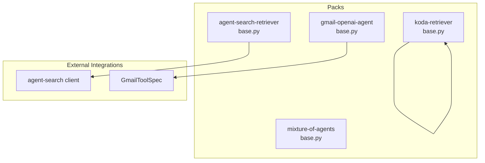
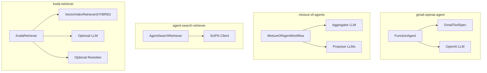
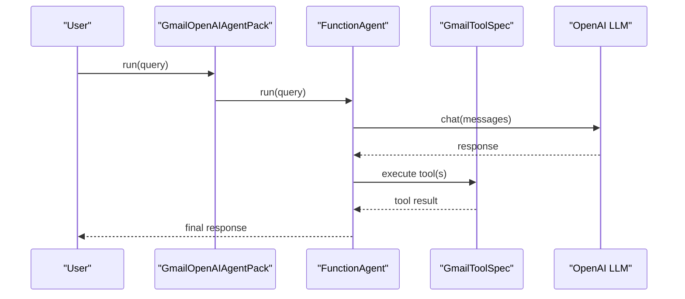
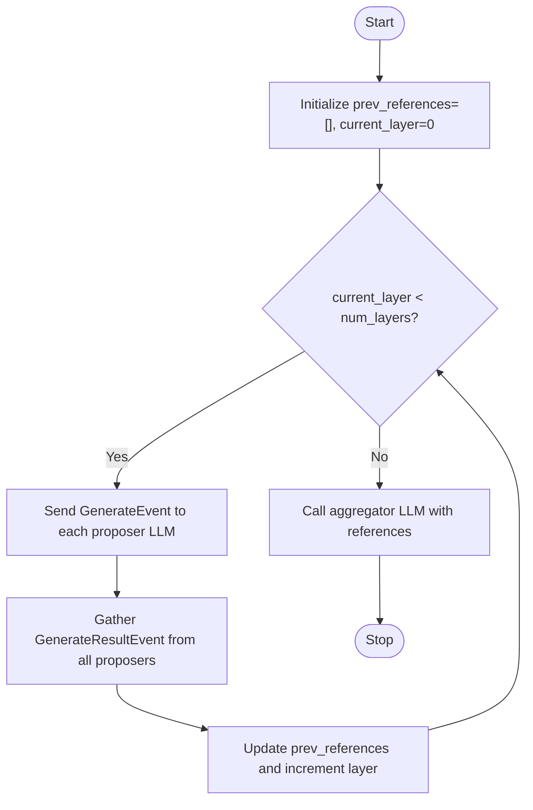
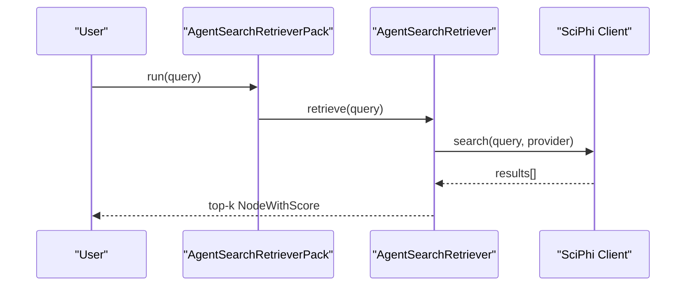
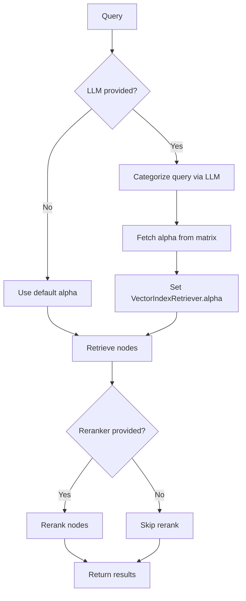
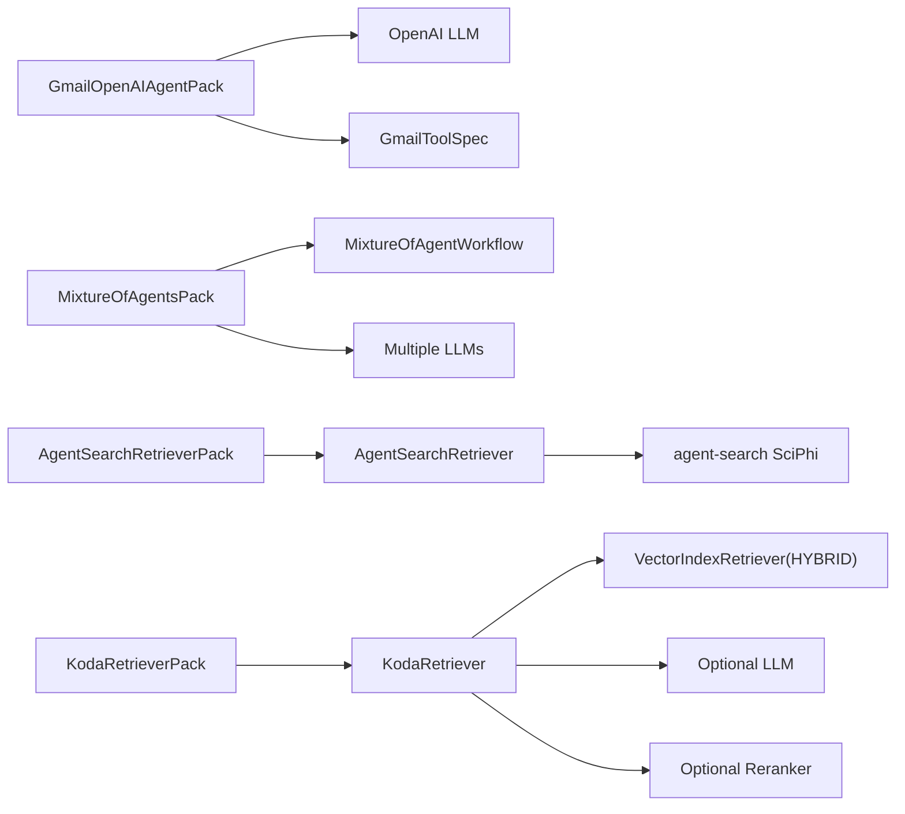

# Agent Packs

<cite>
**Referenced Files in This Document**
- [gmail_openai_agent/base.py](file://llama-index-packs/llama-index-packs-gmail-openai-agent/llama_index/packs/gmail_openai_agent/base.py)
- [gmail_openai_agent/README.md](file://llama-index-packs/llama-index-packs-gmail-openai-agent/README.md)
- [mixture_of_agents/base.py](file://llama-index-packs/llama-index-packs-mixture-of-agents/llama_index/packs/mixture_of_agents/base.py)
- [mixture_of_agents/README.md](file://llama-index-packs/llama-index-packs-mixture-of-agents/README.md)
- [agent_search_retriever/base.py](file://llama-index-packs/llama-index-packs-agent-search-retriever/llama_index/packs/agent_search_retriever/base.py)
- [agent_search_retriever/README.md](file://llama-index-packs/llama-index-packs-agent-search-retriever/README.md)
- [koda_retriever/base.py](file://llama-index-packs/llama-index-packs-koda-retriever/llama_index/packs/koda_retriever/base.py)
- [koda_retriever/constants.py](file://llama-index-packs/llama-index-packs-koda-retriever/llama_index/packs/koda_retriever/constants.py)
- [koda_retriever/matrix.py](file://llama-index-packs/llama-index-packs-koda-retriever/llama_index/packs/koda_retriever/matrix.py)
- [koda_retriever/README.md](file://llama-index-packs/llama-index-packs-koda-retriever/README.md)
</cite>

## Table of Contents
1. [Introduction](#introduction)
2. [Project Structure](#project-structure)
3. [Core Components](#core-components)
4. [Architecture Overview](#architecture-overview)
5. [Detailed Component Analysis](#detailed-component-analysis)
6. [Dependency Analysis](#dependency-analysis)
7. [Performance Considerations](#performance-considerations)
8. [Troubleshooting Guide](#troubleshooting-guide)
9. [Conclusion](#conclusion)
10. [Appendices](#appendices)

## Introduction
This document provides a comprehensive guide to four Agent Packs that demonstrate intelligent agent implementations and orchestration patterns within the LlamaIndex ecosystem:
- gmail-openai-agent: an email-processing agent integrating a Gmail tool via an OpenAI LLM.
- mixture-of-agents: a distributed agent coordination pattern leveraging multiple LLMs in layers.
- agent-search-retriever: a search-enhanced retriever powered by the AgentSearch API.
- koda-retriever: a specialized hybrid retrieval system that dynamically tunes alpha per query category.

For each pack, we explain agent architecture, tool integration patterns, decision-making processes, and communication protocols. We also include configuration guidance for different LLM providers, tool selection strategies, state management, deployment patterns, monitoring, error handling, performance optimization, cost management, scalability, and troubleshooting.

## Project Structure
Each Agent Pack resides under llama-index-packs/<pack-name> with a dedicated module under llama_index/packs/<pack_name>. The packs expose a BaseLlamaPack subclass and a runnable interface. Some packs integrate external libraries (e.g., agent-search, Gmail tool) and rely on LlamaIndex core abstractions such as BaseRetriever, BaseLlamaPack, and LLMs.

**Diagram sources**
- [gmail_openai_agent/base.py](file://llama-index-packs/llama-index-packs-gmail-openai-agent/llama_index/packs/gmail_openai_agent/base.py#L1-L38)
- [mixture_of_agents/base.py](file://llama-index-packs/llama-index-packs-mixture-of-agents/llama_index/packs/mixture_of_agents/base.py#L1-L183)
- [agent_search_retriever/base.py](file://llama-index-packs/llama-index-packs-agent-search-retriever/llama_index/packs/agent_search_retriever/base.py#L1-L95)
- [koda_retriever/base.py](file://llama-index-packs/llama-index-packs-koda-retriever/llama_index/packs/koda_retriever/base.py#L1-L263)

**Section sources**
- [gmail_openai_agent/README.md](file://llama-index-packs/llama-index-packs-gmail-openai-agent/README.md#L1-L51)
- [mixture_of_agents/README.md](file://llama-index-packs/llama-index-packs-mixture-of-agents/README.md#L1-L81)
- [agent_search_retriever/README.md](file://llama-index-packs/llama-index-packs-agent-search-retriever/README.md#L1-L60)
- [koda_retriever/README.md](file://llama-index-packs/llama-index-packs-koda-retriever/README.md#L1-L78)

## Core Components
- GmailOpenAIAgentPack: Wraps a Gmail tool spec and a FunctionAgent configured with an OpenAI LLM. Provides run() and arun() wrappers around agent.chat().
- MixtureOfAgentsPack: Orchestrates a layered workflow of proposer LLMs and an aggregator LLM. Uses a custom workflow with events to collect references and synthesize final answers.
- AgentSearchRetrieverPack: Exposes a retriever backed by the AgentSearch API client, supporting multiple search providers and returning NodeWithScore results.
- KodaRetrieverPack: Implements a hybrid retriever that auto-classifies queries and selects an optimal alpha for vector-sparse fusion, optionally with reranking.

**Section sources**
- [gmail_openai_agent/base.py](file://llama-index-packs/llama-index-packs-gmail-openai-agent/llama_index/packs/gmail_openai_agent/base.py#L13-L38)
- [mixture_of_agents/base.py](file://llama-index-packs/llama-index-packs-mixture-of-agents/llama_index/packs/mixture_of_agents/base.py#L45-L183)
- [agent_search_retriever/base.py](file://llama-index-packs/llama-index-packs-agent-search-retriever/llama_index/packs/agent_search_retriever/base.py#L15-L95)
- [koda_retriever/base.py](file://llama-index-packs/llama-index-packs-koda-retriever/llama_index/packs/koda_retriever/base.py#L26-L263)

## Architecture Overview
The following diagram maps the high-level architecture of each pack, showing how modules interact and where external integrations are invoked.

**Diagram sources**
- [gmail_openai_agent/base.py](file://llama-index-packs/llama-index-packs-gmail-openai-agent/llama_index/packs/gmail_openai_agent/base.py#L13-L38)
- [mixture_of_agents/base.py](file://llama-index-packs/llama-index-packs-mixture-of-agents/llama_index/packs/mixture_of_agents/base.py#L45-L183)
- [agent_search_retriever/base.py](file://llama-index-packs/llama-index-packs-agent-search-retriever/llama_index/packs/agent_search_retriever/base.py#L15-L95)
- [koda_retriever/base.py](file://llama-index-packs/llama-index-packs-koda-retriever/llama_index/packs/koda_retriever/base.py#L26-L263)

## Detailed Component Analysis

### Gmail OpenAI Agent Pack
- Agent architecture: A FunctionAgent is initialized with a Gmail tool spec and an OpenAI LLM. The agent exposes run() and arun() methods that delegate to the underlying agent’s asynchronous execution.
- Tool integration: The GmailToolSpec is imported dynamically and converted to a tool list for the agent.
- Decision-making: The agent uses the LLM to decide how to use the Gmail tool to fulfill user requests.
- Communication protocol: The pack exposes get_modules() to return the tool spec and agent, enabling reuse in other agents or inspection.

**Diagram sources**
- [gmail_openai_agent/base.py](file://llama-index-packs/llama-index-packs-gmail-openai-agent/llama_index/packs/gmail_openai_agent/base.py#L13-L38)

**Section sources**
- [gmail_openai_agent/base.py](file://llama-index-packs/llama-index-packs-gmail-openai-agent/llama_index/packs/gmail_openai_agent/base.py#L13-L38)
- [gmail_openai_agent/README.md](file://llama-index-packs/llama-index-packs-gmail-openai-agent/README.md#L1-L51)

### Mixture-of-Agents Pack
- Agent architecture: A layered workflow where proposer LLMs generate diverse responses, and an aggregator LLM synthesizes them. The workflow uses typed events to coordinate generation, gathering, and iteration across layers.
- Tool integration: The pack does not define tools; it orchestrates LLMs. Proposer and aggregator LLMs are passed during initialization.
- Decision-making: At each layer, the workflow sends generate events to proposer LLMs with injected references. After collecting results, it increments the layer and repeats until reaching the final layer, where the aggregator produces the final answer.
- Communication protocol: Events (GenerateEvent, GenerateResultEvent, LoopEvent, GatherEvent) drive the workflow. The pack exposes get_modules() to return LLMs and workflow parameters.

**Diagram sources**
- [mixture_of_agents/base.py](file://llama-index-packs/llama-index-packs-mixture-of-agents/llama_index/packs/mixture_of_agents/base.py#L45-L154)

**Section sources**
- [mixture_of_agents/base.py](file://llama-index-packs/llama-index-packs-mixture-of-agents/llama_index/packs/mixture_of_agents/base.py#L45-L183)
- [mixture_of_agents/README.md](file://llama-index-packs/llama-index-packs-mixture-of-agents/README.md#L1-L81)

### Agent-Search Retriever Pack
- Agent architecture: A retriever that wraps the AgentSearch client. It supports multiple search providers and returns a list of NodeWithScore objects.
- Tool integration: Uses the agent-search Python package and the SciPhi client to perform searches.
- Decision-making: The retriever executes a search query and deduplicates results, then returns top-k nodes with metadata.
- Communication protocol: The pack exposes a run() method that delegates to the retriever’s retrieve() method.

**Diagram sources**
- [agent_search_retriever/base.py](file://llama-index-packs/llama-index-packs-agent-search-retriever/llama_index/packs/agent_search_retriever/base.py#L15-L95)

**Section sources**
- [agent_search_retriever/base.py](file://llama-index-packs/llama-index-packs-agent-search-retriever/llama_index/packs/agent_search_retriever/base.py#L15-L95)
- [agent_search_retriever/README.md](file://llama-index-packs/llama-index-packs-agent-search-retriever/README.md#L1-L60)

### Koda Retriever Pack
- Agent architecture: A hybrid retriever that dynamically selects alpha per query category using an LLM classifier and an alpha matrix. It optionally applies reranking.
- Tool integration: Uses VectorIndexRetriever in HYBRID mode and supports optional reranking via a postprocessor.
- Decision-making: If an LLM is provided, the query is categorized, alpha is fetched from the matrix, applied to the retriever, and results are optionally reranked.
- Communication protocol: The pack exposes run() and arun() methods delegating to the retriever’s synchronous and asynchronous retrieve methods.

**Diagram sources**
- [koda_retriever/base.py](file://llama-index-packs/llama-index-packs-koda-retriever/llama_index/packs/koda_retriever/base.py#L178-L224)
- [koda_retriever/constants.py](file://llama-index-packs/llama-index-packs-koda-retriever/llama_index/packs/koda_retriever/constants.py#L1-L63)
- [koda_retriever/matrix.py](file://llama-index-packs/llama-index-packs-koda-retriever/llama_index/packs/koda_retriever/matrix.py#L1-L99)

**Section sources**
- [koda_retriever/base.py](file://llama-index-packs/llama-index-packs-koda-retriever/llama_index/packs/koda_retriever/base.py#L26-L263)
- [koda_retriever/constants.py](file://llama-index-packs/llama-index-packs-koda-retriever/llama_index/packs/koda_retriever/constants.py#L1-L63)
- [koda_retriever/matrix.py](file://llama-index-packs/llama-index-packs-koda-retriever/llama_index/packs/koda_retriever/matrix.py#L1-L99)
- [koda_retriever/README.md](file://llama-index-packs/llama-index-packs-koda-retriever/README.md#L1-L78)

## Dependency Analysis
- gmail-openai-agent depends on:
  - LlamaIndex agent workflow and OpenAI LLM.
  - GmailToolSpec from LlamaHub (import-time guarded).
- mixture-of-agents depends on:
  - LlamaIndex workflow primitives and LLM abstractions.
  - Multiple LLM instances for proposers and one for aggregation.
- agent-search-retriever depends on:
  - agent-search package and SciPhi client.
- koda-retriever depends on:
  - VectorIndexRetriever in HYBRID mode, optional reranker, and an LLM for categorization.

**Diagram sources**
- [gmail_openai_agent/base.py](file://llama-index-packs/llama-index-packs-gmail-openai-agent/llama_index/packs/gmail_openai_agent/base.py#L13-L38)
- [mixture_of_agents/base.py](file://llama-index-packs/llama-index-packs-mixture-of-agents/llama_index/packs/mixture_of_agents/base.py#L45-L183)
- [agent_search_retriever/base.py](file://llama-index-packs/llama-index-packs-agent-search-retriever/llama_index/packs/agent_search_retriever/base.py#L15-L95)
- [koda_retriever/base.py](file://llama-index-packs/llama-index-packs-koda-retriever/llama_index/packs/koda_retriever/base.py#L26-L263)

**Section sources**
- [gmail_openai_agent/base.py](file://llama-index-packs/llama-index-packs-gmail-openai-agent/llama_index/packs/gmail_openai_agent/base.py#L13-L38)
- [mixture_of_agents/base.py](file://llama-index-packs/llama-index-packs-mixture-of-agents/llama_index/packs/mixture_of_agents/base.py#L45-L183)
- [agent_search_retriever/base.py](file://llama-index-packs/llama-index-packs-agent-search-retriever/llama_index/packs/agent_search_retriever/base.py#L15-L95)
- [koda_retriever/base.py](file://llama-index-packs/llama-index-packs-koda-retriever/llama_index/packs/koda_retriever/base.py#L26-L263)

## Performance Considerations
- LLM invocation costs:
  - Prefer lower-cost proposer LLMs in mixture-of-agents for initial layers; reserve higher-capability aggregator LLMs for synthesis.
  - For gmail-openai-agent, select an appropriate model tier for the LLM to balance latency and accuracy.
- Throughput and concurrency:
  - Use asynchronous run/arun methods where available (e.g., gmail-openai-agent arun, koda-retriever arun).
  - For mixture-of-agents, ensure event-driven steps are awaited properly to avoid blocking.
- Retrieval efficiency:
  - Limit similarity_top_k for agent-search-retriever to reduce payload sizes.
  - Tune alpha in koda-retriever per workload to minimize redundant re-ranking.
- Caching and deduplication:
  - The agent-search retriever already deduplicates by text; ensure upstream caches are leveraged where applicable.

[No sources needed since this section provides general guidance]

## Troubleshooting Guide
- Import errors:
  - gmail-openai-agent requires LlamaHub tools; ensure installation before use.
  - agent-search-retriever requires the agent-search package; install it if missing.
- Authentication:
  - Set API keys for external services (e.g., agent-search API key) before invoking retriever.
- LLM availability:
  - Verify environment variables for LLM credentials (e.g., OpenAI, Mistral) when using mixture-of-agents.
- Unexpected behavior:
  - For koda-retriever, if no LLM is provided, alpha tuning is skipped and default alpha is used; supply an LLM for dynamic routing.
  - Ensure vector stores support hybrid search and store both vectors and text for koda-retriever.

**Section sources**
- [gmail_openai_agent/base.py](file://llama-index-packs/llama-index-packs-gmail-openai-agent/llama_index/packs/gmail_openai_agent/base.py#L16-L20)
- [agent_search_retriever/base.py](file://llama-index-packs/llama-index-packs-agent-search-retriever/llama_index/packs/agent_search_retriever/base.py#L25-L32)
- [koda_retriever/base.py](file://llama-index-packs/llama-index-packs-koda-retriever/llama_index/packs/koda_retriever/base.py#L180-L182)

## Conclusion
These Agent Packs illustrate practical patterns for building intelligent agents and retrieval systems:
- gmail-openai-agent demonstrates tool-enabled agents with a focused domain.
- mixture-of-agents showcases distributed coordination among multiple LLMs.
- agent-search-retriever integrates external search APIs into a LlamaIndex retriever.
- koda-retriever optimizes hybrid retrieval via dynamic alpha tuning.

By understanding their architectures, tool integration patterns, decision-making flows, and communication protocols, teams can adapt these packs for production-grade deployments while managing performance, costs, and scalability.

[No sources needed since this section summarizes without analyzing specific files]

## Appendices

### Configuration Examples and Strategies
- LLM providers:
  - OpenAI: Use OpenAI LLM for gmail-openai-agent and as proposer/aggregator in mixture-of-agents.
  - MistralAI: Use MistralAI LLM as a proposer in mixture-of-agents.
- Tool selection:
  - For gmail-openai-agent, ensure GmailToolSpec is available and configured with proper credentials.
- State management:
  - For mixture-of-agents, rely on workflow context to track references and layers.
  - For koda-retriever, maintain alpha matrices per domain and optionally persist category examples.
- Deployment patterns:
  - Wrap packs in async-friendly environments (e.g., Jupyter with nest_asyncio for mixture-of-agents).
  - Use BaseLlamaPack.get_modules() to compose agents or retrievers into larger pipelines.
- Monitoring and observability:
  - Log workflow events and LLM invocations; capture latency and token usage.
- Error handling:
  - Catch ImportError for optional integrations; validate LLM presence for koda-retriever categorization.

[No sources needed since this section provides general guidance]