# Available Pre-built Packs

<cite>
**Referenced Files in This Document**
- [README.md](file://llama-index-packs/README.md)
- [README.md](file://llama-index-packs/llama-index-packs-auto-merging-retriever/README.md)
- [README.md](file://llama-index-packs/llama-index-packs-fusion-retriever/README.md)
- [README.md](file://llama-index-packs/llama-index-packs-recursive-retriever/README.md)
- [README.md](file://llama-index-packs/llama-index-packs-dense-x-retrieval/README.md)
- [README.md](file://llama-index-packs/llama-index-packs-gmail-openai-agent/README.md)
- [README.md](file://llama-index-packs/llama-index-packs-mixture-of-agents/README.md)
- [README.md](file://llama-index-packs/llama-index-packs-rag-evaluator/README.md)
- [README.md](file://llama-index-packs/llama-index-packs-evaluator-benchmarker/README.md)
- [README.md](file://llama-index-packs/llama-index-packs-deeplake-multimodal-retrieval/README.md)
- [README.md](file://llama-index-packs/llama-index-packs-llava-completion/README.md)
- [README.md](file://llama-index-packs/llama-index-packs-code-hierarchy/README.md)
- [README.md](file://llama-index-packs/llama-index-packs-amazon-product-extraction/README.md)
- [example.py](file://llama-index-packs/llama-index-packs-auto-merging-retriever/examples/example.py)
</cite>

## Table of Contents
1. [Introduction](#introduction)
2. [Project Structure](#project-structure)
3. [Core Components](#core-components)
4. [Architecture Overview](#architecture-overview)
5. [Detailed Component Analysis](#detailed-component-analysis)
6. [Dependency Analysis](#dependency-analysis)
7. [Performance Considerations](#performance-considerations)
8. [Troubleshooting Guide](#troubleshooting-guide)
9. [Conclusion](#conclusion)

## Introduction
This document describes the available pre-built Packs in the repository, focusing on the extensive collection of ready-to-use application templates. It covers major categories:
- Retrieval packs: auto-merging, fusion, recursive, dense-x
- Agent packs: gmail-openai-agent, mixture-of-agents
- Evaluation packs: rag-evaluator, evaluator-benchmarker
- Multi-modal packs: deeplake-multimodal, llava-completion
- Specialized packs: code-hierarchy, amazon-product-extraction

For each category, we explain the problem solved, key features, configuration options, typical use cases, and practical installation, initialization, and deployment steps. We also outline dependencies, supported integrations, performance characteristics, selection criteria, comparison matrices, migration paths, and troubleshooting guidance.

## Project Structure
The Packs are distributed as separate Python packages under the llama-index-packs directory. Each pack provides:
- A README with usage instructions (CLI and programmatic)
- Example scripts demonstrating end-to-end setup and execution
- Package metadata and requirements for installation

```mermaid
graph TB
Packs["Packs Directory<br/>llama-index-packs/"] --> AutoMerging["AutoMergingRetrieverPack"]
Packs --> Fusion["FusionRetrieverPack"]
Packs --> Recursive["RecursiveRetrieverPack"]
Packs --> DenseX["DenseXRetrievalPack"]
Packs --> Gmail["GmailOpenAIAgentPack"]
Packs --> MoA["MixtureOfAgentsPack"]
Packs --> RagEval["RagEvaluatorPack"]
Packs --> EvalBench["EvaluatorBenchmarkerPack"]
Packs --> DeepMultimodal["DeepLakeMultimodalRetrieverPack"]
Packs --> Llava["LlavaCompletionPack"]
Packs --> CodeHierarchy["CodeHierarchyAgentPack"]
Packs --> Amazon["AmazonProductExtractionPack"]
```

**Section sources**
- [README.md](file://llama-index-packs/README.md#L1-L33)

## Core Components
Below are the primary Pack categories with their purpose, capabilities, and usage patterns.

- Retrieval Packs
  - Auto-merging retriever: Hierarchical node graph construction and retrieval across parent/child nodes.
  - Fusion retriever: Hybrid fusion combining vector and BM25 retrievers; optional query rewriting fusion.
  - Recursive retriever: Small-to-big retrieval and embedded tables retriever with unstructured parsing.
  - Dense-X retrieval: Proposition-based retrieval leveraging LLM-extracted atomic facts.

- Agent Packs
  - Gmail OpenAI Agent: Pre-configured agent with a Gmail tool for email interactions.
  - Mixture-of-Agents: Layered architecture with proposers/aggregators to refine responses across multiple LLMs.

- Evaluation Packs
  - RAG Evaluator: Benchmark a QueryEngine against a labeled RAG dataset and produce metrics.
  - Evaluator Benchmarker: Compute benchmark results for evaluators on labeled datasets (single or pairwise grading).

- Multi-modal Packs
  - DeepLake Multimodal: Insert multimodal data (text/images) into DeepLake and instantiate a retriever using CLIP and GPT-4V.
  - LLaVA Completion: Run LLaVA multimodal model’s complete endpoint for queries.

- Specialized Packs
  - Code Hierarchy: Split code into hierarchical scopes and navigate with an agent; supports repo maps and tools.
  - Amazon Product Extraction: Extract structured product data from screenshots using GPT-4V.

**Section sources**
- [README.md](file://llama-index-packs/llama-index-packs-auto-merging-retriever/README.md#L1-L66)
- [README.md](file://llama-index-packs/llama-index-packs-fusion-retriever/README.md#L1-L128)
- [README.md](file://llama-index-packs/llama-index-packs-recursive-retriever/README.md#L1-L132)
- [README.md](file://llama-index-packs/llama-index-packs-dense-x-retrieval/README.md#L1-L68)
- [README.md](file://llama-index-packs/llama-index-packs-gmail-openai-agent/README.md#L1-L51)
- [README.md](file://llama-index-packs/llama-index-packs-mixture-of-agents/README.md#L1-L81)
- [README.md](file://llama-index-packs/llama-index-packs-rag-evaluator/README.md#L1-L74)
- [README.md](file://llama-index-packs/llama-index-packs-evaluator-benchmarker/README.md#L1-L83)
- [README.md](file://llama-index-packs/llama-index-packs-deeplake-multimodal-retrieval/README.md#L1-L62)
- [README.md](file://llama-index-packs/llama-index-packs-llava-completion/README.md#L1-L52)
- [README.md](file://llama-index-packs/llama-index-packs-code-hierarchy/README.md#L1-L140)
- [README.md](file://llama-index-packs/llama-index-packs-amazon-product-extraction/README.md#L1-L60)

## Architecture Overview
Each Pack exposes a constructor and a run method, optionally exposing internal modules (e.g., retriever, query engine, agent, LLM). The Packs integrate with the broader LlamaIndex ecosystem (readers, indices, query engines, evaluators, tools, and multimodal LLMs).

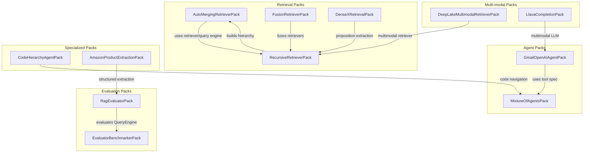

**Section sources**
- [README.md](file://llama-index-packs/llama-index-packs-auto-merging-retriever/README.md#L36-L65)
- [README.md](file://llama-index-packs/llama-index-packs-fusion-retriever/README.md#L36-L64)
- [README.md](file://llama-index-packs/llama-index-packs-recursive-retriever/README.md#L39-L67)
- [README.md](file://llama-index-packs/llama-index-packs-dense-x-retrieval/README.md#L27-L55)
- [README.md](file://llama-index-packs/llama-index-packs-gmail-openai-agent/README.md#L15-L50)
- [README.md](file://llama-index-packs/llama-index-packs-mixture-of-agents/README.md#L23-L80)
- [README.md](file://llama-index-packs/llama-index-packs-rag-evaluator/README.md#L18-L53)
- [README.md](file://llama-index-packs/llama-index-packs-evaluator-benchmarker/README.md#L22-L64)
- [README.md](file://llama-index-packs/llama-index-packs-deeplake-multimodal-retrieval/README.md#L15-L61)
- [README.md](file://llama-index-packs/llama-index-packs-llava-completion/README.md#L15-L51)
- [README.md](file://llama-index-packs/llama-index-packs-code-hierarchy/README.md#L15-L47)
- [README.md](file://llama-index-packs/llama-index-packs-amazon-product-extraction/README.md#L19-L49)

## Detailed Component Analysis

### Retrieval Packs

#### Auto-Merging Retriever Pack
- Problem solved: Efficient retrieval across hierarchical document structures by merging overlapping results from parent and child nodes.
- Key features:
  - Builds a hierarchical node graph from documents.
  - Provides a retriever and query engine.
  - Supports individual module access for node parsing, retriever, and query engine.
- Configuration options:
  - Accepts documents and exposes retriever/query engine composition.
- Typical use cases:
  - Long-form documents with nested sections (e.g., annual reports).
- Practical example:
  - See end-to-end usage in the example script path.
- Dependencies and integrations:
  - Uses LlamaIndex readers and indices internally.
- Performance characteristics:
  - Depends on hierarchical graph traversal and similarity scoring.

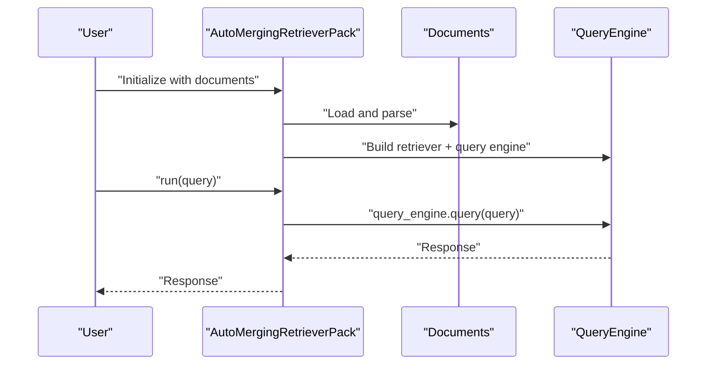

**Section sources**
- [README.md](file://llama-index-packs/llama-index-packs-auto-merging-retriever/README.md#L1-L66)
- [example.py](file://llama-index-packs/llama-index-packs-auto-merging-retriever/examples/example.py#L1-L18)

#### Fusion Retriever Pack
- Problem solved: Improved recall and robustness by combining multiple retrievers (vector + BM25) or generating rewritten queries.
- Key features:
  - Hybrid fusion retriever (vector + BM25).
  - Query rewriting retriever (multiple queries fused).
  - Access to individual retrievers and fused retriever.
- Configuration options:
  - Parameters for vector and BM25 similarity top-k.
- Typical use cases:
  - Mixed-content retrieval requiring lexical and semantic signals.
- Practical example:
  - Initialization and run usage demonstrated in the README.

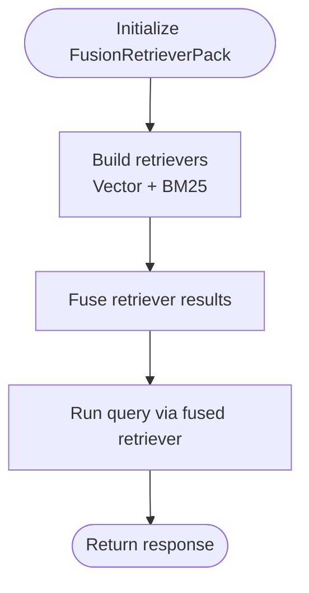

**Section sources**
- [README.md](file://llama-index-packs/llama-index-packs-fusion-retriever/README.md#L1-L128)

#### Recursive Retriever Pack
- Problem solved: Hierarchical retrieval across nested document structures, including embedded tables and small-to-big traversal.
- Key features:
  - Embedded tables retriever with unstructured parsing.
  - Small-to-big recursive retrieval.
  - Individual module access for node parser and recursive retriever.
- Configuration options:
  - Chunk size and similarity top-k parameters.
- Typical use cases:
  - Financial filings, technical documents with tables and nested sections.
- Practical example:
  - Initialization and run usage demonstrated in the README.

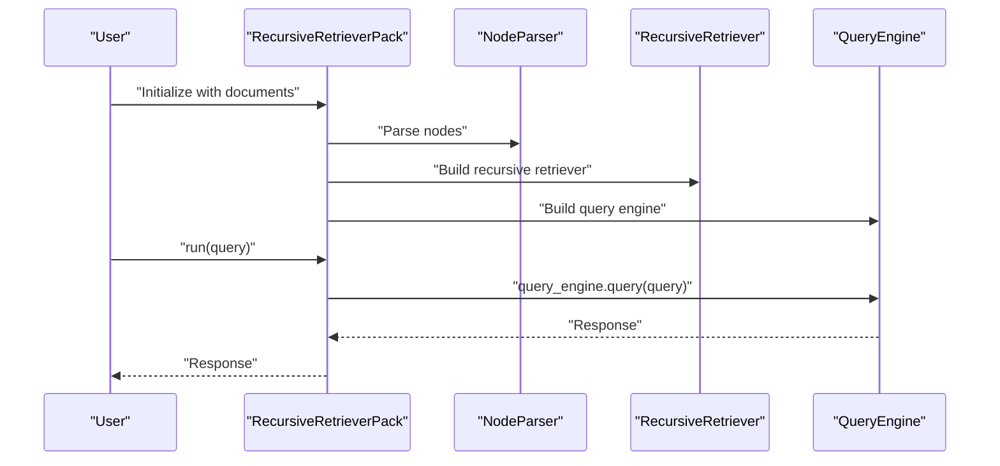

**Section sources**
- [README.md](file://llama-index-packs/llama-index-packs-recursive-retriever/README.md#L1-L132)

#### Dense-X Retrieval Pack
- Problem solved: Retrieval granularity optimization using propositions extracted per node.
- Key features:
  - LLM-driven proposition extraction.
  - Embedding propositions to retrieve parent chunks.
  - Streaming support.
- Configuration options:
  - Streaming toggle and document ingestion.
- Typical use cases:
  - Factoid-focused retrieval where atomic statements improve precision.
- Practical example:
  - Initialization and run usage demonstrated in the README.

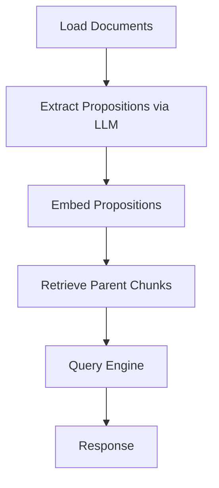

**Section sources**
- [README.md](file://llama-index-packs/llama-index-packs-dense-x-retrieval/README.md#L1-L68)

### Agent Packs

#### Gmail OpenAI Agent Pack
- Problem solved: Automate Gmail interactions using an OpenAI agent with a dedicated Gmail tool.
- Key features:
  - Pre-loaded agent with Gmail tool.
  - Individual access to agent and tool spec for reuse.
- Configuration options:
  - Initialize without parameters; agent chat interface exposed.
- Typical use cases:
  - Email automation, inbox summarization, scheduling reminders.
- Practical example:
  - Initialization and run usage demonstrated in the README.

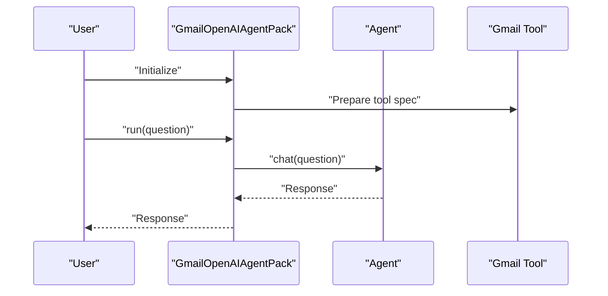

**Section sources**
- [README.md](file://llama-index-packs/llama-index-packs-gmail-openai-agent/README.md#L1-L51)

#### Mixture-of-Agents Pack
- Problem solved: Collaborative reasoning across multiple LLMs by layering proposers and aggregators.
- Key features:
  - Layered architecture with proposers (base LLMs) and aggregators (reference LLMs).
  - Configurable number of layers, temperature, and timeouts.
- Configuration options:
  - Aggregator LLM, reference LLMs, layers, temperature, timeout.
- Typical use cases:
  - Multi-perspective synthesis, improved accuracy via ensemble reasoning.
- Practical example:
  - Initialization and run usage demonstrated in the README.

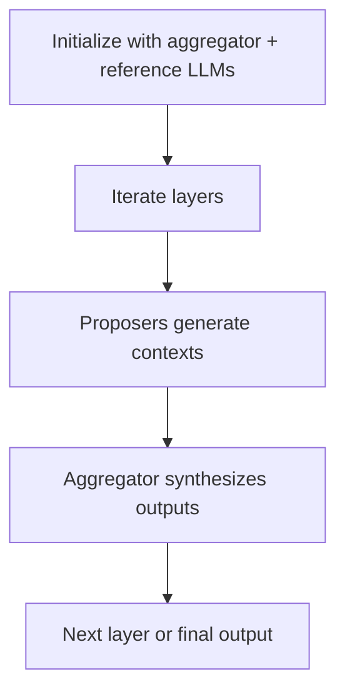

**Section sources**
- [README.md](file://llama-index-packs/llama-index-packs-mixture-of-agents/README.md#L1-L81)

### Evaluation Packs

#### RAG Evaluator Pack
- Problem solved: Benchmark a QueryEngine against a labeled RAG dataset to compute correctness, relevancy, faithfulness, and context similarity.
- Key features:
  - Accepts a query engine and a labeled dataset.
  - Produces benchmark DataFrame and saves CSV and raw evaluation JSON.
- Configuration options:
  - Query engine, dataset, optional judge LLM.
- Typical use cases:
  - RAG pipeline performance monitoring and regression detection.
- Practical example:
  - Dataset download, index creation, evaluator pack construction, and run usage demonstrated in the README.

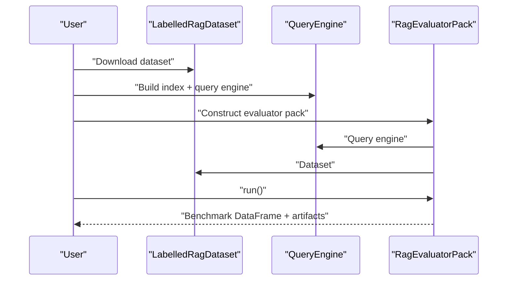

**Section sources**
- [README.md](file://llama-index-packs/llama-index-packs-rag-evaluator/README.md#L1-L74)

#### Evaluator Benchmarker Pack
- Problem solved: Compute benchmark metrics for evaluators on labeled datasets (single or pairwise grading).
- Key features:
  - Supports LabelledEvaluatorDataset and LabelledPairwiseEvaluatorDataset.
  - Outputs agreement rates and summary statistics.
- Configuration options:
  - Evaluator and dataset; progress display option.
- Typical use cases:
  - Evaluate evaluator quality and inter-annotator reliability.
- Practical example:
  - Dataset download, evaluator definition, pack construction, and run usage demonstrated in the README.

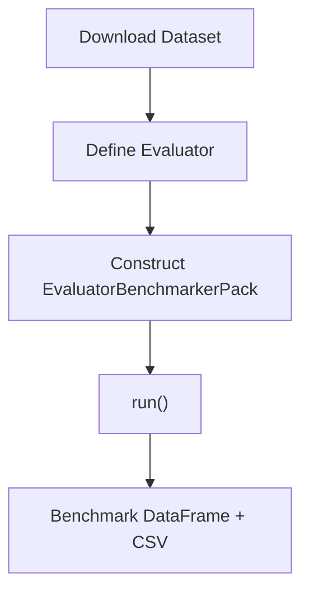

**Section sources**
- [README.md](file://llama-index-packs/llama-index-packs-evaluator-benchmarker/README.md#L1-L83)

### Multi-modal Packs

#### DeepLake Multimodal Retrieval Pack
- Problem solved: Store and retrieve multimodal content (text/images) using DeepLake with CLIP embeddings and GPT-4V at query time.
- Key features:
  - Inserts multimodal nodes into DeepLake.
  - Instantiates a retriever and multi-modal query engine.
- Configuration options:
  - Nodes, dataset path, overwrite flag.
- Typical use cases:
  - Image+text search, visual QA, document retrieval with figures.
- Practical example:
  - Initialization and run usage demonstrated in the README.

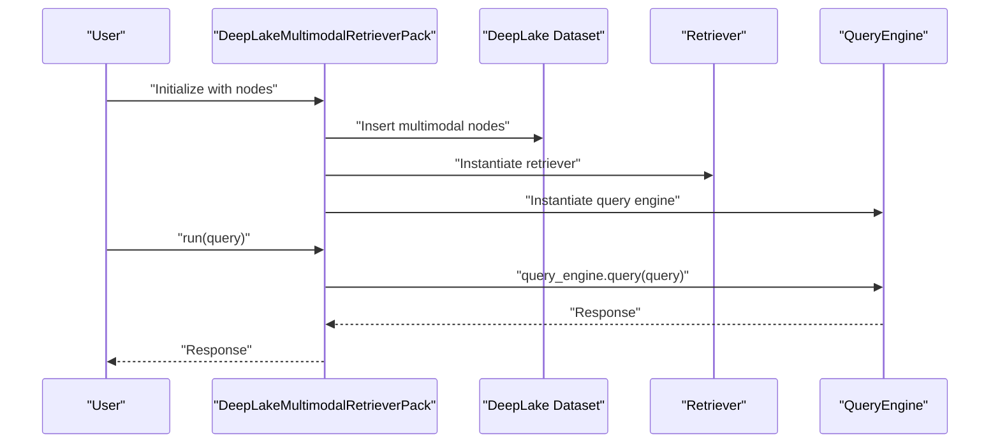

**Section sources**
- [README.md](file://llama-index-packs/llama-index-packs-deeplake-multimodal-retrieval/README.md#L1-L62)

#### LLaVA Completion Pack
- Problem solved: Execute multimodal queries using the LLaVA model’s completion endpoint.
- Key features:
  - Wraps LLaVA multimodal LLM.
  - Exposes run method wrapping llm.complete().
- Configuration options:
  - Image URL or media input depending on pack implementation.
- Typical use cases:
  - Visual grounding, recipe generation from fridge photos.
- Practical example:
  - Initialization and run usage demonstrated in the README.

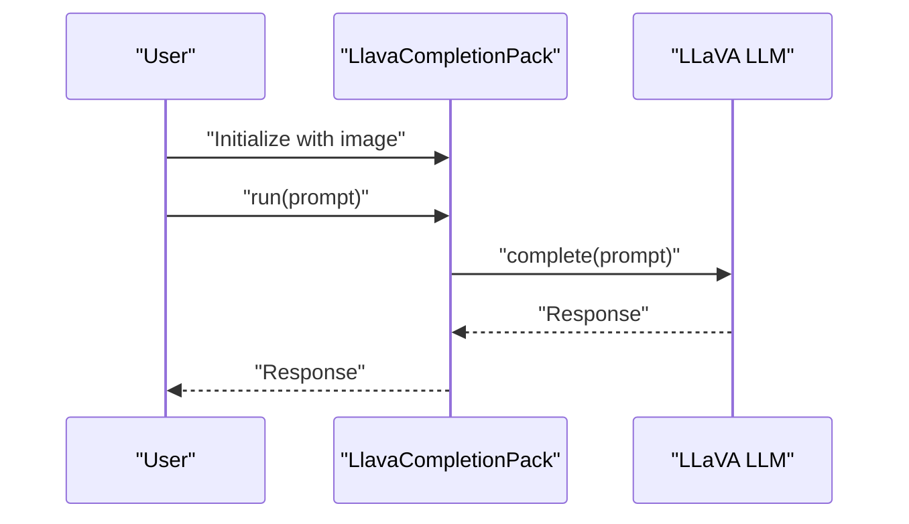

**Section sources**
- [README.md](file://llama-index-packs/llama-index-packs-llava-completion/README.md#L1-L52)

### Specialized Packs

#### Code Hierarchy Pack
- Problem solved: Split large codebases into navigable hierarchical chunks and expose a query engine for code navigation.
- Key features:
  - Scope-aware splitting (functions, classes, methods).
  - CodeHierarchyKeywordQueryEngine for repo maps and tool integration.
  - Extensible to new programming languages.
- Configuration options:
  - Language, code splitter parameters (chunk lines, max chars).
- Typical use cases:
  - Onboarding, codebase exploration, developer assistance.
- Practical example:
  - Node parsing, pack construction, and run usage demonstrated in the README.

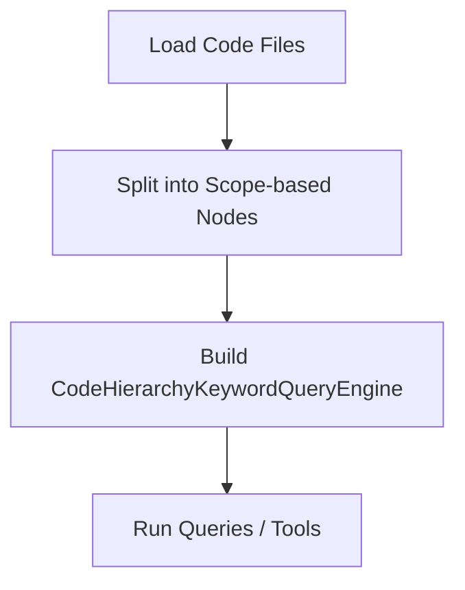

**Section sources**
- [README.md](file://llama-index-packs/llama-index-packs-code-hierarchy/README.md#L1-L140)

#### Amazon Product Extraction Pack
- Problem solved: Extract structured product information from e-commerce screenshots using GPT-4V.
- Key features:
  - Screenshot + vision-language model pipeline.
  - Returns structured JSON via a program.
- Configuration options:
  - Input URL/page representation depending on pack implementation.
- Typical use cases:
  - Price tracking, inventory extraction, product research.
- Practical example:
  - Initialization and run usage demonstrated in the README.

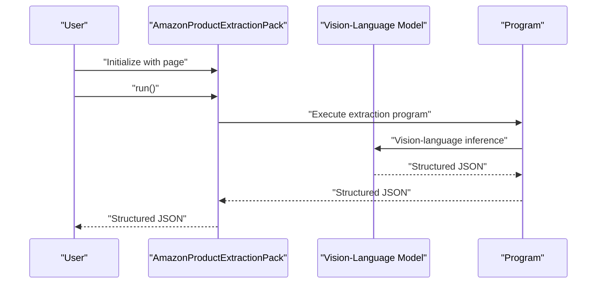

**Section sources**
- [README.md](file://llama-index-packs/llama-index-packs-amazon-product-extraction/README.md#L1-L60)

## Dependency Analysis
- Installation and usage:
  - Install via pip using the llama-index-packs-<name> package name.
  - Download as a template using llamaindex-cli or programmatically via download_llama_pack.
- Internal dependencies:
  - Packs rely on LlamaIndex components (readers, indices, retrievers, query engines, agents, evaluators, tools, multimodal LLMs).
  - Some packs depend on external integrations (e.g., DeepLake, GPT-4V, Gmail APIs).
- Coupling and cohesion:
  - Packs encapsulate end-to-end workflows with clear constructors and run methods.
  - Modules are often exposed for granular control and reuse.

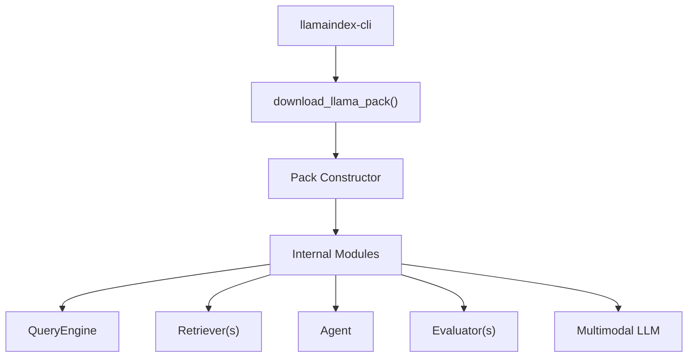

**Section sources**
- [README.md](file://llama-index-packs/README.md#L3-L32)

## Performance Considerations
- Retrieval Packs:
  - Auto-merging and recursive retrievers scale with graph depth and node count; tune chunk sizes and similarity top-k.
  - Fusion retrievers balance lexical and semantic recall; adjust retriever weights and top-k values.
  - Dense-X retrieval incurs LLM costs for proposition extraction; consider streaming and caching strategies.
- Agent Packs:
  - Mixture-of-Agents increases latency due to multiple LLM calls; configure layers and timeouts judiciously.
- Evaluation Packs:
  - Benchmarking can be computationally intensive; batch and cache predictions where possible.
- Multi-modal Packs:
  - DeepLake retrievers depend on embedding and indexing costs; optimize dataset path and overwrite behavior.
  - LLaVA completion is costly; leverage caching and limit concurrent requests.
- Specialized Packs:
  - Code hierarchy parsing cost scales with code size; tune splitter parameters to fit context windows.
  - Amazon product extraction depends on vision-language model throughput; manage concurrency.

[No sources needed since this section provides general guidance]

## Troubleshooting Guide
- Installation and setup
  - Ensure required environment variables are configured (e.g., API keys for LLMs and external services).
  - Verify pip installation of the specific pack package name.
- Common issues
  - Missing dependencies: Install requirements declared in each pack’s repository.
  - Authentication failures: Confirm credentials for integrations (Gmail, GPT-4V, DeepLake).
  - Resource limits: Reduce batch sizes, enable streaming, and increase timeouts for heavy operations.
- Validation steps
  - Run minimal example scripts included in each pack to validate environment.
  - Inspect saved artifacts (CSV, JSON) from evaluation packs to confirm successful runs.
- Migration paths
  - From fusion retriever to recursive retriever when hierarchical structure matters more than lexical signals.
  - From auto-merging to dense-x when atomic fact retrieval improves precision but at higher LLM cost.
  - From single LLM agent to mixture-of-agents when multi-perspective synthesis is beneficial.

**Section sources**
- [README.md](file://llama-index-packs/README.md#L3-L32)
- [README.md](file://llama-index-packs/llama-index-packs-rag-evaluator/README.md#L66-L74)
- [README.md](file://llama-index-packs/llama-index-packs-evaluator-benchmarker/README.md#L77-L83)

## Conclusion
The available pre-built Packs provide ready-to-use templates spanning retrieval, agents, evaluation, multi-modal, and specialized tasks. Each Pack offers clear installation, initialization, and deployment pathways, along with internal module access for customization. Select packs based on your data modalities, retrieval needs, evaluation goals, and integration constraints. Use the provided examples and troubleshooting tips to accelerate adoption and maintain performance.