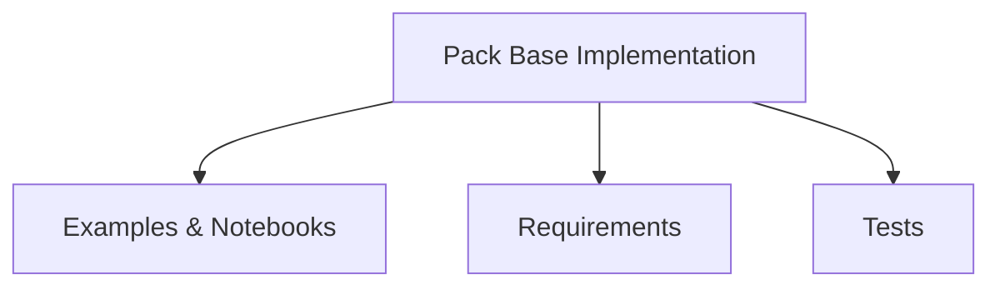

# Deployment and Infrastructure Packs

<cite>
**Referenced Files in This Document**
- [README.md](file://llama-index-packs/README.md)
- [panel_chatbot/README.md](file://llama-index-packs/llama-index-packs-panel-chatbot/README.md)
- [panel_chatbot/base.py](file://llama-index-packs/llama-index-packs-panel-chatbot/llama_index/packs/panel_chatbot/base.py)
- [panel_chatbot/app.py](file://llama-index-packs/llama-index-packs-panel-chatbot/llama_index/packs/panel_chatbot/app.py)
- [panel_chatbot/requirements.txt](file://llama-index-packs/llama-index-packs-panel-chatbot/requirements.txt)
- [streamlit_chatbot/README.md](file://llama-index-packs/llama-index-packs-streamlit-chatbot/README.md)
- [streamlit_chatbot/base.py](file://llama-index-packs/llama-index-packs-streamlit-chatbot/llama_index/packs/streamlit_chatbot/base.py)
- [streamlit_chatbot/requirements.txt](file://llama-index-packs/llama-index-packs-streamlit-chatbot/requirements.txt)
- [multi_tenancy_rag/README.md](file://llama-index-packs/llama-index-packs-multi-tenancy-rag/README.md)
- [multi_tenancy_rag/base.py](file://llama-index-packs/llama-index-packs-multi-tenancy-rag/llama_index/packs/multi_tenancy_rag/base.py)
- [timescale_vector_autoretrieval/README.md](file://llama-index-packs/llama-index-packs-timescale-vector-autoretrieval/README.md)
- [timescale_vector_autoretrieval/base.py](file://llama-index-packs/llama-index-packs-timescale-vector-autoretrieval/llama_index/packs/timescale_vector_autoretrieval/base.py)
- [timescalevector/README.md](file://llama-index-integrations/vector_stores/llama-index-vector-stores-timescalevector/README.md)
- [timescalevector/base.py](file://llama-index-integrations/vector_stores/llama-index-vector-stores-timescalevector/llama_index/vector_stores/timescalevector/base.py)
- [searchain/README.md](file://llama-index-packs/llama-index-packs-searchain/README.md)
- [searchain/base.py](file://llama-index-packs/llama-index-packs-searchain/llama_index/packs/searchain/base.py)
- [vectara_rag/README.md](file://llama-index-integrations/indices/llama-index-indices-managed-vectara/README.md)
- [vectara_rag/base.py](file://llama-index-integrations/indices/llama-index-indices-managed-vectara/llama_index/indices/managed/vectara/base.py)
- [snowflake_query_engine/README.md](file://llama-index-packs/llama-index-packs-snowflake-query-engine/README.md)
- [snowflake_query_engine/base.py](file://llama-index-packs/llama-index-packs-snowflake-query-engine/llama_index/packs/snowflake_query_engine/base.py)
- [zephyr_query_engine/README.md](file://llama-index-packs/llama-index-packs-zephyr-query-engine/README.md)
- [zephyr_query_engine/base.py](file://llama-index-packs/llama-index-packs-zephyr-query-engine/llama_index/packs/zephyr_query_engine/base.py)
- [voyage_query_engine/README.md](file://llama-index-packs/llama-index-packs-voyage-query-engine/README.md)
- [voyage_query_engine/base.py](file://llama-index-packs/llama-index-packs-voyage-query-engine/llama_index/packs/voyage_query_engine/base.py)
- [ollama_query_engine/README.md](file://llama-index-packs/llama-index-packs-ollama-query-engine/README.md)
- [ollama_query_engine/base.py](file://llama-index-packs/llama-index-packs-ollama-query-engine/llama_index/packs/ollama_query_engine/base.py)
- [nebulagraph_query_engine/README.md](file://llama-index-packs/llama-index-packs-nebulagraph-query-engine/README.md)
- [nebulagraph_query_engine/base.py](file://llama-index-packs/llama-index-packs-nebulagraph-query-engine/llama_index/packs/nebulagraph_query_engine/base.py)
- [neo4j_query_engine/README.md](file://llama-index-packs/llama-index-packs-neo4j-query-engine/README.md)
- [neo4j_query_engine/base.py](file://llama-index-packs/llama-index-packs-neo4j-query-engine/llama_index/packs/neo4j_query_engine/base.py)
- [arize_phoenix_query_engine/README.md](file://llama-index-packs/llama-index-packs-arize-phoenix-query-engine/README.md)
- [arize_phoenix_query_engine/base.py](file://llama-index-packs/llama-index-packs-arize-phoenix-query-engine/llama_index/packs/arize_phoenix_query_engine/base.py)
- [retry_engine_weaviate/README.md](file://llama-index-packs/llama-index-packs-retry-engine-weaviate/README.md)
- [retry_engine_weaviate/base.py](file://llama-index-packs/llama-index-packs-retry-engine-weaviate/llama_index/packs/retry_engine_weaviate/base.py)
- [sub_question_weaviate/README.md](file://llama-index-packs/llama-index-packs-sub-question-weaviate/README.md)
- [sub_question_weaviate/base.py](file://llama-index-packs/llama-index-packs-sub-question-weaviate/llama_index/packs/sub_question_weaviate/base.py)
- [cohere_citation_chat/README.md](file://llama-index-packs/llama-index-packs-cohere-citation-chat/README.md)
- [cohere_citation_chat/base.py](file://llama-index-packs/llama-index-packs-cohere-citation-chat/llama_index/packs/cohere_citation_chat/base.py)
</cite>

## Table of Contents
1. [Introduction](#introduction)
2. [Project Structure](#project-structure)
3. [Core Components](#core-components)
4. [Architecture Overview](#architecture-overview)
5. [Detailed Component Analysis](#detailed-component-analysis)
6. [Dependency Analysis](#dependency-analysis)
7. [Performance Considerations](#performance-considerations)
8. [Troubleshooting Guide](#troubleshooting-guide)
9. [Conclusion](#conclusion)
10. [Appendices](#appendices)

## Introduction
This document provides production-ready deployment guidance for a curated set of LlamaIndex Deployment and Infrastructure Packs. It covers:
- Web application deployment packs: panel-chatbot and streamlit-chatbot
- Scalable architectures: multi-tenancy-rag
- Time-series data processing: timescale-vector-autoretrieval
- Enterprise search integration: searchain
- Managed RAG services: vectara-rag
- Cloud data warehouse integration: snowflake-query-engine
- Optimized inference: zephyr-query-engine
- Specialized embeddings: voyage-query-engine
- Local deployment: ollama-query-engine
- Graph database integration: nebulagraph-query-engine and neo4j-query-engine
- Observability: arize-phoenix-query-engine
- Fault tolerance: retry-engine-weaviate
- Advanced querying: sub-question-weaviate
- Citation-aware chat: cohere-citation-chat

For each pack, we outline infrastructure requirements, scaling patterns, security configurations, monitoring setup, deployment examples, CI/CD integration, operational management, performance optimization, cost management, maintenance procedures, troubleshooting, rollback strategies, and disaster recovery planning.

## Project Structure
The LlamaIndex repository organizes deployment packs under llama-index-packs with per-pack directories containing README, base implementation, examples, requirements, and tests. Many packs integrate with external systems (e.g., Timescale, Snowflake, Neo4j, Weaviate) via dedicated integration modules under llama-index-integrations.

```mermaid
graph TB
subgraph "LlamaIndex Packs"
PC["panel-chatbot"]
SC["streamlit-chatbot"]
MTR["multi-tenancy-rag"]
TVA["timescale-vector-autoretrieval"]
SEA["searchain"]
VR["vectara-rag"]
SFE["snowflake-query-engine"]
ZQ["zephyr-query-engine"]
VQE["voyage-query-engine"]
OQE["ollama-query-engine"]
NGQE["nebulagraph-query-engine"]
N4JQE["neo4j-query-engine"]
APQE["arize-phoenix-query-engine"]
REW["retry-engine-weaviate"]
SQW["sub-question-weaviate"]
CCC["cohere-citation-chat"]
end
subgraph "Integrations"
TSV["timescalevector"]
VIND["vectara managed index"]
end
PC --> |"UI runtime"| AppRuntime["Application Runtime"]
SC --> |"UI runtime"| AppRuntime
MTR --> |"RAG orchestration"| AppRuntime
TVA --> TSV
SEA --> |"enterprise search"| AppRuntime
VR --> VIND
SFE --> |"warehouse queries"| AppRuntime
ZQ --> |"optimized inference"| AppRuntime
VQE --> |"embeddings"| AppRuntime
OQE --> |"local LLMs"| AppRuntime
NGQE --> |"graph queries"| AppRuntime
N4JQE --> |"graph queries"| AppRuntime
APQE --> |"observability"| AppRuntime
REW --> |"fault tolerance"| AppRuntime
SQW --> |"advanced querying"| AppRuntime
CCC --> |"citation-aware chat"| AppRuntime
```

**Diagram sources**
- [panel_chatbot/README.md](file://llama-index-packs/llama-index-packs-panel-chatbot/README.md)
- [streamlit_chatbot/README.md](file://llama-index-packs/llama-index-packs-streamlit-chatbot/README.md)
- [multi_tenancy_rag/README.md](file://llama-index-packs/llama-index-packs-multi-tenancy-rag/README.md)
- [timescale_vector_autoretrieval/README.md](file://llama-index-packs/llama-index-packs-timescale-vector-autoretrieval/README.md)
- [timescalevector/README.md](file://llama-index-integrations/vector_stores/llama-index-vector-stores-timescalevector/README.md)
- [searchain/README.md](file://llama-index-packs/llama-index-packs-searchain/README.md)
- [vectara_rag/README.md](file://llama-index-integrations/indices/llama-index-indices-managed-vectara/README.md)
- [snowflake_query_engine/README.md](file://llama-index-packs/llama-index-packs-snowflake-query-engine/README.md)
- [zephyr_query_engine/README.md](file://llama-index-packs/llama-index-packs-zephyr-query-engine/README.md)
- [voyage_query_engine/README.md](file://llama-index-packs/llama-index-packs-voyage-query-engine/README.md)
- [ollama_query_engine/README.md](file://llama-index-packs/llama-index-packs-ollama-query-engine/README.md)
- [nebulagraph_query_engine/README.md](file://llama-index-packs/llama-index-packs-nebulagraph-query-engine/README.md)
- [neo4j_query_engine/README.md](file://llama-index-packs/llama-index-packs-neo4j-query-engine/README.md)
- [arize_phoenix_query_engine/README.md](file://llama-index-packs/llama-index-packs-arize-phoenix-query-engine/README.md)
- [retry_engine_weaviate/README.md](file://llama-index-packs/llama-index-packs-retry-engine-weaviate/README.md)
- [sub_question_weaviate/README.md](file://llama-index-packs/llama-index-packs-sub-question-weaviate/README.md)
- [cohere_citation_chat/README.md](file://llama-index-packs/llama-index-packs-cohere-citation-chat/README.md)

**Section sources**
- [README.md](file://llama-index-packs/README.md#L1-L33)

## Core Components
This section summarizes each deployment pack’s role, primary dependencies, and typical deployment targets.

- panel-chatbot: A Panel-based chat UI pack for deploying conversational RAG applications with a Python backend and optional frontend assets.
- streamlit-chatbot: A Streamlit-based chat UI pack for rapid prototyping and lightweight deployments.
- multi-tenancy-rag: A scalable RAG pack supporting tenant isolation, shared resources, and multi-tenant retrieval and synthesis.
- timescale-vector-autoretrieval: A pack integrating vector autoretrieval with Timescale vector stores for time-series data.
- searchain: An enterprise search pack for indexing and querying structured/unstructured content.
- vectara-rag: A managed RAG pack leveraging Vectara’s hosted index and query APIs.
- snowflake-query-engine: A pack enabling SQL-based query execution against Snowflake with vector similarity joins.
- zephyr-query-engine: A pack optimized for inference using Zephyr models.
- voyage-query-engine: A pack focused on Voyage AI embeddings for retrieval.
- ollama-query-engine: A pack for local inference using Ollama-hosted models.
- nebulagraph-query-engine: A pack for graph queries against NebulaGraph.
- neo4j-query-engine: A pack for graph queries against Neo4j.
- arize-phoenix-query-engine: A pack exposing query engine metrics to Arize Phoenix for observability.
- retry-engine-weaviate: A pack adding retry logic for Weaviate-backed query engines.
- sub-question-weaviate: A pack implementing sub-question decomposition for Weaviate.
- cohere-citation-chat: A pack enabling citation-aware chat powered by Cohere.

**Section sources**
- [panel_chatbot/README.md](file://llama-index-packs/llama-index-packs-panel-chatbot/README.md)
- [streamlit_chatbot/README.md](file://llama-index-packs/llama-index-packs-streamlit-chatbot/README.md)
- [multi_tenancy_rag/README.md](file://llama-index-packs/llama-index-packs-multi-tenancy-rag/README.md)
- [timescale_vector_autoretrieval/README.md](file://llama-index-packs/llama-index-packs-timescale-vector-autoretrieval/README.md)
- [searchain/README.md](file://llama-index-packs/llama-index-packs-searchain/README.md)
- [vectara_rag/README.md](file://llama-index-integrations/indices/llama-index-indices-managed-vectara/README.md)
- [snowflake_query_engine/README.md](file://llama-index-packs/llama-index-packs-snowflake-query-engine/README.md)
- [zephyr_query_engine/README.md](file://llama-index-packs/llama-index-packs-zephyr-query-engine/README.md)
- [voyage_query_engine/README.md](file://llama-index-packs/llama-index-packs-voyage-query-engine/README.md)
- [ollama_query_engine/README.md](file://llama-index-packs/llama-index-packs-ollama-query-engine/README.md)
- [nebulagraph_query_engine/README.md](file://llama-index-packs/llama-index-packs-nebulagraph-query-engine/README.md)
- [neo4j_query_engine/README.md](file://llama-index-packs/llama-index-packs-neo4j-query-engine/README.md)
- [arize_phoenix_query_engine/README.md](file://llama-index-packs/llama-index-packs-arize-phoenix-query-engine/README.md)
- [retry_engine_weaviate/README.md](file://llama-index-packs/llama-index-packs-retry-engine-weaviate/README.md)
- [sub_question_weaviate/README.md](file://llama-index-packs/llama-index-packs-sub-question-weaviate/README.md)
- [cohere_citation_chat/README.md](file://llama-index-packs/llama-index-packs-cohere-citation-chat/README.md)

## Architecture Overview
Each pack follows a consistent pattern:
- Base implementation defines the pack’s core logic and configuration.
- Examples demonstrate usage and deployment scenarios.
- Requirements enumerate runtime dependencies.
- Tests validate behavior across environments.

**Diagram sources**
- [panel_chatbot/base.py](file://llama-index-packs/llama-index-packs-panel-chatbot/llama_index/packs/panel_chatbot/base.py)
- [streamlit_chatbot/base.py](file://llama-index-packs/llama-index-packs-streamlit-chatbot/llama_index/packs/streamlit_chatbot/base.py)
- [multi_tenancy_rag/base.py](file://llama-index-packs/llama-index-packs-multi-tenancy-rag/llama_index/packs/multi_tenancy_rag/base.py)
- [timescale_vector_autoretrieval/base.py](file://llama-index-packs/llama-index-packs-timescale-vector-autoretrieval/llama_index/packs/timescale_vector_autoretrieval/base.py)
- [searchain/base.py](file://llama-index-packs/llama-index-packs-searchain/llama_index/packs/searchain/base.py)
- [vectara_rag/base.py](file://llama-index-integrations/indices/llama-index-indices-managed-vectara/llama_index/indices/managed/vectara/base.py)
- [snowflake_query_engine/base.py](file://llama-index-packs/llama-index-packs-snowflake-query-engine/llama_index/packs/snowflake_query_engine/base.py)
- [zephyr_query_engine/base.py](file://llama-index-packs/llama-index-packs-zephyr-query-engine/llama_index/packs/zephyr_query_engine/base.py)
- [voyage_query_engine/base.py](file://llama-index-packs/llama-index-packs-voyage-query-engine/llama_index/packs/voyage_query_engine/base.py)
- [ollama_query_engine/base.py](file://llama-index-packs/llama-index-packs-ollama-query-engine/llama_index/packs/ollama_query_engine/base.py)
- [nebulagraph_query_engine/base.py](file://llama-index-packs/llama-index-packs-nebulagraph-query-engine/llama_index/packs/nebulagraph_query_engine/base.py)
- [neo4j_query_engine/base.py](file://llama-index-packs/llama-index-packs-neo4j-query-engine/llama_index/packs/neo4j_query_engine/base.py)
- [arize_phoenix_query_engine/base.py](file://llama-index-packs/llama-index-packs-arize-phoenix-query-engine/llama_index/packs/arize_phoenix_query_engine/base.py)
- [retry_engine_weaviate/base.py](file://llama-index-packs/llama-index-packs-retry-engine-weaviate/llama_index/packs/retry_engine_weaviate/base.py)
- [sub_question_weaviate/base.py](file://llama-index-packs/llama-index-packs-sub-question-weaviate/llama_index/packs/sub_question_weaviate/base.py)
- [cohere_citation_chat/base.py](file://llama-index-packs/llama-index-packs-cohere-citation-chat/llama_index/packs/cohere_citation_chat/base.py)

## Detailed Component Analysis

### panel-chatbot
- Purpose: Deploy a Panel-based chat UI with a Python backend for RAG applications.
- Key files:
  - [base.py](file://llama-index-packs/llama-index-packs-panel-chatbot/llama_index/packs/panel_chatbot/base.py): Core pack implementation.
  - [app.py](file://llama-index-packs/llama-index-packs-panel-chatbot/llama_index/packs/panel_chatbot/app.py): Application entry point.
  - [requirements.txt](file://llama-index-packs/llama-index-packs-panel-chatbot/requirements.txt): Runtime dependencies.
- Deployment patterns:
  - WSGI server (e.g., Gunicorn/uWSGI) behind a reverse proxy (Nginx).
  - Containerized with Docker; expose port 8080.
  - Horizontal scaling via multiple replicas behind a load balancer.
- Security:
  - Enforce HTTPS/TLS termination at the ingress.
  - Restrict CORS origins to trusted domains.
  - Use secrets management for credentials.
- Monitoring:
  - Metrics via Prometheus/Grafana.
  - Structured logs with JSON formatting.
- CI/CD:
  - Build container images on merge to main.
  - Automated testing in pre-deploy stages.
- Operational management:
  - Health checks at /health.
  - Graceful shutdown handling.
- Performance optimization:
  - Enable HTTP keep-alive.
  - Tune worker processes and threads.
- Cost management:
  - Right-size instances; autoscaling based on CPU/memory.
- Maintenance:
  - Regular dependency updates and vulnerability scans.
- Troubleshooting:
  - Inspect logs for startup errors and runtime exceptions.
  - Verify backend connectivity to vector store and LLM provider.
- Rollback and DR:
  - Canary releases; automated rollback on health probe failures.
  - Backup of persistent configuration/state.

**Section sources**
- [panel_chatbot/README.md](file://llama-index-packs/llama-index-packs-panel-chatbot/README.md)
- [panel_chatbot/base.py](file://llama-index-packs/llama-index-packs-panel-chatbot/llama_index/packs/panel_chatbot/base.py)
- [panel_chatbot/app.py](file://llama-index-packs/llama-index-packs-panel-chatbot/llama_index/packs/panel_chatbot/app.py)
- [panel_chatbot/requirements.txt](file://llama-index-packs/llama-index-packs-panel-chatbot/requirements.txt)

### streamlit-chatbot
- Purpose: Rapid deployment of a Streamlit chat UI for RAG.
- Key files:
  - [base.py](file://llama-index-packs/llama-index-packs-streamlit-chatbot/llama_index/packs/streamlit_chatbot/base.py): Core pack implementation.
  - [requirements.txt](file://llama-index-packs/llama-index-packs-streamlit-chatbot/requirements.txt): Runtime dependencies.
- Deployment patterns:
  - Streamlit Community Cloud or self-hosted with Uvicorn.
  - Stateless scaling; scale workers horizontally.
- Security:
  - Restrict access via VPN or private networks.
  - Use environment variables for secrets.
- Monitoring:
  - Application logs and basic metrics.
- CI/CD:
  - Automated builds for pull requests and main branch.
- Operational management:
  - Health endpoint and graceful restarts.
- Performance optimization:
  - Optimize session state and caching.
- Cost management:
  - Prefer free tier for development; monitor resource usage.
- Maintenance:
  - Keep dependencies updated; test upgrades in staging.
- Troubleshooting:
  - Review Streamlit logs and backend errors.
- Rollback and DR:
  - Version pinning and immutable artifacts.

**Section sources**
- [streamlit_chatbot/README.md](file://llama-index-packs/llama-index-packs-streamlit-chatbot/README.md)
- [streamlit_chatbot/base.py](file://llama-index-packs/llama-index-packs-streamlit-chatbot/llama_index/packs/streamlit_chatbot/base.py)
- [streamlit_chatbot/requirements.txt](file://llama-index-packs/llama-index-packs-streamlit-chatbot/requirements.txt)

### multi-tenancy-rag
- Purpose: Multi-tenant RAG with isolated retrieval and synthesis per tenant.
- Key files:
  - [base.py](file://llama-index-packs/llama-index-packs-multi-tenancy-rag/llama_index/packs/multi_tenancy_rag/base.py): Core pack implementation.
  - [README.md](file://llama-index-packs/llama-index-packs-multi-tenancy-rag/README.md): Usage and examples.
- Deployment patterns:
  - Microservice architecture with tenant routing.
  - Shared vector store with tenant-aware namespaces.
- Scaling:
  - Vertical scaling per tenant; horizontal scaling via replicas.
- Security:
  - Tenant isolation at API gateway and database level.
  - RBAC and audit logging.
- Monitoring:
  - Per-tenant metrics and latency distributions.
- CI/CD:
  - Feature toggles for tenant rollout.
- Operational management:
  - Tenant onboarding/offboarding automation.
- Performance optimization:
  - Caching and connection pooling.
- Cost management:
  - Shared compute with per-tenant quotas.
- Maintenance:
  - Schema migrations and tenant data lifecycle policies.
- Troubleshooting:
  - Tenant-specific dashboards and correlation IDs.
- Rollback and DR:
  - Tenant-level failover and backup strategies.

**Section sources**
- [multi_tenancy_rag/README.md](file://llama-index-packs/llama-index-packs-multi-tenancy-rag/README.md)
- [multi_tenancy_rag/base.py](file://llama-index-packs/llama-index-packs-multi-tenancy-rag/llama_index/packs/multi_tenancy_rag/base.py)

### timescale-vector-autoretrieval
- Purpose: Vector autoretrieval integrated with Timescale vector stores for time-series data.
- Key files:
  - [base.py](file://llama-index-packs/llama-index-packs-timescale-vector-autoretrieval/llama_index/packs/timescale_vector_autoretrieval/base.py): Core pack implementation.
  - [README.md](file://llama-index-packs/llama-index-packs-timescale-vector-autoretrieval/README.md): Pack usage.
  - [timescalevector/README.md](file://llama-index-integrations/vector_stores/llama-index-vector-stores-timescalevector/README.md): Integration details.
  - [timescalevector/base.py](file://llama-index-integrations/vector_stores/llama-index-vector-stores-timescalevector/llama_index/vector_stores/timescalevector/base.py): Vector store implementation.
- Deployment patterns:
  - Kubernetes with StatefulSet for Timescale.
  - Sidecar or separate service for vector operations.
- Scaling:
  - Scale out Timescale replicas; tune vector index parameters.
- Security:
  - Network policies and TLS for database connections.
- Monitoring:
  - Timescale metrics and vector store latency.
- CI/CD:
  - Automated schema migrations and integration tests.
- Operational management:
  - Backup and PITR for Timescale.
- Performance optimization:
  - Optimize vector index creation and similarity thresholds.
- Cost management:
  - Right-size storage and compute; consider serverless options.
- Maintenance:
  - Regular vacuum/analyze and index rebuilds.
- Troubleshooting:
  - Inspect vector index health and query plans.
- Rollback and DR:
  - Point-in-time recovery for database.

**Section sources**
- [timescale_vector_autoretrieval/README.md](file://llama-index-packs/llama-index-packs-timescale-vector-autoretrieval/README.md)
- [timescale_vector_autoretrieval/base.py](file://llama-index-packs/llama-index-packs-timescale-vector-autoretrieval/llama_index/packs/timescale_vector_autoretrieval/base.py)
- [timescalevector/README.md](file://llama-index-integrations/vector_stores/llama-index-vector-stores-timescalevector/README.md)
- [timescalevector/base.py](file://llama-index-integrations/vector_stores/llama-index-vector-stores-timescalevector/llama_index/vector_stores/timescalevector/base.py)

### searchain
- Purpose: Enterprise search integration pack for indexing and querying content.
- Key files:
  - [base.py](file://llama-index-packs/llama-index-packs-searchain/llama_index/packs/searchain/base.py): Core pack implementation.
  - [README.md](file://llama-index-packs/llama-index-packs-searchain/README.md): Pack usage.
- Deployment patterns:
  - Self-hosted search cluster or managed service.
  - API-driven ingestion and query endpoints.
- Scaling:
  - Horizontal scaling of search nodes; shard management.
- Security:
  - API keys and network segmentation.
- Monitoring:
  - Indexing throughput and query latency.
- CI/CD:
  - Automated indexing pipelines and schema validation.
- Operational management:
  - Index lifecycle and retention policies.
- Performance optimization:
  - Tuning analyzers and query boosting.
- Cost management:
  - Optimize index size and query frequency.
- Maintenance:
  - Regular reindexing and schema updates.
- Troubleshooting:
  - Monitor indexing errors and query performance regressions.
- Rollback and DR:
  - Snapshot-based recovery for search indices.

**Section sources**
- [searchain/README.md](file://llama-index-packs/llama-index-packs-searchain/README.md)
- [searchain/base.py](file://llama-index-packs/llama-index-packs-searchain/llama_index/packs/searchain/base.py)

### vectara-rag
- Purpose: Managed RAG using Vectara’s hosted index and query APIs.
- Key files:
  - [base.py](file://llama-index-integrations/indices/llama-index-indices-managed-vectara/llama_index/indices/managed/vectara/base.py): Core pack implementation.
  - [README.md](file://llama-index-integrations/indices/llama-index-indices-managed-vectara/README.md): Integration details.
- Deployment patterns:
  - Cloud-native microservices; no self-managed infrastructure.
- Scaling:
  - Auto-scaling based on API rate limits.
- Security:
  - API key rotation and secure secret storage.
- Monitoring:
  - Vectara analytics and custom metrics.
- CI/CD:
  - Automated integration tests against managed endpoints.
- Operational management:
  - Content ingestion via Vectara APIs.
- Performance optimization:
  - Optimize query templates and filters.
- Cost management:
  - Monitor tokens and queries; budget alerts.
- Maintenance:
  - Content refresh and policy updates.
- Troubleshooting:
  - Validate API credentials and query syntax.
- Rollback and DR:
  - Use Vectara’s backup/restore capabilities.

**Section sources**
- [vectara_rag/README.md](file://llama-index-integrations/indices/llama-index-indices-managed-vectara/README.md)
- [vectara_rag/base.py](file://llama-index-integrations/indices/llama-index-indices-managed-vectara/llama_index/indices/managed/vectara/base.py)

### snowflake-query-engine
- Purpose: Execute SQL queries against Snowflake with vector similarity joins.
- Key files:
  - [base.py](file://llama-index-packs/llama-index-packs-snowflake-query-engine/llama_index/packs/snowflake_query_engine/base.py): Core pack implementation.
  - [README.md](file://llama-index-packs/llama-index-packs-snowflake-query-engine/README.md): Pack usage.
- Deployment patterns:
  - Kubernetes with ephemeral compute; serverless option.
- Scaling:
  - Concurrency limits; auto-scaling based on workload.
- Security:
  - OAuth/SAML for Snowflake; encrypted connections.
- Monitoring:
  - Query performance and warehouse credits.
- CI/CD:
  - Automated schema and query validation.
- Operational management:
  - Data governance and masking policies.
- Performance optimization:
  - Optimize stage usage and clustering keys.
- Cost management:
  - Credit controls and automatic suspension.
- Maintenance:
  - Regular monitoring of warehouse and query performance.
- Troubleshooting:
  - Inspect query execution and warehouse status.
- Rollback and DR:
  - Use Time Travel and cloning for recovery.

**Section sources**
- [snowflake_query_engine/README.md](file://llama-index-packs/llama-index-packs-snowflake-query-engine/README.md)
- [snowflake_query_engine/base.py](file://llama-index-packs/llama-index-packs-snowflake-query-engine/llama_index/packs/snowflake_query_engine/base.py)

### zephyr-query-engine
- Purpose: Optimized inference using Zephyr models.
- Key files:
  - [base.py](file://llama-index-packs/llama-index-packs-zephyr-query-engine/llama_index/packs/zephyr_query_engine/base.py): Core pack implementation.
  - [README.md](file://llama-index-packs/llama-index-packs-zephyr-query-engine/README.md): Pack usage.
- Deployment patterns:
  - GPU-accelerated containers; batch and streaming modes.
- Scaling:
  - Horizontal pod autoscaling; GPU resource limits.
- Security:
  - Model registry access control and TLS.
- Monitoring:
  - Inference latency and GPU utilization.
- CI/CD:
  - Model validation and performance regression tests.
- Operational management:
  - Model versioning and A/B testing.
- Performance optimization:
  - Quantization and prompt engineering.
- Cost management:
  - GPU instance sizing and reserved capacity.
- Maintenance:
  - Model retraining and drift detection.
- Troubleshooting:
  - Inspect model serving logs and GPU health.
- Rollback and DR:
  - Immutable model artifacts and rollback to previous versions.

**Section sources**
- [zephyr_query_engine/README.md](file://llama-index-packs/llama-index-packs-zephyr-query-engine/README.md)
- [zephyr_query_engine/base.py](file://llama-index-packs/llama-index-packs-zephyr-query-engine/llama_index/packs/zephyr_query_engine/base.py)

### voyage-query-engine
- Purpose: Specialized embeddings using Voyage AI for retrieval.
- Key files:
  - [base.py](file://llama-index-packs/llama-index-packs-voyage-query-engine/llama_index/packs/voyage_query_engine/base.py): Core pack implementation.
  - [README.md](file://llama-index-packs/llama-index-packs-voyage-query-engine/README.md): Pack usage.
- Deployment patterns:
  - Stateless microservice; cache warm-up.
- Scaling:
  - Horizontal scaling; rate-limiting for API.
- Security:
  - API key management and request signing.
- Monitoring:
  - Embedding latency and token usage.
- CI/CD:
  - Automated embedding pipeline tests.
- Operational management:
  - Embedding model selection and tuning.
- Performance optimization:
  - Batch embedding and caching strategies.
- Cost management:
  - Monitor token consumption and optimize batch sizes.
- Maintenance:
  - Periodic embedding model updates.
- Troubleshooting:
  - Validate API credentials and payload formats.
- Rollback and DR:
  - Use cached vectors and fallback models.

**Section sources**
- [voyage_query_engine/README.md](file://llama-index-packs/llama-index-packs-voyage-query-engine/README.md)
- [voyage_query_engine/base.py](file://llama-index-packs/llama-index-packs-voyage-query-engine/llama_index/packs/voyage_query_engine/base.py)

### ollama-query-engine
- Purpose: Local deployment using Ollama-hosted models.
- Key files:
  - [base.py](file://llama-index-packs/llama-index-packs-ollama-query-engine/llama_index/packs/ollama_query_engine/base.py): Core pack implementation.
  - [README.md](file://llama-index-packs/llama-index-packs-ollama-query-engine/README.md): Pack usage.
- Deployment patterns:
  - Single-node or clustered Ollama service; containerized.
- Scaling:
  - Horizontal scaling of Ollama instances; load balancing.
- Security:
  - Local network access; restrict API exposure.
- Monitoring:
  - Model load metrics and inference latency.
- CI/CD:
  - Automated model availability checks.
- Operational management:
  - Model caching and update schedules.
- Performance optimization:
  - Optimize model selection and prompt length.
- Cost management:
  - Eliminate external API costs; manage local resources.
- Maintenance:
  - Regular model updates and disk cleanup.
- Troubleshooting:
  - Inspect Ollama logs and model loading errors.
- Rollback and DR:
  - Pin model versions and snapshot volumes.

**Section sources**
- [ollama_query_engine/README.md](file://llama-index-packs/llama-index-packs-ollama-query-engine/README.md)
- [ollama_query_engine/base.py](file://llama-index-packs/llama-index-packs-ollama-query-engine/llama_index/packs/ollama_query_engine/base.py)

### nebulagraph-query-engine
- Purpose: Graph queries against NebulaGraph.
- Key files:
  - [base.py](file://llama-index-packs/llama-index-packs-nebulagraph-query-engine/llama_index/packs/nebulagraph_query_engine/base.py): Core pack implementation.
  - [README.md](file://llama-index-packs/llama-index-packs-nebulagraph-query-engine/README.md): Pack usage.
- Deployment patterns:
  - Kubernetes with NebulaGraph cluster; sidecars for query engine.
- Scaling:
  - Scale NebulaGraph partitions; query engine replicas.
- Security:
  - Authentication and TLS for graph service.
- Monitoring:
  - Graph query latency and cluster health.
- CI/CD:
  - Automated graph schema and query tests.
- Operational management:
  - Graph schema migrations and data lifecycle.
- Performance optimization:
  - Optimize indexes and traversal patterns.
- Cost management:
  - Right-size graph cluster; monitor storage.
- Maintenance:
  - Regular graph maintenance and compaction.
- Troubleshooting:
  - Inspect graph logs and query execution plans.
- Rollback and DR:
  - Use graph snapshots and replication lag.

**Section sources**
- [nebulagraph_query_engine/README.md](file://llama-index-packs/llama-index-packs-nebulagraph-query-engine/README.md)
- [nebulagraph_query_engine/base.py](file://llama-index-packs/llama-index-packs-nebulagraph-query-engine/llama_index/packs/nebulagraph_query_engine/base.py)

### neo4j-query-engine
- Purpose: Graph queries against Neo4j.
- Key files:
  - [base.py](file://llama-index-packs/llama-index-packs-neo4j-query-engine/llama_index/packs/neo4j_query_engine/base.py): Core pack implementation.
  - [README.md](file://llama-index-packs/llama-index-packs-neo4j-query-engine/README.md): Pack usage.
- Deployment patterns:
  - Neo4j Aura or self-managed cluster; driver-based queries.
- Scaling:
  - Cluster scaling; read replicas for queries.
- Security:
  - Bolt/TLS encryption and authentication.
- Monitoring:
  - Cypher query performance and database metrics.
- CI/CD:
  - Automated schema and query validation.
- Operational management:
  - Schema evolution and data import/export.
- Performance optimization:
  - Index and constraint optimization.
- Cost management:
  - Monitor queries and storage growth.
- Maintenance:
  - Regular maintenance windows and backups.
- Troubleshooting:
  - Inspect Cypher execution and database logs.
- Rollback and DR:
  - Use Neo4j backup and recovery procedures.

**Section sources**
- [neo4j_query_engine/README.md](file://llama-index-packs/llama-index-packs-neo4j-query-engine/README.md)
- [neo4j_query_engine/base.py](file://llama-index-packs/llama-index-packs-neo4j-query-engine/llama_index/packs/neo4j_query_engine/base.py)

### arize-phoenix-query-engine
- Purpose: Expose query engine metrics to Arize Phoenix for observability.
- Key files:
  - [base.py](file://llama-index-packs/llama-index-packs-arize-phoenix-query-engine/llama_index/packs/arize_phoenix_query_engine/base.py): Core pack implementation.
  - [README.md](file://llama-index-packs/llama-index-packs-arize-phoenix-query-engine/README.md): Pack usage.
- Deployment patterns:
  - Sidecar or embedded exporter in query engine service.
- Scaling:
  - Stateless exporter; scale with query engine replicas.
- Security:
  - Exporter credentials and secure ingestion endpoints.
- Monitoring:
  - Traces, metrics, and logs in Phoenix.
- CI/CD:
  - Automated observability pipeline tests.
- Operational management:
  - Define SLIs/SLOs and alerting rules.
- Performance optimization:
  - Sampling and batching for telemetry.
- Cost management:
  - Control telemetry volume and retention.
- Maintenance:
  - Update exporter and dashboard configurations.
- Troubleshooting:
  - Validate exporter connectivity and data freshness.
- Rollback and DR:
  - Revert to previous exporter versions.

**Section sources**
- [arize_phoenix_query_engine/README.md](file://llama-index-packs/llama-index-packs-arize-phoenix-query-engine/README.md)
- [arize_phoenix_query_engine/base.py](file://llama-index-packs/llama-index-packs-arize-phoenix-query-engine/llama_index/packs/arize_phoenix_query_engine/base.py)

### retry-engine-weaviate
- Purpose: Add retry logic for Weaviate-backed query engines.
- Key files:
  - [base.py](file://llama-index-packs/llama-index-packs-retry-engine-weaviate/llama_index/packs/retry_engine_weaviate/base.py): Core pack implementation.
  - [README.md](file://llama-index-packs/llama-index-packs-retry-engine-weaviate/README.md): Pack usage.
- Deployment patterns:
  - Wrap existing query engines with retry logic.
- Scaling:
  - Stateless wrapper; scale with upstream services.
- Security:
  - Retain Weaviate security posture.
- Monitoring:
  - Retry counts and error rates.
- CI/CD:
  - Automated resilience tests.
- Operational management:
  - Configure retry policies and timeouts.
- Performance optimization:
  - Backoff strategies and circuit breakers.
- Cost management:
  - Reduce retries to minimize latency and cost.
- Maintenance:
  - Tune retry parameters based on failure patterns.
- Troubleshooting:
  - Inspect retry logs and upstream failures.
- Rollback and DR:
  - Disable wrapper temporarily if needed.

**Section sources**
- [retry_engine_weaviate/README.md](file://llama-index-packs/llama-index-packs-retry-engine-weaviate/README.md)
- [retry_engine_weaviate/base.py](file://llama-index-packs/llama-index-packs-retry-engine-weaviate/llama_index/packs/retry_engine_weaviate/base.py)

### sub-question-weaviate
- Purpose: Implement sub-question decomposition for Weaviate-backed query engines.
- Key files:
  - [base.py](file://llama-index-packs/llama-index-packs-sub-question-weaviate/llama_index/packs/sub_question_weaviate/base.py): Core pack implementation.
  - [README.md](file://llama-index-packs/llama-index-packs-sub-question-weaviate/README.md): Pack usage.
- Deployment patterns:
  - Preprocessing step before querying Weaviate.
- Scaling:
  - Stateless decomposition; scale with query engine.
- Security:
  - Preserve data sensitivity during decomposition.
- Monitoring:
  - Sub-question breakdown and success rates.
- CI/CD:
  - Automated decomposition and retrieval tests.
- Operational management:
  - Tune decomposition prompts and filters.
- Performance optimization:
  - Limit sub-questions and optimize retrieval order.
- Cost management:
  - Reduce total query operations via decomposition.
- Maintenance:
  - Update decomposition logic and evaluation metrics.
- Troubleshooting:
  - Validate sub-questions and retrieval results.
- Rollback and DR:
  - Disable decomposition if needed.

**Section sources**
- [sub_question_weaviate/README.md](file://llama-index-packs/llama-index-packs-sub-question-weaviate/README.md)
- [sub_question_weaviate/base.py](file://llama-index-packs/llama-index-packs-sub-question-weaviate/llama_index/packs/sub_question_weaviate/base.py)

### cohere-citation-chat
- Purpose: Citation-aware chat powered by Cohere.
- Key files:
  - [base.py](file://llama-index-packs/llama-index-packs-cohere-citation-chat/llama_index/packs/cohere_citation_chat/base.py): Core pack implementation.
  - [README.md](file://llama-index-packs/llama-index-packs-cohere-citation-chat/README.md): Pack usage.
- Deployment patterns:
  - Stateless chat service with citation generation.
- Scaling:
  - Horizontal scaling; rate limiting for API.
- Security:
  - API key management and request validation.
- Monitoring:
  - Chat latency and citation accuracy metrics.
- CI/CD:
  - Automated citation quality tests.
- Operational management:
  - Citation policy and filtering rules.
- Performance optimization:
  - Prompt optimization and caching.
- Cost management:
  - Monitor tokens and citations per interaction.
- Maintenance:
  - Update citation models and policies.
- Troubleshooting:
  - Validate citations and source retrieval.
- Rollback and DR:
  - Use fallback chat without citations.

**Section sources**
- [cohere_citation_chat/README.md](file://llama-index-packs/llama-index-packs-cohere-citation-chat/README.md)
- [cohere_citation_chat/base.py](file://llama-index-packs/llama-index-packs-cohere-citation-chat/llama_index/packs/cohere_citation_chat/base.py)

## Dependency Analysis
Each pack depends on its own requirements and integrates with external systems where applicable. The following diagram shows typical dependencies for selected packs.

```mermaid
graph TB
PC["panel-chatbot"]
SC["streamlit-chatbot"]
MTR["multi-tenancy-rag"]
TVA["timescale-vector-autoretrieval"]
SEA["searchain"]
VR["vectara-rag"]
SFE["snowflake-query-engine"]
ZQ["zephyr-query-engine"]
VQE["voyage-query-engine"]
OQE["ollama-query-engine"]
NGQE["nebulagraph-query-engine"]
N4JQE["neo4j-query-engine"]
APQE["arize-phoenix-query-engine"]
REW["retry-engine-weaviate"]
SQW["sub-question-weaviate"]
CCC["cohere-citation-chat"]
PC --> ReqPC["Panel + FastAPI"]
SC --> ReqSC["Streamlit + Uvicorn"]
MTR --> ReqMTR["LlamaIndex + Vector Store"]
TVA --> ReqTSV["Timescale + TimescaleVector"]
SEA --> ReqSEA["Search Engine"]
VR --> ReqVR["Vectara SDK"]
SFE --> ReqSFE["Snowflake Connector"]
ZQ --> ReqZQ["Zephyr Inference"]
VQE --> ReqVQE["Voyage Embeddings"]
OQE --> ReqOQE["Ollama API"]
NGQE --> ReqNGQE["NebulaGraph Driver"]
N4JQE --> ReqN4JQE["Neo4j Driver"]
APQE --> ReqAPQE["Phoenix Exporter"]
REW --> ReqREW["Weaviate + Retry Logic"]
SQW --> ReqSQW["Weaviate + Decomposition"]
CCC --> ReqCCC["Cohere API"]
```

**Diagram sources**
- [panel_chatbot/requirements.txt](file://llama-index-packs/llama-index-packs-panel-chatbot/requirements.txt)
- [streamlit_chatbot/requirements.txt](file://llama-index-packs/llama-index-packs-streamlit-chatbot/requirements.txt)
- [timescale_vector_autoretrieval/README.md](file://llama-index-packs/llama-index-packs-timescale-vector-autoretrieval/README.md)
- [timescalevector/README.md](file://llama-index-integrations/vector_stores/llama-index-vector-stores-timescalevector/README.md)
- [vectara_rag/README.md](file://llama-index-integrations/indices/llama-index-indices-managed-vectara/README.md)
- [snowflake_query_engine/README.md](file://llama-index-packs/llama-index-packs-snowflake-query-engine/README.md)
- [zephyr_query_engine/README.md](file://llama-index-packs/llama-index-packs-zephyr-query-engine/README.md)
- [voyage_query_engine/README.md](file://llama-index-packs/llama-index-packs-voyage-query-engine/README.md)
- [ollama_query_engine/README.md](file://llama-index-packs/llama-index-packs-ollama-query-engine/README.md)
- [nebulagraph_query_engine/README.md](file://llama-index-packs/llama-index-packs-nebulagraph-query-engine/README.md)
- [neo4j_query_engine/README.md](file://llama-index-packs/llama-index-packs-neo4j-query-engine/README.md)
- [arize_phoenix_query_engine/README.md](file://llama-index-packs/llama-index-packs-arize-phoenix-query-engine/README.md)
- [retry_engine_weaviate/README.md](file://llama-index-packs/llama-index-packs-retry-engine-weaviate/README.md)
- [sub_question_weaviate/README.md](file://llama-index-packs/llama-index-packs-sub-question-weaviate/README.md)
- [cohere_citation_chat/README.md](file://llama-index-packs/llama-index-packs-cohere-citation-chat/README.md)

**Section sources**
- [panel_chatbot/requirements.txt](file://llama-index-packs/llama-index-packs-panel-chatbot/requirements.txt)
- [streamlit_chatbot/requirements.txt](file://llama-index-packs/llama-index-packs-streamlit-chatbot/requirements.txt)

## Performance Considerations
- Resource sizing: Right-size CPU, memory, and GPU based on workload profiles.
- Caching: Implement request/response caching and embedding caches.
- Connection pooling: Reuse database and API connections to reduce overhead.
- Asynchronous processing: Offload long-running tasks to queues.
- Compression: Enable gzip/deflate for API responses.
- CDN: Serve static assets via CDN for UI packs.
- Database optimization: Use appropriate indexes and partitioning for time-series and graph data.
- Model optimization: Quantization, pruning, and prompt engineering for inference packs.

[No sources needed since this section provides general guidance]

## Troubleshooting Guide
- Logs: Centralize logs to a SIEM or log aggregation platform.
- Health checks: Implement readiness/liveness probes for all services.
- Circuit breakers: Protect downstream dependencies from cascading failures.
- Alerting: Set up SLO-based alerts for latency, error rates, and saturation.
- Debugging: Use distributed tracing to correlate requests across services.
- Rollback: Maintain immutable artifacts and version pinning for quick rollbacks.
- DR: Establish backup and restore procedures for all stateful components.

[No sources needed since this section provides general guidance]

## Conclusion
These deployment and infrastructure packs enable production-ready RAG and AI applications across diverse environments. By following the outlined infrastructure requirements, scaling patterns, security configurations, monitoring setup, and operational procedures, teams can achieve reliable, scalable, and maintainable deployments. Each pack’s specific guidance should be combined with organizational standards for secrets management, networking, and compliance.

[No sources needed since this section summarizes without analyzing specific files]

## Appendices
- CI/CD integration examples:
  - Use GitHub Actions or GitLab CI to build and test each pack.
  - Publish container images to a private registry.
  - Deploy to Kubernetes clusters with Helm or Kustomize.
- Operational runbooks:
  - Incident response playbooks for each pack.
  - Runbooks for scaling, patching, and decommissioning.
- Disaster recovery:
  - Multi-region deployments for critical packs.
  - Automated failover and manual override procedures.

[No sources needed since this section provides general guidance]