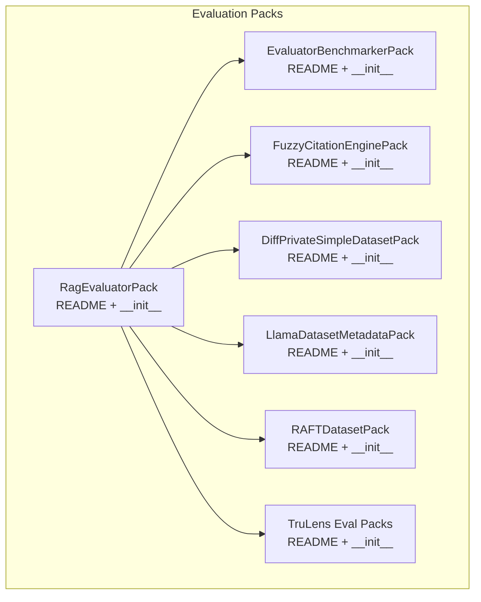
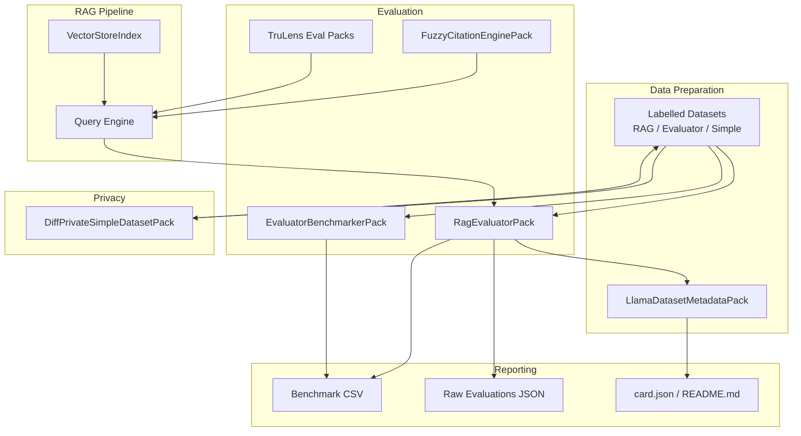
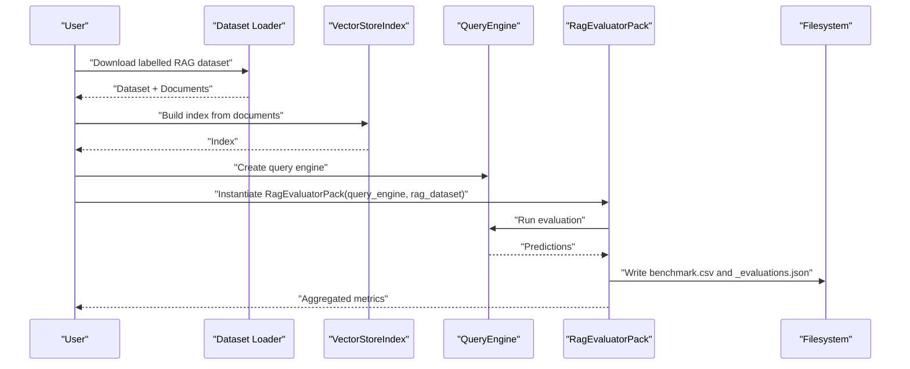
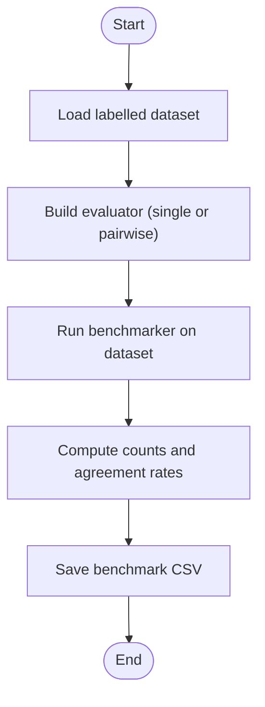
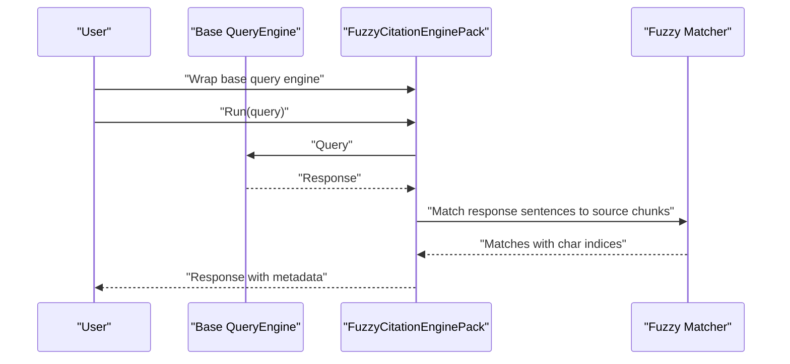
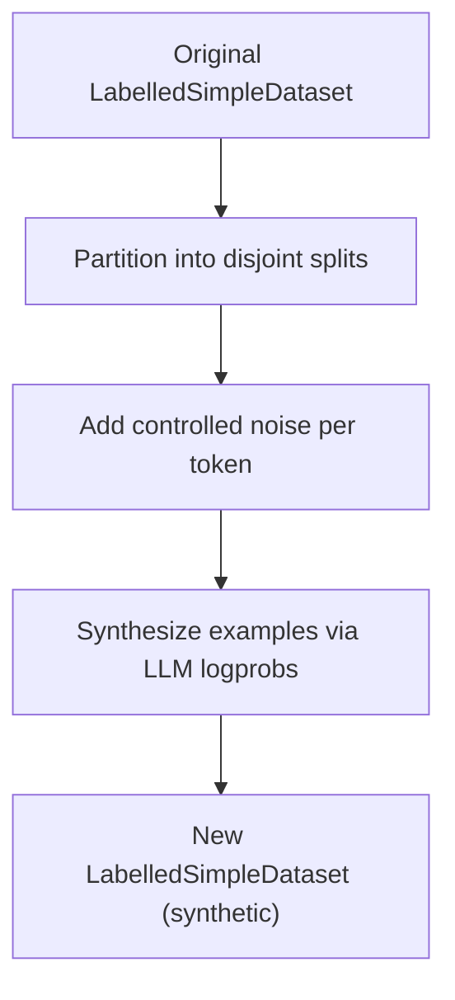
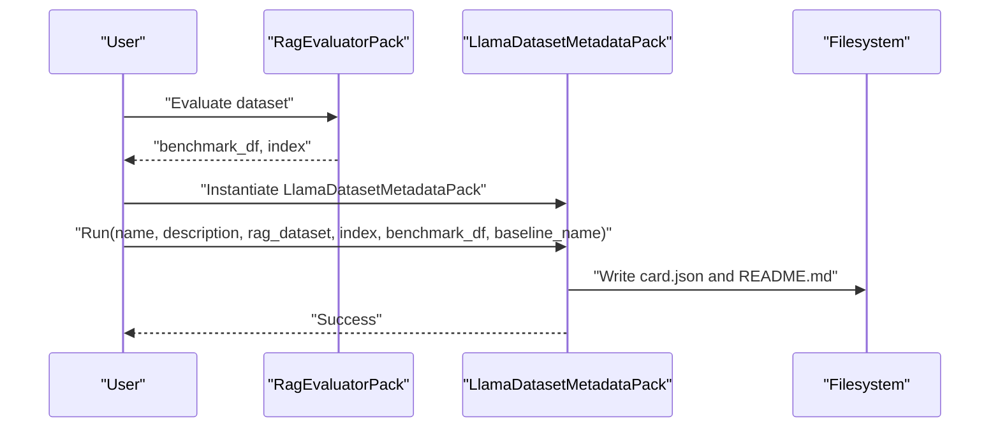
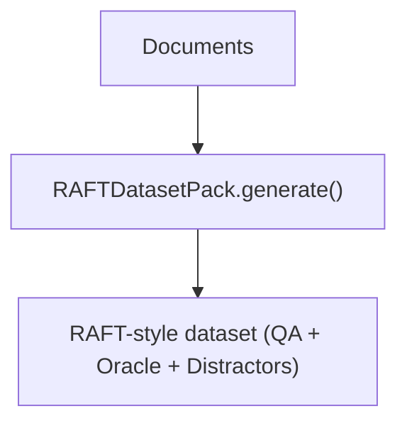
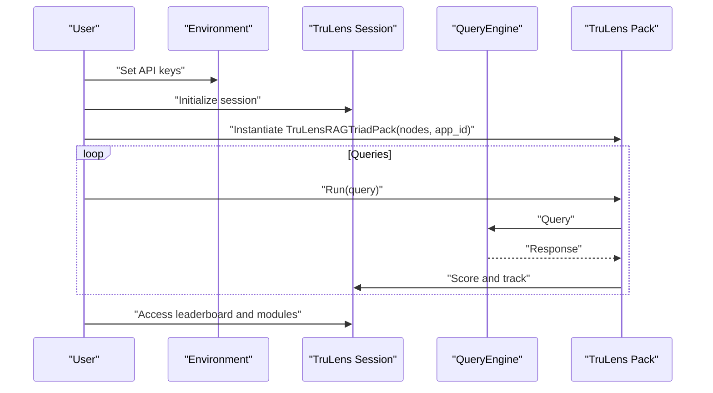
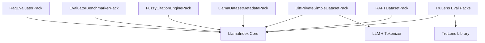

# Evaluation Packs

<cite>
**Referenced Files in This Document**
- [README.md](file://llama-index-packs/llama-index-packs-rag-evaluator/README.md)
- [__init__.py](file://llama-index-packs/llama-index-packs-rag-evaluator/llama_index/packs/rag_evaluator/__init__.py)
- [README.md](file://llama-index-packs/llama-index-packs-evaluator-benchmarker/README.md)
- [__init__.py](file://llama-index-packs/llama-index-packs-evaluator-benchmarker/llama_index/packs/evaluator_benchmarker/__init__.py)
- [README.md](file://llama-index-packs/llama-index-packs-fuzzy-citation/README.md)
- [__init__.py](file://llama-index-packs/llama-index-packs-fuzzy-citation/llama_index/packs/fuzzy_citation/__init__.py)
- [README.md](file://llama-index-packs/llama-index-packs-diff-private-simple-dataset/README.md)
- [__init__.py](file://llama-index-packs/llama-index-packs-diff-private-simple-dataset/llama_index/packs/diff_private_simple_dataset/__init__.py)
- [README.md](file://llama-index-packs/llama-index-packs-llama-dataset-metadata/README.md)
- [__init__.py](file://llama-index-packs/llama-index-packs-llama-dataset-metadata/llama_index/packs/llama_dataset_metadata/__init__.py)
- [README.md](file://llama-index-packs/llama-index-packs-raft-dataset/README.md)
- [__init__.py](file://llama-index-packs/llama-index-packs-raft-dataset/llama_index/packs/raft_dataset/__init__.py)
- [README.md](file://llama-index-packs/llama-index-packs-trulens-eval-packs/README.md)
- [__init__.py](file://llama-index-packs/llama-index-packs-trulens-eval-packs/llama_index/packs/trulens_eval_packs/__init__.py)
</cite>

## Table of Contents
1. [Introduction](#introduction)
2. [Project Structure](#project-structure)
3. [Core Components](#core-components)
4. [Architecture Overview](#architecture-overview)
5. [Detailed Component Analysis](#detailed-component-analysis)
6. [Dependency Analysis](#dependency-analysis)
7. [Performance Considerations](#performance-considerations)
8. [Troubleshooting Guide](#troubleshooting-guide)
9. [Conclusion](#conclusion)
10. [Appendices](#appendices)

## Introduction
This document provides comprehensive documentation for the Evaluation Packs ecosystem within the LlamaIndex project. It focuses on seven evaluation-focused packs: rag-evaluator for standard RAG performance assessment, evaluator-benchmarker for systematic benchmark comparisons, fuzzy-citation for citation accuracy evaluation, diff-private-simple-dataset for privacy-preserving evaluation, llama-dataset-metadata for dataset annotation, raft-dataset for standardized benchmarks, and trulens-eval-packs for comprehensive evaluation suites. For each pack, we explain evaluation methodology, metric calculations, statistical significance testing, and comparative analysis capabilities. We also include practical examples showing evaluation pipeline setup, custom metric definition, result interpretation, and performance reporting. Additional coverage includes evaluation data preparation, bias detection, fairness assessment, ethical evaluation considerations, scalability, cost optimization, and continuous monitoring approaches.

## Project Structure
The Evaluation Packs are distributed as standalone LlamaIndex packs under the llama-index-packs directory. Each pack provides:
- A README with usage instructions, CLI commands, and example outputs
- An initialization module exporting the primary pack class
- Optional examples and templates for quick start

**Diagram sources**
- [README.md](file://llama-index-packs/llama-index-packs-rag-evaluator/README.md#L1-L74)
- [__init__.py](file://llama-index-packs/llama-index-packs-rag-evaluator/llama_index/packs/rag_evaluator/__init__.py#L1-L4)
- [README.md](file://llama-index-packs/llama-index-packs-evaluator-benchmarker/README.md#L1-L83)
- [__init__.py](file://llama-index-packs/llama-index-packs-evaluator-benchmarker/llama_index/packs/evaluator_benchmarker/__init__.py#L1-L4)
- [README.md](file://llama-index-packs/llama-index-packs-fuzzy-citation/README.md#L1-L51)
- [__init__.py](file://llama-index-packs/llama-index-packs-fuzzy-citation/llama_index/packs/fuzzy_citation/__init__.py#L1-L4)
- [README.md](file://llama-index-packs/llama-index-packs-diff-private-simple-dataset/README.md#L1-L126)
- [__init__.py](file://llama-index-packs/llama-index-packs-diff-private-simple-dataset/llama_index/packs/diff_private_simple_dataset/__init__.py#L1-L7)
- [README.md](file://llama-index-packs/llama-index-packs-llama-dataset-metadata/README.md#L1-L56)
- [__init__.py](file://llama-index-packs/llama-index-packs-llama-dataset-metadata/llama_index/packs/llama_dataset_metadata/__init__.py#L1-L4)
- [README.md](file://llama-index-packs/llama-index-packs-raft-dataset/README.md#L1-L50)
- [__init__.py](file://llama-index-packs/llama-index-packs-raft-dataset/llama_index/packs/raft_dataset/__init__.py#L1-L4)
- [README.md](file://llama-index-packs/llama-index-packs-trulens-eval-packs/README.md#L1-L105)
- [__init__.py](file://llama-index-packs/llama-index-packs-trulens-eval-packs/llama_index/packs/trulens_eval_packs/__init__.py#L1-L8)

**Section sources**
- [README.md](file://llama-index-packs/llama-index-packs-rag-evaluator/README.md#L1-L74)
- [README.md](file://llama-index-packs/llama-index-packs-evaluator-benchmarker/README.md#L1-L83)
- [README.md](file://llama-index-packs/llama-index-packs-fuzzy-citation/README.md#L1-L51)
- [README.md](file://llama-index-packs/llama-index-packs-diff-private-simple-dataset/README.md#L1-L126)
- [README.md](file://llama-index-packs/llama-index-packs-llama-dataset-metadata/README.md#L1-L56)
- [README.md](file://llama-index-packs/llama-index-packs-raft-dataset/README.md#L1-L50)
- [README.md](file://llama-index-packs/llama-index-packs-trulens-eval-packs/README.md#L1-L105)

## Core Components
This section summarizes each Evaluation Pack’s purpose, inputs, outputs, and evaluation methodology.

- RagEvaluatorPack
  - Purpose: Automated benchmarking of a RAG pipeline against a labeled RAG dataset.
  - Inputs: Query engine, labeled RAG dataset, optional judge LLM.
  - Outputs: Aggregated metrics CSV and raw evaluation JSON.
  - Metrics: Mean correctness, relevancy, faithfulness, context similarity.
  - Methodology: Runs queries, collects predictions, compares to references, aggregates scores.
  - Comparative analysis: Provides baseline scores for reporting and CSV export.

- EvaluatorBenchmarkerPack
  - Purpose: Benchmark an evaluator (single-grading or pairwise) on labeled evaluation datasets.
  - Inputs: Evaluator instance, labeled dataset (single or pairwise), progress flag.
  - Outputs: Aggregated benchmark CSV.
  - Metrics: Example count, inconclusive results, ties, agreement rates (with/without ties).
  - Methodology: Evaluates predictions against ground truth labels; computes agreement statistics.
  - Comparative analysis: Supports pairwise and single-grading comparisons.

- FuzzyCitationEnginePack
  - Purpose: Post-process responses to identify source sentences using fuzzy matching.
  - Inputs: Base query engine, optional threshold.
  - Outputs: Response with metadata mapping response sentences to source chunks and character indices.
  - Methodology: Uses fuzzy ratio comparison; attaches metadata for traceability.
  - Accuracy evaluation: Enables citation accuracy checks and provenance verification.

- DiffPrivateSimpleDatasetPack
  - Purpose: Generate differentially private synthetic examples from a sensitive dataset.
  - Inputs: LLM supporting logprobs, tokenizer, prompt bundle, labeled simple dataset, optional throttling parameters.
  - Outputs: New labeled simple dataset with synthetic examples.
  - Methodology: Disjoint dataset splits, controlled noise addition, token-wise generation to preserve privacy budget.
  - Privacy: Differential privacy guarantees; synthetic data can be reused without additional privacy cost.

- LlamaDatasetMetadataPack
  - Purpose: Generate dataset submission metadata (card.json and README.md) for LlamaHub.
  - Inputs: Name, description, dataset, index, benchmark results, baseline name.
  - Outputs: card.json and README.md saved to disk.
  - Methodology: Creates standardized metadata for dataset submission and discovery.
  - Usage: Should be run after evaluating a dataset with RagEvaluatorPack.

- RAFTDatasetPack
  - Purpose: Generate RAFT-style datasets for retrieval-augmented fine-tuning with oracle and distractor documents.
  - Inputs: Documents from any loader.
  - Outputs: Dataset ready for fine-tuning.
  - Methodology: Builds QA pairs with relevant oracle documents and irrelevant distractors to train robust reasoning.
  - Benchmarking: Prepares standardized benchmarks for domain-specific RAG.

- TruLens Eval Packs
  - Purpose: Comprehensive evaluation suite for RAG apps using TruLens observability.
  - Includes: RAG Triad (context relevance, groundedness, answer relevance), Harmless (safety/moderation), Helpful (conciseness, language match).
  - Inputs: Nodes, app ID, optional environment configuration.
  - Outputs: Evaluation results and leaderboard access via TruLens.
  - Methodology: Integrates with TruLens for scoring and tracking; exposes internal modules for inspection and leaderboard queries.

**Section sources**
- [README.md](file://llama-index-packs/llama-index-packs-rag-evaluator/README.md#L1-L74)
- [README.md](file://llama-index-packs/llama-index-packs-evaluator-benchmarker/README.md#L1-L83)
- [README.md](file://llama-index-packs/llama-index-packs-fuzzy-citation/README.md#L1-L51)
- [README.md](file://llama-index-packs/llama-index-packs-diff-private-simple-dataset/README.md#L1-L126)
- [README.md](file://llama-index-packs/llama-index-packs-llama-dataset-metadata/README.md#L1-L56)
- [README.md](file://llama-index-packs/llama-index-packs-raft-dataset/README.md#L1-L50)
- [README.md](file://llama-index-packs/llama-index-packs-trulens-eval-packs/README.md#L1-L105)

## Architecture Overview
The Evaluation Packs integrate with LlamaIndex core components to form end-to-end evaluation pipelines. The typical flow involves preparing datasets, building RAG pipelines, running evaluations, and generating reports.

**Diagram sources**
- [README.md](file://llama-index-packs/llama-index-packs-rag-evaluator/README.md#L1-L74)
- [README.md](file://llama-index-packs/llama-index-packs-evaluator-benchmarker/README.md#L1-L83)
- [README.md](file://llama-index-packs/llama-index-packs-fuzzy-citation/README.md#L1-L51)
- [README.md](file://llama-index-packs/llama-index-packs-diff-private-simple-dataset/README.md#L1-L126)
- [README.md](file://llama-index-packs/llama-index-packs-llama-dataset-metadata/README.md#L1-L56)
- [README.md](file://llama-index-packs/llama-index-packs-trulens-eval-packs/README.md#L1-L105)

## Detailed Component Analysis

### RagEvaluatorPack
- Evaluation methodology
  - Loads a labeled RAG dataset and builds a basic RAG pipeline from source documents.
  - Runs the query engine against dataset queries and collects predictions.
  - Compares predictions to reference answers and contexts to compute per-example metrics.
  - Aggregates metrics across examples and writes CSV and raw JSON outputs.
- Metric calculations
  - Mean correctness score, mean relevancy score, mean faithfulness score, mean context similarity score.
- Statistical significance testing
  - Not implemented in-pack; recommended to compute confidence intervals externally using bootstrapping or paired t-tests across multiple runs.
- Comparative analysis
  - Provides baseline scores suitable for CSV-based reporting and comparison across runs or configurations.
- Practical example
  - Download dataset, build index and query engine, download and instantiate RagEvaluatorPack, run evaluation, inspect outputs.
- Result interpretation
  - Higher scores indicate better alignment with reference answers and contexts; use CSV for longitudinal tracking.
- Performance reporting
  - Save and version benchmark CSV and raw JSON for auditability.

**Diagram sources**
- [README.md](file://llama-index-packs/llama-index-packs-rag-evaluator/README.md#L18-L74)

**Section sources**
- [README.md](file://llama-index-packs/llama-index-packs-rag-evaluator/README.md#L1-L74)
- [__init__.py](file://llama-index-packs/llama-index-packs-rag-evaluator/llama_index/packs/rag_evaluator/__init__.py#L1-L4)

### EvaluatorBenchmarkerPack
- Evaluation methodology
  - Accepts a single-grading or pairwise evaluator and a corresponding labeled dataset.
  - Scores predictions against ground truth labels and computes agreement statistics.
- Metric calculations
  - Number of examples, inconclusive results, ties, agreement rate with ties, agreement rate without ties.
- Statistical significance testing
  - Not implemented in-pack; use external tests to assess significance of differences between evaluators.
- Comparative analysis
  - Supports pairwise and single-grading datasets; useful for comparing evaluator designs.
- Practical example
  - Download pairwise dataset, configure evaluator with a judge LLM, instantiate benchmarker, run evaluation, inspect CSV.
- Result interpretation
  - Agreement rates reflect evaluator reliability; ties and inconclusives highlight ambiguous cases.
- Performance reporting
  - Export benchmark CSV for tracking evaluator performance over time.

**Diagram sources**
- [README.md](file://llama-index-packs/llama-index-packs-evaluator-benchmarker/README.md#L1-L83)

**Section sources**
- [README.md](file://llama-index-packs/llama-index-packs-evaluator-benchmarker/README.md#L1-L83)
- [__init__.py](file://llama-index-packs/llama-index-packs-evaluator-benchmarker/llama_index/packs/evaluator_benchmarker/__init__.py#L1-L4)

### FuzzyCitationEnginePack
- Evaluation methodology
  - Wraps a base query engine to post-process responses and identify source sentences via fuzzy matching.
  - Attaches metadata mapping response sentences to source chunks and character indices.
- Metric calculations
  - Not applicable; serves as a provenance and traceability tool.
- Statistical significance testing
  - Not applicable; use citation recall/precision metrics computed externally.
- Comparative analysis
  - Enables manual or automated checks for citation accuracy and grounding.
- Practical example
  - Instantiate pack with a query engine and threshold, run a query, inspect response metadata keys and values.
- Result interpretation
  - Metadata indicates which parts of the response align with source chunks; use for citation verification.
- Performance reporting
  - Use metadata to compute citation accuracy metrics and report false positive/negative rates.

**Diagram sources**
- [README.md](file://llama-index-packs/llama-index-packs-fuzzy-citation/README.md#L1-L51)

**Section sources**
- [README.md](file://llama-index-packs/llama-index-packs-fuzzy-citation/README.md#L1-L51)
- [__init__.py](file://llama-index-packs/llama-index-packs-fuzzy-citation/llama_index/packs/fuzzy_citation/__init__.py#L1-L4)

### DiffPrivateSimpleDatasetPack
- Evaluation methodology
  - Generates synthetic examples from a sensitive dataset using differential privacy.
  - Splits dataset into disjoint partitions, adds controlled noise, and synthesizes examples via LLM logprobs.
- Metric calculations
  - Not applicable; privacy-preserving data generation.
- Statistical significance testing
  - Not applicable; privacy budget controls are configured via sigma and epsilon.
- Comparative analysis
  - Compare distributions of synthetic vs. real data using standard goodness-of-fit tests.
- Practical example
  - Configure LLM/tokenizer/PromptBundle, instantiate pack, call run with sizes, t_max, sigma, num_splits, num_samples_per_split.
- Result interpretation
  - Synthetic dataset preserves attributes while maintaining privacy; suitable for downstream evaluation.
- Performance reporting
  - Track privacy budget consumption and synthetic data utility via downstream evaluations.

**Diagram sources**
- [README.md](file://llama-index-packs/llama-index-packs-diff-private-simple-dataset/README.md#L1-L126)

**Section sources**
- [README.md](file://llama-index-packs/llama-index-packs-diff-private-simple-dataset/README.md#L1-L126)
- [__init__.py](file://llama-index-packs/llama-index-packs-diff-private-simple-dataset/llama_index/packs/diff_private_simple_dataset/__init__.py#L1-L7)

### LlamaDatasetMetadataPack
- Evaluation methodology
  - Generates card.json and README.md for dataset submission to LlamaHub.
  - Requires prior evaluation results and index information.
- Metric calculations
  - Not applicable; metadata creation.
- Statistical significance testing
  - Not applicable; descriptive metadata.
- Comparative analysis
  - Standardizes dataset presentation for discoverability and reuse.
- Practical example
  - Instantiate pack, run with name, description, rag_dataset, index, benchmark_df, baseline_name.
- Result interpretation
  - Ensures consistent metadata for dataset cards and documentation.
- Performance reporting
  - No direct reporting; improves dataset contribution quality.

**Diagram sources**
- [README.md](file://llama-index-packs/llama-index-packs-llama-dataset-metadata/README.md#L1-L56)

**Section sources**
- [README.md](file://llama-index-packs/llama-index-packs-llama-dataset-metadata/README.md#L1-L56)
- [__init__.py](file://llama-index-packs/llama-index-packs-llama-dataset-metadata/llama_index/packs/llama_dataset_metadata/__init__.py#L1-L4)

### RAFTDatasetPack
- Evaluation methodology
  - Generates RAFT-style datasets by pairing QA pairs with an oracle (relevant) document and distractor (irrelevant) documents.
  - Encourages models to learn relevant vs. irrelevant information and cite verbatim.
- Metric calculations
  - Not applicable; dataset generation.
- Statistical significance testing
  - Not applicable; dataset construction.
- Comparative analysis
  - Useful for fine-tuning and evaluating domain-specific RAG performance.
- Practical example
  - Download documents via any loader, instantiate RAFTDatasetPack, call run to obtain dataset.
- Result interpretation
  - Dataset prepared for fine-tuning; use downstream evaluation to measure improvements.
- Performance reporting
  - Evaluate fine-tuned models on held-out sets and compare metrics.

**Diagram sources**
- [README.md](file://llama-index-packs/llama-index-packs-raft-dataset/README.md#L1-L50)

**Section sources**
- [README.md](file://llama-index-packs/llama-index-packs-raft-dataset/README.md#L1-L50)
- [__init__.py](file://llama-index-packs/llama-index-packs-raft-dataset/llama_index/packs/raft_dataset/__init__.py#L1-L4)

### TruLens Eval Packs
- Evaluation methodology
  - Provides three packs: RAG Triad (context relevance, groundedness, answer relevance), Harmless (safety/moderation), Helpful (conciseness, language match).
  - Integrates with TruLens for scoring and tracking; exposes internal modules for inspection and leaderboard queries.
- Metric calculations
  - Pack-specific scoring; results exported via TruLens.
- Statistical significance testing
  - Not implemented in-pack; use TruLens leaderboard and historical runs for significance.
- Comparative analysis
  - Compare app versions and configurations via TruLens leaderboard and internal modules.
- Practical example
  - Set environment variables, prepare nodes, instantiate TruLensRAGTriadPack, run queries, access modules and leaderboard.
- Result interpretation
  - Use TruLens scoring to detect hallucinations and monitor safety/helpfulness trends.
- Performance reporting
  - Track metrics over time and across deployments using TruLens.

**Diagram sources**
- [README.md](file://llama-index-packs/llama-index-packs-trulens-eval-packs/README.md#L1-L105)

**Section sources**
- [README.md](file://llama-index-packs/llama-index-packs-trulens-eval-packs/README.md#L1-L105)
- [__init__.py](file://llama-index-packs/llama-index-packs-trulens-eval-packs/llama_index/packs/trulens_eval_packs/__init__.py#L1-L8)

## Dependency Analysis
Each pack depends on LlamaIndex core components and external libraries as documented in their READMEs. The primary dependencies include:
- LlamaIndex core datasets and packs infrastructure
- LLMs and tokenizers for privacy and evaluation
- TruLens for observability and scoring
- Optional progress bars and filesystem utilities

**Diagram sources**
- [README.md](file://llama-index-packs/llama-index-packs-rag-evaluator/README.md#L1-L74)
- [README.md](file://llama-index-packs/llama-index-packs-evaluator-benchmarker/README.md#L1-L83)
- [README.md](file://llama-index-packs/llama-index-packs-fuzzy-citation/README.md#L1-L51)
- [README.md](file://llama-index-packs/llama-index-packs-diff-private-simple-dataset/README.md#L1-L126)
- [README.md](file://llama-index-packs/llama-index-packs-llama-dataset-metadata/README.md#L1-L56)
- [README.md](file://llama-index-packs/llama-index-packs-raft-dataset/README.md#L1-L50)
- [README.md](file://llama-index-packs/llama-index-packs-trulens-eval-packs/README.md#L1-L105)

**Section sources**
- [README.md](file://llama-index-packs/llama-index-packs-rag-evaluator/README.md#L1-L74)
- [README.md](file://llama-index-packs/llama-index-packs-evaluator-benchmarker/README.md#L1-L83)
- [README.md](file://llama-index-packs/llama-index-packs-fuzzy-citation/README.md#L1-L51)
- [README.md](file://llama-index-packs/llama-index-packs-diff-private-simple-dataset/README.md#L1-L126)
- [README.md](file://llama-index-packs/llama-index-packs-llama-dataset-metadata/README.md#L1-L56)
- [README.md](file://llama-index-packs/llama-index-packs-raft-dataset/README.md#L1-L50)
- [README.md](file://llama-index-packs/llama-index-packs-trulens-eval-packs/README.md#L1-L105)

## Performance Considerations
- Cost optimization
  - Use smaller datasets for initial runs; cache intermediate results (CSV and raw JSON).
  - Batch requests where possible; throttle LLM calls to avoid rate limits.
  - Prefer cheaper judge LLMs for preliminary evaluations; reserve expensive models for final checks.
- Scalability
  - Parallelize evaluation across multiple cores; use async variants where available.
  - Store results in cloud storage for shared access and reproducibility.
- Continuous monitoring
  - Integrate with TruLens for ongoing scoring and leaderboards.
  - Automate periodic evaluations and alert on metric drifts.

## Troubleshooting Guide
- Rate limiting during LLM calls
  - Reduce request rate or increase sleep time between calls; adjust semaphore counter.
- Privacy budget exhaustion
  - Lower sigma or reduce t_max to stay within epsilon bounds; split workloads across sessions.
- Citation mismatch
  - Adjust fuzzy matching threshold; verify tokenizer and sentence splitting.
- Metadata generation errors
  - Ensure prior evaluation has produced benchmark_df and index; confirm dataset references are valid.
- TruLens connectivity
  - Verify API keys and network access; check TruLens server availability.

**Section sources**
- [README.md](file://llama-index-packs/llama-index-packs-diff-private-simple-dataset/README.md#L53-L118)
- [README.md](file://llama-index-packs/llama-index-packs-fuzzy-citation/README.md#L1-L51)
- [README.md](file://llama-index-packs/llama-index-packs-llama-dataset-metadata/README.md#L36-L56)
- [README.md](file://llama-index-packs/llama-index-packs-trulens-eval-packs/README.md#L40-L105)

## Conclusion
The Evaluation Packs provide a cohesive toolkit for assessing and improving RAG systems. They enable automated benchmarking, evaluator comparison, citation verification, privacy-preserving data generation, dataset metadata creation, standardized benchmark preparation, and comprehensive observability. By combining these packs, teams can establish robust evaluation pipelines, continuously monitor performance, and ensure ethical and fair outcomes.

## Appendices
- Practical examples
  - RagEvaluatorPack: Follow the README example to evaluate a RAG pipeline and interpret outputs.
  - EvaluatorBenchmarkerPack: Use the README example to benchmark evaluators on pairwise or single-grading datasets.
  - FuzzyCitationEnginePack: Wrap a query engine and inspect response metadata for citation verification.
  - DiffPrivateSimpleDatasetPack: Configure LLM/tokenizer/PromptBundle and run with privacy parameters.
  - LlamaDatasetMetadataPack: Generate card.json and README.md after evaluating a dataset.
  - RAFTDatasetPack: Prepare RAFT-style datasets for fine-tuning.
  - TruLens Eval Packs: Initialize TruLens, run queries, and access leaderboard and modules.

[No sources needed since this section summarizes usage without analyzing specific files]