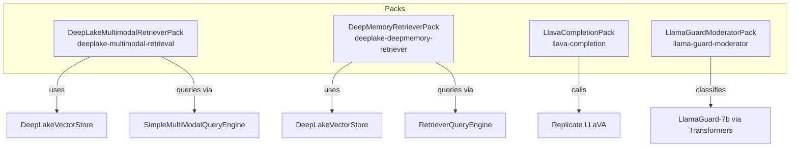
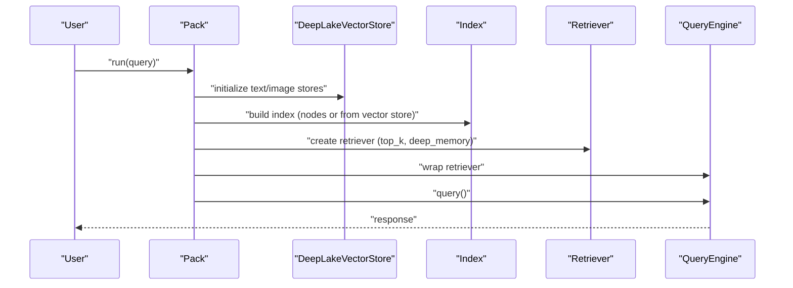
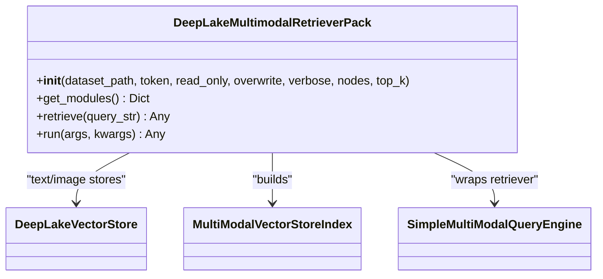
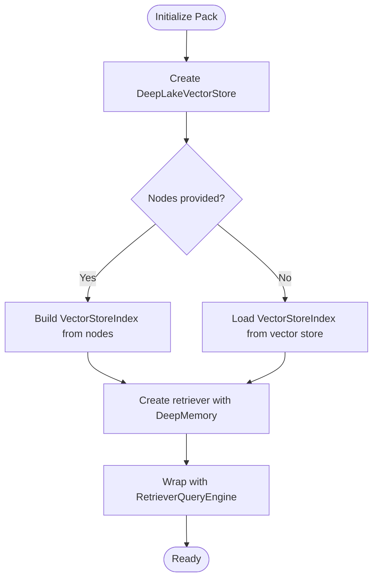
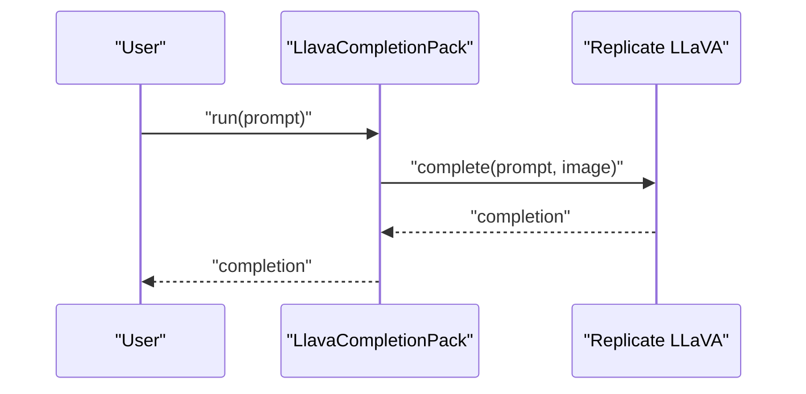
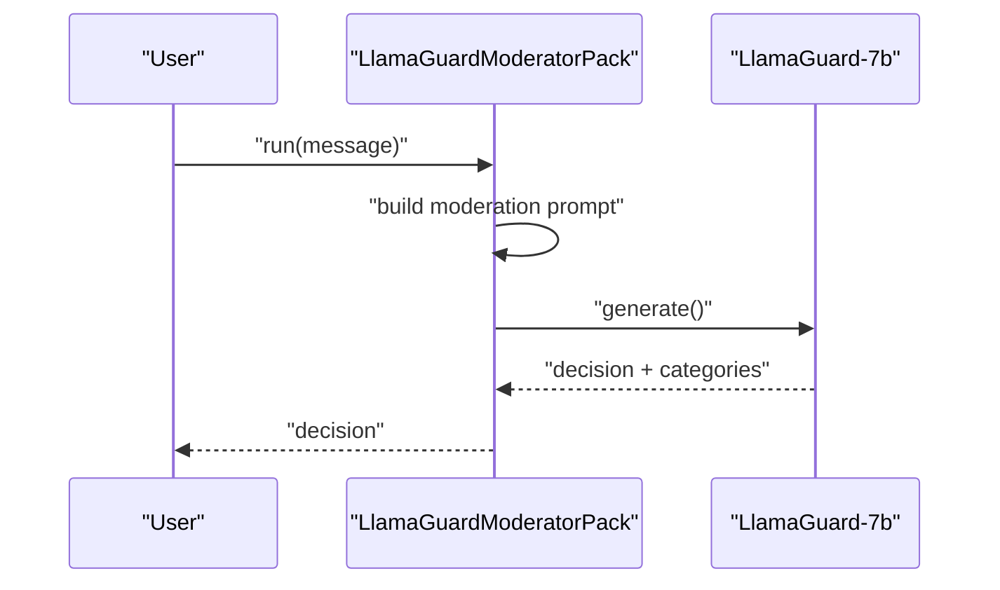
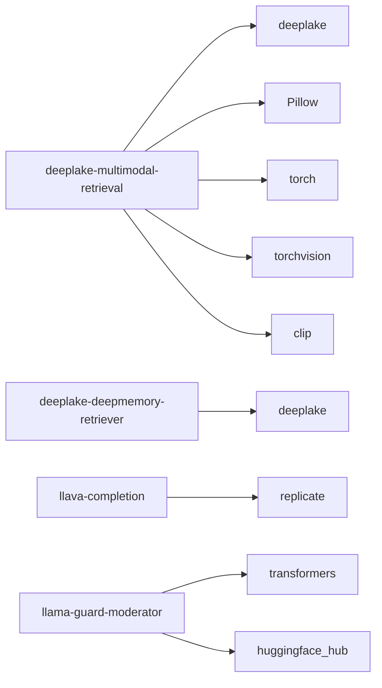

# Multi-modal Packs

<cite>
**Referenced Files in This Document**
- [README.md](file://llama-index-packs/llama-index-packs-deeplake-multimodal-retrieval/README.md)
- [base.py](file://llama-index-packs/llama-index-packs-deeplake-multimodal-retrieval/llama_index/packs/deeplake_multimodal_retrieval/base.py)
- [README.md](file://llama-index-packs/llama-index-packs-llava-completion/README.md)
- [base.py](file://llama-index-packs/llama-index-packs-llava-completion/llama_index/packs/llava_completion/base.py)
- [README.md](file://llama-index-packs/llama-index-packs-deeplake-deepmemory-retriever/README.md)
- [base.py](file://llama-index-packs/llama-index-packs-deeplake-deepmemory-retriever/llama_index/packs/deeplake_deepmemory_retriever/base.py)
- [README.md](file://llama-index-packs/llama-index-packs-llama-guard-moderator/README.md)
- [base.py](file://llama-index-packs/llama-index-packs-llama-guard-moderator/llama_index/packs/llama_guard_moderator/base.py)
- [requirements.txt](file://llama-index-packs/llama-index-packs-deeplake-multimodal-retrieval/requirements.txt)
</cite>

## Table of Contents
1. [Introduction](#introduction)
2. [Project Structure](#project-structure)
3. [Core Components](#core-components)
4. [Architecture Overview](#architecture-overview)
5. [Detailed Component Analysis](#detailed-component-analysis)
6. [Dependency Analysis](#dependency-analysis)
7. [Performance Considerations](#performance-considerations)
8. [Troubleshooting Guide](#troubleshooting-guide)
9. [Conclusion](#conclusion)
10. [Appendices](#appendices)

## Introduction
This document provides a comprehensive guide to four multi-modal packs integrated in the repository:
- deeplake-multimodal-retrieval: Cross-modal retrieval across text and images using heterogeneous vector stores and runtime multimodal query execution.
- llava-completion: Vision-language completion via a hosted LLaVA model through a third-party inference provider.
- deeplake-deepmemory-retriever: Enhanced retrieval leveraging DeepMemory for improved recall on large-scale datasets.
- llama-guard-moderator: Content safety enforcement for LLM inputs and outputs using LlamaGuard with customizable taxonomy.

It explains modal processing pipelines, cross-modal alignment, embedding strategies, retrieval algorithms, configuration examples, preprocessing/postprocessing considerations, data formats/storage optimization, performance tuning, security and bias mitigation, and troubleshooting guidance.

## Project Structure
The multi-modal packs are organized as standalone LlamaPacks under llama-index-packs. Each pack exposes a base implementation and a public initializer, along with usage documentation and, where applicable, requirements.

**Diagram sources**
- [base.py](file://llama-index-packs/llama-index-packs-deeplake-multimodal-retrieval/llama_index/packs/deeplake_multimodal_retrieval/base.py#L13-L85)
- [base.py](file://llama-index-packs/llama-index-packs-deeplake-deepmemory-retriever/llama_index/packs/deeplake_deepmemory_retriever/base.py#L13-L70)
- [base.py](file://llama-index-packs/llama-index-packs-llava-completion/llama_index/packs/llava_completion/base.py#L9-L40)
- [base.py](file://llama-index-packs/llama-index-packs-llama-guard-moderator/llama_index/packs/llama_guard_moderator/base.py#L55-L134)

**Section sources**
- [README.md](file://llama-index-packs/llama-index-packs-deeplake-multimodal-retrieval/README.md#L1-L62)
- [README.md](file://llama-index-packs/llama-index-packs-llava-completion/README.md#L1-L52)
- [README.md](file://llama-index-packs/llama-index-packs-deeplake-deepmemory-retriever/README.md#L1-L63)
- [README.md](file://llama-index-packs/llama-index-packs-llama-guard-moderator/README.md#L1-L274)

## Core Components
- DeepLakeMultimodalRetrieverPack
  - Initializes separate DeepLake vector stores for text and images.
  - Builds a multi-modal index and a retriever configured with DeepMemory.
  - Exposes a simple multimodal query engine for end-to-end retrieval and generation.
  - Supports optional node ingestion and runtime query execution.

- DeepMemoryRetrieverPack
  - Creates a DeepLake vector store and a standard vector index.
  - Enables DeepMemory-enhanced retrieval via vector store kwargs.
  - Provides a retriever and a query engine for downstream use.

- LlavaCompletionPack
  - Instantiates a Replicate-hosted LLaVA model with an image URL.
  - Exposes a completion interface for vision-language queries.
  - Requires a valid third-party API token.

- LlamaGuardModeratorPack
  - Loads LlamaGuard-7b via Hugging Face Transformers.
  - Accepts a customizable safety taxonomy.
  - Moderates single-turn messages and returns “safe” or “unsafe” with category indicators.

**Section sources**
- [base.py](file://llama-index-packs/llama-index-packs-deeplake-multimodal-retrieval/llama_index/packs/deeplake_multimodal_retrieval/base.py#L13-L85)
- [base.py](file://llama-index-packs/llama-index-packs-deeplake-deepmemory-retriever/llama_index/packs/deeplake_deepmemory_retriever/base.py#L13-L70)
- [base.py](file://llama-index-packs/llama-index-packs-llava-completion/llama_index/packs/llava_completion/base.py#L9-L40)
- [base.py](file://llama-index-packs/llama-index-packs-llama-guard-moderator/llama_index/packs/llama_guard_moderator/base.py#L55-L134)

## Architecture Overview
The packs orchestrate ingestion, indexing, retrieval, and generation with optional moderation. The following diagram maps the primary components and their interactions.

**Diagram sources**
- [base.py](file://llama-index-packs/llama-index-packs-deeplake-multimodal-retrieval/llama_index/packs/deeplake_multimodal_retrieval/base.py#L16-L65)
- [base.py](file://llama-index-packs/llama-index-packs-deeplake-deepmemory-retriever/llama_index/packs/deeplake_deepmemory_retriever/base.py#L16-L51)

## Detailed Component Analysis

### DeepLake Multimodal Retrieval Pack
- Modal processing pipeline
  - Separate vector stores for text and images backed by DeepLake.
  - Multi-modal index construction supports mixed modal nodes.
  - Runtime retrieval leverages DeepMemory for higher recall.

- Cross-modal alignment
  - Uses a multi-modal query engine to coordinate retrieval across modalities.
  - Embedding strategy relies on CLIP for images and text embeddings handled by the vector store.

- Retrieval algorithm
  - Standard vector similarity with configurable top_k.
  - DeepMemory enabled via vector store kwargs to improve recall.

- Configuration and usage
  - Initialization accepts dataset path, token, read-only flag, overwrite, verbosity, and node list.
  - Optional node ingestion; otherwise loads from existing vector stores.
  - Exposes retriever and query engine for modular use.

- Preprocessing and postprocessing
  - Preprocessing: Ensure nodes include appropriate metadata for text and image content.
  - Postprocessing: Filter or rerank returned nodes as needed.

- Multi-modal data formats and storage
  - DeepLake datasets for text and image embeddings.
  - Embedding libraries include CLIP and PyTorch ecosystem.

- Retrieval performance tuning
  - Adjust top_k and enable DeepMemory for recall improvements.
  - Optimize dataset partitioning and chunk sizes for heterogeneous modality storage.

**Diagram sources**
- [base.py](file://llama-index-packs/llama-index-packs-deeplake-multimodal-retrieval/llama_index/packs/deeplake_multimodal_retrieval/base.py#L13-L85)

**Section sources**
- [README.md](file://llama-index-packs/llama-index-packs-deeplake-multimodal-retrieval/README.md#L1-L62)
- [base.py](file://llama-index-packs/llama-index-packs-deeplake-multimodal-retrieval/llama_index/packs/deeplake_multimodal_retrieval/base.py#L13-L85)
- [requirements.txt](file://llama-index-packs/llama-index-packs-deeplake-multimodal-retrieval/requirements.txt#L1-L6)

### DeepMemory Retriever Pack
- Modal processing pipeline
  - Single vector store for text nodes.
  - Index built from nodes or loaded from an existing DeepLake vector store.

- Retrieval algorithm
  - DeepMemory-enabled retriever improves recall without altering the embedding model.

- Configuration and usage
  - Accepts dataset path, token, read-only flag, overwrite, verbosity, and node list.
  - Exposes retriever and a query engine for downstream use.

- Preprocessing and postprocessing
  - Preprocessing: Normalize text chunks and ensure metadata alignment.
  - Postprocessing: Apply filters or reranking to refine results.

- Retrieval performance tuning
  - Enable DeepMemory via vector store kwargs to enhance recall.
  - Tune top_k and dataset indexing strategy.

**Diagram sources**
- [base.py](file://llama-index-packs/llama-index-packs-deeplake-deepmemory-retriever/llama_index/packs/deeplake_deepmemory_retriever/base.py#L16-L51)

**Section sources**
- [README.md](file://llama-index-packs/llama-index-packs-deeplake-deepmemory-retriever/README.md#L1-L63)
- [base.py](file://llama-index-packs/llama-index-packs-deeplake-deepmemory-retriever/llama_index/packs/deeplake_deepmemory_retriever/base.py#L13-L70)

### Llava Completion Pack
- Modal processing pipeline
  - Hosted LLaVA model via Replicate.
  - Accepts an image URL and a text prompt; returns a completion.

- Embedding and alignment
  - Uses a pre-trained vision-language model; no local embedding required.

- Configuration and usage
  - Requires a Replicate API token set in environment variables.
  - Initialize with an image URL; call run/completion with a query.

- Preprocessing and postprocessing
  - Preprocessing: Ensure a valid image URL and supported image format.
  - Postprocessing: Validate and sanitize model outputs.

- Security and privacy
  - Image content is processed by a third-party provider; review provider policies.

**Diagram sources**
- [base.py](file://llama-index-packs/llama-index-packs-llava-completion/llama_index/packs/llava_completion/base.py#L9-L40)

**Section sources**
- [README.md](file://llama-index-packs/llama-index-packs-llava-completion/README.md#L1-L52)
- [base.py](file://llama-index-packs/llama-index-packs-llava-completion/llama_index/packs/llava_completion/base.py#L9-L40)

### LlamaGuard Moderator Pack
- Modal processing pipeline
  - Loads LlamaGuard-7b via Transformers and Hugging Face Hub.
  - Accepts a single-turn message and returns a moderation decision.

- Safety taxonomy and customization
  - Default taxonomy covers violence, hate, sexual content, guns, regulated substances, and self-harm.
  - Supports custom taxonomy for domain-specific safety categories.

- Configuration and usage
  - Requires a Hugging Face access token in environment variables.
  - Initialize with optional custom taxonomy; call run(message) for moderation.

- Preprocessing and postprocessing
  - Preprocessing: Wrap the message in a chat-style prompt.
  - Postprocessing: Interpret the model’s output to determine safety and unsafe categories.

- Security and bias mitigation
  - Use custom taxonomy to align with organizational policies.
  - Monitor outputs for potential bias and adjust taxonomy accordingly.

**Diagram sources**
- [base.py](file://llama-index-packs/llama-index-packs-llama-guard-moderator/llama_index/packs/llama_guard_moderator/base.py#L55-L134)

**Section sources**
- [README.md](file://llama-index-packs/llama-index-packs-llama-guard-moderator/README.md#L1-L274)
- [base.py](file://llama-index-packs/llama-index-packs-llama-guard-moderator/llama_index/packs/llama_guard_moderator/base.py#L55-L134)

## Dependency Analysis
- DeepLake Multimodal Retrieval Pack
  - Dependencies include DeepLake, Pillow, PyTorch, TorchVision, and CLIP.
  - Embedding pipeline integrates CLIP for images and DeepLake vector stores for both modalities.

- DeepMemory Retriever Pack
  - Depends on DeepLake vector store and standard vector index.

- Llava Completion Pack
  - Depends on Replicate for hosting the LLaVA model; requires API credentials.

- LlamaGuard Moderator Pack
  - Depends on Transformers and Hugging Face Hub; requires a valid access token.

**Diagram sources**
- [requirements.txt](file://llama-index-packs/llama-index-packs-deeplake-multimodal-retrieval/requirements.txt#L1-L6)
- [base.py](file://llama-index-packs/llama-index-packs-llava-completion/llama_index/packs/llava_completion/base.py#L25-L28)
- [base.py](file://llama-index-packs/llama-index-packs-llama-guard-moderator/llama_index/packs/llama_guard_moderator/base.py#L61-L86)

**Section sources**
- [requirements.txt](file://llama-index-packs/llama-index-packs-deeplake-multimodal-retrieval/requirements.txt#L1-L6)
- [base.py](file://llama-index-packs/llama-index-packs-llava-completion/llama_index/packs/llava_completion/base.py#L20-L28)
- [base.py](file://llama-index-packs/llama-index-packs-llama-guard-moderator/llama_index/packs/llama_guard_moderator/base.py#L61-L86)

## Performance Considerations
- Retrieval scaling
  - Enable DeepMemory for improved recall on large datasets.
  - Tune top_k to balance precision and recall.

- Embedding efficiency
  - For multimodal retrieval, leverage CLIP embeddings and optimize batch sizes.
  - Use appropriate data types and device placement for Transformers-based moderation.

- Throughput and latency
  - Offload heavy inference to hosted providers (e.g., Replicate) for LLaVA completion.
  - Cache frequently accessed datasets and embeddings where feasible.

- Storage optimization
  - Partition datasets per modality (text vs. image) to streamline retrieval.
  - Compress metadata and normalize chunk sizes for efficient indexing.

[No sources needed since this section provides general guidance]

## Troubleshooting Guide
- Missing environment tokens
  - Llava Completion Pack requires a Replicate API token; ensure it is set.
  - LlamaGuard Moderator Pack requires a Hugging Face access token; ensure it is set.

- Hardware and memory constraints
  - LlamaGuard-7b requires significant GPU memory; use a capable accelerator.

- Dataset initialization
  - Verify dataset path permissions and overwrite flags when initializing DeepLake stores.
  - Ensure nodes are properly formatted for multi-modal ingestion.

- Provider connectivity
  - Confirm network access to hosted inference endpoints (Replicate) and Hugging Face Hub.

**Section sources**
- [base.py](file://llama-index-packs/llama-index-packs-llava-completion/llama_index/packs/llava_completion/base.py#L20-L22)
- [base.py](file://llama-index-packs/llama-index-packs-llama-guard-moderator/llama_index/packs/llama_guard_moderator/base.py#L69-L77)
- [README.md](file://llama-index-packs/llama-index-packs-llama-guard-moderator/README.md#L26-L31)

## Conclusion
These multi-modal packs provide practical building blocks for heterogeneous retrieval, vision-language completion, enhanced recall via DeepMemory, and content safety enforcement. By understanding their pipelines, configurations, and integration points, teams can assemble robust RAG systems that handle text, images, and multimodal inputs while maintaining safety and performance.

[No sources needed since this section summarizes without analyzing specific files]

## Appendices
- Configuration examples
  - DeepLake Multimodal Retrieval Pack: initialize with dataset path, optional nodes, and top_k; enable DeepMemory via retriever kwargs.
  - DeepMemory Retriever Pack: initialize with dataset path and nodes; enable DeepMemory via retriever kwargs.
  - Llava Completion Pack: set Replicate API token and pass an image URL; call run with a query.
  - LlamaGuard Moderator Pack: set Hugging Face access token; optionally provide a custom taxonomy; call run with a message.

- Preprocessing requirements
  - Ensure nodes include appropriate metadata for multi-modal ingestion.
  - Prepare images in supported formats and provide valid URLs for hosted inference.

- Post-processing filters
  - Apply filters or reranking to refine retrieved nodes or moderation decisions.

[No sources needed since this section provides general guidance]