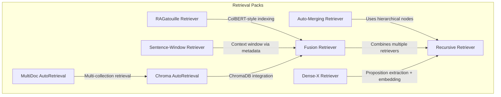
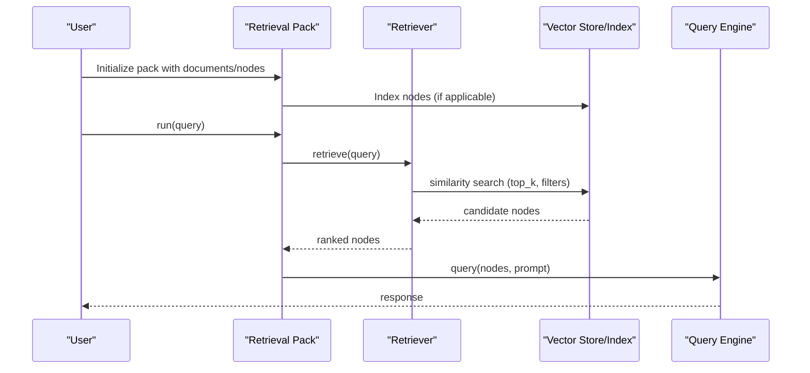
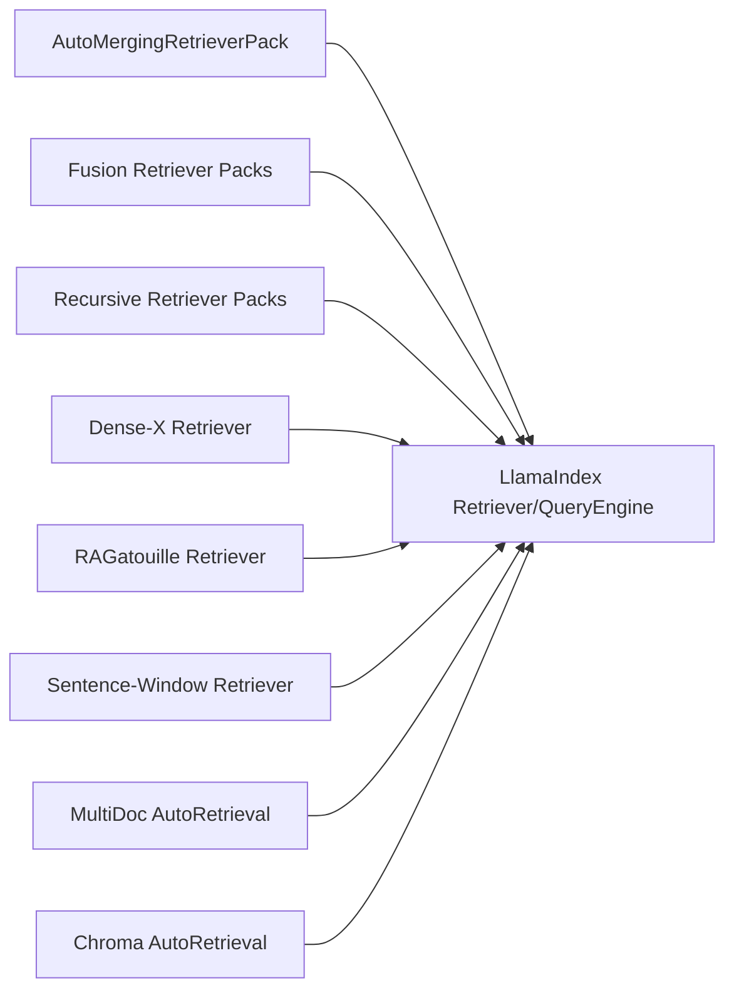

# Retrieval Packs

<cite>
**Referenced Files in This Document**
- [README.md](file://llama-index-packs/llama-index-packs-auto-merging-retriever/README.md)
- [__init__.py](file://llama-index-packs/llama-index-packs-auto-merging-retriever/llama_index/packs/auto_merging_retriever/__init__.py)
- [README.md](file://llama-index-packs/llama-index-packs-fusion-retriever/README.md)
- [__init__.py](file://llama-index-packs/llama-index-packs-fusion-retriever/llama_index/packs/fusion_retriever/__init__.py)
- [README.md](file://llama-index-packs/llama-index-packs-recursive-retriever/README.md)
- [__init__.py](file://llama-index-packs/llama-index-packs-recursive-retriever/llama_index/packs/recursive_retriever/__init__.py)
- [README.md](file://llama-index-packs/llama-index-packs-dense-x-retrieval/README.md)
- [__init__.py](file://llama-index-packs/llama-index-packs-dense-x-retrieval/llama_index/packs/dense_x_retrieval/__init__.py)
- [README.md](file://llama-index-packs/llama-index-packs-ragatouille-retriever/README.md)
- [__init__.py](file://llama-index-packs/llama-index-packs-ragatouille-retriever/llama_index/packs/ragatouille_retriever/__init__.py)
- [README.md](file://llama-index-packs/llama-index-packs-sentence-window-retriever/README.md)
- [__init__.py](file://llama-index-packs/llama-index-packs-sentence-window-retriever/llama_index/packs/sentence_window_retriever/__init__.py)
- [README.md](file://llama-index-packs/llama-index-packs-multidoc-autoretrieval/README.md)
- [__init__.py](file://llama-index-packs/llama-index-packs-multidoc-autoretrieval/llama_index/packs/multidoc_autoretrieval/__init__.py)
- [README.md](file://llama-index-packs/llama-index-packs-chroma-autoretrieval/README.md)
- [__init__.py](file://llama-index-packs/llama-index-packs-chroma-autoretrieval/llama_index/packs/chroma_autoretrieval/__init__.py)
</cite>

## Table of Contents
1. [Introduction](#introduction)
2. [Project Structure](#project-structure)
3. [Core Components](#core-components)
4. [Architecture Overview](#architecture-overview)
5. [Detailed Component Analysis](#detailed-component-analysis)
6. [Dependency Analysis](#dependency-analysis)
7. [Performance Considerations](#performance-considerations)
8. [Troubleshooting Guide](#troubleshooting-guide)
9. [Conclusion](#conclusion)
10. [Appendices](#appendices)

## Introduction
This document provides comprehensive documentation for Retrieval Packs—pre-built collections of retrieval strategies and algorithms integrated into the LlamaIndex ecosystem. It focuses on eight retrieval packs: Auto-Merging Retriever for hierarchical document processing, Fusion Retriever for combining multiple retrieval sources, Recursive Retriever for nested document structures, Dense-X Retriever for hybrid dense-sparse retrieval, RAGatouille Retriever for efficient similarity search, Sentence-Window Retriever for context preservation, MultiDoc AutoRetrieval for multi-document scenarios, and Chroma AutoRetrieval for ChromaDB integration. For each pack, we explain the underlying algorithm, configuration parameters, performance characteristics, and optimal use cases. Practical examples show pack installation, initialization with different vector stores, and deployment in production environments. Integration patterns with various vector databases, retrieval metrics, and troubleshooting common retrieval issues are included.

## Project Structure
The Retrieval Packs are organized as individual packages under the llama-index-packs directory. Each pack provides:
- A README with usage instructions, CLI commands, and code examples
- An __init__.py exporting the pack’s main class
- Optional examples and tests

**Diagram sources**
- [README.md](file://llama-index-packs/llama-index-packs-auto-merging-retriever/README.md#L1-L66)
- [README.md](file://llama-index-packs/llama-index-packs-fusion-retriever/README.md#L1-L128)
- [README.md](file://llama-index-packs/llama-index-packs-recursive-retriever/README.md#L1-L132)
- [README.md](file://llama-index-packs/llama-index-packs-dense-x-retrieval/README.md#L1-L68)
- [README.md](file://llama-index-packs/llama-index-packs-ragatouille-retriever/README.md#L1-L70)
- [README.md](file://llama-index-packs/llama-index-packs-sentence-window-retriever/README.md#L1-L69)
- [README.md](file://llama-index-packs/llama-index-packs-multidoc-autoretrieval/README.md#L1-L94)
- [README.md](file://llama-index-packs/llama-index-packs-chroma-autoretrieval/README.md#L1-L81)

**Section sources**
- [README.md](file://llama-index-packs/llama-index-packs-auto-merging-retriever/README.md#L1-L66)
- [README.md](file://llama-index-packs/llama-index-packs-fusion-retriever/README.md#L1-L128)
- [README.md](file://llama-index-packs/llama-index-packs-recursive-retriever/README.md#L1-L132)
- [README.md](file://llama-index-packs/llama-index-packs-dense-x-retrieval/README.md#L1-L68)
- [README.md](file://llama-index-packs/llama-index-packs-ragatouille-retriever/README.md#L1-L70)
- [README.md](file://llama-index-packs/llama-index-packs-sentence-window-retriever/README.md#L1-L69)
- [README.md](file://llama-index-packs/llama-index-packs-multidoc-autoretrieval/README.md#L1-L94)
- [README.md](file://llama-index-packs/llama-index-packs-chroma-autoretrieval/README.md#L1-L81)

## Core Components
Each Retrieval Pack exposes a main class exported via its __init__.py. These classes encapsulate:
- Initialization with documents/nodes and optional vector store configuration
- Retrieval execution via a retriever or query engine
- Access to internal modules (e.g., node parsers, retrievers, postprocessors)
- Optional streaming support for long-form responses

Key pack classes:
- AutoMergingRetrieverPack
- HybridFusionRetrieverPack, QueryRewritingRetrieverPack
- EmbeddedTablesUnstructuredRetrieverPack, RecursiveRetrieverSmallToBigPack
- DenseXRetrievalPack
- RAGatouilleRetrieverPack
- SentenceWindowRetrieverPack
- MultiDocAutoRetrieverPack
- ChromaAutoretrievalPack

**Section sources**
- [__init__.py](file://llama-index-packs/llama-index-packs-auto-merging-retriever/llama_index/packs/auto_merging_retriever/__init__.py#L1-L4)
- [__init__.py](file://llama-index-packs/llama-index-packs-fusion-retriever/llama_index/packs/fusion_retriever/__init__.py#L1-L9)
- [__init__.py](file://llama-index-packs/llama-index-packs-recursive-retriever/llama_index/packs/recursive_retriever/__init__.py#L1-L12)
- [__init__.py](file://llama-index-packs/llama-index-packs-dense-x-retrieval/llama_index/packs/dense_x_retrieval/__init__.py#L1-L4)
- [__init__.py](file://llama-index-packs/llama-index-packs-ragatouille-retriever/llama_index/packs/ragatouille_retriever/__init__.py#L1-L4)
- [__init__.py](file://llama-index-packs/llama-index-packs-sentence-window-retriever/llama_index/packs/sentence_window_retriever/__init__.py#L1-L4)
- [__init__.py](file://llama-index-packs/llama-index-packs-multidoc-autoretrieval/llama_index/packs/multidoc_autoretrieval/__init__.py#L1-L4)
- [__init__.py](file://llama-index-packs/llama-index-packs-chroma-autoretrieval/llama_index/packs/chroma_autoretrieval/__init__.py#L1-L4)

## Architecture Overview
The Retrieval Packs integrate with LlamaIndex’s retrieval and query engine abstractions. They typically:
- Parse documents into nodes
- Build or use a vector index
- Apply retrievers (including fusion, recursive, or auto-retrieval strategies)
- Post-process results (e.g., metadata replacement, windowing)
- Synthesize responses via a query engine

[No sources needed since this diagram shows conceptual workflow, not actual code structure]

## Detailed Component Analysis

### Auto-Merging Retriever
- Purpose: Hierarchical retrieval over nested document structures. Builds a hierarchy of parent and child nodes to enable coarse-to-fine retrieval.
- Algorithm highlights:
  - Hierarchical node graph construction
  - Aggregation of results across levels
- Configuration parameters:
  - Documents/nodes input
  - Node parsing and chunking parameters
- Performance characteristics:
  - Reduces search space progressively; improves precision at cost of latency
- Optimal use cases:
  - Long hierarchical documents (e.g., reports, books)
- Installation and usage:
  - CLI: download AutoMergingRetrieverPack
  - Code: instantiate pack with documents; use run() or access retriever/query engine
- Integration patterns:
  - Works with any vector store compatible with LlamaIndex retrievers
- Production tips:
  - Tune chunk sizes and hierarchy depth for balance of recall and latency

**Section sources**
- [README.md](file://llama-index-packs/llama-index-packs-auto-merging-retriever/README.md#L1-L66)

### Fusion Retriever
- Purpose: Combine results from multiple retrievers (e.g., vector and BM25) using fusion strategies.
- Algorithm highlights:
  - Hybrid fusion: merges vector and BM25 retrievers
  - Query rewriting fusion: expands query and merges results
- Configuration parameters:
  - vector_similarity_top_k, bm25_similarity_top_k
  - Nodes and chunk size
- Performance characteristics:
  - Improved recall; moderate overhead from multiple retrievals
- Optimal use cases:
  - Mixed-content corpora; need for lexical and semantic matching
- Installation and usage:
  - CLI: download HybridFusionRetrieverPack or QueryRewritingRetrieverPack
  - Code: initialize with nodes and top_k; use retriever or query engine
- Integration patterns:
  - Compatible with any retriever pair (vector/BM25 or single retriever with query rewrite)
- Production tips:
  - Adjust top_k per retriever to balance quality and latency

**Section sources**
- [README.md](file://llama-index-packs/llama-index-packs-fusion-retriever/README.md#L1-L128)

### Recursive Retriever
- Purpose: Nested retrieval across hierarchical nodes. Two variants:
  - Embedded tables retriever with unstructured parsing
  - Small-to-big recursive retrieval
- Algorithm highlights:
  - Builds a tree of parent/child nodes
  - Performs retrieval from small units upward
- Configuration parameters:
  - Documents/nodes input
  - Node parser settings
- Performance characteristics:
  - Strong for nested/tabular data; can be slower due to recursion
- Optimal use cases:
  - Financial filings, technical docs with nested sections
- Installation and usage:
  - CLI: download EmbeddedTablesUnstructuredRetrieverPack or RecursiveRetrieverSmallToBigPack
  - Code: initialize with documents; use retriever or query engine
- Integration patterns:
  - Works with vector stores supporting hierarchical retrieval
- Production tips:
  - Limit recursion depth and tune chunk sizes

**Section sources**
- [README.md](file://llama-index-packs/llama-index-packs-recursive-retriever/README.md#L1-L132)

### Dense-X Retriever
- Purpose: Hybrid dense-sparse retrieval using propositions extracted per node.
- Algorithm highlights:
  - Extract propositions per node via LLM
  - Embed propositions; retrieve parent chunks based on proposition similarity
- Configuration parameters:
  - Documents input
  - Streaming option
- Performance characteristics:
  - Expensive at scale due to LLM proposition extraction
- Optimal use cases:
  - Factoid-focused retrieval; when atomic facts are valuable
- Installation and usage:
  - CLI: download DenseXRetrievalPack
  - Code: initialize with documents; enable streaming for long answers
- Integration patterns:
  - Works with any vector store; proposition embedding backend choice affects performance
- Production tips:
  - Cache proposition embeddings; batch processing reduces cost

**Section sources**
- [README.md](file://llama-index-packs/llama-index-packs-dense-x-retrieval/README.md#L1-L68)

### RAGatouille Retriever
- Purpose: Efficient similarity search using ColBERT-style models via RAGatouille.
- Algorithm highlights:
  - Index corpus using ColBERT or similar models
  - Retrieve with optimized encoders
- Configuration parameters:
  - Docs list, LLM (optional), index_name, top_k
- Performance characteristics:
  - Fast inference; strong semantic matching
- Optimal use cases:
  - Large corpora requiring strong semantic recall
- Installation and usage:
  - CLI: download RAGatouilleRetrieverPack
  - Code: initialize with docs and index; use retriever or RAG module
- Integration patterns:
  - Integrates with LlamaIndex query modules for synthesis
- Production tips:
  - Pre-index static corpora; tune top_k for latency vs. accuracy

**Section sources**
- [README.md](file://llama-index-packs/llama-index-packs-ragatouille-retriever/README.md#L1-L70)

### Sentence-Window Retriever
- Purpose: Preserve context by attaching surrounding sentences to chunks during retrieval.
- Algorithm highlights:
  - Adds sentence windows to chunk metadata
  - Replaces chunk text with windowed context during synthesis
- Configuration parameters:
  - Documents input
- Performance characteristics:
  - Improves context-awareness; slightly larger vectors/text
- Optimal use cases:
  - Questions requiring local context; legal/contract texts
- Installation and usage:
  - CLI: download SentenceWindowRetrieverPack
  - Code: initialize with documents; access sentence_index, node_parser, postprocessor
- Integration patterns:
  - Works with any vector store; postprocessor ensures context injection
- Production tips:
  - Tune window size for trade-off between context and storage

**Section sources**
- [README.md](file://llama-index-packs/llama-index-packs-sentence-window-retriever/README.md#L1-L69)

### MultiDoc AutoRetrieval
- Purpose: Structured hierarchical retrieval across multiple documents using multiple vector store collections.
- Algorithm highlights:
  - Uses metadata nodes and source docs aligned by index
  - Supports metadata filtering and multi-collection retrieval
- Configuration parameters:
  - VectorStoreInfo, metadata_nodes, docs, auto_retriever_kwargs
- Performance characteristics:
  - Scales across collections; metadata filtering improves precision
- Optimal use cases:
  - Multi-domain corpora; multi-project knowledge bases
- Installation and usage:
  - CLI: download MultiDocAutoRetrieverPack
  - Code: initialize with Weaviate client, index names, and metadata info
- Integration patterns:
  - Designed for Weaviate; adaptable to other vector stores with similar metadata APIs
- Production tips:
  - Align metadata_nodes and docs lengths; monitor filter performance

**Section sources**
- [README.md](file://llama-index-packs/llama-index-packs-multidoc-autoretrieval/README.md#L1-L94)

### Chroma AutoRetrieval
- Purpose: Insert data into ChromaDB and instantiate an auto-retriever that uses the LLM at runtime to set metadata filtering, top-k, and query string.
- Algorithm highlights:
  - Auto-retriever leverages LLM to refine retrieval parameters dynamically
- Configuration parameters:
  - collection_name, vector_store_info, nodes, client
- Performance characteristics:
  - Dynamic refinement improves relevance; runtime LLM calls add latency
- Optimal use cases:
  - Dynamic, evolving corpora; exploratory retrieval scenarios
- Installation and usage:
  - CLI: download ChromaAutoretrievalPack
  - Code: initialize with Chroma client and vector store info
- Integration patterns:
  - Ephemeral or persistent Chroma clients supported
- Production tips:
  - Cache auto-retriever decisions; limit LLM calls per query

**Section sources**
- [README.md](file://llama-index-packs/llama-index-packs-chroma-autoretrieval/README.md#L1-L81)

## Dependency Analysis
Each Retrieval Pack exports a main class via its __init__.py. The packs are standalone and rely on LlamaIndex core abstractions for retrievers, indices, and query engines.

**Diagram sources**
- [__init__.py](file://llama-index-packs/llama-index-packs-auto-merging-retriever/llama_index/packs/auto_merging_retriever/__init__.py#L1-L4)
- [__init__.py](file://llama-index-packs/llama-index-packs-fusion-retriever/llama_index/packs/fusion_retriever/__init__.py#L1-L9)
- [__init__.py](file://llama-index-packs/llama-index-packs-recursive-retriever/llama_index/packs/recursive_retriever/__init__.py#L1-L12)
- [__init__.py](file://llama-index-packs/llama-index-packs-dense-x-retrieval/llama_index/packs/dense_x_retrieval/__init__.py#L1-L4)
- [__init__.py](file://llama-index-packs/llama-index-packs-ragatouille-retriever/llama_index/packs/ragatouille_retriever/__init__.py#L1-L4)
- [__init__.py](file://llama-index-packs/llama-index-packs-sentence-window-retriever/llama_index/packs/sentence_window_retriever/__init__.py#L1-L4)
- [__init__.py](file://llama-index-packs/llama-index-packs-multidoc-autoretrieval/llama_index/packs/multidoc_autoretrieval/__init__.py#L1-L4)
- [__init__.py](file://llama-index-packs/llama-index-packs-chroma-autoretrieval/llama_index/packs/chroma_autoretrieval/__init__.py#L1-L4)

**Section sources**
- [__init__.py](file://llama-index-packs/llama-index-packs-auto-merging-retriever/llama_index/packs/auto_merging_retriever/__init__.py#L1-L4)
- [__init__.py](file://llama-index-packs/llama-index-packs-fusion-retriever/llama_index/packs/fusion_retriever/__init__.py#L1-L9)
- [__init__.py](file://llama-index-packs/llama-index-packs-recursive-retriever/llama_index/packs/recursive_retriever/__init__.py#L1-L12)
- [__init__.py](file://llama-index-packs/llama-index-packs-dense-x-retrieval/llama_index/packs/dense_x_retrieval/__init__.py#L1-L4)
- [__init__.py](file://llama-index-packs/llama-index-packs-ragatouille-retriever/llama_index/packs/ragatouille_retriever/__init__.py#L1-L4)
- [__init__.py](file://llama-index-packs/llama-index-packs-sentence-window-retriever/llama_index/packs/sentence_window_retriever/__init__.py#L1-L4)
- [__init__.py](file://llama-index-packs/llama-index-packs-multidoc-autoretrieval/llama_index/packs/multidoc_autoretrieval/__init__.py#L1-L4)
- [__init__.py](file://llama-index-packs/llama-index-packs-chroma-autoretrieval/llama_index/packs/chroma_autoretrieval/__init__.py#L1-L4)

## Performance Considerations
- Latency vs. recall trade-offs vary by pack:
  - Auto-Merging and Recursive: higher precision via hierarchy at increased latency
  - Fusion: improved recall with multiple retrievers
  - Dense-X: expensive proposition extraction; cache embeddings
  - RAGatouille: fast inference; pre-index large corpora
  - Sentence-Window: slightly larger payloads; better context
  - MultiDoc AutoRetrieval: metadata filtering improves precision
  - Chroma AutoRetrieval: dynamic refinement adds runtime cost
- Scaling strategies:
  - Batch indexing
  - Caching embeddings and LLM calls
  - Tuning top_k and chunk sizes
  - Using persistent vector stores for warm caches

[No sources needed since this section provides general guidance]

## Troubleshooting Guide
Common issues and remedies:
- Initialization errors:
  - Ensure documents/nodes match metadata_nodes/docs lengths (MultiDoc AutoRetrieval)
  - Verify vector store info and metadata definitions (Chroma/MultiDoc)
- Retrieval quality:
  - Adjust top_k and similarity thresholds
  - Use fusion strategies to improve recall
  - For Dense-X, reduce LLM calls by caching proposition embeddings
- Performance bottlenecks:
  - Pre-index static corpora (RAGatouille)
  - Limit recursion depth (Recursive)
  - Tune chunk sizes (Auto-Merging, Sentence-Window)
- Vector store compatibility:
  - Confirm retriever supports the chosen vector store
  - Validate metadata filters and index schemas

**Section sources**
- [README.md](file://llama-index-packs/llama-index-packs-multidoc-autoretrieval/README.md#L57-L74)
- [README.md](file://llama-index-packs/llama-index-packs-chroma-autoretrieval/README.md#L34-L61)

## Conclusion
Retrieval Packs offer ready-to-use strategies for diverse retrieval needs. Choose Auto-Merging for hierarchical content, Fusion for robust recall, Recursive for nested structures, Dense-X for atomic facts, RAGatouille for efficient semantic search, Sentence-Window for context preservation, MultiDoc AutoRetrieval for multi-collection scenarios, and Chroma AutoRetrieval for dynamic, LLM-driven refinement. Proper configuration, caching, and tuning yield strong performance in production.

[No sources needed since this section summarizes without analyzing specific files]

## Appendices
- Installation via CLI:
  - Use llamaindex-cli download-llamapack with the pack name
- Accessing modules:
  - Instantiate pack and access retriever, query engine, or specialized components as documented in each pack’s README
- Vector store integration:
  - Configure vector_store_info and metadata_info for packs that require structured metadata
- Metrics and evaluation:
  - Track recall, precision, latency, and relevance; adjust top_k and fusion weights accordingly

[No sources needed since this section provides general guidance]