# Specialized Packs

<cite>
**Referenced Files in This Document**
- [README.md](file://llama-index-packs/llama-index-packs-code-hierarchy/README.md)
- [__init__.py](file://llama-index-packs/llama-index-packs-code-hierarchy/llama_index/packs/code_hierarchy/__init__.py)
- [README.md](file://llama-index-packs/llama-index-packs-amazon-product-extraction/README.md)
- [__init__.py](file://llama-index-packs/llama-index-packs-amazon-product-extraction/llama_index/packs/amazon_product_extraction/__init__.py)
- [README.md](file://llama-index-packs/llama-index-packs-resume-screener/README.md)
- [__init__.py](file://llama-index-packs/llama-index-packs-resume-screener/llama_index/packs/resume_screener/__init__.py)
- [README.md](file://llama-index-packs/llama-index-packs-node-parser-semantic-chunking/README.md)
- [__init__.py](file://llama-index-packs/llama-index-packs-node-parser-semantic-chunking/llama_index/packs/node_parser_semantic_chunking/__init__.py)
- [README.md](file://llama-index-packs/llama-index-packs-raptor/README.md)
- [__init__.py](file://llama-index-packs/llama-index-packs-raptor/llama_index/packs/raptor/__init__.py)
- [README.md](file://llama-index-packs/llama-index-packs-self-rag/README.md)
- [__init__.py](file://llama-index-packs/llama-index-packs-self-rag/llama_index/packs/self_rag/__init__.py)
- [README.md](file://llama-index-packs/llama-index-packs-longrag/README.md)
- [__init__.py](file://llama-index-packs/llama-index-packs-longrag/llama_index/packs/longrag/__init__.py)
- [README.md](file://llama-index-packs/llama-index-packs-self-discover/README.md)
- [__init__.py](file://llama-index-packs/llama-index-packs-self-discover/llama_index/packs/self_discover/__init__.py)
</cite>

## Table of Contents
1. [Introduction](#introduction)
2. [Project Structure](#project-structure)
3. [Core Components](#core-components)
4. [Architecture Overview](#architecture-overview)
5. [Detailed Component Analysis](#detailed-component-analysis)
6. [Dependency Analysis](#dependency-analysis)
7. [Performance Considerations](#performance-considerations)
8. [Troubleshooting Guide](#troubleshooting-guide)
9. [Conclusion](#conclusion)
10. [Appendices](#appendices)

## Introduction
This document provides comprehensive documentation for specialized packs that implement domain-specific and advanced Retrieval-Augmented Generation (RAG) capabilities. The covered packs include:
- Code hierarchy processing for software documentation
- Amazon product extraction for e-commerce data parsing
- Resume screener for HR automation
- Node parser with semantic chunking for intelligent text segmentation
- RAPTOR for recursive retrieval augmentation
- Self-RAG for autonomous RAG optimization
- LongRAG for extended context processing
- Self-Discover for automatic capability discovery

For each pack, we explain the domain-specific algorithms, preprocessing requirements, optimization strategies, practical integration examples, and deployment considerations. We also address domain-specific challenges, data quality requirements, regulatory compliance, and troubleshooting guidance.

## Project Structure
Each specialized pack resides in its own directory under llama-index-packs and exposes a public API via its __init__.py. The README files provide usage instructions, CLI commands, and high-level algorithmic descriptions. The following diagram shows the relationship between the packs and their public exports.

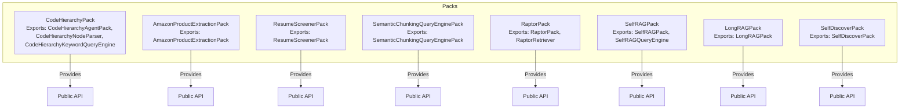

**Diagram sources**
- [__init__.py](file://llama-index-packs/llama-index-packs-code-hierarchy/llama_index/packs/code_hierarchy/__init__.py#L1-L12)
- [__init__.py](file://llama-index-packs/llama-index-packs-amazon-product-extraction/llama_index/packs/amazon_product_extraction/__init__.py#L1-L6)
- [__init__.py](file://llama-index-packs/llama-index-packs-resume-screener/llama_index/packs/resume_screener/__init__.py#L1-L4)
- [__init__.py](file://llama-index-packs/llama-index-packs-node-parser-semantic-chunking/llama_index/packs/node_parser_semantic_chunking/__init__.py#L1-L6)
- [__init__.py](file://llama-index-packs/llama-index-packs-raptor/llama_index/packs/raptor/__init__.py#L1-L5)
- [__init__.py](file://llama-index-packs/llama-index-packs-self-rag/llama_index/packs/self_rag/__init__.py#L1-L5)
- [__init__.py](file://llama-index-packs/llama-index-packs-longrag/llama_index/packs/longrag/__init__.py#L1-L5)
- [__init__.py](file://llama-index-packs/llama-index-packs-self-discover/llama_index/packs/self_discover/__init__.py#L1-L4)

**Section sources**
- [README.md](file://llama-index-packs/llama-index-packs-code-hierarchy/README.md#L1-L140)
- [README.md](file://llama-index-packs/llama-index-packs-amazon-product-extraction/README.md#L1-L60)
- [README.md](file://llama-index-packs/llama-index-packs-resume-screener/README.md#L1-L72)
- [README.md](file://llama-index-packs/llama-index-packs-node-parser-semantic-chunking/README.md#L1-L29)
- [README.md](file://llama-index-packs/llama-index-packs-raptor/README.md#L1-L106)
- [README.md](file://llama-index-packs/llama-index-packs-self-rag/README.md#L1-L67)
- [README.md](file://llama-index-packs/llama-index-packs-longrag/README.md#L1-L32)
- [README.md](file://llama-index-packs/llama-index-packs-self-discover/README.md#L1-L64)

## Core Components
This section summarizes the primary components and responsibilities of each specialized pack.

- CodeHierarchyAgentPack
  - Purpose: Split long code files into hierarchical chunks and expose navigation via a keyword query engine and optional agent tool.
  - Key APIs: CodeHierarchyAgentPack, CodeHierarchyNodeParser, CodeHierarchyKeywordQueryEngine.
  - Domain: Software documentation and codebase exploration.
  - Preprocessing: Parse code into scope-based nodes; maintain parent-child relationships; skeletonize bodies with comments.
  - Optimization: Tune chunk sizes and indentation handling; support for multiple programming languages.

- AmazonProductExtractionPack
  - Purpose: Extract structured product information from e-commerce pages using multimodal LLMs and prompt engineering.
  - Key APIs: AmazonProductExtractionPack.
  - Domain: E-commerce product data parsing.
  - Preprocessing: Load web page URL, capture screenshot, pass to multimodal LLM.
  - Optimization: Use appropriate vision-language model and prompt templates; cache screenshots and structured outputs.

- ResumeScreenerPack
  - Purpose: Screen resumes against job descriptions and predefined criteria using LLMs.
  - Key APIs: ResumeScreenerPack.
  - Domain: Human Resources automation.
  - Preprocessing: Load resume file; parse job description and screening criteria.
  - Optimization: Align LLM temperature and prompt structure with fairness and repeatability goals.

- SemanticChunkingQueryEnginePack
  - Purpose: Segment text using semantic similarity thresholds derived from sentence embeddings.
  - Key APIs: SemanticChunkingQueryEnginePack.
  - Domain: Intelligent text segmentation for improved retrieval.
  - Preprocessing: Sentence segmentation; compute embeddings; calculate pairwise cosine distances; set threshold via percentile.
  - Optimization: Adjust embedding model and distance threshold; batch processing for large corpora.

- RaptorPack
  - Purpose: Recursively cluster and summarize content across layers to improve retrieval.
  - Key APIs: RaptorPack, RaptorRetriever.
  - Domain: Long-context and hierarchical retrieval.
  - Preprocessing: Embedding-based clustering; hierarchical summarization.
  - Optimization: Configure summary module (prompt, workers); choose retrieval mode (tree traversal vs collapsed).

- SelfRAGPack
  - Purpose: Combine retrieval with self-reflection to improve response quality and factuality.
  - Key APIs: SelfRAGPack, SelfRAGQueryEngine.
  - Domain: Autonomous RAG optimization.
  - Preprocessing: Prepare retriever and model; optionally use local GGUF models.
  - Optimization: Tune reflection prompts and model parameters; manage resource constraints.

- LongRAGPack
  - Purpose: Retrieve large contiguous units (~6k tokens) to preserve semantic integrity for long-context models.
  - Key APIs: LongRAGPack.
  - Domain: Extended context processing.
  - Preprocessing: Load data directory; prepare retriever and LLM with long context.
  - Optimization: Choose appropriate LLM and chunk sizes; limit top-k to small number of units.

- SelfDiscoverPack
  - Purpose: Automatically select, adapt, and implement reasoning modules for a given task.
  - Key APIs: SelfDiscoverPack.
  - Domain: Automatic capability discovery and reasoning composition.
  - Preprocessing: Define task and reasoning modules; run stage-1 selection/adaptation; execute stage-2.
  - Optimization: Calibrate module selection and adaptation prompts; validate reasoning structure.

**Section sources**
- [README.md](file://llama-index-packs/llama-index-packs-code-hierarchy/README.md#L1-L140)
- [README.md](file://llama-index-packs/llama-index-packs-amazon-product-extraction/README.md#L1-L60)
- [README.md](file://llama-index-packs/llama-index-packs-resume-screener/README.md#L1-L72)
- [README.md](file://llama-index-packs/llama-index-packs-node-parser-semantic-chunking/README.md#L1-L29)
- [README.md](file://llama-index-packs/llama-index-packs-raptor/README.md#L1-L106)
- [README.md](file://llama-index-packs/llama-index-packs-self-rag/README.md#L1-L67)
- [README.md](file://llama-index-packs/llama-index-packs-longrag/README.md#L1-L32)
- [README.md](file://llama-index-packs/llama-index-packs-self-discover/README.md#L1-L64)

## Architecture Overview
The following diagram illustrates how each specialized pack integrates with LlamaIndex components and external systems.

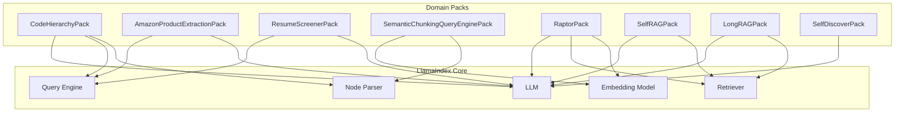

**Diagram sources**
- [README.md](file://llama-index-packs/llama-index-packs-code-hierarchy/README.md#L1-L140)
- [README.md](file://llama-index-packs/llama-index-packs-amazon-product-extraction/README.md#L1-L60)
- [README.md](file://llama-index-packs/llama-index-packs-resume-screener/README.md#L1-L72)
- [README.md](file://llama-index-packs/llama-index-packs-node-parser-semantic-chunking/README.md#L1-L29)
- [README.md](file://llama-index-packs/llama-index-packs-raptor/README.md#L1-L106)
- [README.md](file://llama-index-packs/llama-index-packs-self-rag/README.md#L1-L67)
- [README.md](file://llama-index-packs/llama-index-packs-longrag/README.md#L1-L32)
- [README.md](file://llama-index-packs/llama-index-packs-self-discover/README.md#L1-L64)

## Detailed Component Analysis

### CodeHierarchyAgentPack
- Domain-specific algorithms
  - Scope-aware splitting: Splits code into function/class/method scopes.
  - Hierarchical skeletonization: Replaces bodies with concise comments linking to child nodes.
  - Keyword query engine: Provides navigable repo maps for targeted lookup.
- Preprocessing requirements
  - Language identification and tokenizer support.
  - Indentation-sensitive parsing; comment handling.
- Optimization strategies
  - Tune chunk_lines and max_chars to fit context windows.
  - Extend supported languages by updating signature identifiers and testing edge cases.
- Practical integration
  - Use CodeHierarchyNodeParser to generate nodes from source files.
  - Wrap nodes with CodeHierarchyAgentPack or CodeHierarchyKeywordQueryEngine for querying.
- Industry applications
  - Developer onboarding, codebase exploration, automated documentation generation.
- Deployment considerations
  - Ensure consistent language support across environments.
  - Cache parsed hierarchies for repeated queries.

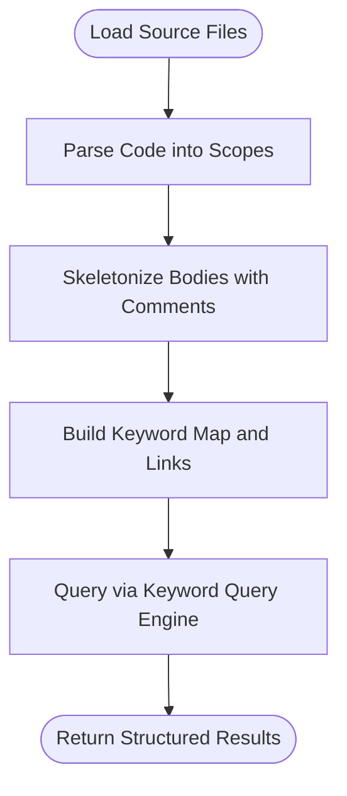

**Diagram sources**
- [README.md](file://llama-index-packs/llama-index-packs-code-hierarchy/README.md#L51-L84)

**Section sources**
- [README.md](file://llama-index-packs/llama-index-packs-code-hierarchy/README.md#L1-L140)
- [__init__.py](file://llama-index-packs/llama-index-packs-code-hierarchy/llama_index/packs/code_hierarchy/__init__.py#L1-L12)

### AmazonProductExtractionPack
- Domain-specific algorithms
  - Multimodal extraction: Uses a vision-language model to interpret screenshots of product pages.
  - Prompt engineering: Guides extraction into structured JSON.
- Preprocessing requirements
  - Web scraping or URL input; screenshot capture; multimodal LLM input preparation.
- Optimization strategies
  - Choose a capable VLM; refine prompts for robustness; cache extracted JSON.
- Practical integration
  - Download pack via CLI or programmatically; instantiate pack with data loader; run extraction.
- Industry applications
  - Price monitoring, inventory tracking, product comparison.
- Deployment considerations
  - Respect rate limits of external providers; ensure secure handling of screenshots.

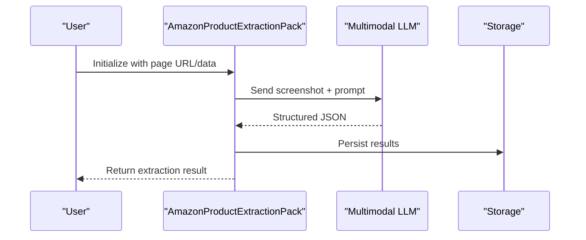

**Diagram sources**
- [README.md](file://llama-index-packs/llama-index-packs-amazon-product-extraction/README.md#L1-L60)

**Section sources**
- [README.md](file://llama-index-packs/llama-index-packs-amazon-product-extraction/README.md#L1-L60)
- [__init__.py](file://llama-index-packs/llama-index-packs-amazon-product-extraction/llama_index/packs/amazon_product_extraction/__init__.py#L1-L6)

### ResumeScreenerPack
- Domain-specific algorithms
  - Comparative scoring: Evaluate candidate against explicit criteria.
  - Aggregate decisions: Produce per-criterion decisions and an overall recommendation.
- Preprocessing requirements
  - Resume ingestion (PDF/DOCX/Text).
  - Job description and criteria definition.
- Optimization strategies
  - Align prompts with fairness and legal compliance; adjust LLM temperature for consistency.
- Practical integration
  - Instantiate with job description and criteria; run on resume path; interpret Pydantic response.
- Industry applications
  - ATS enhancement, initial candidate filtering.
- Deployment considerations
  - Data privacy and consent; audit logs of decisions.

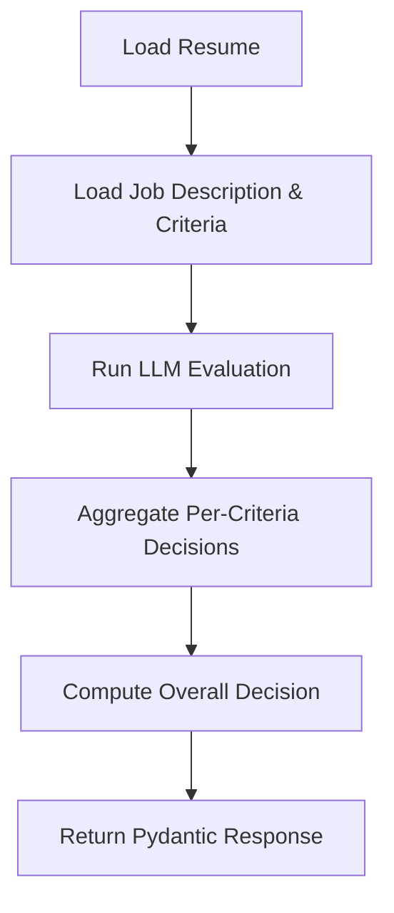

**Diagram sources**
- [README.md](file://llama-index-packs/llama-index-packs-resume-screener/README.md#L45-L71)

**Section sources**
- [README.md](file://llama-index-packs/llama-index-packs-resume-screener/README.md#L1-L72)
- [__init__.py](file://llama-index-packs/llama-index-packs-resume-screener/llama_index/packs/resume_screener/__init__.py#L1-L4)

### Node Parser with Semantic Chunking
- Domain-specific algorithms
  - Sentence segmentation followed by embedding generation.
  - Pairwise cosine distance calculation; threshold selection via percentile.
  - Chunk creation when distance exceeds threshold.
- Preprocessing requirements
  - Clean text; sentence boundary detection; embedding computation.
- Optimization strategies
  - Tune embedding model; adjust percentile threshold; batch embedding calls.
- Practical integration
  - Use pack to import the query engine; ensure skip_load when loading multiple files.
- Industry applications
  - Legal, compliance, and knowledge bases requiring coherent segments.
- Deployment considerations
  - Manage embedding costs; cache embeddings for repeated runs.

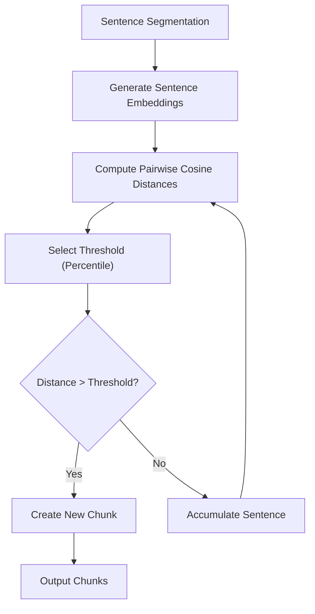

**Diagram sources**
- [README.md](file://llama-index-packs/llama-index-packs-node-parser-semantic-chunking/README.md#L5-L11)

**Section sources**
- [README.md](file://llama-index-packs/llama-index-packs-node-parser-semantic-chunking/README.md#L1-L29)
- [__init__.py](file://llama-index-packs/llama-index-packs-node-parser-semantic-chunking/llama_index/packs/node_parser_semantic_chunking/__init__.py#L1-L6)

### RaptorPack
- Domain-specific algorithms
  - Recursive clustering and summarization across layers.
  - Two retrieval modes: tree traversal and collapsed.
- Preprocessing requirements
  - Documents; embedding model; LLM for summaries.
- Optimization strategies
  - Configure summary prompt and worker concurrency; persist vector store for reuse.
- Practical integration
  - Initialize with documents, LLM, and embedding model; choose retrieval mode; retrieve nodes.
- Industry applications
  - Long-form content retrieval, hierarchical knowledge bases.
- Deployment considerations
  - Vector store persistence; rate limits for LLMs during summarization.

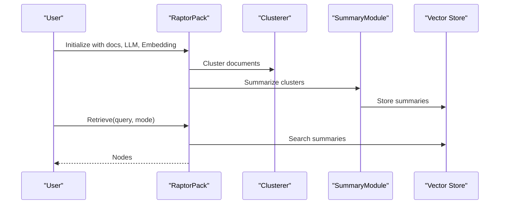

**Diagram sources**
- [README.md](file://llama-index-packs/llama-index-packs-raptor/README.md#L7-L12)
- [README.md](file://llama-index-packs/llama-index-packs-raptor/README.md#L80-L105)

**Section sources**
- [README.md](file://llama-index-packs/llama-index-packs-raptor/README.md#L1-L106)
- [__init__.py](file://llama-index-packs/llama-index-packs-raptor/llama_index/packs/raptor/__init__.py#L1-L5)

### SelfRAGPack
- Domain-specific algorithms
  - Self-reflective retrieval: Use a dedicated model to decide whether to retrieve and how to refine queries.
- Preprocessing requirements
  - Local GGUF model; retriever setup; optional verbose logging.
- Optimization strategies
  - Tune reflection prompts; manage model resources; align with provider quotas.
- Practical integration
  - Download pack; instantiate SelfRAGQueryEngine or SelfRAGPack; query with verbose output.
- Industry applications
  - Fact-checking, reliable QA, and controlled response generation.
- Deployment considerations
  - Local model hosting; API limits for external providers.

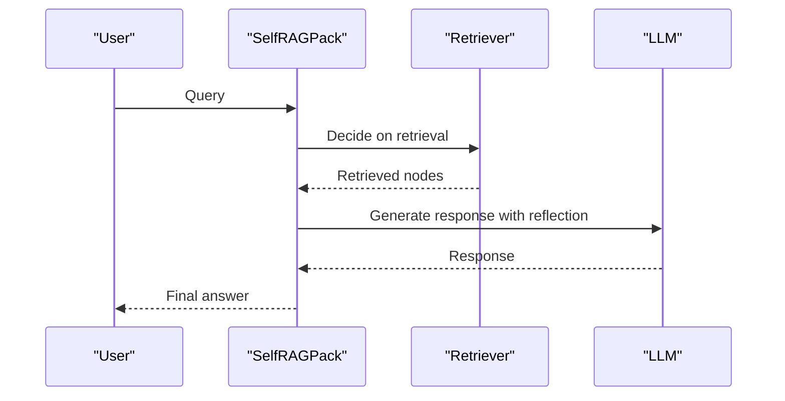

**Diagram sources**
- [README.md](file://llama-index-packs/llama-index-packs-self-rag/README.md#L1-L67)

**Section sources**
- [README.md](file://llama-index-packs/llama-index-packs-self-rag/README.md#L1-L67)
- [__init__.py](file://llama-index-packs/llama-index-packs-self-rag/llama_index/packs/self_rag/__init__.py#L1-L5)

### LongRAGPack
- Domain-specific algorithms
  - Large-unit retrieval (~6k tokens) to preserve semantic integrity.
  - Use top-k small number of units with long-context LLMs.
- Preprocessing requirements
  - Data directory; long-context LLM; retriever configuration.
- Optimization strategies
  - Limit top-k; choose appropriate LLM; tune chunk sizes.
- Practical integration
  - Set LLM globally; instantiate pack with data directory; run query.
- Industry applications
  - Policy documents, contracts, research synthesis.
- Deployment considerations
  - Monitor token budgets; optimize chunk sizes.

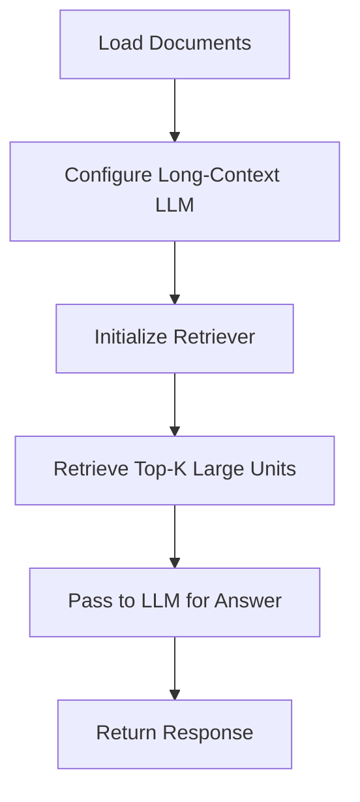

**Diagram sources**
- [README.md](file://llama-index-packs/llama-index-packs-longrag/README.md#L3-L5)
- [README.md](file://llama-index-packs/llama-index-packs-longrag/README.md#L17-L31)

**Section sources**
- [README.md](file://llama-index-packs/llama-index-packs-longrag/README.md#L1-L32)
- [__init__.py](file://llama-index-packs/llama-index-packs-longrag/llama_index/packs/longrag/__init__.py#L1-L5)

### SelfDiscoverPack
- Domain-specific algorithms
  - Stage-1: SELECT, ADAPT, IMPLEMENT reasoning modules.
  - Stage-2: Execute the composed reasoning structure to answer tasks.
- Preprocessing requirements
  - Task definition; available reasoning modules; verbose logging.
- Optimization strategies
  - Calibrate selection/adaptation prompts; validate reasoning structure.
- Practical integration
  - Download pack or instantiate directly; run with a task string.
- Industry applications
  - Complex problem solving, multi-step reasoning tasks.
- Deployment considerations
  - Prompt stability; module availability; cost control.

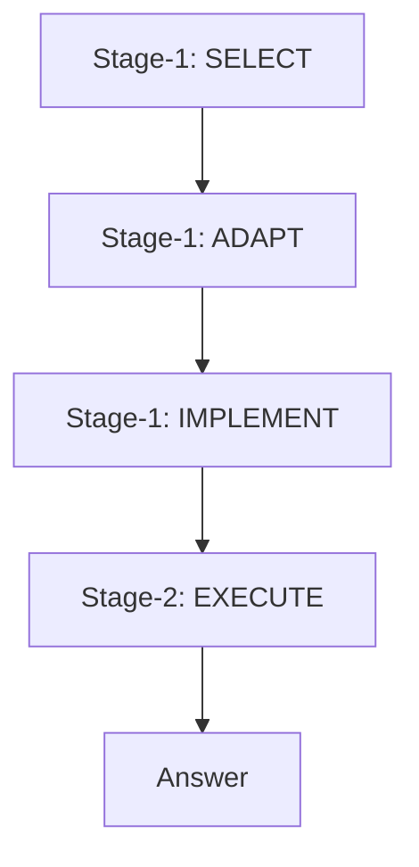

**Diagram sources**
- [README.md](file://llama-index-packs/llama-index-packs-self-discover/README.md#L5-L15)

**Section sources**
- [README.md](file://llama-index-packs/llama-index-packs-self-discover/README.md#L1-L64)
- [__init__.py](file://llama-index-packs/llama-index-packs-self-discover/llama_index/packs/self_discover/__init__.py#L1-L4)

## Dependency Analysis
The specialized packs primarily depend on LlamaIndex core components (LLM, embedding models, retrievers, query engines, and node parsers). The following diagram shows typical dependencies.

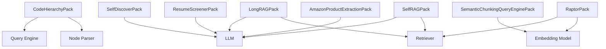

**Diagram sources**
- [README.md](file://llama-index-packs/llama-index-packs-code-hierarchy/README.md#L1-L140)
- [README.md](file://llama-index-packs/llama-index-packs-amazon-product-extraction/README.md#L1-L60)
- [README.md](file://llama-index-packs/llama-index-packs-resume-screener/README.md#L1-L72)
- [README.md](file://llama-index-packs/llama-index-packs-node-parser-semantic-chunking/README.md#L1-L29)
- [README.md](file://llama-index-packs/llama-index-packs-raptor/README.md#L1-L106)
- [README.md](file://llama-index-packs/llama-index-packs-self-rag/README.md#L1-L67)
- [README.md](file://llama-index-packs/llama-index-packs-longrag/README.md#L1-L32)
- [README.md](file://llama-index-packs/llama-index-packs-self-discover/README.md#L1-L64)

**Section sources**
- [README.md](file://llama-index-packs/llama-index-packs-code-hierarchy/README.md#L1-L140)
- [README.md](file://llama-index-packs/llama-index-packs-amazon-product-extraction/README.md#L1-L60)
- [README.md](file://llama-index-packs/llama-index-packs-resume-screener/README.md#L1-L72)
- [README.md](file://llama-index-packs/llama-index-packs-node-parser-semantic-chunking/README.md#L1-L29)
- [README.md](file://llama-index-packs/llama-index-packs-raptor/README.md#L1-L106)
- [README.md](file://llama-index-packs/llama-index-packs-self-rag/README.md#L1-L67)
- [README.md](file://llama-index-packs/llama-index-packs-longrag/README.md#L1-L32)
- [README.md](file://llama-index-packs/llama-index-packs-self-discover/README.md#L1-L64)

## Performance Considerations
- Embedding and LLM costs
  - Batch embedding operations; cache embeddings; monitor provider quotas.
- Retrieval efficiency
  - Reduce top-k; use efficient vector stores; pre-cluster when possible.
- Model inference
  - Tune model parameters; leverage local models where feasible; manage concurrency.
- Data throughput
  - Optimize chunk sizes; minimize preprocessing overhead; stream large files.

[No sources needed since this section provides general guidance]

## Troubleshooting Guide
- CodeHierarchyPack
  - Issue: Unsupported language.
  - Resolution: Extend signature identifiers and test with edge cases; use provided debugging tip.
- AmazonProductExtractionPack
  - Issue: Vision model errors or slow responses.
  - Resolution: Verify provider credentials; adjust prompts; cache outputs.
- ResumeScreenerPack
  - Issue: Inconsistent decisions.
  - Resolution: Align prompts with fairness; reduce randomness by lowering temperature.
- SemanticChunkingQueryEnginePack
  - Issue: Poor chunk boundaries.
  - Resolution: Adjust percentile threshold; switch embedding model; validate sentence segmentation.
- RaptorPack
  - Issue: Slow summarization.
  - Resolution: Increase worker count cautiously; tune summary prompt; persist vector store.
- SelfRAGPack
  - Issue: Resource exhaustion.
  - Resolution: Use local GGUF model; limit concurrent requests; monitor provider limits.
- LongRAGPack
  - Issue: Token limit exceeded.
  - Resolution: Reduce chunk sizes; increase top-k sparingly; choose smaller LLMs.
- SelfDiscoverPack
  - Issue: Ineffective reasoning structure.
  - Resolution: Refine selection/adaptation prompts; validate module compatibility.

**Section sources**
- [README.md](file://llama-index-packs/llama-index-packs-code-hierarchy/README.md#L113-L124)
- [README.md](file://llama-index-packs/llama-index-packs-amazon-product-extraction/README.md#L1-L60)
- [README.md](file://llama-index-packs/llama-index-packs-resume-screener/README.md#L1-L72)
- [README.md](file://llama-index-packs/llama-index-packs-node-parser-semantic-chunking/README.md#L1-L29)
- [README.md](file://llama-index-packs/llama-index-packs-raptor/README.md#L80-L105)
- [README.md](file://llama-index-packs/llama-index-packs-self-rag/README.md#L20-L28)
- [README.md](file://llama-index-packs/llama-index-packs-longrag/README.md#L1-L32)
- [README.md](file://llama-index-packs/llama-index-packs-self-discover/README.md#L1-L64)

## Conclusion
These specialized packs enable advanced RAG workflows tailored to specific domains. By understanding their algorithms, preprocessing steps, and optimization strategies, teams can integrate them effectively into production systems. Careful attention to data quality, performance, and compliance ensures reliable outcomes across software documentation, e-commerce, HR automation, intelligent segmentation, recursive retrieval, autonomous optimization, extended contexts, and automatic reasoning discovery.

[No sources needed since this section summarizes without analyzing specific files]

## Appendices
- Installation and CLI usage are documented in each pack’s README with downloadable examples.
- For detailed notebooks and end-to-end examples, refer to the linked notebooks in each README.

[No sources needed since this section provides general guidance]