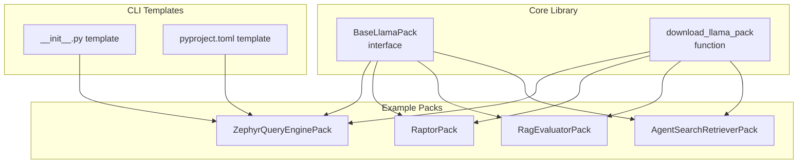
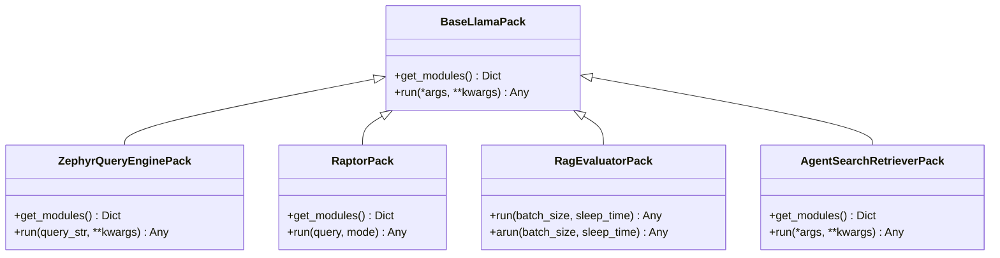
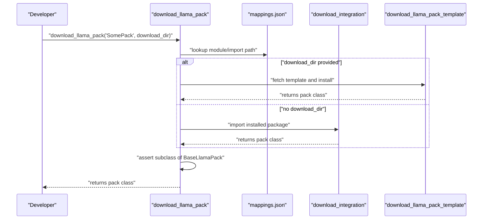
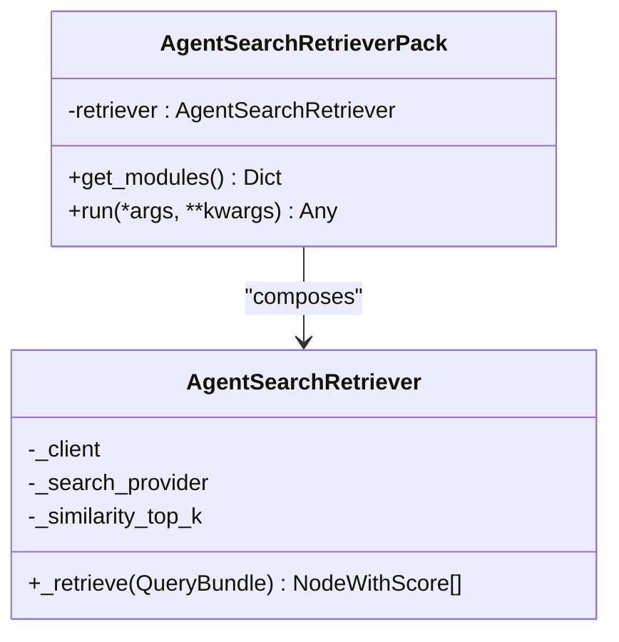
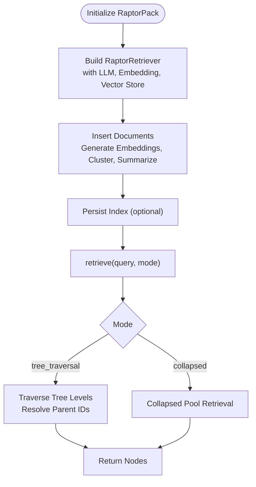
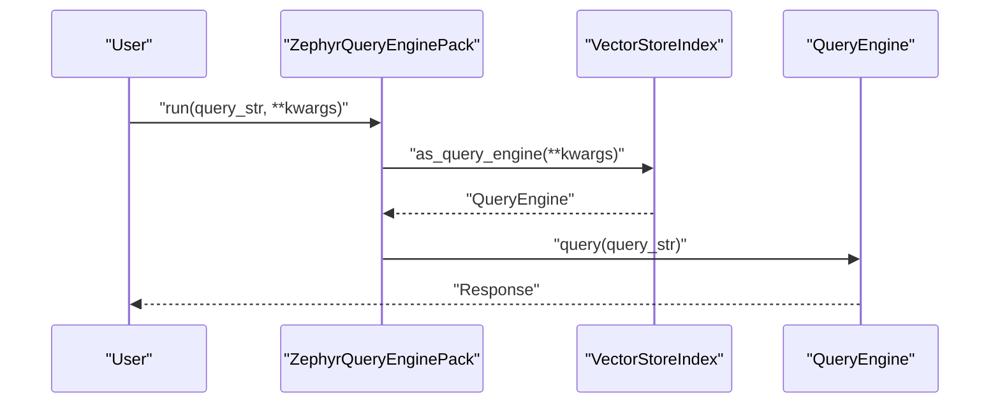
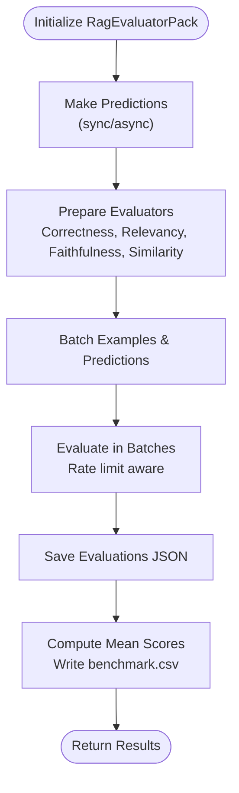
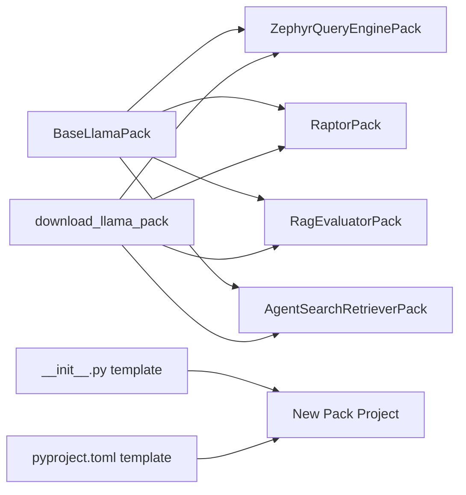

# Custom Pack Development

<cite>
**Referenced Files in This Document**
- [README.md](file://llama-index-packs/README.md)
- [base.py](file://llama-index-core/llama_index/core/llama_pack/base.py)
- [__init__.py](file://llama-index-core/llama_index/core/llama_pack/__init__.py)
- [download.py](file://llama-index-core/llama_index/core/llama_pack/download.py)
- [base.py](file://llama-index-packs/llama-index-packs-zephyr-query-engine/llama_index/packs/zephyr_query_engine/base.py)
- [base.py](file://llama-index-packs/llama-index-packs-raptor/llama_index/packs/raptor/base.py)
- [base.py](file://llama-index-packs/llama-index-packs-rag-evaluator/llama_index/packs/rag_evaluator/base.py)
- [base.py](file://llama-index-packs/llama-index-packs-agent-search-retriever/llama_index/packs/agent_search_retriever/base.py)
- [init.py](file://llama-index-cli/llama_index/cli/new_package/templates/init.py)
- [pyproject.py](file://llama-index-cli/llama_index/cli/new_package/templates/pyproject.py)
- [test_packs_llama_dataset_metadata.py](file://llama-index-packs/llama-index-packs-llama-dataset-metadata/tests/test_packs_llama_dataset_metadata.py)
</cite>

## Table of Contents
1. [Introduction](#introduction)
2. [Project Structure](#project-structure)
3. [Core Components](#core-components)
4. [Architecture Overview](#architecture-overview)
5. [Detailed Component Analysis](#detailed-component-analysis)
6. [Dependency Analysis](#dependency-analysis)
7. [Performance Considerations](#performance-considerations)
8. [Troubleshooting Guide](#troubleshooting-guide)
9. [Conclusion](#conclusion)
10. [Appendices](#appendices)

## Introduction
This guide explains how to build custom LlamaIndex Packs—self-contained modules that extend the LlamaIndex ecosystem with reusable functionality. It covers the pack development lifecycle from concept to deployment, pack structure and metadata, the base pack class architecture, composition techniques, and practical step-by-step recipes for Retrieval Packs, Agent Packs, Evaluation Packs, and specialized domain packs. It also includes testing, documentation, packaging, distribution via PyPI, version management, templates, best practices, debugging, and performance optimization.

## Project Structure
LlamaIndex provides:
- A core pack interface and downloader in the core library
- Example packs under the packs workspace
- CLI templates to scaffold new packs

Key locations:
- Core pack interface and downloader: llama-index-core/llama_index/core/llama_pack
- Example packs: llama-index-packs/<pack-name>
- CLI templates for scaffolding: llama-index-cli/llama_index/cli/new_package/templates

**Diagram sources**
- [base.py](file://llama-index-core/llama_index/core/llama_pack/base.py#L7-L14)
- [download.py](file://llama-index-core/llama_index/core/llama_pack/download.py#L14-L74)
- [base.py](file://llama-index-packs/llama-index-packs-zephyr-query-engine/llama_index/packs/zephyr_query_engine/base.py#L12-L90)
- [base.py](file://llama-index-packs/llama-index-packs-raptor/llama_index/packs/raptor/base.py#L349-L387)
- [base.py](file://llama-index-packs/llama-index-packs-rag-evaluator/llama_index/packs/rag_evaluator/base.py#L33-L461)
- [base.py](file://llama-index-packs/llama-index-packs-agent-search-retriever/llama_index/packs/agent_search_retriever/base.py#L68-L94)
- [init.py](file://llama-index-cli/llama_index/cli/new_package/templates/init.py#L1-L11)
- [pyproject.py](file://llama-index-cli/llama_index/cli/new_package/templates/pyproject.py#L26-L57)

**Section sources**
- [README.md](file://llama-index-packs/README.md#L1-L33)
- [base.py](file://llama-index-core/llama_index/core/llama_pack/base.py#L7-L14)
- [download.py](file://llama-index-core/llama_index/core/llama_pack/download.py#L14-L74)

## Core Components
- BaseLlamaPack: Defines the contract with two required methods:
  - get_modules(): returns a dictionary of modules/components exposed by the pack
  - run(...): executes the pack’s primary workflow and returns a result
- download_llama_pack(): Downloads and installs a pack package or a template into a directory, validates it inherits from BaseLlamaPack, and returns the class type.

Typical pack composition involves assembling LlamaIndex components (LLMs, indices, retrievers, query engines, evaluators) and exposing them via get_modules(), then orchestrating execution in run().

**Section sources**
- [base.py](file://llama-index-core/llama_index/core/llama_pack/base.py#L7-L14)
- [__init__.py](file://llama-index-core/llama_index/core/llama_pack/__init__.py#L3-L9)
- [download.py](file://llama-index-core/llama_index/core/llama_pack/download.py#L14-L74)

## Architecture Overview
The pack architecture centers on a simple, consistent interface. Concrete packs inherit from BaseLlamaPack, assemble internal components, and expose them through get_modules(). The downloader supports installing published packs or templating locally for customization.

**Diagram sources**
- [base.py](file://llama-index-core/llama_index/core/llama_pack/base.py#L7-L14)
- [base.py](file://llama-index-packs/llama-index-packs-zephyr-query-engine/llama_index/packs/zephyr_query_engine/base.py#L12-L90)
- [base.py](file://llama-index-packs/llama-index-packs-raptor/llama_index/packs/raptor/base.py#L349-L387)
- [base.py](file://llama-index-packs/llama-index-packs-rag-evaluator/llama_index/packs/rag_evaluator/base.py#L33-L461)
- [base.py](file://llama-index-packs/llama-index-packs-agent-search-retriever/llama_index/packs/agent_search_retriever/base.py#L68-L94)

## Detailed Component Analysis

### BaseLlamaPack and Download Workflow
- BaseLlamaPack defines the interface that all packs must implement.
- download_llama_pack resolves the target pack class, locates the correct package, and either imports it or downloads a template into a directory. It enforces that the returned class is a subclass of BaseLlamaPack.

**Diagram sources**
- [download.py](file://llama-index-core/llama_index/core/llama_pack/download.py#L14-L74)

**Section sources**
- [base.py](file://llama-index-core/llama_index/core/llama_pack/base.py#L7-L14)
- [download.py](file://llama-index-core/llama_index/core/llama_pack/download.py#L14-L74)

### Retrieval Pack: AgentSearchRetrieverPack
- Purpose: Wraps an external search provider into a retriever pack.
- Composition:
  - Internal retriever class implements retrieval against an external API
  - Pack class composes the retriever and exposes it via get_modules()
  - run delegates to the retriever’s retrieve method
- Best practices:
  - Validate external dependencies in __init__
  - Normalize results into NodeWithScore for interoperability
  - Expose configuration knobs (e.g., top_k, provider)

**Diagram sources**
- [base.py](file://llama-index-packs/llama-index-packs-agent-search-retriever/llama_index/packs/agent_search_retriever/base.py#L15-L94)

**Section sources**
- [base.py](file://llama-index-packs/llama-index-packs-agent-search-retriever/llama_index/packs/agent_search_retriever/base.py#L15-L94)

### Retrieval Pack: RaptorPack
- Purpose: Implements hierarchical retrieval with clustering and summarization.
- Composition:
  - SummaryModule builds a response synthesizer for generating summaries
  - RaptorRetriever encapsulates clustering, summarization, and retrieval modes
  - RaptorPack composes the retriever and exposes it
- Advanced patterns:
  - Async orchestration for embedding generation and summarization
  - Metadata filtering to traverse the abstraction tree
  - Persistence and loading from persisted directories

**Diagram sources**
- [base.py](file://llama-index-packs/llama-index-packs-raptor/llama_index/packs/raptor/base.py#L107-L346)

**Section sources**
- [base.py](file://llama-index-packs/llama-index-packs-raptor/llama_index/packs/raptor/base.py#L349-L387)

### Query Engine Pack: ZephyrQueryEnginePack
- Purpose: Provides a ready-to-use query engine backed by a quantized LLM and a vector index.
- Composition:
  - Builds an LLM with quantization fallback
  - Sets global tokenizer and LLM/embedding settings
  - Creates a VectorStoreIndex from documents
  - Exposes llm and index via get_modules()
  - run constructs a query engine and executes queries

**Diagram sources**
- [base.py](file://llama-index-packs/llama-index-packs-zephyr-query-engine/llama_index/packs/zephyr_query_engine/base.py#L83-L90)

**Section sources**
- [base.py](file://llama-index-packs/llama-index-packs-zephyr-query-engine/llama_index/packs/zephyr_query_engine/base.py#L12-L90)

### Evaluation Pack: RagEvaluatorPack
- Purpose: Evaluates a BaseQueryEngine against a BaseLlamaDataset using multiple evaluators.
- Composition:
  - Stores query engine, dataset, judge LLM, and embedding model
  - Generates predictions (sync/async) and evaluates them in batches
  - Saves raw evaluation JSON and produces a benchmark CSV
  - Handles rate limits and partial progress
- Patterns:
  - Async evaluation with batching and semaphore control
  - Structured logging and persistence of intermediate artifacts

**Diagram sources**
- [base.py](file://llama-index-packs/llama-index-packs-rag-evaluator/llama_index/packs/rag_evaluator/base.py#L82-L461)

**Section sources**
- [base.py](file://llama-index-packs/llama-index-packs-rag-evaluator/llama_index/packs/rag_evaluator/base.py#L33-L461)

## Dependency Analysis
- BaseLlamaPack is the core interface; all packs must implement it.
- download_llama_pack depends on mappings to resolve module names and supports both installed packages and template downloads.
- Example packs depend on LlamaIndex core components (indices, retrievers, LLMs, embeddings, evaluation utilities).
- CLI templates define a standard project layout and dev dependencies for new packs.

**Diagram sources**
- [base.py](file://llama-index-core/llama_index/core/llama_pack/base.py#L7-L14)
- [download.py](file://llama-index-core/llama_index/core/llama_pack/download.py#L14-L74)
- [base.py](file://llama-index-packs/llama-index-packs-zephyr-query-engine/llama_index/packs/zephyr_query_engine/base.py#L12-L90)
- [base.py](file://llama-index-packs/llama-index-packs-raptor/llama_index/packs/raptor/base.py#L349-L387)
- [base.py](file://llama-index-packs/llama-index-packs-rag-evaluator/llama_index/packs/rag_evaluator/base.py#L33-L461)
- [base.py](file://llama-index-packs/llama-index-packs-agent-search-retriever/llama_index/packs/agent_search_retriever/base.py#L68-L94)
- [init.py](file://llama-index-cli/llama_index/cli/new_package/templates/init.py#L1-L11)
- [pyproject.py](file://llama-index-cli/llama_index/cli/new_package/templates/pyproject.py#L26-L57)

**Section sources**
- [base.py](file://llama-index-core/llama_index/core/llama_pack/base.py#L7-L14)
- [download.py](file://llama-index-core/llama_index/core/llama_pack/download.py#L14-L74)
- [init.py](file://llama-index-cli/llama_index/cli/new_package/templates/init.py#L1-L11)
- [pyproject.py](file://llama-index-cli/llama_index/cli/new_package/templates/pyproject.py#L26-L57)

## Performance Considerations
- Asynchronous evaluation and retrieval: Prefer async APIs where available (e.g., RaptorPack, RagEvaluatorPack) to improve throughput.
- Batching and rate limiting: Use batched evaluation and backoff strategies to avoid rate limits (see RagEvaluatorPack).
- Quantization and device mapping: Use quantization and device_map to reduce memory footprint (see ZephyrQueryEnginePack).
- Metadata filtering and tree traversal: Limit retrieval scope using metadata filters and choose collapsed vs tree traversal modes based on workload (see RaptorPack).
- Token counting and global settings: Configure global tokenizer and settings to ensure accurate tokenization and cost estimation.

[No sources needed since this section provides general guidance]

## Troubleshooting Guide
- Missing external dependencies: Ensure optional dependencies are installed before instantiating packs that require them (e.g., AgentSearchRetrieverPack).
- Rate limits during evaluation: RagEvaluatorPack handles rate limits and caches progress; resume by re-invoking the async run method.
- Template vs installed pack: Use download_llama_pack with a download_dir to template locally and customize; otherwise, rely on installed packages.
- Validation: Confirm that your pack class is a subclass of BaseLlamaPack (see test pattern).

**Section sources**
- [base.py](file://llama-index-packs/llama-index-packs-agent-search-retriever/llama_index/packs/agent_search_retriever/base.py#L25-L31)
- [base.py](file://llama-index-packs/llama-index-packs-rag-evaluator/llama_index/packs/rag_evaluator/base.py#L382-L392)
- [download.py](file://llama-index-core/llama_index/core/llama_pack/download.py#L69-L72)
- [test_packs_llama_dataset_metadata.py](file://llama-index-packs/llama-index-packs-llama-dataset-metadata/tests/test_packs_llama_dataset_metadata.py#L5-L7)

## Conclusion
Custom LlamaIndex Packs enable modular extension of the ecosystem. By adhering to BaseLlamaPack, composing core LlamaIndex components, and leveraging the CLI templates and downloader, you can build Retrieval Packs, Agent Packs, Evaluation Packs, and specialized domain packs. Follow the testing, documentation, packaging, and distribution practices outlined here to ensure quality, maintainability, and community adoption.

[No sources needed since this section summarizes without analyzing specific files]

## Appendices

### Step-by-Step Guides

- Retrieval Pack
  - Define a retriever class implementing retrieval against a data source
  - Compose the retriever inside a pack class inheriting from BaseLlamaPack
  - Implement get_modules() to expose the retriever
  - Implement run() to delegate to the retriever’s retrieve method
  - Reference: [AgentSearchRetrieverPack](file://llama-index-packs/llama-index-packs-agent-search-retriever/llama_index/packs/agent_search_retriever/base.py#L68-L94)

- Agent Pack
  - Compose an agent (e.g., planner, tool-use) with LLM and tools
  - Expose agent and supporting components via get_modules()
  - Implement run() to execute agent steps and return final output
  - Reference patterns: [ZephyrQueryEnginePack](file://llama-index-packs/llama-index-packs-zephyr-query-engine/llama_index/packs/zephyr_query_engine/base.py#L12-L90)

- Evaluation Pack
  - Accept a BaseQueryEngine and a BaseLlamaDataset
  - Generate predictions (sync/async) and evaluate with multiple evaluators
  - Persist raw results and produce aggregated metrics
  - Reference: [RagEvaluatorPack](file://llama-index-packs/llama-index-packs-rag-evaluator/llama_index/packs/rag_evaluator/base.py#L33-L461)

- Specialized Domain Pack
  - Wrap domain-specific integrations (e.g., external APIs, proprietary stores)
  - Normalize outputs to LlamaIndex schema types
  - Provide configuration knobs and fallbacks
  - Reference: [AgentSearchRetrieverPack](file://llama-index-packs/llama-index-packs-agent-search-retriever/llama_index/packs/agent_search_retriever/base.py#L15-L65)

### Testing Strategies
- Unit tests should assert inheritance from BaseLlamaPack
  - Example pattern: [test_packs_llama_dataset_metadata.py](file://llama-index-packs/llama-index-packs-llama-dataset-metadata/tests/test_packs_llama_dataset_metadata.py#L5-L7)
- Integration tests should exercise run() and get_modules() for end-to-end behavior
- Async packs should test both sync and async entry points where applicable

**Section sources**
- [test_packs_llama_dataset_metadata.py](file://llama-index-packs/llama-index-packs-llama-dataset-metadata/tests/test_packs_llama_dataset_metadata.py#L5-L7)

### Documentation Requirements
- Include a README.md with usage examples and installation instructions
- Document pack parameters, dependencies, and runtime behavior
- Provide examples for both installed and templated usage

**Section sources**
- [README.md](file://llama-index-packs/README.md#L1-L33)

### Community Contribution Processes
- Use the CLI to download templates for customization
  - Command-line usage: [README.md](file://llama-index-packs/README.md#L18-L32)
- Follow repository conventions for structure and naming
- Ensure tests pass and documentation is updated

**Section sources**
- [README.md](file://llama-index-packs/README.md#L13-L32)

### Packaging and Distribution
- Use the CLI templates to scaffold projects with standardized pyproject configuration
  - Project metadata and dev dependencies: [pyproject.py](file://llama-index-cli/llama_index/cli/new_package/templates/pyproject.py#L26-L57)
- Expose package entry points via __init__.py templates
  - Package exports: [init.py](file://llama-index-cli/llama_index/cli/new_package/templates/init.py#L1-L11)
- Publish to PyPI following standard Python packaging practices

**Section sources**
- [pyproject.py](file://llama-index-cli/llama_index/cli/new_package/templates/pyproject.py#L26-L57)
- [init.py](file://llama-index-cli/llama_index/cli/new_package/templates/init.py#L1-L11)

### Version Management
- Align pack dependencies with compatible LlamaIndex core versions
- Use semantic versioning and keep changelogs updated
- Pin dev dependencies consistently across templates

**Section sources**
- [pyproject.py](file://llama-index-cli/llama_index/cli/new_package/templates/pyproject.py#L35-L49)

### Templates and Boilerplate
- Use the CLI to generate a new pack project with:
  - Standard pyproject configuration
  - Package __init__.py exports
  - Example base pack implementation
- Reference:
  - [pyproject.py](file://llama-index-cli/llama_index/cli/new_package/templates/pyproject.py#L26-L57)
  - [init.py](file://llama-index-cli/llama_index/cli/new_package/templates/init.py#L1-L11)

**Section sources**
- [pyproject.py](file://llama-index-cli/llama_index/cli/new_package/templates/pyproject.py#L26-L57)
- [init.py](file://llama-index-cli/llama_index/cli/new_package/templates/init.py#L1-L11)

### Best Practices
- Naming: Use descriptive, hyphenated names for pack packages (llama-index-packs-<name>)
- Dependencies: Keep optional dependencies explicit and guarded with imports
- Backward compatibility: Maintain stable get_modules() and run() signatures
- Debugging: Log meaningful errors and provide fallbacks (e.g., quantization fallback)
- Performance: Prefer async where possible, batch operations, and minimize redundant computations

[No sources needed since this section provides general guidance]