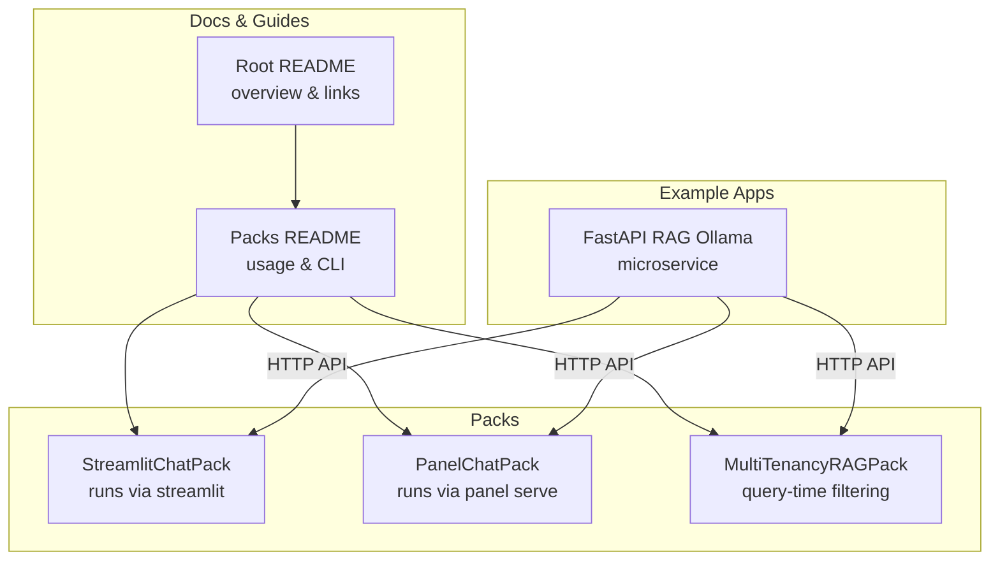
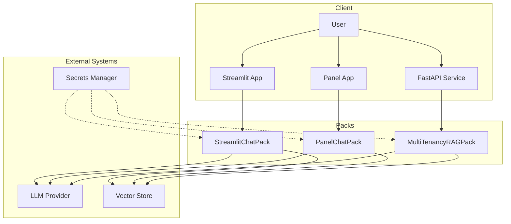
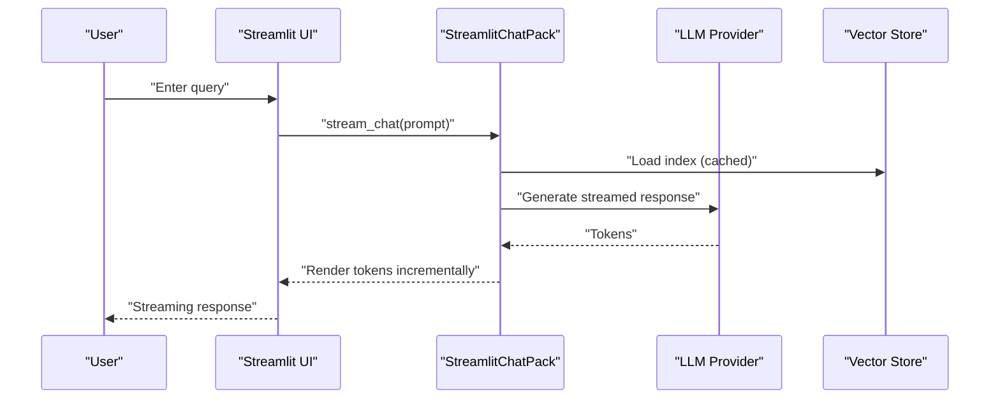
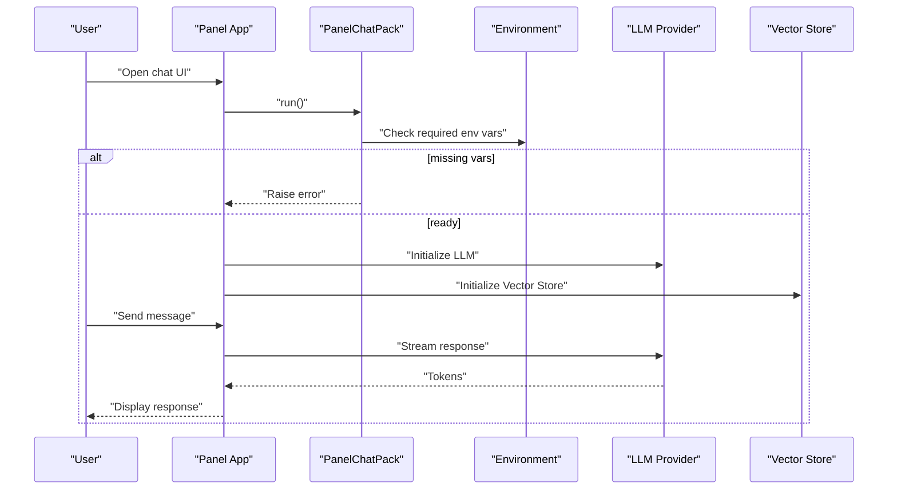
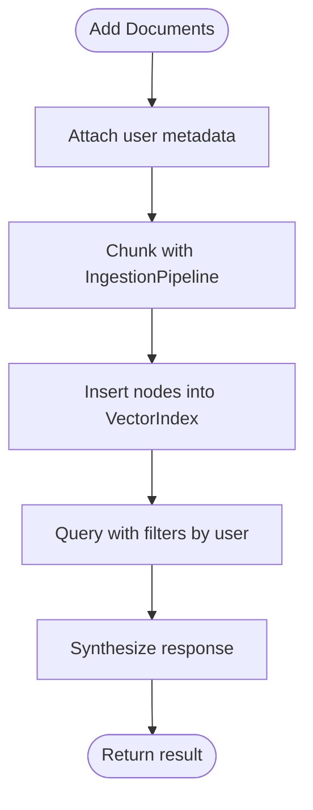
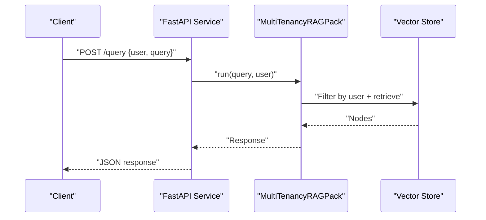
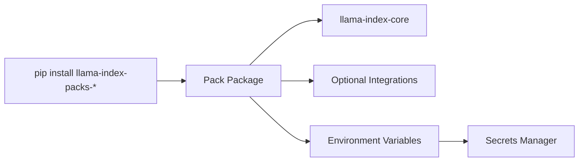

# Deployment and Integration Patterns

<cite>
**Referenced Files in This Document**
- [README.md](file://README.md)
- [llama-index-packs/README.md](file://llama-index-packs/README.md)
- [llama-index-packs/llama-index-packs-streamlit-chatbot/README.md](file://llama-index-packs/llama-index-packs-streamlit-chatbot/README.md)
- [llama-index-packs/llama-index-packs-streamlit-chatbot/llama_index/packs/streamlit_chatbot/base.py](file://llama-index-packs/llama-index-packs-streamlit-chatbot/llama_index/packs/streamlit_chatbot/base.py)
- [llama-index-packs/llama-index-packs-panel-chatbot/README.md](file://llama-index-packs/llama-index-packs-panel-chatbot/README.md)
- [llama-index-packs/llama-index-packs-panel-chatbot/llama_index/packs/panel_chatbot/base.py](file://llama-index-packs/llama-index-packs-panel-chatbot/llama_index/packs/panel_chatbot/base.py)
- [llama-index-packs/llama-index-packs-multi-tenancy-rag/README.md](file://llama-index-packs/llama-index-packs-multi-tenancy-rag/README.md)
- [llama-index-packs/llama-index-packs-multi-tenancy-rag/llama_index/packs/multi_tenancy_rag/base.py](file://llama-index-packs/llama-index-packs-multi-tenancy-rag/llama_index/packs/multi_tenancy_rag/base.py)
- [examples/fastapi_rag_ollama/app.py](file://examples/fastapi_rag_ollama/app.py)
- [examples/fastapi_rag_ollama/requirements.txt](file://examples/fastapi_rag_ollama/requirements.txt)
</cite>

## Table of Contents
1. [Introduction](#introduction)
2. [Project Structure](#project-structure)
3. [Core Components](#core-components)
4. [Architecture Overview](#architecture-overview)
5. [Detailed Component Analysis](#detailed-component-analysis)
6. [Dependency Analysis](#dependency-analysis)
7. [Performance Considerations](#performance-considerations)
8. [Troubleshooting Guide](#troubleshooting-guide)
9. [Conclusion](#conclusion)
10. [Appendices](#appendices)

## Introduction
This document provides production-ready deployment and integration patterns for LlamaIndex Packs. It focuses on how to deploy and operate packs across multiple environments (web applications, microservices, serverless, containers), how to integrate them with existing applications and data pipelines, and how to manage environment configuration, secrets, scaling, monitoring, logging, observability, CI/CD, and multi-tenancy. It leverages real pack implementations present in the repository to illustrate practical deployment strategies.

## Project Structure
The repository organizes packs under a dedicated packs directory. Each pack is a self-contained Python package that extends the BaseLlamaPack and exposes a run method suitable for local development and deployment. The repository also includes example microservice-style applications and general guidance for integrating LlamaIndex into production systems.

**Diagram sources**
- [README.md](file://README.md#L1-L224)
- [llama-index-packs/README.md](file://llama-index-packs/README.md#L1-L33)
- [llama-index-packs/llama-index-packs-streamlit-chatbot/README.md](file://llama-index-packs/llama-index-packs-streamlit-chatbot/README.md#L1-L29)
- [llama-index-packs/llama-index-packs-panel-chatbot/README.md](file://llama-index-packs/llama-index-packs-panel-chatbot/README.md#L1-L68)
- [llama-index-packs/llama-index-packs-multi-tenancy-rag/README.md](file://llama-index-packs/llama-index-packs-multi-tenancy-rag/README.md#L1-L68)
- [examples/fastapi_rag_ollama/app.py](file://examples/fastapi_rag_ollama/app.py)

**Section sources**
- [README.md](file://README.md#L1-L224)
- [llama-index-packs/README.md](file://llama-index-packs/README.md#L1-L33)

## Core Components
- StreamlitChatPack: A Streamlit-based chatbot pack that loads data, builds a VectorStoreIndex, and streams responses. It is designed to run directly via streamlit run and initializes an LLM and index lazily.
- PanelChatPack: A Panel-based chatbot pack that validates required environment variables and serves a chat UI via panel serve or Python execution.
- MultiTenancyRAGPack: A pack that supports multi-tenancy by adding user metadata to documents and filtering at query time using metadata filters.

Key deployment characteristics:
- Web apps: Streamlit and Panel packs expose interactive UIs and rely on environment variables for credentials.
- Microservices: The FastAPI example demonstrates an HTTP API wrapping RAG logic.
- Multi-tenancy: Filtering by metadata enables tenant isolation.

**Section sources**
- [llama-index-packs/llama-index-packs-streamlit-chatbot/llama_index/packs/streamlit_chatbot/base.py](file://llama-index-packs/llama-index-packs-streamlit-chatbot/llama_index/packs/streamlit_chatbot/base.py#L1-L148)
- [llama-index-packs/llama-index-packs-panel-chatbot/llama_index/packs/panel_chatbot/base.py](file://llama-index-packs/llama-index-packs-panel-chatbot/llama_index/packs/panel_chatbot/base.py#L1-L46)
- [llama-index-packs/llama-index-packs-multi-tenancy-rag/llama_index/packs/multi_tenancy_rag/base.py](file://llama-index-packs/llama-index-packs-multi-tenancy-rag/llama_index/packs/multi_tenancy_rag/base.py#L1-L62)
- [examples/fastapi_rag_ollama/app.py](file://examples/fastapi_rag_ollama/app.py)

## Architecture Overview
The following diagram shows how packs integrate with external systems and how they can be exposed via different deployment targets.

**Diagram sources**
- [llama-index-packs/llama-index-packs-streamlit-chatbot/llama_index/packs/streamlit_chatbot/base.py](file://llama-index-packs/llama-index-packs-streamlit-chatbot/llama_index/packs/streamlit_chatbot/base.py#L1-L148)
- [llama-index-packs/llama-index-packs-panel-chatbot/llama_index/packs/panel_chatbot/base.py](file://llama-index-packs/llama-index-packs-panel-chatbot/llama_index/packs/panel_chatbot/base.py#L1-L46)
- [llama-index-packs/llama-index-packs-multi-tenancy-rag/llama_index/packs/multi_tenancy_rag/base.py](file://llama-index-packs/llama-index-packs-multi-tenancy-rag/llama_index/packs/multi_tenancy_rag/base.py#L1-L62)
- [examples/fastapi_rag_ollama/app.py](file://examples/fastapi_rag_ollama/app.py)

## Detailed Component Analysis

### StreamlitChatPack
- Purpose: Interactive chatbot UI built with Streamlit, backed by a VectorStoreIndex and an LLM.
- Environment: Requires an LLM provider key configured via environment variables.
- Initialization: Builds index lazily using a cached resource to avoid repeated ingestion.
- Streaming: Uses a streaming chat engine to render tokens progressively.
- Deployment: Run via streamlit run; suitable for lightweight demos and internal tools.

**Diagram sources**
- [llama-index-packs/llama-index-packs-streamlit-chatbot/llama_index/packs/streamlit_chatbot/base.py](file://llama-index-packs/llama-index-packs-streamlit-chatbot/llama_index/packs/streamlit_chatbot/base.py#L73-L140)

**Section sources**
- [llama-index-packs/llama-index-packs-streamlit-chatbot/README.md](file://llama-index-packs/llama-index-packs-streamlit-chatbot/README.md#L1-L29)
- [llama-index-packs/llama-index-packs-streamlit-chatbot/llama_index/packs/streamlit_chatbot/base.py](file://llama-index-packs/llama-index-packs-streamlit-chatbot/llama_index/packs/streamlit_chatbot/base.py#L1-L148)

### PanelChatPack
- Purpose: Panel-based chat UI served via panel serve or Python execution.
- Environment: Validates presence of required environment variables before serving.
- Deployment: Can be served directly or embedded in a Bokeh app context.

**Diagram sources**
- [llama-index-packs/llama-index-packs-panel-chatbot/llama_index/packs/panel_chatbot/base.py](file://llama-index-packs/llama-index-packs-panel-chatbot/llama_index/packs/panel_chatbot/base.py#L21-L41)

**Section sources**
- [llama-index-packs/llama-index-packs-panel-chatbot/README.md](file://llama-index-packs/llama-index-packs-panel-chatbot/README.md#L1-L68)
- [llama-index-packs/llama-index-packs-panel-chatbot/llama_index/packs/panel_chatbot/base.py](file://llama-index-packs/llama-index-packs-panel-chatbot/llama_index/packs/panel_chatbot/base.py#L1-L46)

### MultiTenancyRAGPack
- Purpose: Tenant-aware RAG that injects user metadata during ingestion and filters at query time.
- Query-time isolation: Uses metadata filters to constrain retrieval to a specific user.
- Ingestion pipeline: Supports chunking and parallel node creation.

**Diagram sources**
- [llama-index-packs/llama-index-packs-multi-tenancy-rag/llama_index/packs/multi_tenancy_rag/base.py](file://llama-index-packs/llama-index-packs-multi-tenancy-rag/llama_index/packs/multi_tenancy_rag/base.py#L25-L61)

**Section sources**
- [llama-index-packs/llama-index-packs-multi-tenancy-rag/README.md](file://llama-index-packs/llama-index-packs-multi-tenancy-rag/README.md#L1-L68)
- [llama-index-packs/llama-index-packs-multi-tenancy-rag/llama_index/packs/multi_tenancy_rag/base.py](file://llama-index-packs/llama-index-packs-multi-tenancy-rag/llama_index/packs/multi_tenancy_rag/base.py#L1-L62)

### FastAPI Microservice (Example)
- Purpose: Demonstrates exposing RAG capabilities via HTTP endpoints.
- Integration: Loads index and exposes endpoints to handle queries.
- Deployment: Suitable for containerization and orchestration platforms.

**Diagram sources**
- [examples/fastapi_rag_ollama/app.py](file://examples/fastapi_rag_ollama/app.py)

**Section sources**
- [examples/fastapi_rag_ollama/app.py](file://examples/fastapi_rag_ollama/app.py)
- [examples/fastapi_rag_ollama/requirements.txt](file://examples/fastapi_rag_ollama/requirements.txt)

## Dependency Analysis
- Pack usage: Packs are installed via pip or downloaded via CLI. The packs themselves depend on LlamaIndex core and optional integrations (e.g., LLM providers, readers).
- Runtime dependencies: Packs typically require an LLM provider key and a vector store backend.
- Example dependencies: The FastAPI example includes a requirements file indicating additional dependencies.

**Diagram sources**
- [llama-index-packs/README.md](file://llama-index-packs/README.md#L1-L33)
- [examples/fastapi_rag_ollama/requirements.txt](file://examples/fastapi_rag_ollama/requirements.txt)

**Section sources**
- [llama-index-packs/README.md](file://llama-index-packs/README.md#L1-L33)
- [examples/fastapi_rag_ollama/requirements.txt](file://examples/fastapi_rag_ollama/requirements.txt)

## Performance Considerations
- Caching and persistence: StreamlitChatPack caches the index resource to avoid re-ingestion per session. Persist and reload indices in long-running services to reduce cold-start latency.
- Streaming responses: Both Streamlit and Panel packs leverage streaming to improve perceived latency.
- Parallelism: MultiTenancyRAGPack’s ingestion pipeline uses multiple workers to accelerate chunking and node creation.
- Resource allocation: Scale CPU/RAM according to concurrent users and index size; vector stores may require GPU acceleration depending on embedding model and similarity search backend.
- Cost control: Prefer efficient chunk sizes and retrieval top-k tuning; offload heavy LLM calls to cheaper models for retrieval and reserve higher-capability models for synthesis.

[No sources needed since this section provides general guidance]

## Troubleshooting Guide
Common issues and remedies:
- Missing environment variables:
  - PanelChatPack explicitly checks for required keys and raises errors if missing. Ensure environment variables are set before serving.
- Incorrect invocation:
  - StreamlitChatPack requires running via streamlit run; attempting to import it directly may raise initialization errors.
- Vector store connectivity:
  - Verify credentials and network access for the vector store backend; confirm index persistence path exists and is writable.
- Multi-tenancy filtering:
  - Ensure user metadata is attached during ingestion and that query-time filters target the correct metadata key.
- Microservice startup:
  - Confirm dependencies are installed and environment variables are present when starting the FastAPI service.

**Section sources**
- [llama-index-packs/llama-index-packs-panel-chatbot/llama_index/packs/panel_chatbot/base.py](file://llama-index-packs/llama-index-packs-panel-chatbot/llama_index/packs/panel_chatbot/base.py#L21-L26)
- [llama-index-packs/llama-index-packs-streamlit-chatbot/llama_index/packs/streamlit_chatbot/base.py](file://llama-index-packs/llama-index-packs-streamlit-chatbot/llama_index/packs/streamlit_chatbot/base.py#L29-L34)
- [llama-index-packs/llama-index-packs-multi-tenancy-rag/llama_index/packs/multi_tenancy_rag/base.py](file://llama-index-packs/llama-index-packs-multi-tenancy-rag/llama_index/packs/multi_tenancy_rag/base.py#L25-L38)

## Conclusion
LlamaIndex Packs offer flexible, production-ready building blocks for deploying RAG applications across diverse environments. By leveraging environment-driven configuration, metadata-based multi-tenancy, streaming responses, and persistent indices, teams can achieve scalable, observable, and cost-efficient deployments. The provided examples demonstrate straightforward paths to containerization, orchestration, and integration with existing APIs and data pipelines.

[No sources needed since this section summarizes without analyzing specific files]

## Appendices

### Deployment Architectures by Target
- Web applications (Streamlit/Panel): Serve interactive UIs locally or in restricted environments; suitable for demos and internal tools.
- Microservices: Wrap packs behind HTTP APIs for decoupled integration with frontend/backends.
- Serverless functions: Package minimal runtime with cached indices; consider cold-start mitigation via warmers or provisioned concurrency.
- Containers: Encapsulate packs with environment variables and persistent volumes for indices; orchestrate with Kubernetes or cloud run.

[No sources needed since this section provides general guidance]

### Environment Configuration and Secrets Management
- Use environment variables for LLM keys and provider-specific credentials.
- Externalize secrets via platform secret managers or config maps/secrets in containers.
- Validate required variables at startup (as demonstrated by PanelChatPack).

**Section sources**
- [llama-index-packs/llama-index-packs-panel-chatbot/llama_index/packs/panel_chatbot/base.py](file://llama-index-packs/llama-index-packs-panel-chatbot/llama_index/packs/panel_chatbot/base.py#L21-L26)

### Scaling Considerations
- Horizontal scaling: Stateless query engines scale horizontally; ensure shared vector store and synchronized index snapshots.
- Vertical scaling: Increase CPU/RAM for larger indices and concurrent requests.
- Caching: Persist indices and cache frequently accessed chunks; invalidate on data updates.
- Async/streaming: Use streaming responses to reduce perceived latency under load.

[No sources needed since this section provides general guidance]

### Monitoring, Logging, and Observability
- Instrument LLM calls and retrieval steps to capture latency, tokens, and error rates.
- Track query volume, top-k usage, and tenant distribution for multi-tenant deployments.
- Export traces and metrics to platform-native observability stacks.

[No sources needed since this section provides general guidance]

### CI/CD Pipeline and Automated Testing
- Package packs as Python wheels and publish to private registries if needed.
- Automate unit/integration tests for pack initialization, ingestion, and query flows.
- Use container images for deployment; scan images and pin dependency versions.

[No sources needed since this section provides general guidance]

### Pack-Specific Requirements
- Vector store connections: Configure connection strings and credentials; ensure network access and IAM permissions.
- API credentials: Provide keys via environment variables; rotate regularly and restrict scope.
- Resource provisioning: Provision adequate compute and storage for indexing and serving; monitor vector store capacity.

[No sources needed since this section provides general guidance]

### Multi-Tenant Deployment Patterns
- Isolation: Attach tenant identifiers during ingestion; enforce metadata filters at query time.
- Resource allocation: Separate indices or namespaces per tenant; rate-limit per tenant if necessary.
- Audit and governance: Log queries and retrievals per tenant; enforce quotas and retention policies.

**Section sources**
- [llama-index-packs/llama-index-packs-multi-tenancy-rag/llama_index/packs/multi_tenancy_rag/base.py](file://llama-index-packs/llama-index-packs-multi-tenancy-rag/llama_index/packs/multi_tenancy_rag/base.py#L25-L61)