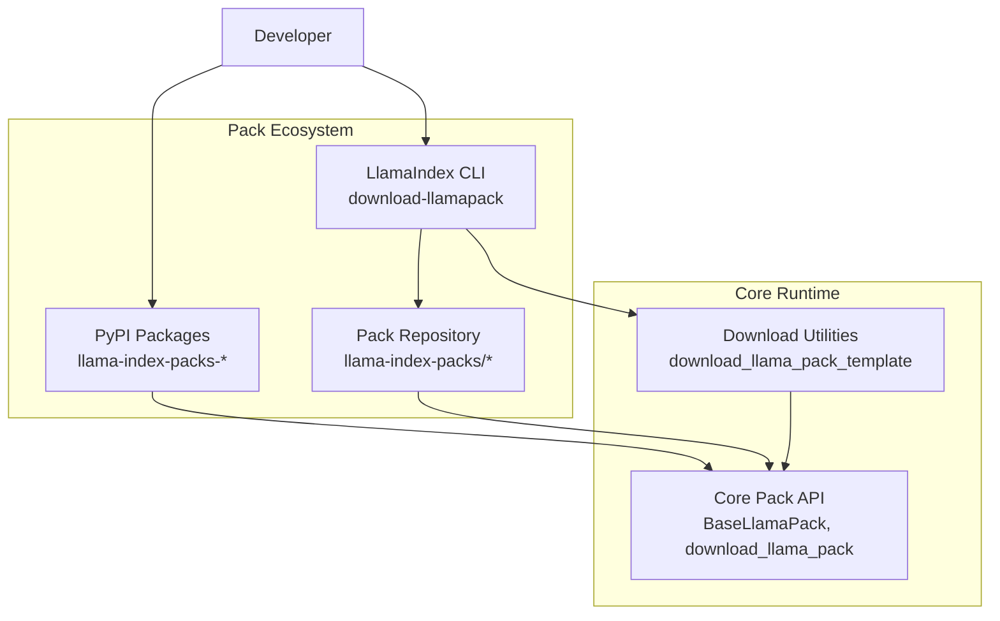
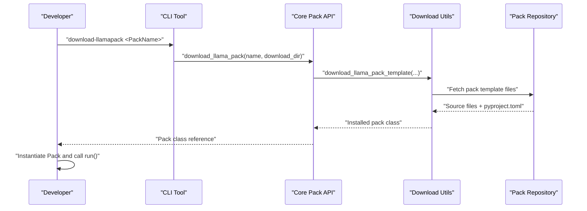
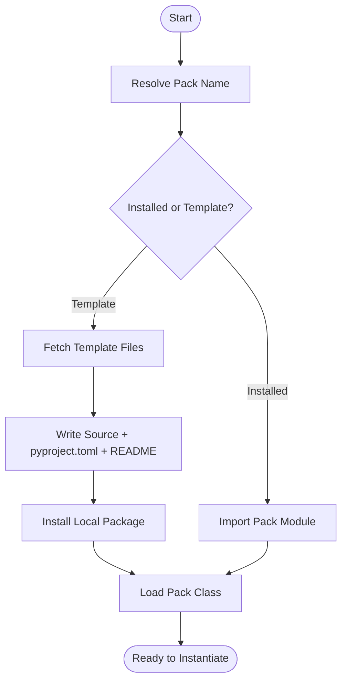
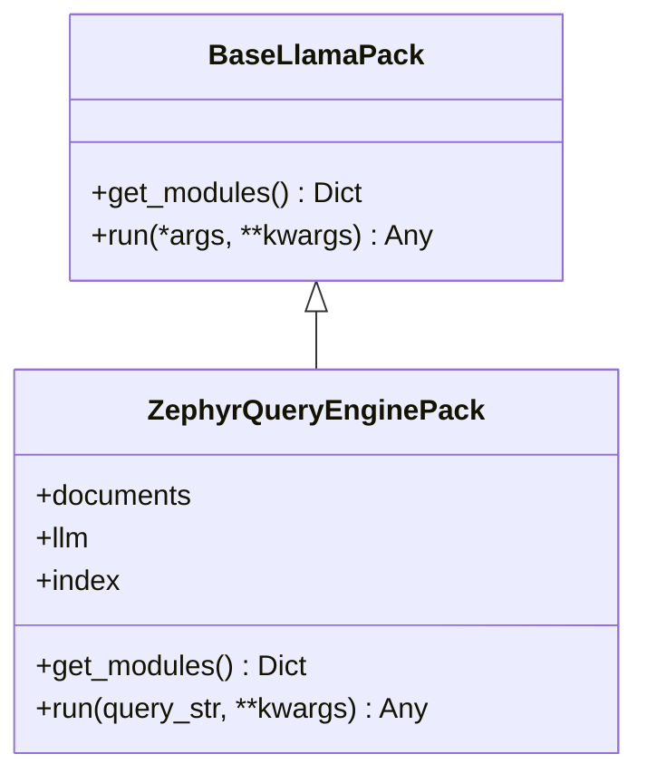
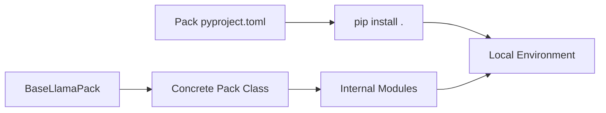

# Pack Overview and Concepts

<cite>
**Referenced Files in This Document**
- [README.md](file://llama-index-packs/README.md)
- [base.py](file://llama-index-core/llama_index/core/llama_pack/base.py)
- [__init__.py](file://llama-index-core/llama_index/core/llama_pack/__init__.py)
- [download.py](file://llama-index-core/llama_index/core/llama_pack/download.py)
- [pack.py](file://llama-index-core/llama_index/core/download/pack.py)
- [README.md](file://llama-index-cli/README.md)
- [README.md](file://llama-index-packs/llama-index-packs-zephyr-query-engine/README.md)
- [pyproject.toml](file://llama-index-packs/llama-index-packs-zephyr-query-engine/pyproject.toml)
- [base.py](file://llama-index-packs/llama-index-packs-zephyr-query-engine/llama_index/packs/zephyr_query_engine/base.py)
- [__init__.py](file://llama-index-packs/llama-index-packs-zephyr-query-engine/llama_index/packs/zephyr_query_engine/__init__.py)
</cite>

## Table of Contents
1. [Introduction](#introduction)
2. [Project Structure](#project-structure)
3. [Core Components](#core-components)
4. [Architecture Overview](#architecture-overview)
5. [Detailed Component Analysis](#detailed-component-analysis)
6. [Dependency Analysis](#dependency-analysis)
7. [Performance Considerations](#performance-considerations)
8. [Troubleshooting Guide](#troubleshooting-guide)
9. [Conclusion](#conclusion)
10. [Appendices](#appendices)

## Introduction
LlamaIndex Packs are pre-built application modules that combine core LlamaIndex components with integration packages into ready-to-use templates. They accelerate development by providing production-ready configurations for common use cases such as retrieval, agents, evaluation, and multi-modal scenarios. Packs encapsulate end-to-end workflows, exposing a simple interface to fetch internal modules and execute queries or tasks, while allowing customization and extension.

Key benefits over building from scratch:
- Faster time-to-market with tested defaults
- Consistent architecture and dependency management
- Easy discovery and installation via pip and CLI
- Extensible design enabling parameter tuning and customization

## Project Structure
At a high level, Packs live under a dedicated repository and are consumed through:
- Pip-installable packages for immediate use
- CLI-driven template downloads for inspection and modification
- Core pack APIs for runtime instantiation and execution

**Diagram sources**
- [README.md](file://llama-index-packs/README.md#L1-L33)
- [__init__.py](file://llama-index-core/llama_index/core/llama_pack/__init__.py#L1-L10)
- [download.py](file://llama-index-core/llama_index/core/llama_pack/download.py#L1-L75)
- [pack.py](file://llama-index-core/llama_index/core/download/pack.py#L1-L152)
- [README.md](file://llama-index-cli/README.md#L1-L31)

**Section sources**
- [README.md](file://llama-index-packs/README.md#L1-L33)
- [README.md](file://llama-index-cli/README.md#L1-L31)

## Core Components
- BaseLlamaPack: Defines the contract for all Packs with two methods:
  - get_modules(): returns a dictionary of internal modules (e.g., LLM, index)
  - run(*args, **kwargs): executes the Pack’s primary workflow
- download_llama_pack(): resolves a Pack class name to an importable module, either by installing a packaged version or downloading a template for customization.

These components enable a uniform way to discover, instantiate, and run Packs, while supporting both out-of-the-box usage and advanced customization.

**Section sources**
- [base.py](file://llama-index-core/llama_index/core/llama_pack/base.py#L1-L15)
- [__init__.py](file://llama-index-core/llama_index/core/llama_pack/__init__.py#L1-L10)
- [download.py](file://llama-index-core/llama_index/core/llama_pack/download.py#L1-L75)

## Architecture Overview
The Pack architecture follows a layered pattern:
- Discovery and Resolution: The CLI or programmatic API resolve a Pack class name to a package or template.
- Template vs. Installed: Templates are downloaded and built locally; installed packages are imported directly.
- Composition: Packs assemble core LlamaIndex elements (e.g., LLMs, indices) into a cohesive module set.
- Execution: Users call run() to execute the workflow or access individual modules via get_modules().

**Diagram sources**
- [README.md](file://llama-index-cli/README.md#L1-L31)
- [download.py](file://llama-index-core/llama_index/core/llama_pack/download.py#L14-L75)
- [pack.py](file://llama-index-core/llama_index/core/download/pack.py#L99-L134)

## Detailed Component Analysis

### Pack Discovery and Installation
- Discovery via CLI:
  - The CLI exposes a command to download a Pack template to a target directory.
  - This enables inspection, customization, and iterative development.
- Programmatic discovery:
  - The core API resolves a Pack class name to an importable module.
  - It supports both installed packages and local templates.
- Template download flow:
  - Downloads source files recursively, ensures pyproject.toml and a minimal README exist, then installs the package in the current environment.
  - Tracks analytics via a proxy endpoint.

**Diagram sources**
- [README.md](file://llama-index-cli/README.md#L1-L31)
- [download.py](file://llama-index-core/llama_index/core/llama_pack/download.py#L14-L75)
- [pack.py](file://llama-index-core/llama_index/core/download/pack.py#L99-L134)

**Section sources**
- [README.md](file://llama-index-cli/README.md#L1-L31)
- [README.md](file://llama-index-packs/README.md#L1-L33)
- [download.py](file://llama-index-core/llama_index/core/llama_pack/download.py#L14-L75)
- [pack.py](file://llama-index-core/llama_index/core/download/pack.py#L1-L152)

### Pack Lifecycle: Creation to Deployment
- Creation:
  - Developers scaffold a new Pack using CLI templates.
  - The template includes a base class, pyproject configuration, and example usage.
- Customization:
  - Modify the Pack’s internal modules and parameters to fit domain needs.
  - Keep dependencies aligned with pyproject.toml.
- Testing and Validation:
  - Run example scripts and unit tests included in the Pack.
- Packaging and Distribution:
  - Build and publish the Pack to PyPI with a consistent package name.
- Consumption:
  - Users install the Pack via pip or download a template for customization.

Note: The lifecycle steps above describe the recommended workflow for Pack authors and consumers. The repository provides CLI scaffolding and Pack examples but does not include a dedicated “pack creation” command in the referenced files.

**Section sources**
- [README.md](file://llama-index-cli/README.md#L1-L31)
- [README.md](file://llama-index-packs/README.md#L1-L33)

### Pack Composition Patterns and Parameter Configuration
- Composition pattern:
  - Packs assemble core LlamaIndex components (e.g., LLM, index) into a cohesive unit.
  - get_modules() exposes these components for flexible reuse.
- Parameter configuration:
  - Packs accept constructor parameters (e.g., documents) and pass-through options to underlying components.
  - Example: a query engine Pack configures an LLM and embedding model, then exposes a query interface.
- Customization options:
  - Swap integrations (e.g., different LLM providers) by overriding initialization logic.
  - Adjust runtime behavior by passing kwargs to run() or internal query engines.

**Diagram sources**
- [base.py](file://llama-index-core/llama_index/core/llama_pack/base.py#L7-L15)
- [base.py](file://llama-index-packs/llama-index-packs-zephyr-query-engine/llama_index/packs/zephyr_query_engine/base.py#L12-L91)

**Section sources**
- [base.py](file://llama-index-packs/llama-index-packs-zephyr-query-engine/llama_index/packs/zephyr_query_engine/base.py#L1-L91)
- [__init__.py](file://llama-index-packs/llama-index-packs-zephyr-query-engine/llama_index/packs/zephyr_query_engine/__init__.py#L1-L4)

### Pack Categorization by Functionality
Common categories observed across Packs:
- Retrieval-focused Packs: e.g., fusion retriever, recursive retriever, auto-merging retriever
- Agent-oriented Packs: e.g., Gmail OpenAI agent
- Evaluation Packs: e.g., evaluator benchmarker, TruLens eval packs
- Multi-modal Packs: e.g., LLaVA completion, Deeplake multi-modal retrieval
- Query Engine Packs: e.g., Zephyr query engine, Voyage query engine, Ollama query engine
- Specialized Domain Packs: e.g., stock market data query engine, resume screener

Choosing a Pack depends on your primary goal:
- Retrieval-heavy RAG: choose a retriever-focused Pack
- Conversational agents: choose an agent-oriented Pack
- Evaluation pipelines: choose an evaluator Pack
- Multi-modal inputs: choose a multi-modal Pack
- Private/local inference: choose a local query engine Pack

[No sources needed since this section summarizes categories without analyzing specific files]

### Understanding Pack Limitations and Extensions
- Limitations:
  - Some Packs require optional dependencies (e.g., GPU/CUDA for local models).
  - Certain Packs rely on external APIs or services; availability may vary.
  - Packs are optimized for specific defaults; extensive customization may be needed for niche scenarios.
- Extensions:
  - Extend BaseLlamaPack to add new modules or workflows.
  - Override run() to integrate additional steps (e.g., post-processing, routing).
  - Compose multiple Packs to build hybrid solutions.

**Section sources**
- [base.py](file://llama-index-packs/llama-index-packs-zephyr-query-engine/llama_index/packs/zephyr_query_engine/base.py#L18-L22)
- [base.py](file://llama-index-packs/llama-index-packs-zephyr-query-engine/llama_index/packs/zephyr_query_engine/base.py#L49-L69)

## Dependency Analysis
Packs manage dependencies through:
- pyproject.toml: Declares core and dev dependencies, ensuring reproducible builds.
- Template installation: The download utility installs dependencies automatically when generating a local template.
- Core API: Ensures the resolved Pack class inherits from BaseLlamaPack.

**Diagram sources**
- [pyproject.toml](file://llama-index-packs/llama-index-packs-zephyr-query-engine/pyproject.toml#L27-L51)
- [pack.py](file://llama-index-core/llama_index/core/download/pack.py#L93-L97)
- [base.py](file://llama-index-core/llama_index/core/llama_pack/base.py#L7-L15)

**Section sources**
- [pyproject.toml](file://llama-index-packs/llama-index-packs-zephyr-query-engine/pyproject.toml#L1-L78)
- [pack.py](file://llama-index-core/llama_index/core/download/pack.py#L93-L97)
- [download.py](file://llama-index-core/llama_index/core/llama_pack/download.py#L69-L72)

## Performance Considerations
- Local inference Packs (e.g., local LLMs) may require GPU resources and quantization settings to balance quality and speed.
- Embedding model choices impact indexing and retrieval latency; selecting appropriate models can improve throughput.
- Template-based Packs introduce an initial installation cost; subsequent runs benefit from cached environments.

[No sources needed since this section provides general guidance]

## Troubleshooting Guide
- Missing optional dependencies:
  - Some Packs require additional libraries; ensure they are installed per Pack instructions.
- CUDA/device issues:
  - If local model loading fails, fallback to full-precision models or adjust device settings.
- Template installation failures:
  - Verify pyproject.toml presence and correctness; re-run installation after fixing dependencies.
- Analytics tracking errors:
  - Tracking is best-effort; failures are logged and do not block Pack usage.

**Section sources**
- [base.py](file://llama-index-packs/llama-index-packs-zephyr-query-engine/llama_index/packs/zephyr_query_engine/base.py#L18-L22)
- [base.py](file://llama-index-packs/llama-index-packs-zephyr-query-engine/llama_index/packs/zephyr_query_engine/base.py#L49-L69)
- [pack.py](file://llama-index-core/llama_index/core/download/pack.py#L136-L152)

## Conclusion
LlamaIndex Packs streamline the development of AI applications by offering pre-configured, composable modules. With a clear architecture, robust discovery mechanisms, and flexible customization, Packs help teams move quickly while maintaining control over components and behavior. Whether using installed Packs or downloading templates for deep customization, the ecosystem supports rapid iteration and production-grade deployments.

[No sources needed since this section summarizes without analyzing specific files]

## Appendices

### Quick Start References
- Using a Pack via pip:
  - Install a Pack package and import its class from the Pack namespace.
- Downloading a Pack template:
  - Use the CLI to fetch a template and install dependencies locally.
- Running a Pack:
  - Instantiate the Pack with required inputs and call run() or access modules via get_modules().

**Section sources**
- [README.md](file://llama-index-packs/README.md#L5-L11)
- [README.md](file://llama-index-packs/README.md#L18-L32)
- [README.md](file://llama-index-packs/llama-index-packs-zephyr-query-engine/README.md#L15-L52)