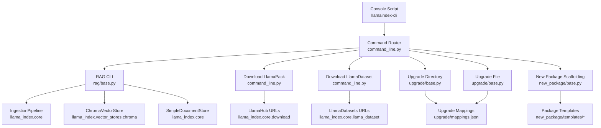
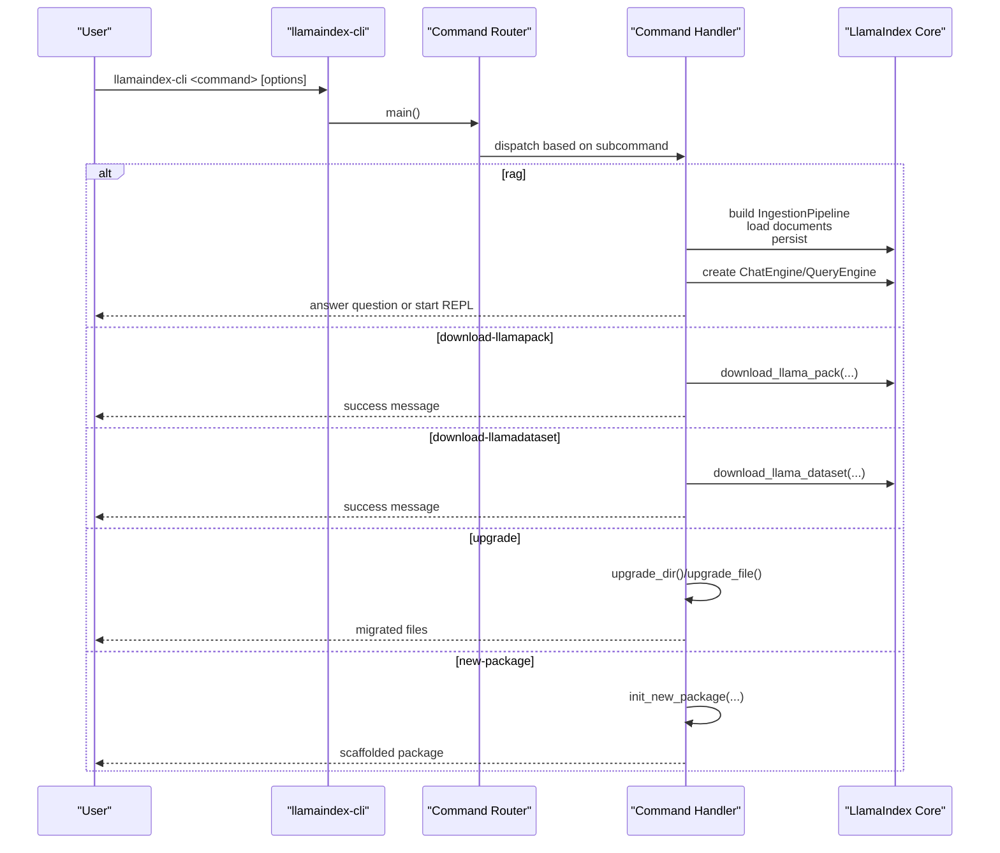
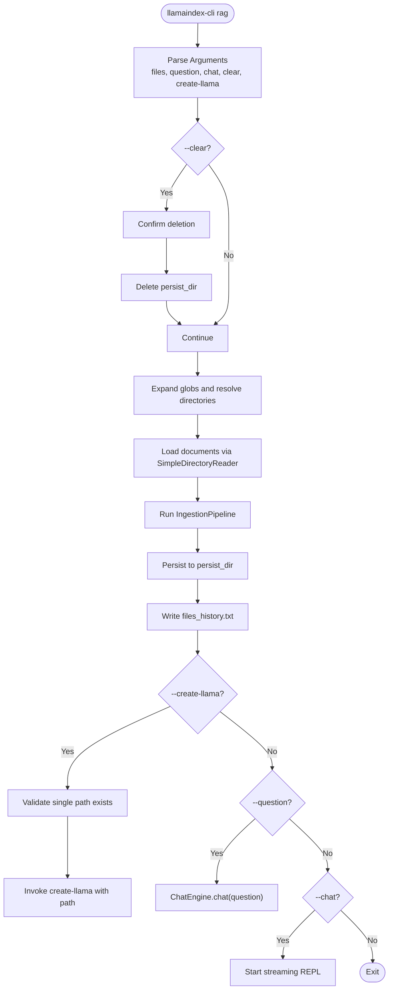
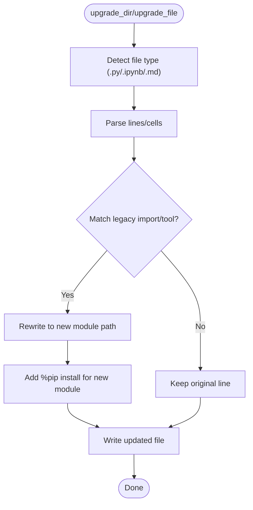
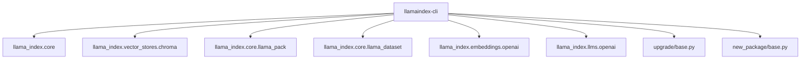

# CLI Interface and Commands

<cite>
**Referenced Files in This Document**
- [README.md](file://llama-index-cli/README.md)
- [pyproject.toml](file://llama-index-cli/pyproject.toml)
- [command_line.py](file://llama-index-cli/llama_index/cli/command_line.py)
- [base.py (RAG)](file://llama-index-cli/llama_index/cli/rag/base.py)
- [base.py (Upgrade)](file://llama-index-cli/llama_index/cli/upgrade/base.py)
- [mappings.json](file://llama-index-cli/llama_index/cli/upgrade/mappings.json)
- [base.py (New Package)](file://llama-index-cli/llama_index/cli/new_package/base.py)
- [templates/__init__.py](file://llama-index-cli/llama_index/cli/new_package/templates/__init__.py)
- [templates/init.py](file://llama-index-cli/llama_index/cli/new_package/templates/init.py)
- [templates/pyproject.py](file://llama-index-cli/llama_index/cli/new_package/templates/pyproject.py)
- [templates/readme.py](file://llama-index-cli/llama_index/cli/new_package/templates/readme.py)
- [Makefile (New Package Common)](file://llama-index-cli/llama_index/cli/new_package/common/Makefile)
- [test_rag.py](file://llama-index-cli/tests/test_rag.py)
</cite>

## Table of Contents
1. [Introduction](#introduction)
2. [Project Structure](#project-structure)
3. [Core Components](#core-components)
4. [Architecture Overview](#architecture-overview)
5. [Detailed Component Analysis](#detailed-component-analysis)
6. [Dependency Analysis](#dependency-analysis)
7. [Performance Considerations](#performance-considerations)
8. [Troubleshooting Guide](#troubleshooting-guide)
9. [Conclusion](#conclusion)
10. [Appendices](#appendices)

## Introduction
This document describes the LlamaIndex CLI interface and its commands for local development and automation. It covers:
- Command syntax and parameters for rag, download-llamapack, download-llamadataset, upgrade, upgrade-file, and new-package
- The RAG CLI workflow for asking questions to documents and directories, including configuration and persistence
- Pack downloading from LlamaHub and dataset downloading from LlamaDatasets
- Upgrade utilities for migrating notebooks and Python/Markdown files
- Package initialization for creating new integration packages
- Practical usage patterns, automation scripts, deployment preparation, troubleshooting, and best practices

## Project Structure
The CLI is implemented as a Python package with a console script entry point. The main command router defines subcommands and delegates to handlers. Supporting modules implement RAG, pack/dataset downloads, upgrades, and package scaffolding.

**Diagram sources**
- [command_line.py](file://llama-index-cli/llama_index/cli/command_line.py#L149-L281)
- [base.py (RAG)](file://llama-index-cli/llama_index/cli/rag/base.py#L53-L350)
- [base.py (Upgrade)](file://llama-index-cli/llama_index/cli/upgrade/base.py#L1-L287)
- [mappings.json](file://llama-index-cli/llama_index/cli/upgrade/mappings.json#L1-L1099)
- [base.py (New Package)](file://llama-index-cli/llama_index/cli/new_package/base.py#L29-L121)

**Section sources**
- [README.md](file://llama-index-cli/README.md#L1-L31)
- [pyproject.toml](file://llama-index-cli/pyproject.toml#L49-L50)

## Core Components
- Command router and entry point: parses subcommands and routes to handlers
- RAG CLI: loads documents, builds ingestion pipeline, persists vectors, and answers questions or starts chat REPL
- Pack downloader: fetches LlamaIndex packs from LlamaHub
- Dataset downloader: fetches benchmark datasets from LlamaDatasets
- Upgrade utilities: migrates legacy imports and tool usage to new module locations
- New package scaffolding: initializes a new integration package directory structure and boilerplate

**Section sources**
- [command_line.py](file://llama-index-cli/llama_index/cli/command_line.py#L149-L281)
- [base.py (RAG)](file://llama-index-cli/llama_index/cli/rag/base.py#L53-L350)
- [base.py (Upgrade)](file://llama-index-cli/llama_index/cli/upgrade/base.py#L116-L287)
- [base.py (New Package)](file://llama-index-cli/llama_index/cli/new_package/base.py#L29-L121)

## Architecture Overview
The CLI is a thin wrapper around LlamaIndex core APIs. It composes:
- IngestionPipeline for transforming and embedding documents
- Vector stores (default Chroma) and document stores for persistence
- Chat engines and query engines for answering questions
- Downloader functions for packs and datasets
- Upgrade logic that rewrites imports and adds installation cells

**Diagram sources**
- [command_line.py](file://llama-index-cli/llama_index/cli/command_line.py#L149-L281)
- [base.py (RAG)](file://llama-index-cli/llama_index/cli/rag/base.py#L129-L278)
- [base.py (Upgrade)](file://llama-index-cli/llama_index/cli/upgrade/base.py#L266-L287)
- [base.py (New Package)](file://llama-index-cli/llama_index/cli/new_package/base.py#L29-L121)

## Detailed Component Analysis

### RAG CLI Workflow
The RAG CLI ingests documents, persists embeddings, and supports question answering and chat REPL. It also integrates with create-llama to bootstrap applications from ingested data.

Key behaviors:
- Accepts files or directories (supports glob patterns)
- Builds an ingestion pipeline with transformations and embedding model
- Persists to a cache directory and maintains a files history
- Creates a chat engine from the vector store and responds to queries
- Optionally invokes create-llama with a single ingested path

**Diagram sources**
- [base.py (RAG)](file://llama-index-cli/llama_index/cli/rag/base.py#L129-L278)
- [base.py (RAG)](file://llama-index-cli/llama_index/cli/rag/base.py#L280-L332)

Practical usage patterns:
- Single file: llamaindex-cli rag --files ./report.pdf --question "What are the key findings?"
- Directory with globs: llamaindex-cli rag --files "./docs/**/*.md" --chat
- Reuse persisted data: llamaindex-cli rag --files ./data --question "Summarize"
- Create app from persisted data: llamaindex-cli rag --files ./data --create-llama

Configuration and persistence:
- Default persist directory is under the OS cache directory in a dedicated rag_cli subfolder
- Clearing the persist directory removes cached embeddings and history
- The files history tracks the last ingested paths for create-llama integration

Security note:
- The create-llama invocation uses subprocess with explicit arguments and check=True to prevent shell injection.

**Section sources**
- [base.py (RAG)](file://llama-index-cli/llama_index/cli/rag/base.py#L45-L46)
- [base.py (RAG)](file://llama-index-cli/llama_index/cli/rag/base.py#L129-L278)
- [base.py (RAG)](file://llama-index-cli/llama_index/cli/rag/base.py#L280-L332)
- [test_rag.py](file://llama-index-cli/tests/test_rag.py#L25-L112)

### Download LlamaPack
Downloads a LlamaIndex pack from LlamaHub into a target directory. The handler validates inputs and prints a success message upon completion.

Usage:
- llamaindex-cli download-llamapack <PackClassName> -d ./my_packs --llama-hub-url https://example.com

Parameters:
- Pack class name (required)
- Download directory (-d, --download-dir)
- LlamaHub URL (--llama-hub-url)

**Section sources**
- [command_line.py](file://llama-index-cli/llama_index/cli/command_line.py#L30-L68)
- [command_line.py](file://llama-index-cli/llama_index/cli/command_line.py#L161-L188)

### Download LlamaDataset
Downloads benchmark datasets from LlamaDatasets. The handler orchestrates fetching via configured URLs and prints a success message.

Usage:
- llamaindex-cli download-llamadataset <DatasetClassName> -d ./datasets --llama-datasets-lfs-url https://lfs.example.com

Parameters:
- Dataset class name (required)
- Download directory (-d, --download-dir)
- LlamaHub URL (--llama-hub-url)
- LlamaDatasets LFS URL (--llama-datasets-lfs-url)

**Section sources**
- [command_line.py](file://llama-index-cli/llama_index/cli/command_line.py#L47-L68)
- [command_line.py](file://llama-index-cli/llama_index/cli/command_line.py#L190-L223)

### Upgrade Utilities
Two commands migrate legacy code:
- upgrade: walks a directory recursively and upgrades .py, .ipynb, and .md files
- upgrade-file: upgrades a single file

Upgrade logic:
- Parses from-imports and maps legacy module names to new module locations
- Rewrites notebook cells to remove old llama-hub pip installs and injects new install cells
- Adds pip install statements for newly mapped modules
- Skips hidden paths

Mappings:
- The mappings file enumerates legacy identifiers and their new canonical locations across core, integrations, and packs.

**Diagram sources**
- [base.py (Upgrade)](file://llama-index-cli/llama_index/cli/upgrade/base.py#L116-L178)
- [base.py (Upgrade)](file://llama-index-cli/llama_index/cli/upgrade/base.py#L204-L247)
- [base.py (Upgrade)](file://llama-index-cli/llama_index/cli/upgrade/base.py#L266-L287)
- [mappings.json](file://llama-index-cli/llama_index/cli/upgrade/mappings.json#L1-L1099)

**Section sources**
- [base.py (Upgrade)](file://llama-index-cli/llama_index/cli/upgrade/base.py#L116-L178)
- [base.py (Upgrade)](file://llama-index-cli/llama_index/cli/upgrade/base.py#L204-L247)
- [base.py (Upgrade)](file://llama-index-cli/llama_index/cli/upgrade/base.py#L266-L287)
- [mappings.json](file://llama-index-cli/llama_index/cli/upgrade/mappings.json#L1-L1099)

### New Package Initialization
Initializes a new integration package with a standard directory layout, boilerplate files, and templates. Supports optional prefix for nested namespaces.

Usage:
- llamaindex-cli new-package -k <kind> -n <name> [-p <prefix>]

Generated structure:
- Package root with tests/, examples/, and src/llama_index/<prefix>/<kind>/<name>/
- __init__.py files and placeholder content
- pyproject.toml, README.md, and common files copied from the common directory

**Section sources**
- [command_line.py](file://llama-index-cli/llama_index/cli/command_line.py#L23-L28)
- [base.py (New Package)](file://llama-index-cli/llama_index/cli/new_package/base.py#L29-L121)
- [templates/__init__.py](file://llama-index-cli/llama_index/cli/new_package/templates/__init__.py#L1-L9)
- [templates/init.py](file://llama-index-cli/llama_index/cli/new_package/templates/init.py#L1-L12)
- [templates/pyproject.py](file://llama-index-cli/llama_index/cli/new_package/templates/pyproject.py#L1-L58)
- [templates/readme.py](file://llama-index-cli/llama_index/cli/new_package/templates/readme.py#L1-L3)
- [Makefile (New Package Common)](file://llama-index-cli/llama_index/cli/new_package/common/Makefile#L1-L18)

## Dependency Analysis
The CLI depends on LlamaIndex core for ingestion, vector stores, and dataset/pack downloads. It also relies on external tools for certain features.

**Diagram sources**
- [command_line.py](file://llama-index-cli/llama_index/cli/command_line.py#L4-L18)
- [base.py (RAG)](file://llama-index-cli/llama_index/cli/rag/base.py#L10-L27)
- [base.py (Upgrade)](file://llama-index-cli/llama_index/cli/upgrade/base.py#L1-L7)
- [base.py (New Package)](file://llama-index-cli/llama_index/cli/new_package/base.py#L1-L10)

**Section sources**
- [pyproject.toml](file://llama-index-cli/pyproject.toml#L43-L47)
- [command_line.py](file://llama-index-cli/llama_index/cli/command_line.py#L4-L18)

## Performance Considerations
- RAG ingestion cost scales with document count and size; use glob patterns and incremental runs to avoid re-ingesting unchanged files
- Persist directory reuse avoids recomputation; clear only when necessary
- Vector store selection impacts speed and memory; default Chroma is convenient but consider alternatives for production
- Upgrade operations process entire notebooks; exclude large binary cells and run on filtered sets when possible

## Troubleshooting Guide
Common issues and resolutions:
- Missing default dependencies for RAG: install required packages to enable default pipeline and vector store
- Missing chromadb: the default RAG pipeline requires chromadb; install the vector store package or customize the pipeline
- Missing OpenAI embeddings/LLMs: if not installed, the default LLM loader raises an import error; install the required packages
- create-llama prerequisites: ensure npx is available; the CLI checks for npx and warns otherwise
- Upgrade failures: ensure file types are supported (.py, .ipynb, .md); verify mappings are up to date
- Hidden paths ignored: upgrade walks exclude hidden directories; ensure target paths are not excluded unintentionally

Security considerations:
- create-llama uses subprocess with explicit arguments and check=True to prevent shell injection
- Tests validate that shell is not used and that the command is passed as a list

**Section sources**
- [command_line.py](file://llama-index-cli/llama_index/cli/command_line.py#L70-L146)
- [base.py (RAG)](file://llama-index-cli/llama_index/cli/rag/base.py#L194-L197)
- [test_rag.py](file://llama-index-cli/tests/test_rag.py#L75-L111)
- [test_rag.py](file://llama-index-cli/tests/test_rag.py#L175-L233)

## Conclusion
The LlamaIndex CLI provides a cohesive toolkit for local RAG workflows, dataset and pack acquisition, code migration, and package scaffolding. By leveraging persistent caches, standardized ingestion pipelines, and automated upgrade mappings, teams can streamline development, testing, and deployment preparation.

## Appendices

### Command Reference

- llamaindex-cli rag
  - Purpose: Ask questions to documents or directories; optionally start a chat REPL
  - Key options:
    - --files: One or more files or directories; supports glob patterns
    - --question: Single question to ask
    - --chat: Start an interactive chat REPL
    - --verbose: Verbose logging
    - --clear: Clear persisted embeddings and history
    - --create-llama: Bootstrap a LlamaIndex application from the last ingested path
  - Persistence: Default persist directory under the OS cache in a dedicated rag_cli subfolder

- llamaindex-cli download-llamapack
  - Purpose: Download a LlamaIndex pack from LlamaHub
  - Arguments:
    - llama_pack_class: Pack class name (required)
    - -d/--download-dir: Target directory (default: ./llama_packs)
    - --llama-hub-url: Custom LlamaHub URL

- llamaindex-cli download-llamadataset
  - Purpose: Download a benchmark dataset from LlamaDatasets
  - Arguments:
    - llama_dataset_class: Dataset class name (required)
    - -d/--download-dir: Target directory (default: ./llama_datasets)
    - --llama-hub-url: Custom LlamaHub URL
    - --llama-datasets-lfs-url: Custom LlamaDatasets LFS URL

- llamaindex-cli upgrade
  - Purpose: Upgrade a directory recursively (.py, .ipynb, .md)
  - Arguments:
    - directory: Root directory to process

- llamaindex-cli upgrade-file
  - Purpose: Upgrade a single file
  - Arguments:
    - path: File path to process

- llamaindex-cli new-package
  - Purpose: Initialize a new integration package
  - Arguments:
    - -k/--kind: Integration kind (e.g., llm, embedding, pack)
    - -n/--name: Package name
    - -p/--prefix: Optional nested prefix (e.g., provider)

### Best Practices
- Use --clear judiciously; rely on persisted caches for iterative development
- Prefer glob patterns to target subsets of files for faster iteration
- After upgrading notebooks, review generated install cells and remove duplicates
- For new integrations, use new-package to enforce consistent structure and tooling
- Automate CLI steps in CI/CD for reproducible environments and pre-deployment checks