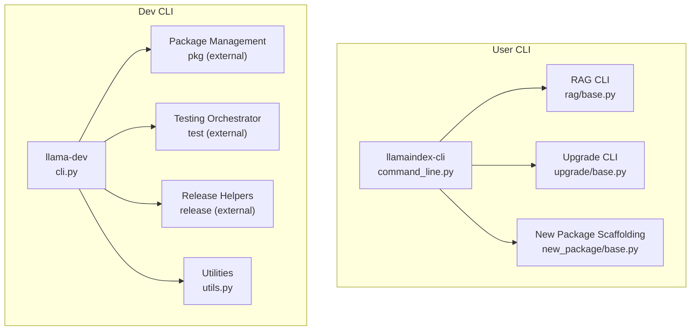
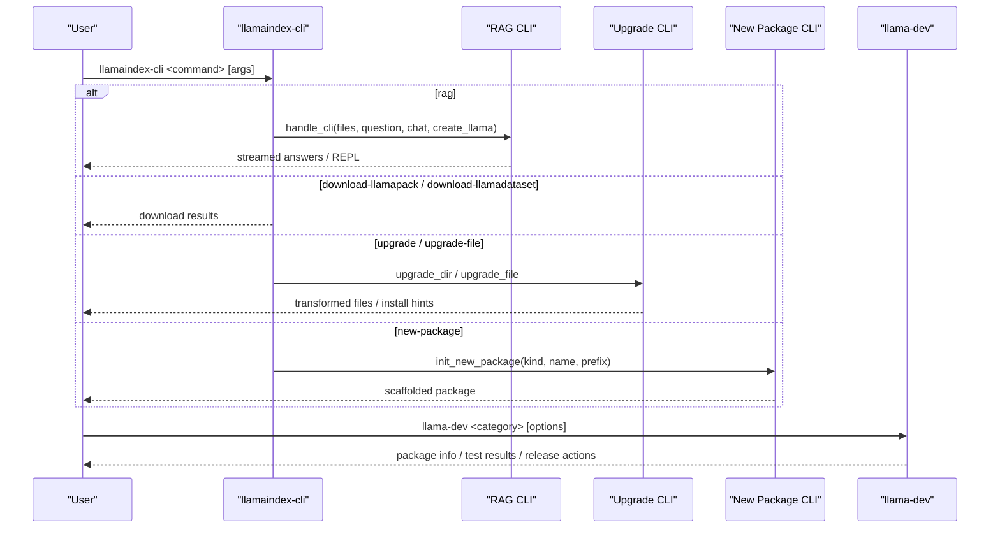
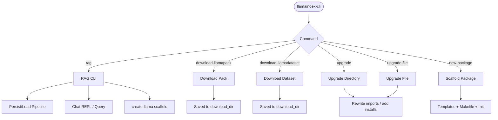
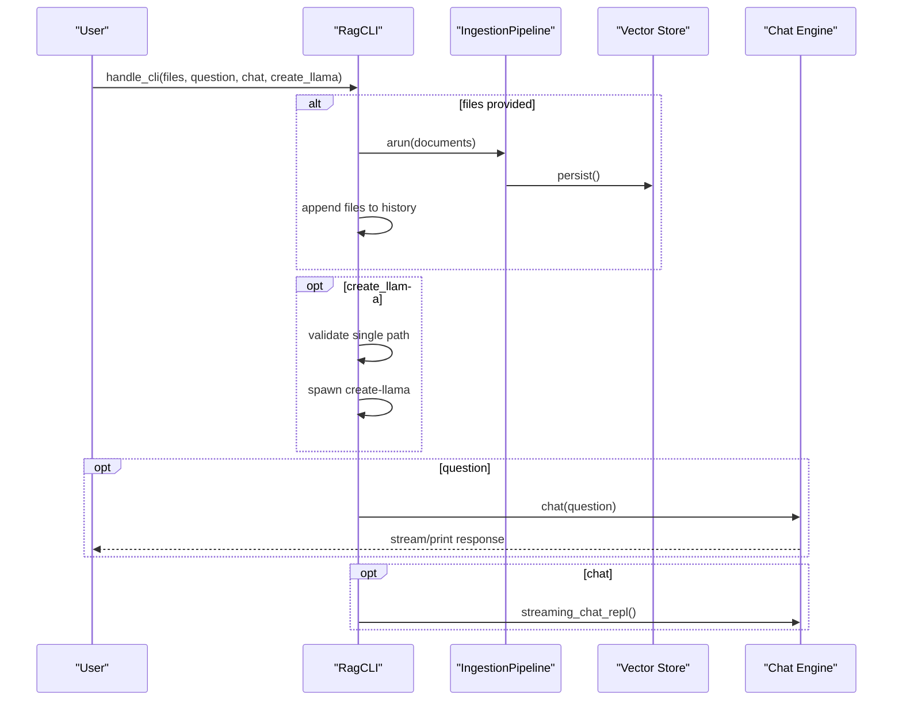
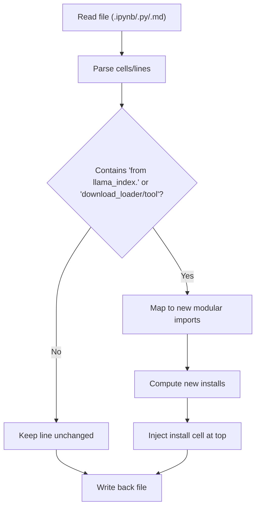
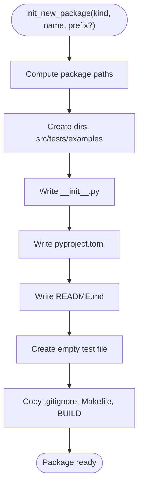
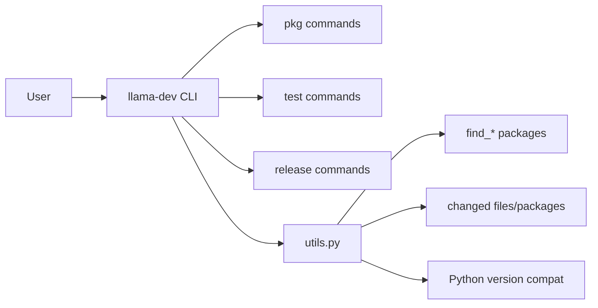
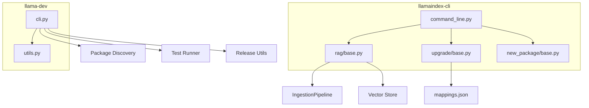

# CLI and Development Tools

<cite>
**Referenced Files in This Document**
- [README.md](file://llama-index-cli/README.md)
- [pyproject.toml](file://llama-index-cli/pyproject.toml)
- [command_line.py](file://llama-index-cli/llama_index/cli/command_line.py)
- [base.py (RAG)](file://llama-index-cli/llama_index/cli/rag/base.py)
- [base.py (New Package)](file://llama-index-cli/llama_index/cli/new_package/base.py)
- [templates/pyproject.py](file://llama-index-cli/llama_index/cli/new_package/templates/pyproject.py)
- [templates/init.py](file://llama-index-cli/llama_index/cli/new_package/templates/init.py)
- [base.py (Upgrade)](file://llama-index-cli/llama_index/cli/upgrade/base.py)
- [README.md](file://llama-dev/README.md)
- [pyproject.toml](file://llama-dev/pyproject.toml)
- [cli.py](file://llama-dev/llama_dev/cli.py)
- [utils.py](file://llama-dev/llama_dev/utils.py)
</cite>

## Table of Contents
1. [Introduction](#introduction)
2. [Project Structure](#project-structure)
3. [Core Components](#core-components)
4. [Architecture Overview](#architecture-overview)
5. [Detailed Component Analysis](#detailed-component-analysis)
6. [Dependency Analysis](#dependency-analysis)
7. [Performance Considerations](#performance-considerations)
8. [Troubleshooting Guide](#troubleshooting-guide)
9. [Conclusion](#conclusion)
10. [Appendices](#appendices)

## Introduction
This document explains the LlamaIndex CLI and development tools with a focus on:
- Command-line interfaces for automation, dataset and pack downloads, RAG workflows, upgrades, and package scaffolding
- Development framework for monorepo workflows, testing, and release management
- Practical workflows for rapid prototyping, testing, and deployment preparation
- Environment setup, testing frameworks, code quality tools, and contribution workflows
- Debugging, profiling, and troubleshooting guidance
- Extending CLI functionality and contributing to the development ecosystem

## Project Structure
Two primary CLI tooling areas are covered:
- LlamaIndex CLI: user-facing automation for RAG, dataset/pack downloads, upgrades, and package scaffolding
- llama-dev: developer-focused CLI for monorepo package management, smart testing, and release helpers

**Diagram sources**
- [command_line.py](file://llama-index-cli/llama_index/cli/command_line.py#L149-L281)
- [base.py (RAG)](file://llama-index-cli/llama_index/cli/rag/base.py#L53-L350)
- [base.py (Upgrade)](file://llama-index-cli/llama_index/cli/upgrade/base.py#L116-L287)
- [base.py (New Package)](file://llama-index-cli/llama_index/cli/new_package/base.py#L29-L121)
- [cli.py](file://llama-dev/llama_dev/cli.py#L24-L45)
- [utils.py](file://llama-dev/llama_dev/utils.py#L136-L221)

**Section sources**
- [README.md](file://llama-index-cli/README.md#L1-L31)
- [pyproject.toml](file://llama-index-cli/pyproject.toml#L49-L50)
- [README.md](file://llama-dev/README.md#L1-L99)
- [pyproject.toml](file://llama-dev/pyproject.toml#L28-L29)

## Core Components
- LlamaIndex CLI main entrypoint defines subcommands for RAG, dataset/pack downloads, upgrades, and package initialization.
- RAG CLI supports ingestion, persistence, querying, and optional scaffolding of a LlamaIndex application via create-llama.
- Upgrade CLI transforms legacy imports and loader/tool calls to modern modular packages and updates notebook/code cells accordingly.
- New Package CLI scaffolds a new llama-index-* package with standardized structure, templates, and build configuration.
- llama-dev orchestrates monorepo-wide package discovery, smart test runs, coverage enforcement, and release utilities.

**Section sources**
- [command_line.py](file://llama-index-cli/llama_index/cli/command_line.py#L149-L281)
- [base.py (RAG)](file://llama-index-cli/llama_index/cli/rag/base.py#L53-L350)
- [base.py (Upgrade)](file://llama-index-cli/llama_index/cli/upgrade/base.py#L116-L287)
- [base.py (New Package)](file://llama-index-cli/llama_index/cli/new_package/base.py#L29-L121)
- [cli.py](file://llama-dev/llama_dev/cli.py#L24-L45)
- [utils.py](file://llama-dev/llama_dev/utils.py#L136-L221)

## Architecture Overview
High-level flow of the CLI tools and their relationships:

**Diagram sources**
- [command_line.py](file://llama-index-cli/llama_index/cli/command_line.py#L149-L281)
- [base.py (RAG)](file://llama-index-cli/llama_index/cli/rag/base.py#L129-L278)
- [base.py (Upgrade)](file://llama-index-cli/llama_index/cli/upgrade/base.py#L266-L287)
- [base.py (New Package)](file://llama-index-cli/llama_index/cli/new_package/base.py#L29-L121)
- [cli.py](file://llama-dev/llama_dev/cli.py#L24-L45)

## Detailed Component Analysis

### LlamaIndex CLI Commands
- rag: ingest documents, persist vectors, chat, and optionally generate a LlamaIndex app scaffold.
- download-llamapack: fetch a specific llama-pack by class name to a target directory.
- download-llamadataset: fetch a specific llama-dataset by class name to a target directory.
- upgrade: transform imports/loaders in a directory of notebooks and Python/markdown files.
- upgrade-file: transform a single notebook or Python/markdown file.
- new-package: initialize a new llama-index package with standardized structure and templates.

**Diagram sources**
- [command_line.py](file://llama-index-cli/llama_index/cli/command_line.py#L149-L281)
- [base.py (RAG)](file://llama-index-cli/llama_index/cli/rag/base.py#L129-L278)
- [base.py (Upgrade)](file://llama-index-cli/llama_index/cli/upgrade/base.py#L116-L287)
- [base.py (New Package)](file://llama-index-cli/llama_index/cli/new_package/base.py#L29-L121)

**Section sources**
- [README.md](file://llama-index-cli/README.md#L9-L30)
- [command_line.py](file://llama-index-cli/llama_index/cli/command_line.py#L149-L281)
- [base.py (RAG)](file://llama-index-cli/llama_index/cli/rag/base.py#L129-L278)
- [base.py (Upgrade)](file://llama-index-cli/llama_index/cli/upgrade/base.py#L116-L287)
- [base.py (New Package)](file://llama-index-cli/llama_index/cli/new_package/base.py#L29-L121)

### RAG CLI Workflow
Key capabilities:
- Ingestion pipeline with transformations and vector store persistence
- Optional chat REPL with streaming responses
- Question answering with configurable LLM and response synthesizer
- Optional creation of a LlamaIndex application scaffold using create-llama

**Diagram sources**
- [base.py (RAG)](file://llama-index-cli/llama_index/cli/rag/base.py#L129-L278)

**Section sources**
- [base.py (RAG)](file://llama-index-cli/llama_index/cli/rag/base.py#L53-L350)

### Upgrade CLI Transformations
Automatically updates legacy imports and loader/tool calls to modular packages and injects installation instructions into notebooks.

**Diagram sources**
- [base.py (Upgrade)](file://llama-index-cli/llama_index/cli/upgrade/base.py#L116-L287)

**Section sources**
- [base.py (Upgrade)](file://llama-index-cli/llama_index/cli/upgrade/base.py#L116-L287)

### New Package Scaffolding
Generates a new llama-index-* package with:
- Standardized directory layout (src, tests, examples)
- Templates for __init__.py, pyproject.toml, README.md
- Common files (.gitignore, Makefile, BUILD)

**Diagram sources**
- [base.py (New Package)](file://llama-index-cli/llama_index/cli/new_package/base.py#L29-L121)
- [templates/pyproject.py](file://llama-index-cli/llama_index/cli/new_package/templates/pyproject.py#L26-L57)
- [templates/init.py](file://llama-index-cli/llama_index/cli/new_package/templates/init.py#L1-L12)

**Section sources**
- [base.py (New Package)](file://llama-index-cli/llama_index/cli/new_package/base.py#L29-L121)
- [templates/pyproject.py](file://llama-index-cli/llama_index/cli/new_package/templates/pyproject.py#L26-L57)
- [templates/init.py](file://llama-index-cli/llama_index/cli/new_package/templates/init.py#L1-L12)

### llama-dev CLI and Utilities
- Provides package discovery, changed-file detection, dependency analysis, and Python version compatibility checks
- Supports monorepo-wide package execution, smart test runs, coverage enforcement, and release helpers

**Diagram sources**
- [cli.py](file://llama-dev/llama_dev/cli.py#L24-L45)
- [utils.py](file://llama-dev/llama_dev/utils.py#L136-L221)

**Section sources**
- [README.md](file://llama-dev/README.md#L1-L99)
- [cli.py](file://llama-dev/llama_dev/cli.py#L24-L45)
- [utils.py](file://llama-dev/llama_dev/utils.py#L136-L221)

## Dependency Analysis
- LlamaIndex CLI depends on core ingestion, vector stores, and optional OpenAI integrations for default RAG pipeline.
- Upgrade CLI relies on a mapping registry to translate legacy imports to modular packages.
- llama-dev depends on Click, Rich, and packaging libraries for CLI orchestration and version handling.

**Diagram sources**
- [command_line.py](file://llama-index-cli/llama_index/cli/command_line.py#L1-L281)
- [base.py (RAG)](file://llama-index-cli/llama_index/cli/rag/base.py#L1-L350)
- [base.py (Upgrade)](file://llama-index-cli/llama_index/cli/upgrade/base.py#L1-L287)
- [base.py (New Package)](file://llama-index-cli/llama_index/cli/new_package/base.py#L1-L121)
- [cli.py](file://llama-dev/llama_dev/cli.py#L1-L45)
- [utils.py](file://llama-dev/llama_dev/utils.py#L1-L221)

**Section sources**
- [pyproject.toml](file://llama-index-cli/pyproject.toml#L43-L47)
- [pyproject.toml](file://llama-dev/pyproject.toml#L21-L26)

## Performance Considerations
- RAG ingestion: batching and caching reduce repeated computation; choose appropriate chunk sizes and embedding models for throughput.
- Vector store selection impacts latency; persistent stores enable reuse across sessions.
- Upgrade transformations avoid redundant installs by deduplicating package names.
- llama-dev test orchestration supports parallel workers and fail-fast to shorten feedback loops.

[No sources needed since this section provides general guidance]

## Troubleshooting Guide
Common issues and remedies:
- Missing default dependencies for RAG CLI: install required packages to enable default pipeline.
- Permission errors when clearing persisted data: confirm write permissions to cache directory.
- Unsupported file types in upgrade: only .py, .ipynb, and .md are processed.
- create-llama prerequisites: ensure npx is available and a single ingested path exists.
- Monorepo commands requiring repo root: pass --repo-root or run from repository root.

**Section sources**
- [command_line.py](file://llama-index-cli/llama_index/cli/command_line.py#L78-L83)
- [base.py (RAG)](file://llama-index-cli/llama_index/cli/rag/base.py#L142-L157)
- [base.py (Upgrade)](file://llama-index-cli/llama_index/cli/upgrade/base.py#L266-L272)
- [README.md](file://llama-dev/README.md#L28-L34)

## Conclusion
The LlamaIndex CLI and llama-dev provide robust automation for RAG workflows, dataset/pack downloads, upgrades, and package scaffolding, alongside powerful developer tooling for monorepo management, testing, and releases. Together they streamline rapid prototyping, testing, and production deployment while maintaining consistency and quality across the ecosystem.

[No sources needed since this section summarizes without analyzing specific files]

## Appendices

### Practical Workflows

- Rapid prototyping with RAG CLI
  - Ingest documents and persist vectors
  - Ask questions or start a chat REPL
  - Optionally generate a LlamaIndex app scaffold

- Testing and coverage
  - Run targeted tests for changed packages and dependents
  - Enforce coverage thresholds and parallelize execution

- Release preparation
  - Discover packages, compute version bumps, and update pyproject versions
  - Validate Python compatibility and dependency sets

- Extending CLI functionality
  - Add new subcommands in the main CLI entrypoint
  - Integrate new modules for dataset/pack downloads, upgrades, or scaffolding
  - Leverage mapping registries and templates for consistency

[No sources needed since this section provides general guidance]