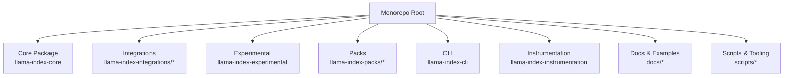
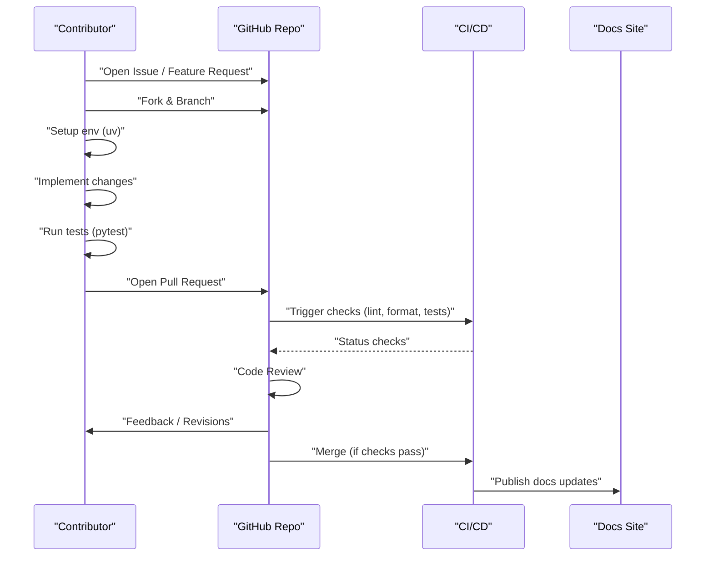
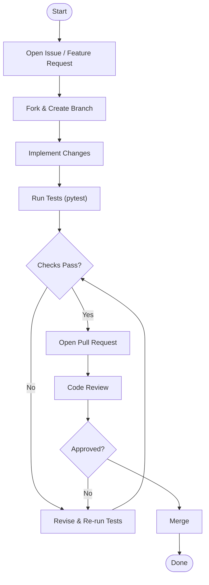
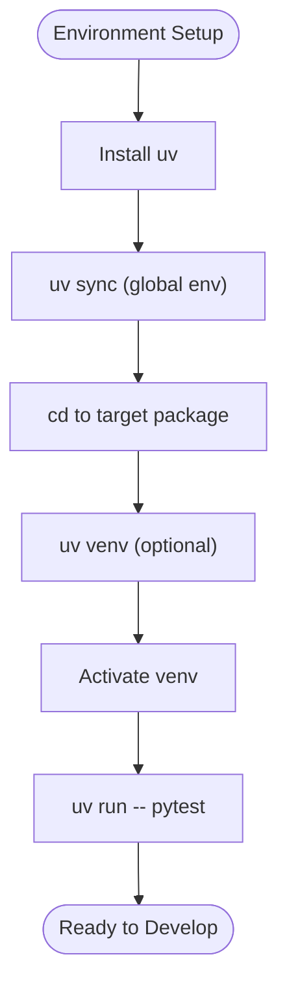
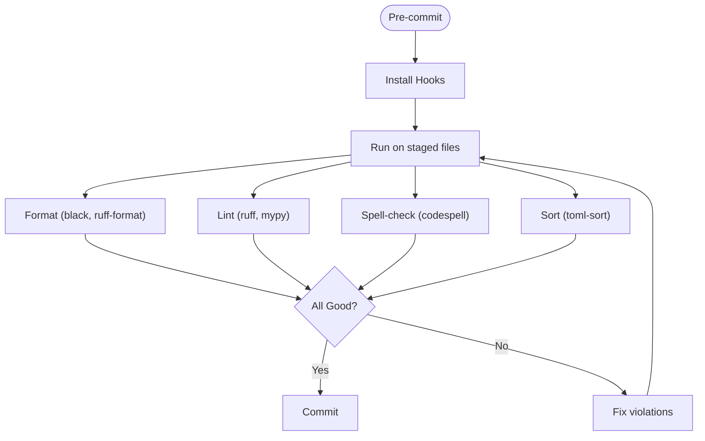
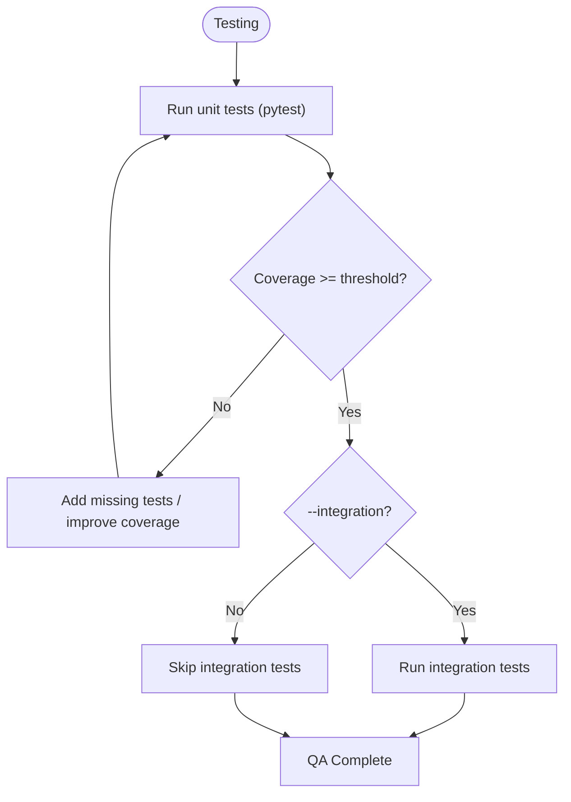
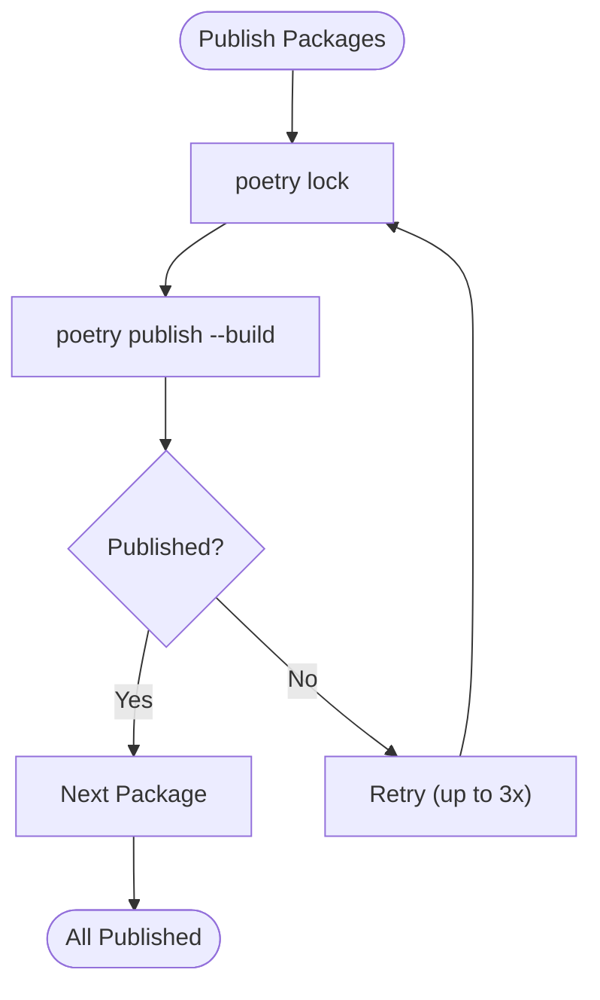
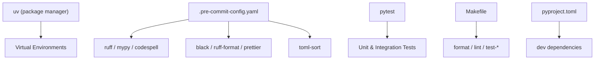

# Contribution Guidelines and Workflows

<cite>
**Referenced Files in This Document**
- [CONTRIBUTING.md](file://CONTRIBUTING.md)
- [CODE_OF_CONDUCT.md](file://CODE_OF_CONDUCT.md)
- [README.md](file://README.md)
- [SECURITY.md](file://SECURITY.md)
- [STALE.md](file://STALE.md)
- [Makefile](file://Makefile)
- [pyproject.toml](file://pyproject.toml)
- [.pre-commit-config.yaml](file://.pre-commit-config.yaml)
- [llama-index-core/tests/conftest.py](file://llama-index-core/tests/conftest.py)
- [llama-index-core/tests/ruff.toml](file://llama-index-core/tests/ruff.toml)
- [scripts/publish_packages.sh](file://scripts/publish_packages.sh)
</cite>

## Table of Contents
1. [Introduction](#introduction)
2. [Project Structure](#project-structure)
3. [Core Components](#core-components)
4. [Architecture Overview](#architecture-overview)
5. [Detailed Component Analysis](#detailed-component-analysis)
6. [Dependency Analysis](#dependency-analysis)
7. [Performance Considerations](#performance-considerations)
8. [Troubleshooting Guide](#troubleshooting-guide)
9. [Conclusion](#conclusion)
10. [Appendices](#appendices)

## Introduction
This document consolidates contribution guidelines and development workflows for the LlamaIndex ecosystem. It explains how to report issues, propose features, open pull requests, and participate in code reviews. It also covers environment setup, coding standards, testing requirements, documentation expectations, and quality assurance processes. Community participation, communication channels, governance, and maintainer responsibilities are outlined to support sustainable collaboration.

## Project Structure
LlamaIndex is organized as a monorepo containing:
- Core package for foundational APIs and modules
- Integrations for LLMs, embeddings, readers, vector stores, and related components
- Experimental modules and packs
- CLI and instrumentation packages
- Documentation and examples

Key entry points for contributors:
- Contribution process and environment setup are described in the contribution guide
- Community and communication channels are listed in the main README
- Code of Conduct governs interactions across community spaces

**Section sources**
- [README.md](file://README.md#L199-L224)
- [CONTRIBUTING.md](file://CONTRIBUTING.md#L197-L203)

## Core Components
This section summarizes contribution workflows and development standards grounded in repository files.

- Contribution pathways
  - Extend core modules (data loaders, node parsers, text splitters, vector stores, query engines, retrievers)
  - Contribute tools, readers, packs, datasets
  - Add new features
  - Fix bugs (use “good first issue” label on issues)
  - Share usage examples and experiments
  - Improve documentation and code quality

- Environment setup
  - Use uv as the package and project manager
  - Sync global environment for pre-commit hooks and linters
  - Activate virtual environments per project as needed
  - Run tests with pytest in the target package

- Testing and coverage
  - pytest is used for unit tests
  - Integration tests are gated behind a flag
  - Coverage thresholds are enforced by CI (less than 50% coverage fails CI by default)
  - Mock external dependencies for remote integrations to avoid flaky tests

- Coding standards and tooling
  - Pre-commit enforces formatting and linting (ruff, mypy, codespell, black, prettier, toml-sort)
  - Ruff configuration extends project-wide settings with test-specific allowances
  - Type checking is enabled with mypy and typed stubs

- Documentation standards
  - Documentation is built and previewed via Sphinx/Astro tooling
  - Formatting and linting apply to docs and examples

- Release and publishing
  - Publishing automation uses Poetry and a custom shell script with retry logic

**Section sources**
- [CONTRIBUTING.md](file://CONTRIBUTING.md#L75-L114)
- [CONTRIBUTING.md](file://CONTRIBUTING.md#L172-L192)
- [CONTRIBUTING.md](file://CONTRIBUTING.md#L195-L216)
- [Makefile](file://Makefile#L10-L14)
- [pyproject.toml](file://pyproject.toml#L111-L209)
- [.pre-commit-config.yaml](file://.pre-commit-config.yaml#L1-L121)
- [llama-index-core/tests/conftest.py](file://llama-index-core/tests/conftest.py#L169-L192)
- [llama-index-core/tests/ruff.toml](file://llama-index-core/tests/ruff.toml#L1-L5)
- [scripts/publish_packages.sh](file://scripts/publish_packages.sh#L1-L114)

## Architecture Overview
The contribution lifecycle spans issue triage, development, testing, review, and release.

**Diagram sources**
- [CONTRIBUTING.md](file://CONTRIBUTING.md#L172-L192)
- [Makefile](file://Makefile#L10-L14)
- [pyproject.toml](file://pyproject.toml#L111-L209)
- [README.md](file://README.md#L218-L224)

## Detailed Component Analysis

### Contribution Workflow
- Issue reporting and feature requests
  - Use GitHub Issues to report bugs and propose features
  - Search for “good first issue” for entry-level tasks
- Pull request procedure
  - Fork, branch, implement, test, and open PR
  - Ensure PR passes lint, format, and tests
- Code review process
  - Maintainers review PRs and may request changes
  - Iterate until approvals and CI checks pass

**Section sources**
- [CONTRIBUTING.md](file://CONTRIBUTING.md#L75-L114)
- [CONTRIBUTING.md](file://CONTRIBUTING.md#L172-L192)

### Development Environment Setup
- Install uv and initialize the global environment
- Navigate to the target package and run tests
- Optionally create and activate a virtual environment explicitly

**Section sources**
- [CONTRIBUTING.md](file://CONTRIBUTING.md#L26-L68)

### Coding Standards and Tooling
- Pre-commit hooks enforce:
  - Formatting (black, ruff-format, prettier)
  - Linting (ruff, mypy)
  - Spell-check (codespell)
  - TOML sorting
- Project-level linters and formatters are configured centrally
- Test-specific ruff allowances are isolated to test configurations

**Section sources**
- [.pre-commit-config.yaml](file://.pre-commit-config.yaml#L1-L121)
- [pyproject.toml](file://pyproject.toml#L111-L209)
- [llama-index-core/tests/ruff.toml](file://llama-index-core/tests/ruff.toml#L1-L5)

### Testing Requirements and Quality Assurance
- Unit tests
  - Run with pytest in the target package
  - Integration tests require an explicit flag
- Coverage
  - CI enforces minimum coverage thresholds
- Mocking
  - Mock external systems to avoid flaky tests
- Documentation builds
  - Use Sphinx/Astro tooling to build and watch docs

**Section sources**
- [CONTRIBUTING.md](file://CONTRIBUTING.md#L204-L215)
- [llama-index-core/tests/conftest.py](file://llama-index-core/tests/conftest.py#L169-L192)

### Documentation Standards
- Documentation is maintained alongside the codebase
- Formatting and linting apply to docs and examples
- Use Sphinx/Astro tooling to build and preview documentation

**Section sources**
- [Makefile](file://Makefile#L31-L32)
- [.pre-commit-config.yaml](file://.pre-commit-config.yaml#L65-L85)

### Release and Publishing
- Publishing uses Poetry with a custom script that:
  - Locks dependencies
  - Builds and publishes packages
  - Implements retries with backoff
  - Tracks permanent failures

**Section sources**
- [scripts/publish_packages.sh](file://scripts/publish_packages.sh#L39-L56)
- [scripts/publish_packages.sh](file://scripts/publish_packages.sh#L60-L95)

### Governance, Decision-Making, and Conflict Resolution
- Code of Conduct applies to all community spaces
- Enforcement responsibilities and steps are defined
- Reporting mechanisms and scope are documented

**Section sources**
- [CODE_OF_CONDUCT.md](file://CODE_OF_CONDUCT.md#L39-L67)
- [CODE_OF_CONDUCT.md](file://CODE_OF_CONDUCT.md#L69-L114)

### Communication Channels and Community Engagement
- Join the Discord community for discussions and collaboration
- Follow project social channels for updates

**Section sources**
- [README.md](file://README.md#L41-L49)
- [CONTRIBUTING.md](file://CONTRIBUTING.md#L218-L223)

### Security Practices
- Scope and in-scope targets for vulnerability reports
- Guidance on threat modeling and out-of-scope issues
- Reporting channels for LlamaCloud and general security concerns

**Section sources**
- [SECURITY.md](file://SECURITY.md#L5-L56)
- [SECURITY.md](file://SECURITY.md#L77-L88)

### Stale Package Policy
- Health scoring criteria (test coverage, download activity, commit activity)
- Effects of stale status and reactivation process
- Community transparency and collaboration goals

**Section sources**
- [STALE.md](file://STALE.md#L7-L38)
- [STALE.md](file://STALE.md#L40-L66)

## Dependency Analysis
The development stack integrates uv, pre-commit, pytest, and project-specific linters/formatters.

**Diagram sources**
- [CONTRIBUTING.md](file://CONTRIBUTING.md#L26-L68)
- [.pre-commit-config.yaml](file://.pre-commit-config.yaml#L1-L121)
- [Makefile](file://Makefile#L6-L32)
- [pyproject.toml](file://pyproject.toml#L5-L26)

**Section sources**
- [CONTRIBUTING.md](file://CONTRIBUTING.md#L26-L68)
- [.pre-commit-config.yaml](file://.pre-commit-config.yaml#L1-L121)
- [Makefile](file://Makefile#L6-L32)
- [pyproject.toml](file://pyproject.toml#L5-L26)

## Performance Considerations
- Keep tests deterministic by mocking external systems
- Prefer targeted test runs for faster feedback loops
- Use pre-commit to catch issues early and reduce CI overhead

[No sources needed since this section provides general guidance]

## Troubleshooting Guide
Common issues and resolutions:
- Pre-commit failures
  - Run pre-commit locally to fix formatting/linting issues
  - Ensure hooks are installed and up to date
- Test failures
  - Verify environment variables and credentials are mocked appropriately
  - Use the integration test flag only when necessary
- Coverage failures
  - Add unit tests for new logic
  - Aim for comprehensive coverage to meet CI thresholds

**Section sources**
- [.pre-commit-config.yaml](file://.pre-commit-config.yaml#L1-L121)
- [llama-index-core/tests/conftest.py](file://llama-index-core/tests/conftest.py#L121-L167)

## Conclusion
LlamaIndex welcomes contributions across core modules, integrations, and documentation. By following the established workflows—environment setup, coding standards, testing, and review—you can efficiently collaborate and sustain the project’s quality and growth. Engage respectfully through the stated channels, adhere to the Code of Conduct, and leverage the provided tooling to streamline development.

[No sources needed since this section summarizes without analyzing specific files]

## Appendices
- Practical contribution scenarios
  - Bug fix: reproduce with minimal example, add unit test, open PR
  - New integration: implement adapter following existing interfaces, add tests and docs, open PR
  - Major feature: propose in an issue, iterate with maintainers, implement in branches, open PR with tests and docs
- Becoming a maintainer and leadership
  - Demonstrate consistent, high-quality contributions over time
  - Participate actively in code reviews and community discussions
  - Mentor new contributors and uphold community standards
- Onboarding and mentorship
  - Start with “good first issue”
  - Engage on Discord for guidance
  - Pair with maintainers on significant changes

[No sources needed since this section provides general guidance]