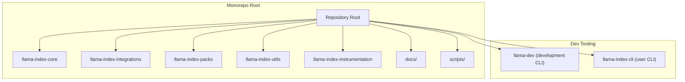
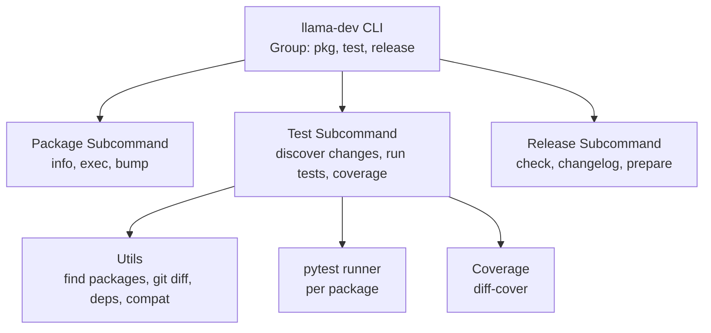
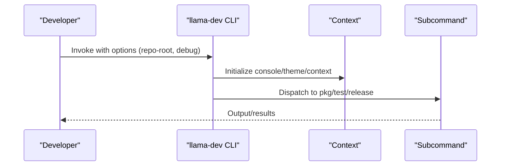
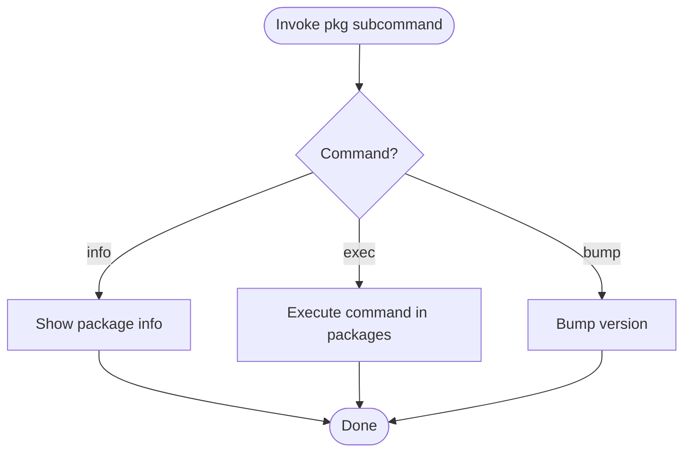
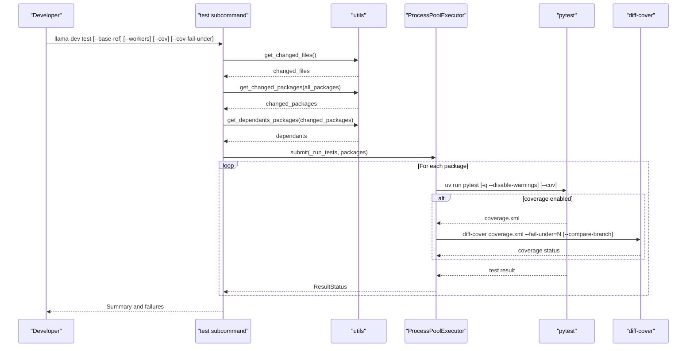
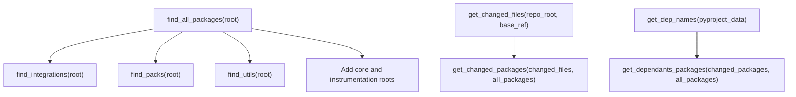
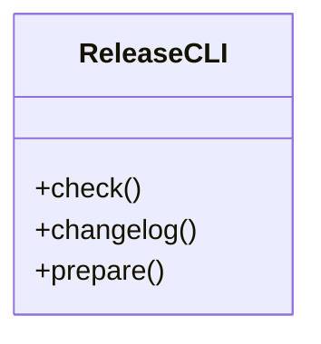
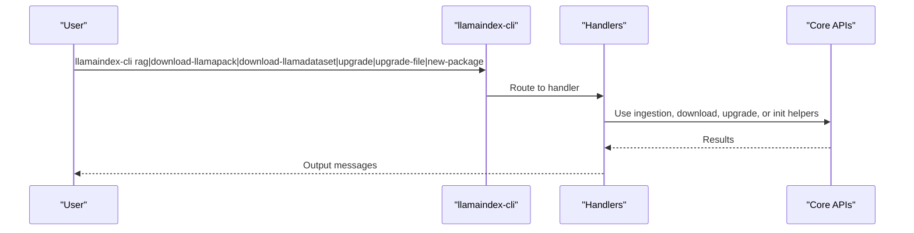
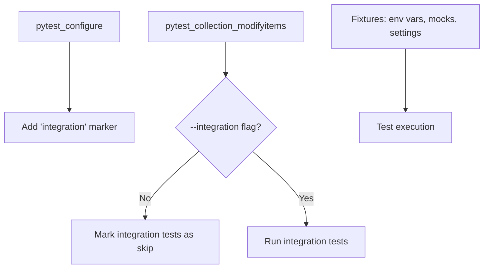
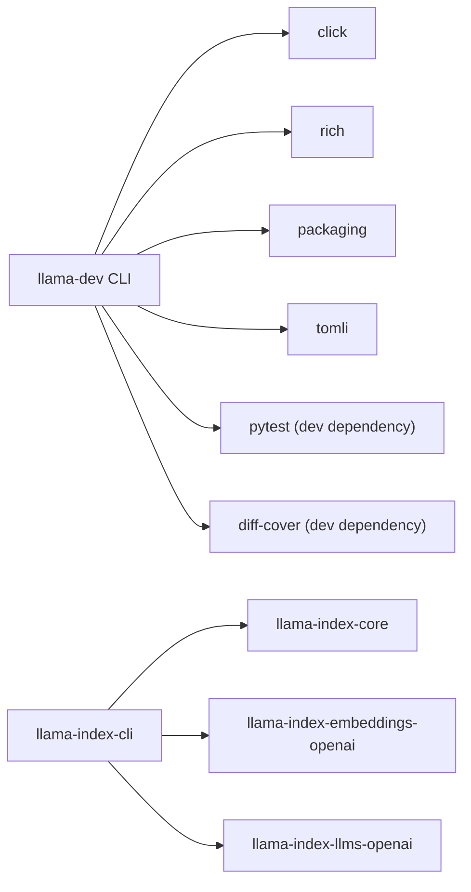

# Development Framework and Testing

<cite>
**Referenced Files in This Document**
- [README.md](file://README.md)
- [CONTRIBUTING.md](file://CONTRIBUTING.md)
- [Makefile](file://Makefile)
- [pyproject.toml](file://pyproject.toml)
- [llama-dev/README.md](file://llama-dev/README.md)
- [llama-dev/pyproject.toml](file://llama-dev/pyproject.toml)
- [llama-dev/llama_dev/cli.py](file://llama-dev/llama_dev/cli.py)
- [llama-dev/llama_dev/utils.py](file://llama-dev/llama_dev/utils.py)
- [llama-dev/llama_dev/test/__init__.py](file://llama-dev/llama_dev/test/__init__.py)
- [llama-dev/llama_dev/pkg/__init__.py](file://llama-dev/llama_dev/pkg/__init__.py)
- [llama-dev/llama_dev/release/__init__.py](file://llama-dev/llama_dev/release/__init__.py)
- [llama-dev/tests/test_cli.py](file://llama-dev/tests/test_cli.py)
- [llama-dev/tests/test_utils.py](file://llama-dev/tests/test_utils.py)
- [llama-index-cli/README.md](file://llama-index-cli/README.md)
- [llama-index-cli/pyproject.toml](file://llama-index-cli/pyproject.toml)
- [llama-index-cli/llama_index/cli/command_line.py](file://llama-index-cli/llama_index/cli/command_line.py)
- [llama-index-core/tests/conftest.py](file://llama-index-core/tests/conftest.py)
- [scripts/publish_packages.sh](file://scripts/publish_packages.sh)
</cite>

## Table of Contents
1. [Introduction](#introduction)
2. [Project Structure](#project-structure)
3. [Core Components](#core-components)
4. [Architecture Overview](#architecture-overview)
5. [Detailed Component Analysis](#detailed-component-analysis)
6. [Dependency Analysis](#dependency-analysis)
7. [Performance Considerations](#performance-considerations)
8. [Troubleshooting Guide](#troubleshooting-guide)
9. [Conclusion](#conclusion)
10. [Appendices](#appendices)

## Introduction
This document describes the LlamaIndex development framework and testing infrastructure with a focus on:
- Development CLI tools for package management, testing coordination, and utility functions
- Testing framework including test discovery, execution patterns, and coverage reporting
- Development utilities for code quality checks, dependency management, and build automation
- Testing infrastructure including fixtures, mock utilities, and integration testing patterns
- Development workflows for contributing to the LlamaIndex ecosystem
- Practical examples of using development tools for package creation, testing, and debugging
- Continuous integration patterns, automated testing, and quality assurance processes
- Guidance on extending development tools and contributing to the development ecosystem

## Project Structure
The repository is a monorepo composed of multiple packages and supporting tooling:
- Core packages under top-level directories such as llama-index-core, llama-index-integrations, llama-index-packs, llama-index-utils, and llama-index-instrumentation
- Development tooling under llama-dev (development CLI) and llama-index-cli (user-facing CLI)
- Scripts for release and publishing under scripts/
- Centralized documentation and examples under docs/

**Diagram sources**
- [README.md](file://README.md#L1-L224)
- [llama-dev/README.md](file://llama-dev/README.md#L1-L99)
- [llama-index-cli/README.md](file://llama-index-cli/README.md#L1-L31)

**Section sources**
- [README.md](file://README.md#L1-L224)
- [llama-dev/README.md](file://llama-dev/README.md#L1-L99)
- [llama-index-cli/README.md](file://llama-index-cli/README.md#L1-L31)

## Core Components
This section outlines the primary development utilities and testing infrastructure components.

- Development CLI (llama-dev)
  - Provides commands for package inspection, execution across packages, and release utilities
  - Built with Click and Rich for robust CLI UX
  - Supports parallel test execution, coverage enforcement, and dependency-aware test targeting

- Testing Infrastructure (llama-dev/test)
  - Smart test discovery based on changed files and dependents
  - Parallel execution with configurable worker count
  - Coverage computation and enforcement against base branches
  - Graceful skipping of incompatible Python versions and packages with no tests

- Utilities (llama-dev/utils)
  - Monorepo package discovery (core, integrations, packs, utils)
  - Git-based change detection and dependent package inference
  - Python version compatibility checks
  - Dependency name extraction from pyproject.toml

- User CLI (llama-index-cli)
  - Provides commands for RAG workflows, downloading packs/datasets, upgrading notebooks/files, and initializing new packages
  - Integrates with core ingestion and vector stores when available

- Core Testing Utilities (llama-index-core/tests/conftest.py)
  - Global pytest fixtures for mocking LLMs, embeddings, and environment variables
  - Integration test gating via CLI options
  - Network access controls and credential mocking

**Section sources**
- [llama-dev/llama_dev/cli.py](file://llama-dev/llama_dev/cli.py#L1-L45)
- [llama-dev/llama_dev/test/__init__.py](file://llama-dev/llama_dev/test/__init__.py#L1-L560)
- [llama-dev/llama_dev/utils.py](file://llama-dev/llama_dev/utils.py#L1-L221)
- [llama-dev/llama_dev/pkg/__init__.py](file://llama-dev/llama_dev/pkg/__init__.py#L1-L16)
- [llama-dev/llama_dev/release/__init__.py](file://llama-dev/llama_dev/release/__init__.py#L1-L16)
- [llama-index-cli/llama_index/cli/command_line.py](file://llama-index-cli/llama_index/cli/command_line.py#L1-L281)
- [llama-index-core/tests/conftest.py](file://llama-index-core/tests/conftest.py#L1-L192)

## Architecture Overview
The development framework orchestrates package discovery, change detection, parallel test execution, and coverage enforcement. The CLI delegates to subcommands for package management, testing, and release utilities.

**Diagram sources**
- [llama-dev/llama_dev/cli.py](file://llama-dev/llama_dev/cli.py#L24-L45)
- [llama-dev/llama_dev/pkg/__init__.py](file://llama-dev/llama_dev/pkg/__init__.py#L8-L16)
- [llama-dev/llama_dev/test/__init__.py](file://llama-dev/llama_dev/test/__init__.py#L72-L102)
- [llama-dev/llama_dev/utils.py](file://llama-dev/llama_dev/utils.py#L78-L134)

## Detailed Component Analysis

### Development CLI (llama-dev)
The CLI initializes a console theme, accepts a repository root and debug flag, and registers subcommands for package management, testing, and release utilities.

Key behaviors:
- Centralizes console configuration and context passing
- Delegates to submodules for functionality
- Uses Click decorators for robust argument parsing and help

**Diagram sources**
- [llama-dev/llama_dev/cli.py](file://llama-dev/llama_dev/cli.py#L24-L45)

**Section sources**
- [llama-dev/llama_dev/cli.py](file://llama-dev/llama_dev/cli.py#L1-L45)

### Package Management (llama-dev/pkg)
Provides commands to inspect packages, execute commands across packages, and bump versions.

Highlights:
- info: Inspect package metadata and structure
- exec: Run arbitrary commands in target packages (supports --all and fail-fast)
- bump: Increment semantic versions

**Diagram sources**
- [llama-dev/llama_dev/pkg/__init__.py](file://llama-dev/llama_dev/pkg/__init__.py#L8-L16)

**Section sources**
- [llama-dev/llama_dev/pkg/__init__.py](file://llama-dev/llama_dev/pkg/__init__.py#L1-L16)

### Testing Framework (llama-dev/test)
The test subcommand coordinates smart test execution across the monorepo.

Core logic:
- Change detection: git diff to identify changed files and affected packages
- Dependents discovery: infer downstream packages that depend on changed packages
- Execution: run tests in parallel with configurable workers
- Coverage: compute coverage and enforce thresholds against base branches
- Status reporting: Rich live table in local runs; periodic logs in CI

**Diagram sources**
- [llama-dev/llama_dev/test/__init__.py](file://llama-dev/llama_dev/test/__init__.py#L72-L102)
- [llama-dev/llama_dev/test/__init__.py](file://llama-dev/llama_dev/test/__init__.py#L147-L267)
- [llama-dev/llama_dev/test/__init__.py](file://llama-dev/llama_dev/test/__init__.py#L448-L560)

**Section sources**
- [llama-dev/llama_dev/test/__init__.py](file://llama-dev/llama_dev/test/__init__.py#L1-L560)

### Utilities (llama-dev/utils)
Utility functions enable monorepo-wide operations:
- Package discovery across categories (core, integrations, packs, utils)
- Git diff parsing for changed files
- Dependency name extraction from pyproject.toml
- Python version compatibility checks
- Dependents inference by matching dependency names

**Diagram sources**
- [llama-dev/llama_dev/utils.py](file://llama-dev/llama_dev/utils.py#L78-L134)
- [llama-dev/llama_dev/utils.py](file://llama-dev/llama_dev/utils.py#L136-L164)
- [llama-dev/llama_dev/utils.py](file://llama-dev/llama_dev/utils.py#L166-L174)
- [llama-dev/llama_dev/utils.py](file://llama-dev/llama_dev/utils.py#L204-L221)

**Section sources**
- [llama-dev/llama_dev/utils.py](file://llama-dev/llama_dev/utils.py#L1-L221)

### Release Utilities (llama-dev/release)
Release subcommands assist with release preparation:
- check: Validate readiness
- changelog: Generate/update changelog entries
- prepare: Prepare artifacts for release

**Diagram sources**
- [llama-dev/llama_dev/release/__init__.py](file://llama-dev/llama_dev/release/__init__.py#L8-L16)

**Section sources**
- [llama-dev/llama_dev/release/__init__.py](file://llama-dev/llama_dev/release/__init__.py#L1-L16)

### User CLI (llama-index-cli)
The user-facing CLI supports:
- RAG workflows with default ingestion pipeline
- Downloading LlamaPacks and LlamaDatasets
- Upgrading notebooks and Python files
- Initializing new packages with templates

**Diagram sources**
- [llama-index-cli/llama_index/cli/command_line.py](file://llama-index-cli/llama_index/cli/command_line.py#L149-L281)

**Section sources**
- [llama-index-cli/README.md](file://llama-index-cli/README.md#L1-L31)
- [llama-index-cli/pyproject.toml](file://llama-index-cli/pyproject.toml#L1-L73)
- [llama-index-cli/llama_index/cli/command_line.py](file://llama-index-cli/llama_index/cli/command_line.py#L1-L281)

### Core Testing Infrastructure (llama-index-core/tests/conftest.py)
Global fixtures and markers:
- Environment isolation and cleanup
- Mock LLMs and embeddings for deterministic tests
- Integration test gating via CLI option
- Network access controls and credential mocking

**Diagram sources**
- [llama-index-core/tests/conftest.py](file://llama-index-core/tests/conftest.py#L169-L192)
- [llama-index-core/tests/conftest.py](file://llama-index-core/tests/conftest.py#L32-L120)

**Section sources**
- [llama-index-core/tests/conftest.py](file://llama-index-core/tests/conftest.py#L1-L192)

## Dependency Analysis
The development tooling relies on a small set of core dependencies and integrates with external tools for execution and reporting.

**Diagram sources**
- [llama-dev/pyproject.toml](file://llama-dev/pyproject.toml#L5-L26)
- [llama-index-cli/pyproject.toml](file://llama-index-cli/pyproject.toml#L5-L47)

**Section sources**
- [llama-dev/pyproject.toml](file://llama-dev/pyproject.toml#L1-L41)
- [llama-index-cli/pyproject.toml](file://llama-index-cli/pyproject.toml#L1-L73)

## Performance Considerations
- Parallel execution: The test subcommand uses a process pool to run tests concurrently, configurable via the workers option. This reduces total wall-clock time for large monorepos.
- Coverage computation: Coverage XML is generated per package and validated with diff-cover against a base branch to enforce thresholds.
- Change-aware execution: By limiting test scope to changed packages and their dependents, unnecessary work is avoided.
- CI vs local: In CI, periodic status updates are printed; locally, a live Rich table provides real-time feedback.

[No sources needed since this section provides general guidance]

## Troubleshooting Guide
Common issues and resolutions:
- Installation failures during tests: The test runner captures uv sync and uv pip install errors and reports them. Review stderr for dependency conflicts or environment issues.
- No tests detected: Packages without a tests directory are skipped. Add tests or adjust package layout.
- Python version incompatibility: Packages specifying requires-python may be skipped if incompatible with the current interpreter. Align versions or run on supported interpreters.
- Timeout during test execution: A 300-second timeout prevents hanging jobs. Investigate slow tests or external dependencies.
- Coverage threshold failures: diff-cover enforces minimum coverage. Increase test coverage or adjust thresholds as needed.

Operational tips:
- Use --debug to increase verbosity and inspect full logs.
- Use --fail-fast to halt on first failure for quicker feedback loops.
- In CI, rely on periodic status updates; locally, monitor the live progress table.

**Section sources**
- [llama-dev/llama_dev/test/__init__.py](file://llama-dev/llama_dev/test/__init__.py#L363-L371)
- [llama-dev/llama_dev/test/__init__.py](file://llama-dev/llama_dev/test/__init__.py#L448-L560)

## Conclusion
The LlamaIndex development framework provides a cohesive set of tools for managing a complex monorepo:
- A powerful development CLI for package management, testing coordination, and release utilities
- A robust testing infrastructure that discovers relevant tests, executes them in parallel, and enforces coverage
- Strong utilities for monorepo navigation, change detection, and dependency inference
- A user-facing CLI for common workflows such as RAG, downloads, upgrades, and package initialization
- Comprehensive testing fixtures and integration gating for reliable development and CI

These components collectively streamline development, improve quality, and accelerate contributions across the ecosystem.

[No sources needed since this section summarizes without analyzing specific files]

## Appendices

### Development Workflows and Best Practices
- Contribution basics
  - Install uv and set up the environment as described in the contribution guide
  - Use uv sync for global hooks and linters, and uv run -- pytest for per-package tests
- Code standards and review
  - Follow the repository’s contribution guidelines for branching, committing, and opening pull requests
  - Ensure unit tests accompany new features and bug fixes
- Release procedures
  - Use the release subcommands to check readiness, update changelogs, and prepare releases
  - Publish packages using the provided script with retry logic and dependency-aware ordering

**Section sources**
- [CONTRIBUTING.md](file://CONTRIBUTING.md#L1-L231)
- [llama-dev/README.md](file://llama-dev/README.md#L1-L99)
- [llama-dev/llama_dev/release/__init__.py](file://llama-dev/llama_dev/release/__init__.py#L1-L16)

### Practical Examples
- Using the development CLI
  - Package info and execution across packages
  - Smart test runs against changed files with coverage enforcement
- Using the user CLI
  - Initialize a new package with templates
  - Download LlamaPacks and LlamaDatasets
  - Upgrade notebooks and Python files

**Section sources**
- [llama-dev/README.md](file://llama-dev/README.md#L26-L99)
- [llama-index-cli/README.md](file://llama-index-cli/README.md#L1-L31)
- [llama-index-cli/llama_index/cli/command_line.py](file://llama-index-cli/llama_index/cli/command_line.py#L23-L271)

### Continuous Integration and Quality Assurance
- CI patterns
  - Periodic status updates for long-running test suites
  - Coverage enforcement via diff-cover against base branches
  - Integration tests gated behind a CLI flag
- Automated publishing
  - A shell script coordinates dependency-aware publishing with retries and progress tracking

**Section sources**
- [llama-dev/llama_dev/test/__init__.py](file://llama-dev/llama_dev/test/__init__.py#L160-L217)
- [llama-index-core/tests/conftest.py](file://llama-index-core/tests/conftest.py#L169-L192)
- [scripts/publish_packages.sh](file://scripts/publish_packages.sh#L1-L114)