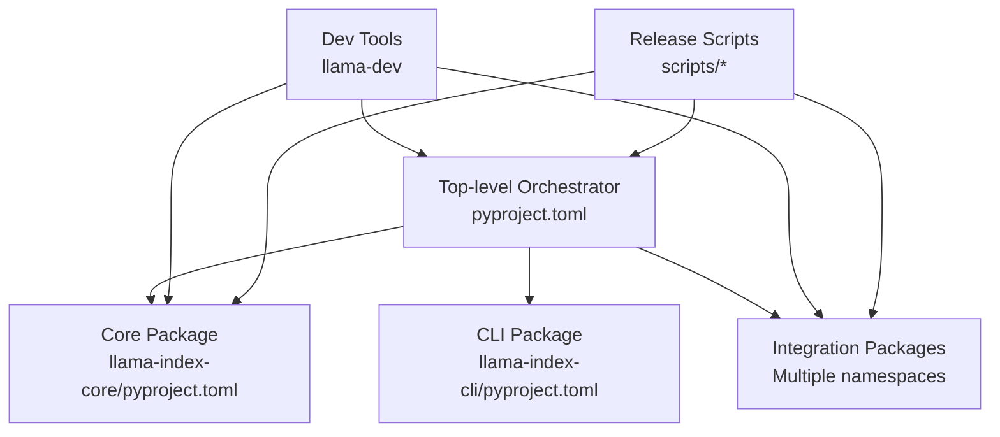
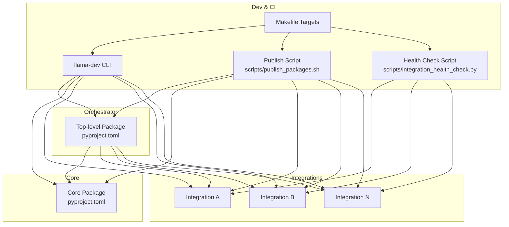
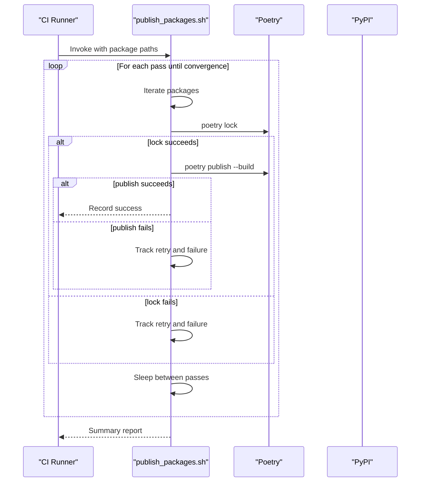
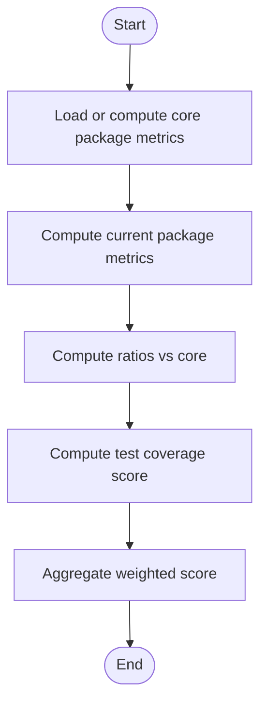
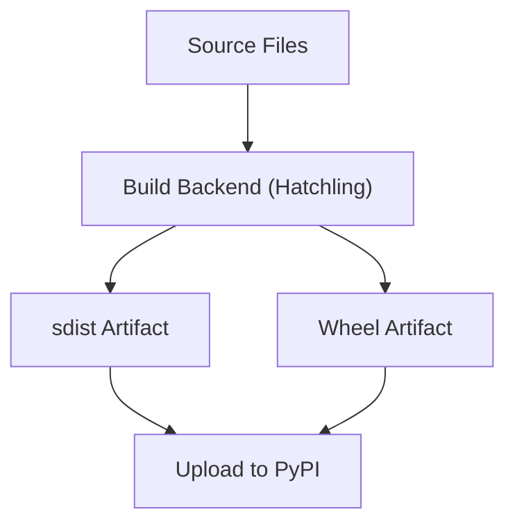
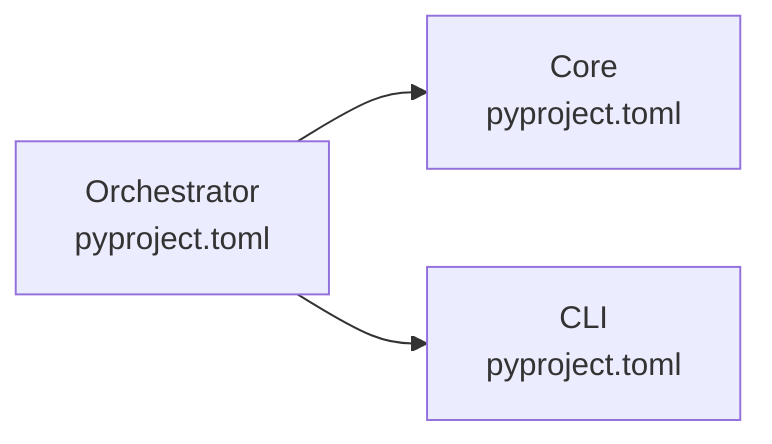

# Package Management and Releases

<cite>
**Referenced Files in This Document**
- [README.md](file://README.md)
- [CONTRIBUTING.md](file://CONTRIBUTING.md)
- [Makefile](file://Makefile)
- [pyproject.toml](file://pyproject.toml)
- [CHANGELOG.md](file://CHANGELOG.md)
- [RELEASE_HEAD.md](file://RELEASE_HEAD.md)
- [scripts/publish_packages.sh](file://scripts/publish_packages.sh)
- [scripts/integration_health_check.py](file://scripts/integration_health_check.py)
- [llama-index-core/pyproject.toml](file://llama-index-core/pyproject.toml)
- [llama-index-cli/pyproject.toml](file://llama-index-cli/pyproject.toml)
- [llama-dev/README.md](file://llama-dev/README.md)
- [llama-dev/pyproject.toml](file://llama-dev/pyproject.toml)
</cite>

## Table of Contents
1. [Introduction](#introduction)
2. [Project Structure](#project-structure)
3. [Core Components](#core-components)
4. [Architecture Overview](#architecture-overview)
5. [Detailed Component Analysis](#detailed-component-analysis)
6. [Dependency Analysis](#dependency-analysis)
7. [Performance Considerations](#performance-considerations)
8. [Troubleshooting Guide](#troubleshooting-guide)
9. [Conclusion](#conclusion)
10. [Appendices](#appendices)

## Introduction
This document describes the LlamaIndex package management and release processes with a focus on automation, publishing, and integration health. It explains how releases are prepared, how packages are built and published, how integration health is validated, and how stability and rollback are maintained. It also covers versioning strategies, dependency management, and CI/CD integration points.

## Project Structure
LlamaIndex is a monorepo containing:
- A top-level orchestrator package that aggregates core and selected integrations
- A core package with foundational APIs and utilities
- Many integration packages under dedicated namespaces
- Supporting tooling for development, testing, publishing, and health checks

Key entry points for release and packaging:
- Top-level build configuration and scripts
- Per-package build and dependency definitions
- Health-check and publishing automation scripts
- Monorepo-wide Makefile targets for testing and linting

**Diagram sources**
- [pyproject.toml](file://pyproject.toml#L34-L73)
- [llama-index-core/pyproject.toml](file://llama-index-core/pyproject.toml#L33-L84)
- [llama-index-cli/pyproject.toml](file://llama-index-cli/pyproject.toml#L27-L47)
- [llama-dev/README.md](file://llama-dev/README.md#L1-L99)
- [scripts/publish_packages.sh](file://scripts/publish_packages.sh#L1-L114)

**Section sources**
- [README.md](file://README.md#L1-L224)
- [pyproject.toml](file://pyproject.toml#L1-L229)
- [Makefile](file://Makefile#L1-L33)

## Core Components
- Top-level orchestrator package: Defines the primary distribution and aggregates core plus curated integrations.
- Core package: Fundamental APIs, utilities, and shared dependencies.
- CLI package: Command-line tools for development and release workflows.
- Integration packages: Third-party provider integrations, each with independent versioning and publishing.
- Dev tooling: CLI for monorepo operations, testing, and automation.
- Release scripts: Automation for publishing and integration health checks.

**Section sources**
- [pyproject.toml](file://pyproject.toml#L34-L73)
- [llama-index-core/pyproject.toml](file://llama-index-core/pyproject.toml#L33-L84)
- [llama-index-cli/pyproject.toml](file://llama-index-cli/pyproject.toml#L27-L47)
- [llama-dev/README.md](file://llama-dev/README.md#L1-L99)

## Architecture Overview
The release architecture centers on per-package build and publish steps coordinated by scripts and validated by health checks. The orchestrator package depends on core and selected integrations, while individual integration packages are versioned and published independently.

**Diagram sources**
- [pyproject.toml](file://pyproject.toml#L34-L73)
- [llama-index-core/pyproject.toml](file://llama-index-core/pyproject.toml#L33-L84)
- [llama-index-cli/pyproject.toml](file://llama-index-cli/pyproject.toml#L27-L47)
- [scripts/publish_packages.sh](file://scripts/publish_packages.sh#L1-L114)
- [scripts/integration_health_check.py](file://scripts/integration_health_check.py#L1-L463)
- [Makefile](file://Makefile#L1-L33)

## Detailed Component Analysis

### Release Automation and Changelog Generation
- Changelog management: A comprehensive changelog tracks changes across packages and dates, enabling release notes curation.
- Versioning: Packages define semantic version fields in their build configuration, enabling automated version bumps and releases.
- Release notes: A dedicated release notes file supports curated release notes aligned with changelog entries.

Practical workflow:
- Curate release notes from the changelog for the target release window.
- Update version fields in affected package configurations.
- Commit and tag releases as appropriate.

**Section sources**
- [CHANGELOG.md](file://CHANGELOG.md#L1-L800)
- [RELEASE_HEAD.md](file://RELEASE_HEAD.md#L1-L2)
- [pyproject.toml](file://pyproject.toml#L73-L73)
- [llama-index-core/pyproject.toml](file://llama-index-core/pyproject.toml#L34-L35)
- [llama-index-cli/pyproject.toml](file://llama-index-cli/pyproject.toml#L28-L29)

### Package Publishing Automation
The publishing automation script coordinates building and publishing packages with retry logic and failure reporting.

Key behaviors:
- Accepts a list of package paths to publish.
- Locks dependencies and builds/publishes each package.
- Implements a retry loop with a maximum attempt count per package.
- Aggregates permanent failures and unresolved dependency issues for reporting.

**Diagram sources**
- [scripts/publish_packages.sh](file://scripts/publish_packages.sh#L1-L114)

**Section sources**
- [scripts/publish_packages.sh](file://scripts/publish_packages.sh#L1-L114)

### Integration Health Checks
The integration health checker computes a normalized health score for packages by comparing metrics against the core package. It evaluates:
- Download trends and stability from PyPI
- Commit activity and consistency from the repository
- Test coverage heuristics derived from AST parsing of test files
- Weighted aggregation into a single score

**Diagram sources**
- [scripts/integration_health_check.py](file://scripts/integration_health_check.py#L264-L341)

**Section sources**
- [scripts/integration_health_check.py](file://scripts/integration_health_check.py#L1-L463)

### Versioning Strategies and Backward Compatibility
- Semantic versioning: Packages define explicit major/minor/patch versions in their build configuration.
- Dependency constraints: Carefully bounded ranges ensure compatibility across packages.
- Core-first strategy: The orchestrator package depends on core and curated integrations, guiding consumers toward stable combinations.

Recommendations:
- Align patch versions across related integrations for compatibility.
- Use caret (^) or tilde (~) ranges for non-breaking updates; strict bounds for breaking changes.
- Maintain changelog entries for every version bump to inform consumers.

**Section sources**
- [pyproject.toml](file://pyproject.toml#L73-L73)
- [llama-index-core/pyproject.toml](file://llama-index-core/pyproject.toml#L34-L35)
- [llama-index-cli/pyproject.toml](file://llama-index-cli/pyproject.toml#L28-L29)
- [pyproject.toml](file://pyproject.toml#L41-L50)

### Dependency Resolution, Build Verification, and Distribution
- Build backend: Hatchling is configured as the build backend across packages.
- Packaging targets: sdist and wheel targets are defined with include/exclude rules.
- Distribution: Publishing is orchestrated via Poetry commands in the automation script.

**Diagram sources**
- [pyproject.toml](file://pyproject.toml#L1-L3)
- [llama-index-core/pyproject.toml](file://llama-index-core/pyproject.toml#L106-L122)
- [llama-index-cli/pyproject.toml](file://llama-index-cli/pyproject.toml#L59-L65)

**Section sources**
- [pyproject.toml](file://pyproject.toml#L1-L3)
- [llama-index-core/pyproject.toml](file://llama-index-core/pyproject.toml#L106-L122)
- [llama-index-cli/pyproject.toml](file://llama-index-cli/pyproject.toml#L59-L65)

### CI/CD Pipeline Integration and Deployment Strategies
- Makefile targets: Provide standardized commands for formatting, linting, and running tests across core and integration packages.
- Development tooling: The llama-dev CLI simplifies monorepo operations, including package info and test execution.
- Publishing: The publish script integrates with Poetry to build and upload artifacts.

Recommended CI/CD stages:
- Lint and format checks
- Unit and integration tests
- Build verification (sdist/wheel)
- Publish to test PyPI, then production PyPI
- Post-release verification (health checks)

**Section sources**
- [Makefile](file://Makefile#L1-L33)
- [llama-dev/README.md](file://llama-dev/README.md#L1-L99)
- [scripts/publish_packages.sh](file://scripts/publish_packages.sh#L1-L114)

### Release Candidate Testing and Stability Validation
- Health scoring: Use the health checker to identify underperforming or risky integrations prior to release.
- Coverage enforcement: Enforce minimum test coverage thresholds in CI to ensure stability.
- Parallel testing: Use the dev CLI to run targeted tests across changed packages and their dependents.

**Section sources**
- [scripts/integration_health_check.py](file://scripts/integration_health_check.py#L357-L399)
- [Makefile](file://Makefile#L13-L29)
- [llama-dev/README.md](file://llama-dev/README.md#L61-L80)

### Rollback Procedures
- Tagged releases: Maintain Git tags for each release to enable quick rollbacks.
- Published artifacts: Keep older versions available on PyPI if necessary; coordinate with downstream consumers.
- Health regression detection: Use health checks to detect regressions post-release and trigger remediation.

**Section sources**
- [scripts/integration_health_check.py](file://scripts/integration_health_check.py#L357-L399)
- [README.md](file://README.md#L1-L224)

## Dependency Analysis
This section maps dependencies among key packages and highlights coupling and constraints.

**Diagram sources**
- [pyproject.toml](file://pyproject.toml#L41-L50)
- [llama-index-core/pyproject.toml](file://llama-index-core/pyproject.toml#L55-L84)
- [llama-index-cli/pyproject.toml](file://llama-index-cli/pyproject.toml#L43-L47)

**Section sources**
- [pyproject.toml](file://pyproject.toml#L41-L50)
- [llama-index-core/pyproject.toml](file://llama-index-core/pyproject.toml#L55-L84)
- [llama-index-cli/pyproject.toml](file://llama-index-cli/pyproject.toml#L43-L47)

## Performance Considerations
- Publishing throughput: The publish script retries and sleeps between passes to reduce contention; tune retry limits and sleep intervals for your infrastructure.
- Health checks: Caching of metrics and parallelization can improve performance when evaluating many packages.
- Build reproducibility: Use deterministic build backends and locked dependency sets to minimize build variance.

[No sources needed since this section provides general guidance]

## Troubleshooting Guide
Common issues and remedies:
- Dependency resolution failures during publish: Review transient dependency conflicts and adjust constraints; re-run the publish script to leverage retry logic.
- Health check anomalies: Verify PyPI availability and git repository access; ensure sufficient historical data for metrics.
- CI flakiness: Increase test timeouts, stabilize external integrations with mocks, and enforce coverage thresholds.

**Section sources**
- [scripts/publish_packages.sh](file://scripts/publish_packages.sh#L58-L95)
- [scripts/integration_health_check.py](file://scripts/integration_health_check.py#L82-L147)

## Conclusion
LlamaIndex employs a robust, script-driven release system with clear versioning, packaging, and health validation. The orchestrator package coordinates core and curated integrations, while per-package publishing and health checks ensure reliability. CI/CD integration through Makefile targets and the llama-dev CLI streamlines development and release operations.

[No sources needed since this section summarizes without analyzing specific files]

## Appendices

### Practical Release Workflow Checklist
- Curate release notes from the changelog
- Update version fields in affected packages
- Run lint and tests locally and via CI
- Build artifacts (sdist/wheel)
- Publish to test PyPI; validate
- Publish to production PyPI
- Run integration health checks
- Announce and document the release

**Section sources**
- [CHANGELOG.md](file://CHANGELOG.md#L1-L800)
- [pyproject.toml](file://pyproject.toml#L73-L73)
- [Makefile](file://Makefile#L10-L14)
- [scripts/publish_packages.sh](file://scripts/publish_packages.sh#L1-L114)
- [scripts/integration_health_check.py](file://scripts/integration_health_check.py#L357-L399)