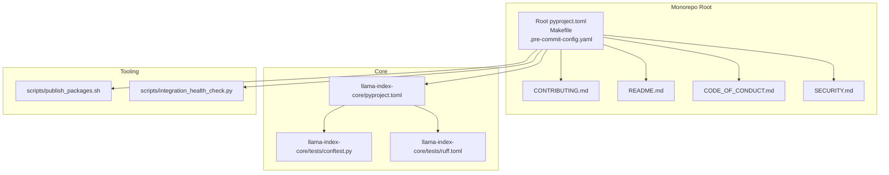
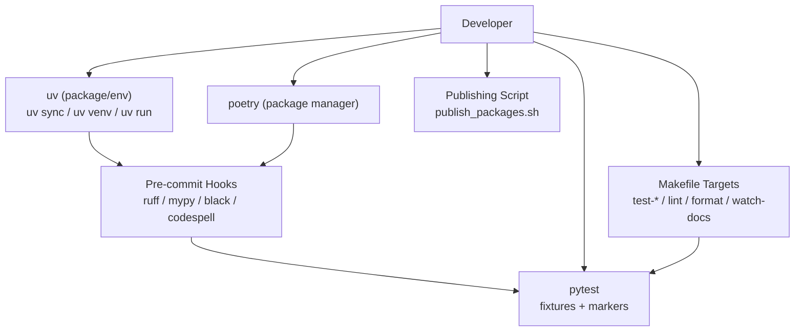
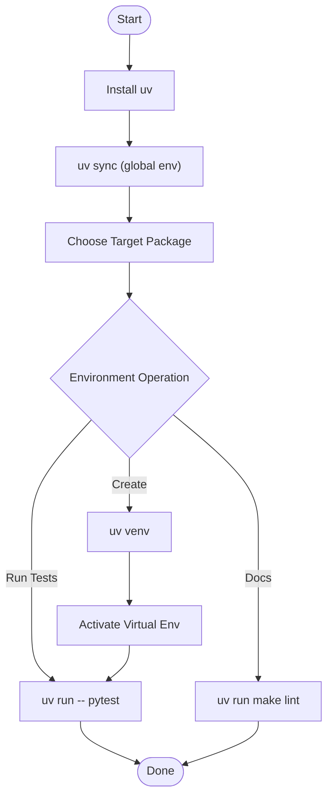
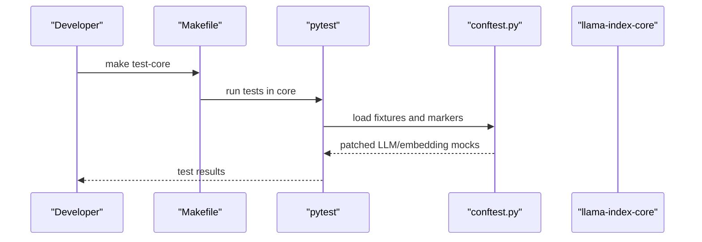
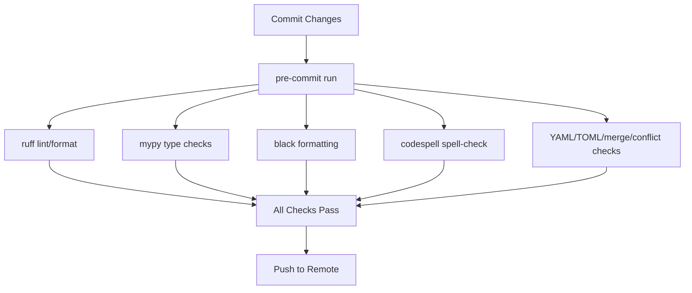
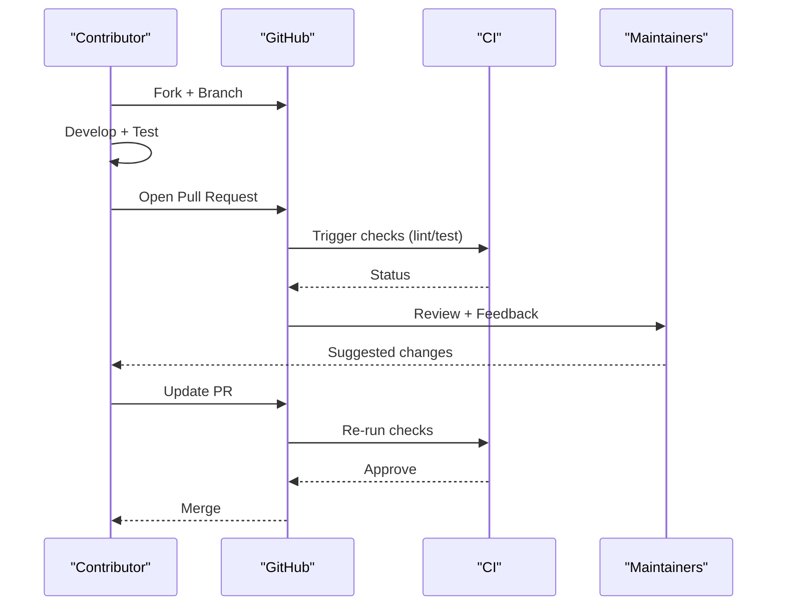
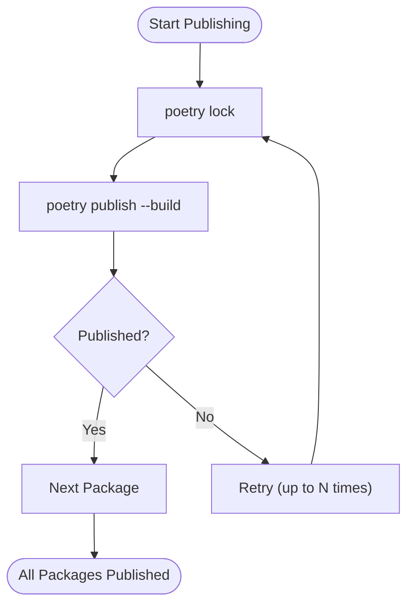
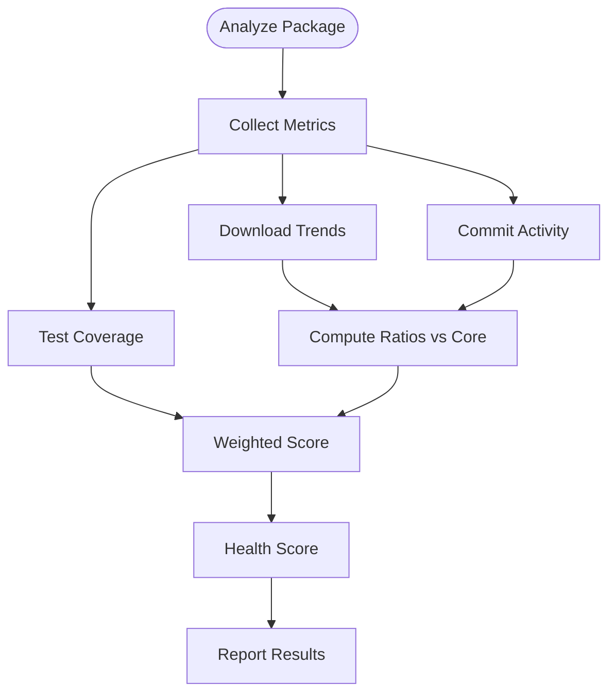
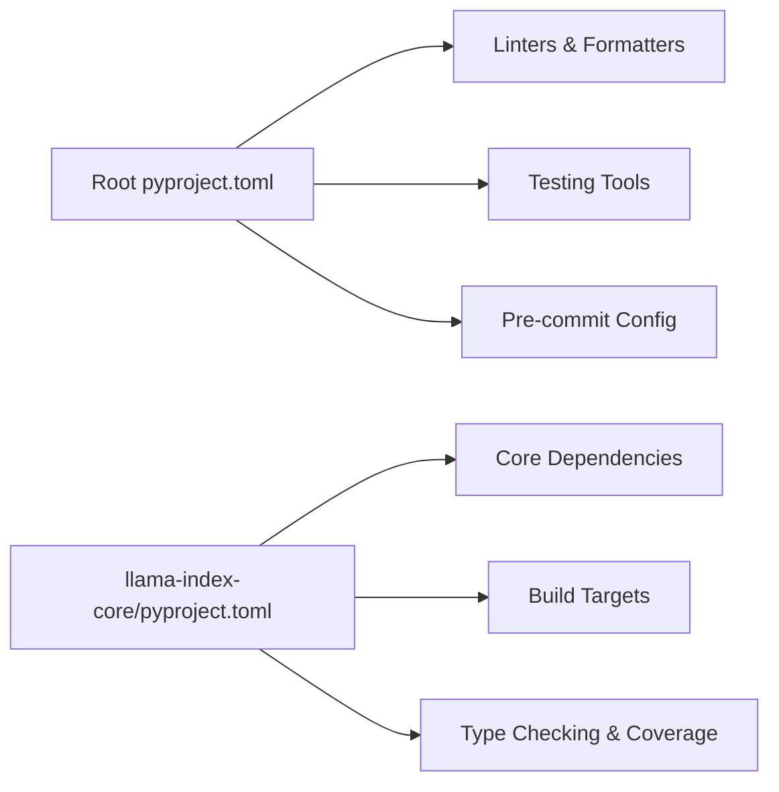

# Contributing and Development

<cite>
**Referenced Files in This Document**
- [CONTRIBUTING.md](file://CONTRIBUTING.md)
- [README.md](file://README.md)
- [CODE_OF_CONDUCT.md](file://CODE_OF_CONDUCT.md)
- [SECURITY.md](file://SECURITY.md)
- [pyproject.toml](file://pyproject.toml)
- [Makefile](file://Makefile)
- [.pre-commit-config.yaml](file://.pre-commit-config.yaml)
- [llama-index-core/pyproject.toml](file://llama-index-core/pyproject.toml)
- [llama-index-core/tests/conftest.py](file://llama-index-core/tests/conftest.py)
- [llama-index-core/tests/ruff.toml](file://llama-index-core/tests/ruff.toml)
- [scripts/publish_packages.sh](file://scripts/publish_packages.sh)
- [scripts/integration_health_check.py](file://scripts/integration_health_check.py)
</cite>

## Table of Contents
1. [Introduction](#introduction)
2. [Project Structure](#project-structure)
3. [Core Components](#core-components)
4. [Architecture Overview](#architecture-overview)
5. [Detailed Component Analysis](#detailed-component-analysis)
6. [Dependency Analysis](#dependency-analysis)
7. [Performance Considerations](#performance-considerations)
8. [Troubleshooting Guide](#troubleshooting-guide)
9. [Conclusion](#conclusion)
10. [Appendices](#appendices)

## Introduction
This document provides comprehensive guidance for contributing to and developing within the LlamaIndex ecosystem. It covers development setup, environment configuration, testing frameworks, code quality standards, contribution workflows, community resources, documentation expectations, release procedures, governance, and community guidelines. The goal is to enable contributors to confidently participate in building integrations, core modules, and related tooling while adhering to consistent standards and collaborative practices.

## Project Structure
LlamaIndex is organized as a monorepo containing:
- Core package: llama-index-core
- Integrations: llama-index-integrations (extensive collection of LLMs, embeddings, readers, vector stores, retrievers, etc.)
- Supporting packages: llama-index-cli, llama-index-finetuning, llama-index-instrumentation, llama-index-packs, llama-index-utils, and more
- Documentation and examples: docs and examples
- Developer tooling: scripts and internal dev utilities

Key entry points for contributors:
- Contribution workflow and quick start: CONTRIBUTING.md
- Community links and ecosystem overview: README.md
- Governance and conduct: CODE_OF_CONDUCT.md and SECURITY.md
- Tooling and standards: pyproject.toml, Makefile, .pre-commit-config.yaml
- Core testing fixtures and configuration: llama-index-core/tests/conftest.py and llama-index-core/tests/ruff.toml
- Packaging and publishing automation: scripts/publish_packages.sh
- Health checks for integrations: scripts/integration_health_check.py

**Diagram sources**
- [pyproject.toml](file://pyproject.toml#L1-L229)
- [Makefile](file://Makefile#L1-L33)
- [.pre-commit-config.yaml](file://.pre-commit-config.yaml#L1-L121)
- [CONTRIBUTING.md](file://CONTRIBUTING.md#L1-L231)
- [README.md](file://README.md#L1-L224)
- [CODE_OF_CONDUCT.md](file://CODE_OF_CONDUCT.md#L1-L129)
- [SECURITY.md](file://SECURITY.md#L1-L88)
- [llama-index-core/pyproject.toml](file://llama-index-core/pyproject.toml#L1-L149)
- [llama-index-core/tests/conftest.py](file://llama-index-core/tests/conftest.py#L1-L192)
- [llama-index-core/tests/ruff.toml](file://llama-index-core/tests/ruff.toml#L1-L5)
- [scripts/publish_packages.sh](file://scripts/publish_packages.sh#L1-L114)
- [scripts/integration_health_check.py](file://scripts/integration_health_check.py#L1-L463)

**Section sources**
- [README.md](file://README.md#L1-L224)
- [CONTRIBUTING.md](file://CONTRIBUTING.md#L1-L231)
- [pyproject.toml](file://pyproject.toml#L1-L229)
- [Makefile](file://Makefile#L1-L33)
- [.pre-commit-config.yaml](file://.pre-commit-config.yaml#L1-L121)

## Core Components
This section outlines the essential development components contributors will interact with regularly.

- Environment and package management
  - uv is the recommended package and project manager for Python packages in this repository. The quick start guide demonstrates installing uv and using uv sync to set up the global environment, uv venv to create per-project environments, and uv run to execute commands like pytest within the environment.
  - Poetry is referenced as the package manager for Python packages in general, and is used by the Makefile targets for running tests.

- Testing framework
  - pytest is the primary test runner. The Makefile includes targets for running tests across core and integration packages.
  - Integration tests require an opt-in marker and can be enabled via a CLI flag.
  - Core test fixtures configure environment variables, mocking for LLMs and embeddings, and network access policies.

- Code quality and linting
  - Pre-commit hooks enforce formatting and linting via ruff, mypy, black, codespell, and other checks.
  - Ruff and mypy configurations are centralized in pyproject.toml and extended/test-specific overrides exist under llama-index-core/tests/ruff.toml.

- Documentation and examples
  - The repository includes extensive documentation and examples. The Makefile includes a target to build and watch docs.

- Packaging and publishing
  - Scripts are provided to automate publishing of packages with retry logic and dependency resolution handling.

**Section sources**
- [CONTRIBUTING.md](file://CONTRIBUTING.md#L9-L71)
- [Makefile](file://Makefile#L13-L32)
- [llama-index-core/tests/conftest.py](file://llama-index-core/tests/conftest.py#L1-L192)
- [.pre-commit-config.yaml](file://.pre-commit-config.yaml#L1-L121)
- [pyproject.toml](file://pyproject.toml#L111-L229)
- [llama-index-core/tests/ruff.toml](file://llama-index-core/tests/ruff.toml#L1-L5)
- [scripts/publish_packages.sh](file://scripts/publish_packages.sh#L1-L114)

## Architecture Overview
The development architecture centers on a monorepo with standardized tooling and testing across packages. Contributors primarily interact with:
- Package-level pyproject.toml for dependencies and dev tooling
- Pre-commit hooks for automated quality checks
- pytest fixtures and markers for deterministic testing
- Makefile targets for running tests and building docs
- Scripts for packaging and publishing

**Diagram sources**
- [CONTRIBUTING.md](file://CONTRIBUTING.md#L9-L71)
- [Makefile](file://Makefile#L1-L33)
- [.pre-commit-config.yaml](file://.pre-commit-config.yaml#L1-L121)
- [pyproject.toml](file://pyproject.toml#L111-L229)
- [llama-index-core/tests/conftest.py](file://llama-index-core/tests/conftest.py#L1-L192)
- [scripts/publish_packages.sh](file://scripts/publish_packages.sh#L1-L114)

## Detailed Component Analysis

### Development Setup and Environment
- Install uv and initialize the environment globally, then navigate to a specific package and run uv sync or uv venv to create a project-specific environment.
- Activate the environment and run uv run -- pytest to execute tests within the environment.
- For documentation changes, run uv run make lint to validate spelling and style.

**Diagram sources**
- [CONTRIBUTING.md](file://CONTRIBUTING.md#L26-L68)

**Section sources**
- [CONTRIBUTING.md](file://CONTRIBUTING.md#L9-L71)

### Testing Framework and Workflows
- pytest is used across packages. The Makefile provides granular targets for running tests in core, integrations, fine-tuning, experimental, and packs.
- Integration tests are gated behind a marker and require an explicit CLI flag to run.
- Core test fixtures:
  - Set environment variables for testing
  - Patch text splitters and LLM predictor behavior
  - Provide mock LLM and embedding models
  - Configure OpenAI credentials for tests
  - Control network access via fixtures

**Diagram sources**
- [Makefile](file://Makefile#L16-L17)
- [llama-index-core/tests/conftest.py](file://llama-index-core/tests/conftest.py#L32-L192)

**Section sources**
- [Makefile](file://Makefile#L13-L32)
- [llama-index-core/tests/conftest.py](file://llama-index-core/tests/conftest.py#L1-L192)

### Code Quality and Linting Standards
- Pre-commit enforces:
  - ruff for linting and formatting
  - mypy for type checking
  - black for code formatting
  - codespell for spelling
  - Additional checks for YAML/TOML, merge conflicts, symlinks, and private keys
- Centralized configuration in pyproject.toml includes:
  - Ruff lint rules and ignores
  - mypy strictness and exclusions
  - codespell ignore lists and skips
- Test-specific ruff overrides allow exceptions for assertions in tests.

**Diagram sources**
- [.pre-commit-config.yaml](file://.pre-commit-config.yaml#L1-L121)
- [pyproject.toml](file://pyproject.toml#L111-L229)
- [llama-index-core/tests/ruff.toml](file://llama-index-core/tests/ruff.toml#L1-L5)

**Section sources**
- [.pre-commit-config.yaml](file://.pre-commit-config.yaml#L1-L121)
- [pyproject.toml](file://pyproject.toml#L111-L229)
- [llama-index-core/tests/ruff.toml](file://llama-index-core/tests/ruff.toml#L1-L5)

### Contribution Process
- Fork the repository, create a feature branch, and set up the environment using uv.
- Develop features or fix bugs with unit tests; ensure coverage meets minimum thresholds.
- Submit a pull request; maintainers will review and provide feedback.
- Community collaboration happens primarily on Discord.

**Diagram sources**
- [CONTRIBUTING.md](file://CONTRIBUTING.md#L172-L191)
- [README.md](file://README.md#L218-L223)

**Section sources**
- [CONTRIBUTING.md](file://CONTRIBUTING.md#L172-L191)
- [README.md](file://README.md#L218-L223)

### Documentation Standards
- Documentation is maintained alongside the codebase. The Makefile includes a target to build and watch docs.
- Pre-commit includes hooks to format documentation text and notebooks consistently.

**Section sources**
- [Makefile](file://Makefile#L31-L32)
- [.pre-commit-config.yaml](file://.pre-commit-config.yaml#L75-L84)

### Release Procedures
- Packaging and publishing are automated with a script that:
  - Locks dependencies
  - Builds and publishes packages
  - Implements retry logic and tracks failures
- The script supports passing multiple package paths and handles transient failures with retries.

**Diagram sources**
- [scripts/publish_packages.sh](file://scripts/publish_packages.sh#L39-L56)
- [scripts/publish_packages.sh](file://scripts/publish_packages.sh#L59-L95)

**Section sources**
- [scripts/publish_packages.sh](file://scripts/publish_packages.sh#L1-L114)

### Integration Health Monitoring
- A script calculates a relative health score for integrations and packs by comparing metrics such as:
  - Monthly downloads vs. core
  - Commit frequency and consistency vs. core
  - Test coverage thresholds
- Scores are weighted and cached for reproducibility.

**Diagram sources**
- [scripts/integration_health_check.py](file://scripts/integration_health_check.py#L264-L341)

**Section sources**
- [scripts/integration_health_check.py](file://scripts/integration_health_check.py#L1-L463)

## Dependency Analysis
- Centralized tooling and standards are defined in the root pyproject.toml, including:
  - Linters: ruff, mypy, black, codespell
  - Testing: pytest, pytest-asyncio, pytest-mock, pytest-cov
  - Formatting and sorting: black, toml-sort
  - Pre-commit: pre-commit hooks
- Core package dependencies and build targets are defined in llama-index-core/pyproject.toml, including:
  - Type checking and coverage configuration
  - Packaging includes static assets for NLTK and tiktoken caches

**Diagram sources**
- [pyproject.toml](file://pyproject.toml#L5-L26)
- [pyproject.toml](file://pyproject.toml#L111-L229)
- [llama-index-core/pyproject.toml](file://llama-index-core/pyproject.toml#L5-L31)
- [llama-index-core/pyproject.toml](file://llama-index-core/pyproject.toml#L99-L140)

**Section sources**
- [pyproject.toml](file://pyproject.toml#L1-L229)
- [llama-index-core/pyproject.toml](file://llama-index-core/pyproject.toml#L1-L149)

## Performance Considerations
- Keep tests deterministic by relying on fixtures and mocking external services.
- Prefer local caching of metrics and results (e.g., cached core metrics JSON) to reduce repeated computation.
- Use targeted Makefile test targets to minimize unnecessary work during development.

## Troubleshooting Guide
- Environment setup
  - Ensure uv is installed and uv sync has been run at the repository root.
  - If encountering permission or cache issues, verify the presence of NLTK and tiktoken caches bundled in the core package.
- Testing
  - Integration tests require the --integration flag; otherwise they are skipped.
  - Network-dependent tests may be disabled via fixtures; enable networking explicitly when needed.
  - Coverage thresholds are enforced; ensure new code includes sufficient tests.
- Linting and formatting
  - Run pre-commit install and pre-commit run to apply all checks locally before committing.
  - Use make lint to run all configured linters and formatters.
- Publishing
  - If publishing fails due to dependency resolution, the script retries up to a fixed number of times; inspect transient failures and resolve dependency conflicts.

**Section sources**
- [CONTRIBUTING.md](file://CONTRIBUTING.md#L26-L68)
- [Makefile](file://Makefile#L10-L11)
- [llama-index-core/tests/conftest.py](file://llama-index-core/tests/conftest.py#L169-L192)
- [scripts/publish_packages.sh](file://scripts/publish_packages.sh#L59-L95)

## Conclusion
This guide consolidates the essential practices for contributing to LlamaIndex. By following the environment setup, testing workflows, code quality standards, and contribution procedures outlined here, contributors can efficiently develop features, integrations, and improvements while maintaining consistency across the monorepo. Engaging with the community via Discord and adhering to the Code of Conduct ensures a welcoming and productive collaboration environment.

## Appendices

### Community Resources
- Join the community on Discord for discussions, Q&A, and collaboration.
- Explore LlamaHub for community-contributed integrations and data loaders.
- Follow official social channels for announcements and updates.

**Section sources**
- [README.md](file://README.md#L41-L49)
- [CONTRIBUTING.md](file://CONTRIBUTING.md#L218-L223)

### Code of Conduct and Security
- Adhere to the Contributor Covenant Code of Conduct in all interactions.
- Report security vulnerabilities according to the Security Policy, specifying in-scope targets and responsible disclosure procedures.

**Section sources**
- [CODE_OF_CONDUCT.md](file://CODE_OF_CONDUCT.md#L1-L129)
- [SECURITY.md](file://SECURITY.md#L1-L88)