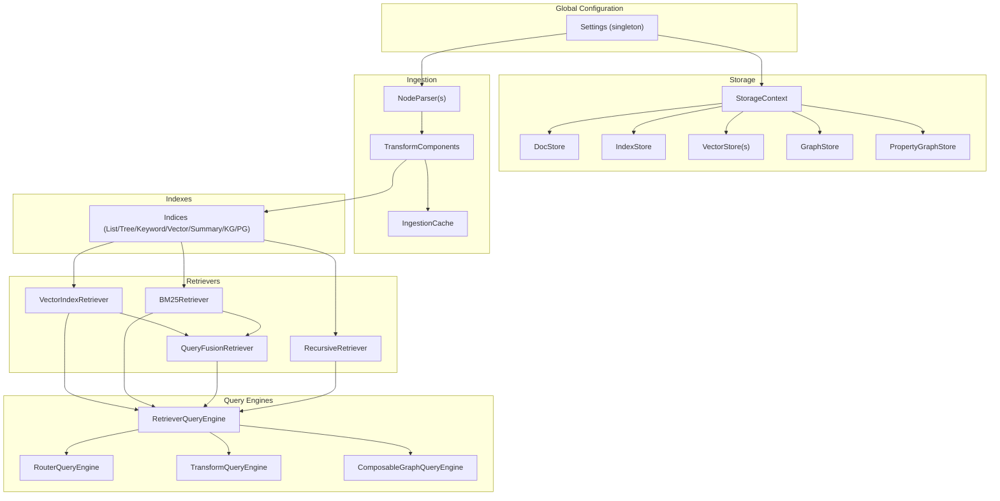
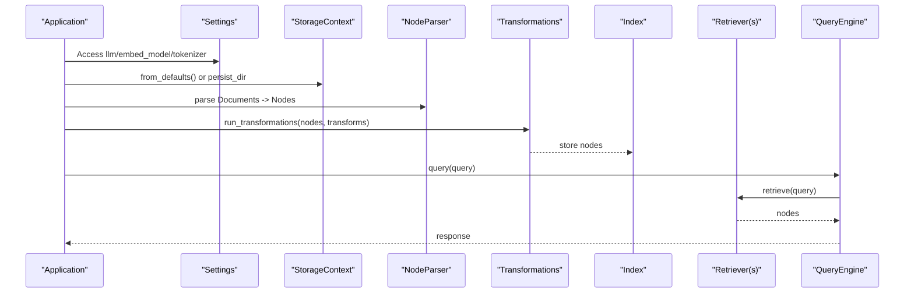
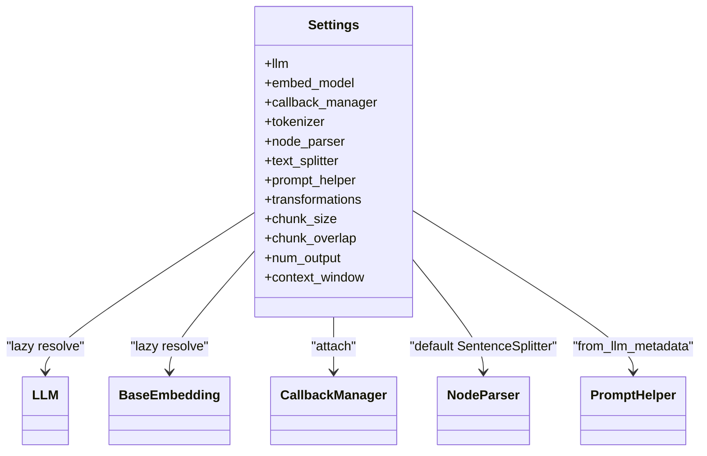
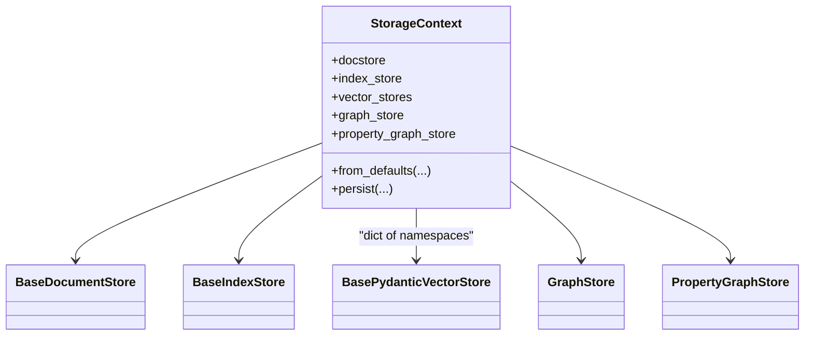
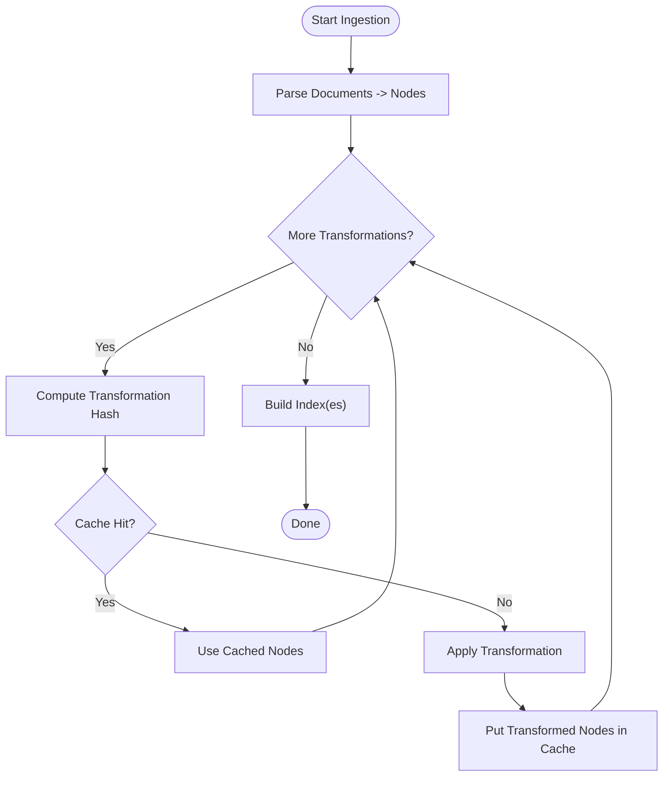
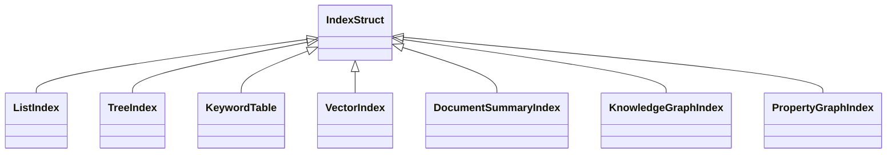
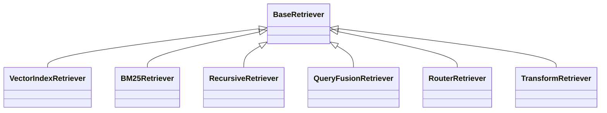
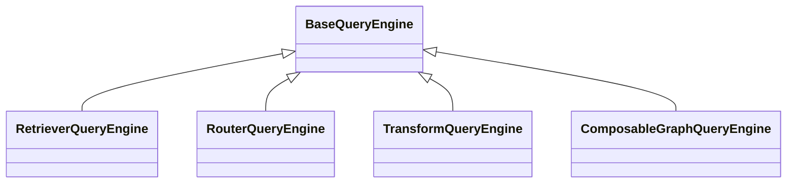
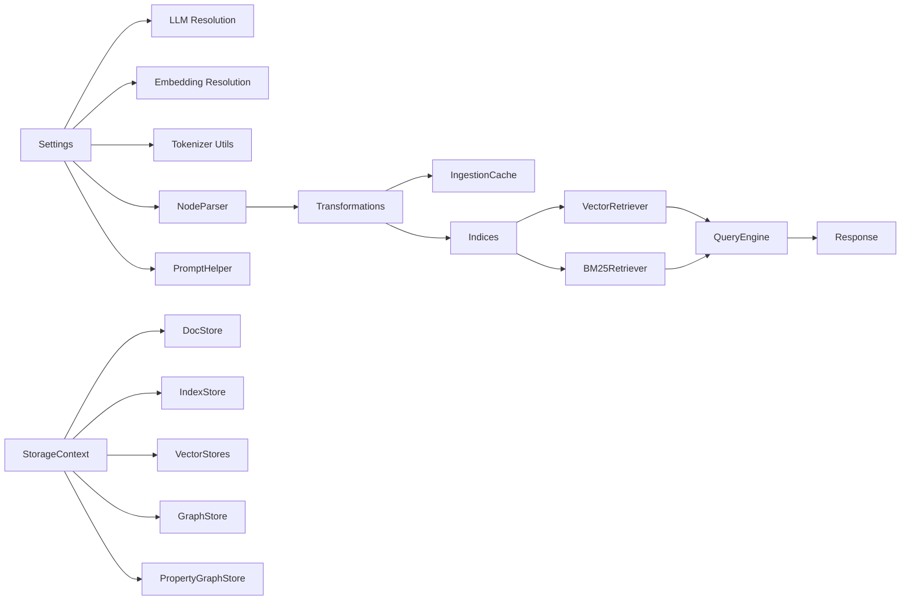

# Core Framework

<cite>
**Referenced Files in This Document**
- [__init__.py](file://llama-index-core/llama_index/core/__init__.py)
- [settings.py](file://llama-index-core/llama_index/core/settings.py)
- [service_context.py](file://llama-index-core/llama_index/core/service_context.py)
- [storage_context.py](file://llama-index-core/llama_index/core/storage/storage_context.py)
- [pipeline.py](file://llama-index-core/llama_index/core/ingestion/pipeline.py)
- [cache.py](file://llama-index-core/llama_index/core/ingestion/cache.py)
- [data_structs.py](file://llama-index-core/llama_index/core/data_structs/data_structs.py)
- [struct_type.py](file://llama-index-core/llama_index/core/data_structs/struct_type.py)
- [indices/__init__.py](file://llama-index-core/llama_index/core/indices/__init__.py)
- [node_parser/__init__.py](file://llama-index-core/llama_index/core/node_parser/__init__.py)
- [retrievers/__init__.py](file://llama-index-core/llama_index/core/retrievers/__init__.py)
- [query_engine/__init__.py](file://llama-index-core/llama_index/core/query_engine/__init__.py)
</cite>

## Table of Contents
1. [Introduction](#introduction)
2. [Project Structure](#project-structure)
3. [Core Components](#core-components)
4. [Architecture Overview](#architecture-overview)
5. [Detailed Component Analysis](#detailed-component-analysis)
6. [Dependency Analysis](#dependency-analysis)
7. [Performance Considerations](#performance-considerations)
8. [Troubleshooting Guide](#troubleshooting-guide)
9. [Conclusion](#conclusion)

## Introduction
This document explains the LlamaIndex core framework’s foundational building blocks that power Retrieval-Augmented Generation (RAG) applications. It covers:
- Global configuration via the Settings singleton and deprecation of ServiceContext
- Data ingestion pipeline with node parsing, metadata extraction, transformations, and caching
- Indexing systems (vector stores, keyword tables, tree structures, property graphs, document summaries)
- Retrieval engines (vector, BM25, fusion/hybrid, recursive)
- Query processing engines (simple, router, transform, composable)
- Practical usage patterns and component relationships

The goal is to help beginners understand RAG fundamentals and experienced developers implement efficient, scalable solutions using LlamaIndex’s core APIs.

## Project Structure
At the heart of the core framework are:
- Global configuration: Settings singleton and related utilities
- Storage context: Encapsulates persistent stores for documents, indices, vectors, and graphs
- Ingestion pipeline: Node parsing, transformations, and caching
- Indexing and retrieval: Pluggable index types and retrievers
- Query engines: Orchestration of retrieval and response synthesis

```mermaid
graph TB
subgraph "Global Configuration"
Settings["Settings (singleton)"]
end
subgraph "Storage"
SC["StorageContext"]
DS["DocStore"]
IS["IndexStore"]
VS["VectorStore(s)"]
GS["GraphStore"]
PGS["PropertyGraphStore"]
end
subgraph "Ingestion"
NP["NodeParser(s)"]
TR["TransformComponents"]
IC["IngestionCache"]
end
subgraph "Indexes"
IDX["Indices (List/Tree/Keyword/Vector/Summary/KG/PG)"]
end
subgraph "Retrievers"
VR["VectorIndexRetriever"]
BR["BM25Retriever"]
RR["RecursiveRetriever"]
FR["QueryFusionRetriever"]
end
subgraph "Query Engines"
QE["RetrieverQueryEngine"]
RQE["RouterQueryEngine"]
TQE["TransformQueryEngine"]
CGQE["ComposableGraphQueryEngine"]
end
Settings --> SC
SC --> DS
SC --> IS
SC --> VS
SC --> GS
SC --> PGS
Settings --> NP
NP --> TR
TR --> IC
TR --> IDX
IDX --> VR
IDX --> BR
IDX --> RR
VR --> FR
BR --> FR
VR --> QE
BR --> QE
FR --> QE
RR --> QE
QE --> RQE
QE --> TQE
QE --> CGQE
```

**Diagram sources**
- [settings.py](file://llama-index-core/llama_index/core/settings.py#L17-L248)
- [storage_context.py](file://llama-index-core/llama_index/core/storage/storage_context.py#L52-L278)
- [pipeline.py](file://llama-index-core/llama_index/core/ingestion/pipeline.py#L71-L172)
- [cache.py](file://llama-index-core/llama_index/core/ingestion/cache.py#L38-L78)
- [indices/__init__.py](file://llama-index-core/llama_index/core/indices/__init__.py#L1-L88)
- [retrievers/__init__.py](file://llama-index-core/llama_index/core/retrievers/__init__.py#L1-L89)
- [query_engine/__init__.py](file://llama-index-core/llama_index/core/query_engine/__init__.py#L1-L88)

**Section sources**
- [__init__.py](file://llama-index-core/llama_index/core/__init__.py#L70-L92)
- [settings.py](file://llama-index-core/llama_index/core/settings.py#L17-L248)
- [storage_context.py](file://llama-index-core/llama_index/core/storage/storage_context.py#L52-L278)

## Core Components
- Settings singleton: Centralizes defaults for LLM, embeddings, tokenizer, node parser, prompt helper, and transformations. Provides lazy initialization and integrates callback manager.
- StorageContext: Aggregates and persists the document, index, vector, graph, and property graph stores.
- Ingestion pipeline: Runs transformations in order, optionally caching results keyed by input nodes and transformation config.
- Indices: Pluggable index structures (list, tree, keyword, vector, document summary, knowledge graph, property graph).
- Retrievers: Vector, BM25, fusion/hybrid, recursive, router, and specialized retrievers.
- Query engines: Simple retrieval, router-based routing, transform-based preprocessing, and composable graph orchestration.

**Section sources**
- [settings.py](file://llama-index-core/llama_index/core/settings.py#L17-L248)
- [storage_context.py](file://llama-index-core/llama_index/core/storage/storage_context.py#L52-L278)
- [pipeline.py](file://llama-index-core/llama_index/core/ingestion/pipeline.py#L71-L172)
- [cache.py](file://llama-index-core/llama_index/core/ingestion/cache.py#L38-L78)
- [indices/__init__.py](file://llama-index-core/llama_index/core/indices/__init__.py#L1-L88)
- [retrievers/__init__.py](file://llama-index-core/llama_index/core/retrievers/__init__.py#L1-L89)
- [query_engine/__init__.py](file://llama-index-core/llama_index/core/query_engine/__init__.py#L1-L88)

## Architecture Overview
The core architecture follows a layered design:
- Configuration layer: Settings provides global defaults and lazy resolution of LLM/embeddings/tokenizer/node parser.
- Persistence layer: StorageContext manages stores and supports persistence to disk or remote filesystems.
- Ingestion layer: Node parsing and transformations produce nodes ready for indexing.
- Indexing layer: Nodes are stored in various index structures optimized for retrieval.
- Retrieval layer: Retrievers fetch candidate nodes for a query.
- Query layer: Query engines orchestrate retrieval, optional transformations, and synthesis.

```mermaid
sequenceDiagram
participant App as "Application"
participant Settings as "Settings"
participant SC as "StorageContext"
participant NP as "NodeParser"
participant TR as "Transformations"
participant IDX as "Index"
participant RET as "Retriever(s)"
participant QE as "QueryEngine"
App->>Settings : Access llm/embed_model/tokenizer
App->>SC : from_defaults() or persist_dir
App->>NP : parse Documents -> Nodes
App->>TR : run_transformations(nodes, transforms)
TR-->>IDX : store nodes
App->>QE : query(query)
QE->>RET : retrieve(query)
RET-->>QE : nodes
QE-->>App : response
```

**Diagram sources**
- [settings.py](file://llama-index-core/llama_index/core/settings.py#L32-L74)
- [storage_context.py](file://llama-index-core/llama_index/core/storage/storage_context.py#L73-L149)
- [pipeline.py](file://llama-index-core/llama_index/core/ingestion/pipeline.py#L71-L105)
- [indices/__init__.py](file://llama-index-core/llama_index/core/indices/__init__.py#L46-L50)
- [retrievers/__init__.py](file://llama-index-core/llama_index/core/retrievers/__init__.py#L40-L48)
- [query_engine/__init__.py](file://llama-index-core/llama_index/core/query_engine/__init__.py#L31-L33)

## Detailed Component Analysis

### Settings Singleton and Global Configuration
- Purpose: Provide a single source of truth for LLM, embeddings, tokenizer, node parser, prompt helper, and transformations.
- Lazy initialization: Components are resolved only when accessed.
- Integration: Callback manager is attached to LLM and embedding models; tokenizer is integrated with global utilities.
- Transformations: Defaults to a list containing the node parser; can be overridden.

```mermaid
classDiagram
class Settings {
+llm
+embed_model
+callback_manager
+tokenizer
+node_parser
+text_splitter
+prompt_helper
+transformations
+chunk_size
+chunk_overlap
+num_output
+context_window
}
class LLM
class BaseEmbedding
class CallbackManager
class NodeParser
class PromptHelper
Settings --> LLM : "lazy resolve"
Settings --> BaseEmbedding : "lazy resolve"
Settings --> CallbackManager : "attach"
Settings --> NodeParser : "default SentenceSplitter"
Settings --> PromptHelper : "from_llm_metadata"
```

**Diagram sources**
- [settings.py](file://llama-index-core/llama_index/core/settings.py#L17-L248)

**Section sources**
- [settings.py](file://llama-index-core/llama_index/core/settings.py#L17-L248)

### ServiceContext Migration Notes
- ServiceContext is deprecated. Use Settings or pass modules directly to local APIs.
- Global helpers remain for backward compatibility but are marked deprecated.

Practical migration:
- Replace global ServiceContext usage with Settings attributes.
- Pass explicit modules (LLM, embed_model, node_parser) to index constructors and query engines.

**Section sources**
- [service_context.py](file://llama-index-core/llama_index/core/service_context.py#L4-L48)
- [__init__.py](file://llama-index-core/llama_index/core/__init__.py#L70-L78)

### StorageContext and Persistence
- Responsibilities: Manage docstore, index store, vector stores (including named namespaces), graph store, and property graph store.
- Construction: from_defaults() creates simple stores or loads from persist_dir; supports fsspec filesystems.
- Persistence: persist() writes stores to disk with standardized filenames; vector stores saved per namespace.

```mermaid
classDiagram
class StorageContext {
+docstore
+index_store
+vector_stores
+graph_store
+property_graph_store
+from_defaults(...)
+persist(...)
}
class BaseDocumentStore
class BaseIndexStore
class BasePydanticVectorStore
class GraphStore
class PropertyGraphStore
StorageContext --> BaseDocumentStore
StorageContext --> BaseIndexStore
StorageContext --> BasePydanticVectorStore : "dict of namespaces"
StorageContext --> GraphStore
StorageContext --> PropertyGraphStore
```

**Diagram sources**
- [storage_context.py](file://llama-index-core/llama_index/core/storage/storage_context.py#L52-L278)

**Section sources**
- [storage_context.py](file://llama-index-core/llama_index/core/storage/storage_context.py#L52-L278)

### Data Processing Pipeline: Parsing, Transformations, and Caching
- Node parsing: SentenceSplitter by default; others available via node_parser module.
- Transformations: Ordered pipeline applied to nodes; each transformation receives the current nodes and returns new nodes.
- Caching: IngestionCache stores transformed nodes keyed by a hash of input nodes and transformation config. Supports collections and persistence for simple caches.

```mermaid
flowchart TD
Start(["Start Ingestion"]) --> Parse["Parse Documents -> Nodes"]
Parse --> Loop{"More Transformations?"}
Loop --> |Yes| Hash["Compute Transformation Hash"]
Hash --> CacheCheck{"Cache Hit?"}
CacheCheck --> |Yes| UseCache["Use Cached Nodes"]
CacheCheck --> |No| Apply["Apply Transformation"]
Apply --> PutCache["Put Transformed Nodes in Cache"]
PutCache --> Loop
UseCache --> Loop
Loop --> |No| Index["Build Index(es)"]
Index --> End(["Done"])
```

**Diagram sources**
- [pipeline.py](file://llama-index-core/llama_index/core/ingestion/pipeline.py#L71-L172)
- [cache.py](file://llama-index-core/llama_index/core/ingestion/cache.py#L38-L78)
- [node_parser/__init__.py](file://llama-index-core/llama_index/core/node_parser/__init__.py#L37-L41)

**Section sources**
- [pipeline.py](file://llama-index-core/llama_index/core/ingestion/pipeline.py#L71-L172)
- [cache.py](file://llama-index-core/llama_index/core/ingestion/cache.py#L38-L78)
- [node_parser/__init__.py](file://llama-index-core/llama_index/core/node_parser/__init__.py#L37-L41)

### Indexing Systems
Supported index structures include:
- ListIndex/SummaryIndex
- TreeIndex
- KeywordTableIndex/RAKEKeywordTableIndex/SimpleKeywordTableIndex
- VectorStoreIndex (and GPT variants)
- DocumentSummaryIndex
- KnowledgeGraphIndex
- PropertyGraphIndex
- MultiModalVectorStoreIndex
- Structured stores (SQL, pandas)

Index types are enumerated and mapped to internal struct types.

```mermaid
classDiagram
class IndexStruct
class ListIndex
class TreeIndex
class KeywordTable
class VectorIndex
class DocumentSummaryIndex
class KnowledgeGraphIndex
class PropertyGraphIndex
IndexStruct <|-- ListIndex
IndexStruct <|-- TreeIndex
IndexStruct <|-- KeywordTable
IndexStruct <|-- VectorIndex
IndexStruct <|-- DocumentSummaryIndex
IndexStruct <|-- KnowledgeGraphIndex
IndexStruct <|-- PropertyGraphIndex
```

**Diagram sources**
- [data_structs.py](file://llama-index-core/llama_index/core/data_structs/data_structs.py#L85-L245)
- [struct_type.py](file://llama-index-core/llama_index/core/data_structs/struct_type.py#L52-L90)
- [indices/__init__.py](file://llama-index-core/llama_index/core/indices/__init__.py#L4-L50)

**Section sources**
- [indices/__init__.py](file://llama-index-core/llama_index/core/indices/__init__.py#L1-L88)
- [data_structs.py](file://llama-index-core/llama_index/core/data_structs/data_structs.py#L85-L245)
- [struct_type.py](file://llama-index-core/llama_index/core/data_structs/struct_type.py#L52-L90)

### Retrieval Engines
Core retrievers include:
- VectorIndexRetriever and VectorIndexAutoRetriever
- BM25Retriever
- RecursiveRetriever
- QueryFusionRetriever (hybrid fusion)
- RouterRetriever
- TransformRetriever
- Specialized retrievers for lists, trees, keyword tables, knowledge graphs, and property graphs

```mermaid
classDiagram
class BaseRetriever
class VectorIndexRetriever
class BM25Retriever
class RecursiveRetriever
class QueryFusionRetriever
class RouterRetriever
class TransformRetriever
BaseRetriever <|-- VectorIndexRetriever
BaseRetriever <|-- BM25Retriever
BaseRetriever <|-- RecursiveRetriever
BaseRetriever <|-- QueryFusionRetriever
BaseRetriever <|-- RouterRetriever
BaseRetriever <|-- TransformRetriever
```

**Diagram sources**
- [retrievers/__init__.py](file://llama-index-core/llama_index/core/retrievers/__init__.py#L1-L89)

**Section sources**
- [retrievers/__init__.py](file://llama-index-core/llama_index/core/retrievers/__init__.py#L1-L89)

### Query Processing Engines
Available engines include:
- RetrieverQueryEngine (simple retrieval + synthesis)
- RouterQueryEngine (route to specialized engines)
- TransformQueryEngine (apply transformations before retrieval)
- ComposableGraphQueryEngine (compose multiple indices)
- SQL, JSONalyze, KnowledgeGraph, MultiModal, Retry variants, and more

```mermaid
classDiagram
class BaseQueryEngine
class RetrieverQueryEngine
class RouterQueryEngine
class TransformQueryEngine
class ComposableGraphQueryEngine
BaseQueryEngine <|-- RetrieverQueryEngine
BaseQueryEngine <|-- RouterQueryEngine
BaseQueryEngine <|-- TransformQueryEngine
BaseQueryEngine <|-- ComposableGraphQueryEngine
```

**Diagram sources**
- [query_engine/__init__.py](file://llama-index-core/llama_index/core/query_engine/__init__.py#L1-L88)

**Section sources**
- [query_engine/__init__.py](file://llama-index-core/llama_index/core/query_engine/__init__.py#L1-L88)

## Dependency Analysis
- Settings depends on LLM resolution, embedding resolution, tokenizer utilities, node parser defaults, and prompt helper construction.
- StorageContext aggregates stores and exposes persistence routines; vector stores are namespaced.
- Ingestion pipeline depends on node parsers and transformations; caching depends on a cache backend.
- Indices depend on storage context and vector/graph stores.
- Retrievers depend on indices and optionally BM25 corpora.
- Query engines orchestrate retrievers and synthesis.

```mermaid
graph LR
Settings --> LLMRes["LLM Resolution"]
Settings --> EmbRes["Embedding Resolution"]
Settings --> Tok["Tokenizer Utils"]
Settings --> NP["NodeParser"]
Settings --> PH["PromptHelper"]
SC["StorageContext"] --> DS["DocStore"]
SC --> IS["IndexStore"]
SC --> VS["VectorStores"]
SC --> GS["GraphStore"]
SC --> PGS["PropertyGraphStore"]
NP --> TR["Transformations"]
TR --> IC["IngestionCache"]
TR --> IDX["Indices"]
IDX --> VR["VectorRetriever"]
IDX --> BR["BM25Retriever"]
VR --> QE["QueryEngine"]
BR --> QE
QE --> OUT["Response"]
```

**Diagram sources**
- [settings.py](file://llama-index-core/llama_index/core/settings.py#L32-L74)
- [storage_context.py](file://llama-index-core/llama_index/core/storage/storage_context.py#L73-L149)
- [pipeline.py](file://llama-index-core/llama_index/core/ingestion/pipeline.py#L71-L105)
- [cache.py](file://llama-index-core/llama_index/core/ingestion/cache.py#L38-L78)
- [indices/__init__.py](file://llama-index-core/llama_index/core/indices/__init__.py#L46-L50)
- [retrievers/__init__.py](file://llama-index-core/llama_index/core/retrievers/__init__.py#L40-L48)
- [query_engine/__init__.py](file://llama-index-core/llama_index/core/query_engine/__init__.py#L31-L33)

**Section sources**
- [settings.py](file://llama-index-core/llama_index/core/settings.py#L17-L248)
- [storage_context.py](file://llama-index-core/llama_index/core/storage/storage_context.py#L52-L278)
- [pipeline.py](file://llama-index-core/llama_index/core/ingestion/pipeline.py#L71-L172)
- [cache.py](file://llama-index-core/llama_index/core/ingestion/cache.py#L38-L78)
- [indices/__init__.py](file://llama-index-core/llama_index/core/indices/__init__.py#L1-L88)
- [retrievers/__init__.py](file://llama-index-core/llama_index/core/retrievers/__init__.py#L1-L89)
- [query_engine/__init__.py](file://llama-index-core/llama_index/core/query_engine/__init__.py#L1-L88)

## Performance Considerations
- Use IngestionCache to avoid recomputation of expensive transformations.
- Tune chunk_size and chunk_overlap via Settings.node_parser to balance recall and cost.
- Prefer vector stores with native filtering and metadata support for large corpora.
- Use hybrid fusion (vector + BM25) judiciously; adjust top-k per retriever to reduce redundant work.
- Persist StorageContext to minimize cold-start costs during application restarts.
- Leverage async transformation runs for IO-bound steps.

[No sources needed since this section provides general guidance]

## Troubleshooting Guide
Common issues and remedies:
- ServiceContext errors: Replace with Settings usage or pass modules directly to APIs.
- Missing or incompatible node parser attributes: Ensure chunk_size/chunk_overlap are supported by the configured node parser.
- Cache not persisting: Only SimpleCache supports persistence; verify backend type.
- Retrieval quality: Adjust similarity_top_k, reranking, and fusion weights; validate BM25 corpus and tokenizer settings.

**Section sources**
- [service_context.py](file://llama-index-core/llama_index/core/service_context.py#L4-L48)
- [settings.py](file://llama-index-core/llama_index/core/settings.py#L154-L183)
- [cache.py](file://llama-index-core/llama_index/core/ingestion/cache.py#L55-L62)

## Conclusion
LlamaIndex’s core framework provides a cohesive, extensible foundation for RAG applications:
- Configure globally via Settings
- Persist state with StorageContext
- Transform and cache data efficiently with the ingestion pipeline
- Choose appropriate indices and retrievers for your workload
- Orchestrate queries with flexible query engines

Adopting these patterns ensures maintainability, scalability, and performance across diverse RAG scenarios.