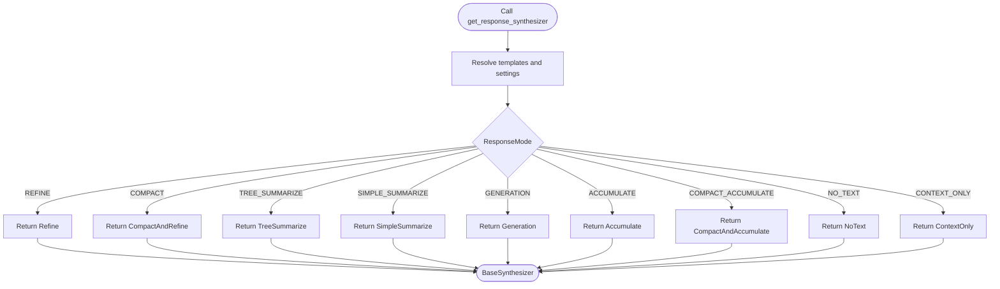

# Core Framework

<cite>
**Referenced Files in This Document**
- [__init__.py](file://llama-index-core/llama_index/core/__init__.py)
- [settings.py](file://llama-index-core/llama_index/core/settings.py)
- [service_context.py](file://llama-index-core/llama_index/core/service_context.py)
- [schema.py](file://llama-index-core/llama_index/core/schema.py)
- [types.py](file://llama-index-core/llama_index/core/types.py)
- [storage_context.py](file://llama-index-core/llama_index/core/storage/storage_context.py)
- [factory.py](file://llama-index-core/llama_index/core/response_synthesizers/factory.py)
- [base.py](file://llama-index-core/llama_index/core/callbacks/base.py)
</cite>

## Table of Contents
1. [Introduction](#introduction)
2. [Project Structure](#project-structure)
3. [Core Components](#core-components)
4. [Architecture Overview](#architecture-overview)
5. [Detailed Component Analysis](#detailed-component-analysis)
6. [Dependency Analysis](#dependency-analysis)
7. [Performance Considerations](#performance-considerations)
8. [Troubleshooting Guide](#troubleshooting-guide)
9. [Conclusion](#conclusion)

## Introduction
This document explains the LlamaIndex core framework’s foundational architecture and configuration model. It focuses on:
- The centralized Settings system that replaces the deprecated ServiceContext
- Modular component organization around Schema and Types
- Core API structure and usage patterns
- Practical examples of configuration and component relationships
- Design patterns used throughout the framework (factory, strategy, observer)

The goal is to help both beginners and experienced developers understand how to configure, compose, and extend the framework effectively.

## Project Structure
At the heart of the core are four pillars:
- Settings: Centralized configuration with lazy initialization and property-based accessors
- Schema: Data structures and type enums for nodes, documents, and relationships
- Types: Shared type definitions, output parsers, and program abstractions
- StorageContext: Container for persistence stores and vector stores


**Diagram sources**
- [settings.py](file://llama-index-core/llama_index/core/settings.py#L17-L248)
- [service_context.py](file://llama-index-core/llama_index/core/service_context.py#L4-L48)
- [storage_context.py](file://llama-index-core/llama_index/core/storage/storage_context.py#L52-L149)
- [schema.py](file://llama-index-core/llama_index/core/schema.py#L206-L246)
- [types.py](file://llama-index-core/llama_index/core/types.py#L137-L146)
- [factory.py](file://llama-index-core/llama_index/core/response_synthesizers/factory.py#L33-L151)
- [base.py](file://llama-index-core/llama_index/core/callbacks/base.py#L28-L85)

**Section sources**
- [__init__.py](file://llama-index-core/llama_index/core/__init__.py#L71-L81)
- [__init__.py](file://llama-index-core/llama_index/core/__init__.py#L78-L78)
- [__init__.py](file://llama-index-core/llama_index/core/__init__.py#L81-L81)

## Core Components
- Settings: A singleton dataclass that lazily resolves and exposes LLM, embedding model, callback manager, tokenizer, node parser, prompt helper, and transformations. It also exposes convenience aliases like text_splitter and prompt_helper-derived num_output and context_window.
- Schema: Defines BaseComponent, TransformComponent, NodeRelationship, ObjectType, MetadataMode, BaseNode, Node, TextNode, and related types. Provides serialization hooks and metadata handling.
- Types: Defines RESPONSE_TEXT_TYPE, BaseOutputParser, BasePydanticProgram, PydanticProgramMode, and a context-aware Thread wrapper.
- StorageContext: Holds and initializes document, index, graph, and vector stores, with persistence and deserialization helpers.
- ServiceContext: Deprecated in favor of Settings; attempting to instantiate raises an error and suggests migration.

Practical usage highlights:
- Replace ServiceContext with Settings for configuration
- Use StorageContext.from_defaults to bootstrap persistence stores
- Leverage Settings properties to access LLM, embeddings, and prompt helper
- Use the response synthesizer factory to select a strategy based on ResponseMode

**Section sources**
- [settings.py](file://llama-index-core/llama_index/core/settings.py#L17-L248)
- [schema.py](file://llama-index-core/llama_index/core/schema.py#L80-L188)
- [schema.py](file://llama-index-core/llama_index/core/schema.py#L206-L246)
- [schema.py](file://llama-index-core/llama_index/core/schema.py#L262-L482)
- [schema.py](file://llama-index-core/llama_index/core/schema.py#L612-L797)
- [types.py](file://llama-index-core/llama_index/core/types.py#L41-L101)
- [types.py](file://llama-index-core/llama_index/core/types.py#L103-L146)
- [storage_context.py](file://llama-index-core/llama_index/core/storage/storage_context.py#L52-L149)
- [service_context.py](file://llama-index-core/llama_index/core/service_context.py#L4-L48)

## Architecture Overview
The framework follows a layered design:
- Configuration layer: Settings centralizes defaults and lazy resolution
- Data layer: Schema defines the canonical data structures
- Strategy layer: Response synthesizer factory selects behavior based on mode
- Persistence layer: StorageContext manages stores and persistence
- Observability layer: CallbackManager observes lifecycle events


**Diagram sources**
- [settings.py](file://llama-index-core/llama_index/core/settings.py#L32-L74)
- [settings.py](file://llama-index-core/llama_index/core/settings.py#L198-L230)
- [factory.py](file://llama-index-core/llama_index/core/response_synthesizers/factory.py#L33-L79)
- [factory.py](file://llama-index-core/llama_index/core/response_synthesizers/factory.py#L57-L65)

## Detailed Component Analysis

### Settings: Centralized Configuration
Settings is a singleton dataclass that:
- Lazily resolves LLM, embedding model, callback manager, tokenizer, node parser, and prompt helper
- Exposes properties for pydantic_program_mode, chunk_size, chunk_overlap, num_output, context_window
- Provides aliases like text_splitter for node_parser
- Integrates with global handlers and tokenizers

Design pattern highlights:
- Factory pattern: resolve_* functions produce default instances
- Strategy pattern: response synthesizer factory chooses implementation based on mode
- Observer pattern: callback manager notifies handlers on event lifecycle


**Diagram sources**
- [settings.py](file://llama-index-core/llama_index/core/settings.py#L17-L248)
- [base.py](file://llama-index-core/llama_index/core/callbacks/base.py#L28-L85)

**Section sources**
- [settings.py](file://llama-index-core/llama_index/core/settings.py#L17-L248)

### Schema: Data Structures and Enums
Schema defines:
- BaseComponent and TransformComponent for serialization and transformation
- NodeRelationship, ObjectType, MetadataMode, and RelatedNodeInfo
- BaseNode, Node, TextNode with content, metadata, relationships, and hashing
- MediaResource for multimodal content

Key behaviors:
- Serialization hooks inject class_name for robust serde
- Metadata filtering based on MetadataMode
- Relationship navigation helpers (source, parent, children, etc.)


**Diagram sources**
- [schema.py](file://llama-index-core/llama_index/core/schema.py#L80-L188)
- [schema.py](file://llama-index-core/llama_index/core/schema.py#L262-L482)
- [schema.py](file://llama-index-core/llama_index/core/schema.py#L612-L797)

**Section sources**
- [schema.py](file://llama-index-core/llama_index/core/schema.py#L80-L188)
- [schema.py](file://llama-index-core/llama_index/core/schema.py#L206-L246)
- [schema.py](file://llama-index-core/llama_index/core/schema.py#L262-L482)
- [schema.py](file://llama-index-core/llama_index/core/schema.py#L612-L797)

### Types: Shared Types and Program Modes
Types provides:
- RESPONSE_TEXT_TYPE union for response generation
- BaseOutputParser with format and format_messages helpers
- BasePydanticProgram generic interface for LLM-powered functions
- PydanticProgramMode enumeration for different program modes
- Thread wrapper that preserves context across threads

```mermaid
classDiagram
class BaseOutputParser {
+parse(output)
+format(query)
+format_messages(messages)
}
class BasePydanticProgram~Model~ {
+output_cls : Type[Model]
+__call__(*args, **kwargs)
+acall(*args, **kwargs)
+stream_call(...)
+astream_call(...)
}
class PydanticProgramMode {
<<enum>>
DEFAULT
OPENAI
LLM
FUNCTION
GUIDANCE
"lm-format-enforcer"
}
```

**Diagram sources**
- [types.py](file://llama-index-core/llama_index/core/types.py#L41-L101)
- [types.py](file://llama-index-core/llama_index/core/types.py#L103-L146)
- [types.py](file://llama-index-core/llama_index/core/types.py#L137-L146)

**Section sources**
- [types.py](file://llama-index-core/llama_index/core/types.py#L33-L53)
- [types.py](file://llama-index-core/llama_index/core/types.py#L103-L146)
- [types.py](file://llama-index-core/llama_index/core/types.py#L137-L146)

### StorageContext: Persistence Stores
StorageContext encapsulates:
- docstore, index_store, vector_stores (namespaced), graph_store, property_graph_store
- from_defaults for simple or persisted initialization
- persist and to_dict/from_dict for serialization


**Diagram sources**
- [storage_context.py](file://llama-index-core/llama_index/core/storage/storage_context.py#L52-L149)
- [storage_context.py](file://llama-index-core/llama_index/core/storage/storage_context.py#L151-L203)
- [storage_context.py](file://llama-index-core/llama_index/core/storage/storage_context.py#L204-L266)

**Section sources**
- [storage_context.py](file://llama-index-core/llama_index/core/storage/storage_context.py#L52-L149)
- [storage_context.py](file://llama-index-core/llama_index/core/storage/storage_context.py#L151-L203)
- [storage_context.py](file://llama-index-core/llama_index/core/storage/storage_context.py#L204-L266)

### Response Synthesizer Factory: Strategy Pattern
The factory demonstrates a strategy pattern:
- Selects a BaseSynthesizer implementation based on ResponseMode
- Resolves llm, callback_manager, and prompt_helper from Settings when not provided
- Supports streaming, async, and structured output modes



**Diagram sources**
- [factory.py](file://llama-index-core/llama_index/core/response_synthesizers/factory.py#L33-L151)

**Section sources**
- [factory.py](file://llama-index-core/llama_index/core/response_synthesizers/factory.py#L33-L151)

### ServiceContext: Deprecation and Migration
ServiceContext is deprecated and raises an error on instantiation. The recommended migration path is to use Settings and pass modules directly to local APIs.


**Diagram sources**
- [service_context.py](file://llama-index-core/llama_index/core/service_context.py#L4-L48)

**Section sources**
- [service_context.py](file://llama-index-core/llama_index/core/service_context.py#L4-L48)

## Dependency Analysis
Settings depends on:
- LLM and embedding model resolvers
- CallbackManager for event observation
- Tokenizer utilities
- NodeParser and PromptHelper

Response Synthesizer Factory depends on:
- Settings for defaults
- LLM and PromptHelper
- Template selectors and response mode


**Diagram sources**
- [settings.py](file://llama-index-core/llama_index/core/settings.py#L32-L74)
- [settings.py](file://llama-index-core/llama_index/core/settings.py#L198-L230)
- [factory.py](file://llama-index-core/llama_index/core/response_synthesizers/factory.py#L33-L79)

**Section sources**
- [settings.py](file://llama-index-core/llama_index/core/settings.py#L32-L74)
- [settings.py](file://llama-index-core/llama_index/core/settings.py#L198-L230)
- [factory.py](file://llama-index-core/llama_index/core/response_synthesizers/factory.py#L33-L79)

## Performance Considerations
- Lazy initialization in Settings avoids unnecessary overhead until components are accessed
- Using StorageContext.from_defaults with a persist_dir enables efficient persistence and reuse of stores
- Choose ResponseMode based on workload characteristics (compact vs tree summarize vs accumulate)
- Tune chunk_size and chunk_overlap via Settings.node_parser to balance recall and cost

## Troubleshooting Guide
Common issues and resolutions:
- ServiceContext usage: Replace with Settings or pass modules directly to APIs
- Missing prompt helper: Settings will construct a default PromptHelper from LLM metadata
- Callback handler conflicts: Ensure unique handler types in CallbackManager
- Persistence failures: Verify persist_dir permissions and that stores support to_dict/from_dict

**Section sources**
- [service_context.py](file://llama-index-core/llama_index/core/service_context.py#L4-L48)
- [settings.py](file://llama-index-core/llama_index/core/settings.py#L198-L230)
- [base.py](file://llama-index-core/llama_index/core/callbacks/base.py#L57-L85)
- [storage_context.py](file://llama-index-core/llama_index/core/storage/storage_context.py#L204-L266)

## Conclusion
LlamaIndex’s core framework centers on a clean separation of concerns:
- Settings provides a unified, lazily-initialized configuration surface
- Schema and Types define robust, serializable data structures and shared abstractions
- StorageContext organizes persistence stores
- Response Synthesizer Factory applies strategy and factory patterns to choose behavior
- ServiceContext is deprecated in favor of explicit configuration via Settings and local module injection

Adopting Settings and StorageContext simplifies configuration, improves modularity, and aligns with modern Python packaging and dependency injection practices.