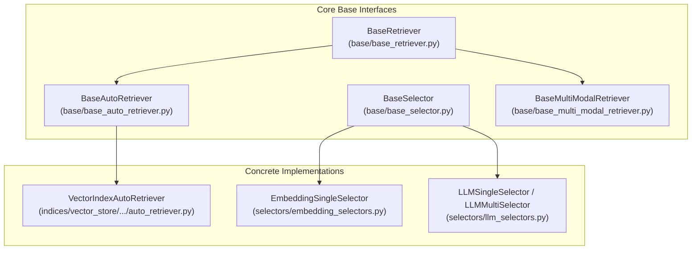
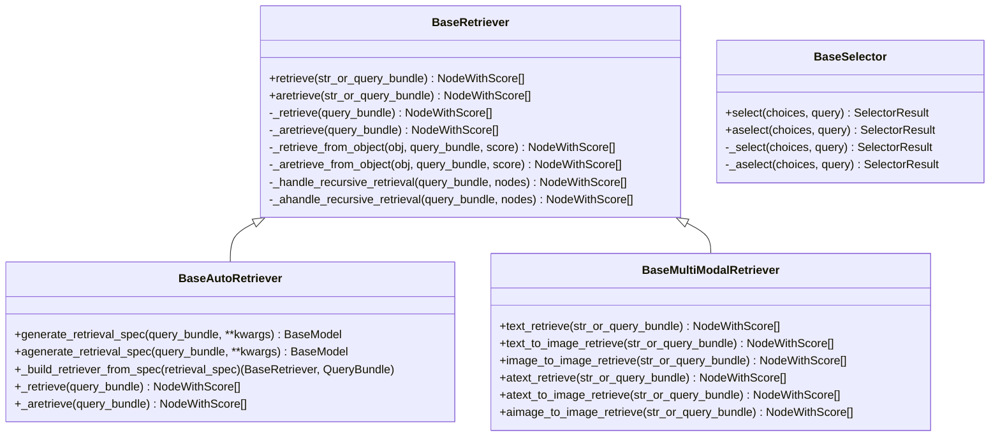
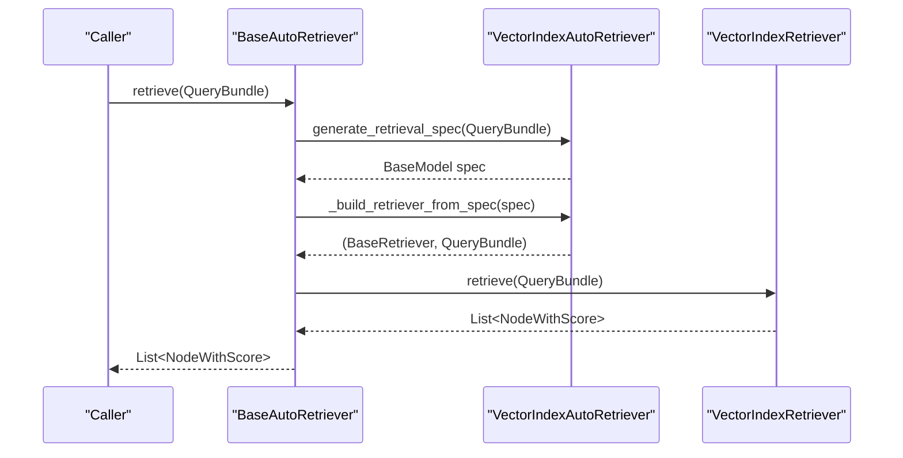
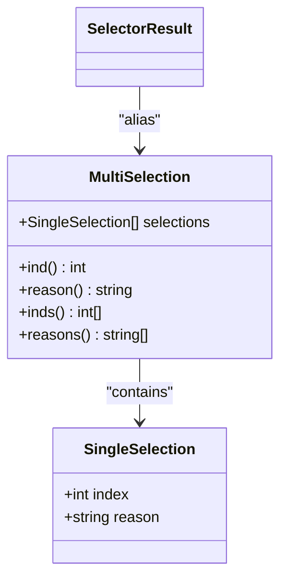
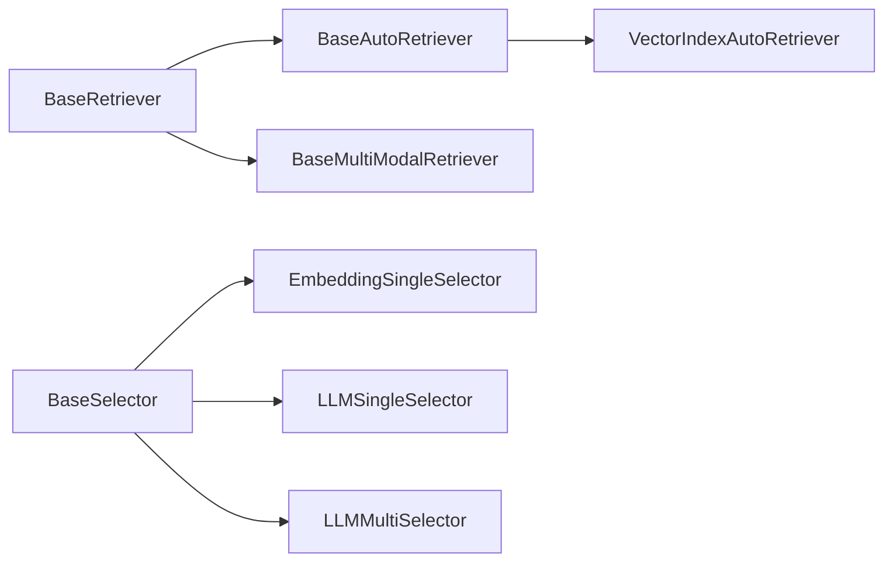

# Base Interfaces and Abstract Classes

<cite>
**Referenced Files in This Document**
- [base_auto_retriever.py](file://llama-index-core/llama_index/core/base/base_auto_retriever.py)
- [base_retriever.py](file://llama-index-core/llama_index/core/base/base_retriever.py)
- [base_selector.py](file://llama-index-core/llama_index/core/base/base_selector.py)
- [base_multi_modal_retriever.py](file://llama-index-core/llama_index/core/base/base_multi_modal_retriever.py)
- [auto_retriever.py](file://llama-index-core/llama_index/core/indices/vector_store/retrievers/auto_retriever/auto_retriever.py)
- [embedding_selectors.py](file://llama-index-core/llama_index/core/selectors/embedding_selectors.py)
- [llm_selectors.py](file://llama-index-core/llama_index/core/selectors/llm_selectors.py)
</cite>

## Table of Contents
1. [Introduction](#introduction)
2. [Project Structure](#project-structure)
3. [Core Components](#core-components)
4. [Architecture Overview](#architecture-overview)
5. [Detailed Component Analysis](#detailed-component-analysis)
6. [Dependency Analysis](#dependency-analysis)
7. [Performance Considerations](#performance-considerations)
8. [Troubleshooting Guide](#troubleshooting-guide)
9. [Conclusion](#conclusion)

## Introduction
This document explains the fundamental base interfaces that underpin retrieval and selection capabilities in LlamaIndex. It focuses on:
- BaseAutoRetriever: automatic retrieval specification generation (sync and async) and dynamic retriever construction
- BaseSelector: node/tool selection strategies (single and multi-selection) with sync and async variants
- BaseMultiModalRetriever: multi-modal retrieval supporting text and image queries
It also documents inheritance hierarchies, required abstract methods, parameter validation, and concrete extension examples.

## Project Structure
The base interfaces live under the core base module and are extended by concrete implementations across retrievers, selectors, and multi-modal components.

**Diagram sources**
- [base_retriever.py](file://llama-index-core/llama_index/core/base/base_retriever.py#L34-L275)
- [base_auto_retriever.py](file://llama-index-core/llama_index/core/base/base_auto_retriever.py#L9-L44)
- [base_selector.py](file://llama-index-core/llama_index/core/base/base_selector.py#L72-L104)
- [base_multi_modal_retriever.py](file://llama-index-core/llama_index/core/base/base_multi_modal_retriever.py#L12-L78)
- [auto_retriever.py](file://llama-index-core/llama_index/core/indices/vector_store/retrievers/auto_retriever/auto_retriever.py#L37-L245)
- [embedding_selectors.py](file://llama-index-core/llama_index/core/selectors/embedding_selectors.py#L16-L94)
- [llm_selectors.py](file://llama-index-core/llama_index/core/selectors/llm_selectors.py#L49-L235)

**Section sources**
- [base_retriever.py](file://llama-index-core/llama_index/core/base/base_retriever.py#L1-L275)
- [base_auto_retriever.py](file://llama-index-core/llama_index/core/base/base_auto_retriever.py#L1-L44)
- [base_selector.py](file://llama-index-core/llama_index/core/base/base_selector.py#L1-L104)
- [base_multi_modal_retriever.py](file://llama-index-core/llama_index/core/base/base_multi_modal_retriever.py#L1-L78)

## Core Components
- BaseRetriever: foundational retrieval interface with synchronous and asynchronous retrieval entry points, recursive retrieval handling, and instrumentation hooks.
- BaseAutoRetriever: extends BaseRetriever to generate retrieval specifications (e.g., query parameters) from a QueryBundle and dynamically build a concrete retriever.
- BaseSelector: defines selection strategies for choosing among candidate tools or nodes, with single and multi-selection variants and sync/async methods.
- BaseMultiModalRetriever: supports retrieving text nodes from text queries, retrieving image nodes from text queries, and retrieving image nodes from image queries, with both sync and async variants.

**Section sources**
- [base_retriever.py](file://llama-index-core/llama_index/core/base/base_retriever.py#L34-L275)
- [base_auto_retriever.py](file://llama-index-core/llama_index/core/base/base_auto_retriever.py#L9-L44)
- [base_selector.py](file://llama-index-core/llama_index/core/base/base_selector.py#L72-L104)
- [base_multi_modal_retriever.py](file://llama-index-core/llama_index/core/base/base_multi_modal_retriever.py#L12-L78)

## Architecture Overview
The base interfaces form a layered architecture:
- BaseRetriever provides the core retrieval contract and shared behavior (callbacks, recursion, instrumentation).
- BaseAutoRetriever adds a specification generation phase and dynamic retriever construction on top of BaseRetriever.
- BaseSelector encapsulates selection logic for tools or nodes, returning structured selection results.
- BaseMultiModalRetriever extends BaseRetriever with multi-modal retrieval methods.

**Diagram sources**
- [base_retriever.py](file://llama-index-core/llama_index/core/base/base_retriever.py#L34-L275)
- [base_auto_retriever.py](file://llama-index-core/llama_index/core/base/base_auto_retriever.py#L9-L44)
- [base_selector.py](file://llama-index-core/llama_index/core/base/base_selector.py#L72-L104)
- [base_multi_modal_retriever.py](file://llama-index-core/llama_index/core/base/base_multi_modal_retriever.py#L12-L78)

## Detailed Component Analysis

### BaseAutoRetriever
Purpose:
- Automatically generate a retrieval specification (e.g., query parameters, filters, top_k) from a QueryBundle.
- Build a concrete retriever instance from the specification and delegate retrieval to it.
- Provide both synchronous and asynchronous specification generation.

Key methods and responsibilities:
- generate_retrieval_spec(query_bundle, **kwargs) -> BaseModel: synchronous generation of a spec
- agenerate_retrieval_spec(query_bundle, **kwargs) -> BaseModel: asynchronous generation of a spec
- _build_retriever_from_spec(retrieval_spec) -> (BaseRetriever, QueryBundle): constructs a retriever and returns a new QueryBundle
- _retrieve(query_bundle) -> List[NodeWithScore]: orchestrates spec generation and delegation
- _aretrieve(query_bundle) -> List[NodeWithScore]: orchestrates async spec generation and delegation

Usage pattern:
- Implementers override generate_retrieval_spec and _build_retriever_from_spec to produce a typed spec and a concrete retriever.
- The base class handles conversion of QueryBundle to the appropriate form and delegates to the built retriever.

Example extension:
- VectorIndexAutoRetriever demonstrates:
  - Using an LLM to produce a structured spec
  - Parsing the LLM output into a spec model
  - Constructing a VectorIndexRetriever with computed parameters (filters, top_k, mode)
  - Returning a new QueryBundle suitable for the constructed retriever

Parameter validation highlights:
- VectorIndexAutoRetriever validates that extra_filters do not use OR condition and raises an error if violated.

**Section sources**
- [base_auto_retriever.py](file://llama-index-core/llama_index/core/base/base_auto_retriever.py#L9-L44)
- [auto_retriever.py](file://llama-index-core/llama_index/core/indices/vector_store/retrievers/auto_retriever/auto_retriever.py#L37-L245)

#### Sequence: Auto-Retrieval Orchestration

**Diagram sources**
- [base_auto_retriever.py](file://llama-index-core/llama_index/core/base/base_auto_retriever.py#L33-L43)
- [auto_retriever.py](file://llama-index-core/llama_index/core/indices/vector_store/retrievers/auto_retriever/auto_retriever.py#L158-L244)

### BaseSelector
Purpose:
- Provide a unified interface for selecting among multiple choices (tools or nodes) given a query.
- Support both single and multi-selection with structured results.
- Offer both synchronous and asynchronous selection APIs.

Core types and methods:
- SingleSelection: index and reason for a single selection
- MultiSelection: list of SingleSelection with convenience properties (inds, reasons)
- SelectorResult alias for MultiSelection
- select(choices, query) -> SelectorResult and aselect(choices, query) -> SelectorResult
- _select(choices, query) -> SelectorResult and _aselect(choices, query) -> SelectorResult (abstract)

Validation and normalization:
- _wrap_choice(choice) ensures inputs are ToolMetadata or convertible strings
- _wrap_query(query) ensures inputs are QueryBundle or convertible strings
- Properties on MultiSelection enforce consistent access patterns (e.g., accessing .ind/.reason requires exactly one selection)

Concrete implementations:
- EmbeddingSingleSelector: selects the most similar option using embeddings
- LLMSingleSelector and LLMMultiSelector: use an LLM with structured output parsing to select one or multiple options

**Section sources**
- [base_selector.py](file://llama-index-core/llama_index/core/base/base_selector.py#L13-L104)
- [embedding_selectors.py](file://llama-index-core/llama_index/core/selectors/embedding_selectors.py#L16-L94)
- [llm_selectors.py](file://llama-index-core/llama_index/core/selectors/llm_selectors.py#L49-L235)

#### Class: SelectorResult and Selection Types

**Diagram sources**
- [base_selector.py](file://llama-index-core/llama_index/core/base/base_selector.py#L13-L48)

### BaseMultiModalRetriever
Purpose:
- Extend retrieval to multi-modal scenarios supporting both text and image queries.
- Define four retrieval entry points: text-only, text-to-image, image-to-image, and their async counterparts.

Method signatures:
- text_retrieve(str_or_query_bundle) -> List[NodeWithScore]
- text_to_image_retrieve(str_or_query_bundle) -> List[NodeWithScore]
- image_to_image_retrieve(str_or_query_bundle) -> List[NodeWithScore]
- atext_retrieve(...), atext_to_image_retrieve(...), aimage_to_image_retrieve(...) -> List[NodeWithScore]

Implementation guidance:
- Implementers must provide logic for each modality-specific retrieval path.
- The base class inherits from BaseRetriever, so standard retrieval behavior (callbacks, recursion, instrumentation) applies.

**Section sources**
- [base_multi_modal_retriever.py](file://llama-index-core/llama_index/core/base/base_multi_modal_retriever.py#L12-L78)

## Dependency Analysis
Relationships between base interfaces and their concrete implementations:

**Diagram sources**
- [base_retriever.py](file://llama-index-core/llama_index/core/base/base_retriever.py#L34-L275)
- [base_auto_retriever.py](file://llama-index-core/llama_index/core/base/base_auto_retriever.py#L9-L44)
- [base_selector.py](file://llama-index-core/llama_index/core/base/base_selector.py#L72-L104)
- [base_multi_modal_retriever.py](file://llama-index-core/llama_index/core/base/base_multi_modal_retriever.py#L12-L78)
- [auto_retriever.py](file://llama-index-core/llama_index/core/indices/vector_store/retrievers/auto_retriever/auto_retriever.py#L37-L245)
- [embedding_selectors.py](file://llama-index-core/llama_index/core/selectors/embedding_selectors.py#L16-L94)
- [llm_selectors.py](file://llama-index-core/llama_index/core/selectors/llm_selectors.py#L49-L235)

## Performance Considerations
- BaseRetriever’s recursive retrieval removes duplicates based on node hash and reference document ID to avoid redundant work.
- Asynchronous retrieval paths in BaseRetriever fall back to synchronous implementations if not overridden; implementers should override _aretrieve for true async behavior.
- BaseAutoRetriever defers to a constructed retriever; performance depends on the underlying retriever and the cost of spec generation (e.g., LLM calls).
- BaseSelector implementations should minimize embedding or LLM calls; embedding-based selectors compute top-k similarities efficiently.

[No sources needed since this section provides general guidance]

## Troubleshooting Guide
Common issues and resolutions:
- Extra filters OR condition: VectorIndexAutoRetriever rejects OR conditions for extra_filters and raises a ValueError. Switch to AND conditions or combine filters differently.
- SelectorResult access errors: Using .ind or .reason on MultiSelection when multiple selections exist raises a ValueError; use .inds or .reasons instead.
- Non-retrievable objects: BaseRetriever._retrieve_from_object raises an error if an object is not a node, node-like, BaseRetriever, or BaseQueryEngine; ensure inputs conform to supported types.

**Section sources**
- [auto_retriever.py](file://llama-index-core/llama_index/core/indices/vector_store/retrievers/auto_retriever/auto_retriever.py#L107-L108)
- [base_selector.py](file://llama-index-core/llama_index/core/base/base_selector.py#L25-L39)
- [base_retriever.py](file://llama-index-core/llama_index/core/base/base_retriever.py#L95-L114)

## Conclusion
These base interfaces define a cohesive framework for retrieval and selection in LlamaIndex:
- BaseRetriever establishes the core retrieval contract and shared infrastructure.
- BaseAutoRetriever enables dynamic, spec-driven retrieval by composing an LLM or other logic with a concrete retriever.
- BaseSelector provides a standardized way to choose among options with robust validation and structured outputs.
- BaseMultiModalRetriever extends retrieval to multi-modal scenarios with explicit method coverage for text and image queries.

By implementing the required abstract methods and adhering to parameter validation and type expectations, developers can build flexible, maintainable retrieval and selection components that integrate seamlessly into the broader LlamaIndex ecosystem.