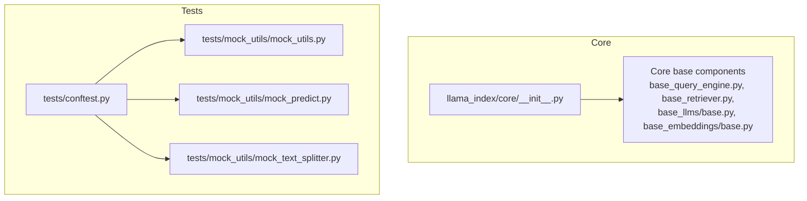
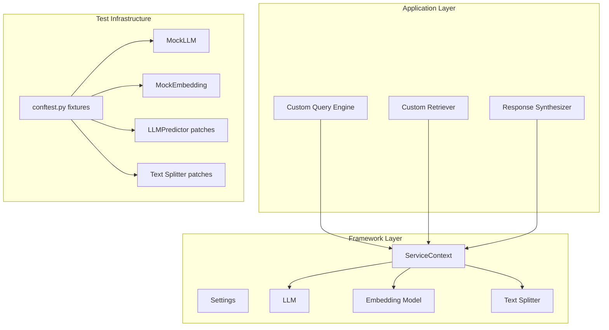
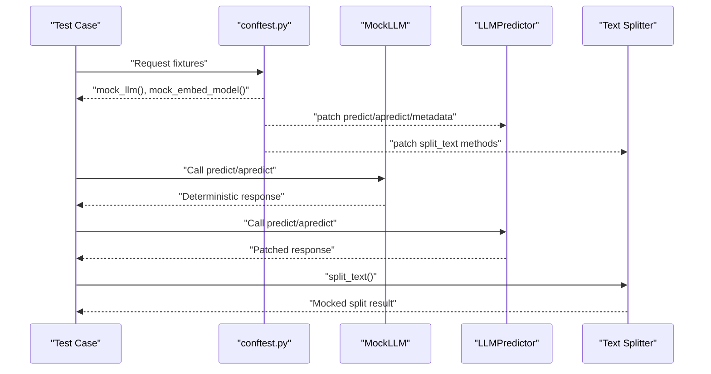
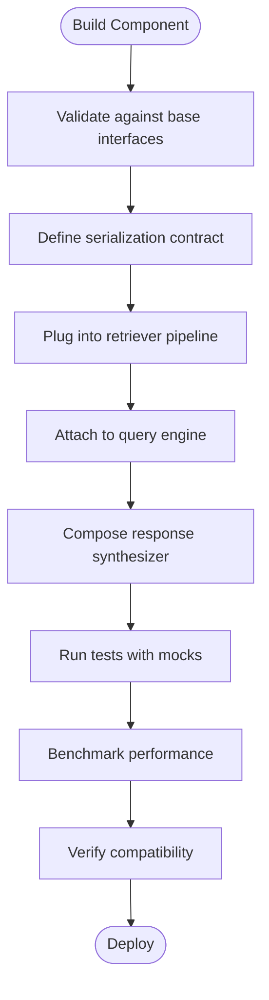
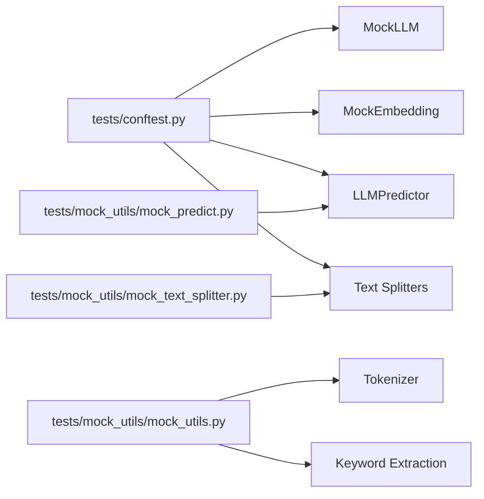

# Component Integration and Testing

<cite>
**Referenced Files in This Document**
- [llama_index/core/__init__.py](file://llama-index-core/llama_index/core/__init__.py)
- [tests/conftest.py](file://llama-index-core/tests/conftest.py)
- [tests/mock_utils/mock_utils.py](file://llama-index-core/tests/mock_utils/mock_utils.py)
- [tests/mock_utils/mock_predict.py](file://llama-index-core/tests/mock_utils/mock_predict.py)
- [tests/mock_utils/mock_text_splitter.py](file://llama-index-core/tests/mock_utils/mock_text_splitter.py)
</cite>

## Table of Contents
1. [Introduction](#introduction)
2. [Project Structure](#project-structure)
3. [Core Components](#core-components)
4. [Architecture Overview](#architecture-overview)
5. [Detailed Component Analysis](#detailed-component-analysis)
6. [Dependency Analysis](#dependency-analysis)
7. [Performance Considerations](#performance-considerations)
8. [Troubleshooting Guide](#troubleshooting-guide)
9. [Conclusion](#conclusion)
10. [Appendices](#appendices)

## Introduction
This document explains how to integrate custom components into the LlamaIndex ecosystem, focusing on testing strategies using the provided test utilities and mocking frameworks. It covers component validation, serialization and deserialization patterns, and integration with query engines, retrieval pipelines, and response synthesizers. Practical examples demonstrate component testing, performance benchmarking, and compatibility verification. Common integration issues, debugging techniques, and best practices are included, along with the relationship between components and the broader framework architecture.

## Project Structure
The repository organizes core APIs and top-level exports under the core package, while tests and mocks live under the tests directory. The testing infrastructure provides fixtures and patches to replace external dependencies with deterministic mocks, enabling reliable unit and integration tests.

**Diagram sources**
- [llama_index/core/__init__.py](file://llama-index-core/llama_index/core/__init__.py#L1-L162)
- [tests/conftest.py](file://llama-index-core/tests/conftest.py#L1-L192)
- [tests/mock_utils/mock_utils.py](file://llama-index-core/tests/mock_utils/mock_utils.py#L1-L62)
- [tests/mock_utils/mock_predict.py](file://llama-index-core/tests/mock_utils/mock_predict.py#L1-L249)
- [tests/mock_utils/mock_text_splitter.py](file://llama-index-core/tests/mock_utils/mock_text_splitter.py#L1-L22)

**Section sources**
- [llama_index/core/__init__.py](file://llama-index-core/llama_index/core/__init__.py#L1-L162)
- [tests/conftest.py](file://llama-index-core/tests/conftest.py#L1-L192)

## Core Components
Key building blocks for component integration:
- Base abstractions for query engines, retrievers, LLMs, and embeddings define the contracts your components must satisfy.
- Top-level exports expose factories and helpers for constructing indices, response synthesizers, and service contexts.
- Test fixtures provide deterministic replacements for LLMs, predictors, and text splitters to simplify testing.

Highlights:
- Query engine and retriever base interfaces enable plugging in custom logic without changing higher-level orchestration.
- Response synthesizer factory supports composing different strategies (e.g., compact/refine/tree_summarize).
- Service context and Settings centralize configuration for embed models, LLMs, and tokenization.

**Section sources**
- [llama_index/core/__init__.py](file://llama-index-core/llama_index/core/__init__.py#L69-L88)
- [tests/conftest.py](file://llama-index-core/tests/conftest.py#L100-L119)

## Architecture Overview
The LlamaIndex architecture composes components around a ServiceContext and Settings. Tests leverage fixtures to swap out real providers with mocks, ensuring predictable behavior and fast execution.

**Diagram sources**
- [llama_index/core/__init__.py](file://llama-index-core/llama_index/core/__init__.py#L70-L78)
- [tests/conftest.py](file://llama-index-core/tests/conftest.py#L100-L119)
- [tests/mock_utils/mock_predict.py](file://llama-index-core/tests/mock_utils/mock_predict.py#L225-L249)
- [tests/mock_utils/mock_text_splitter.py](file://llama-index-core/tests/mock_utils/mock_text_splitter.py#L6-L22)

## Detailed Component Analysis

### Testing Strategies Using Provided Utilities and Mocking Frameworks
The testing utilities provide:
- Environment isolation via autouse fixtures.
- Deterministic LLM and embedding replacements.
- Predictive behavior patches for LLMPredictor and text splitters.

Recommended patterns:
- Use the provided fixtures to inject mocks globally for a test session.
- Apply monkeypatches selectively to override specific methods for targeted tests.
- Leverage mock tokenization and keyword extraction utilities for predictable parsing behavior.

**Diagram sources**
- [tests/conftest.py](file://llama-index-core/tests/conftest.py#L100-L119)
- [tests/mock_utils/mock_predict.py](file://llama-index-core/tests/mock_utils/mock_predict.py#L225-L249)
- [tests/mock_utils/mock_text_splitter.py](file://llama-index-core/tests/mock_utils/mock_text_splitter.py#L6-L22)

**Section sources**
- [tests/conftest.py](file://llama-index-core/tests/conftest.py#L32-L119)
- [tests/mock_utils/mock_utils.py](file://llama-index-core/tests/mock_utils/mock_utils.py#L9-L62)
- [tests/mock_utils/mock_predict.py](file://llama-index-core/tests/mock_utils/mock_predict.py#L167-L223)
- [tests/mock_utils/mock_text_splitter.py](file://llama-index-core/tests/mock_utils/mock_text_splitter.py#L6-L22)

### Component Validation Patterns
Validation ensures your component adheres to framework contracts:
- Implement required base interfaces for the component type (e.g., retriever/query engine).
- Validate inputs and outputs against expected schemas (e.g., Documents, Nodes, QueryBundle).
- Confirm compatibility with ServiceContext expectations (e.g., tokenization, embedding dimensions).

Practical checks:
- Verify method signatures match base classes.
- Ensure serialization keys align with framework expectations.
- Cross-check prompt templates and metadata for prompt-driven components.

[No sources needed since this section provides general guidance]

### Serialization and Deserialization Patterns
Patterns to ensure your component persists and restores correctly:
- Define explicit serialization keys and versioning in component metadata.
- Implement deterministic serialization of internal state and configuration.
- Provide a constructor or factory that accepts serialized state to reconstruct the component.

Guidelines:
- Keep serialized state minimal and stable across versions.
- Normalize configuration values to avoid drift between environments.
- Add round-trip tests to confirm serialize → deserialize produces equivalent behavior.

[No sources needed since this section provides general guidance]

### Integration with Query Engines, Retrieval Pipelines, and Response Synthesizers
Integration steps:
- Wrap your custom logic in a retriever-compatible interface and connect it to a query engine.
- Use the response synthesizer factory to compose strategies appropriate for your pipeline.
- Configure ServiceContext with your component instances and ensure Settings are applied consistently.

[No sources needed since this diagram shows conceptual workflow, not actual code structure]

**Section sources**
- [llama_index/core/__init__.py](file://llama-index-core/llama_index/core/__init__.py#L69-L88)

### Practical Examples: Component Testing, Benchmarking, and Compatibility Verification
Examples of how to apply the testing utilities:
- Replace LLM and predictor behavior with deterministic responses to validate query flows.
- Patch text splitting to control chunk boundaries and measure downstream effects.
- Use mock tokenization and keyword extraction to stabilize parsing-dependent tests.

Benchmarking tips:
- Measure latency and throughput across different input sizes.
- Compare performance with and without caching layers.
- Profile memory usage during indexing and querying.

Compatibility verification:
- Run tests with and without network access to ensure offline readiness.
- Validate behavior across different tokenizers and embedding models.

**Section sources**
- [tests/conftest.py](file://llama-index-core/tests/conftest.py#L169-L192)
- [tests/mock_utils/mock_utils.py](file://llama-index-core/tests/mock_utils/mock_utils.py#L9-L62)
- [tests/mock_utils/mock_predict.py](file://llama-index-core/tests/mock_utils/mock_predict.py#L167-L223)

### Common Integration Issues, Debugging Techniques, and Best Practices
Common issues:
- Mismatched method signatures causing runtime errors.
- Unexpected tokenization leading to oversized chunks or truncated queries.
- Missing serialization keys causing deserialization failures.

Debugging techniques:
- Use pytest markers to isolate integration tests.
- Temporarily disable network access to reproduce environment-specific failures.
- Log and compare actual vs. expected inputs and outputs in prompt-driven components.

Best practices:
- Keep components stateless where possible to simplify testing and reuse.
- Encapsulate external calls behind interfaces to facilitate mocking.
- Write regression tests for critical edge cases (empty inputs, very long texts, special characters).

**Section sources**
- [tests/conftest.py](file://llama-index-core/tests/conftest.py#L169-L192)

## Dependency Analysis
The testing infrastructure depends on core framework constructs and provides patches for LLMs, predictors, and splitters. This creates a controlled environment for validating component behavior.

**Diagram sources**
- [tests/conftest.py](file://llama-index-core/tests/conftest.py#L100-L119)
- [tests/mock_utils/mock_utils.py](file://llama-index-core/tests/mock_utils/mock_utils.py#L9-L62)
- [tests/mock_utils/mock_predict.py](file://llama-index-core/tests/mock_utils/mock_predict.py#L167-L223)
- [tests/mock_utils/mock_text_splitter.py](file://llama-index-core/tests/mock_utils/mock_text_splitter.py#L6-L22)

**Section sources**
- [tests/conftest.py](file://llama-index-core/tests/conftest.py#L100-L119)
- [tests/mock_utils/mock_utils.py](file://llama-index-core/tests/mock_utils/mock_utils.py#L9-L62)
- [tests/mock_utils/mock_predict.py](file://llama-index-core/tests/mock_utils/mock_predict.py#L167-L223)
- [tests/mock_utils/mock_text_splitter.py](file://llama-index-core/tests/mock_utils/mock_text_splitter.py#L6-L22)

## Performance Considerations
- Prefer deterministic mocks to eliminate flaky timing and resource contention in tests.
- Use smaller datasets and controlled chunk sizes to reduce overhead during development.
- Cache expensive computations where safe and document cache invalidation policies.

[No sources needed since this section provides general guidance]

## Troubleshooting Guide
- Fixture conflicts: Ensure autouse fixtures are not overridden unintentionally; use scoped fixtures when necessary.
- Network-dependent failures: Use the networking allow/deny fixtures to control connectivity in tests.
- Prompt mismatches: Align prompt templates and metadata with the patched predictor behavior.

**Section sources**
- [tests/conftest.py](file://llama-index-core/tests/conftest.py#L42-L58)

## Conclusion
By leveraging the provided testing utilities and mocking frameworks, you can reliably integrate custom components into LlamaIndex. Use deterministic fixtures, validate against base interfaces, and follow serialization and deserialization patterns to ensure robust behavior. Integrate with query engines and response synthesizers through ServiceContext, and validate performance and compatibility using the strategies outlined here.

[No sources needed since this section summarizes without analyzing specific files]

## Appendices
- Reference top-level exports for indices, response synthesizers, and service context to guide component composition.
- Review mock utilities for tokenization, keyword extraction, and triplet generation to stabilize parsing-dependent tests.

**Section sources**
- [llama_index/core/__init__.py](file://llama-index-core/llama_index/core/__init__.py#L24-L88)
- [tests/mock_utils/mock_utils.py](file://llama-index-core/tests/mock_utils/mock_utils.py#L9-L62)