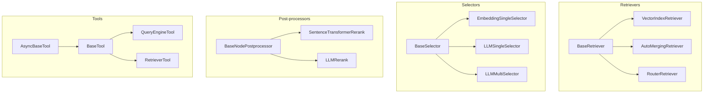
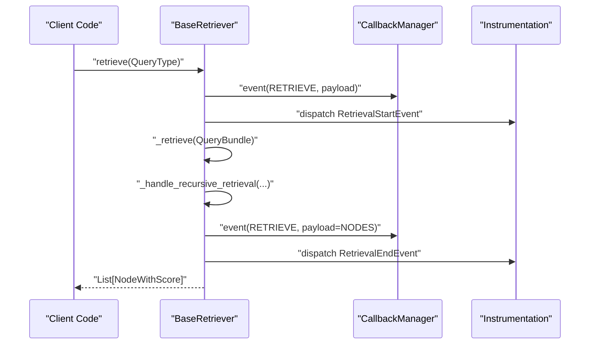
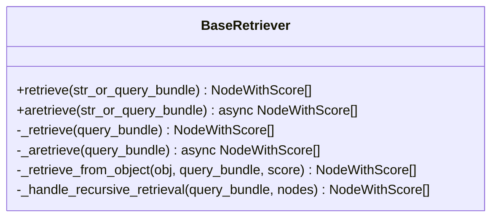
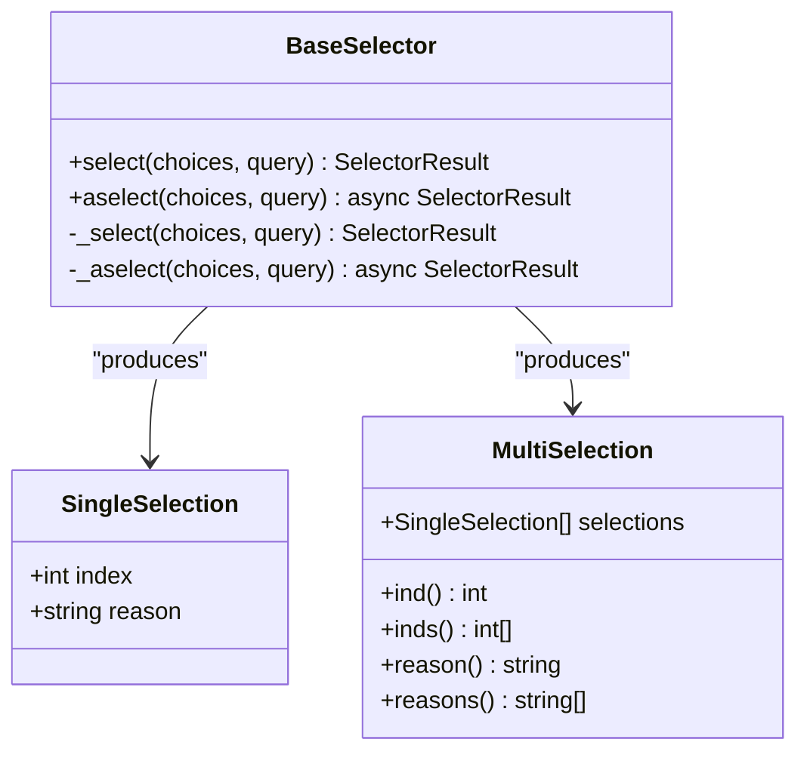
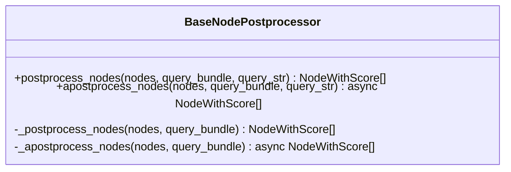
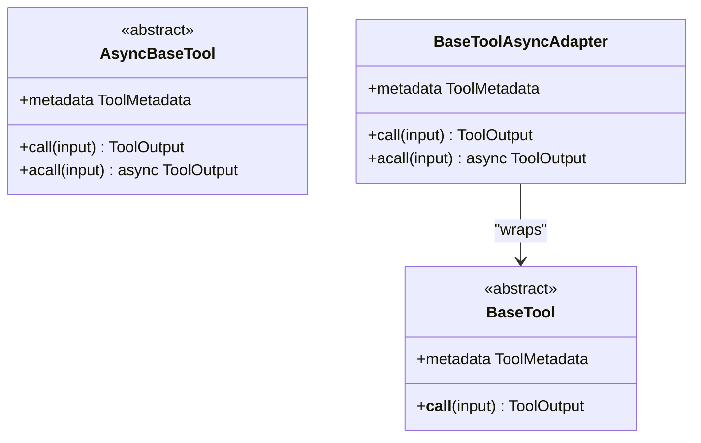
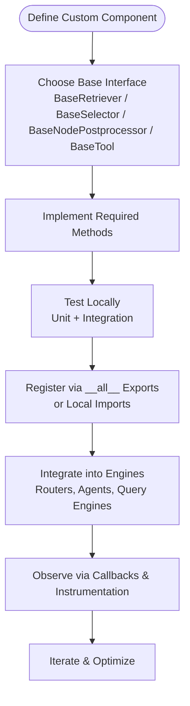
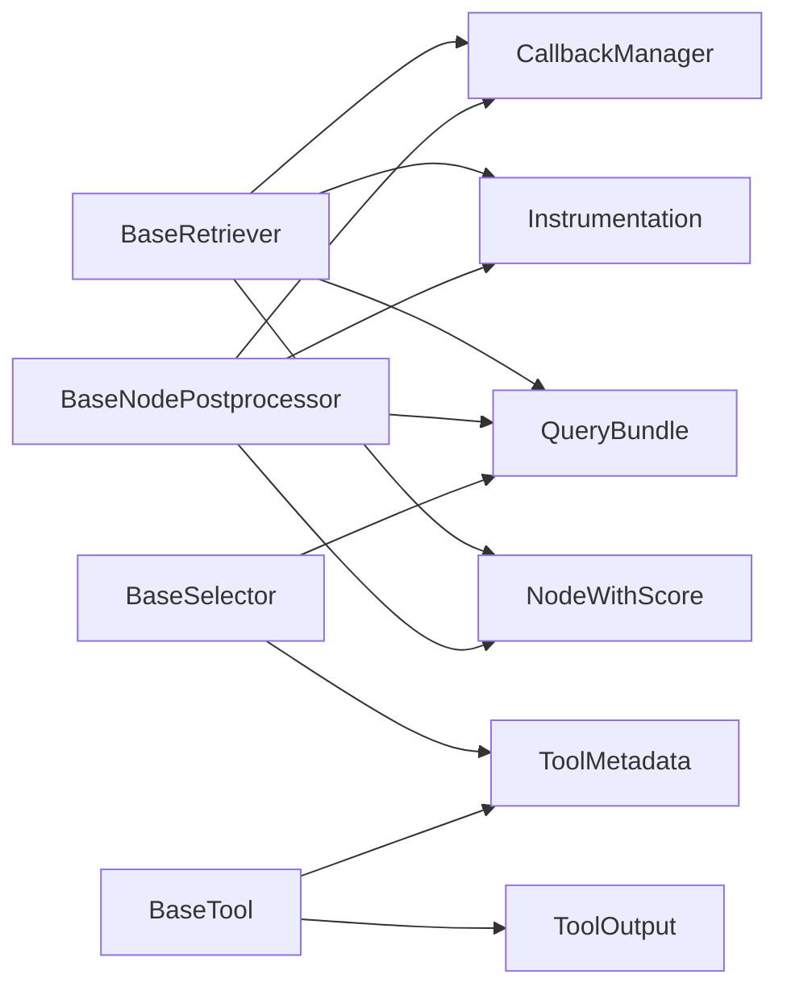

# Custom Component Development

<cite>
**Referenced Files in This Document**
- [base_retriever.py](file://llama-index-core/llama_index/core/base/base_retriever.py)
- [retrievers/__init__.py](file://llama-index-core/llama_index/core/retrievers/__init__.py)
- [base_selector.py](file://llama-index-core/llama_index/core/base/base_selector.py)
- [selectors/__init__.py](file://llama-index-core/llama_index/core/selectors/__init__.py)
- [types.py](file://llama-index-core/llama_index/core/postprocessor/types.py)
- [postprocessor/__init__.py](file://llama-index-core/llama_index/core/postprocessor/__init__.py)
- [types.py](file://llama-index-core/llama_index/core/tools/types.py)
- [tools/__init__.py](file://llama-index-core/llama_index/core/tools/__init__.py)
</cite>

## Table of Contents
1. [Introduction](#introduction)
2. [Project Structure](#project-structure)
3. [Core Components](#core-components)
4. [Architecture Overview](#architecture-overview)
5. [Detailed Component Analysis](#detailed-component-analysis)
6. [Dependency Analysis](#dependency-analysis)
7. [Performance Considerations](#performance-considerations)
8. [Troubleshooting Guide](#troubleshooting-guide)
9. [Conclusion](#conclusion)
10. [Appendices](#appendices)

## Introduction
This document explains how to build custom components in LlamaIndex, focusing on auto retrievers, selectors, multi-modal retrievers, post-processors, and tools. It covers the base interfaces, factory-style exports, plugin-style extensions, and integration patterns used across the framework. Practical examples show how to implement custom components, register them, inject dependencies, and integrate them into broader RAG workflows. Testing strategies, performance optimization tips, and best practices are included to help you develop robust, maintainable components.

## Project Structure
LlamaIndex organizes component families under dedicated namespaces:
- Retrievers: Base interface and many built-in implementations
- Selectors: Base interface and selection strategies
- Post-processors: Base interface and node post-processing utilities
- Tools: Base interfaces, tool types, and tool composition utilities

**Diagram sources**
- [base_retriever.py](file://llama-index-core/llama_index/core/base/base_retriever.py#L34-L275)
- [retrievers/__init__.py](file://llama-index-core/llama_index/core/retrievers/__init__.py#L1-L89)
- [base_selector.py](file://llama-index-core/llama_index/core/base/base_selector.py#L72-L104)
- [selectors/__init__.py](file://llama-index-core/llama_index/core/selectors/__init__.py#L1-L30)
- [types.py](file://llama-index-core/llama_index/core/postprocessor/types.py#L12-L80)
- [postprocessor/__init__.py](file://llama-index-core/llama_index/core/postprocessor/__init__.py#L1-L48)
- [types.py](file://llama-index-core/llama_index/core/tools/types.py#L168-L280)
- [tools/__init__.py](file://llama-index-core/llama_index/core/tools/__init__.py#L1-L36)

**Section sources**
- [base_retriever.py](file://llama-index-core/llama_index/core/base/base_retriever.py#L34-L275)
- [retrievers/__init__.py](file://llama-index-core/llama_index/core/retrievers/__init__.py#L1-L89)
- [base_selector.py](file://llama-index-core/llama_index/core/base/base_selector.py#L72-L104)
- [selectors/__init__.py](file://llama-index-core/llama_index/core/selectors/__init__.py#L1-L30)
- [types.py](file://llama-index-core/llama_index/core/postprocessor/types.py#L12-L80)
- [postprocessor/__init__.py](file://llama-index-core/llama_index/core/postprocessor/__init__.py#L1-L48)
- [types.py](file://llama-index-core/llama_index/core/tools/types.py#L168-L280)
- [tools/__init__.py](file://llama-index-core/llama_index/core/tools/__init__.py#L1-L36)

## Core Components
This section outlines the primary base interfaces and their responsibilities, along with how built-in implementations are exported for convenience.

- BaseRetriever
  - Purpose: Defines the retrieval contract for retrieving nodes given a query, with support for recursive retrieval across nested indices and optional verbose logging.
  - Key methods: retrieve, aretrieve, _retrieve, _aretrieve.
  - Integration points: Callbacks, instrumentation, and recursive traversal of IndexNode objects.
  - Example reference: [BaseRetriever](file://llama-index-core/llama_index/core/base/base_retriever.py#L34-L275)

- BaseSelector
  - Purpose: Provides a unified interface for selecting among multiple choices (tools, indices, strategies) given a query.
  - Key types: SingleSelection, MultiSelection, SelectorResult.
  - Methods: select, aselect, _select, _aselect.
  - Example reference: [BaseSelector](file://llama-index-core/llama_index/core/base/base_selector.py#L72-L104)

- BaseNodePostprocessor
  - Purpose: Post-process a ranked list of nodes (e.g., re-ranking, filtering, recency adjustments).
  - Methods: postprocess_nodes, apostprocess_nodes, _postprocess_nodes, _apostprocess_nodes.
  - Example reference: [BaseNodePostprocessor](file://llama-index-core/llama_index/core/postprocessor/types.py#L12-L80)

- BaseTool and AsyncBaseTool
  - Purpose: Define synchronous and asynchronous tool contracts with standardized metadata and output formats.
  - Key types: ToolMetadata, ToolOutput, ToolSelection utilities.
  - Methods: BaseTool.__call__, AsyncBaseTool.call/acall, adapters for async conversion.
  - Example reference: [BaseTool and AsyncBaseTool](file://llama-index-core/llama_index/core/tools/types.py#L168-L280)

**Section sources**
- [base_retriever.py](file://llama-index-core/llama_index/core/base/base_retriever.py#L34-L275)
- [base_selector.py](file://llama-index-core/llama_index/core/base/base_selector.py#L72-L104)
- [types.py](file://llama-index-core/llama_index/core/postprocessor/types.py#L12-L80)
- [types.py](file://llama-index-core/llama_index/core/tools/types.py#L168-L280)

## Architecture Overview
LlamaIndex composes components through explicit base interfaces and a factory-style export pattern. Built-in implementations are exposed via module __all__ lists, enabling straightforward imports and substitution. Components integrate with callbacks, instrumentation, and query-time events to provide observability and extensibility.

**Diagram sources**
- [base_retriever.py](file://llama-index-core/llama_index/core/base/base_retriever.py#L185-L254)

**Section sources**
- [base_retriever.py](file://llama-index-core/llama_index/core/base/base_retriever.py#L34-L275)

## Detailed Component Analysis

### BaseRetriever
- Responsibilities
  - Accept a query string or QueryBundle and return a list of scored nodes.
  - Support recursive retrieval across nested indices via IndexNode and object_map.
  - Emit instrumentation events and integrate with callback managers.
- Implementation patterns
  - Override _retrieve to implement retrieval logic.
  - Optionally override _aretrieve for async retrieval.
  - Use _retrieve_from_object and _handle_recursive_retrieval helpers for composing nested retrievers.
- Extension mechanisms
  - Built-in implementations are exported via retrievers/__init__.py for easy substitution.
  - Examples include VectorIndexRetriever, AutoMergingRetriever, RouterRetriever, and others.

**Diagram sources**
- [base_retriever.py](file://llama-index-core/llama_index/core/base/base_retriever.py#L34-L275)

**Section sources**
- [base_retriever.py](file://llama-index-core/llama_index/core/base/base_retriever.py#L34-L275)
- [retrievers/__init__.py](file://llama-index-core/llama_index/core/retrievers/__init__.py#L1-L89)

### BaseSelector
- Responsibilities
  - Choose one or more items from a sequence of choices given a query.
  - Normalize inputs to QueryBundle and ToolMetadata for consistent processing.
- Implementation patterns
  - Implement _select and optionally _aselect.
  - Use SingleSelection/MultiSelection to represent results.
- Extension mechanisms
  - Exported via selectors/__init__.py, including embedding-based and LLM-based selectors.

**Diagram sources**
- [base_selector.py](file://llama-index-core/llama_index/core/base/base_selector.py#L72-L104)

**Section sources**
- [base_selector.py](file://llama-index-core/llama_index/core/base/base_selector.py#L72-L104)
- [selectors/__init__.py](file://llama-index-core/llama_index/core/selectors/__init__.py#L1-L30)

### BaseNodePostprocessor
- Responsibilities
  - Post-process a list of scored nodes (e.g., re-ranking, recency weighting, similarity filtering).
  - Support both sync and async postprocessing.
- Implementation patterns
  - Implement _postprocess_nodes and optionally _apostprocess_nodes.
  - Use callback_manager and instrumentation via DispatcherSpanMixin.
- Extension mechanisms
  - Exported via postprocessor/__init__.py, including rerankers and node processors.

**Diagram sources**
- [types.py](file://llama-index-core/llama_index/core/postprocessor/types.py#L12-L80)

**Section sources**
- [types.py](file://llama-index-core/llama_index/core/postprocessor/types.py#L12-L80)
- [postprocessor/__init__.py](file://llama-index-core/llama_index/core/postprocessor/__init__.py#L1-L48)

### BaseTool and AsyncBaseTool
- Responsibilities
  - Define a uniform interface for tools with metadata-driven function schemas and standardized outputs.
  - Support both synchronous and asynchronous execution.
- Implementation patterns
  - Implement BaseTool.__call__ or AsyncBaseTool.call/acall.
  - Use ToolMetadata to describe tool capabilities and ToolOutput to wrap results.
- Extension mechanisms
  - Exported via tools/__init__.py, including QueryEngineTool, RetrieverTool, and adapters for async conversion.

**Diagram sources**
- [types.py](file://llama-index-core/llama_index/core/tools/types.py#L168-L280)

**Section sources**
- [types.py](file://llama-index-core/llama_index/core/tools/types.py#L168-L280)
- [tools/__init__.py](file://llama-index-core/llama_index/core/tools/__init__.py#L1-L36)

### Practical Examples

- Custom Retriever
  - Steps
    - Subclass BaseRetriever.
    - Implement _retrieve to return NodeWithScore objects for a QueryBundle.
    - Optionally implement _aretrieve for async support.
    - Register and use in place of built-ins via retrievers/__init__.py exports.
  - References
    - [BaseRetriever](file://llama-index-core/llama_index/core/base/base_retriever.py#L34-L275)
    - [retrievers/__init__.py](file://llama-index-core/llama_index/core/retrievers/__init__.py#L1-L89)

- Custom Selector
  - Steps
    - Subclass BaseSelector.
    - Implement _select and optionally _aselect.
    - Return SingleSelection or MultiSelection results.
  - References
    - [BaseSelector](file://llama-index-core/llama_index/core/base/base_selector.py#L72-L104)
    - [selectors/__init__.py](file://llama-index-core/llama_index/core/selectors/__init__.py#L1-L30)

- Custom Post-processor
  - Steps
    - Subclass BaseNodePostprocessor.
    - Implement _postprocess_nodes to reorder/filter/adjust scores.
  - References
    - [BaseNodePostprocessor](file://llama-index-core/llama_index/core/postprocessor/types.py#L12-L80)
    - [postprocessor/__init__.py](file://llama-index-core/llama_index/core/postprocessor/__init__.py#L1-L48)

- Custom Tool
  - Steps
    - Subclass BaseTool or AsyncBaseTool.
    - Implement __call__ or call/acall and define ToolMetadata.
    - Use ToolOutput to normalize results.
  - References
    - [BaseTool and AsyncBaseTool](file://llama-index-core/llama_index/core/tools/types.py#L168-L280)
    - [tools/__init__.py](file://llama-index-core/llama_index/core/tools/__init__.py#L1-L36)

### Conceptual Overview
The framework encourages composition and substitution:
- Factory-style exports enable swapping implementations without changing client code.
- Base interfaces standardize contracts, easing integration with higher-level engines.
- Instrumentation and callbacks provide hooks for monitoring and tracing.

[No sources needed since this diagram shows conceptual workflow, not actual code structure]

[No sources needed since this section doesn't analyze specific source files]

## Dependency Analysis
Components depend on shared infrastructure:
- Callbacks and instrumentation: emitted during retrieval and postprocessing
- QueryBundle and NodeWithScore: standard data structures across components
- Prompt mixins: optional prompt configuration for components that support it

**Diagram sources**
- [base_retriever.py](file://llama-index-core/llama_index/core/base/base_retriever.py#L34-L275)
- [types.py](file://llama-index-core/llama_index/core/postprocessor/types.py#L12-L80)
- [base_selector.py](file://llama-index-core/llama_index/core/base/base_selector.py#L72-L104)
- [types.py](file://llama-index-core/llama_index/core/tools/types.py#L168-L280)

**Section sources**
- [base_retriever.py](file://llama-index-core/llama_index/core/base/base_retriever.py#L34-L275)
- [types.py](file://llama-index-core/llama_index/core/postprocessor/types.py#L12-L80)
- [base_selector.py](file://llama-index-core/llama_index/core/base/base_selector.py#L72-L104)
- [types.py](file://llama-index-core/llama_index/core/tools/types.py#L168-L280)

## Performance Considerations
- Prefer async implementations where IO-bound operations dominate (retrieval, tool calls).
- Minimize redundant work by leveraging deduplication helpers in BaseRetriever’s recursive handling.
- Use lightweight postprocessors for large node sets; consider early filtering before heavy reranking.
- Instrumentation and callbacks add overhead; enable only when needed for debugging or production observability.
- Cache frequently accessed resources (e.g., embeddings, rerankers) at the component level to reduce latency.

[No sources needed since this section provides general guidance]

## Troubleshooting Guide
- Retrieval returns empty or unexpected nodes
  - Verify _retrieve returns NodeWithScore and that recursive traversal is intended.
  - Check IndexNode mapping and object_map resolution.
  - Reference: [BaseRetriever](file://llama-index-core/llama_index/core/base/base_retriever.py#L185-L254)
- Selector returns incorrect indices
  - Ensure _select handles ToolMetadata normalization and returns SingleSelection/MultiSelection consistently.
  - Reference: [BaseSelector](file://llama-index-core/llama_index/core/base/base_selector.py#L72-L104)
- Post-processor not applied
  - Confirm postprocess_nodes signature matches expected inputs and that _postprocess_nodes is implemented.
  - Reference: [BaseNodePostprocessor](file://llama-index-core/llama_index/core/postprocessor/types.py#L35-L71)
- Tool metadata errors
  - Validate ToolMetadata name/description/schema and ensure ToolOutput is constructed properly.
  - Reference: [BaseTool and AsyncBaseTool](file://llama-index-core/llama_index/core/tools/types.py#L168-L280)

**Section sources**
- [base_retriever.py](file://llama-index-core/llama_index/core/base/base_retriever.py#L185-L254)
- [base_selector.py](file://llama-index-core/llama_index/core/base/base_selector.py#L72-L104)
- [types.py](file://llama-index-core/llama_index/core/postprocessor/types.py#L35-L71)
- [types.py](file://llama-index-core/llama_index/core/tools/types.py#L168-L280)

## Conclusion
By implementing the appropriate base interfaces and adhering to the factory-style export patterns, you can build custom retrievers, selectors, post-processors, and tools that integrate seamlessly with LlamaIndex. Use instrumentation and callbacks for observability, optimize for async where possible, and follow the established patterns for registration and composition to ensure maintainability and performance.

[No sources needed since this section summarizes without analyzing specific files]

## Appendices

### Component Registration and Plugin Patterns
- Factory-style exports
  - Built-in components are exposed via module __all__ lists, enabling drop-in replacements.
  - References: [retrievers/__init__.py](file://llama-index-core/llama_index/core/retrievers/__init__.py#L1-L89), [selectors/__init__.py](file://llama-index-core/llama_index/core/selectors/__init__.py#L1-L30), [postprocessor/__init__.py](file://llama-index-core/llama_index/core/postprocessor/__init__.py#L1-L48), [tools/__init__.py](file://llama-index-core/llama_index/core/tools/__init__.py#L1-L36)
- Plugin architecture
  - Components can be composed into routers, agents, and query engines without modifying core logic.
  - Use BaseTool to wrap external APIs or services as tools.

[No sources needed since this section provides general guidance]