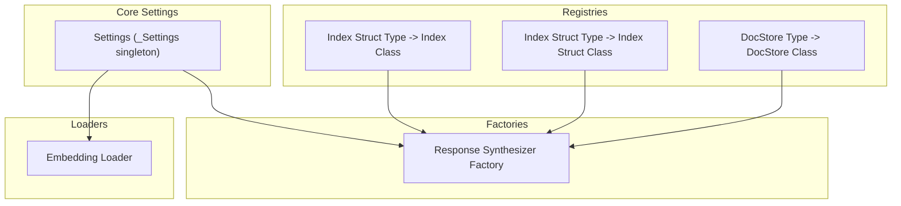
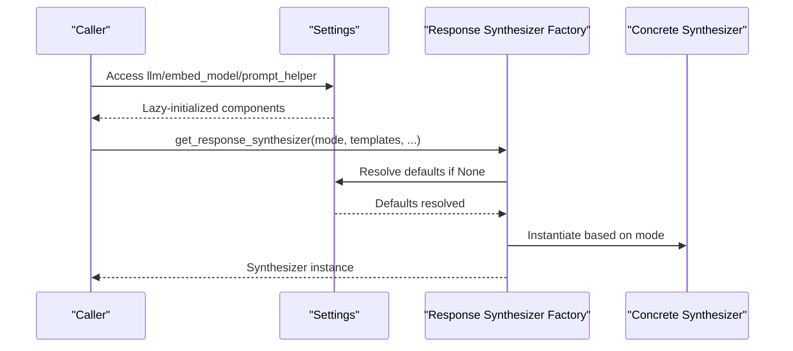
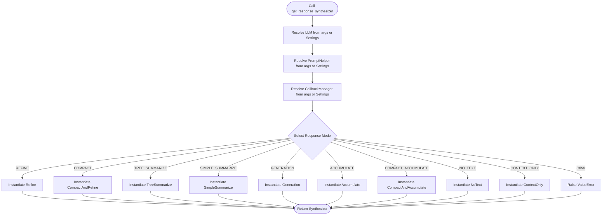
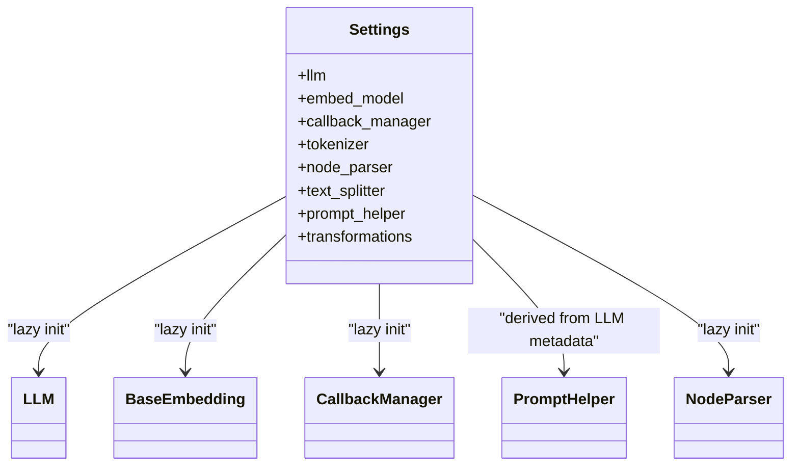
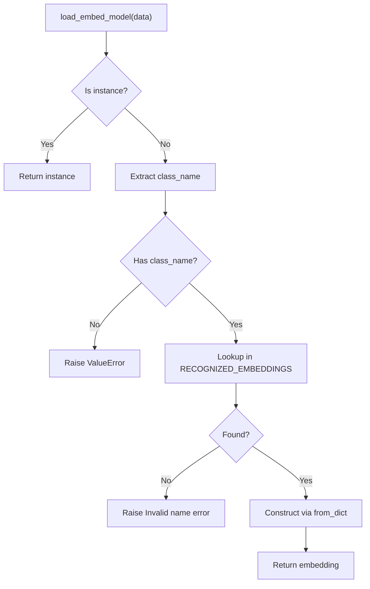
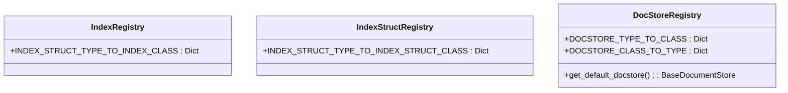
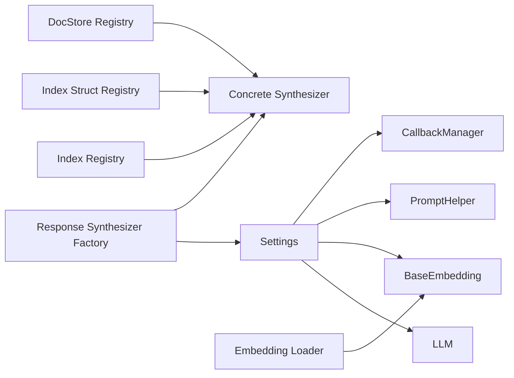

# Factory Patterns and Component Creation

<cite>
**Referenced Files in This Document**
- [factory.py](file://llama-index-core/llama_index/core/response_synthesizers/factory.py)
- [settings.py](file://llama-index-core/llama_index/core/settings.py)
- [loading.py](file://llama-index-core/llama_index/core/embeddings/loading.py)
- [registry.py (data_structs)](file://llama-index-core/llama_index/core/data_structs/registry.py)
- [registry.py (indices)](file://llama-index-core/llama_index/core/indices/registry.py)
- [registry.py (docstore)](file://llama-index-core/llama_index/core/storage/docstore/registry.py)
- [service_context.py](file://llama-index-core/llama_index/core/service_context.py)
- [__init__.py (llms)](file://llama-index-core/llama_index/core/llms/__init__.py)
- [__init__.py (readers)](file://llama-index-core/llama_index/core/readers/__init__.py)
</cite>

## Table of Contents
1. [Introduction](#introduction)
2. [Project Structure](#project-structure)
3. [Core Components](#core-components)
4. [Architecture Overview](#architecture-overview)
5. [Detailed Component Analysis](#detailed-component-analysis)
6. [Dependency Analysis](#dependency-analysis)
7. [Performance Considerations](#performance-considerations)
8. [Troubleshooting Guide](#troubleshooting-guide)
9. [Conclusion](#conclusion)
10. [Appendices](#appendices)

## Introduction
This document explains how LlamaIndex employs factory patterns and registry systems to dynamically create and configure components such as embeddings, LLMs, readers, indices, and document stores. It covers:
- Factory methods for constructing response synthesizers and other components
- Registry-driven mapping of identifiers to concrete classes
- Configuration resolution via a central settings layer
- Practical examples for building custom factories and registering components
- Lifecycle management, caching strategies, and performance optimization
- The relationship between factory patterns and the broader plugin architecture

## Project Structure
LlamaIndex organizes component creation around:
- Centralized settings for default components and shared configuration
- Dedicated factories for complex component construction
- Registries mapping logical types to concrete implementations
- Utility loaders for embeddings and other pluggable modules

**Diagram sources**
- [settings.py](file://llama-index-core/llama_index/core/settings.py#L17-L249)
- [factory.py](file://llama-index-core/llama_index/core/response_synthesizers/factory.py#L33-L152)
- [registry.py (indices)](file://llama-index-core/llama_index/core/indices/registry.py#L1-L32)
- [registry.py (data_structs)](file://llama-index-core/llama_index/core/data_structs/registry.py#L1-L33)
- [registry.py (docstore)](file://llama-index-core/llama_index/core/storage/docstore/registry.py#L1-L25)
- [loading.py](file://llama-index-core/llama_index/core/embeddings/loading.py#L1-L50)

**Section sources**
- [settings.py](file://llama-index-core/llama_index/core/settings.py#L17-L249)
- [factory.py](file://llama-index-core/llama_index/core/response_synthesizers/factory.py#L33-L152)
- [registry.py (indices)](file://llama-index-core/llama_index/core/indices/registry.py#L1-L32)
- [registry.py (data_structs)](file://llama-index-core/llama_index/core/data_structs/registry.py#L1-L33)
- [registry.py (docstore)](file://llama-index-core/llama_index/core/storage/docstore/registry.py#L1-L25)
- [loading.py](file://llama-index-core/llama_index/core/embeddings/loading.py#L1-L50)

## Core Components
- Settings: Central configuration provider with lazy initialization and property-based accessors for LLMs, embeddings, callback managers, tokenizers, node parsers, prompt helpers, and transformations.
- Response Synthesizer Factory: A function that selects and instantiates a synthesizer based on a response mode and optional templates/callbacks.
- Registries: Mappings from logical types to concrete classes for indices, index structs, and document stores.
- Embedding Loader: A loader that resolves embeddings by class name and constructs instances from dictionaries.
- Deprecated ServiceContext: Legacy container now superseded by Settings.

Key responsibilities:
- Encapsulate component creation logic behind factories to simplify usage and enforce consistent defaults.
- Use registries to decouple logical types from concrete implementations, enabling extensibility.
- Centralize configuration resolution to avoid scattered defaults and promote reproducibility.

**Section sources**
- [settings.py](file://llama-index-core/llama_index/core/settings.py#L17-L249)
- [factory.py](file://llama-index-core/llama_index/core/response_synthesizers/factory.py#L33-L152)
- [registry.py (indices)](file://llama-index-core/llama_index/core/indices/registry.py#L1-L32)
- [registry.py (data_structs)](file://llama-index-core/llama_index/core/data_structs/registry.py#L1-L33)
- [registry.py (docstore)](file://llama-index-core/llama_index/core/storage/docstore/registry.py#L1-L25)
- [loading.py](file://llama-index-core/llama_index/core/embeddings/loading.py#L1-L50)
- [service_context.py](file://llama-index-core/llama_index/core/service_context.py#L1-L49)

## Architecture Overview
The factory and registry architecture enables dynamic component creation while maintaining a clean separation of concerns:

**Diagram sources**
- [settings.py](file://llama-index-core/llama_index/core/settings.py#L32-L104)
- [factory.py](file://llama-index-core/llama_index/core/response_synthesizers/factory.py#L33-L152)

## Detailed Component Analysis

### Response Synthesizer Factory
The factory method chooses a synthesizer implementation based on the provided response mode and optional templates. It also resolves defaults from the central settings for LLM, prompt helper, and callback manager.

Key behaviors:
- Template selection: Falls back to built-in defaults when templates are not provided.
- Default resolution: Uses Settings for LLM, prompt helper, and callback manager if not supplied.
- Mode dispatch: Returns a specific synthesizer subclass depending on the response mode.

**Diagram sources**
- [factory.py](file://llama-index-core/llama_index/core/response_synthesizers/factory.py#L33-L152)

**Section sources**
- [factory.py](file://llama-index-core/llama_index/core/response_synthesizers/factory.py#L33-L152)

### Settings and Default Resolution
Settings centralizes component defaults and exposes properties that lazily initialize components. It also ensures callbacks and related helpers are consistently attached.

Highlights:
- Lazy initialization for LLM, embeddings, node parser, and prompt helper.
- Automatic propagation of callback manager to dependent components.
- Convenience aliases for node parser and text splitter.
- Prompt helper derived from LLM metadata when available.

**Diagram sources**
- [settings.py](file://llama-index-core/llama_index/core/settings.py#L17-L249)

**Section sources**
- [settings.py](file://llama-index-core/llama_index/core/settings.py#L17-L249)

### Embedding Loader
The embedding loader maps class names to concrete embedding implementations and constructs them from dictionary configurations. It supports conditional imports for cloud providers and validates class names.

Key steps:
- Accept either an embedding instance or a config dict.
- Extract class name from dict and validate against recognized names.
- Construct the embedding via a from_dict factory method.

**Diagram sources**
- [loading.py](file://llama-index-core/llama_index/core/embeddings/loading.py#L1-L50)

**Section sources**
- [loading.py](file://llama-index-core/llama_index/core/embeddings/loading.py#L1-L50)

### Registries for Indices and Index Structs
Registries map logical types to concrete classes, enabling dynamic selection of index and index-struct implementations.

- Index registry: Maps index struct types to index classes.
- Index struct registry: Maps index struct types to index struct classes.
- Document store registry: Maps document store types to document store classes and provides a default.

**Diagram sources**
- [registry.py (indices)](file://llama-index-core/llama_index/core/indices/registry.py#L1-L32)
- [registry.py (data_structs)](file://llama-index-core/llama_index/core/data_structs/registry.py#L1-L33)
- [registry.py (docstore)](file://llama-index-core/llama_index/core/storage/docstore/registry.py#L1-L25)

**Section sources**
- [registry.py (indices)](file://llama-index-core/llama_index/core/indices/registry.py#L1-L32)
- [registry.py (data_structs)](file://llama-index-core/llama_index/core/data_structs/registry.py#L1-L33)
- [registry.py (docstore)](file://llama-index-core/llama_index/core/storage/docstore/registry.py#L1-L25)

### Readers and LLMs Exposure
Readers and LLMs are exposed via module init files, indicating their role as top-level components in the ecosystem.

- Readers: Provide data connectors and utilities for loading documents.
- LLMs: Expose core LLM types and related blocks/constants.

**Section sources**
- [__init__.py (readers)](file://llama-index-core/llama_index/core/readers/__init__.py#L1-L33)
- [__init__.py (llms)](file://llama-index-core/llama_index/core/llms/__init__.py#L1-L49)

### Deprecated ServiceContext
ServiceContext is deprecated in favor of Settings and local parameter passing. Calls to it raise explicit errors guiding migration.

**Section sources**
- [service_context.py](file://llama-index-core/llama_index/core/service_context.py#L1-L49)

## Dependency Analysis
The following diagram shows how factories, settings, and registries depend on each other and on external modules:

**Diagram sources**
- [settings.py](file://llama-index-core/llama_index/core/settings.py#L17-L249)
- [factory.py](file://llama-index-core/llama_index/core/response_synthesizers/factory.py#L33-L152)
- [registry.py (indices)](file://llama-index-core/llama_index/core/indices/registry.py#L1-L32)
- [registry.py (data_structs)](file://llama-index-core/llama_index/core/data_structs/registry.py#L1-L33)
- [registry.py (docstore)](file://llama-index-core/llama_index/core/storage/docstore/registry.py#L1-L25)
- [loading.py](file://llama-index-core/llama_index/core/embeddings/loading.py#L1-L50)

**Section sources**
- [settings.py](file://llama-index-core/llama_index/core/settings.py#L17-L249)
- [factory.py](file://llama-index-core/llama_index/core/response_synthesizers/factory.py#L33-L152)
- [registry.py (indices)](file://llama-index-core/llama_index/core/indices/registry.py#L1-L32)
- [registry.py (data_structs)](file://llama-index-core/llama_index/core/data_structs/registry.py#L1-L33)
- [registry.py (docstore)](file://llama-index-core/llama_index/core/storage/docstore/registry.py#L1-L25)
- [loading.py](file://llama-index-core/llama_index/core/embeddings/loading.py#L1-L50)

## Performance Considerations
- Lazy initialization: Components are created only when accessed, reducing startup overhead.
- Shared defaults: Using Settings avoids repeated construction of identical components across modules.
- Callback propagation: Attaching a single callback manager reduces per-component setup costs.
- Template reuse: Default templates are reused when not overridden, minimizing redundant allocations.
- Registry lookups: Mapping logical types to classes is O(1) dictionary-based, keeping selection fast.
- Embedding loader validation: Early validation prevents costly runtime failures.

[No sources needed since this section provides general guidance]

## Troubleshooting Guide
Common issues and resolutions:
- Unknown response mode: The factory raises a value error when an unsupported mode is passed. Verify the response mode enum value.
- Missing class name in embedding config: The loader raises a value error if class_name is absent. Ensure the config includes a valid class name.
- Invalid embedding class name: The loader raises a value error if the class name is not recognized. Confirm the embedding class is imported and registered.
- Deprecated ServiceContext usage: Calls to ServiceContext raise explicit errors. Migrate to Settings or pass components locally.

**Section sources**
- [factory.py](file://llama-index-core/llama_index/core/response_synthesizers/factory.py#L150-L152)
- [loading.py](file://llama-index-core/llama_index/core/embeddings/loading.py#L43-L49)
- [service_context.py](file://llama-index-core/llama_index/core/service_context.py#L13-L48)

## Conclusion
LlamaIndex’s factory and registry patterns provide a robust, extensible foundation for component creation:
- Factories encapsulate complex instantiation logic and default resolution.
- Registries decouple logical types from concrete implementations, enabling plugins and extensions.
- Settings centralizes configuration, ensuring consistent defaults and lifecycle management.
- Loaders and registries work together to support dynamic, validated component construction.

These patterns collectively enable a plugin-friendly architecture where new components can be integrated by registering mappings and providing factory-compatible constructors.

[No sources needed since this section summarizes without analyzing specific files]

## Appendices

### Practical Examples

- Creating a custom response synthesizer factory:
  - Define a new synthesizer class and add a mapping in the factory’s mode dispatch logic.
  - Ensure the constructor accepts the same optional parameters as existing synthesizers for compatibility.

- Implementing a component registry:
  - Add a mapping from a logical type to your concrete class in the appropriate registry.
  - Provide a default factory or loader that constructs your component from a standardized configuration.

- Handling configuration validation:
  - Validate required fields early in the loader or factory.
  - Raise explicit errors with descriptive messages for missing or invalid keys.

- Managing component lifecycle and caching:
  - Use Settings’ lazy initialization to avoid repeated construction.
  - Reuse components across operations by passing them explicitly to APIs that accept them.
  - Attach a shared callback manager to propagate instrumentation and metrics.

[No sources needed since this section provides general guidance]