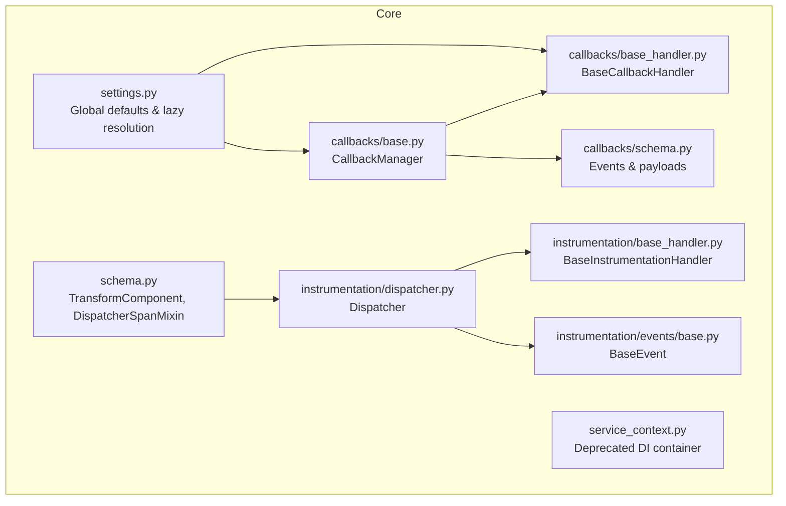
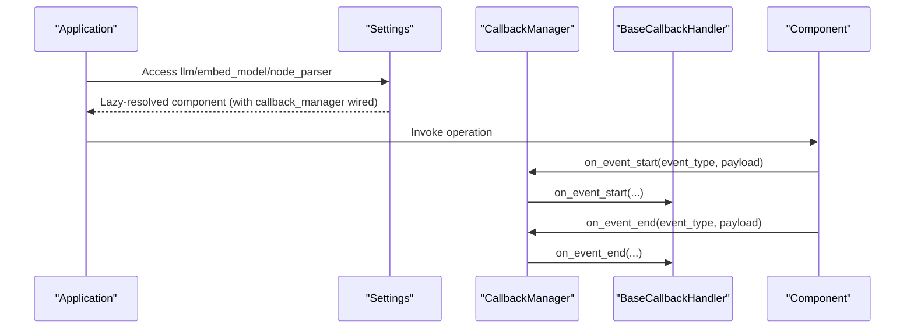
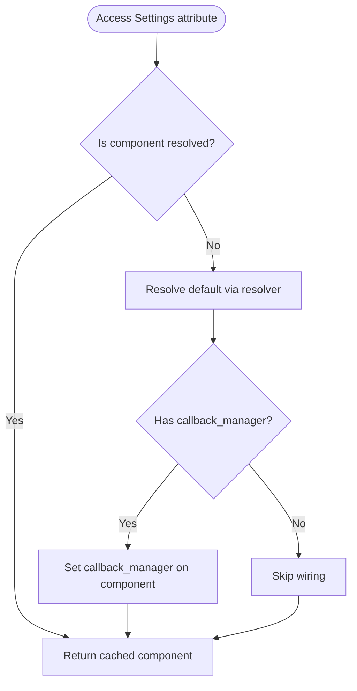
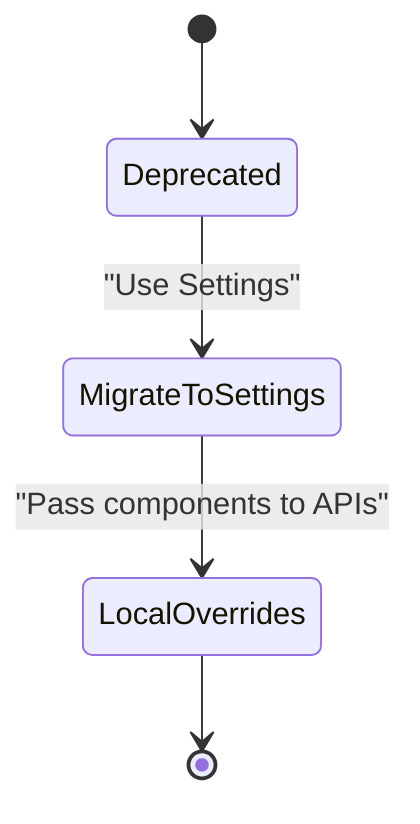
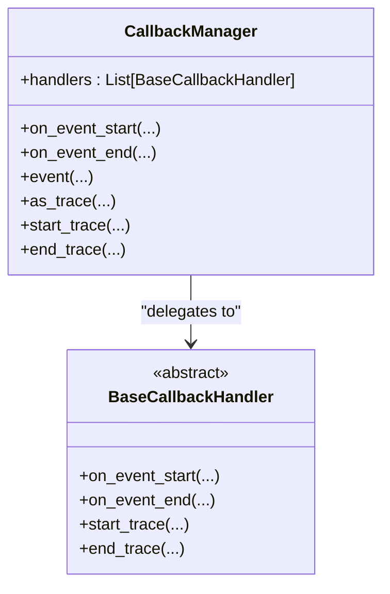
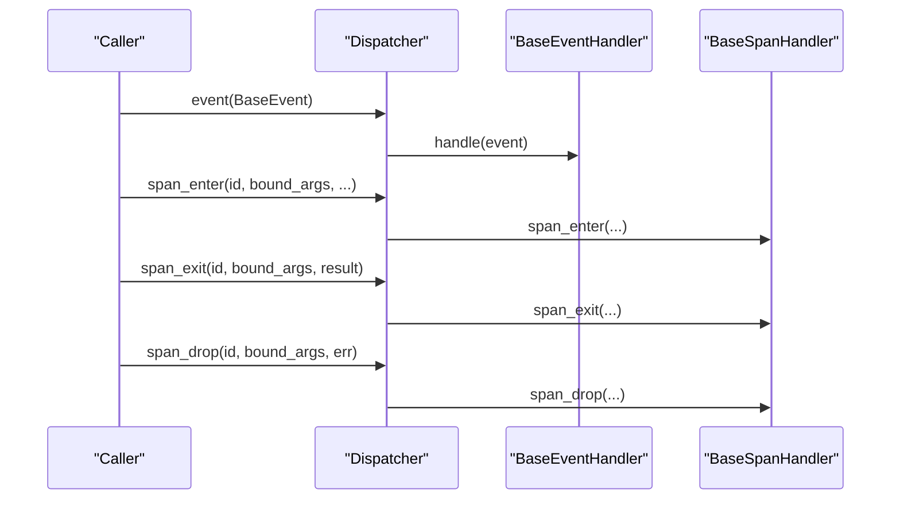
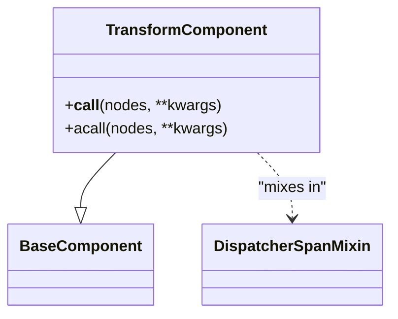
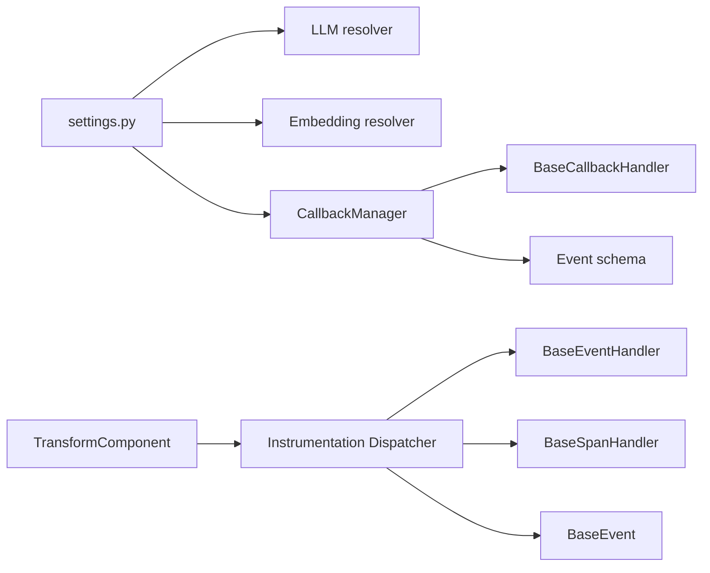

# Plugin Architecture and Extension Points

<cite>
**Referenced Files in This Document**
- [settings.py](file://llama-index-core/llama_index/core/settings.py)
- [service_context.py](file://llama-index-core/llama_index/core/service_context.py)
- [base.py](file://llama-index-core/llama_index/core/callbacks/base.py)
- [base_handler.py](file://llama-index-core/llama_index/core/callbacks/base_handler.py)
- [schema.py](file://llama-index-core/llama_index/core/callbacks/schema.py)
- [dispatcher.py](file://llama-index-core/llama_index/core/instrumentation/dispatcher.py)
- [base_handler.py](file://llama-index-core/llama_index/core/instrumentation/base_handler.py)
- [base.py](file://llama-index-core/llama_index/core/instrumentation/events/base.py)
- [schema.py](file://llama-index-core/llama_index/core/schema.py)
</cite>

## Table of Contents
1. [Introduction](#introduction)
2. [Project Structure](#project-structure)
3. [Core Components](#core-components)
4. [Architecture Overview](#architecture-overview)
5. [Detailed Component Analysis](#detailed-component-analysis)
6. [Dependency Analysis](#dependency-analysis)
7. [Performance Considerations](#performance-considerations)
8. [Troubleshooting Guide](#troubleshooting-guide)
9. [Conclusion](#conclusion)
10. [Appendices](#appendices)

## Introduction
This document explains LlamaIndex’s plugin architecture and extension mechanisms with a focus on:
- Global configuration via the settings system and local overrides
- Service context pattern for dependency injection and component wiring
- Callback system for instrumentation and observability plugins
- Instrumentation dispatcher for event handling and tracing
- Practical examples of creating custom plugins, implementing extension interfaces, and integrating with the core framework
- Plugin lifecycle, configuration management, and inter-plugin communication patterns

## Project Structure
The plugin and extension system spans several core modules:
- Global settings and defaults: settings
- Legacy service context (deprecated): service_context
- Callback system: callbacks (manager, handler, schema)
- Instrumentation system: instrumentation (dispatcher, handlers, events)
- Shared base abstractions: schema (components, spans)

**Diagram sources**
- [settings.py](file://llama-index-core/llama_index/core/settings.py#L17-L249)
- [service_context.py](file://llama-index-core/llama_index/core/service_context.py#L4-L49)
- [base.py](file://llama-index-core/llama_index/core/callbacks/base.py#L28-L303)
- [base_handler.py](file://llama-index-core/llama_index/core/callbacks/base_handler.py#L12-L56)
- [schema.py](file://llama-index-core/llama_index/core/callbacks/schema.py)
- [dispatcher.py](file://llama-index-core/llama_index/core/instrumentation/dispatcher.py#L48-L426)
- [base_handler.py](file://llama-index-core/llama_index/core/instrumentation/base_handler.py#L1-L2)
- [base.py](file://llama-index-core/llama_index/core/instrumentation/events/base.py#L1-L2)
- [schema.py](file://llama-index-core/llama_index/core/schema.py#L190-L200)

**Section sources**
- [settings.py](file://llama-index-core/llama_index/core/settings.py#L17-L249)
- [service_context.py](file://llama-index-core/llama_index/core/service_context.py#L4-L49)
- [base.py](file://llama-index-core/llama_index/core/callbacks/base.py#L28-L303)
- [base_handler.py](file://llama-index-core/llama_index/core/callbacks/base_handler.py#L12-L56)
- [schema.py](file://llama-index-core/llama_index/core/schema.py#L190-L200)
- [dispatcher.py](file://llama-index-core/llama_index/core/instrumentation/dispatcher.py#L48-L426)
- [base_handler.py](file://llama-index-core/llama_index/core/instrumentation/base_handler.py#L1-L2)
- [base.py](file://llama-index-core/llama_index/core/instrumentation/events/base.py#L1-L2)

## Core Components
- Global settings: Provides lazy-initialized singletons for LLM, embedding model, callback manager, tokenizer, node parser, prompt helper, and transformations. It wires callback manager into components upon access.
- Callback system: Centralized CallbackManager that coordinates BaseCallbackHandler instances, maintains trace stacks, and exposes context managers for event lifecycles.
- Instrumentation dispatcher: Dispatcher that routes BaseEvent and span lifecycle signals to BaseEventHandler and BaseSpanHandler, with support for propagation and async operations.
- Transform components: BaseComponent and TransformComponent integrate with instrumentation spans via DispatcherSpanMixin.

Key responsibilities:
- Settings: Global defaults, lazy resolution, and per-component wiring
- Callbacks: Event-driven instrumentation, tracing, and error handling
- Instrumentation: Structured event dispatching and span lifecycle management
- Schema: Shared component abstractions and span mixins

**Section sources**
- [settings.py](file://llama-index-core/llama_index/core/settings.py#L17-L249)
- [base.py](file://llama-index-core/llama_index/core/callbacks/base.py#L28-L303)
- [base_handler.py](file://llama-index-core/llama_index/core/callbacks/base_handler.py#L12-L56)
- [dispatcher.py](file://llama-index-core/llama_index/core/instrumentation/dispatcher.py#L48-L426)
- [schema.py](file://llama-index-core/llama_index/core/schema.py#L190-L200)

## Architecture Overview
The plugin architecture centers around two complementary systems:
- Settings-driven configuration: Global defaults with per-call overrides
- Event-driven instrumentation: Callbacks for observability and instrumentation

**Diagram sources**
- [settings.py](file://llama-index-core/llama_index/core/settings.py#L32-L74)
- [base.py](file://llama-index-core/llama_index/core/callbacks/base.py#L88-L143)
- [base_handler.py](file://llama-index-core/llama_index/core/callbacks/base_handler.py#L24-L55)

## Detailed Component Analysis

### Settings System: Global Configuration and Local Overrides
- Purpose: Provide a central place for global defaults and lazy initialization of core components.
- Key behaviors:
  - Lazy resolution of LLM, embedding model, node parser, prompt helper
  - Automatic wiring of callback_manager into components when accessed
  - Properties for chunk_size/chunk_overlap and num_output/context_window backed by prompt helper
  - transformations property aggregates node parser as default transformation

**Diagram sources**
- [settings.py](file://llama-index-core/llama_index/core/settings.py#L32-L74)
- [settings.py](file://llama-index-core/llama_index/core/settings.py#L137-L151)

Practical usage patterns:
- Global defaults: Configure Settings.llm, Settings.embed_model, Settings.callback_manager once at startup
- Local overrides: Pass component instances directly to local functions or constructors to override global settings for a specific call

**Section sources**
- [settings.py](file://llama-index-core/llama_index/core/settings.py#L17-L249)

### Service Context Pattern: Dependency Injection and Component Wiring
- Deprecated: ServiceContext is deprecated in favor of Settings and local overrides.
- Migration guidance: Replace ServiceContext usage with Settings for global defaults and pass components directly to APIs for local overrides.

**Diagram sources**
- [service_context.py](file://llama-index-core/llama_index/core/service_context.py#L4-L49)

**Section sources**
- [service_context.py](file://llama-index-core/llama_index/core/service_context.py#L4-L49)

### Callback System: Instrumentation and Observability Plugins
- CallbackManager:
  - Manages a list of BaseCallbackHandler instances
  - Maintains trace stacks and trace maps for hierarchical event tracking
  - Provides context managers for event lifecycle and tracing
  - Supports adding/removing handlers and setting handlers
- BaseCallbackHandler:
  - Defines abstract methods for on_event_start/on_event_end/start_trace/end_trace
  - Allows filtering of ignored event types for start/end
- Event schema:
  - CBEventType, EventPayload, and related constants define event taxonomy and payloads

**Diagram sources**
- [base.py](file://llama-index-core/llama_index/core/callbacks/base.py#L28-L303)
- [base_handler.py](file://llama-index-core/llama_index/core/callbacks/base_handler.py#L12-L56)

**Section sources**
- [base.py](file://llama-index-core/llama_index/core/callbacks/base.py#L28-L303)
- [base_handler.py](file://llama-index-core/llama_index/core/callbacks/base_handler.py#L12-L56)
- [schema.py](file://llama-index-core/llama_index/core/callbacks/schema.py)

### Instrumentation Dispatcher: Event Handling and Tracing
- Dispatcher:
  - Dispatches BaseEvent to BaseEventHandler instances
  - Manages span lifecycle via span_enter/span_exit/span_drop
  - Supports propagation to parent dispatchers and async event delivery
  - Provides span decorator to wrap functions and methods with automatic span lifecycle
- BaseInstrumentationHandler and BaseEvent:
  - Abstractions for instrumentation handlers and events

**Diagram sources**
- [dispatcher.py](file://llama-index-core/llama_index/core/instrumentation/dispatcher.py#L126-L262)
- [base_handler.py](file://llama-index-core/llama_index/core/instrumentation/base_handler.py#L1-L2)
- [base.py](file://llama-index-core/llama_index/core/instrumentation/events/base.py#L1-L2)

**Section sources**
- [dispatcher.py](file://llama-index-core/llama_index/core/instrumentation/dispatcher.py#L48-L426)
- [base_handler.py](file://llama-index-core/llama_index/core/instrumentation/base_handler.py#L1-L2)
- [base.py](file://llama-index-core/llama_index/core/instrumentation/events/base.py#L1-L2)

### Transform Components and Span Integration
- TransformComponent extends BaseComponent and integrates with instrumentation spans via DispatcherSpanMixin, enabling span-aware transformations.

**Diagram sources**
- [schema.py](file://llama-index-core/llama_index/core/schema.py#L190-L200)

**Section sources**
- [schema.py](file://llama-index-core/llama_index/core/schema.py#L190-L200)

## Dependency Analysis
- Settings depends on:
  - LLM and embedding resolvers
  - CallbackManager for wiring
  - NodeParser and PromptHelper for transformations and chunking
- CallbackManager depends on:
  - BaseCallbackHandler implementations
  - Event schema types
- Instrumentation Dispatcher depends on:
  - BaseEventHandler/BaseSpanHandler
  - BaseEvent
  - Span lifecycle utilities

**Diagram sources**
- [settings.py](file://llama-index-core/llama_index/core/settings.py#L5-L14)
- [base.py](file://llama-index-core/llama_index/core/callbacks/base.py#L9-L20)
- [dispatcher.py](file://llama-index-core/llama_index/core/instrumentation/dispatcher.py#L14-L21)
- [schema.py](file://llama-index-core/llama_index/core/schema.py#L54-L55)

**Section sources**
- [settings.py](file://llama-index-core/llama_index/core/settings.py#L5-L14)
- [base.py](file://llama-index-core/llama_index/core/callbacks/base.py#L9-L20)
- [dispatcher.py](file://llama-index-core/llama_index/core/instrumentation/dispatcher.py#L14-L21)
- [schema.py](file://llama-index-core/llama_index/core/schema.py#L54-L55)

## Performance Considerations
- Lazy initialization reduces upfront overhead; components are constructed only when accessed.
- Trace stacks and maps are maintained per-thread/task via context variables; avoid excessive nested event depth to minimize memory footprint.
- Asynchronous instrumentation uses asyncio.gather for parallel handler execution; ensure handlers are lightweight to avoid contention.
- Prefer local overrides for high-frequency operations to avoid repeated global state lookups.

## Troubleshooting Guide
Common issues and resolutions:
- Duplicate handler types in CallbackManager: The manager prevents adding multiple handlers of the same type; ensure unique handler classes.
- Missing callback_manager wiring: Verify Settings.callback_manager is configured; components are wired automatically on access.
- Deprecated ServiceContext usage: Migrate to Settings and local overrides as documented.
- Instrumentation span lifecycle errors: Ensure span_enter/span_exit/span_drop are paired and exceptions are handled; the dispatcher logs and propagates span drop events.

**Section sources**
- [base.py](file://llama-index-core/llama_index/core/callbacks/base.py#L64-L84)
- [service_context.py](file://llama-index-core/llama_index/core/service_context.py#L14-L19)
- [dispatcher.py](file://llama-index-core/llama_index/core/instrumentation/dispatcher.py#L181-L262)

## Conclusion
LlamaIndex’s plugin architecture combines a pragmatic settings system for global configuration with a flexible callback and instrumentation framework. By leveraging Settings for defaults and local overrides, and integrating BaseCallbackHandler and instrumentation Dispatcher implementations, developers can build extensible, observable applications. The deprecated ServiceContext pattern should be migrated to Settings and explicit component passing for clearer dependency management.

## Appendices

### Practical Examples and Patterns
- Creating a custom callback handler:
  - Implement BaseCallbackHandler with on_event_start/on_event_end/start_trace/end_trace
  - Register handler via CallbackManager.add_handler or set Settings.callback_manager
- Creating an instrumentation handler:
  - Implement BaseEventHandler and/or BaseSpanHandler
  - Attach to Dispatcher.add_event_handler/add_span_handler
- Integrating with TransformComponent:
  - Extend TransformComponent and leverage DispatcherSpanMixin for span-aware transformations
- Inter-plugin communication:
  - Use shared callback payloads and instrumentation tags to exchange contextual information across plugins

[No sources needed since this section provides general guidance]