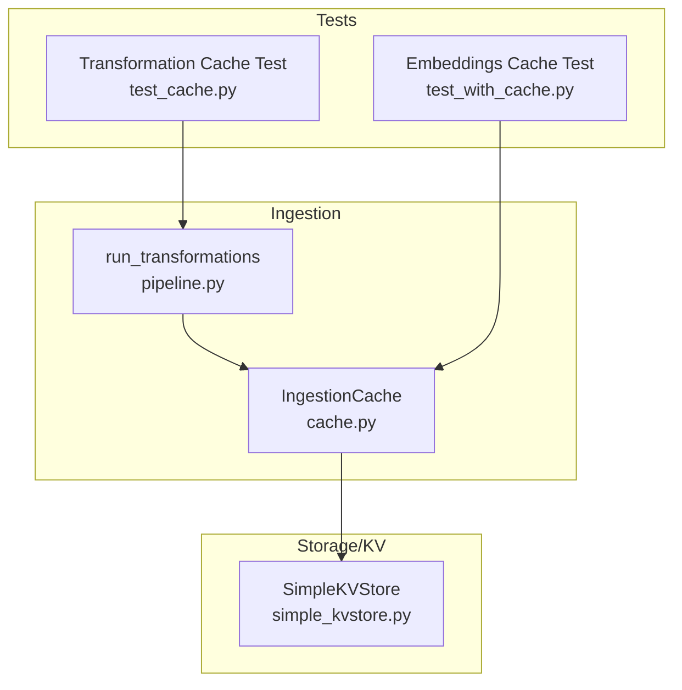
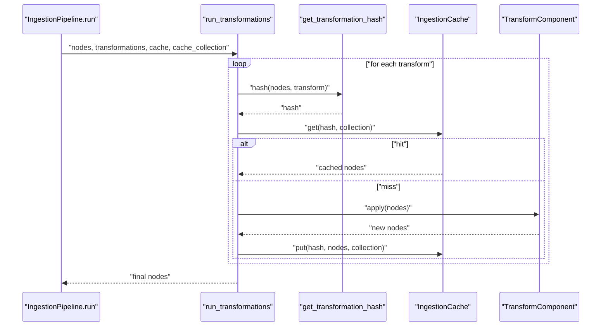
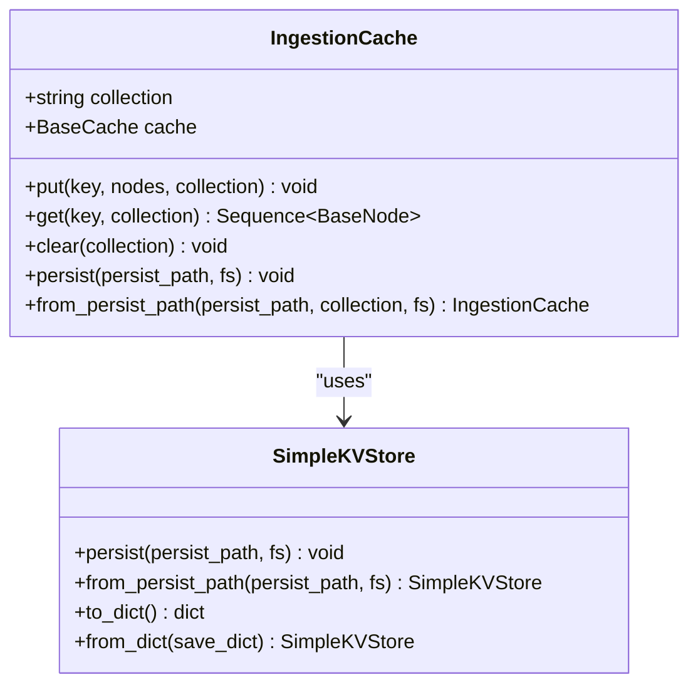
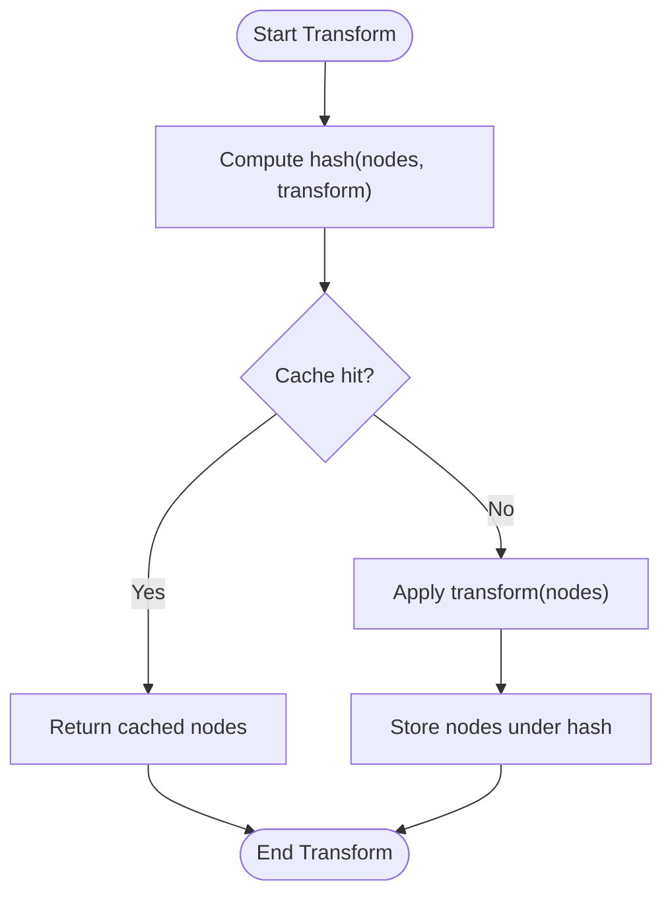
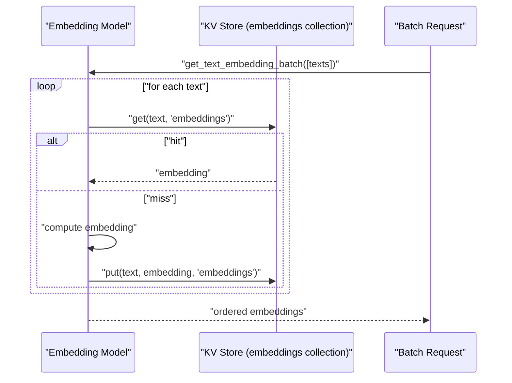
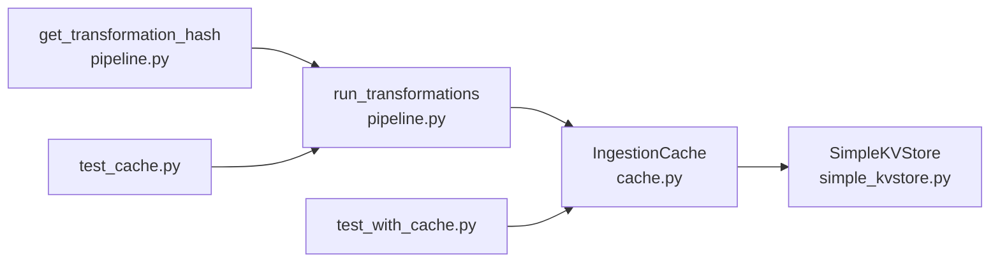

# Caching Strategies

<cite>
**Referenced Files in This Document**
- [cache.py](file://llama-index-core/llama_index/core/ingestion/cache.py)
- [pipeline.py](file://llama-index-core/llama_index/core/ingestion/pipeline.py)
- [simple_kvstore.py](file://llama-index-core/llama_index/core/storage/kvstore/simple_kvstore.py)
- [test_cache.py](file://llama-index-core/tests/ingestion/test_cache.py)
- [test_with_cache.py](file://llama-index-core/tests/embeddings/test_with_cache.py)
- [storage_context.py](file://llama-index-core/llama_index/core/storage/storage_context.py)
</cite>

## Table of Contents
1. [Introduction](#introduction)
2. [Project Structure](#project-structure)
3. [Core Components](#core-components)
4. [Architecture Overview](#architecture-overview)
5. [Detailed Component Analysis](#detailed-component-analysis)
6. [Dependency Analysis](#dependency-analysis)
7. [Performance Considerations](#performance-considerations)
8. [Troubleshooting Guide](#troubleshooting-guide)
9. [Conclusion](#conclusion)
10. [Appendices](#appendices)

## Introduction
This document explains caching strategies during data ingestion in LlamaIndex, focusing on how caches reduce redundant processing and improve performance. It covers the IngestionCache class, cache configuration, invalidation strategies, and practical patterns for embedding caching, processed node caching, and transformation result caching. It also provides guidance on cache sizing, persistence, monitoring, consistency, memory management, and performance optimization.

## Project Structure
The caching-related code resides primarily in the ingestion and storage modules:
- Ingestion cache and pipeline orchestration
- KV store backend for cache persistence
- Tests demonstrating cache usage for transformations and embeddings

**Diagram sources**
- [cache.py](file://llama-index-core/llama_index/core/ingestion/cache.py#L17-L79)
- [pipeline.py](file://llama-index-core/llama_index/core/ingestion/pipeline.py#L71-L144)
- [simple_kvstore.py](file://llama-index-core/llama_index/core/storage/kvstore/simple_kvstore.py#L16-L66)
- [test_cache.py](file://llama-index-core/tests/ingestion/test_cache.py#L15-L48)
- [test_with_cache.py](file://llama-index-core/tests/embeddings/test_with_cache.py#L14-L128)

**Section sources**
- [cache.py](file://llama-index-core/llama_index/core/ingestion/cache.py#L1-L79)
- [pipeline.py](file://llama-index-core/llama_index/core/ingestion/pipeline.py#L1-L779)
- [simple_kvstore.py](file://llama-index-core/llama_index/core/storage/kvstore/simple_kvstore.py#L1-L66)
- [test_cache.py](file://llama-index-core/tests/ingestion/test_cache.py#L1-L48)
- [test_with_cache.py](file://llama-index-core/tests/embeddings/test_with_cache.py#L1-L128)

## Core Components
- IngestionCache: A per-collection key-value cache optimized for storing processed nodes keyed by transformation hashes. It wraps a KV store backend and supports persistence and clearing.
- run_transformations: Orchestrates transformations with optional caching. For each transformation, it computes a deterministic hash of the input nodes and the transformation config, checks the cache, and either retrieves cached nodes or applies the transformation and stores the result.
- SimpleKVStore: An in-memory KV store with optional persistence to a file-backed JSON. Used by IngestionCache as the underlying cache storage.
- Tests: Demonstrate transformation caching and embedding caching patterns.

Key capabilities:
- Deterministic hashing of inputs plus transformation config ensures cache hits for identical workloads.
- Optional cache collection scoping allows separating caches across runs or tasks.
- Persistence enables cache reuse across process restarts when using SimpleKVStore.

**Section sources**
- [cache.py](file://llama-index-core/llama_index/core/ingestion/cache.py#L17-L79)
- [pipeline.py](file://llama-index-core/llama_index/core/ingestion/pipeline.py#L57-L105)
- [simple_kvstore.py](file://llama-index-core/llama_index/core/storage/kvstore/simple_kvstore.py#L16-L66)
- [test_cache.py](file://llama-index-core/tests/ingestion/test_cache.py#L15-L48)
- [test_with_cache.py](file://llama-index-core/tests/embeddings/test_with_cache.py#L14-L128)

## Architecture Overview
The ingestion pipeline integrates caching at the transformation stage. For each transformation, a hash is computed from the input nodes and the transformation’s serialized configuration. If the cache contains the hash, the cached nodes are returned; otherwise, the transformation is executed and the result is stored under that hash.

**Diagram sources**
- [pipeline.py](file://llama-index-core/llama_index/core/ingestion/pipeline.py#L71-L105)
- [pipeline.py](file://llama-index-core/llama_index/core/ingestion/pipeline.py#L57-L68)
- [cache.py](file://llama-index-core/llama_index/core/ingestion/cache.py#L27-L46)

## Detailed Component Analysis

### IngestionCache
- Purpose: Store and retrieve processed nodes keyed by a transformation hash. Supports collections for scoping.
- Methods:
  - put(key, nodes, collection): Serializes nodes to JSON-compatible dicts and stores under the given key and collection.
  - get(key, collection): Retrieves and deserializes nodes from cache.
  - clear(collection): Deletes all entries in a collection.
  - persist(persist_path, fs): Persists the underlying SimpleKVStore if used.
  - from_persist_path(persist_path, collection, fs): Loads a cache from a persisted file.
- Backing store: By default uses SimpleKVStore, enabling in-memory caching and optional persistence.

**Diagram sources**
- [cache.py](file://llama-index-core/llama_index/core/ingestion/cache.py#L17-L79)
- [simple_kvstore.py](file://llama-index-core/llama_index/core/storage/kvstore/simple_kvstore.py#L16-L66)

**Section sources**
- [cache.py](file://llama-index-core/llama_index/core/ingestion/cache.py#L17-L79)
- [simple_kvstore.py](file://llama-index-core/llama_index/core/storage/kvstore/simple_kvstore.py#L16-L66)

### Transformation Hashing and Caching Flow
- Hash computation: Combines serialized node content (with metadata) and a stable representation of the transformation’s configuration. Unstable values are stripped to ensure reproducibility.
- Caching logic: For each transformation, if the hash exists in cache, use cached nodes; otherwise, run the transformation and store the result.

**Diagram sources**
- [pipeline.py](file://llama-index-core/llama_index/core/ingestion/pipeline.py#L57-L105)

**Section sources**
- [pipeline.py](file://llama-index-core/llama_index/core/ingestion/pipeline.py#L57-L105)

### Embedding Caching Pattern
- Embedding models can leverage a shared KV store to cache computed embeddings. Tests demonstrate:
  - Pre-seeding cache entries for known inputs.
  - Batch embedding calls that partially hit cache, minimizing external calls.
  - Both sync and async embedding APIs supporting cache-backed retrieval.

**Diagram sources**
- [test_with_cache.py](file://llama-index-core/tests/embeddings/test_with_cache.py#L28-L69)
- [test_with_cache.py](file://llama-index-core/tests/embeddings/test_with_cache.py#L87-L127)

**Section sources**
- [test_with_cache.py](file://llama-index-core/tests/embeddings/test_with_cache.py#L14-L128)

### Practical Implementation Patterns
- Transformation caching in pipelines:
  - Enable caching via IngestionPipeline cache field and optionally set cache_collection to isolate runs.
  - Use run_transformations or IngestionPipeline.run to benefit from automatic hash-based caching.
- Embedding caching:
  - Configure embedding models to use a shared SimpleKVStore as embeddings_cache.
  - Seed cache with known inputs to maximize hit rates.
- Persistence and reuse:
  - Persist the ingestion cache to disk using IngestionCache.persist and reload with from_persist_path.
  - For embedding cache, persist the KV store similarly.

**Section sources**
- [pipeline.py](file://llama-index-core/llama_index/core/ingestion/pipeline.py#L263-L326)
- [cache.py](file://llama-index-core/llama_index/core/ingestion/cache.py#L55-L75)
- [test_with_cache.py](file://llama-index-core/tests/embeddings/test_with_cache.py#L14-L128)

## Dependency Analysis
- IngestionCache depends on a KV store interface and defaults to SimpleKVStore.
- run_transformations depends on get_transformation_hash and IngestionCache.
- Tests validate both transformation and embedding caching behaviors.

**Diagram sources**
- [pipeline.py](file://llama-index-core/llama_index/core/ingestion/pipeline.py#L57-L105)
- [cache.py](file://llama-index-core/llama_index/core/ingestion/cache.py#L17-L79)
- [simple_kvstore.py](file://llama-index-core/llama_index/core/storage/kvstore/simple_kvstore.py#L16-L66)
- [test_cache.py](file://llama-index-core/tests/ingestion/test_cache.py#L15-L48)
- [test_with_cache.py](file://llama-index-core/tests/embeddings/test_with_cache.py#L14-L128)

**Section sources**
- [pipeline.py](file://llama-index-core/llama_index/core/ingestion/pipeline.py#L57-L105)
- [cache.py](file://llama-index-core/llama_index/core/ingestion/cache.py#L17-L79)
- [simple_kvstore.py](file://llama-index-core/llama_index/core/storage/kvstore/simple_kvstore.py#L16-L66)
- [test_cache.py](file://llama-index-core/tests/ingestion/test_cache.py#L15-L48)
- [test_with_cache.py](file://llama-index-core/tests/embeddings/test_with_cache.py#L14-L128)

## Performance Considerations
- Hash stability: get_transformation_hash strips unstable values from transformation configs to avoid cache misses due to ephemeral identifiers.
- Batch embedding efficiency: Tests show that partial cache hits in batch requests minimize external calls and reduce latency.
- Persistence cost vs. benefit: Persisting SimpleKVStore avoids recomputation across runs but adds IO overhead; evaluate based on workload frequency.
- Memory footprint: SimpleKVStore is in-memory; for large caches, consider persistence trade-offs and periodic cleanup.

[No sources needed since this section provides general guidance]

## Troubleshooting Guide
- Cache does not invalidate across runs:
  - Ensure you persist and reload the cache when needed, or clear the cache between runs.
- Unexpected cache misses:
  - Verify transformation configurations are stable and deterministic; unstable values are removed by the hashing logic.
- Cache corruption or stale data:
  - Clear the cache collection and rebuild it incrementally.
- Persistence errors:
  - Confirm the filesystem and path permissions for persist operations.

**Section sources**
- [cache.py](file://llama-index-core/llama_index/core/ingestion/cache.py#L48-L75)
- [pipeline.py](file://llama-index-core/llama_index/core/ingestion/pipeline.py#L57-L68)
- [test_cache.py](file://llama-index-core/tests/ingestion/test_cache.py#L33-L48)

## Conclusion
LlamaIndex provides robust caching for ingestion through IngestionCache and transformation hashing. By leveraging deterministic keys, optional persistence, and scoped collections, caching significantly reduces redundant processing for both node transformations and embeddings. Proper configuration, monitoring, and maintenance ensure high cache hit rates, strong consistency, and optimal performance.

[No sources needed since this section summarizes without analyzing specific files]

## Appendices

### Configuration Options and Best Practices
- IngestionCache
  - collection: Scope cache entries by run/task.
  - cache: Provide a custom KV store backend if needed.
  - persist/from_persist_path: Enable cache reuse across sessions.
- IngestionPipeline
  - cache: Inject a configured IngestionCache instance.
  - disable_cache: Temporarily bypass caching for debugging.
  - cache_collection: Isolate caches across runs or environments.
- Embedding models
  - Use a shared SimpleKVStore as embeddings_cache.
  - Pre-seed cache with known inputs to maximize hit rates.

**Section sources**
- [cache.py](file://llama-index-core/llama_index/core/ingestion/cache.py#L17-L79)
- [pipeline.py](file://llama-index-core/llama_index/core/ingestion/pipeline.py#L263-L326)
- [simple_kvstore.py](file://llama-index-core/llama_index/core/storage/kvstore/simple_kvstore.py#L16-L66)
- [test_with_cache.py](file://llama-index-core/tests/embeddings/test_with_cache.py#L14-L128)