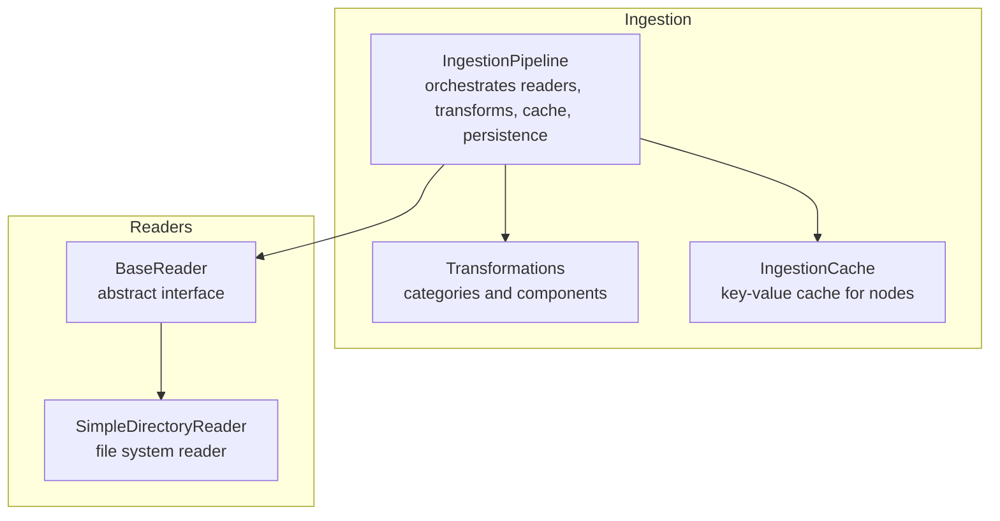
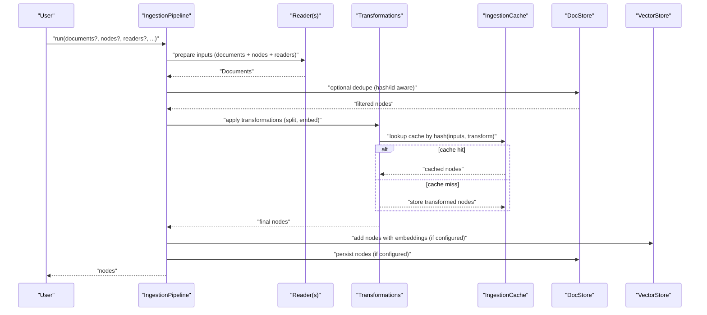
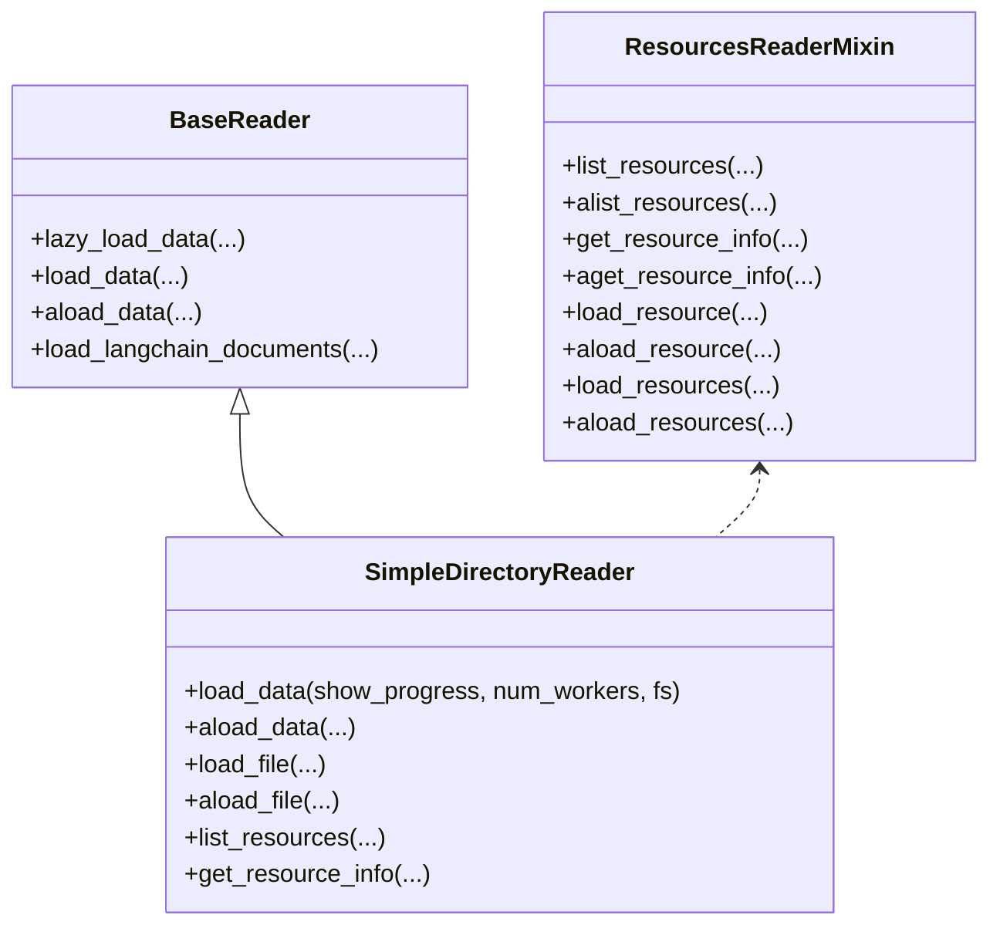
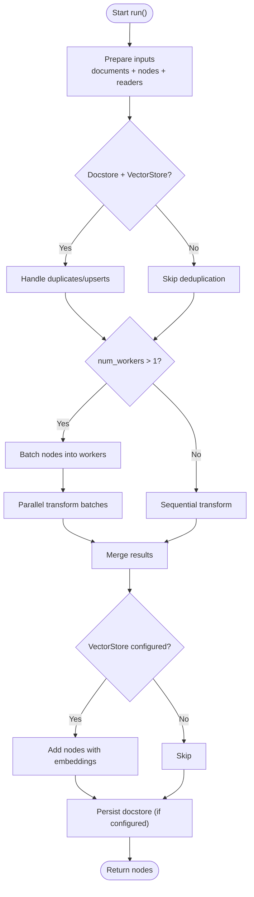
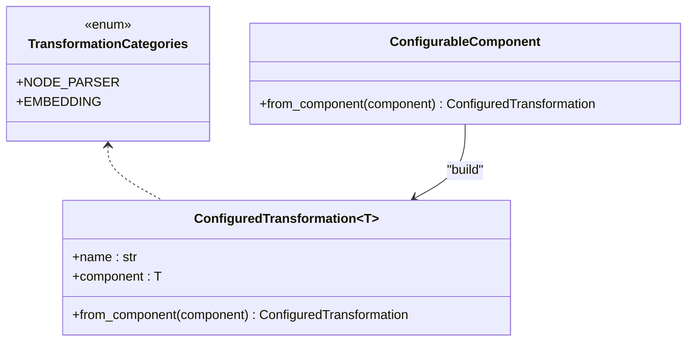
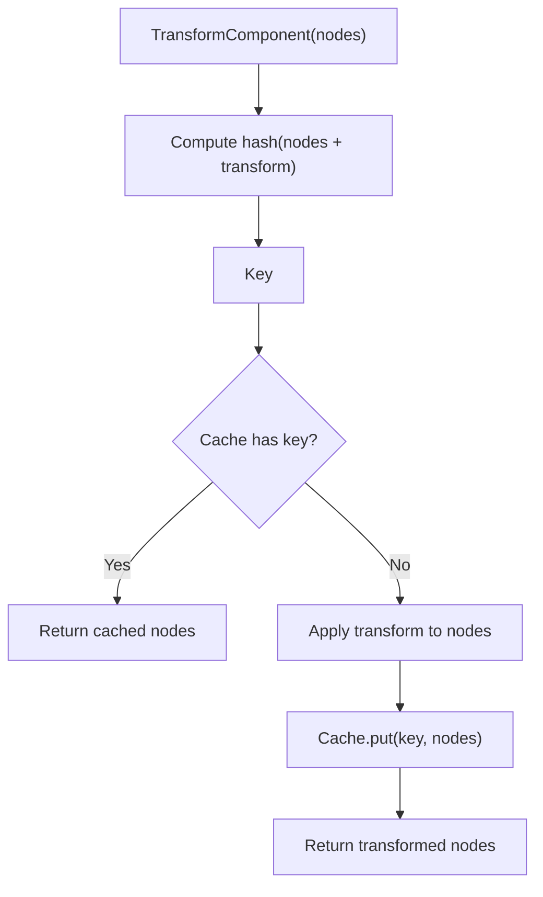
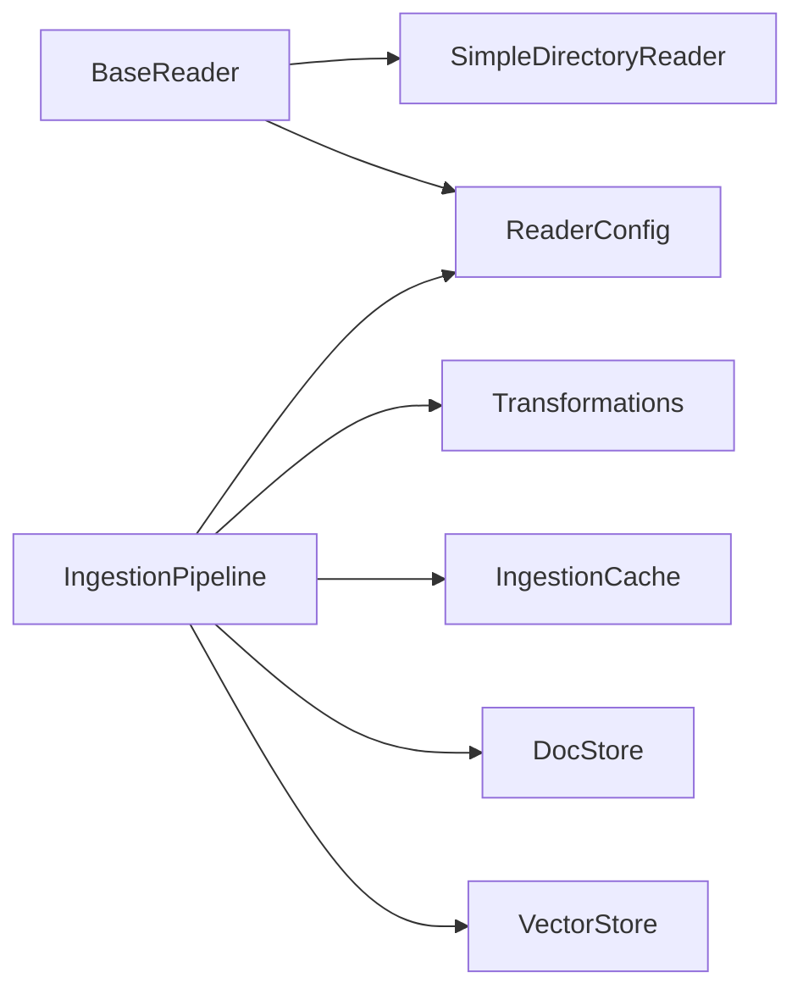

# Data Ingestion

<cite>
**Referenced Files in This Document**
- [pipeline.py](file://llama-index-core/llama_index/core/ingestion/pipeline.py)
- [transformations.py](file://llama-index-core/llama_index/core/ingestion/transformations.py)
- [cache.py](file://llama-index-core/llama_index/core/ingestion/cache.py)
- [base.py](file://llama-index-core/llama_index/core/readers/base.py)
- [file/base.py](file://llama-index-core/llama_index/core/readers/file/base.py)
- [__init__.py](file://llama-index-core/llama_index/core/ingestion/__init__.py)
- [simple_directory_reader.ipynb](file://docs/examples/data_connectors/simple_directory_reader.ipynb)
- [simple_directory_reader_parallel.ipynb](file://docs/examples/data_connectors/simple_directory_reader_parallel.ipynb)
</cite>

## Table of Contents
1. [Introduction](#introduction)
2. [Project Structure](#project-structure)
3. [Core Components](#core-components)
4. [Architecture Overview](#architecture-overview)
5. [Detailed Component Analysis](#detailed-component-analysis)
6. [Dependency Analysis](#dependency-analysis)
7. [Performance Considerations](#performance-considerations)
8. [Troubleshooting Guide](#troubleshooting-guide)
9. [Conclusion](#conclusion)
10. [Appendices](#appendices)

## Introduction
This document explains the LlamaIndex data ingestion system with a focus on:
- Reader architecture for loading data from diverse sources (files, databases, web, APIs)
- The ingestion pipeline that orchestrates transformations and persistence
- The transformation system that converts raw data into nodes
- Practical examples for building custom readers, configuring ingestion pipelines, and handling different document types
- Performance optimization, error handling, and best practices for large-scale ingestion

## Project Structure
The ingestion system centers around three core modules:
- Ingestion pipeline: orchestrates readers, transformations, caching, and persistence
- Transformations: enumerates supported transformation categories and components
- Readers: base abstractions and concrete implementations (e.g., file system reader)

**Diagram sources**
- [pipeline.py](file://llama-index-core/llama_index/core/ingestion/pipeline.py#L193-L779)
- [transformations.py](file://llama-index-core/llama_index/core/ingestion/transformations.py#L1-L379)
- [cache.py](file://llama-index-core/llama_index/core/ingestion/cache.py#L1-L79)
- [base.py](file://llama-index-core/llama_index/core/readers/base.py#L1-L250)
- [file/base.py](file://llama-index-core/llama_index/core/readers/file/base.py#L208-L873)

**Section sources**
- [pipeline.py](file://llama-index-core/llama_index/core/ingestion/pipeline.py#L193-L779)
- [transformations.py](file://llama-index-core/llama_index/core/ingestion/transformations.py#L1-L379)
- [cache.py](file://llama-index-core/llama_index/core/ingestion/cache.py#L1-L79)
- [base.py](file://llama-index-core/llama_index/core/readers/base.py#L1-L250)
- [file/base.py](file://llama-index-core/llama_index/core/readers/file/base.py#L208-L873)

## Core Components
- IngestionPipeline: central orchestration class that prepares inputs (documents or nodes), optionally deduplicates via docstore, applies transformations, and persists results
- Transformations: defines transformation categories (node parsing, embeddings) and builds a configurable enum of supported components
- IngestionCache: key-value cache for storing transformed nodes keyed by a deterministic hash of inputs and transformation metadata
- BaseReader and SimpleDirectoryReader: abstract reader interface and a concrete file-system reader supporting many formats and parallel loading

Key capabilities:
- Reader-driven ingestion via ReaderConfig
- Built-in node parser and embedding transformations
- Optional docstore-based deduplication (hash/id-aware)
- Optional cache-backed transformation reuse
- Optional persistence of cache and docstore

**Section sources**
- [pipeline.py](file://llama-index-core/llama_index/core/ingestion/pipeline.py#L193-L779)
- [transformations.py](file://llama-index-core/llama_index/core/ingestion/transformations.py#L1-L379)
- [cache.py](file://llama-index-core/llama_index/core/ingestion/cache.py#L1-L79)
- [base.py](file://llama-index-core/llama_index/core/readers/base.py#L1-L250)
- [file/base.py](file://llama-index-core/llama_index/core/readers/file/base.py#L208-L873)

## Architecture Overview
The ingestion pipeline integrates readers, transformations, caching, and persistence into a cohesive workflow.

**Diagram sources**
- [pipeline.py](file://llama-index-core/llama_index/core/ingestion/pipeline.py#L467-L575)
- [pipeline.py](file://llama-index-core/llama_index/core/ingestion/pipeline.py#L108-L143)
- [pipeline.py](file://llama-index-core/llama_index/core/ingestion/pipeline.py#L382-L438)
- [cache.py](file://llama-index-core/llama_index/core/ingestion/cache.py#L27-L46)

## Detailed Component Analysis

### Reader Interface and Implementations
- BaseReader defines synchronous/asynchronous loading and conversion to LangChain documents
- SimpleDirectoryReader supports many file formats, metadata extraction, resource listing, and parallel loading

Practical usage examples:
- Loading specific files or directories
- Filtering by extensions and recursion
- Async loading and iterative processing
- Parallel file loading for large datasets

**Diagram sources**
- [base.py](file://llama-index-core/llama_index/core/readers/base.py#L19-L250)
- [file/base.py](file://llama-index-core/llama_index/core/readers/file/base.py#L208-L873)

**Section sources**
- [base.py](file://llama-index-core/llama_index/core/readers/base.py#L19-L250)
- [file/base.py](file://llama-index-core/llama_index/core/readers/file/base.py#L208-L873)
- [simple_directory_reader.ipynb](file://docs/examples/data_connectors/simple_directory_reader.ipynb#L242-L491)
- [simple_directory_reader_parallel.ipynb](file://docs/examples/data_connectors/simple_directory_reader_parallel.ipynb#L55-L289)

### Ingestion Pipeline Workflow
- Inputs: documents, nodes, or readers
- Deduplication: optional docstore strategies (upserts, duplicates_only, upserts_and_delete)
- Transformations: sequential application with optional caching
- Persistence: optional cache and docstore persistence

**Diagram sources**
- [pipeline.py](file://llama-index-core/llama_index/core/ingestion/pipeline.py#L467-L575)
- [pipeline.py](file://llama-index-core/llama_index/core/ingestion/pipeline.py#L440-L448)
- [pipeline.py](file://llama-index-core/llama_index/core/ingestion/pipeline.py#L530-L563)

**Section sources**
- [pipeline.py](file://llama-index-core/llama_index/core/ingestion/pipeline.py#L467-L575)
- [pipeline.py](file://llama-index-core/llama_index/core/ingestion/pipeline.py#L440-L448)

### Transformation System
- Categories: NodeParser (documents → nodes), Embedding (nodes → nodes)
- Configurable components: dynamically enumerates available parsers and embeddings
- ConfiguredTransformation: typed wrapper for components used in pipelines

Supported components include sentence/token-aware splitters, HTML/markdown/json parsers, and multiple embedding providers.

**Diagram sources**
- [transformations.py](file://llama-index-core/llama_index/core/ingestion/transformations.py#L60-L379)

**Section sources**
- [transformations.py](file://llama-index-core/llama_index/core/ingestion/transformations.py#L1-L379)

### Caching and Persistence
- IngestionCache stores sequences of nodes under a computed key derived from input nodes and transformation metadata
- Supports persistence for simple KV stores and loading from persisted paths

**Diagram sources**
- [pipeline.py](file://llama-index-core/llama_index/core/ingestion/pipeline.py#L57-L105)
- [cache.py](file://llama-index-core/llama_index/core/ingestion/cache.py#L27-L46)

**Section sources**
- [pipeline.py](file://llama-index-core/llama_index/core/ingestion/pipeline.py#L57-L105)
- [cache.py](file://llama-index-core/llama_index/core/ingestion/cache.py#L1-L79)

### Practical Examples

- Creating a custom reader
  - Implement BaseReader or BasePydanticReader and define load_data/lazy_load_data
  - Optionally mix in ResourcesReaderMixin for resource listing and per-resource loading
  - Wrap in ReaderConfig and pass to IngestionPipeline

- Configuring an ingestion pipeline
  - Define transformations (e.g., sentence splitter + embedding)
  - Optionally set docstore and vector store for deduplication and persistence
  - Optionally enable/disable cache and set cache collection

- Handling different document types
  - Use SimpleDirectoryReader with file_extractor to map extensions to specialized readers
  - Leverage metadata functions and filename_as_id for richer provenance

- Parallel processing
  - Use SimpleDirectoryReader.load_data(num_workers=N) for file loading
  - Use IngestionPipeline.run(num_workers=N) for transformation parallelism

**Section sources**
- [base.py](file://llama-index-core/llama_index/core/readers/base.py#L19-L250)
- [file/base.py](file://llama-index-core/llama_index/core/readers/file/base.py#L208-L873)
- [simple_directory_reader.ipynb](file://docs/examples/data_connectors/simple_directory_reader.ipynb#L242-L491)
- [simple_directory_reader_parallel.ipynb](file://docs/examples/data_connectors/simple_directory_reader_parallel.ipynb#L55-L289)

## Dependency Analysis
- IngestionPipeline depends on:
  - ReaderConfig and BaseReader implementations for input
  - TransformComponent implementations (parsers, embeddings)
  - IngestionCache for transformation caching
  - DocStore and VectorStore for persistence and deduplication
- Transformations module enumerates supported components and builds a configurable enum
- Readers module provides BaseReader and SimpleDirectoryReader

**Diagram sources**
- [pipeline.py](file://llama-index-core/llama_index/core/ingestion/pipeline.py#L193-L779)
- [transformations.py](file://llama-index-core/llama_index/core/ingestion/transformations.py#L1-L379)
- [cache.py](file://llama-index-core/llama_index/core/ingestion/cache.py#L1-L79)
- [base.py](file://llama-index-core/llama_index/core/readers/base.py#L1-L250)
- [file/base.py](file://llama-index-core/llama_index/core/readers/file/base.py#L208-L873)

**Section sources**
- [__init__.py](file://llama-index-core/llama_index/core/ingestion/__init__.py#L1-L16)
- [pipeline.py](file://llama-index-core/llama_index/core/ingestion/pipeline.py#L193-L779)
- [transformations.py](file://llama-index-core/llama_index/core/ingestion/transformations.py#L1-L379)
- [cache.py](file://llama-index-core/llama_index/core/ingestion/cache.py#L1-L79)
- [base.py](file://llama-index-core/llama_index/core/readers/base.py#L1-L250)
- [file/base.py](file://llama-index-core/llama_index/core/readers/file/base.py#L208-L873)

## Performance Considerations
- Parallel loading and transformation
  - SimpleDirectoryReader supports num_workers for parallel file loading
  - IngestionPipeline supports num_workers for parallel transformation batches
- Batching
  - Internal batching divides nodes into worker-sized chunks
- Caching
  - run_transformations/arun_transformations cache results keyed by input nodes and transformation metadata
- Deduplication overhead
  - Docstore strategies incur extra lookups; use only when needed
- I/O and parsing costs
  - Large PDFs, spreadsheets, and media benefit from parallel processing
- Platform-specific notes
  - Parallelism gains vary by OS; see notebook guidance for Windows vs Linux/macOS

[No sources needed since this section provides general guidance]

## Troubleshooting Guide
- Reader errors
  - ImportError for missing dependencies is propagated for file readers
  - raise_on_error controls whether to fail fast or skip problematic files
- Async pitfalls
  - Ensure proper event loop handling when mixing threads and async
- Deduplication mismatches
  - Verify docstore strategy aligns with presence of vector store
- Cache invalidation
  - Clear cache when changing transformation parameters or input data
- Resource limits
  - Reduce num_workers if encountering memory pressure

**Section sources**
- [file/base.py](file://llama-index-core/llama_index/core/readers/file/base.py#L614-L626)
- [file/base.py](file://llama-index-core/llama_index/core/readers/file/base.py#L687-L696)
- [pipeline.py](file://llama-index-core/llama_index/core/ingestion/pipeline.py#L530-L537)
- [cache.py](file://llama-index-core/llama_index/core/ingestion/cache.py#L48-L54)

## Conclusion
LlamaIndex’s ingestion system provides a flexible, extensible framework for loading data from varied sources, transforming it into nodes, and persisting results efficiently. By combining readers, transformations, caching, and optional docstore/vector store integration, it supports scalable ingestion across diverse environments and workloads.

[No sources needed since this section summarizes without analyzing specific files]

## Appendices

### Best Practices
- Use SimpleDirectoryReader with file_extractor for mixed-format ingestion
- Enable parallel loading and transformation for large datasets
- Configure docstore strategy appropriately (upserts vs duplicates_only)
- Persist cache and docstore for incremental ingestion and reproducibility
- Monitor performance and adjust num_workers and batching based on hardware

[No sources needed since this section provides general guidance]