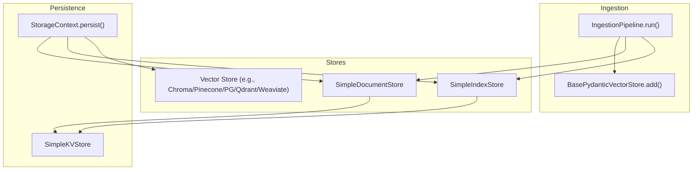
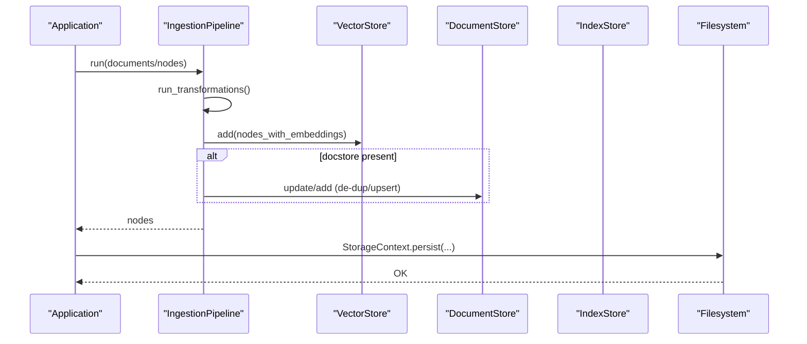
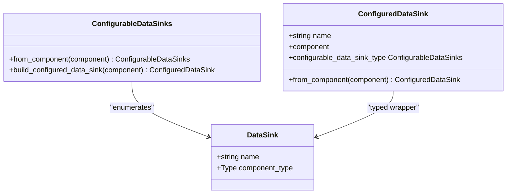
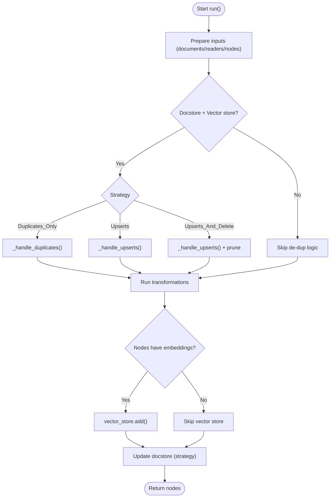
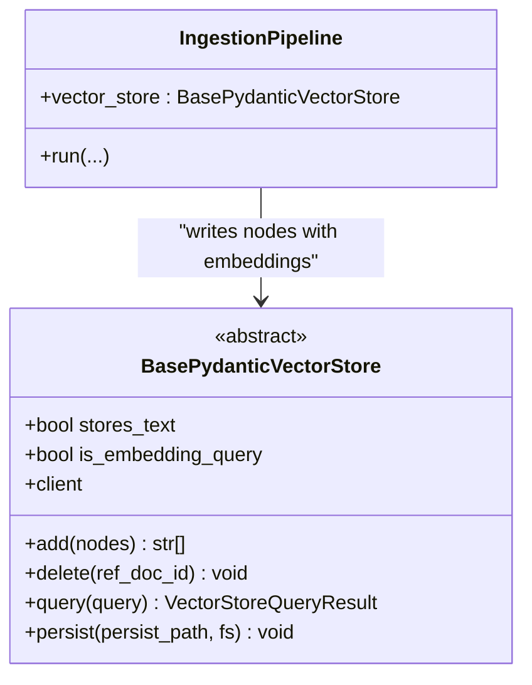
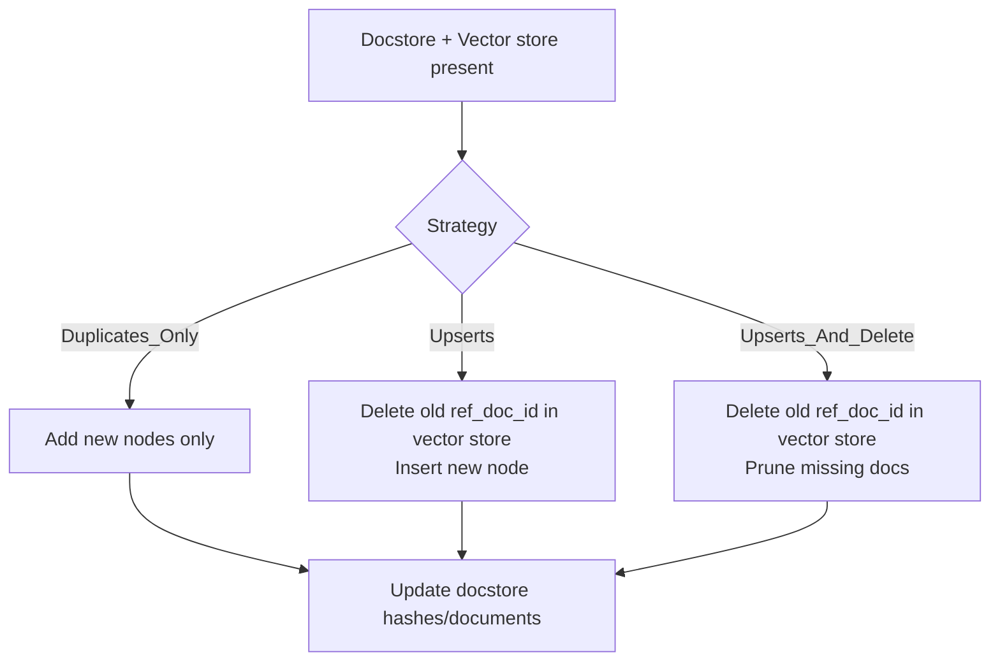
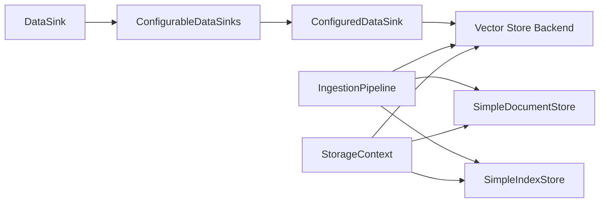

# Data Sinks

<cite>
**Referenced Files in This Document**
- [data_sinks.py](file://llama-index-core/llama_index/core/ingestion/data_sinks.py)
- [pipeline.py](file://llama-index-core/llama_index/core/ingestion/pipeline.py)
- [storage_context.py](file://llama-index-core/llama_index/core/storage/storage_context.py)
- [simple_docstore.py](file://llama-index-core/llama_index/core/storage/docstore/simple_docstore.py)
- [simple_index_store.py](file://llama-index-core/llama_index/core/storage/index_store/simple_index_store.py)
- [simple_kvstore.py](file://llama-index-core/llama_index/core/storage/kvstore/simple_kvstore.py)
- [types.py](file://llama-index-core/llama_index/core/vector_stores/types.py)
- [test_data_sinks.py](file://llama-index-core/tests/ingestion/test_data_sinks.py)
</cite>

## Table of Contents
1. [Introduction](#introduction)
2. [Project Structure](#project-structure)
3. [Core Components](#core-components)
4. [Architecture Overview](#architecture-overview)
5. [Detailed Component Analysis](#detailed-component-analysis)
6. [Dependency Analysis](#dependency-analysis)
7. [Performance Considerations](#performance-considerations)
8. [Troubleshooting Guide](#troubleshooting-guide)
9. [Conclusion](#conclusion)

## Introduction
This document explains the Data Sinks component of the LlamaIndex Ingestion Pipeline. It focuses on how processed nodes are stored and persisted through various output destinations, including vector stores, document stores, and index stores. It covers sink configuration options, storage backends, and persistence strategies. It also describes vector store integration, document store management, index population, practical setup examples, performance optimization, backup strategies, and data migration patterns.

## Project Structure
The Data Sinks feature is centered around:
- A typed registry of supported vector store backends (DataSink and ConfigurableDataSinks)
- A strongly-typed wrapper for configured sinks (ConfiguredDataSink)
- The ingestion pipeline that writes nodes to vector stores and updates document/index stores
- Storage context that persists stores to disk or remote filesystems
- Simple in-memory and persistent implementations of document store, index store, and key-value store

**Diagram sources**
- [pipeline.py](file://llama-index-core/llama_index/core/ingestion/pipeline.py#L467-L575)
- [storage_context.py](file://llama-index-core/llama_index/core/storage/storage_context.py#L151-L203)
- [simple_docstore.py](file://llama-index-core/llama_index/core/storage/docstore/simple_docstore.py#L84-L92)
- [simple_index_store.py](file://llama-index-core/llama_index/core/storage/index_store/simple_index_store.py#L60-L67)
- [types.py](file://llama-index-core/llama_index/core/vector_stores/types.py#L334-L439)

**Section sources**
- [data_sinks.py](file://llama-index-core/llama_index/core/ingestion/data_sinks.py#L11-L181)
- [pipeline.py](file://llama-index-core/llama_index/core/ingestion/pipeline.py#L193-L575)
- [storage_context.py](file://llama-index-core/llama_index/core/storage/storage_context.py#L52-L203)

## Core Components
- DataSink: Lightweight metadata describing a supported sink backend (human-readable name and component type).
- ConfigurableDataSinks: Dynamic enum built at runtime that enumerates available vector store backends (e.g., Chroma, Pinecone, PostgreSQL, Qdrant, Weaviate). Backends are included only if their packages are importable.
- ConfiguredDataSink: A strongly-typed wrapper around a concrete vector store instance, enabling type-safe configuration and schema generation.
- IngestionPipeline: Orchestrates transformations, computes embeddings, writes nodes with embeddings to vector stores, and updates document/index stores. It optionally handles de-duplication via a document store.
- StorageContext: Aggregates and persists all stores (document, index, vector, graph, property graph) to a local or remote filesystem.

Key behaviors:
- Vector store integration: Nodes with computed embeddings are added to the configured vector store during pipeline run.
- Document store management: Supports three strategies for handling duplicates/upserts and can delete stale documents when requested.
- Index store management: Stores index-related metadata in a separate store.
- Persistence: All stores expose a persist method; StorageContext coordinates saving to disk or a remote filesystem.

**Section sources**
- [data_sinks.py](file://llama-index-core/llama_index/core/ingestion/data_sinks.py#L11-L181)
- [pipeline.py](file://llama-index-core/llama_index/core/ingestion/pipeline.py#L193-L575)
- [storage_context.py](file://llama-index-core/llama_index/core/storage/storage_context.py#L52-L203)

## Architecture Overview
The ingestion pipeline writes processed nodes to sinks in a controlled order:
1. Transform and embed nodes.
2. Add nodes with embeddings to the vector store.
3. Update the document store (with de-duplication/upsert logic).
4. Persist stores to disk or a remote filesystem via StorageContext.

**Diagram sources**
- [pipeline.py](file://llama-index-core/llama_index/core/ingestion/pipeline.py#L467-L575)
- [storage_context.py](file://llama-index-core/llama_index/core/storage/storage_context.py#L151-L203)

## Detailed Component Analysis

### DataSink and ConfigurableDataSinks
- DataSink defines a named backend and its component type.
- ConfigurableDataSinks is dynamically constructed at runtime by inspecting imports. Each available vector store backend contributes a member to the enum.
- ConfiguredDataSink wraps a concrete vector store instance and exposes a typed interface for downstream configuration and schema generation.

**Diagram sources**
- [data_sinks.py](file://llama-index-core/llama_index/core/ingestion/data_sinks.py#L11-L181)

**Section sources**
- [data_sinks.py](file://llama-index-core/llama_index/core/ingestion/data_sinks.py#L11-L181)
- [test_data_sinks.py](file://llama-index-core/tests/ingestion/test_data_sinks.py#L16-L77)

### IngestionPipeline and Sink Population
- The pipeline prepares inputs from documents/readers/nodes, applies transformations, and writes nodes with embeddings to the vector store.
- If a document store is provided, it enforces de-duplication strategies:
  - DUPLICATES_ONLY: adds only new hashes.
  - UPSERTS: deletes prior versions of changed documents and inserts new ones.
  - UPSERTS_AND_DELETE: additionally prunes removed documents from both docstore and vector store.
- After writing to sinks, the pipeline returns the transformed nodes.

**Diagram sources**
- [pipeline.py](file://llama-index-core/llama_index/core/ingestion/pipeline.py#L467-L575)

**Section sources**
- [pipeline.py](file://llama-index-core/llama_index/core/ingestion/pipeline.py#L193-L575)

### Vector Store Integration
- Vector stores implement a common interface with add/delete/query methods and optional async variants.
- BasePydanticVectorStore extends BaseComponent and defines the contract for adding nodes, deleting by reference document ID, querying, and persistence hooks.
- During ingestion, nodes with embeddings are added to the configured vector store.

**Diagram sources**
- [types.py](file://llama-index-core/llama_index/core/vector_stores/types.py#L334-L439)
- [pipeline.py](file://llama-index-core/llama_index/core/ingestion/pipeline.py#L567-L571)

**Section sources**
- [types.py](file://llama-index-core/llama_index/core/vector_stores/types.py#L268-L439)
- [pipeline.py](file://llama-index-core/llama_index/core/ingestion/pipeline.py#L567-L571)

### Document Store Management
- SimpleDocumentStore persists key-value-backed documents and supports both in-memory and persisted modes.
- IngestionPipeline updates the document store according to the selected strategy and can store document text depending on configuration.
- De-duplication/upsert logic ensures that changed documents are removed from the vector store before re-insertion.

**Diagram sources**
- [pipeline.py](file://llama-index-core/llama_index/core/ingestion/pipeline.py#L400-L438)
- [simple_docstore.py](file://llama-index-core/llama_index/core/storage/docstore/simple_docstore.py#L84-L92)

**Section sources**
- [pipeline.py](file://llama-index-core/llama_index/core/ingestion/pipeline.py#L400-L438)
- [simple_docstore.py](file://llama-index-core/llama_index/core/storage/docstore/simple_docstore.py#L20-L102)

### Index Store Management
- SimpleIndexStore persists index metadata to a key-value store and supports both in-memory and persisted modes.
- StorageContext aggregates index stores and coordinates persistence across namespaces.

**Section sources**
- [simple_index_store.py](file://llama-index-core/llama_index/core/storage/index_store/simple_index_store.py#L19-L77)
- [storage_context.py](file://llama-index-core/llama_index/core/storage/storage_context.py#L52-L203)

### Persistence Strategies and Backends
- SimpleKVStore persists collections to JSON files and supports both local and remote filesystems via fsspec.
- StorageContext.persist saves document store, index store, graph store, property graph store, and each named vector store to dedicated files.
- Vector stores expose a persist hook; simple vector stores persist their internal state similarly.

**Section sources**
- [simple_kvstore.py](file://llama-index-core/llama_index/core/storage/kvstore/simple_kvstore.py#L35-L66)
- [storage_context.py](file://llama-index-core/llama_index/core/storage/storage_context.py#L151-L203)
- [simple_docstore.py](file://llama-index-core/llama_index/core/storage/docstore/simple_docstore.py#L84-L92)
- [simple_index_store.py](file://llama-index-core/llama_index/core/storage/index_store/simple_index_store.py#L60-L67)
- [types.py](file://llama-index-core/llama_index/core/vector_stores/types.py#L435-L439)

## Dependency Analysis
- DataSink and ConfigurableDataSinks depend on vector store implementations being importable; otherwise, those backends are omitted from the enum.
- IngestionPipeline depends on BasePydanticVectorStore for vector operations and SimpleDocumentStore/SimpleIndexStore for metadata persistence.
- StorageContext composes all stores and delegates persistence to each store’s implementation.

**Diagram sources**
- [data_sinks.py](file://llama-index-core/llama_index/core/ingestion/data_sinks.py#L52-L147)
- [pipeline.py](file://llama-index-core/llama_index/core/ingestion/pipeline.py#L193-L575)
- [storage_context.py](file://llama-index-core/llama_index/core/storage/storage_context.py#L52-L203)

**Section sources**
- [data_sinks.py](file://llama-index-core/llama_index/core/ingestion/data_sinks.py#L52-L147)
- [pipeline.py](file://llama-index-core/llama_index/core/ingestion/pipeline.py#L193-L575)
- [storage_context.py](file://llama-index-core/llama_index/core/storage/storage_context.py#L52-L203)

## Performance Considerations
- Batch writes: Prefer vector stores optimized for bulk insertions and tune batch sizes to match backend capabilities.
- Embedding computation: Offload embedding computation efficiently and avoid recomputation by leveraging caching and incremental ingestion.
- Parallelism: Use process-based parallelism in the pipeline when appropriate, respecting CPU limits.
- De-duplication cost: Upsert strategies involve extra delete and lookup operations; choose DUPLICATES_ONLY for speed when upsert semantics are unnecessary.
- Persistence overhead: Persist stores after large batches to minimize repeated writes; consider remote filesystems with efficient write patterns.

[No sources needed since this section provides general guidance]

## Troubleshooting Guide
- Missing backend: If a vector store backend is not importable, it will not appear in ConfigurableDataSinks. Ensure the required package is installed.
- Wrong component type: Attempting to construct a ConfiguredDataSink with a mismatched component type raises a ValueError.
- Duplicate names: The dynamic enum enforces unique names across backends.
- Persistence errors: Verify persist paths and filesystem permissions; StorageContext persists multiple stores and requires writable directories.

**Section sources**
- [data_sinks.py](file://llama-index-core/llama_index/core/ingestion/data_sinks.py#L52-L147)
- [test_data_sinks.py](file://llama-index-core/tests/ingestion/test_data_sinks.py#L16-L77)
- [storage_context.py](file://llama-index-core/llama_index/core/storage/storage_context.py#L151-L203)

## Conclusion
The Data Sinks component integrates tightly with the ingestion pipeline to persist processed nodes into vector stores and auxiliary stores. Through a dynamic registry of backends, typed wrappers, and robust persistence mechanisms, it enables flexible deployment across local and remote environments. By selecting appropriate strategies and backends, teams can optimize ingestion throughput, manage data lifecycles effectively, and maintain reliable backups and migrations.