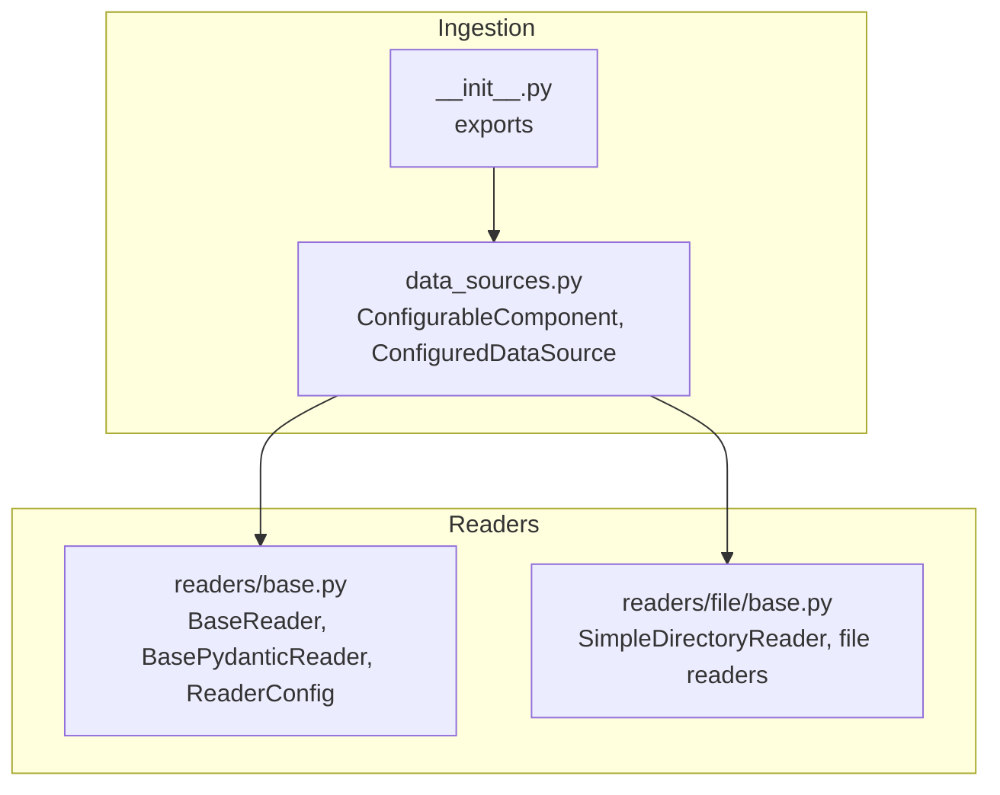
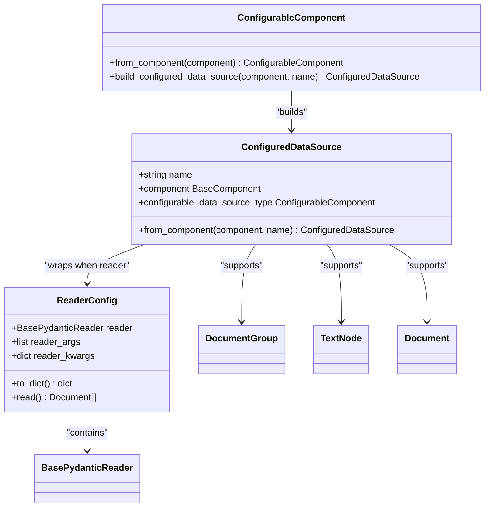
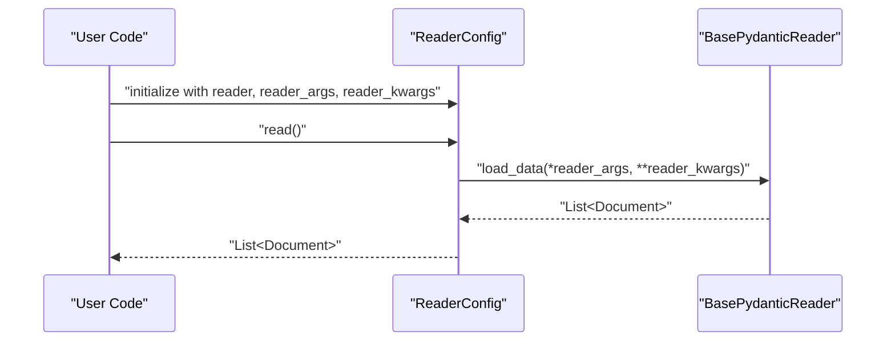
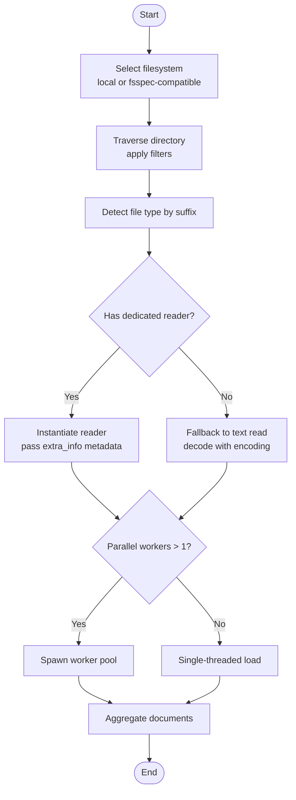
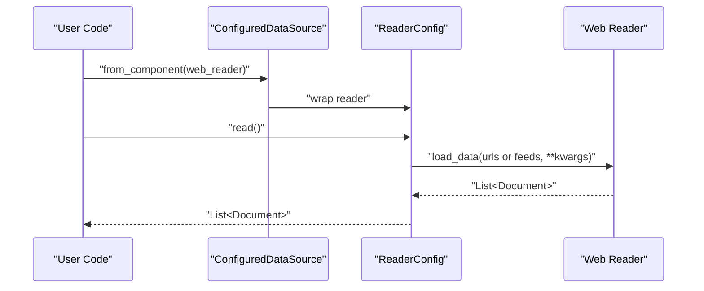
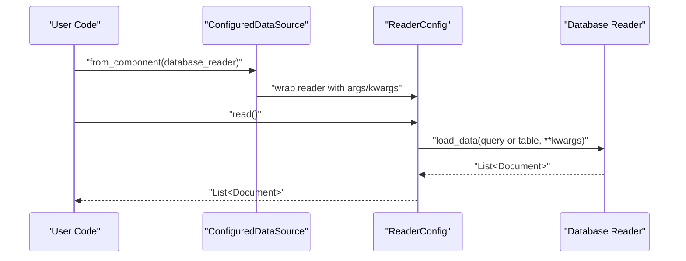
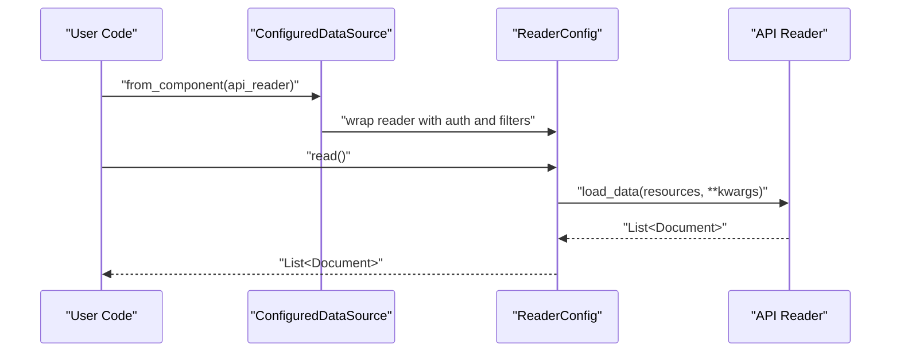
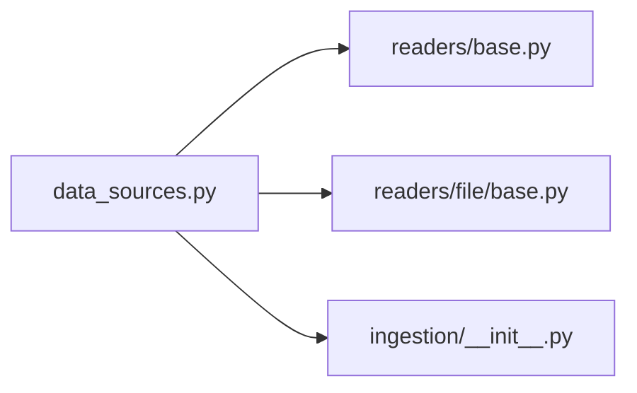

# Data Sources

<cite>
**Referenced Files in This Document**
- [data_sources.py](file://llama-index-core/llama_index/core/ingestion/data_sources.py)
- [base.py](file://llama-index-core/llama_index/core/readers/base.py)
- [file/base.py](file://llama-index-core/llama_index/core/readers/file/base.py)
- [__init__.py](file://llama-index-core/llama_index/core/ingestion/__init__.py)
- [test_data_sources.py](file://llama-index-core/tests/ingestion/test_data_sources.py)
- [test_load_reader.py](file://llama-index-core/tests/readers/test_load_reader.py)
</cite>

## Table of Contents
1. [Introduction](#introduction)
2. [Project Structure](#project-structure)
3. [Core Components](#core-components)
4. [Architecture Overview](#architecture-overview)
5. [Detailed Component Analysis](#detailed-component-analysis)
6. [Dependency Analysis](#dependency-analysis)
7. [Performance Considerations](#performance-considerations)
8. [Troubleshooting Guide](#troubleshooting-guide)
9. [Conclusion](#conclusion)
10. [Appendices](#appendices)

## Introduction
This document explains the Data Sources component of the LlamaIndex Ingestion Pipeline. It focuses on how to configure and use various data source types, including file readers, database connectors, web scrapers, and API connectors. It documents the ReaderConfig class and its configuration options for different data formats, and provides practical examples for common scenarios such as loading PDFs, CSV files, database tables, and web content. Configuration patterns for authentication, pagination, filtering, and data transformation are covered, along with selection criteria, performance considerations, and error handling strategies.

## Project Structure
The Data Sources component is centered around the ingestion module’s data_sources.py, which defines the ConfigurableComponent registry and the ConfiguredDataSource wrapper. Readers are defined in the readers module, with specialized readers for files, databases, web, and APIs. The ingestion module exports pipeline and caching utilities used during ingestion.

**Diagram sources**
- [data_sources.py](file://llama-index-core/llama_index/core/ingestion/data_sources.py#L1-L475)
- [base.py](file://llama-index-core/llama_index/core/readers/base.py#L1-L250)
- [file/base.py](file://llama-index-core/llama_index/core/readers/file/base.py#L1-L800)
- [__init__.py](file://llama-index-core/llama_index/core/ingestion/__init__.py#L1-L16)

**Section sources**
- [data_sources.py](file://llama-index-core/llama_index/core/ingestion/data_sources.py#L1-L475)
- [base.py](file://llama-index-core/llama_index/core/readers/base.py#L1-L250)
- [file/base.py](file://llama-index-core/llama_index/core/readers/file/base.py#L1-L800)
- [__init__.py](file://llama-index-core/llama_index/core/ingestion/__init__.py#L1-L16)

## Core Components
- ConfigurableComponent: An enum that dynamically enumerates available data source components. It includes web readers (e.g., Simple Web Page, Trafilatura Web Page, Beautiful Soup Web Page, RSS), documentation platforms (e.g., Notion Page, Wikipedia, YouTube Transcript), cloud storage readers (e.g., S3, Azure Storage Blob, GCS, Google Drive, OneDrive, SharePoint), office suites (e.g., Google Docs, Google Sheets), and generic readers (Reader, DocumentGroup, TextNode, Document).
- ConfiguredDataSource: A typed wrapper that pairs a data source component with a human-readable name. It supports building from arbitrary BaseComponent instances and ensures the component is recognized by the ConfigurableComponent registry.
- ReaderConfig: A configuration container that holds a BasePydanticReader instance plus positional and keyword arguments to pass to the reader’s load_data method. It serializes to a dictionary and exposes a read method to execute the configured reader.

Key behaviors:
- Dynamic availability: The ConfigurableComponent enum members are conditionally included based on whether their corresponding reader packages are importable.
- ReaderConfig integration: When a BasePydanticReader is provided, the builder wraps it into a ReaderConfig automatically.
- Name generation: If a name is not provided, a unique name is generated; for DocumentGroup, the file path is used as the name.

**Section sources**
- [data_sources.py](file://llama-index-core/llama_index/core/ingestion/data_sources.py#L51-L475)
- [base.py](file://llama-index-core/llama_index/core/readers/base.py#L223-L250)

## Architecture Overview
The Data Sources architecture connects pipeline orchestration with pluggable readers. The ingestion module exposes pipeline and cache utilities, while data_sources.py registers readers and binds them to a typed configuration wrapper.

**Diagram sources**
- [data_sources.py](file://llama-index-core/llama_index/core/ingestion/data_sources.py#L51-L475)
- [base.py](file://llama-index-core/llama_index/core/readers/base.py#L223-L250)

**Section sources**
- [data_sources.py](file://llama-index-core/llama_index/core/ingestion/data_sources.py#L51-L475)
- [base.py](file://llama-index-core/llama_index/core/readers/base.py#L223-L250)

## Detailed Component Analysis

### ReaderConfig
ReaderConfig encapsulates a BasePydanticReader and the arguments to pass to it. It provides:
- Serialization via to_dict, including the reader’s serialized form and the provided arguments.
- Execution via read, which calls the underlying reader with the stored arguments.

Usage pattern:
- Construct a BasePydanticReader (e.g., a file reader, web reader, or API connector) with appropriate initialization parameters.
- Wrap it in ReaderConfig with reader_args and reader_kwargs as needed.
- Call read to materialize Documents.

**Diagram sources**
- [base.py](file://llama-index-core/llama_index/core/readers/base.py#L223-L250)

**Section sources**
- [base.py](file://llama-index-core/llama_index/core/readers/base.py#L223-L250)

### File Readers (PDFs, CSV, Office, Images, Audio/Video)
File-based ingestion is handled by SimpleDirectoryReader and a set of file-specific readers. Supported formats include PDF, CSV, Excel, DOCX, PPTX, EPUB, MBOX, IPYNB, images, and audio/video. The reader selection is automatic based on file suffixes, with optional overrides via file_extractor.

Key capabilities:
- Directory traversal with filtering (hidden files, empty files, required extensions, recursion, exclusion globs).
- Metadata extraction from filesystem (path, name, type, sizes, timestamps).
- Parallel loading with configurable worker counts.
- Async support for loading and resource enumeration.
- Remote filesystem support via fsspec-compatible filesystems.

Practical configuration patterns:
- Authentication: For remote filesystems, supply an fsspec filesystem instance with credentials (e.g., S3, GCS, Azure Blob). For cloud storage readers (e.g., S3Reader, GCSReader, AzStorageBlobReader), initialize the reader with credentials and bucket/container names.
- Pagination and filtering: Use required_exts, exclude, exclude_hidden, exclude_empty, and num_files_limit to constrain scope. For API-based readers, pass pagination parameters via reader_kwargs.
- Data transformation: Use file_metadata to attach extra_info to documents; apply filename_as_id to derive deterministic ids; handle encoding and error policies via constructor options.

**Diagram sources**
- [file/base.py](file://llama-index-core/llama_index/core/readers/file/base.py#L208-L800)

**Section sources**
- [file/base.py](file://llama-index-core/llama_index/core/readers/file/base.py#L68-L114)
- [file/base.py](file://llama-index-core/llama_index/core/readers/file/base.py#L208-L800)

### Web Scrapers and RSS
Web ingestion is supported by multiple readers:
- Simple Web Page: Basic page fetching and parsing.
- Trafilatura Web Reader: Robust HTML extraction.
- Beautiful Soup Web Reader: Flexible HTML parsing.
- RSS Reader: Atom/RSS feed parsing.

Configuration patterns:
- Authentication: Some readers accept headers or session cookies via reader_kwargs.
- Pagination: Feed readers commonly support pagination parameters; pass them via reader_kwargs.
- Filtering: Limit URLs or feeds via reader_args; apply custom filters in reader_kwargs.
- Data transformation: Extract desired fields and normalize content in downstream nodes.

**Diagram sources**
- [data_sources.py](file://llama-index-core/llama_index/core/ingestion/data_sources.py#L176-L235)
- [base.py](file://llama-index-core/llama_index/core/readers/base.py#L223-L250)

**Section sources**
- [data_sources.py](file://llama-index-core/llama_index/core/ingestion/data_sources.py#L176-L235)
- [base.py](file://llama-index-core/llama_index/core/readers/base.py#L223-L250)

### Database Connectors
Database ingestion is supported through readers such as:
- Database Reader: Generic SQL-based reader.
- Snowflake Reader: Cloud warehouse reader.
- SingleStore Reader: Distributed SQL reader.
- Apache Superset Reader: BI platform reader.
- Apache Airbyte readers: ETL connectors for CRM, ERP, and other systems.

Configuration patterns:
- Authentication: Supply connection credentials via reader_kwargs (e.g., DSN, username/password, OAuth tokens).
- Pagination: Use LIMIT/OFFSET or cursor-based pagination parameters; pass them via reader_kwargs.
- Filtering: Provide WHERE clauses or query templates via reader_kwargs; leverage reader_args for table lists.
- Data transformation: Normalize column names, cast types, and enrich metadata in downstream nodes.

**Diagram sources**
- [data_sources.py](file://llama-index-core/llama_index/core/ingestion/data_sources.py#L89-L438)
- [base.py](file://llama-index-core/llama_index/core/readers/base.py#L223-L250)

**Section sources**
- [data_sources.py](file://llama-index-core/llama_index/core/ingestion/data_sources.py#L89-L438)
- [base.py](file://llama-index-core/llama_index/core/readers/base.py#L223-L250)

### API Connectors
API-based ingestion is supported by readers such as:
- Apify Reader: Web scraping via Apify.
- GitHub Reader: Repository and issue ingestion.
- GitLab Reader: Project and merge request ingestion.
- Slack Reader: Channels and messages.
- Discord Reader: Servers and channels.
- Notion Page Reader: Pages and databases.
- Wikipedia Reader: Articles and revisions.
- YouTube Transcript Reader: Video transcripts.
- Google Docs/Sheets Readers: Office suite content.
- Box Reader: File and folder ingestion.
- Zendesk Reader: Support tickets and articles.
- Twitter Tweet Reader: Public tweets and timelines.

Configuration patterns:
- Authentication: Pass API keys, tokens, or OAuth credentials via reader_kwargs.
- Pagination: Use page size, cursor, or date-range parameters via reader_kwargs.
- Filtering: Narrow by repository, team, label, category, or date range via reader_kwargs.
- Data transformation: Normalize fields, filter unwanted content, and enrich metadata in downstream nodes.

**Diagram sources**
- [data_sources.py](file://llama-index-core/llama_index/core/ingestion/data_sources.py#L89-L438)
- [base.py](file://llama-index-core/llama_index/core/readers/base.py#L223-L250)

**Section sources**
- [data_sources.py](file://llama-index-core/llama_index/core/ingestion/data_sources.py#L89-L438)
- [base.py](file://llama-index-core/llama_index/core/readers/base.py#L223-L250)

### DocumentGroup, TextNode, and Document
These components represent higher-level data units:
- DocumentGroup: A collection of Documents grouped by file (useful for multi-page PDFs).
- TextNode: A chunked unit of text with optional metadata.
- Document: A top-level unit with text and metadata.

They are selectable in the ConfigurableComponent registry and can be wrapped into ConfiguredDataSource directly.

**Section sources**
- [data_sources.py](file://llama-index-core/llama_index/core/ingestion/data_sources.py#L15-L86)
- [data_sources.py](file://llama-index-core/llama_index/core/ingestion/data_sources.py#L405-L433)

## Dependency Analysis
The Data Sources module depends on:
- readers.base.ReaderConfig for reader configuration.
- readers.file.SimpleDirectoryReader for file-based ingestion.
- Ingestion pipeline exports for orchestration.

**Diagram sources**
- [data_sources.py](file://llama-index-core/llama_index/core/ingestion/data_sources.py#L1-L475)
- [base.py](file://llama-index-core/llama_index/core/readers/base.py#L1-L250)
- [file/base.py](file://llama-index-core/llama_index/core/readers/file/base.py#L1-L800)
- [__init__.py](file://llama-index-core/llama_index/core/ingestion/__init__.py#L1-L16)

**Section sources**
- [data_sources.py](file://llama-index-core/llama_index/core/ingestion/data_sources.py#L1-L475)
- [base.py](file://llama-index-core/llama_index/core/readers/base.py#L1-L250)
- [file/base.py](file://llama-index-core/llama_index/core/readers/file/base.py#L1-L800)
- [__init__.py](file://llama-index-core/llama_index/core/ingestion/__init__.py#L1-L16)

## Performance Considerations
- Parallelism: SimpleDirectoryReader supports multiprocessing-based parallel loading. Tune num_workers to match CPU capacity; exceeding CPU count is capped automatically.
- Remote filesystems: Using fsspec-compatible filesystems enables scalable access to cloud storage; ensure credentials and network timeouts are configured appropriately.
- Reader selection: Prefer dedicated readers for binary formats (PDF, Excel, DOCX) to avoid fallback text decoding overhead.
- Metadata: Attach minimal metadata to reduce embedding costs; exclude non-essential keys from embedding and LLM prompts.
- Async patterns: Use async variants where available to overlap I/O-bound operations.

[No sources needed since this section provides general guidance]

## Troubleshooting Guide
Common issues and resolutions:
- Import errors for optional readers: Conditional inclusion means missing dependencies will prevent a reader from appearing in the registry. Install the corresponding integration package to enable it.
- Empty directories: SimpleDirectoryReader raises an error if no files match filters; verify required_exts, exclude patterns, and recursion settings.
- Encoding errors: Set encoding and errors parameters to control decoding behavior; use raise_on_error to fail fast.
- Authentication failures: Ensure credentials are correctly passed to readers via reader_kwargs or filesystem constructors.
- Large files or slow APIs: Enable parallel loading for file readers and paginate API requests; consider caching and incremental ingestion.

Validation references:
- Tests for data sources construction and configuration.
- Tests for reader loading and base reader behavior.

**Section sources**
- [test_data_sources.py](file://llama-index-core/tests/ingestion/test_data_sources.py#L1-L200)
- [test_load_reader.py](file://llama-index-core/tests/readers/test_load_reader.py#L1-L200)
- [file/base.py](file://llama-index-core/llama_index/core/readers/file/base.py#L266-L272)
- [file/base.py](file://llama-index-core/llama_index/core/readers/file/base.py#L424-L426)

## Conclusion
The Data Sources component provides a flexible, extensible mechanism to configure ingestion pipelines from diverse sources. By leveraging ReaderConfig, dynamic registration via ConfigurableComponent, and robust file and API readers, teams can reliably ingest structured and unstructured data at scale. Proper configuration of authentication, pagination, filtering, and transformation ensures high-quality, efficient ingestion.

[No sources needed since this section summarizes without analyzing specific files]

## Appendices
- Practical examples (paths only):
  - File ingestion with filters and metadata: [file/base.py](file://llama-index-core/llama_index/core/readers/file/base.py#L208-L800)
  - Web ingestion with multiple readers: [data_sources.py](file://llama-index-core/llama_index/core/ingestion/data_sources.py#L176-L235)
  - Database ingestion with pagination and filtering: [data_sources.py](file://llama-index-core/llama_index/core/ingestion/data_sources.py#L89-L438)
  - API ingestion with authentication and pagination: [data_sources.py](file://llama-index-core/llama_index/core/ingestion/data_sources.py#L89-L438)
  - Reader configuration and execution: [base.py](file://llama-index-core/llama_index/core/readers/base.py#L223-L250)

[No sources needed since this section lists example paths without analyzing specific files]