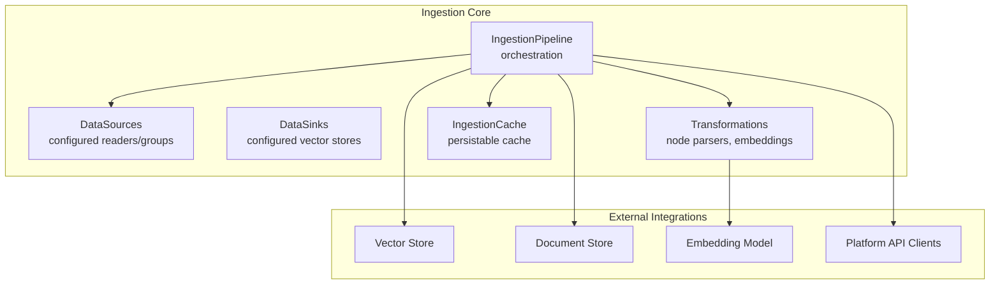
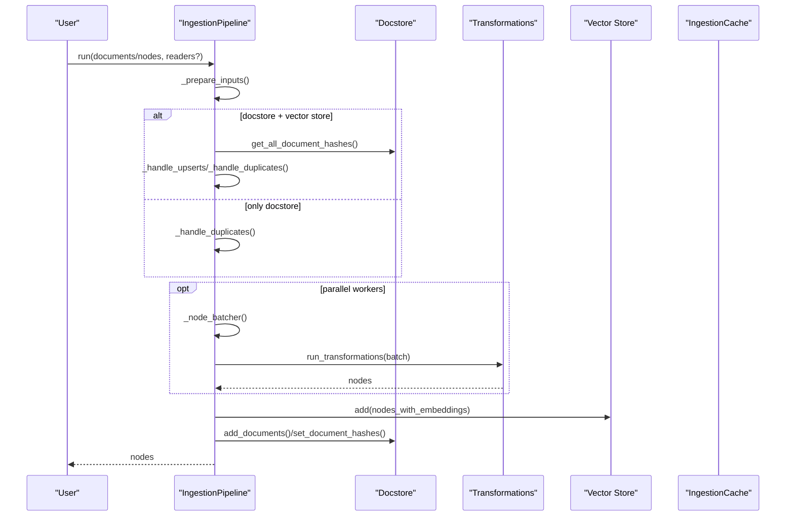
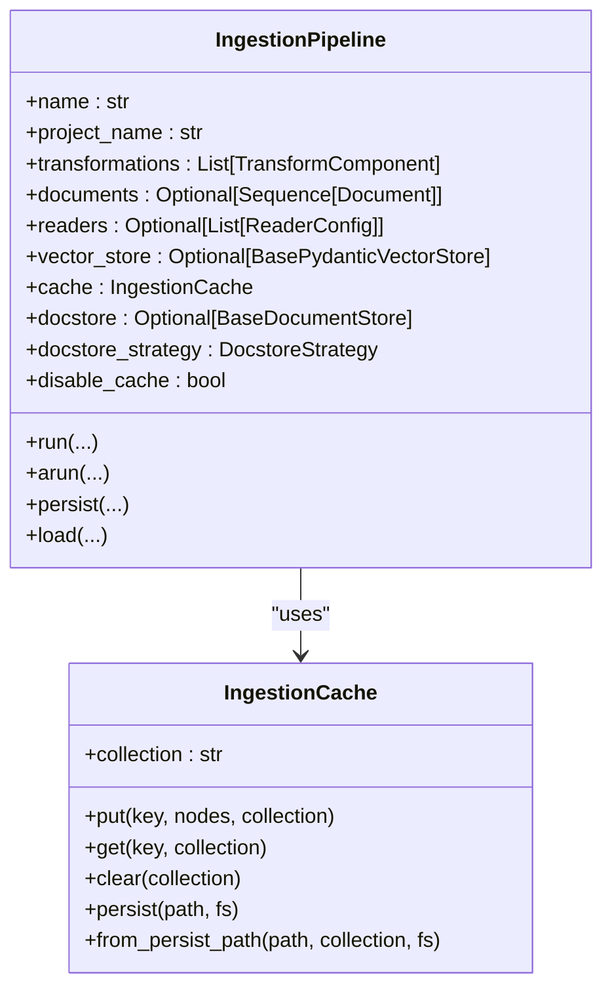
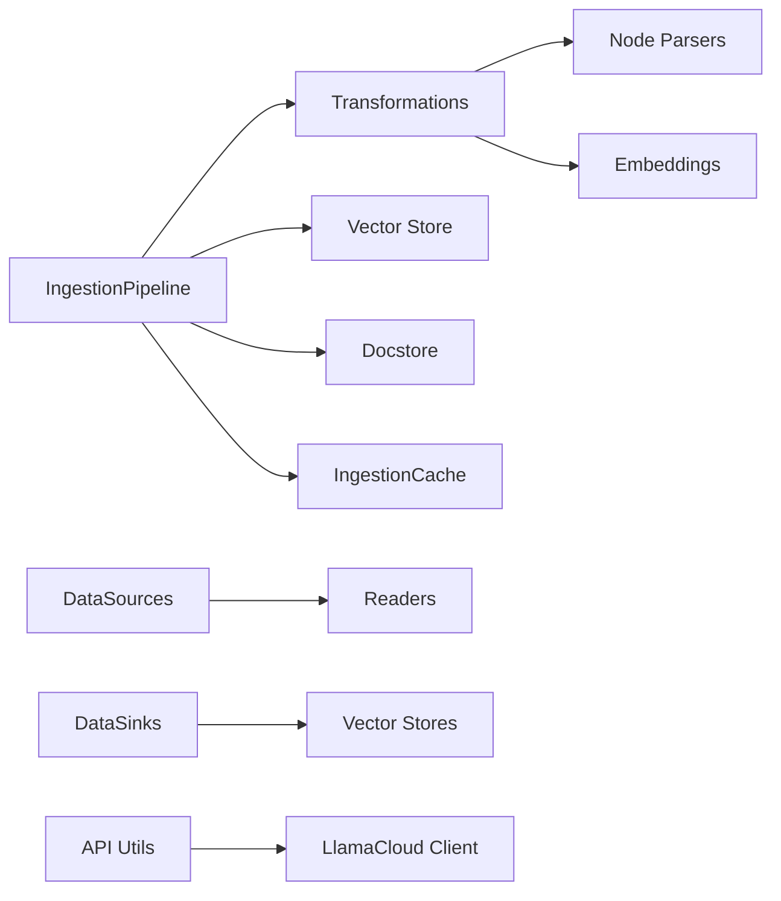

# Ingestion Pipeline

<cite>
**Referenced Files in This Document**
- [pipeline.py](file://llama-index-core/llama_index/core/ingestion/pipeline.py)
- [__init__.py](file://llama-index-core/llama_index/core/ingestion/__init__.py)
- [api_utils.py](file://llama-index-core/llama_index/core/ingestion/api_utils.py)
- [data_sources.py](file://llama-index-core/llama_index/core/ingestion/data_sources.py)
- [data_sinks.py](file://llama-index-core/llama_index/core/ingestion/data_sinks.py)
- [cache.py](file://llama-index-core/llama_index/core/ingestion/cache.py)
- [transformations.py](file://llama-index-core/llama_index/core/ingestion/transformations.py)
- [advanced_ingestion_pipeline.ipynb](file://docs/examples/ingestion/advanced_ingestion_pipeline.ipynb)
- [parallel_execution_ingestion_pipeline.ipynb](file://docs/examples/ingestion/parallel_execution_ingestion_pipeline.ipynb)
- [ray_ingestion_pipeline.ipynb](file://docs/examples/ingestion/ray_ingestion_pipeline.ipynb)
</cite>

## Table of Contents
1. [Introduction](#introduction)
2. [Project Structure](#project-structure)
3. [Core Components](#core-components)
4. [Architecture Overview](#architecture-overview)
5. [Detailed Component Analysis](#detailed-component-analysis)
6. [Dependency Analysis](#dependency-analysis)
7. [Performance Considerations](#performance-considerations)
8. [Troubleshooting Guide](#troubleshooting-guide)
9. [Conclusion](#conclusion)
10. [Appendices](#appendices)

## Introduction
This document explains the LlamaIndex Ingestion Pipeline end-to-end. It covers the Pipeline class, data source configuration, data sink setup, and API utilities for ingestion operations. It also documents the complete ingestion workflow from data loading through node creation to index population, along with practical examples for parallel processing, batch operations, progress monitoring, customization, error handling, and performance optimization.

## Project Structure
The ingestion subsystem resides under the core ingestion module and integrates with readers, node parsers, embedding models, caches, and vector stores. The primary building blocks are:
- Pipeline orchestration and execution
- Data sources (readers and groups)
- Data sinks (vector stores)
- Transformations (node parsing, embeddings)
- Caching and persistence
- API utilities for platform clients

**Diagram sources**
- [pipeline.py](file://llama-index-core/llama_index/core/ingestion/pipeline.py#L193-L779)
- [data_sources.py](file://llama-index-core/llama_index/core/ingestion/data_sources.py#L15-L475)
- [data_sinks.py](file://llama-index-core/llama_index/core/ingestion/data_sinks.py#L12-L181)
- [transformations.py](file://llama-index-core/llama_index/core/ingestion/transformations.py#L77-L379)
- [cache.py](file://llama-index-core/llama_index/core/ingestion/cache.py#L17-L79)
- [api_utils.py](file://llama-index-core/llama_index/core/ingestion/api_utils.py#L14-L50)

**Section sources**
- [pipeline.py](file://llama-index-core/llama_index/core/ingestion/pipeline.py#L193-L779)
- [__init__.py](file://llama-index-core/llama_index/core/ingestion/__init__.py#L1-L16)

## Core Components
- IngestionPipeline: Central orchestrator that loads inputs, deduplicates via docstore, applies transformations, persists cache/docstore/vector store, and returns nodes.
- DataSources: Encapsulates supported readers and document groups; builds configured data sources from components.
- DataSinks: Encapsulates supported vector stores; builds configured data sinks from components.
- Transformations: Defines transformation categories (node parser, embedding) and enumerates available components.
- IngestionCache: Persistable cache keyed by transformation hash; supports simple KV store and persistence.
- API Utilities: Helpers to construct platform clients for LlamaCloud.

**Section sources**
- [pipeline.py](file://llama-index-core/llama_index/core/ingestion/pipeline.py#L193-L779)
- [data_sources.py](file://llama-index-core/llama_index/core/ingestion/data_sources.py#L15-L475)
- [data_sinks.py](file://llama-index-core/llama_index/core/ingestion/data_sinks.py#L12-L181)
- [transformations.py](file://llama-index-core/llama_index/core/ingestion/transformations.py#L77-L379)
- [cache.py](file://llama-index-core/llama_index/core/ingestion/cache.py#L17-L79)
- [api_utils.py](file://llama-index-core/llama_index/core/ingestion/api_utils.py#L14-L50)

## Architecture Overview
The ingestion pipeline follows a staged workflow:
1. Prepare inputs from documents, nodes, and configured readers.
2. Deduplicate using docstore strategy when a docstore is present.
3. Apply transformations (node parsing, embeddings) with optional caching.
4. Add nodes with embeddings to the vector store.
5. Persist docstore and cache as needed.

**Diagram sources**
- [pipeline.py](file://llama-index-core/llama_index/core/ingestion/pipeline.py#L467-L575)
- [pipeline.py](file://llama-index-core/llama_index/core/ingestion/pipeline.py#L382-L464)

## Detailed Component Analysis

### IngestionPipeline
Responsibilities:
- Accepts transformations, readers, documents, vector store, docstore, cache, and strategy.
- Prepares inputs from documents, nodes, and readers.
- Handles de-duplication via docstore strategies (upserts, duplicates_only, upserts_and_delete).
- Applies transformations with optional caching and batching across processes.
- Adds nodes with embeddings to the vector store and updates docstore.
- Supports persistence and loading of cache and docstore.

Key methods and flows:
- run(): synchronous execution with optional parallel workers.
- arun(): asynchronous execution with process pool executor.
- run_transformations() and arun_transformations(): apply transformations with caching.
- _handle_upserts(), _handle_duplicates(): dedupe logic.
- _node_batcher(): split nodes into batches for parallelism.
- persist()/load(): cache and docstore persistence.

**Diagram sources**
- [pipeline.py](file://llama-index-core/llama_index/core/ingestion/pipeline.py#L193-L358)
- [cache.py](file://llama-index-core/llama_index/core/ingestion/cache.py#L17-L79)

**Section sources**
- [pipeline.py](file://llama-index-core/llama_index/core/ingestion/pipeline.py#L193-L779)
- [cache.py](file://llama-index-core/llama_index/core/ingestion/cache.py#L17-L79)

### Data Sources
- DataSource: Metadata container for a data source type.
- ConfigurableComponent: Builds an enum of supported data sources dynamically based on available readers.
- ConfiguredDataSource: Wraps a component (ReaderConfig, DocumentGroup, TextNode, Document) with a name and type.

Capabilities:
- Dynamically discovers readers (e.g., web, slack, notion, google docs, s3, gcs, azure blob, rss, wikipedia, youtube transcript).
- Supports DocumentGroup for grouped pages and direct Document/TextNode inputs.

**Section sources**
- [data_sources.py](file://llama-index-core/llama_index/core/ingestion/data_sources.py#L15-L475)

### Data Sinks
- DataSink: Metadata container for a vector store sink type.
- ConfigurableComponent: Builds an enum of supported sinks dynamically (e.g., chroma, pinecone, postgres, qdrant, weaviate).
- ConfiguredDataSink: Wraps a BasePydanticVectorStore with a name and type.

**Section sources**
- [data_sinks.py](file://llama-index-core/llama_index/core/ingestion/data_sinks.py#L12-L181)

### Transformations
- TransformationIOType: Describes input/output types (Documents, Nodes).
- TransformationCategory: Categories (NODE_PARSER, EMBEDDING).
- ConfigurableComponent: Builds an enum of supported transformations (e.g., sentence splitter, token splitter, code splitter, markdown/json/html parsers, embeddings from various providers).

**Section sources**
- [transformations.py](file://llama-index-core/llama_index/core/ingestion/transformations.py#L27-L379)

### API Utilities
- get_client(): Sync LlamaCloud client builder.
- get_aclient(): Async LlamaCloud client builder.
- Reads base URLs and API keys from environment or parameters.

**Section sources**
- [api_utils.py](file://llama-index-core/llama_index/core/ingestion/api_utils.py#L14-L50)

## Dependency Analysis
High-level dependencies:
- Pipeline depends on TransformComponent implementations (node parsers, embeddings).
- Pipeline optionally depends on Vector Store and Document Store for persistence and de-duplication.
- Pipeline optionally depends on IngestionCache for transformation caching.
- DataSources/DataSinks enumerate components dynamically; availability determines supported sinks/sources.
- API utilities depend on platform client libraries.

**Diagram sources**
- [pipeline.py](file://llama-index-core/llama_index/core/ingestion/pipeline.py#L193-L358)
- [transformations.py](file://llama-index-core/llama_index/core/ingestion/transformations.py#L118-L342)
- [data_sources.py](file://llama-index-core/llama_index/core/ingestion/data_sources.py#L89-L438)
- [data_sinks.py](file://llama-index-core/llama_index/core/ingestion/data_sinks.py#L52-L147)
- [api_utils.py](file://llama-index-core/llama_index/core/ingestion/api_utils.py#L14-L50)

**Section sources**
- [pipeline.py](file://llama-index-core/llama_index/core/ingestion/pipeline.py#L193-L358)
- [transformations.py](file://llama-index-core/llama_index/core/ingestion/transformations.py#L118-L342)
- [data_sources.py](file://llama-index-core/llama_index/core/ingestion/data_sources.py#L89-L438)
- [data_sinks.py](file://llama-index-core/llama_index/core/ingestion/data_sinks.py#L52-L147)
- [api_utils.py](file://llama-index-core/llama_index/core/ingestion/api_utils.py#L14-L50)

## Performance Considerations
- Parallel execution: Use num_workers > 1 to enable process-based batching. The pipeline splits nodes into batches and executes transformations in parallel pools. The notebook demonstrates significant speedups with multiple workers.
- Asynchronous parallelism: arun() uses ProcessPoolExecutor with wrapper to run async transformations in separate processes.
- Caching: IngestionCache stores transformation outputs keyed by a hash of nodes and transformation config. This avoids recomputation on repeated runs.
- Vector store writes: Only nodes with embeddings are added to the vector store; ensure embeddings are computed before vector store insertion.
- Monitoring: Progress bars appear during execution; use profiling to identify bottlenecks (e.g., network latency for embeddings).

Practical examples:
- Parallel execution with OpenAI embeddings and sentence splitting.
- Async parallel execution with process pool.
- Redis-backed cache for MongoDB-style caching.

**Section sources**
- [pipeline.py](file://llama-index-core/llama_index/core/ingestion/pipeline.py#L530-L575)
- [pipeline.py](file://llama-index-core/llama_index/core/ingestion/pipeline.py#L726-L778)
- [cache.py](file://llama-index-core/llama_index/core/ingestion/cache.py#L27-L46)
- [parallel_execution_ingestion_pipeline.ipynb](file://docs/examples/ingestion/parallel_execution_ingestion_pipeline.ipynb#L149-L390)
- [advanced_ingestion_pipeline.ipynb](file://docs/examples/ingestion/advanced_ingestion_pipeline.ipynb#L46-L306)

## Troubleshooting Guide
Common issues and resolutions:
- Duplicate handling without vector store: The pipeline automatically switches to duplicates_only strategy when a docstore is provided without a vector store.
- Excessive num_workers: The pipeline caps num_workers to available CPUs and warns if exceeded.
- Missing embeddings: Only nodes with embeddings are added to the vector store; ensure an embedding model is included in transformations.
- Cache persistence: SimpleCache supports persist/load; other caches may skip persist depending on implementation.
- Platform client configuration: Ensure LLAMA_CLOUD_API_KEY and base/app URLs are set appropriately.

**Section sources**
- [pipeline.py](file://llama-index-core/llama_index/core/ingestion/pipeline.py#L514-L526)
- [pipeline.py](file://llama-index-core/llama_index/core/ingestion/pipeline.py#L532-L537)
- [pipeline.py](file://llama-index-core/llama_index/core/ingestion/pipeline.py#L567-L571)
- [cache.py](file://llama-index-core/llama_index/core/ingestion/cache.py#L55-L75)
- [api_utils.py](file://llama-index-core/llama_index/core/ingestion/api_utils.py#L24-L30)

## Conclusion
The LlamaIndex Ingestion Pipeline provides a robust, extensible framework for transforming raw data into indexed, searchable nodes. It supports flexible data sources, pluggable transformations, caching, parallel execution, and integration with vector stores and document stores. By leveraging the provided components and examples, users can build efficient ingestion workflows tailored to their data scale and infrastructure.

## Appendices

### Practical Setup Examples
- Advanced ingestion with Redis cache, Weaviate vector store, custom transformation, and HuggingFace embeddings.
- Parallel ingestion with OpenAI embeddings and sentence splitting; includes performance timing and profiling.
- Ray-based distributed ingestion with Ray actors and Ray Data for large-scale transformations.

**Section sources**
- [advanced_ingestion_pipeline.ipynb](file://docs/examples/ingestion/advanced_ingestion_pipeline.ipynb#L1-L329)
- [parallel_execution_ingestion_pipeline.ipynb](file://docs/examples/ingestion/parallel_execution_ingestion_pipeline.ipynb#L1-L871)
- [ray_ingestion_pipeline.ipynb](file://docs/examples/ingestion/ray_ingestion_pipeline.ipynb#L1-L282)