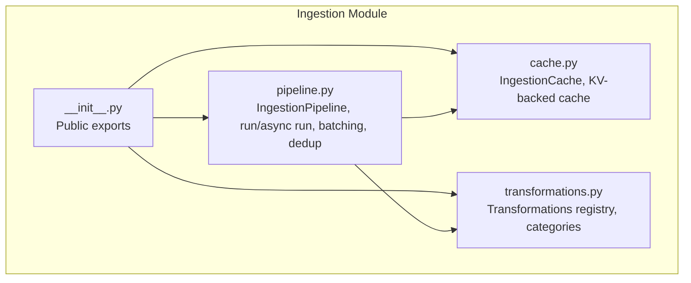
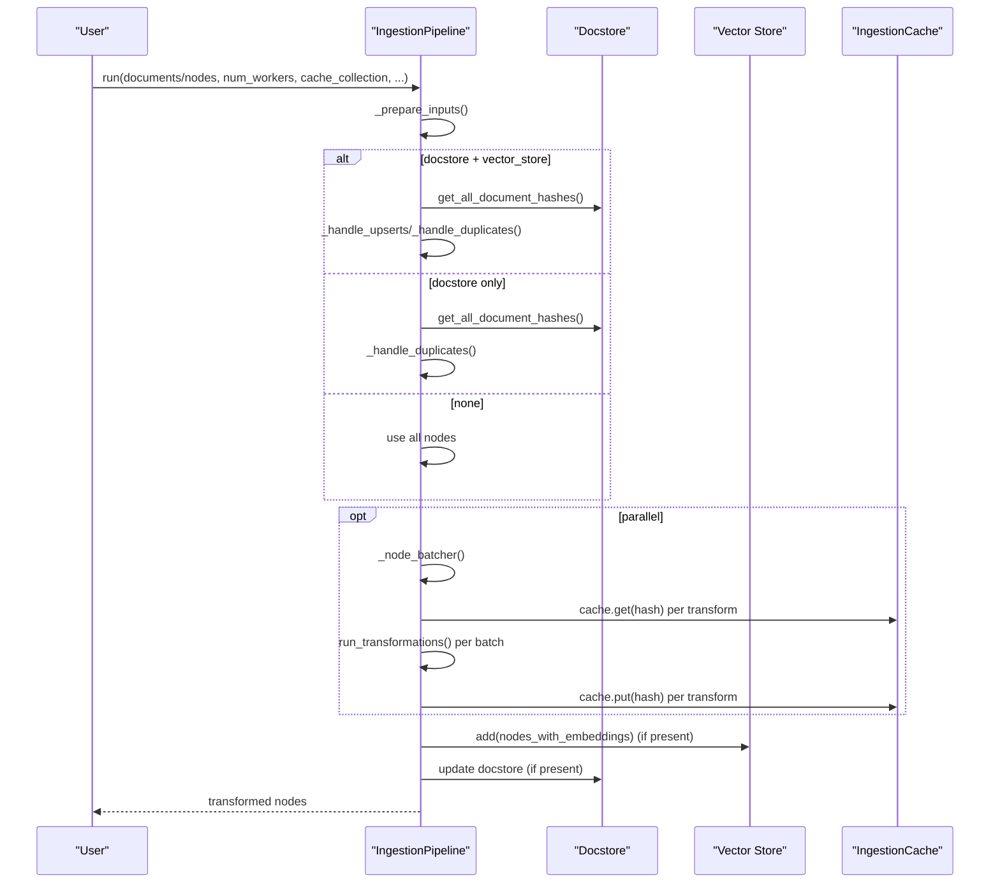
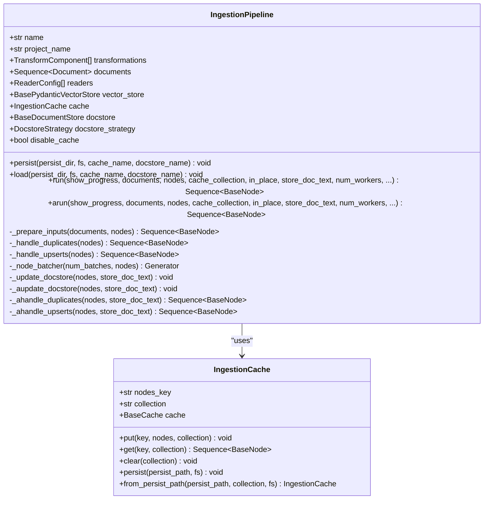
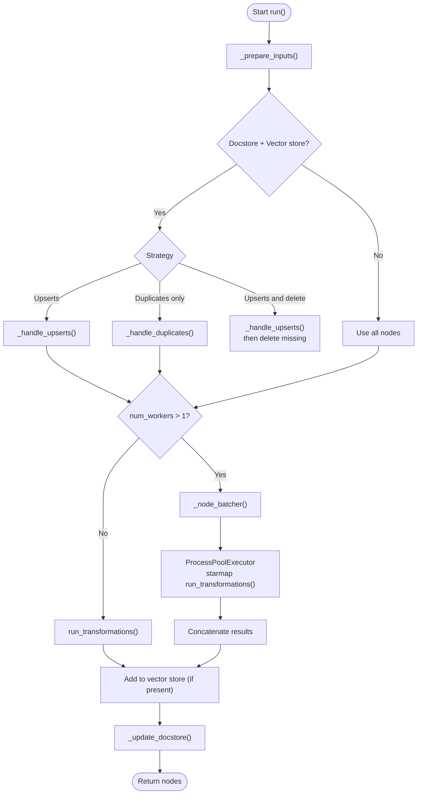
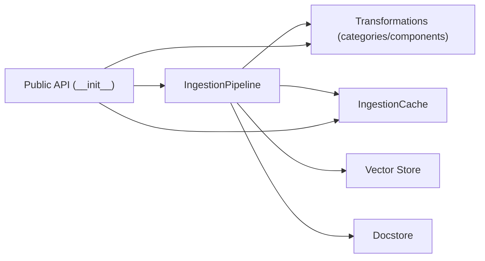

# Pipeline Orchestration

<cite>
**Referenced Files in This Document**
- [pipeline.py](file://llama-index-core/llama_index/core/ingestion/pipeline.py)
- [cache.py](file://llama-index-core/llama_index/core/ingestion/cache.py)
- [transformations.py](file://llama-index-core/llama_index/core/ingestion/transformations.py)
- [__init__.py](file://llama-index-core/llama_index/core/ingestion/__init__.py)
</cite>

## Table of Contents
1. [Introduction](#introduction)
2. [Project Structure](#project-structure)
3. [Core Components](#core-components)
4. [Architecture Overview](#architecture-overview)
5. [Detailed Component Analysis](#detailed-component-analysis)
6. [Dependency Analysis](#dependency-analysis)
7. [Performance Considerations](#performance-considerations)
8. [Troubleshooting Guide](#troubleshooting-guide)
9. [Conclusion](#conclusion)
10. [Appendices](#appendices)

## Introduction
This document explains the Pipeline Orchestration component of the LlamaIndex Ingestion Pipeline. It focuses on the IngestionPipeline class and its orchestration capabilities, including workflow management, parallel processing, and caching strategies. It covers pipeline execution flow, worker management, batch processing, configuration options, error handling, progress tracking, monitoring, practical setup examples, and operational best practices for scaling and fault tolerance.

## Project Structure
The ingestion orchestration lives under the core ingestion module. The primary files are:
- IngestionPipeline and orchestration logic
- IngestionCache for caching transformation results
- Transformations registry and configuration helpers
- Public exports for the ingestion API

**Diagram sources**
- [pipeline.py](file://llama-index-core/llama_index/core/ingestion/pipeline.py#L193-L779)
- [cache.py](file://llama-index-core/llama_index/core/ingestion/cache.py#L17-L79)
- [transformations.py](file://llama-index-core/llama_index/core/ingestion/transformations.py#L1-L379)
- [__init__.py](file://llama-index-core/llama_index/core/ingestion/__init__.py#L1-L16)

**Section sources**
- [pipeline.py](file://llama-index-core/llama_index/core/ingestion/pipeline.py#L1-L779)
- [cache.py](file://llama-index-core/llama_index/core/ingestion/cache.py#L1-L79)
- [transformations.py](file://llama-index-core/llama_index/core/ingestion/transformations.py#L1-L379)
- [__init__.py](file://llama-index-core/llama_index/core/ingestion/__init__.py#L1-L16)

## Core Components
- IngestionPipeline: Orchestrates ingestion workflows, supports parallel execution, caching, deduplication, and persistence.
- IngestionCache: Stores transformation outputs keyed by a deterministic hash of inputs and transformation config.
- Transformations registry: Describes supported transformation categories and components for building pipelines.

Key responsibilities:
- Prepare inputs from documents, nodes, or configured readers
- Deduplicate via docstore (supports upserts, duplicates-only, upserts-and-delete)
- Apply transformations with optional caching and in-place vs copy semantics
- Parallelize via process pools with batch splitting
- Persist and load pipeline state and cache
- Add nodes with embeddings to vector stores and update docstore

**Section sources**
- [pipeline.py](file://llama-index-core/llama_index/core/ingestion/pipeline.py#L193-L779)
- [cache.py](file://llama-index-core/llama_index/core/ingestion/cache.py#L17-L79)
- [transformations.py](file://llama-index-core/llama_index/core/ingestion/transformations.py#L27-L379)

## Architecture Overview
High-level flow:
- Inputs are prepared from documents, nodes, or readers
- Optional docstore-based deduplication (upserts/upserts-and-delete/duplicates-only)
- Transformations are applied with optional caching and in-place behavior
- Parallel execution is optionally enabled via process pools with batch splitting
- Results are added to vector store (if present) and docstore (if present)

**Diagram sources**
- [pipeline.py](file://llama-index-core/llama_index/core/ingestion/pipeline.py#L467-L575)
- [pipeline.py](file://llama-index-core/llama_index/core/ingestion/pipeline.py#L577-L779)
- [cache.py](file://llama-index-core/llama_index/core/ingestion/cache.py#L27-L46)

## Detailed Component Analysis

### IngestionPipeline
Responsibilities:
- Construction with defaults (sentence splitter + embedding model)
- Persistence/loading of cache and optional docstore
- Input preparation from documents, nodes, or readers
- Deduplication strategies (upserts, duplicates-only, upserts-and-delete)
- Sequential and parallel execution paths
- Vector store integration and docstore updates
- Batch splitting for parallel workers

Key methods and behaviors:
- run(): orchestrates the pipeline, supports num_workers, cache_collection, in_place, store_doc_text
- arun(): async variant with similar controls
- _prepare_inputs(): aggregates inputs from constructor and method arguments
- _handle_upserts(), _handle_duplicates(): dedupe against docstore
- _node_batcher(): splits nodes into batches for parallel workers
- _update_docstore(), _aupdate_docstore(): writes hashes and documents
- persist()/load(): persists cache and optional docstore

Parallel execution:
- Uses multiprocessing.ProcessPoolExecutor for CPU-bound transforms
- Splits nodes into batches proportional to num_workers
- Applies run_transformations() per batch and concatenates results

Caching:
- Optional via IngestionCache; disabled when disable_cache is True
- Keys are derived from node content and transformation config
- Supports collections for logical separation of cached results

Deduplication strategies:
- UPSERTS: compare by ref_doc_id/hash; deletes old refs and vectors when hash changes
- DUPLICATES_ONLY: add only nodes whose hash is not seen yet
- UPSERTS_AND_DELETE: after upserts, remove deleted doc ids from stores

**Section sources**
- [pipeline.py](file://llama-index-core/llama_index/core/ingestion/pipeline.py#L193-L779)

#### Class Diagram

**Diagram sources**
- [pipeline.py](file://llama-index-core/llama_index/core/ingestion/pipeline.py#L193-L779)
- [cache.py](file://llama-index-core/llama_index/core/ingestion/cache.py#L17-L79)

### IngestionCache
Responsibilities:
- Store and retrieve sequences of nodes keyed by a hash
- Support logical collections for cache separation
- Persist/load cache to/from filesystem-compatible paths

Behavior:
- put(): serializes nodes to JSON and stores under a key
- get(): deserializes nodes from cache
- clear(): removes all entries in a collection
- persist()/from_persist_path(): supports SimpleCache persistence

Notes:
- Only SimpleCache supports persistence; other caches are not persisted
- Designed to cache transformation outputs to avoid recomputation

**Section sources**
- [cache.py](file://llama-index-core/llama_index/core/ingestion/cache.py#L17-L79)

### Transformations Registry
Responsibilities:
- Define transformation categories (node parsing, embeddings)
- Enumerate supported components (e.g., sentence splitter, token splitter, various embeddings)
- Provide a mechanism to build configured transformations from components

Highlights:
- TransformationCategories enumerates NODE_PARSER and EMBEDDING
- ConfigurableTransformations builds an enum of available transformations based on imports
- ConfiguredTransformation wraps a component with metadata and validates compatibility

**Section sources**
- [transformations.py](file://llama-index-core/llama_index/core/ingestion/transformations.py#L27-L379)

### Execution Flow and Parallel Processing
Sequential path:
- Prepare inputs
- Dedupe if docstore/vector store present
- Apply transformations with optional cache and in-place behavior
- Add embeddings to vector store and update docstore

Parallel path:
- Validate num_workers <= CPU count
- Split nodes into batches
- Execute run_transformations per batch in separate processes
- Concatenate results

**Diagram sources**
- [pipeline.py](file://llama-index-core/llama_index/core/ingestion/pipeline.py#L467-L575)
- [pipeline.py](file://llama-index-core/llama_index/core/ingestion/pipeline.py#L530-L563)

## Dependency Analysis
- IngestionPipeline depends on:
  - Transformations (via TransformComponent interface)
  - IngestionCache for caching
  - Vector store for storing embeddings
  - Docstore for deduplication and metadata
- Transformations registry provides discovery and configuration of components
- Public exports expose IngestionPipeline, IngestionCache, and transformation helpers

**Diagram sources**
- [pipeline.py](file://llama-index-core/llama_index/core/ingestion/pipeline.py#L193-L779)
- [transformations.py](file://llama-index-core/llama_index/core/ingestion/transformations.py#L27-L379)
- [__init__.py](file://llama-index-core/llama_index/core/ingestion/__init__.py#L1-L16)

**Section sources**
- [pipeline.py](file://llama-index-core/llama_index/core/ingestion/pipeline.py#L193-L779)
- [transformations.py](file://llama-index-core/llama_index/core/ingestion/transformations.py#L27-L379)
- [__init__.py](file://llama-index-core/llama_index/core/ingestion/__init__.py#L1-L16)

## Performance Considerations
- Parallelism
  - Use num_workers > 1 to split node batches across processes
  - Automatically capped to CPU count; exceeding CPUs triggers a warning
- Batch sizing
  - Batches are computed as len(nodes)/num_workers; tune num_workers to balance overhead vs throughput
- Caching
  - Enable caching to avoid recomputation of identical transformations
  - Use cache_collection to isolate runs or datasets
  - Persist cache to disk for multi-run reuse
- Deduplication cost
  - Docstore queries add latency; leverage upserts to minimize redundant work
- Vector store writes
  - Only nodes with embeddings are added; ensure embeddings are produced by earlier transformations
- Memory footprint
  - in_place=True avoids extra copies; in_place=False incurs additional memory for intermediate lists

[No sources needed since this section provides general guidance]

## Troubleshooting Guide
Common issues and remedies:
- Excessive num_workers
  - Symptom: Warning about exceeding CPU count
  - Action: Reduce num_workers to CPU count or fewer
- Unexpected duplicates
  - Symptom: Repeated nodes ingested
  - Action: Verify docstore_strategy and ensure docstore is set; confirm hashes are stable
- Missing embeddings
  - Symptom: No nodes added to vector store
  - Action: Ensure embedding transformation is included in transformations
- Cache misses
  - Symptom: Recomputation on repeated runs
  - Action: Persist cache; verify cache keys match inputs and transformations
- Async vs sync
  - Symptom: Deadlocks or unexpected blocking
  - Action: Use arun() for async environments; ensure proper event loop handling

Operational checks:
- Verify docstore and vector store availability when deduplication is desired
- Confirm cache persistence path is writable and accessible
- Monitor batch sizes and worker counts for throughput

**Section sources**
- [pipeline.py](file://llama-index-core/llama_index/core/ingestion/pipeline.py#L530-L537)
- [pipeline.py](file://llama-index-core/llama_index/core/ingestion/pipeline.py#L567-L571)
- [cache.py](file://llama-index-core/llama_index/core/ingestion/cache.py#L55-L62)

## Conclusion
The IngestionPipeline provides a robust, extensible orchestration layer for transforming, caching, deduplicating, and indexing content. It supports both sequential and parallel execution, integrates with docstores and vector stores, and offers caching to improve performance across runs. By configuring transformations, workers, and caching appropriately, teams can scale ingestion while maintaining reliability and observability.

[No sources needed since this section summarizes without analyzing specific files]

## Appendices

### Practical Setup Examples
- Basic pipeline with default transformations
  - Configure transformations list with a node parser and an embedding model
  - Call run() with documents or nodes; optionally set num_workers for parallelism
  - Reference: [pipeline.py](file://llama-index-core/llama_index/core/ingestion/pipeline.py#L276-L303), [pipeline.py](file://llama-index-core/llama_index/core/ingestion/pipeline.py#L467-L575)
- Parallel execution configuration
  - Set num_workers > 1; pipeline automatically batches and executes in parallel
  - Reference: [pipeline.py](file://llama-index-core/llama_index/core/ingestion/pipeline.py#L530-L563)
- Caching strategies
  - Enable cache; optionally set cache_collection to separate runs
  - Persist cache to disk for reuse across sessions
  - Reference: [pipeline.py](file://llama-index-core/llama_index/core/ingestion/pipeline.py#L554-L563), [cache.py](file://llama-index-core/llama_index/core/ingestion/cache.py#L55-L62)
- Performance tuning
  - Adjust num_workers to match CPU capacity
  - Use in_place=True to reduce memory overhead
  - Persist cache and docstore for multi-run reuse
  - Reference: [pipeline.py](file://llama-index-core/llama_index/core/ingestion/pipeline.py#L530-L537), [pipeline.py](file://llama-index-core/llama_index/core/ingestion/pipeline.py#L554-L563), [cache.py](file://llama-index-core/llama_index/core/ingestion/cache.py#L55-L62)
- Scaling and fault tolerance
  - Use process pool parallelism for CPU-bound transforms
  - Persist pipeline state and cache to durable storage
  - Monitor batch sizes and worker counts; adjust based on throughput
  - Reference: [pipeline.py](file://llama-index-core/llama_index/core/ingestion/pipeline.py#L530-L563), [pipeline.py](file://llama-index-core/llama_index/core/ingestion/pipeline.py#L305-L353)

### Configuration Options Summary
- IngestionPipeline fields
  - name, project_name, transformations, documents, readers, vector_store, cache, docstore, docstore_strategy, disable_cache
  - Reference: [pipeline.py](file://llama-index-core/llama_index/core/ingestion/pipeline.py#L244-L274)
- run() parameters
  - show_progress, documents, nodes, cache_collection, in_place, store_doc_text, num_workers
  - Reference: [pipeline.py](file://llama-index-core/llama_index/core/ingestion/pipeline.py#L467-L498)
- arun() parameters
  - show_progress, documents, nodes, cache_collection, in_place, store_doc_text, num_workers
  - Reference: [pipeline.py](file://llama-index-core/llama_index/core/ingestion/pipeline.py#L656-L687)
- IngestionCache methods
  - put(), get(), clear(), persist(), from_persist_path()
  - Reference: [cache.py](file://llama-index-core/llama_index/core/ingestion/cache.py#L27-L75)