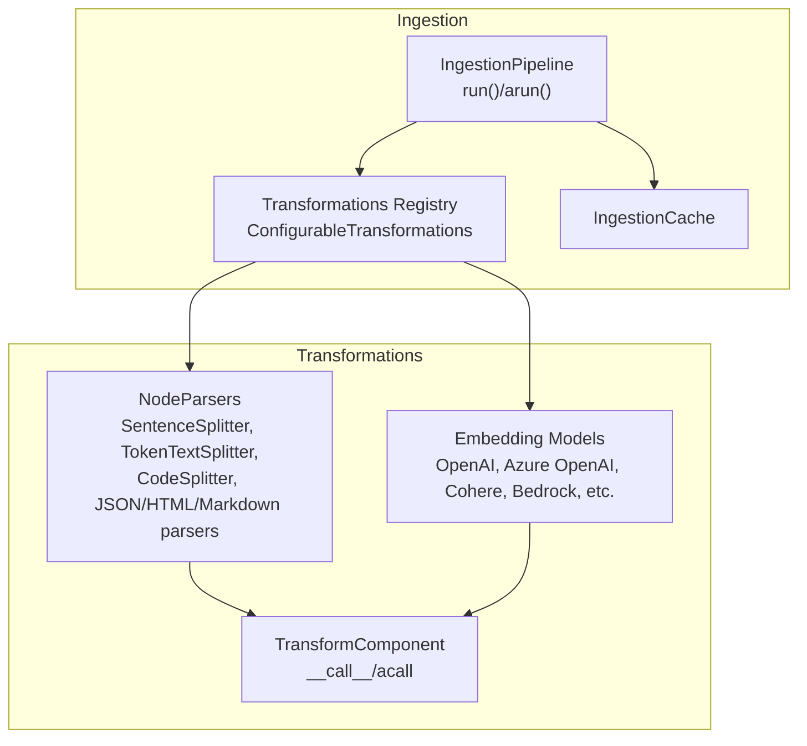
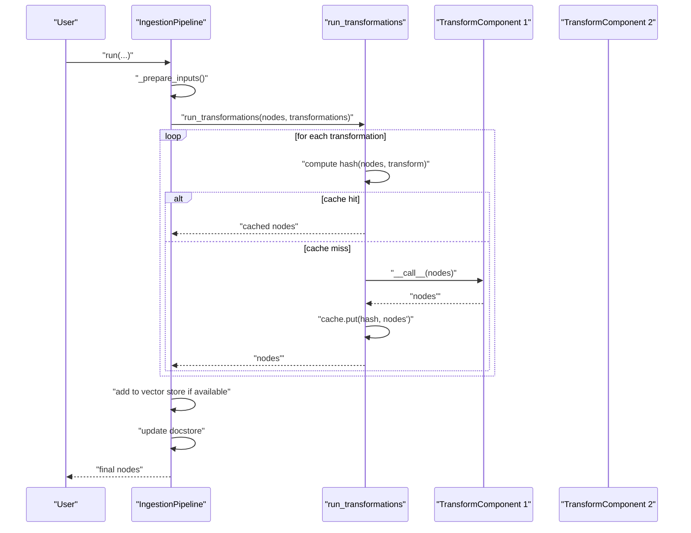
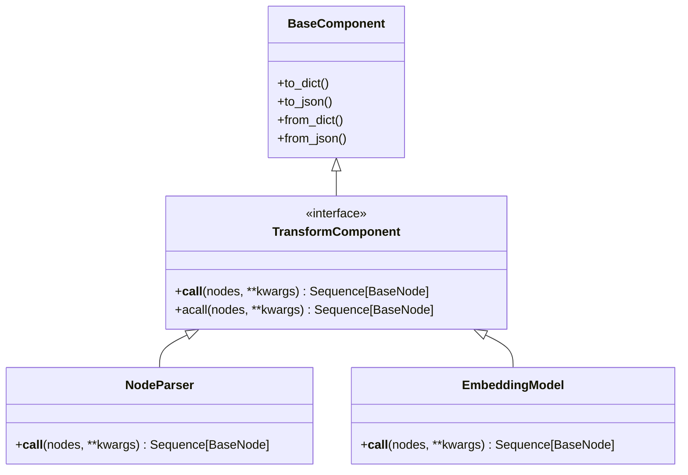
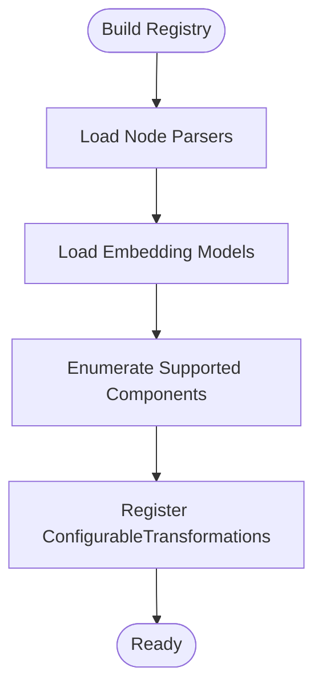
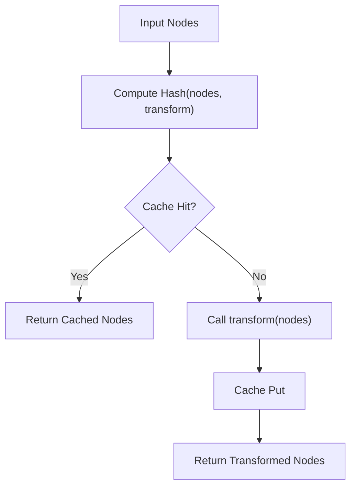
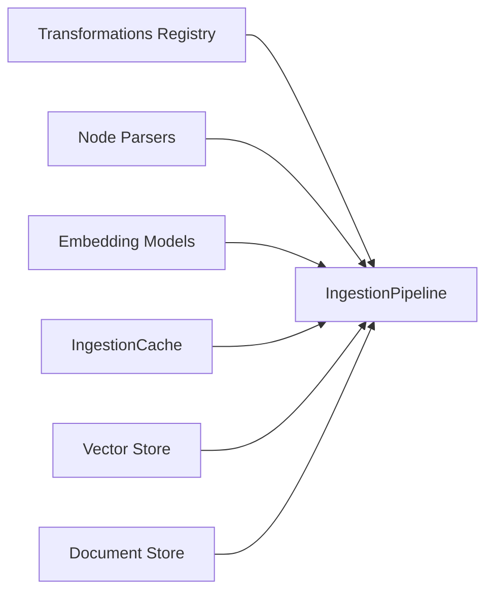

# Processing Steps

<cite>
**Referenced Files in This Document**
- [transformations.py](file://llama-index-core/llama_index/core/ingestion/transformations.py)
- [pipeline.py](file://llama-index-core/llama_index/core/ingestion/pipeline.py)
- [cache.py](file://llama-index-core/llama_index/core/ingestion/cache.py)
- [schema.py](file://llama-index-core/llama_index/core/schema.py)
- [node_parser/__init__.py](file://llama-index-core/llama_index/core/node_parser/__init__.py)
- [text_splitter/__init__.py](file://llama-index-core/llama_index/core/text_splitter/__init__.py)
- [test_transformations.py](file://llama-index-core/tests/ingestion/test_transformations.py)
</cite>

## Table of Contents
1. [Introduction](#introduction)
2. [Project Structure](#project-structure)
3. [Core Components](#core-components)
4. [Architecture Overview](#architecture-overview)
5. [Detailed Component Analysis](#detailed-component-analysis)
6. [Dependency Analysis](#dependency-analysis)
7. [Performance Considerations](#performance-considerations)
8. [Troubleshooting Guide](#troubleshooting-guide)
9. [Conclusion](#conclusion)

## Introduction
This document explains the Processing Steps component of the LlamaIndex Ingestion Pipeline. It focuses on how raw data is transformed into nodes, covering text splitting, metadata handling, and embedding generation. It documents the TransformComponent interface, how to configure and chain transformations, and how to implement custom processing logic. It also covers transformation caching, performance optimization, and debugging techniques.

## Project Structure
The Processing Steps live primarily in the ingestion subsystem and integrate with node parsing and text splitting utilities:
- Ingestion pipeline orchestration and caching
- Transformation registry and configuration
- Node parser and text splitter utilities
- TransformComponent interface definition

**Diagram sources**
- [pipeline.py](file://llama-index-core/llama_index/core/ingestion/pipeline.py#L193-L575)
- [transformations.py](file://llama-index-core/llama_index/core/ingestion/transformations.py#L118-L342)
- [cache.py](file://llama-index-core/llama_index/core/ingestion/cache.py#L17-L75)
- [node_parser/__init__.py](file://llama-index-core/llama_index/core/node_parser/__init__.py#L1-L73)
- [text_splitter/__init__.py](file://llama-index-core/llama_index/core/text_splitter/__init__.py#L1-L13)

**Section sources**
- [pipeline.py](file://llama-index-core/llama_index/core/ingestion/pipeline.py#L1-L779)
- [transformations.py](file://llama-index-core/llama_index/core/ingestion/transformations.py#L1-L379)
- [cache.py](file://llama-index-core/llama_index/core/ingestion/cache.py#L1-L79)
- [node_parser/__init__.py](file://llama-index-core/llama_index/core/node_parser/__init__.py#L1-L73)
- [text_splitter/__init__.py](file://llama-index-core/llama_index/core/text_splitter/__init__.py#L1-L13)

## Core Components
- TransformComponent: The base interface for all transformations. It defines synchronous and asynchronous call signatures and integrates with instrumentation spans.
- NodeParser: A specialized TransformComponent that converts Documents into Nodes using text splitting and metadata extraction strategies.
- TextSplitters: Implementations like SentenceSplitter, TokenTextSplitter, and CodeSplitter that split raw text into chunks suitable for downstream processing.
- Embedding Models: Implementations that attach vector embeddings to Nodes.
- IngestionPipeline: Orchestrates reading, deduplication, transformation chaining, caching, and persistence.
- IngestionCache: Stores previously computed node sequences keyed by transformation signature and input node content.

Key responsibilities:
- Define transformation categories and IO types
- Build a registry of configurable transformations
- Configure transformations from components
- Execute transformations in order with optional caching and parallelism

**Section sources**
- [schema.py](file://llama-index-core/llama_index/core/schema.py#L190-L208)
- [transformations.py](file://llama-index-core/llama_index/core/ingestion/transformations.py#L27-L116)
- [transformations.py](file://llama-index-core/llama_index/core/ingestion/transformations.py#L118-L342)
- [transformations.py](file://llama-index-core/llama_index/core/ingestion/transformations.py#L347-L379)
- [node_parser/__init__.py](file://llama-index-core/llama_index/core/node_parser/__init__.py#L28-L42)
- [text_splitter/__init__.py](file://llama-index-core/llama_index/core/text_splitter/__init__.py#L1-L13)
- [pipeline.py](file://llama-index-core/llama_index/core/ingestion/pipeline.py#L193-L575)
- [cache.py](file://llama-index-core/llama_index/core/ingestion/cache.py#L17-L75)

## Architecture Overview
The ingestion pipeline executes a sequence of TransformComponents over nodes. Each transformation can be a NodeParser (splitting and metadata extraction) or an Embedding model (generating vectors). The pipeline supports:
- Synchronous and asynchronous execution
- In-place or copy-based transformations
- Caching of transformation results
- Parallel execution via process pools
- Deduplication using a document store and vector store

**Diagram sources**
- [pipeline.py](file://llama-index-core/llama_index/core/ingestion/pipeline.py#L467-L575)
- [pipeline.py](file://llama-index-core/llama_index/core/ingestion/pipeline.py#L71-L105)
- [cache.py](file://llama-index-core/llama_index/core/ingestion/cache.py#L27-L46)

## Detailed Component Analysis

### TransformComponent Interface
TransformComponent is the base interface for all transformations. It requires:
- A synchronous call method that accepts a sequence of nodes and returns transformed nodes
- An asynchronous call method for async environments
- Integration with instrumentation spans for observability

Custom transformations should subclass TransformComponent and implement the call/acall methods. The interface ensures consistent behavior across node parsers, text splitters, and embedding models.

**Diagram sources**
- [schema.py](file://llama-index-core/llama_index/core/schema.py#L80-L188)
- [schema.py](file://llama-index-core/llama_index/core/schema.py#L190-L208)

**Section sources**
- [schema.py](file://llama-index-core/llama_index/core/schema.py#L190-L208)

### Transformations Registry and Configuration
The system builds a registry of supported transformations dynamically. It enumerates:
- Node parsers: SentenceSplitter, TokenTextSplitter, CodeSplitter, HTML/JSON/Markdown parsers, and others
- Embedding models: OpenAI, Azure OpenAI, Cohere, Bedrock, HuggingFace API, Gemini, MistralAI, etc.

Each registered transformation is associated with:
- A human-readable name
- A category (NodeParser or Embedding)
- The component type implementing the transformation

Configured transformations are created from actual component instances and carry both metadata and the component itself.

**Diagram sources**
- [transformations.py](file://llama-index-core/llama_index/core/ingestion/transformations.py#L118-L342)

**Section sources**
- [transformations.py](file://llama-index-core/llama_index/core/ingestion/transformations.py#L118-L342)
- [transformations.py](file://llama-index-core/llama_index/core/ingestion/transformations.py#L347-L379)

### Built-in Transformations
- SentenceSplitter: Splits text into sentence-aware chunks, commonly used as the default node parser.
- TokenTextSplitter: Splits text into token-aware chunks based on model token limits.
- CodeSplitter: Specialized for code content.
- Node parsers for structured formats: HTMLNodeParser, JSONNodeParser, MarkdownNodeParser, SimpleFileNodeParser, MarkdownElementNodeParser.

These are exposed via node parser and text splitter init files and are selectable through the transformations registry.

**Section sources**
- [node_parser/__init__.py](file://llama-index-core/llama_index/core/node_parser/__init__.py#L28-L42)
- [text_splitter/__init__.py](file://llama-index-core/llama_index/core/text_splitter/__init__.py#L1-L13)

### Chaining Transformations
To chain transformations:
- Provide a list of TransformComponent instances to the IngestionPipeline
- The pipeline applies them sequentially in order
- Each transformation receives the output of the previous one

Common chaining patterns:
- Text splitting followed by embedding generation
- Multiple text splitters for different content types
- Metadata extraction before or after splitting

**Section sources**
- [pipeline.py](file://llama-index-core/llama_index/core/ingestion/pipeline.py#L225-L240)
- [pipeline.py](file://llama-index-core/llama_index/core/ingestion/pipeline.py#L554-L563)

### Executing Transformations
Two execution helpers are provided:
- run_transformations: Synchronous execution with optional caching and in-place updates
- arun_transformations: Asynchronous execution with caching and async calls

Both compute a deterministic hash of the input nodes plus the serialized transformation config to detect cache hits.

**Diagram sources**
- [pipeline.py](file://llama-index-core/llama_index/core/ingestion/pipeline.py#L57-L105)
- [pipeline.py](file://llama-index-core/llama_index/core/ingestion/pipeline.py#L108-L143)
- [cache.py](file://llama-index-core/llama_index/core/ingestion/cache.py#L27-L46)

**Section sources**
- [pipeline.py](file://llama-index-core/llama_index/core/ingestion/pipeline.py#L71-L105)
- [pipeline.py](file://llama-index-core/llama_index/core/ingestion/pipeline.py#L108-L143)

### Creating Custom Transformations
Steps to implement a custom transformation:
- Subclass TransformComponent
- Implement __call__ to accept Sequence[BaseNode] and return transformed nodes
- Optionally implement acall for async environments
- Register the component in the transformations registry if you want it selectable via the pipeline’s configuration

Validation and tests ensure the registry recognizes supported components.

**Section sources**
- [schema.py](file://llama-index-core/llama_index/core/schema.py#L190-L208)
- [transformations.py](file://llama-index-core/llama_index/core/ingestion/transformations.py#L347-L379)
- [test_transformations.py](file://llama-index-core/tests/ingestion/test_transformations.py)

### Configuring Transformation Parameters
Parameters are configured when constructing transformation components:
- Text splitters: chunk size, overlap, separators, etc.
- Embedding models: model name, dimensions, batch size, etc.
- Node parsers: metadata extraction rules, element parsing options

Pass these parameters when instantiating components and include them in the transformations list.

**Section sources**
- [node_parser/__init__.py](file://llama-index-core/llama_index/core/node_parser/__init__.py#L28-L42)
- [text_splitter/__init__.py](file://llama-index-core/llama_index/core/text_splitter/__init__.py#L1-L13)

### Implementing Custom Processing Logic
Custom processing logic is implemented inside the __call__ method of your TransformComponent subclass. Typical patterns include:
- Modifying node metadata
- Filtering nodes
- Generating additional derived nodes
- Attaching embeddings or other vector representations

Ensure your logic is deterministic and idempotent for effective caching.

**Section sources**
- [schema.py](file://llama-index-core/llama_index/core/schema.py#L190-L208)

## Dependency Analysis
The ingestion pipeline depends on:
- Transformations registry for supported components
- Node parsers and text splitters for converting Documents to Nodes
- Embedding models for generating vectors
- IngestionCache for memoizing transformation outputs
- Optional vector store and document store for deduplication and persistence

**Diagram sources**
- [transformations.py](file://llama-index-core/llama_index/core/ingestion/transformations.py#L118-L342)
- [pipeline.py](file://llama-index-core/llama_index/core/ingestion/pipeline.py#L193-L575)
- [cache.py](file://llama-index-core/llama_index/core/ingestion/cache.py#L17-L75)

**Section sources**
- [transformations.py](file://llama-index-core/llama_index/core/ingestion/transformations.py#L118-L342)
- [pipeline.py](file://llama-index-core/llama_index/core/ingestion/pipeline.py#L193-L575)
- [cache.py](file://llama-index-core/llama_index/core/ingestion/cache.py#L17-L75)

## Performance Considerations
- Caching: Use IngestionCache to avoid recomputing identical transformations. The pipeline computes a hash based on node content and transformation config.
- Parallelism: Use multiple workers to process batches of nodes concurrently. The pipeline splits nodes into batches and processes them in separate processes.
- Deduplication strategies: Choose appropriate docstore strategies to minimize redundant work when a vector store is present.
- Chunk sizing: Tune chunk size and overlap for text splitters to balance recall and retrieval quality.
- Embedding batching: Configure embedding models for efficient batch processing.

**Section sources**
- [pipeline.py](file://llama-index-core/llama_index/core/ingestion/pipeline.py#L530-L553)
- [pipeline.py](file://llama-index-core/llama_index/core/ingestion/pipeline.py#L567-L570)
- [pipeline.py](file://llama-index-core/llama_index/core/ingestion/pipeline.py#L655-L755)
- [pipeline.py](file://llama-index-core/llama_index/core/ingestion/pipeline.py#L770-L773)
- [cache.py](file://llama-index-core/llama_index/core/ingestion/cache.py#L27-L46)

## Troubleshooting Guide
- Symptom: Unexpected repeated computation
  - Cause: Cache disabled or mismatched transformation config
  - Action: Verify disable_cache flag and ensure transformation configs are stable
- Symptom: Slow ingestion
  - Cause: Large chunk sizes or expensive embeddings
  - Action: Reduce chunk size, enable caching, and tune embedding batch sizes
- Symptom: Incorrect deduplication
  - Cause: Wrong docstore strategy or missing vector store
  - Action: Select appropriate DocstoreStrategy and ensure vector store is configured
- Symptom: Async errors
  - Cause: Non-async transformations used in async context
  - Action: Implement acall or switch to sync execution

Debugging tips:
- Enable logging around pipeline execution
- Inspect transformation hashes and cache keys
- Validate node content and metadata before and after transformations

**Section sources**
- [pipeline.py](file://llama-index-core/llama_index/core/ingestion/pipeline.py#L514-L526)
- [pipeline.py](file://llama-index-core/llama_index/core/ingestion/pipeline.py#L530-L537)
- [pipeline.py](file://llama-index-core/llama_index/core/ingestion/pipeline.py#L655-L755)
- [cache.py](file://llama-index-core/llama_index/core/ingestion/cache.py#L27-L46)

## Conclusion
The Processing Steps component provides a flexible, extensible framework for transforming raw data into processed nodes ready for retrieval and RAG. By leveraging TransformComponent, the transformations registry, and IngestionCache, you can compose powerful pipelines that split text, extract metadata, and generate embeddings efficiently. Use the provided patterns to implement custom transformations, optimize performance with caching and parallelism, and debug issues with clear logging and validation.