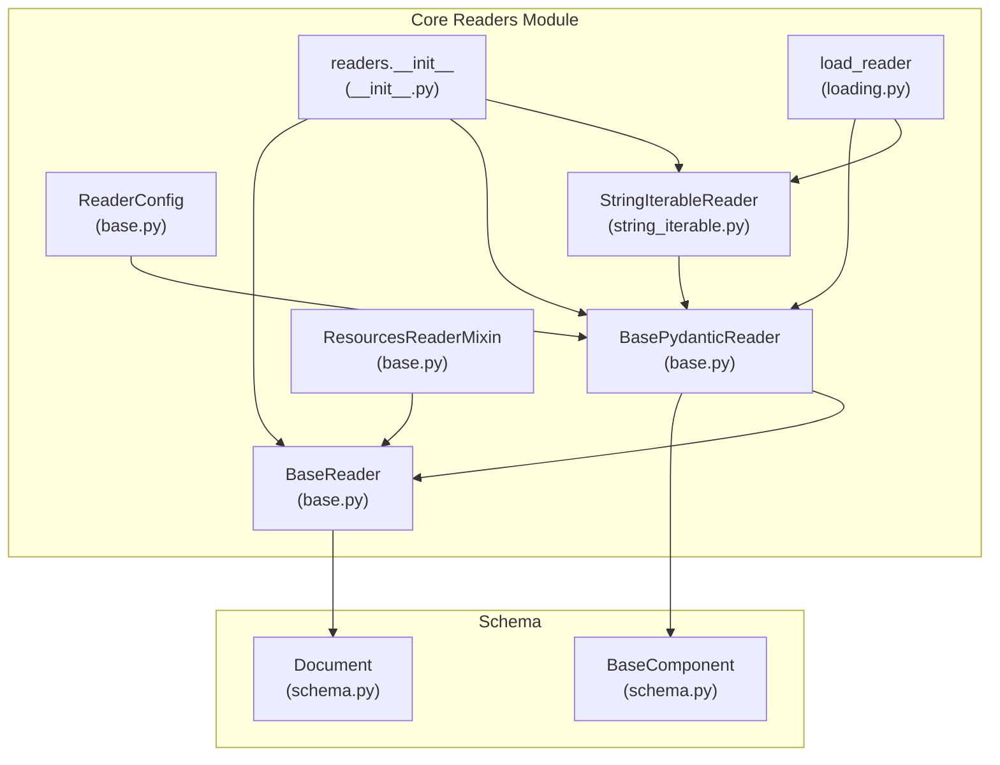
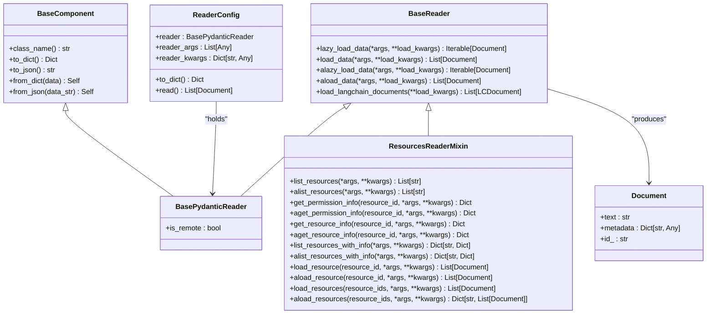
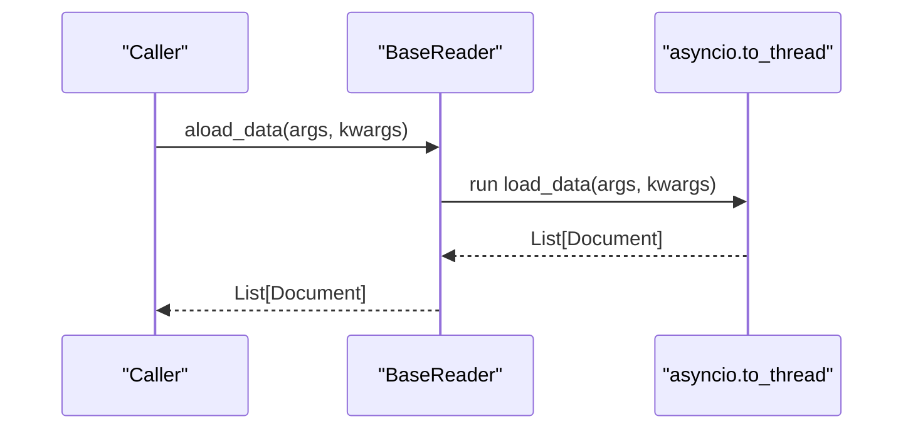
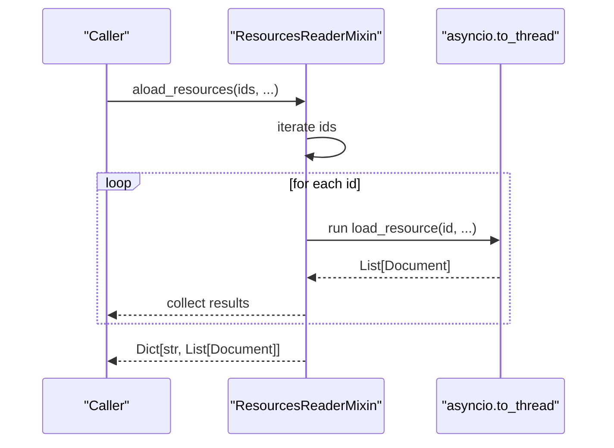
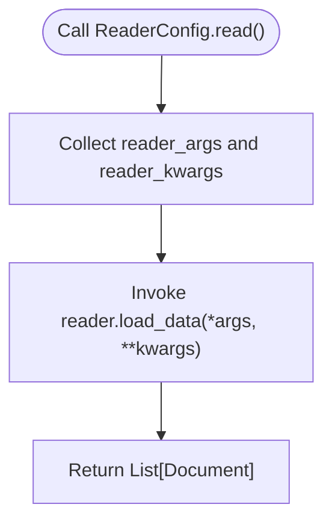
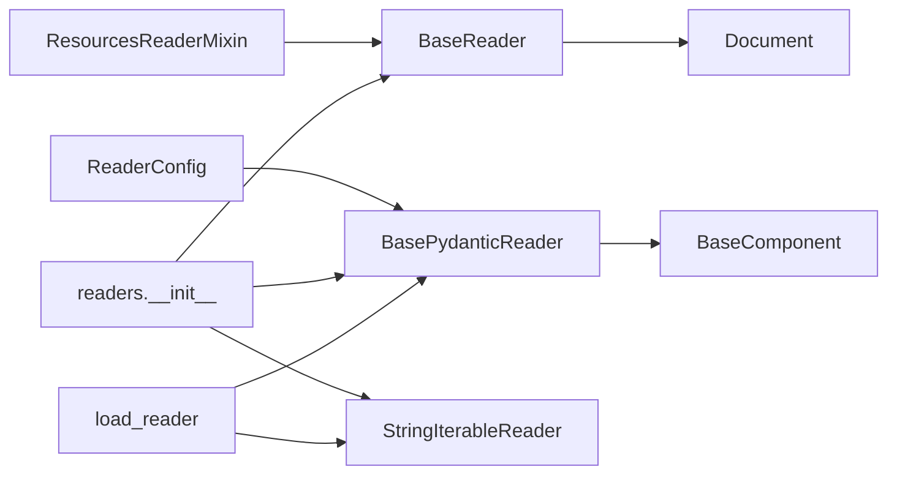

# Base Reader Interface

<cite>
**Referenced Files in This Document**
- [base.py](file://llama-index-core/llama_index/core/readers/base.py)
- [__init__.py](file://llama-index-core/llama_index/core/readers/__init__.py)
- [loading.py](file://llama-index-core/llama_index/core/readers/loading.py)
- [schema.py](file://llama-index-core/llama_index/core/schema.py)
- [string_iterable.py](file://llama-index-core/llama_index/core/readers/string_iterable.py)
- [test_load_reader.py](file://llama-index-core/tests/readers/test_load_reader.py)
</cite>

## Table of Contents
1. [Introduction](#introduction)
2. [Project Structure](#project-structure)
3. [Core Components](#core-components)
4. [Architecture Overview](#architecture-overview)
5. [Detailed Component Analysis](#detailed-component-analysis)
6. [Dependency Analysis](#dependency-analysis)
7. [Performance Considerations](#performance-considerations)
8. [Troubleshooting Guide](#troubleshooting-guide)
9. [Conclusion](#conclusion)
10. [Appendices](#appendices)

## Introduction
This document explains the Base Reader Interface in LlamaIndex, focusing on the BaseReader abstract class and its synchronous/asynchronous loading methods, the BasePydanticReader subclass for serializable readers, the ResourcesReaderMixin for resource-based operations, and the ReaderConfig class for managing reader configurations. It also covers integration with the Document schema, async patterns, thread-safety considerations, and best practices for building custom readers.

## Project Structure
The Base Reader Interface lives in the core readers module and integrates with the broader schema system for Documents. The readers package exports commonly used readers and helpers, while the loading module supports dynamic deserialization of readers.

**Diagram sources**
- [base.py](file://llama-index-core/llama_index/core/readers/base.py#L19-L250)
- [__init__.py](file://llama-index-core/llama_index/core/readers/__init__.py#L14-L32)
- [loading.py](file://llama-index-core/llama_index/core/readers/loading.py#L1-L27)
- [schema.py](file://llama-index-core/llama_index/core/schema.py#L80-L188)
- [string_iterable.py](file://llama-index-core/llama_index/core/readers/string_iterable.py#L9-L44)

**Section sources**
- [__init__.py](file://llama-index-core/llama_index/core/readers/__init__.py#L14-L32)

## Core Components
- BaseReader: Abstract interface defining lazy_load_data, load_data, alazy_load_data, and aload_data. Also provides convenience methods for LangChain document conversion.
- BasePydanticReader: Serializable reader built on BaseComponent, enabling robust serialization/deserialization via Pydantic.
- ResourcesReaderMixin: Adds resource discovery and access APIs (listing, permission info, resource info, and loading).
- ReaderConfig: Encapsulates a reader instance plus positional and keyword arguments for invocation and provides a read method.

Key responsibilities:
- BaseReader: Define the contract for data loading and async compatibility.
- BasePydanticReader: Provide serialization support for readers.
- ResourcesReaderMixin: Standardize resource-centric operations across readers.
- ReaderConfig: Manage reader instantiation and invocation parameters.

**Section sources**
- [base.py](file://llama-index-core/llama_index/core/readers/base.py#L19-L250)
- [schema.py](file://llama-index-core/llama_index/core/schema.py#L80-L188)

## Architecture Overview
The Base Reader Interface sits between the application and concrete data sources. Readers produce Document objects, which are the fundamental unit for downstream indexing and retrieval.

**Diagram sources**
- [base.py](file://llama-index-core/llama_index/core/readers/base.py#L19-L250)
- [schema.py](file://llama-index-core/llama_index/core/schema.py#L80-L188)
- [schema.py](file://llama-index-core/llama_index/core/schema.py#L1011-L1100)

## Detailed Component Analysis

### BaseReader: Synchronous and Asynchronous Loading
BaseReader defines four primary methods:
- lazy_load_data: Generator-style method to yield Documents incrementally.
- load_data: Consumes lazy_load_data and returns a List[Document].
- alazy_load_data: Async variant that defaults to running the sync method in a thread pool via asyncio.to_thread.
- aload_data: Async wrapper around load_data using asyncio.to_thread.

Behavioral notes:
- If a subclass implements only lazy_load_data, load_data automatically consumes it.
- alazy_load_data and aload_data provide async compatibility by offloading blocking work to threads.
- load_langchain_documents converts loaded Documents to LangChain’s Document format.

Thread-safety and async patterns:
- The default async methods delegate to sync implementations using asyncio.to_thread, which is safe for CPU-bound tasks.
- Subclasses should override alazy_load_data/aload_data with true async implementations (e.g., network I/O) for optimal concurrency.

Integration with Document:
- All load methods return Document objects produced by concrete readers.

**Section sources**
- [base.py](file://llama-index-core/llama_index/core/readers/base.py#L22-L46)

#### Async Loading Flow

**Diagram sources**
- [base.py](file://llama-index-core/llama_index/core/readers/base.py#L39-L41)

### BasePydanticReader: Serializable Reader
BasePydanticReader extends BaseReader and BaseComponent, enabling:
- Robust serialization/deserialization via Pydantic.
- A configurable is_remote flag for indicating whether data comes from a remote API or local file.
- Automatic injection of class_name into serialized payloads for reliable reconstruction.

Usage pattern:
- Implement load_data (and optionally lazy_load_data) to produce Documents.
- Use to_dict/from_dict for persistence and transport.

**Section sources**
- [base.py](file://llama-index-core/llama_index/core/readers/base.py#L49-L57)
- [schema.py](file://llama-index-core/llama_index/core/schema.py#L80-L188)

### ResourcesReaderMixin: Resource-Based Operations
ResourcesReaderMixin adds a standardized set of resource-centric capabilities:
- Listing resources: list_resources and alist_resources.
- Resource metadata: get_resource_info and aget_resource_info.
- Permissions: get_permission_info and aget_permission_info.
- Loading single/multiple resources: load_resource, aload_resource, load_resources, aload_resources.
- Convenience: list_resources_with_info and alist_resources_with_info.

Thread-safety and async patterns:
- Default async methods use asyncio.to_thread to wrap synchronous implementations.
- True async readers should override async variants for efficient concurrency.

**Section sources**
- [base.py](file://llama-index-core/llama_index/core/readers/base.py#L59-L221)

#### Resource Loading Sequence

**Diagram sources**
- [base.py](file://llama-index-core/llama_index/core/readers/base.py#L204-L220)

### ReaderConfig: Managing Reader Configurations
ReaderConfig encapsulates:
- reader: A BasePydanticReader instance.
- reader_args: Positional arguments for invoking the reader.
- reader_kwargs: Keyword arguments for invoking the reader.

It provides:
- to_dict: Serializes the config including the nested reader’s serialization and arguments.
- read: Invokes reader.load_data with stored arguments.

Serialization and loading:
- ReaderConfig itself is a BaseComponent, so it participates in the same serialization ecosystem as readers.
- The readers.loading.load_reader function reconstructs readers from serialized dicts using a registry.

**Section sources**
- [base.py](file://llama-index-core/llama_index/core/readers/base.py#L223-L250)
- [loading.py](file://llama-index-core/llama_index/core/readers/loading.py#L11-L27)

#### ReaderConfig Read Flow

**Diagram sources**
- [base.py](file://llama-index-core/llama_index/core/readers/base.py#L247-L249)

### Practical Examples and Best Practices

- Implementing a custom BasePydanticReader:
  - Extend BasePydanticReader and implement load_data (optionally lazy_load_data).
  - Use is_remote to indicate remote vs local data sources.
  - Ensure to_dict/from_dict are sufficient for your needs; BasePydanticReader inherits robust serialization from BaseComponent.

  Example reference:
  - [StringIterableReader](file://llama-index-core/llama_index/core/readers/string_iterable.py#L9-L44) demonstrates a minimal reader that converts a list of strings into Documents.

- Handling different data formats:
  - For structured formats (JSON, CSV), parse and normalize into Document instances.
  - For unstructured text, split into chunks and attach metadata (e.g., filename, page number).
  - Preserve original metadata in Document.metadata for downstream filtering and attribution.

- Integrating with Document schema:
  - Construct Document objects with text and metadata.
  - Use Document metadata to carry provenance, categories, timestamps, etc.

- Async patterns and thread safety:
  - Prefer true async I/O in alazy_load_data/aload_data for network/file systems.
  - If using blocking I/O, rely on the default asyncio.to_thread wrappers; avoid long-running CPU work in async methods.
  - Keep shared mutable state protected with locks if used across threads.

- Reader registration and loading:
  - Register new readers in the readers.loading registry if you need dynamic reconstruction.
  - Use load_reader to deserialize readers from dictionaries.

  Example reference:
  - [load_reader](file://llama-index-core/llama_index/core/readers/loading.py#L11-L27) and [test_load_reader](file://llama-index-core/tests/readers/test_load_reader.py#L8-L27) demonstrate serialization/deserialization.

**Section sources**
- [string_iterable.py](file://llama-index-core/llama_index/core/readers/string_iterable.py#L9-L44)
- [loading.py](file://llama-index-core/llama_index/core/readers/loading.py#L11-L27)
- [test_load_reader.py](file://llama-index-core/tests/readers/test_load_reader.py#L8-L27)

## Dependency Analysis
The Base Reader Interface depends on the schema’s Document and BaseComponent for data modeling and serialization. Readers are exported via readers.__init__ and can be dynamically loaded using the loading module.

**Diagram sources**
- [base.py](file://llama-index-core/llama_index/core/readers/base.py#L19-L250)
- [__init__.py](file://llama-index-core/llama_index/core/readers/__init__.py#L14-L32)
- [loading.py](file://llama-index-core/llama_index/core/readers/loading.py#L1-L27)
- [schema.py](file://llama-index-core/llama_index/core/schema.py#L80-L188)
- [string_iterable.py](file://llama-index-core/llama_index/core/readers/string_iterable.py#L9-L44)

**Section sources**
- [__init__.py](file://llama-index-core/llama_index/core/readers/__init__.py#L14-L32)
- [loading.py](file://llama-index-core/llama_index/core/readers/loading.py#L1-L27)

## Performance Considerations
- Prefer true async I/O in async reader methods for I/O-bound sources (network, cloud storage).
- Use lazy_load_data to stream results and reduce memory overhead for large datasets.
- Avoid heavy CPU work inside async methods; delegate to threads using asyncio.to_thread when necessary.
- Reuse connections and caches where applicable to minimize overhead.

## Troubleshooting Guide
Common issues and resolutions:
- Missing class_name during deserialization:
  - Ensure serialized reader dicts include class_name; otherwise, load_reader raises an error.
  - Reference: [test_load_reader](file://llama-index-core/tests/readers/test_load_reader.py#L20-L26)

- Reader class not found:
  - Verify the reader’s class_name is registered in the readers.loading registry.
  - Reference: [load_reader](file://llama-index-core/llama_index/core/readers/loading.py#L20-L21)

- Async methods falling back to threads:
  - If alazy_load_data/aload_data are not overridden, they run the sync methods in threads via asyncio.to_thread.
  - Implement true async I/O for better performance.

**Section sources**
- [test_load_reader.py](file://llama-index-core/tests/readers/test_load_reader.py#L20-L26)
- [loading.py](file://llama-index-core/llama_index/core/readers/loading.py#L20-L21)
- [base.py](file://llama-index-core/llama_index/core/readers/base.py#L28-L41)

## Conclusion
The Base Reader Interface provides a consistent, extensible foundation for ingesting diverse data sources into LlamaIndex. By leveraging BaseReader, BasePydanticReader, ResourcesReaderMixin, and ReaderConfig, developers can build robust, serializable, and async-capable readers that integrate seamlessly with the Document schema and downstream components.

## Appendices

### Appendix A: Minimal Reader Checklist
- Implement load_data (and optionally lazy_load_data).
- If serializing/deserializing is required, inherit from BasePydanticReader.
- If your reader operates on named resources, mix in ResourcesReaderMixin.
- For configuration-driven invocations, wrap your reader in ReaderConfig.
- Add your reader to the readers.loading registry if dynamic loading is needed.

### Appendix B: Example References
- [StringIterableReader](file://llama-index-core/llama_index/core/readers/string_iterable.py#L9-L44)
- [load_reader](file://llama-index-core/llama_index/core/readers/loading.py#L11-L27)
- [test_load_reader](file://llama-index-core/tests/readers/test_load_reader.py#L8-L27)