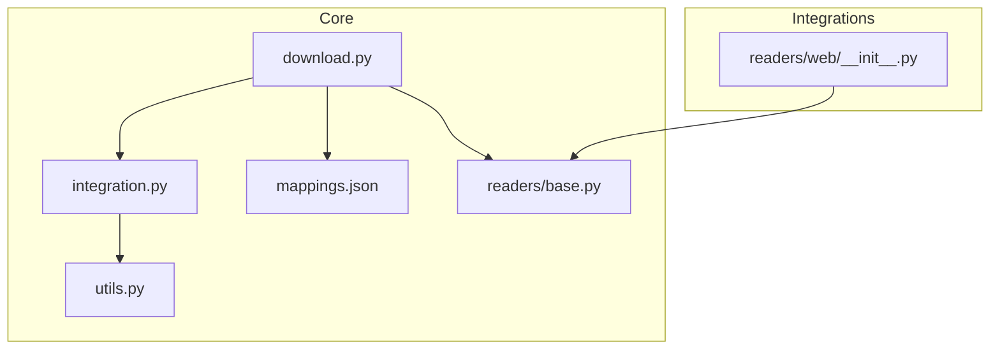
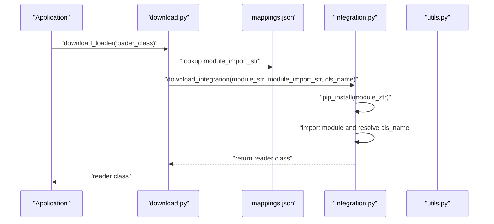
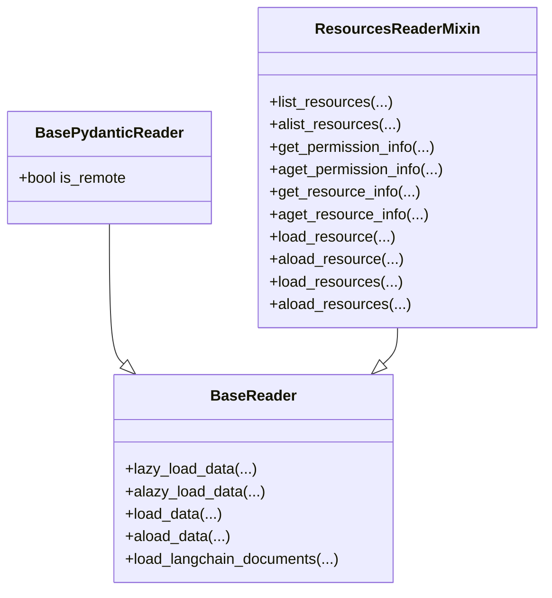
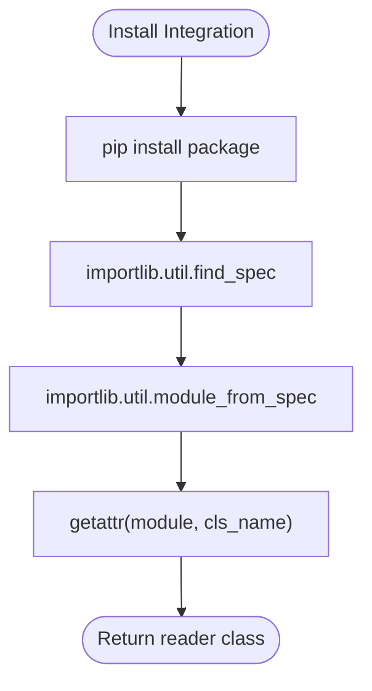
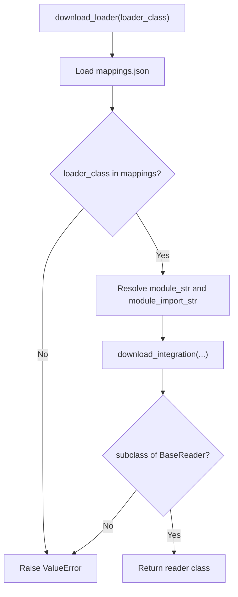
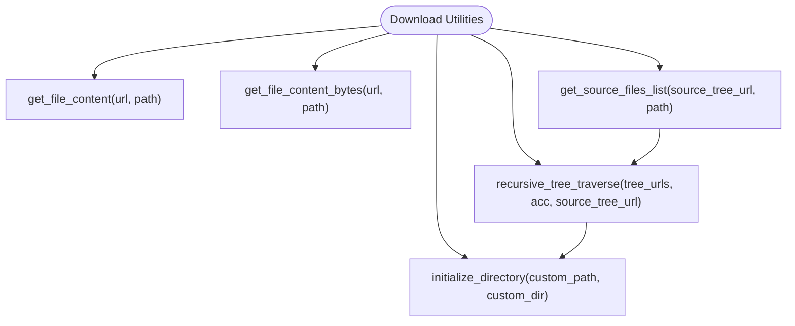
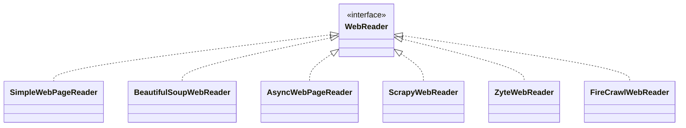
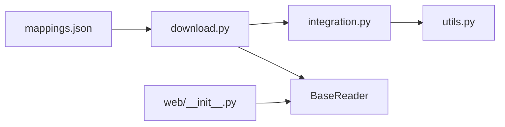

# Download Readers

<cite>
**Referenced Files in This Document**
- [download.py](file://llama-index-core/llama_index/core/readers/download.py)
- [base.py](file://llama-index-core/llama_index/core/readers/base.py)
- [integration.py](file://llama-index-core/llama_index/core/download/integration.py)
- [utils.py](file://llama-index-core/llama_index/core/download/utils.py)
- [mappings.json](file://llama-index-core/llama_index/core/command_line/mappings.json)
- [web/__init__.py](file://llama-index-integrations/readers/llama-index-readers-web/llama_index/readers/web/__init__.py)
</cite>

## Table of Contents
1. [Introduction](#introduction)
2. [Project Structure](#project-structure)
3. [Core Components](#core-components)
4. [Architecture Overview](#architecture-overview)
5. [Detailed Component Analysis](#detailed-component-analysis)
6. [Dependency Analysis](#dependency-analysis)
7. [Performance Considerations](#performance-considerations)
8. [Troubleshooting Guide](#troubleshooting-guide)
9. [Conclusion](#conclusion)

## Introduction
This document explains Download Readers in LlamaIndex with a focus on retrieving data from external URLs and remote sources. It covers HTTP handling, authentication mechanisms, proxy configuration, caching, retry logic, and timeouts. It also provides practical examples for downloading from public URLs, authenticated endpoints, and handling diverse download scenarios. Security considerations, rate limiting, and best practices for reliable data fetching are addressed to help you build robust ingestion pipelines.

## Project Structure
The download-related functionality spans core modules and integration packages:
- Core download utilities and integration installer live under the core download namespace.
- Reader abstractions and base interfaces live under the core readers namespace.
- Integration readers (e.g., web scrapers) are distributed across the integrations package.

**Diagram sources**
- [download.py](file://llama-index-core/llama_index/core/readers/download.py#L1-L81)
- [integration.py](file://llama-index-core/llama_index/core/download/integration.py#L1-L28)
- [utils.py](file://llama-index-core/llama_index/core/download/utils.py#L1-L161)
- [mappings.json](file://llama-index-core/llama_index/core/command_line/mappings.json#L1-L1096)
- [base.py](file://llama-index-core/llama_index/core/readers/base.py#L1-L250)
- [web/__init__.py](file://llama-index-integrations/readers/llama-index-readers-web/llama_index/readers/web/__init__.py#L1-L89)

**Section sources**
- [download.py](file://llama-index-core/llama_index/core/readers/download.py#L1-L81)
- [integration.py](file://llama-index-core/llama_index/core/download/integration.py#L1-L28)
- [utils.py](file://llama-index-core/llama_index/core/download/utils.py#L1-L161)
- [mappings.json](file://llama-index-core/llama_index/core/command_line/mappings.json#L1-L1096)
- [base.py](file://llama-index-core/llama_index/core/readers/base.py#L1-L250)
- [web/__init__.py](file://llama-index-integrations/readers/llama-index-readers-web/llama_index/readers/web/__init__.py#L1-L89)

## Core Components
- Reader base interface defines asynchronous and synchronous loading patterns and resource listing capabilities.
- Download utilities encapsulate HTTP operations for fetching remote content and managing source trees.
- Integration installer handles dynamic installation and import of external reader packages.
- Legacy loader downloader bridges old-style loader discovery to modern pip-installable readers via mappings.

Key responsibilities:
- BaseReader and derived interfaces define the contract for loading data from local and remote sources.
- Integration downloader installs and imports third-party reader integrations.
- Download utilities provide HTTP helpers and directory initialization for remote content retrieval.

**Section sources**
- [base.py](file://llama-index-core/llama_index/core/readers/base.py#L19-L250)
- [integration.py](file://llama-index-core/llama_index/core/download/integration.py#L9-L28)
- [utils.py](file://llama-index-core/llama_index/core/download/utils.py#L8-L161)
- [download.py](file://llama-index-core/llama_index/core/readers/download.py#L19-L81)

## Architecture Overview
The download pipeline integrates core utilities with integration readers. For legacy loader downloads, a mapping file resolves class names to pip-installable packages, which are then installed and imported dynamically. For modern readers (e.g., web scrapers), readers expose async/sync loading APIs and resource introspection.

**Diagram sources**
- [download.py](file://llama-index-core/llama_index/core/readers/download.py#L19-L81)
- [integration.py](file://llama-index-core/llama_index/core/download/integration.py#L13-L28)
- [mappings.json](file://llama-index-core/llama_index/core/command_line/mappings.json#L46-L46)

## Detailed Component Analysis

### Reader Base and Remote Capabilities
- BaseReader defines synchronous and asynchronous loading methods and lazy iteration patterns.
- BasePydanticReader extends BaseReader with a flag indicating whether data is remote.
- Resource mixins enable listing and inspecting resources (files, channels, pages) and loading subsets of data.

**Diagram sources**
- [base.py](file://llama-index-core/llama_index/core/readers/base.py#L19-L250)

**Section sources**
- [base.py](file://llama-index-core/llama_index/core/readers/base.py#L19-L250)

### Integration Downloader and Installer
- The integration downloader installs a pip package and imports the target class from the resolved module.
- It wraps subprocess pip invocation and importlib-based module resolution.

**Diagram sources**
- [integration.py](file://llama-index-core/llama_index/core/download/integration.py#L13-L28)

**Section sources**
- [integration.py](file://llama-index-core/llama_index/core/download/integration.py#L9-L28)

### Legacy Loader Downloader
- The legacy downloader reads a mapping from a JSON file and converts a class name into a pip package and import path.
- It validates that the resolved class is a BaseReader subclass and returns it.

**Diagram sources**
- [download.py](file://llama-index-core/llama_index/core/readers/download.py#L19-L81)
- [mappings.json](file://llama-index-core/llama_index/core/command_line/mappings.json#L46-L46)
- [integration.py](file://llama-index-core/llama_index/core/download/integration.py#L13-L28)

**Section sources**
- [download.py](file://llama-index-core/llama_index/core/readers/download.py#L19-L81)
- [mappings.json](file://llama-index-core/llama_index/core/command_line/mappings.json#L46-L46)

### Download Utilities (HTTP Helpers and Directory Management)
- Provides helpers to fetch file content and source trees from remote endpoints with timeouts.
- Offers directory initialization and context manager utilities for managing working directories.

**Diagram sources**
- [utils.py](file://llama-index-core/llama_index/core/download/utils.py#L8-L161)

**Section sources**
- [utils.py](file://llama-index-core/llama_index/core/download/utils.py#L8-L161)

### Integration Readers (Examples)
- The web readers package exposes multiple reader classes for scraping and content extraction from URLs.
- These readers implement the BaseReader interface and can be used for downloading and parsing remote content.

**Diagram sources**
- [web/__init__.py](file://llama-index-integrations/readers/llama-index-readers-web/llama_index/readers/web/__init__.py#L3-L60)
- [base.py](file://llama-index-core/llama_index/core/readers/base.py#L19-L250)

**Section sources**
- [web/__init__.py](file://llama-index-integrations/readers/llama-index-readers-web/llama_index/readers/web/__init__.py#L1-L89)
- [base.py](file://llama-index-core/llama_index/core/readers/base.py#L19-L250)

## Dependency Analysis
- The legacy loader downloader depends on a mapping file to resolve class names to pip packages and uses the integration downloader to install and import the class.
- The integration downloader depends on subprocess pip invocation and importlib to dynamically load modules.
- Integration readers depend on the BaseReader interface and may rely on external libraries for HTTP and parsing.

**Diagram sources**
- [mappings.json](file://llama-index-core/llama_index/core/command_line/mappings.json#L46-L46)
- [download.py](file://llama-index-core/llama_index/core/readers/download.py#L19-L81)
- [integration.py](file://llama-index-core/llama_index/core/download/integration.py#L13-L28)
- [utils.py](file://llama-index-core/llama_index/core/download/utils.py#L1-L161)
- [web/__init__.py](file://llama-index-integrations/readers/llama-index-readers-web/llama_index/readers/web/__init__.py#L1-L89)
- [base.py](file://llama-index-core/llama_index/core/readers/base.py#L19-L250)

**Section sources**
- [mappings.json](file://llama-index-core/llama_index/core/command_line/mappings.json#L46-L46)
- [download.py](file://llama-index-core/llama_index/core/readers/download.py#L19-L81)
- [integration.py](file://llama-index-core/llama_index/core/download/integration.py#L13-L28)
- [utils.py](file://llama-index-core/llama_index/core/download/utils.py#L1-L161)
- [web/__init__.py](file://llama-index-integrations/readers/llama-index-readers-web/llama_index/readers/web/__init__.py#L1-L89)
- [base.py](file://llama-index-core/llama_index/core/readers/base.py#L19-L250)

## Performance Considerations
- Asynchronous loading: Prefer async methods where available to improve throughput when ingesting from multiple URLs concurrently.
- Timeout configuration: Use appropriate connect and read timeouts to avoid blocking operations on slow networks.
- Retry logic: Implement retries with exponential backoff for transient failures (e.g., network errors, rate-limited responses).
- Concurrency limits: Apply semaphore-based throttling to avoid overwhelming external services.
- Caching: Cache downloaded artifacts locally to reduce repeated network calls and accelerate development cycles.
- Streaming: For large downloads, stream content to disk and process incrementally to minimize memory usage.

## Troubleshooting Guide
Common issues and resolutions:
- Authentication failures: Ensure credentials are configured in the reader’s constructor or environment variables. Some integrations require API keys or tokens.
- Proxy configuration: Set environment variables or configure HTTP clients to route traffic through proxies.
- Rate limiting: Implement backoff and jitter; monitor response headers for rate limit indicators and pause accordingly.
- Network errors: Add retry logic with exponential backoff; validate DNS and firewall rules.
- Timeout errors: Increase connect/read timeouts; consider connection pooling.
- SSL/TLS issues: Verify certificates and CA bundles; disable strict verification only as a last resort.
- Disk space and permissions: Ensure sufficient disk space and write permissions for cached downloads.

## Conclusion
Download Readers in LlamaIndex provide a flexible foundation for retrieving data from external URLs and remote sources. By leveraging the BaseReader interface, integration downloader, and HTTP utilities, you can build robust ingestion pipelines. Combine async loading, timeouts, retries, caching, and proxy support to achieve reliable and efficient data fetching. For authenticated endpoints and rate-limited services, apply best practices around credentials, backoff strategies, and concurrency controls to ensure resilient operations.