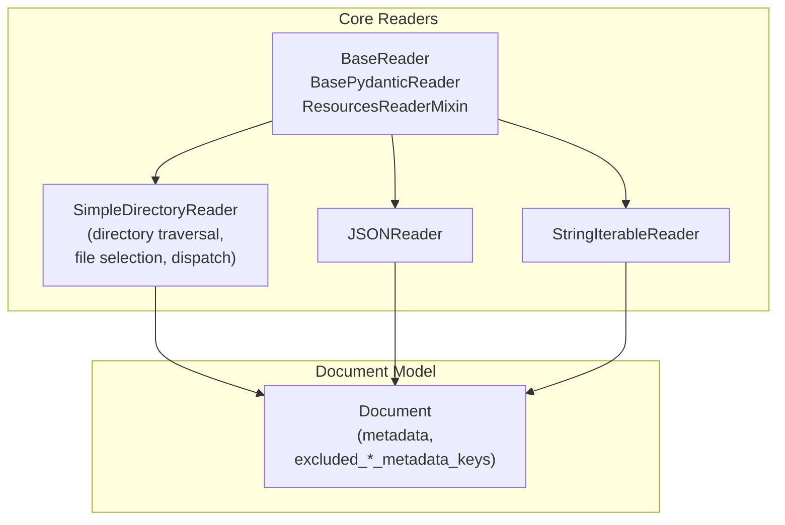
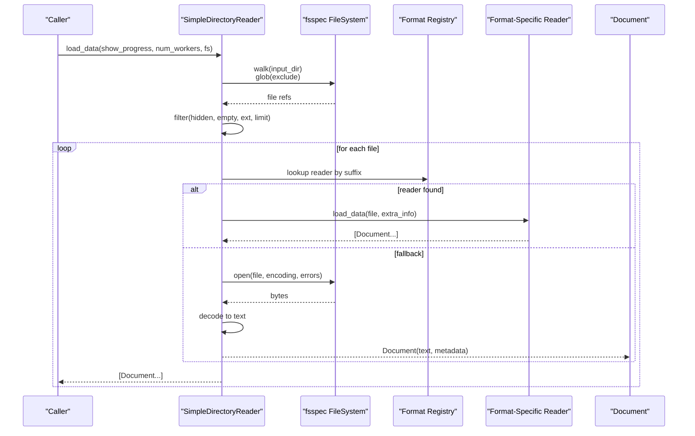
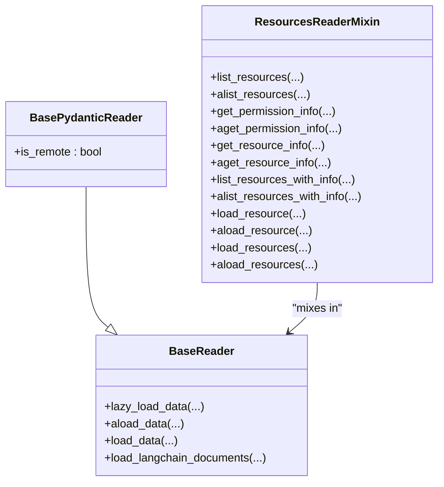
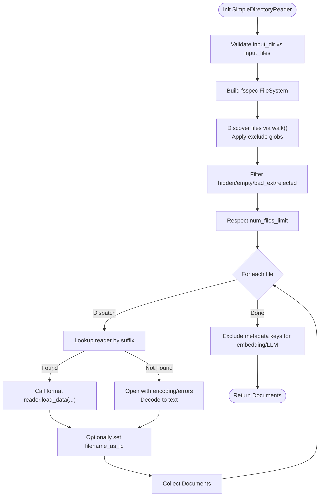
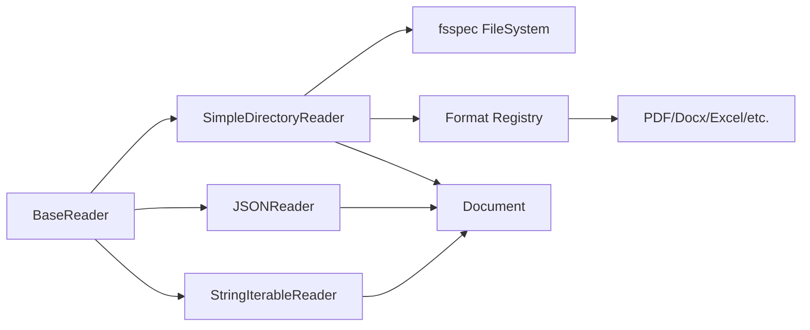

# File Readers

<cite>
**Referenced Files in This Document**
- [base.py](file://llama-index-core/llama_index/core/readers/base.py)
- [file/base.py](file://llama-index-core/llama_index/core/readers/file/base.py)
- [json.py](file://llama-index-core/llama_index/core/readers/json.py)
- [loading.py](file://llama-index-core/llama_index/core/readers/loading.py)
- [string_iterable.py](file://llama-index-core/llama_index/core/readers/string_iterable.py)
- [__init__.py](file://llama-index-core/llama_index/core/readers/__init__.py)
- [schema.py](file://llama-index-core/llama_index/core/schema.py)
- [README.md](file://README.md)
</cite>

## Table of Contents
1. [Introduction](#introduction)
2. [Project Structure](#project-structure)
3. [Core Components](#core-components)
4. [Architecture Overview](#architecture-overview)
5. [Detailed Component Analysis](#detailed-component-analysis)
6. [Dependency Analysis](#dependency-analysis)
7. [Performance Considerations](#performance-considerations)
8. [Troubleshooting Guide](#troubleshooting-guide)
9. [Conclusion](#conclusion)
10. [Appendices](#appendices)

## Introduction
This document explains File Readers in LlamaIndex with a focus on the BaseReader interface and the SimpleDirectoryReader implementation that supports reading multiple file formats (JSON, Markdown, HTML, CSV, Excel, PDF, images, notebooks, mbox, EPUB, and more). It covers file system operations, directory traversal, filtering, configuration options (encoding, parsing parameters, metadata extraction), practical usage patterns, and performance considerations for large-scale ingestion.

## Project Structure
The file reader ecosystem centers around a small set of core abstractions and a powerful directory reader that automatically selects appropriate per-format readers.

**Diagram sources**
- [base.py](file://llama-index-core/llama_index/core/readers/base.py#L19-L250)
- [file/base.py](file://llama-index-core/llama_index/core/readers/file/base.py#L208-L800)
- [json.py](file://llama-index-core/llama_index/core/readers/json.py#L53-L155)
- [string_iterable.py](file://llama-index-core/llama_index/core/readers/string_iterable.py#L9-L44)
- [schema.py](file://llama-index-core/llama_index/core/schema.py#L263-L400)

**Section sources**
- [__init__.py](file://llama-index-core/llama_index/core/readers/__init__.py#L14-L32)

## Core Components
- BaseReader and related mixins define the contract for loading data and listing resources.
- SimpleDirectoryReader orchestrates directory traversal, file filtering, and dispatch to specialized readers.
- JSONReader and StringIterableReader provide format-specific loaders.
- Document is the core data structure returned by readers.

Key responsibilities:
- BaseReader: synchronous/asynchronous loading, LangChain interop.
- ResourcesReaderMixin: listing and inspecting resources (files/channels/pages).
- SimpleDirectoryReader: file discovery, filtering, metadata extraction, dispatch to format-specific readers, parallel loading.
- JSONReader: depth-first traversal and collapsing for structured content.
- StringIterableReader: lightweight conversion from string iterables.

**Section sources**
- [base.py](file://llama-index-core/llama_index/core/readers/base.py#L19-L250)
- [file/base.py](file://llama-index-core/llama_index/core/readers/file/base.py#L208-L800)
- [json.py](file://llama-index-core/llama_index/core/readers/json.py#L53-L155)
- [string_iterable.py](file://llama-index-core/llama_index/core/readers/string_iterable.py#L9-L44)
- [schema.py](file://llama-index-core/llama_index/core/schema.py#L263-L400)

## Architecture Overview
The directory reader composes a file system abstraction (fsspec), a metadata extractor, and a registry of format-specific readers. It discovers files, applies filters, and either delegates to a specialized reader or falls back to plain text decoding.

**Diagram sources**
- [file/base.py](file://llama-index-core/llama_index/core/readers/file/base.py#L208-L800)

## Detailed Component Analysis

### BaseReader and Reader Mixins
- BaseReader defines synchronous/asynchronous load_data and lazy_load_data, plus LangChain interop.
- BasePydanticReader adds serialization support and a flag for remote vs local sources.
- ResourcesReaderMixin defines resource listing, permission info, and resource loading APIs.

**Diagram sources**
- [base.py](file://llama-index-core/llama_index/core/readers/base.py#L19-L250)

**Section sources**
- [base.py](file://llama-index-core/llama_index/core/readers/base.py#L19-L250)

### SimpleDirectoryReader: Directory Traversal, Filtering, and Dispatch
- Supports input_dir or explicit input_files, with optional recursion and exclusion patterns.
- Filters hidden files, empty files, and enforces required extensions.
- Uses fsspec for filesystem-agnostic traversal and remote storage support.
- Builds a default file metadata function and allows custom metadata extraction.
- Maintains a registry of format-specific readers and dispatches accordingly.
- Provides parallel loading via multiprocessing with progress reporting.

Key configuration options:
- encoding and errors for text fallback decoding
- filename_as_id to set document ids
- required_exts to restrict formats
- file_extractor to override or extend format dispatch
- num_files_limit to cap ingestion volume
- file_metadata to customize metadata extraction
- raise_on_error to fail fast on unreadable files
- fs to target local or remote filesystems

**Diagram sources**
- [file/base.py](file://llama-index-core/llama_index/core/readers/file/base.py#L208-L800)

**Section sources**
- [file/base.py](file://llama-index-core/llama_index/core/readers/file/base.py#L208-L800)

### JSONReader: Structured Content Extraction
- Supports JSON and JSON Lines modes.
- Offers depth-first traversal with configurable levels_back and collapse_length to produce compact embeddings.
- Can clean pure-structure lines when levels_back is not used.

Configuration highlights:
- levels_back: controls hierarchical labeling for embeddings
- collapse_length: collapses small fragments into single lines
- is_jsonl: toggles JSON Lines parsing
- clean_json: removes formatting-only lines when levels_back is not used

**Section sources**
- [json.py](file://llama-index-core/llama_index/core/readers/json.py#L53-L155)

### StringIterableReader: Lightweight Text Ingestion
- Converts an iterable of strings into Document objects.
- Useful for programmatic ingestion or testing.

**Section sources**
- [string_iterable.py](file://llama-index-core/llama_index/core/readers/string_iterable.py#L9-L44)

### Document Model and Metadata Handling
- Document carries text content and metadata.
- SimpleDirectoryReader excludes certain metadata keys from embedding and LLM processing by default to reduce noise.

**Section sources**
- [schema.py](file://llama-index-core/llama_index/core/schema.py#L263-L400)
- [file/base.py](file://llama-index-core/llama_index/core/readers/file/base.py#L434-L468)

### Reader Loading Utilities
- ReaderConfig encapsulates a reader instance and its arguments for serialization/deserialization.
- load_reader resolves a reader class by name and reconstructs it from serialized data.

**Section sources**
- [base.py](file://llama-index-core/llama_index/core/readers/base.py#L223-L250)
- [loading.py](file://llama-index-core/llama_index/core/readers/loading.py#L6-L27)

## Dependency Analysis
- SimpleDirectoryReader depends on:
  - fsspec for filesystem abstraction
  - format-specific readers (PDF, DOCX, CSV, Excel, images, EPUB, IPYNB, MBOX, etc.) via an optional registry
  - Document for output
- JSONReader and StringIterableReader depend on BaseReader.
- Resource-related capabilities are layered via ResourcesReaderMixin.

**Diagram sources**
- [file/base.py](file://llama-index-core/llama_index/core/readers/file/base.py#L208-L800)
- [json.py](file://llama-index-core/llama_index/core/readers/json.py#L53-L155)
- [string_iterable.py](file://llama-index-core/llama_index/core/readers/string_iterable.py#L9-L44)
- [base.py](file://llama-index-core/llama_index/core/readers/base.py#L19-L250)

**Section sources**
- [file/base.py](file://llama-index-core/llama_index/core/readers/file/base.py#L68-L113)
- [__init__.py](file://llama-index-core/llama_index/core/readers/__init__.py#L14-L32)

## Performance Considerations
- Parallel loading: SimpleDirectoryReader supports multiprocessing-based parallelism for large directories. It caps workers to CPU count and uses a progress bar.
- Streaming and batching: Use num_files_limit and required_exts to constrain ingestion volume.
- Encoding and error handling: Choose appropriate encoding and errors to avoid expensive retries or misreads.
- Metadata extraction: Custom file_metadata functions can be lightweight; avoid heavy filesystem stats when unnecessary.
- Format-specific readers: Some formats (e.g., PDF, Excel) may require external libraries; ensure they are installed to avoid ImportError fallbacks.

[No sources needed since this section provides general guidance]

## Troubleshooting Guide
Common issues and remedies:
- No files found: Verify input_dir exists and matches required_exts; check exclude patterns and hidden file filtering.
- Encoding errors: Adjust encoding and errors parameters; confirm file encodings match expectations.
- Missing format readers: Install the optional file readers package to enable PDF, DOCX, Excel, etc.
- Large directories: Enable parallel loading with num_workers; consider num_files_limit and required_exts.
- Remote filesystems: Ensure fs is configured correctly for S3/HDFS/GCS via fsspec.

**Section sources**
- [file/base.py](file://llama-index-core/llama_index/core/readers/file/base.py#L208-L800)

## Conclusion
LlamaIndex’s file reader stack provides a robust, extensible foundation for ingesting diverse file formats from local and remote filesystems. SimpleDirectoryReader centralizes discovery, filtering, and dispatch, while BaseReader and mixin interfaces keep the system modular and testable. By tuning configuration options and leveraging parallelism, teams can scale ingestion to large datasets reliably.

[No sources needed since this section summarizes without analyzing specific files]

## Appendices

### Practical Usage Patterns
- Single file: Instantiate a format-specific reader (e.g., JSONReader) and call load_data with the file path.
- Entire directory: Use SimpleDirectoryReader with input_dir, apply required_exts and exclude patterns, and optionally set num_workers for parallelism.
- Custom metadata: Provide a file_metadata function to enrich Document metadata.
- Remote storage: Pass an fsspec-compatible fs to target S3, GCS, or HDFS.

[No sources needed since this section provides general guidance]