# Integration Readers

<cite>
**Referenced Files in This Document**
- [README.md](file://llama-index-integrations/README.md)
- [readers/README.md](file://llama-index-integrations/readers/README.md)
- [llama-index-readers-google/README.md](file://llama-index-integrations/readers/llama-index-readers-google/README.md)
- [llama-index-readers-s3/README.md](file://llama-index-integrations/readers/llama-index-readers-s3/README.md)
- [llama-index-readers-database/README.md](file://llama-index-integrations/readers/llama-index-readers-database/README.md)
- [llama-index-readers-file/README.md](file://llama-index-integrations/readers/llama-index-readers-file/README.md)
- [llama-index-readers-github/README.md](file://llama-index-integrations/readers/llama-index-readers-github/README.md)
- [llama-index-readers-confluence/README.md](file://llama-index-integrations/readers/llama-index-readers-confluence/README.md)
- [llama-index-readers-slack/README.md](file://llama-index-integrations/readers/llama-index-readers-slack/README.md)
- [llama-index-readers-notion/README.md](file://llama-index-integrations/readers/llama-index-readers-notion/README.md)
- [llama-index-readers-mongodb/README.md](file://llama-index-integrations/readers/llama-index-readers-mongodb/README.md)
- [llama-index-readers-opensearch/README.md](file://llama-index-integrations/readers/llama-index-readers-opensearch/README.md)
</cite>

## Table of Contents
1. [Introduction](#introduction)
2. [Project Structure](#project-structure)
3. [Core Components](#core-components)
4. [Architecture Overview](#architecture-overview)
5. [Detailed Component Analysis](#detailed-component-analysis)
6. [Dependency Analysis](#dependency-analysis)
7. [Performance Considerations](#performance-considerations)
8. [Troubleshooting Guide](#troubleshooting-guide)
9. [Conclusion](#conclusion)

## Introduction
This document explains how to use external reader integrations from the llama-index-integrations package to ingest data from diverse sources such as cloud storage, databases, web services, and enterprise systems. It covers installation, configuration, authentication, and practical usage patterns for popular readers. It also provides guidance on version compatibility, dependency management, and troubleshooting common integration issues.

## Project Structure
The llama-index-integrations repository organizes integrations by category. Readers are distributed as standalone Python packages, each targeting a specific platform or service. The readers directory contains a curated list of available reader integrations and basic usage examples.

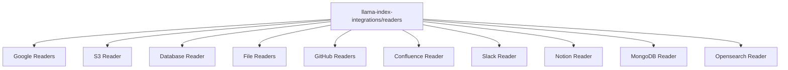

**Diagram sources**
- [readers/README.md](file://llama-index-integrations/readers/README.md#L1-L21)

**Section sources**
- [README.md](file://llama-index-integrations/README.md#L1-L5)
- [readers/README.md](file://llama-index-integrations/readers/README.md#L1-L21)

## Core Components
- Reader packages are published separately and installed individually via pip. Each package exposes one or more reader classes that implement LlamaIndex’s BaseReader interface.
- Readers support common patterns:
  - Standard synchronous loading via load_data
  - Streaming lazy loading via lazy_load_data
  - Asynchronous loading via aload_data
  - Metadata customization and filtering
  - Authentication and credential configuration
- Many readers integrate with LlamaIndex instrumentation to emit events during processing, enabling observability and monitoring.

Examples of commonly used readers:
- Google: Google Drive, Google Docs, Google Sheets, Google Maps, Google Chat
- Cloud storage: S3
- Databases: SQL databases via DatabaseReader
- Files: PDF, DOCX, CSV, HTML, images, notebooks, and more
- Enterprise collaboration: GitHub (repo, issues, collaborators), Confluence
- Messaging: Slack
- Content management: Notion
- NoSQL: MongoDB
- Search: Opensearch

**Section sources**
- [readers/README.md](file://llama-index-integrations/readers/README.md#L1-L21)
- [llama-index-readers-google/README.md](file://llama-index-integrations/readers/llama-index-readers-google/README.md#L1-L130)
- [llama-index-readers-s3/README.md](file://llama-index-integrations/readers/llama-index-readers-s3/README.md#L1-L30)
- [llama-index-readers-database/README.md](file://llama-index-integrations/readers/llama-index-readers-database/README.md#L1-L89)
- [llama-index-readers-file/README.md](file://llama-index-integrations/readers/llama-index-readers-file/README.md#L1-L201)
- [llama-index-readers-github/README.md](file://llama-index-integrations/readers/llama-index-readers-github/README.md#L1-L437)
- [llama-index-readers-confluence/README.md](file://llama-index-integrations/readers/llama-index-readers-confluence/README.md#L1-L428)
- [llama-index-readers-slack/README.md](file://llama-index-integrations/readers/llama-index-readers-slack/README.md#L1-L40)
- [llama-index-readers-notion/README.md](file://llama-index-integrations/readers/llama-index-readers-notion/README.md#L1-L35)
- [llama-index-readers-mongodb/README.md](file://llama-index-integrations/readers/llama-index-readers-mongodb/README.md#L1-L46)
- [llama-index-readers-opensearch/README.md](file://llama-index-integrations/readers/llama-index-readers-opensearch/README.md#L1-L31)

## Architecture Overview
The integration readers follow a consistent pattern:
- Each reader package installs a module under llama_index.readers.<service>.
- Reader classes expose load_data, lazy_load_data, and/or aload_data methods.
- Authentication is configured via constructor arguments, environment variables, or service-specific mechanisms.
- Some readers support advanced features such as custom parsers, callbacks, metadata mapping, and instrumentation events.

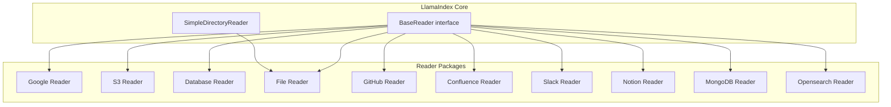

**Diagram sources**
- [readers/README.md](file://llama-index-integrations/readers/README.md#L1-L21)
- [llama-index-readers-file/README.md](file://llama-index-integrations/readers/llama-index-readers-file/README.md#L1-L201)

## Detailed Component Analysis

### Google Readers
- Capabilities: Google Drive, Google Docs, Google Sheets, Google Maps, Google Chat, Gmail, Google Keep, Google Calendar, Google Maps.
- Installation: pip install llama-index-readers-google
- Authentication: Requires credentials.json from Google Cloud; OAuth consent screen setup; optional service account key for server environments.
- Usage patterns:
  - Initialize a specific reader (e.g., GoogleDriveReader) with credentials and optional filters.
  - Load data via load_data and optionally list resources, get resource info, or read file content directly.
  - Google Maps text search reader supports free-text queries and returns documents suitable for downstream indexing and querying.

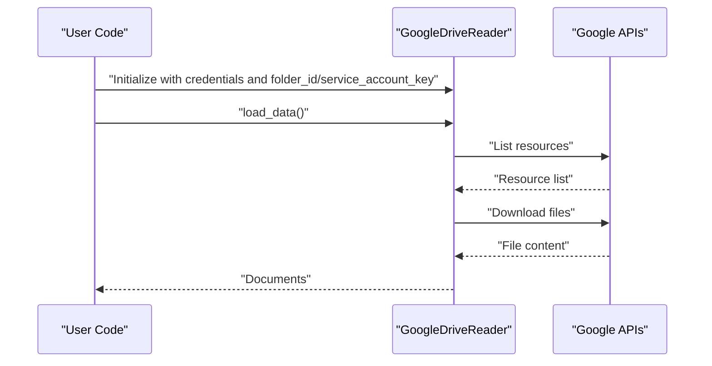

**Diagram sources**
- [llama-index-readers-google/README.md](file://llama-index-integrations/readers/llama-index-readers-google/README.md#L37-L68)

**Section sources**
- [llama-index-readers-google/README.md](file://llama-index-integrations/readers/llama-index-readers-google/README.md#L1-L130)

### S3 Reader
- Purpose: Parse files stored on Amazon S3 or entire buckets (with optional prefix filtering).
- Installation: pip install llama-index-readers-s3
- Authentication: AWS credentials can be provided during initialization or resolved from ~/.aws/credentials.
- Usage patterns:
  - Initialize S3Reader with bucket and optional key/prefix.
  - Optionally supply a custom file extractor to leverage other readers in this library.
  - Load documents synchronously.

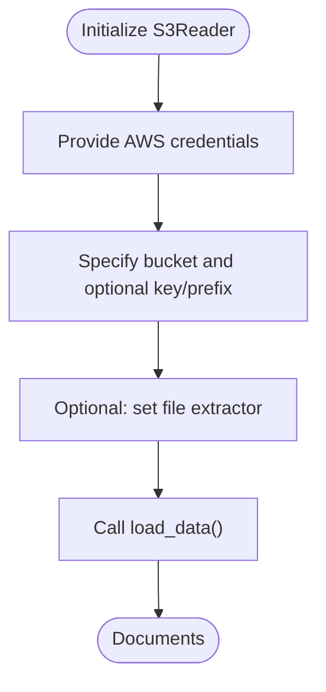

**Diagram sources**
- [llama-index-readers-s3/README.md](file://llama-index-integrations/readers/llama-index-readers-s3/README.md#L1-L30)

**Section sources**
- [llama-index-readers-s3/README.md](file://llama-index-integrations/readers/llama-index-readers-s3/README.md#L1-L30)

### Database Reader
- Purpose: Query and load data from SQL databases using SQLAlchemy or raw connection URIs.
- Installation: pip install llama-index-readers-database
- Features:
  - Accepts SQLDatabase, Engine, URI, or discrete credentials
  - Optional schema selection
  - Column-level metadata mapping and text exclusion
  - Custom document ID generation
  - Streaming (lazy_load_data) and async (aload_data)
- Usage patterns:
  - Initialize with connection details (URI preferred).
  - Run queries to load filtered tables/rows.
  - Stream large datasets or use async variants for concurrent loads.
  - Customize metadata and document IDs for downstream retrieval.

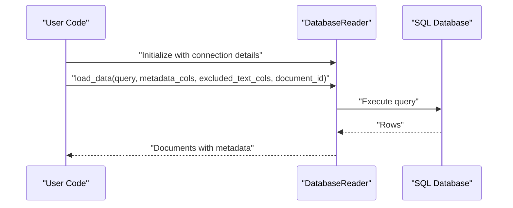

**Diagram sources**
- [llama-index-readers-database/README.md](file://llama-index-integrations/readers/llama-index-readers-database/README.md#L25-L85)

**Section sources**
- [llama-index-readers-database/README.md](file://llama-index-integrations/readers/llama-index-readers-database/README.md#L1-L89)

### File Readers
- Purpose: Default integration for SimpleDirectoryReader supporting many file formats.
- Installation: pip install llama-index-readers-file
- Supported loaders include PDF, DOCX, EPUB, HTML, images, notebooks, markdown, mbox, PPTX, CSV variants, RTF, XML, and more.
- Usage patterns:
  - Import specific loaders and register them with SimpleDirectoryReader via file_extractor.
  - Configure advanced options per loader (e.g., PPTX image extraction, CSV parsing modes).

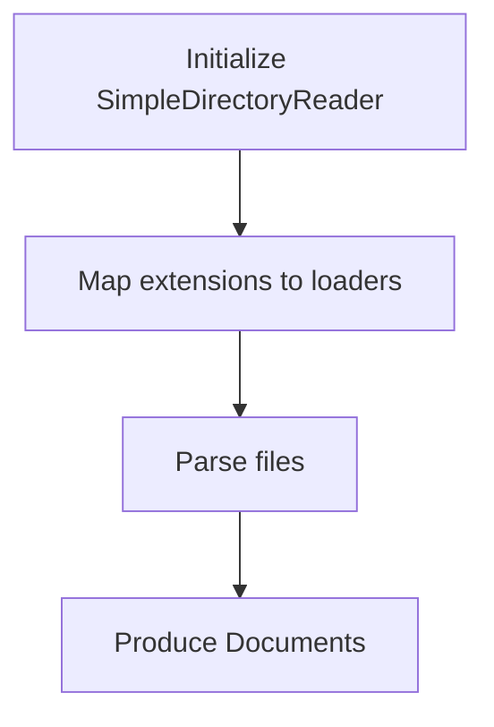

**Diagram sources**
- [llama-index-readers-file/README.md](file://llama-index-integrations/readers/llama-index-readers-file/README.md#L44-L198)

**Section sources**
- [llama-index-readers-file/README.md](file://llama-index-integrations/readers/llama-index-readers-file/README.md#L1-L201)

### GitHub Readers
- Purpose: Read repositories, issues, and collaborators from GitHub with flexible authentication.
- Installation:
  - Basic: pip install llama-index-readers-github
  - GitHub App support: pip install llama-index-readers-github[github-app]
- Authentication:
  - Personal Access Token (PAT) via constructor or environment variable
  - GitHub App authentication with automatic token refresh
- Usage patterns:
  - Repository Reader: filter directories, extensions, paths, and apply custom processing callbacks.
  - Issues Reader: load issues with state and label filters.
  - Collaborators Reader: fetch collaborator information.
  - Event system integration for observability.

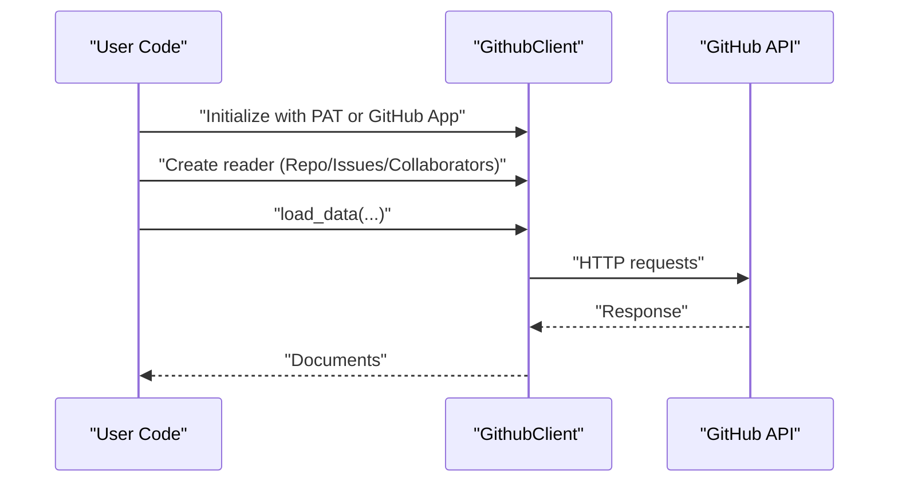

**Diagram sources**
- [llama-index-readers-github/README.md](file://llama-index-integrations/readers/llama-index-readers-github/README.md#L19-L52)

**Section sources**
- [llama-index-readers-github/README.md](file://llama-index-integrations/readers/llama-index-readers-github/README.md#L1-L437)

### Confluence Reader
- Purpose: Load pages from Atlassian Confluence cloud instances.
- Installation: pip install llama-index-readers-confluence
- Authentication:
  - OAuth 2.0 dictionary
  - API token or cookies
  - Username/password
  - Environment variables CONFLUENCE_API_TOKEN, CONFLUENCE_USERNAME, CONFLUENCE_PASSWORD
- Usage patterns:
  - Load by page IDs, space key, label, or CQL query.
  - Control pagination with start or cursor.
  - Include attachments and customize parsers for specific file types.
  - Apply processing callbacks and manage logs.

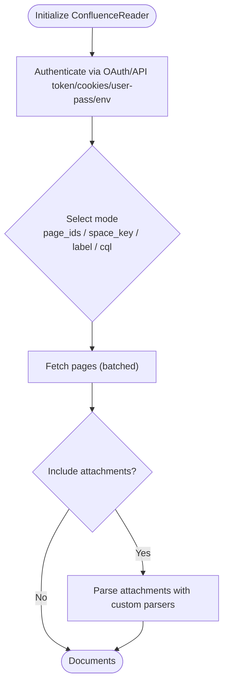

**Diagram sources**
- [llama-index-readers-confluence/README.md](file://llama-index-integrations/readers/llama-index-readers-confluence/README.md#L162-L283)

**Section sources**
- [llama-index-readers-confluence/README.md](file://llama-index-integrations/readers/llama-index-readers-confluence/README.md#L1-L428)

### Slack Reader
- Purpose: Read conversations from Slack channels within a specified time window.
- Installation: pip install llama-index-readers-slack
- Usage patterns:
  - Initialize with a Slack API token and optional date range.
  - Load data from one or more channel IDs.

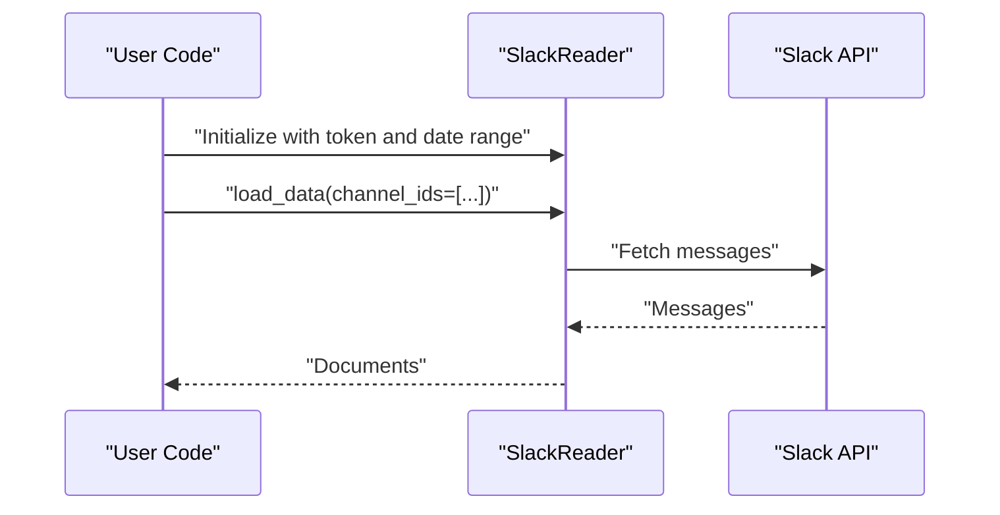

**Diagram sources**
- [llama-index-readers-slack/README.md](file://llama-index-integrations/readers/llama-index-readers-slack/README.md#L19-L35)

**Section sources**
- [llama-index-readers-slack/README.md](file://llama-index-integrations/readers/llama-index-readers-slack/README.md#L1-L40)

### Notion Reader
- Purpose: Load data from Notion pages or databases.
- Installation: pip install llama-index-readers-notion
- Usage patterns:
  - Initialize with an integration token.
  - Load data from page IDs or a database ID.

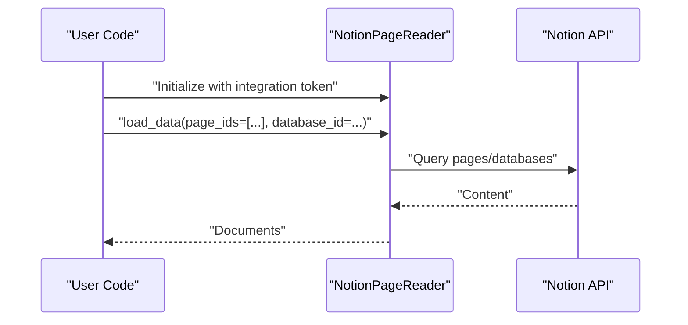

**Diagram sources**
- [llama-index-readers-notion/README.md](file://llama-index-integrations/readers/llama-index-readers-notion/README.md#L17-L28)

**Section sources**
- [llama-index-readers-notion/README.md](file://llama-index-integrations/readers/llama-index-readers-notion/README.md#L1-L35)

### MongoDB Reader
- Purpose: Load data from MongoDB collections by concatenating specified fields.
- Installation: pip install llama-index-readers-mongodb
- Usage patterns:
  - Initialize with host/port or URI.
  - Lazy-load data with optional query, field names, separator, and metadata names.

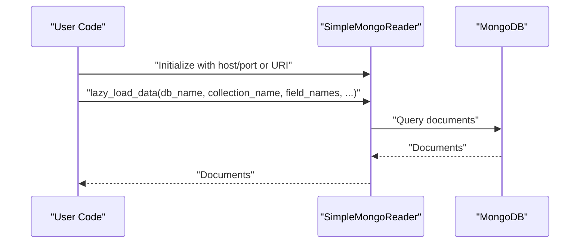

**Diagram sources**
- [llama-index-readers-mongodb/README.md](file://llama-index-integrations/readers/llama-index-readers-mongodb/README.md#L17-L39)

**Section sources**
- [llama-index-readers-mongodb/README.md](file://llama-index-integrations/readers/llama-index-readers-mongodb/README.md#L1-L46)

### Opensearch Reader
- Purpose: Retrieve documents from an Opensearch index and convert them to LlamaIndex Documents.
- Installation: pip install llama-index-readers-opensearch
- Usage patterns:
  - Initialize with host, port, index, and optional basic_auth.
  - Provide a field and optional JSON query DSL to fetch desired fields.

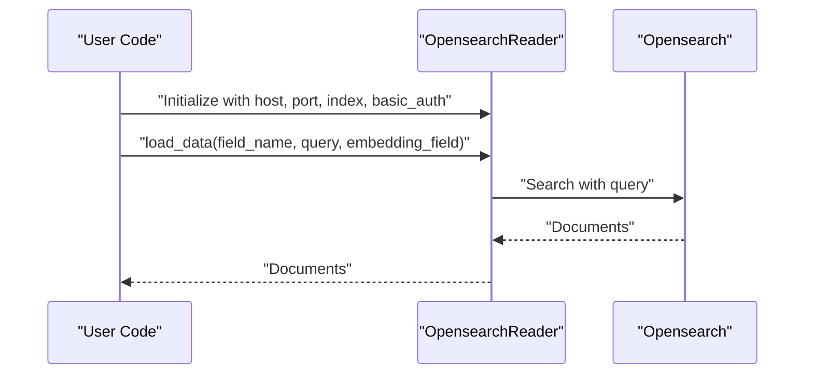

**Diagram sources**
- [llama-index-readers-opensearch/README.md](file://llama-index-integrations/readers/llama-index-readers-opensearch/README.md#L14-L28)

**Section sources**
- [llama-index-readers-opensearch/README.md](file://llama-index-integrations/readers/llama-index-readers-opensearch/README.md#L1-L31)

## Dependency Analysis
- Reader packages are independent distributions. Each declares its own dependencies and versions.
- Core LlamaIndex provides the BaseReader interface and orchestration utilities (e.g., SimpleDirectoryReader) that many readers integrate with.
- Authentication libraries vary by provider (e.g., Google OAuth, GitHub App JWT, Confluence OAuth, Slack Bot Token, Notion Integration Token, MongoDB URI, Opensearch basic_auth).
- Some readers offer optional extras (e.g., GitHub App support) that require installing additional dependencies.

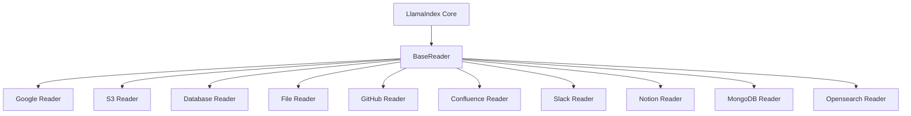

**Diagram sources**
- [readers/README.md](file://llama-index-integrations/readers/README.md#L1-L21)

**Section sources**
- [readers/README.md](file://llama-index-integrations/readers/README.md#L1-L21)

## Performance Considerations
- Streaming and async loading:
  - Use lazy_load_data for large datasets to reduce memory pressure.
  - Use aload_data for concurrent loads when supported by the reader.
- Metadata and filtering:
  - Limit fields and rows via query filters to reduce payload sizes.
  - Exclude large text columns from Document.text_resource when appropriate.
- Local processing:
  - For file-based readers, consider local caching and temporary directories for attachments when using custom parsers.
- Network and rate limits:
  - Respect provider rate limits (e.g., GitHub App vs PAT).
  - Use batching and cursors for paginated results (e.g., Confluence).

[No sources needed since this section provides general guidance]

## Troubleshooting Guide
Common issues and resolutions:
- Authentication failures
  - Google: Ensure credentials.json is correct and OAuth consent screen is configured; verify authorized redirect URIs.
  - GitHub: Confirm PAT validity or GitHub App installation; ensure private key and installation ID match.
  - Confluence: Verify OAuth tokens, API tokens, or cookie/session credentials; check environment variables.
  - Slack: Validate bot token scopes and dates.
  - Notion: Confirm integration token and page/database IDs.
  - MongoDB: Verify host/port or URI connectivity and credentials.
  - Opensearch: Confirm host, port, index existence, and basic_auth credentials.
- Rate limiting and quotas
  - Prefer GitHub App authentication for higher limits.
  - Implement retries and backoff for API-heavy operations.
- Large payloads and timeouts
  - Use streaming/lazy loading and paginate results.
  - Reduce included attachments or text fields.
- Missing optional extras
  - For GitHub App support, install the extra package as indicated in the GitHub reader documentation.
- Environment variables
  - Ensure required environment variables are exported before importing readers that rely on them.

**Section sources**
- [llama-index-readers-google/README.md](file://llama-index-integrations/readers/llama-index-readers-google/README.md#L21-L33)
- [llama-index-readers-github/README.md](file://llama-index-integrations/readers/llama-index-readers-github/README.md#L11-L67)
- [llama-index-readers-confluence/README.md](file://llama-index-integrations/readers/llama-index-readers-confluence/README.md#L10-L30)
- [llama-index-readers-slack/README.md](file://llama-index-integrations/readers/llama-index-readers-slack/README.md#L17-L35)
- [llama-index-readers-notion/README.md](file://llama-index-integrations/readers/llama-index-readers-notion/README.md#L15-L28)
- [llama-index-readers-mongodb/README.md](file://llama-index-integrations/readers/llama-index-readers-mongodb/README.md#L15-L39)
- [llama-index-readers-opensearch/README.md](file://llama-index-integrations/readers/llama-index-readers-opensearch/README.md#L10-L28)

## Conclusion
LlamaIndex integrations provide a broad ecosystem of reader packages to ingest data from numerous sources. By selecting the appropriate reader, configuring authentication correctly, and leveraging streaming and metadata controls, you can build scalable ingestion pipelines tailored to your data landscape. For production deployments, pay close attention to rate limits, dependency extras, and observability via instrumentation events.