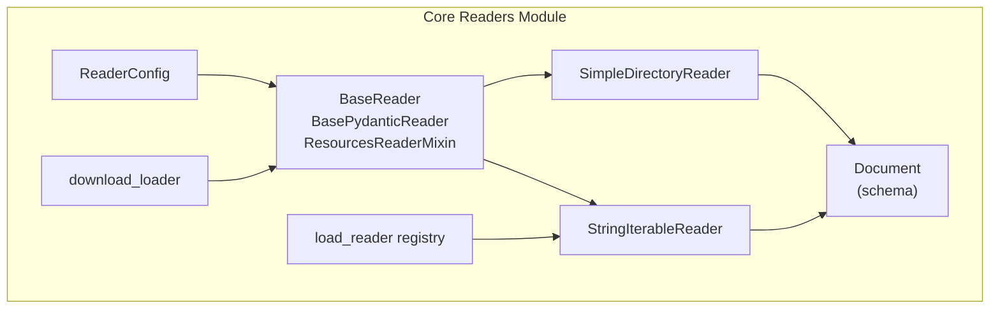
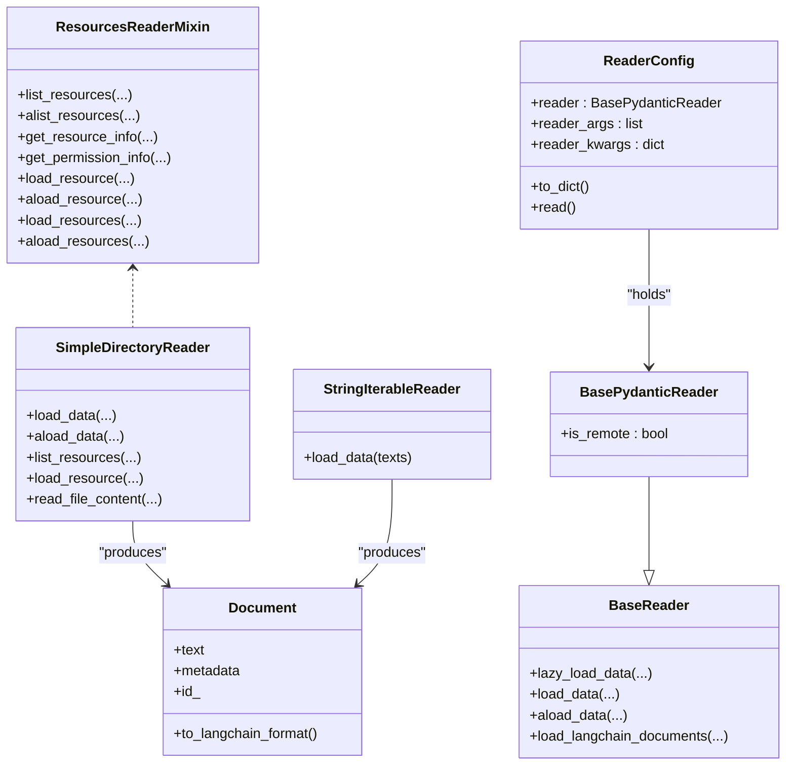
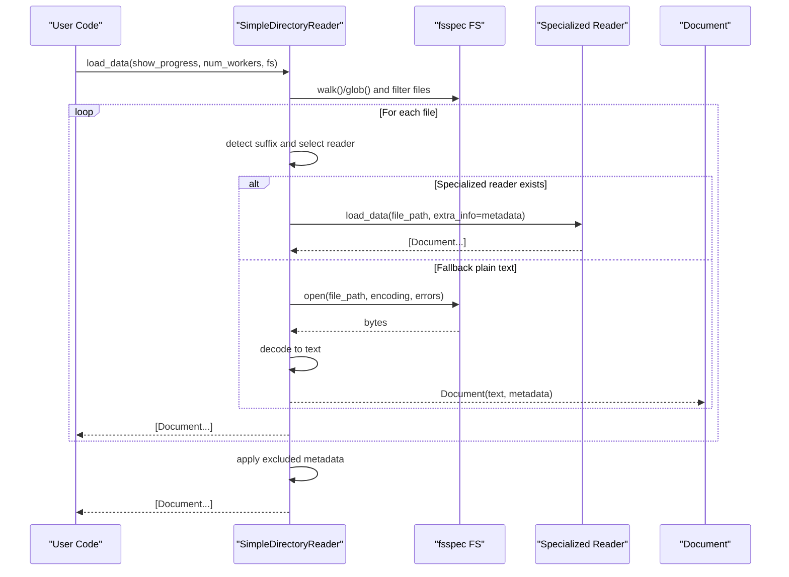
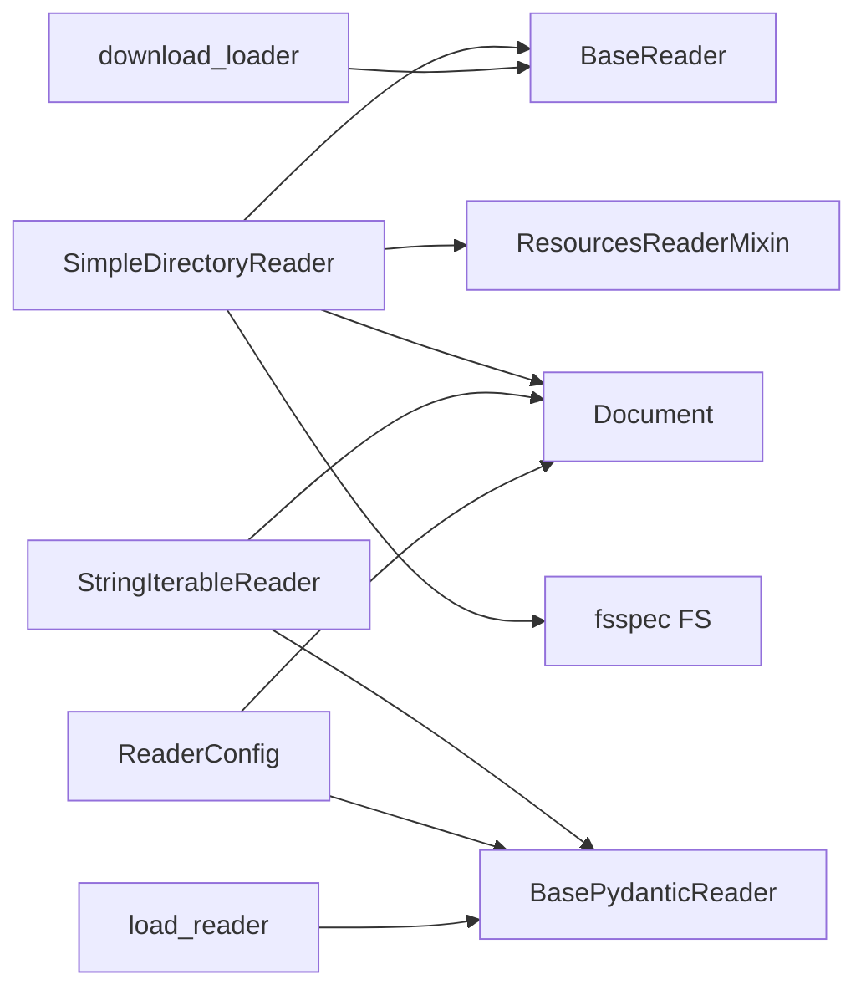

# Reader System

<cite>
**Referenced Files in This Document**
- [base.py](file://llama-index-core/llama_index/core/readers/base.py)
- [__init__.py](file://llama-index-core/llama_index/core/readers/__init__.py)
- [loading.py](file://llama-index-core/llama_index/core/readers/loading.py)
- [download.py](file://llama-index-core/llama_index/core/readers/download.py)
- [base.py](file://llama-index-core/llama_index/core/readers/file/base.py)
- [string_iterable.py](file://llama-index-core/llama_index/core/readers/string_iterable.py)
- [schema.py](file://llama-index-core/llama_index/core/schema.py)
</cite>

## Table of Contents
1. [Introduction](#introduction)
2. [Project Structure](#project-structure)
3. [Core Components](#core-components)
4. [Architecture Overview](#architecture-overview)
5. [Detailed Component Analysis](#detailed-component-analysis)
6. [Dependency Analysis](#dependency-analysis)
7. [Performance Considerations](#performance-considerations)
8. [Troubleshooting Guide](#troubleshooting-guide)
9. [Conclusion](#conclusion)
10. [Appendices](#appendices)

## Introduction
This document explains the LlamaIndex Reader System with a focus on the BaseReader interface, ReaderConfig, and the Document schema. It covers built-in readers including SimpleDirectoryReader for file systems, StringIterableReader for text streams, and the historical download functionality for external readers. Practical guidance is provided for selecting readers, configuring parameters, handling various data formats, and optimizing performance.

## Project Structure
The Reader System resides primarily under the readers module in the core package. Key areas:
- Base interfaces and configuration: BaseReader, BasePydanticReader, ResourcesReaderMixin, ReaderConfig
- Built-in readers: SimpleDirectoryReader (file system), StringIterableReader (text streams)
- Loading and discovery: load_reader registry and download utilities
- Document schema: Document and related node types

**Diagram sources**
- [base.py](file://llama-index-core/llama_index/core/readers/base.py#L19-L250)
- [loading.py](file://llama-index-core/llama_index/core/readers/loading.py#L1-L27)
- [download.py](file://llama-index-core/llama_index/core/readers/download.py#L1-L81)
- [base.py](file://llama-index-core/llama_index/core/readers/file/base.py#L208-L800)
- [string_iterable.py](file://llama-index-core/llama_index/core/readers/string_iterable.py#L9-L44)
- [schema.py](file://llama-index-core/llama_index/core/schema.py#L1012-L1222)

**Section sources**
- [__init__.py](file://llama-index-core/llama_index/core/readers/__init__.py#L1-L33)

## Core Components
- BaseReader: Defines synchronous and asynchronous loading APIs, plus LangChain interoperability helpers.
- BasePydanticReader: Extends BaseReader with Pydantic serialization and a flag for remote data sources.
- ResourcesReaderMixin: Adds resource listing and loading capabilities for readers that target named resources.
- ReaderConfig: Encapsulates a reader instance and its arguments for serialization/deserialization and execution.
- Document: The primary data structure produced by readers, backed by a flexible node hierarchy.

Key responsibilities:
- BaseReader: Standardized contract for loading data into Document objects, with optional lazy streaming and async variants.
- BasePydanticReader: Serializable reader with optional remote flag.
- ResourcesReaderMixin: Enables resource-aware readers to list and load specific resources.
- ReaderConfig: Provides a uniform way to persist and execute readers with their parameters.
- Document: Carries text content, metadata, and optional multimodal resources; supports conversions to external formats.

**Section sources**
- [base.py](file://llama-index-core/llama_index/core/readers/base.py#L19-L250)
- [schema.py](file://llama-index-core/llama_index/core/schema.py#L1012-L1222)

## Architecture Overview
The Reader System follows a layered design:
- Reader interfaces define the contract for loading data.
- Built-in readers implement the contract for specific sources (file system, text streams).
- ReaderConfig centralizes reader instantiation and invocation.
- Document is the output schema used across the system.

**Diagram sources**
- [base.py](file://llama-index-core/llama_index/core/readers/base.py#L19-L250)
- [base.py](file://llama-index-core/llama_index/core/readers/file/base.py#L208-L800)
- [string_iterable.py](file://llama-index-core/llama_index/core/readers/string_iterable.py#L9-L44)
- [schema.py](file://llama-index-core/llama_index/core/schema.py#L1012-L1222)

## Detailed Component Analysis

### BaseReader and ReaderConfig
- BaseReader provides:
  - Synchronous: load_data and lazy_load_data
  - Asynchronous: aload_data and alazy_load_data
  - LangChain interop via load_langchain_documents
- BasePydanticReader adds Pydantic serialization support and an is_remote flag.
- ReaderConfig encapsulates a reader instance, positional args, and keyword args, and exposes read() to execute the reader and produce Documents.

Usage pattern:
- Instantiate a reader (e.g., SimpleDirectoryReader or StringIterableReader).
- Wrap it in ReaderConfig with desired arguments.
- Call read() to obtain a list of Documents.

**Section sources**
- [base.py](file://llama-index-core/llama_index/core/readers/base.py#L19-L250)
- [base.py](file://llama-index-core/llama_index/core/readers/base.py#L223-L250)

### SimpleDirectoryReader (File System)
Purpose:
- Recursively or non-recursively scan directories or accept explicit file lists.
- Detect file types by suffix and route to appropriate specialized readers (when available) or fall back to plain text reading.
- Support fsspec-compatible filesystems (local, S3, etc.) and customizable metadata extraction.

Key parameters:
- input_dir or input_files
- exclude, exclude_hidden, exclude_empty
- encoding, errors
- recursive
- filename_as_id
- required_exts
- file_extractor (mapping of suffix to reader)
- num_files_limit
- file_metadata (callable to build metadata per file)
- raise_on_error
- fs (fsspec filesystem)

Parallel loading:
- Uses multiprocessing with a configurable number of workers.
- Supports async loading via aload_data.

Resource-awareness:
- Implements ResourcesReaderMixin to list files and load specific resources.

**Diagram sources**
- [base.py](file://llama-index-core/llama_index/core/readers/file/base.py#L208-L800)

Practical examples (conceptual):
- Load a directory with CSV and PDF files, limiting to 100 files and excluding hidden files.
- Load specific files from an S3 bucket using a custom fsspec filesystem.
- Provide a custom file_metadata function to enrich Documents with creation/modification timestamps.

Reader selection criteria:
- Prefer specialized readers for known suffixes (.pdf, .docx, .csv, etc.) when the optional file reader packages are installed.
- Fall back to plain text reading for unknown suffixes.
- Use file_extractor to override or extend the default mapping.

Performance considerations:
- Use num_workers > 1 to parallelize file loading; capped by CPU count.
- Limit num_files_limit to control throughput.
- Choose encoding and errors appropriately to avoid decoding overhead or failures.

Best practices:
- Provide a file_metadata callable to include useful metadata (e.g., file size, dates).
- Use filename_as_id to derive deterministic document IDs from filenames.
- Configure required_exts to restrict to supported formats.

**Section sources**
- [base.py](file://llama-index-core/llama_index/core/readers/file/base.py#L208-L800)

### StringIterableReader (Text Streams)
Purpose:
- Convert an iterable of strings into a list of Documents.

Behavior:
- Iterates over provided texts and creates a Document for each string.
- No file system or external dependencies.

Usage pattern:
- Pass a list of strings to load_data.
- Use in scenarios where text is already available in memory (e.g., from another source or preprocessed).

**Section sources**
- [string_iterable.py](file://llama-index-core/llama_index/core/readers/string_iterable.py#L9-L44)

### Reader Loading and Discovery
- load_reader: Deserializes a reader from a dictionary using a registry of supported readers. Currently registers StringIterableReader.
- download_loader: Deprecated mechanism to fetch loaders from a hub and install them; users should instead install specific reader packages directly.

Notes:
- The registry is minimal by default and can be extended by registering additional readers.
- download_loader emits a deprecation warning and suggests installing packages directly.

**Section sources**
- [loading.py](file://llama-index-core/llama_index/core/readers/loading.py#L1-L27)
- [download.py](file://llama-index-core/llama_index/core/readers/download.py#L1-L81)

### Document Schema
Document is the core output type:
- Backed by a node hierarchy (Node, TextNode, etc.) with text_resource and metadata.
- Supports conversion to external formats (LangChain, Haystack, etc.).
- Provides helpers to manage metadata exposure for embedding vs. LLM consumption.

Highlights:
- text property for backward compatibility.
- metadata and excluded_embed_metadata_keys/excluded_llm_metadata_keys to control metadata inclusion.
- to_langchain_format and from_langchain_format for interoperability.

**Section sources**
- [schema.py](file://llama-index-core/llama_index/core/schema.py#L1012-L1222)

## Dependency Analysis
- SimpleDirectoryReader depends on:
  - BaseReader and ResourcesReaderMixin
  - fsspec for filesystem abstraction
  - Optional specialized readers (PDF, DOCX, CSV, etc.) when installed
  - Document for output
- StringIterableReader depends on BasePydanticReader and Document.
- ReaderConfig depends on BasePydanticReader and BaseComponent serialization.
- load_reader depends on BasePydanticReader and a registry mapping class names to reader types.

**Diagram sources**
- [base.py](file://llama-index-core/llama_index/core/readers/base.py#L19-L250)
- [base.py](file://llama-index-core/llama_index/core/readers/file/base.py#L208-L800)
- [string_iterable.py](file://llama-index-core/llama_index/core/readers/string_iterable.py#L9-L44)
- [loading.py](file://llama-index-core/llama_index/core/readers/loading.py#L1-L27)
- [download.py](file://llama-index-core/llama_index/core/readers/download.py#L1-L81)

**Section sources**
- [base.py](file://llama-index-core/llama_index/core/readers/base.py#L19-L250)
- [base.py](file://llama-index-core/llama_index/core/readers/file/base.py#L208-L800)
- [string_iterable.py](file://llama-index-core/llama_index/core/readers/string_iterable.py#L9-L44)
- [loading.py](file://llama-index-core/llama_index/core/readers/loading.py#L1-L27)
- [download.py](file://llama-index-core/llama_index/core/readers/download.py#L1-L81)

## Performance Considerations
- Parallelism: SimpleDirectoryReader supports multiprocessing-based parallel loading. Tune num_workers to match CPU capacity.
- File limits: Use num_files_limit to cap the number of files processed.
- Encoding and errors: Choose appropriate encoding and error handling to minimize reprocessing or failures.
- Metadata: Provide lightweight metadata via file_metadata to reduce downstream processing overhead.
- Specialized readers: Prefer specialized readers for binary formats to avoid unnecessary parsing costs.

[No sources needed since this section provides general guidance]

## Troubleshooting Guide
Common issues and resolutions:
- ImportError when specialized readers are not installed:
  - Symptom: ImportError during file loading.
  - Resolution: Install the corresponding reader package (e.g., file reader package) or rely on fallback plain text reading.
- Empty directory or no files found:
  - Symptom: ValueError indicating no files found.
  - Resolution: Verify input_dir/input_files, required_exts, and exclude patterns.
- Encoding errors:
  - Symptom: Decoding exceptions.
  - Resolution: Adjust encoding and errors parameters; ensure files are readable with the chosen encoding.
- Performance bottlenecks:
  - Symptom: Slow loading on large directories.
  - Resolution: Increase num_workers cautiously, limit files with num_files_limit, and restrict to required_exts.

**Section sources**
- [base.py](file://llama-index-core/llama_index/core/readers/file/base.py#L208-L800)

## Conclusion
The LlamaIndex Reader System offers a consistent interface for loading data from diverse sources into a unified Document schema. SimpleDirectoryReader handles file system ingestion with rich configuration and parallelization, while StringIterableReader provides a straightforward path for text streams. ReaderConfig enables serialization and execution of readers, and the Document schema supports downstream integrations. By selecting the right reader, tuning parameters, and leveraging parallelism, you can efficiently ingest and process large volumes of heterogeneous data.

[No sources needed since this section summarizes without analyzing specific files]

## Appendices

### Practical Usage Patterns
- Using SimpleDirectoryReader:
  - Load a folder recursively, limit to specific extensions, and include file metadata.
  - Load specific files from an S3 bucket using a custom fsspec filesystem.
- Using StringIterableReader:
  - Convert a list of strings into Documents for quick ingestion.
- Using ReaderConfig:
  - Persist a reader with arguments and execute read() to obtain Documents.

[No sources needed since this section provides general guidance]