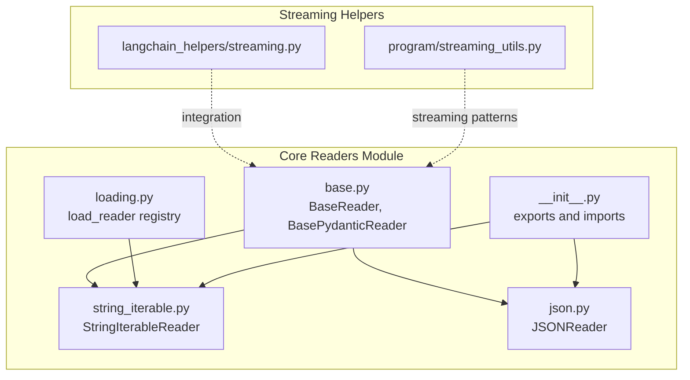
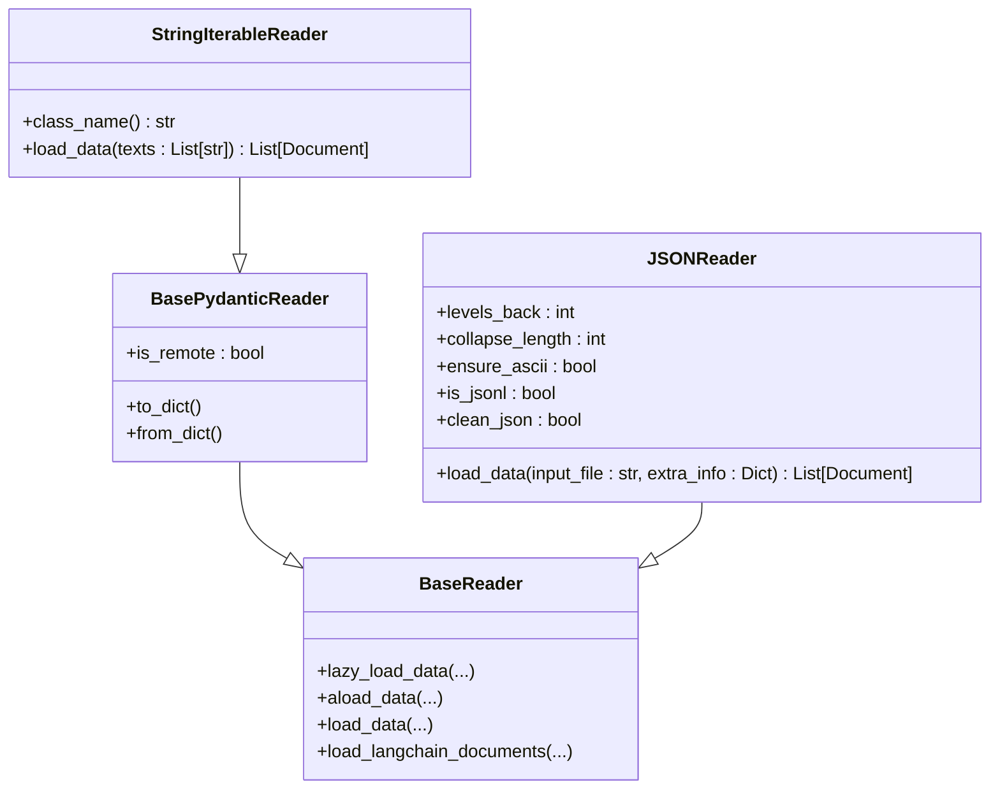
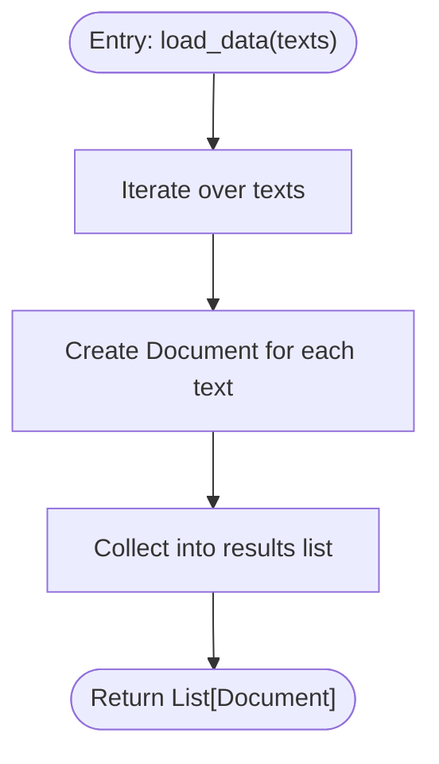
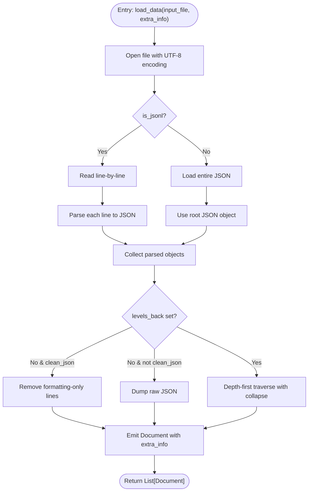
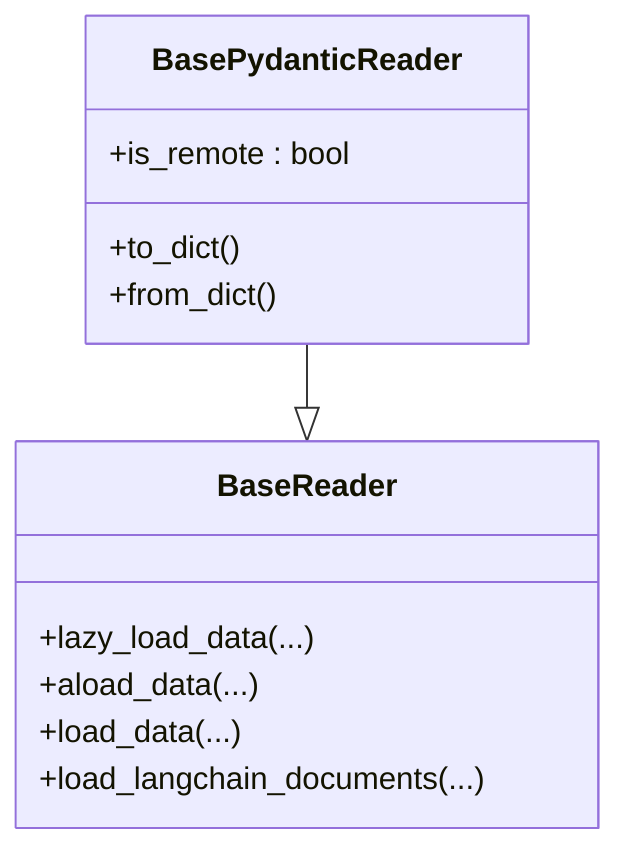
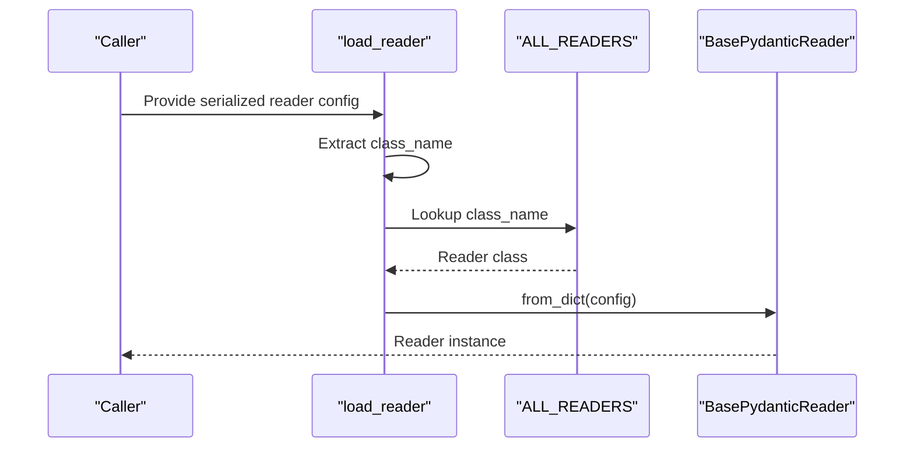
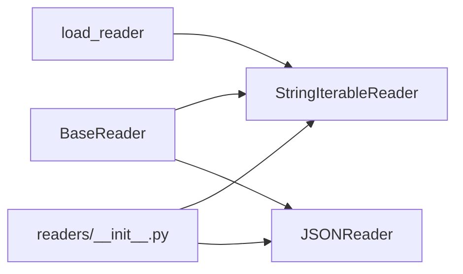

# Stream Readers

<cite>
**Referenced Files in This Document**
- [string_iterable.py](file://llama-index-core/llama_index/core/readers/string_iterable.py)
- [json.py](file://llama-index-core/llama_index/core/readers/json.py)
- [base.py](file://llama-index-core/llama_index/core/readers/base.py)
- [loading.py](file://llama-index-core/llama_index/core/readers/loading.py)
- [__init__.py](file://llama-index-core/llama_index/core/readers/__init__.py)
- [test_string_iterable.py](file://llama-index-core/tests/readers/test_string_iterable.py)
- [streaming.py](file://llama-index-core/llama_index/core/langchain_helpers/streaming.py)
- [streaming_utils.py](file://llama-index-core/llama_index/core/program/streaming_utils.py)
</cite>

## Table of Contents
1. [Introduction](#introduction)
2. [Project Structure](#project-structure)
3. [Core Components](#core-components)
4. [Architecture Overview](#architecture-overview)
5. [Detailed Component Analysis](#detailed-component-analysis)
6. [Dependency Analysis](#dependency-analysis)
7. [Performance Considerations](#performance-considerations)
8. [Troubleshooting Guide](#troubleshooting-guide)
9. [Conclusion](#conclusion)

## Introduction
This document explains Stream Readers in LlamaIndex with a focus on:
- StringIterableReader for processing text streams and iterable data sources
- JSONReader for parsing JSON data from files and streams
- Stream processing patterns, memory-efficient data handling, and real-time ingestion
- Practical examples for reading from network streams, processing large datasets incrementally, and handling streaming data formats
- Error handling strategies for malformed streams, encoding issues, and data validation

It synthesizes the core reader abstractions, concrete implementations, and supporting utilities to help both newcomers and experienced users build robust ingestion pipelines.

## Project Structure
The Stream Readers functionality lives primarily under the core readers module and integrates with base reader abstractions and loading utilities. The key files are:
- StringIterableReader implementation
- JSONReader implementation
- BaseReader and BasePydanticReader abstractions
- Reader loading registry and initialization
- Streaming helpers for LangChain and program-level streaming utilities

**Diagram sources**
- [base.py](file://llama-index-core/llama_index/core/readers/base.py#L1-L250)
- [string_iterable.py](file://llama-index-core/llama_index/core/readers/string_iterable.py#L1-L44)
- [json.py](file://llama-index-core/llama_index/core/readers/json.py#L1-L155)
- [loading.py](file://llama-index-core/llama_index/core/readers/loading.py#L1-L27)
- [__init__.py](file://llama-index-core/llama_index/core/readers/__init__.py#L1-L33)
- [streaming.py](file://llama-index-core/llama_index/core/langchain_helpers/streaming.py)
- [streaming_utils.py](file://llama-index-core/llama_index/core/program/streaming_utils.py)

**Section sources**
- [base.py](file://llama-index-core/llama_index/core/readers/base.py#L1-L250)
- [string_iterable.py](file://llama-index-core/llama_index/core/readers/string_iterable.py#L1-L44)
- [json.py](file://llama-index-core/llama_index/core/readers/json.py#L1-L155)
- [loading.py](file://llama-index-core/llama_index/core/readers/loading.py#L1-L27)
- [__init__.py](file://llama-index-core/llama_index/core/readers/__init__.py#L1-L33)

## Core Components
- BaseReader: Defines synchronous and asynchronous loading APIs, plus convenience methods for LangChain interoperability.
- BasePydanticReader: Extends BaseReader with Pydantic serialization and a flag indicating whether data is remote.
- StringIterableReader: Converts an iterable of strings into a list of Documents.
- JSONReader: Loads and parses JSON/JSONL files, with configurable traversal and cleaning strategies.
- Reader loading registry: Provides a mechanism to instantiate readers from serialized configurations.

Key capabilities:
- Lazy loading via lazy_load_data and async variants
- Memory-aware processing through generators and streaming-friendly APIs
- Configurable JSON traversal and cleaning for structured ingestion
- Serialization support for reader configuration

**Section sources**
- [base.py](file://llama-index-core/llama_index/core/readers/base.py#L19-L47)
- [base.py](file://llama-index-core/llama_index/core/readers/base.py#L49-L56)
- [string_iterable.py](file://llama-index-core/llama_index/core/readers/string_iterable.py#L9-L44)
- [json.py](file://llama-index-core/llama_index/core/readers/json.py#L53-L96)
- [loading.py](file://llama-index-core/llama_index/core/readers/loading.py#L6-L27)

## Architecture Overview
The Stream Readers architecture centers on a shared BaseReader interface that standardizes loading behavior. Concrete readers implement load_data and optional lazy_load_data. JSONReader demonstrates advanced features like recursive traversal and JSONL support. StringIterableReader provides a minimal, memory-efficient path for in-memory text streams.

**Diagram sources**
- [base.py](file://llama-index-core/llama_index/core/readers/base.py#L19-L47)
- [base.py](file://llama-index-core/llama_index/core/readers/base.py#L49-L56)
- [string_iterable.py](file://llama-index-core/llama_index/core/readers/string_iterable.py#L9-L44)
- [json.py](file://llama-index-core/llama_index/core/readers/json.py#L53-L96)

## Detailed Component Analysis

### StringIterableReader
Purpose:
- Convert an iterable of strings into a list of Documents for downstream indexing and querying.

Processing logic:
- Iterates over the input texts and constructs a Document per string.
- Returns a list of Documents suitable for ingestion.

Memory characteristics:
- Linear in the number of input strings.
- Minimal overhead; efficient for moderate-sized in-memory streams.

Usage pattern:
- Accepts a List[str] and produces List[Document].
- Integrates with BasePydanticReader for serialization and configuration.

**Diagram sources**
- [string_iterable.py](file://llama-index-core/llama_index/core/readers/string_iterable.py#L37-L43)

**Section sources**
- [string_iterable.py](file://llama-index-core/llama_index/core/readers/string_iterable.py#L9-L44)
- [test_string_iterable.py](file://llama-index-core/tests/readers/test_string_iterable.py#L6-L11)

### JSONReader
Purpose:
- Parse JSON and JSONL files into Documents with flexible traversal and cleaning options.

Key parameters:
- levels_back: Controls hierarchical labeling by walking up the JSON tree N levels.
- collapse_length: Collapses small subtrees into single lines when total character count is under threshold.
- ensure_ascii: Ensures ASCII-only output when dumping JSON.
- is_jsonl: Treats input as JSON Lines (one JSON object per line).
- clean_json: Removes formatting-only lines when levels_back is not set.

Processing logic:
- Opens the input file with UTF-8 encoding.
- For JSONL: reads line-by-line, parsing each line into a JSON object.
- For JSON: loads the entire file into a single JSON object.
- Applies traversal and cleaning strategies depending on configuration.
- Emits a Document per parsed payload with optional metadata.

Error handling:
- Catches recursion errors during deep traversal and emits a warning, returning an empty list.

**Diagram sources**
- [json.py](file://llama-index-core/llama_index/core/readers/json.py#L97-L155)

**Section sources**
- [json.py](file://llama-index-core/llama_index/core/readers/json.py#L53-L96)
- [json.py](file://llama-index-core/llama_index/core/readers/json.py#L97-L155)

### BaseReader and BasePydanticReader
Purpose:
- Provide a unified interface for synchronous/asynchronous loading and LangChain interoperability.
- Enable serialization/deserialization of reader configurations.

Notable features:
- lazy_load_data and async variants for streaming-friendly iteration.
- load_data and aload_data wrappers that convert lazy iterators to lists.
- load_langchain_documents for compatibility with LangChain workflows.
- BasePydanticReader adds serialization support and an is_remote flag.

**Diagram sources**
- [base.py](file://llama-index-core/llama_index/core/readers/base.py#L19-L47)
- [base.py](file://llama-index-core/llama_index/core/readers/base.py#L49-L56)

**Section sources**
- [base.py](file://llama-index-core/llama_index/core/readers/base.py#L19-L47)
- [base.py](file://llama-index-core/llama_index/core/readers/base.py#L49-L56)

### Reader Loading Registry
Purpose:
- Instantiate readers from serialized configurations using a class-name-based registry.

Behavior:
- Validates presence of class_name.
- Supports deserialization via from_dict and ignores static attributes like is_remote.

**Diagram sources**
- [loading.py](file://llama-index-core/llama_index/core/readers/loading.py#L11-L27)

**Section sources**
- [loading.py](file://llama-index-core/llama_index/core/readers/loading.py#L6-L27)
- [__init__.py](file://llama-index-core/llama_index/core/readers/__init__.py#L22-L32)

## Dependency Analysis
- StringIterableReader depends on BasePydanticReader and Document.
- JSONReader depends on BaseReader, Document, and Python’s json module.
- Reader loading registry depends on BasePydanticReader and StringIterableReader.
- Exports in __init__.py expose StringIterableReader and related utilities.

**Diagram sources**
- [base.py](file://llama-index-core/llama_index/core/readers/base.py#L19-L47)
- [string_iterable.py](file://llama-index-core/llama_index/core/readers/string_iterable.py#L9-L44)
- [json.py](file://llama-index-core/llama_index/core/readers/json.py#L53-L96)
- [loading.py](file://llama-index-core/llama_index/core/readers/loading.py#L6-L8)
- [__init__.py](file://llama-index-core/llama_index/core/readers/__init__.py#L22-L32)

**Section sources**
- [base.py](file://llama-index-core/llama_index/core/readers/base.py#L19-L47)
- [string_iterable.py](file://llama-index-core/llama_index/core/readers/string_iterable.py#L9-L44)
- [json.py](file://llama-index-core/llama_index/core/readers/json.py#L53-L96)
- [loading.py](file://llama-index-core/llama_index/core/readers/loading.py#L6-L8)
- [__init__.py](file://llama-index-core/llama_index/core/readers/__init__.py#L22-L32)

## Performance Considerations
- Memory efficiency:
  - Prefer lazy loading patterns via lazy_load_data when available to process large streams incrementally.
  - JSONReader supports JSONL mode for line-by-line processing, reducing peak memory usage.
- Encoding:
  - JSONReader opens files with UTF-8 encoding; ensure upstream sources match to avoid decoding errors.
- Traversal cost:
  - Deep JSON structures with levels_back incur traversal overhead; tune collapse_length to balance granularity and memory.
- Async I/O:
  - BaseReader provides async wrappers; leverage them when integrating with async I/O stacks for non-blocking ingestion.

[No sources needed since this section provides general guidance]

## Troubleshooting Guide
Common issues and strategies:
- Malformed JSON:
  - Symptom: JSONDecodeError or unexpected EOF.
  - Strategy: Validate input format, enable is_jsonl for line-delimited streams, and handle partial lines gracefully upstream.
- Recursion errors:
  - Symptom: RecursionError during traversal.
  - Strategy: JSONReader catches and warns; reduce nesting or adjust levels_back and collapse_length.
- Encoding problems:
  - Symptom: UnicodeDecodeError.
  - Strategy: Ensure input files are UTF-8 encoded; JSONReader uses UTF-8 explicitly.
- Large payloads:
  - Symptom: High memory usage.
  - Strategy: Use JSONL mode, limit collapse_length, and process iteratively with lazy_load_data where applicable.
- Data validation:
  - Strategy: Add pre-processing checks for required fields and types; pass extra_info metadata to aid downstream validation.

**Section sources**
- [json.py](file://llama-index-core/llama_index/core/readers/json.py#L101-L108)
- [json.py](file://llama-index-core/llama_index/core/readers/json.py#L152-L155)

## Conclusion
LlamaIndex’s Stream Readers provide a cohesive, extensible foundation for ingesting text and structured data streams:
- StringIterableReader offers a lightweight, memory-efficient path for in-memory text streams.
- JSONReader delivers powerful traversal and cleaning options for structured ingestion, including JSONL support and configurable collapsing.
- BaseReader and BasePydanticReader unify loading patterns and enable serialization and async processing.
- With lazy loading, async wrappers, and robust error handling, these components support scalable, real-time ingestion pipelines.

[No sources needed since this section summarizes without analyzing specific files]