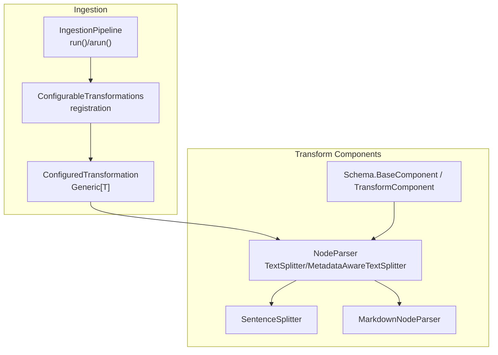
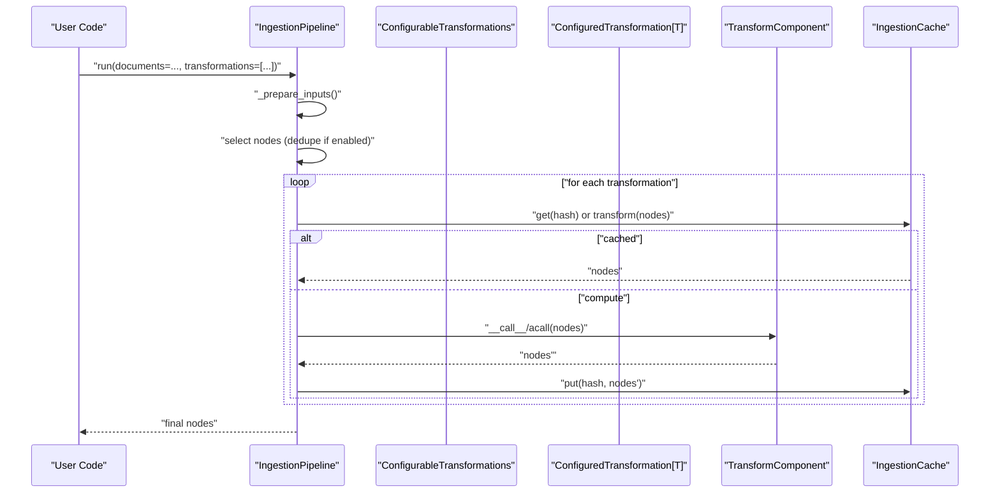
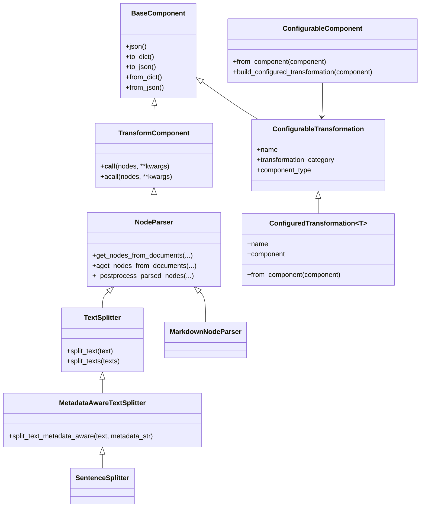

# Custom Transformations

<cite>
**Referenced Files in This Document**
- [transformations.py](file://llama-index-core/llama_index/core/ingestion/transformations.py)
- [pipeline.py](file://llama-index-core/llama_index/core/ingestion/pipeline.py)
- [interface.py](file://llama-index-core/llama_index/core/node_parser/interface.py)
- [sentence.py](file://llama-index-core/llama_index/core/node_parser/text/sentence.py)
- [markdown.py](file://llama-index-core/llama_index/core/node_parser/file/markdown.py)
- [schema.py](file://llama-index-core/llama_index/core/schema.py)
- [test_transformations.py](file://llama-index-core/tests/ingestion/test_transformations.py)
- [service_context.py](file://llama-index-core/llama_index/core/service_context.py)
- [__init__.py](file://llama-index-core/llama_index/core/node_parser/__init__.py)
</cite>

## Table of Contents
1. [Introduction](#introduction)
2. [Project Structure](#project-structure)
3. [Core Components](#core-components)
4. [Architecture Overview](#architecture-overview)
5. [Detailed Component Analysis](#detailed-component-analysis)
6. [Dependency Analysis](#dependency-analysis)
7. [Performance Considerations](#performance-considerations)
8. [Troubleshooting Guide](#troubleshooting-guide)
9. [Conclusion](#conclusion)
10. [Appendices](#appendices)

## Introduction
This document explains how to implement custom transformations in LlamaIndex, focusing on the transformation pipeline architecture, the ConfigurableTransformation and ConfiguredTransformation classes, and transformation registration patterns. It covers creating custom node parsers, embedding transformers, and metadata processors, along with implementation guidelines, type annotations, serialization requirements, and integration with the ingestion pipeline. Step-by-step examples, testing strategies, performance optimization techniques, transformation chaining, error handling, and debugging approaches are included to help you build robust, production-grade custom transformations.

## Project Structure
LlamaIndex organizes transformation-related functionality primarily under the ingestion and node parser modules:
- Ingestion pipeline orchestration and caching
- Transformation registration and configuration
- Node parser interfaces and built-in implementations
- Base component abstractions for serialization and type safety

**Diagram sources**
- [pipeline.py](file://llama-index-core/llama_index/core/ingestion/pipeline.py#L193-L358)
- [transformations.py](file://llama-index-core/llama_index/core/ingestion/transformations.py#L77-L116)
- [interface.py](file://llama-index-core/llama_index/core/node_parser/interface.py#L50-L278)
- [sentence.py](file://llama-index-core/llama_index/core/node_parser/text/sentence.py#L34-L332)
- [markdown.py](file://llama-index-core/llama_index/core/node_parser/file/markdown.py#L14-L142)
- [schema.py](file://llama-index-core/llama_index/core/schema.py#L80-L200)

**Section sources**
- [pipeline.py](file://llama-index-core/llama_index/core/ingestion/pipeline.py#L193-L358)
- [transformations.py](file://llama-index-core/llama_index/core/ingestion/transformations.py#L77-L116)
- [interface.py](file://llama-index-core/llama_index/core/node_parser/interface.py#L50-L278)
- [sentence.py](file://llama-index-core/llama_index/core/node_parser/text/sentence.py#L34-L332)
- [markdown.py](file://llama-index-core/llama_index/core/node_parser/file/markdown.py#L14-L142)
- [schema.py](file://llama-index-core/llama_index/core/schema.py#L80-L200)

## Core Components
- ConfigurableTransformation: Defines a transformation entry with a human-readable name, category (NODE_PARSER or EMBEDDING), and the component type that implements it.
- ConfigurableComponent: Enum wrapper that builds ConfiguredTransformation instances from BaseComponent instances, ensuring type compatibility.
- ConfiguredTransformation[T]: A typed, serializable transformation that carries a component instance and its metadata; supports dynamic generic resolution via from_component.
- TransformComponent and NodeParser: Base interfaces for transformations. TransformComponent defines the callable contract; NodeParser specializes it for document-to-node parsing with metadata and relationship handling.

Key behaviors:
- Registration: build_configurable_transformation_enum dynamically enumerates available components (node parsers and embeddings) and conditionally includes integrations based on availability.
- Serialization: BaseComponent injects class_name into JSON schema and dumps for robust deserialization; TransformComponent inherits this capability.
- Pipeline orchestration: IngestionPipeline.run/arun applies transformations sequentially, supports caching, batching, and docstore/vector store integration.

**Section sources**
- [transformations.py](file://llama-index-core/llama_index/core/ingestion/transformations.py#L77-L116)
- [transformations.py](file://llama-index-core/llama_index/core/ingestion/transformations.py#L118-L342)
- [transformations.py](file://llama-index-core/llama_index/core/ingestion/transformations.py#L347-L379)
- [schema.py](file://llama-index-core/llama_index/core/schema.py#L80-L200)
- [interface.py](file://llama-index-core/llama_index/core/node_parser/interface.py#L50-L208)
- [pipeline.py](file://llama-index-core/llama_index/core/ingestion/pipeline.py#L71-L144)

## Architecture Overview
The transformation pipeline follows a staged flow:
- Registration: Define transformation entries and map them to component types.
- Configuration: Wrap components into ConfiguredTransformation instances for typed serialization.
- Execution: IngestionPipeline.run/arun iterates transformations, optionally caching results keyed by node content plus transformation config.
- Persistence: Pipeline persists cache and optional docstore for reuse across runs.

**Diagram sources**
- [pipeline.py](file://llama-index-core/llama_index/core/ingestion/pipeline.py#L467-L575)
- [pipeline.py](file://llama-index-core/llama_index/core/ingestion/pipeline.py#L71-L144)
- [transformations.py](file://llama-index-core/llama_index/core/ingestion/transformations.py#L347-L379)

## Detailed Component Analysis

### ConfigurableTransformation and ConfigurableComponent
- Purpose: Provide a registry of supported transformations with metadata and type-safe construction of ConfiguredTransformation instances.
- Behavior:
  - ConfigurableTransformation holds name, category, and component_type.
  - ConfigurableComponent.from_component validates that a given component matches a registered component_type and constructs a ConfiguredTransformation[T].
  - build_configurable_transformation_enum enumerates node parsers and embeddings, conditionally including integrations based on import availability.

Implementation notes:
- Use ConfiguredTransformation.from_component to construct typed wrappers from arbitrary BaseComponent instances.
- Ensure component_type matches the registered enum member; otherwise, a ValueError is raised.

**Section sources**
- [transformations.py](file://llama-index-core/llama_index/core/ingestion/transformations.py#L77-L116)
- [transformations.py](file://llama-index-core/llama_index/core/ingestion/transformations.py#L118-L342)
- [transformations.py](file://llama-index-core/llama_index/core/ingestion/transformations.py#L347-L379)

### TransformComponent and NodeParser
- TransformComponent: Defines __call__/acall to transform sequences of nodes. Used as the base for all transformations in the pipeline.
- NodeParser: Specializes TransformComponent for converting Documents/Nodes into a sequence of BaseNode. Provides:
  - get_nodes_from_documents/aget_nodes_from_documents
  - Relationship and metadata propagation
  - Progress reporting via callback manager
  - Async support via acall/acall

Built-in implementations:
- TextSplitter and MetadataAwareTextSplitter: Split text into chunks with configurable tokenization and overlap.
- SentenceSplitter: Prefers sentence boundaries and paragraph separators.
- MarkdownNodeParser: Splits Markdown content by headers and attaches header path metadata.

**Section sources**
- [schema.py](file://llama-index-core/llama_index/core/schema.py#L190-L208)
- [interface.py](file://llama-index-core/llama_index/core/node_parser/interface.py#L50-L208)
- [interface.py](file://llama-index-core/llama_index/core/node_parser/interface.py#L210-L278)
- [sentence.py](file://llama-index-core/llama_index/core/node_parser/text/sentence.py#L34-L332)
- [markdown.py](file://llama-index-core/llama_index/core/node_parser/file/markdown.py#L14-L142)

### IngestionPipeline and Transformation Chaining
- IngestionPipeline.run/arun orchestrates:
  - Preparing inputs from documents, nodes, and readers
  - Optional docstore-based deduplication/upserts
  - Sequential transformation execution with caching
  - Optional parallel execution via multiprocessing
  - Vector store persistence for nodes with embeddings
- run_transformations/arun_transformations:
  - Compute a stable hash of nodes plus transformation config
  - Cache hit returns cached nodes; otherwise, executes and stores result
  - Supports in-place vs copy semantics

Best practices:
- Chain transformations intentionally; order matters (e.g., parse first, then embed).
- Use cache to avoid recomputation across runs.
- For large datasets, enable parallel workers cautiously and monitor resource usage.

**Section sources**
- [pipeline.py](file://llama-index-core/llama_index/core/ingestion/pipeline.py#L193-L358)
- [pipeline.py](file://llama-index-core/llama_index/core/ingestion/pipeline.py#L467-L575)
- [pipeline.py](file://llama-index-core/llama_index/core/ingestion/pipeline.py#L71-L144)

### Creating Custom Node Parsers
Steps:
1. Subclass NodeParser or TextSplitter/MetadataAwareTextSplitter depending on your needs.
2. Implement _parse_nodes to produce BaseNode instances from input nodes.
3. Optionally override _postprocess_parsed_nodes to attach relationships/metadata.
4. Expose configuration via Pydantic fields and provide from_defaults for ergonomic construction.
5. Register the component type in ConfigurableTransformation and include it in build_configurable_transformation_enum if you want it selectable via ConfigurableTransformations.

Guidelines:
- Respect include_metadata and include_prev_next_rel flags.
- Use callback_manager events for progress and telemetry.
- Ensure id_func produces deterministic IDs for caching and deduplication.

Example references:
- SentenceSplitter demonstrates chunking, overlap handling, and metadata-aware splitting.
- MarkdownNodeParser shows header-based splitting and metadata injection.

**Section sources**
- [interface.py](file://llama-index-core/llama_index/core/node_parser/interface.py#L50-L208)
- [sentence.py](file://llama-index-core/llama_index/core/node_parser/text/sentence.py#L34-L332)
- [markdown.py](file://llama-index-core/llama_index/core/node_parser/file/markdown.py#L14-L142)
- [transformations.py](file://llama-index-core/llama_index/core/ingestion/transformations.py#L118-L342)

### Creating Custom Embedding Transformers
Steps:
1. Implement a component that computes embeddings and attaches them to nodes.
2. Ensure the component is serializable and compatible with BaseComponent.
3. Register it in ConfigurableTransformation with transformation_category EMBEDDING.
4. Include it in build_configurable_transformation_enum similarly to built-in embeddings.

Integration:
- IngestionPipeline expects nodes with embeddings to be added to the vector store automatically when configured.

Note: The deprecated ServiceContext should not be used; migrate to settings.Settings or pass modules directly.

**Section sources**
- [transformations.py](file://llama-index-core/llama_index/core/ingestion/transformations.py#L69-L74)
- [transformations.py](file://llama-index-core/llama_index/core/ingestion/transformations.py#L214-L338)
- [pipeline.py](file://llama-index-core/llama_index/core/ingestion/pipeline.py#L567-L570)
- [service_context.py](file://llama-index-core/llama_index/core/service_context.py#L1-L49)

### Creating Custom Metadata Processors
Approach:
- Extend NodeParser to enrich node.metadata during parsing.
- Use include_metadata to merge parent metadata into child nodes.
- Attach relationships (previous/next) via include_prev_next_rel to preserve document structure.

References:
- NodeParser._postprocess_parsed_nodes shows how parent/source metadata and relationships are propagated.

**Section sources**
- [interface.py](file://llama-index-core/llama_index/core/node_parser/interface.py#L84-L155)

### Implementation Guidelines
- Type annotations: Use Pydantic Field annotations for configuration; leverage Generic[T] in ConfiguredTransformation for strong typing.
- Serialization: Rely on BaseComponent’s JSON schema injection and custom serializer to ensure robust round-tripping.
- Async support: Implement acall/acall_nodes for asynchronous execution paths.
- Callbacks: Use callback_manager events for observability and progress reporting.
- Determinism: Ensure id_func and chunking logic are deterministic for reliable caching.

**Section sources**
- [schema.py](file://llama-index-core/llama_index/core/schema.py#L80-L200)
- [interface.py](file://llama-index-core/llama_index/core/node_parser/interface.py#L50-L208)
- [sentence.py](file://llama-index-core/llama_index/core/node_parser/text/sentence.py#L176-L196)

### Testing Strategies
Recommended checks:
- Schema generation: Ensure model_json_schema works for both ConfigurableTransformations members and ConfiguredTransformation[T].
- Type safety: Verify ConfiguredTransformation.from_component returns the correct generic type and rejects incompatible component types.
- Registration uniqueness: Confirm transformation names are unique across ConfigurableTransformations.

Reference tests demonstrate these patterns.

**Section sources**
- [test_transformations.py](file://llama-index-core/tests/ingestion/test_transformations.py#L1-L69)

### Integration with the Ingestion Pipeline
- Supply transformations to IngestionPipeline either via constructor or defaults.
- Use persist/load to reuse cache and docstore across runs.
- Enable parallel workers for throughput; tune num_workers based on CPU count and I/O characteristics.

**Section sources**
- [pipeline.py](file://llama-index-core/llama_index/core/ingestion/pipeline.py#L276-L303)
- [pipeline.py](file://llama-index-core/llama_index/core/ingestion/pipeline.py#L305-L353)
- [pipeline.py](file://llama-index-core/llama_index/core/ingestion/pipeline.py#L530-L553)

## Dependency Analysis
The transformation system exhibits clear separation of concerns:
- IngestionPipeline depends on TransformComponent instances and manages caching and persistence.
- TransformComponent and NodeParser define the contract for all transformations.
- ConfigurableTransformation and ConfigurableComponent provide a registry and type-safe construction mechanism.
- NodeParser implementations depend on schema types and utilities for building nodes and relationships.

**Diagram sources**
- [schema.py](file://llama-index-core/llama_index/core/schema.py#L80-L200)
- [interface.py](file://llama-index-core/llama_index/core/node_parser/interface.py#L50-L278)
- [sentence.py](file://llama-index-core/llama_index/core/node_parser/text/sentence.py#L34-L332)
- [markdown.py](file://llama-index-core/llama_index/core/node_parser/file/markdown.py#L14-L142)
- [transformations.py](file://llama-index-core/llama_index/core/ingestion/transformations.py#L77-L116)
- [transformations.py](file://llama-index-core/llama_index/core/ingestion/transformations.py#L347-L379)

**Section sources**
- [schema.py](file://llama-index-core/llama_index/core/schema.py#L80-L200)
- [interface.py](file://llama-index-core/llama_index/core/node_parser/interface.py#L50-L278)
- [sentence.py](file://llama-index-core/llama_index/core/node_parser/text/sentence.py#L34-L332)
- [markdown.py](file://llama-index-core/llama_index/core/node_parser/file/markdown.py#L14-L142)
- [transformations.py](file://llama-index-core/llama_index/core/ingestion/transformations.py#L77-L116)
- [transformations.py](file://llama-index-core/llama_index/core/ingestion/transformations.py#L347-L379)

## Performance Considerations
- Caching: Use IngestionCache keyed by node content plus transformation config to avoid recomputation.
- Parallelism: Enable multiprocessing in IngestionPipeline.run with num_workers; cap at CPU count.
- Chunk sizing: Tune chunk_size and chunk_overlap in text splitters to balance recall and performance.
- Metadata overhead: Minimize excessive metadata merging; use include_metadata judiciously.
- Deterministic hashing: Ensure deterministic id_func and deterministic transformations for cache hits.

[No sources needed since this section provides general guidance]

## Troubleshooting Guide
Common issues and resolutions:
- Import-time registration failures: Some embeddings are conditionally included; ImportError or ValidationError is caught and ignored. Verify environment and dependencies.
- Type mismatch errors: ConfigurableComponent.from_component raises ValueError if the component does not match the registered component_type.
- Overlap vs chunk size: SentenceSplitter validates chunk_overlap < chunk_size and warns when metadata dominates effective chunk size.
- Deprecated ServiceContext: Using ServiceContext raises ValueError; migrate to settings.Settings.

**Section sources**
- [transformations.py](file://llama-index-core/llama_index/core/ingestion/transformations.py#L228-L229)
- [transformations.py](file://llama-index-core/llama_index/core/ingestion/transformations.py#L246-L247)
- [transformations.py](file://llama-index-core/llama_index/core/ingestion/transformations.py#L318-L319)
- [sentence.py](file://llama-index-core/llama_index/core/node_parser/text/sentence.py#L83-L87)
- [sentence.py](file://llama-index-core/llama_index/core/node_parser/text/sentence.py#L159-L172)
- [service_context.py](file://llama-index-core/llama_index/core/service_context.py#L1-L49)

## Conclusion
LlamaIndex provides a robust, extensible transformation framework centered around TransformComponent and NodeParser abstractions, a typed configuration system via ConfiguredTransformation, and a powerful ingestion pipeline with caching and parallel execution. By following the registration and implementation guidelines, you can build custom node parsers, embedding transformers, and metadata processors that integrate seamlessly with the ingestion pipeline, while leveraging serialization, type safety, and performance optimizations.

[No sources needed since this section summarizes without analyzing specific files]

## Appendices

### Step-by-Step Example: Building a Custom Node Parser
- Subclass NodeParser and implement _parse_nodes to split input nodes into TextNode instances.
- Optionally override _postprocess_parsed_nodes to attach relationships and merge metadata.
- Provide from_defaults for ergonomic construction.
- Register the component type in ConfigurableTransformation and include it in build_configurable_transformation_enum if you want it selectable via ConfigurableTransformations.
- Integrate into IngestionPipeline by passing it in transformations.

References:
- [interface.py](file://llama-index-core/llama_index/core/node_parser/interface.py#L50-L208)
- [sentence.py](file://llama-index-core/llama_index/core/node_parser/text/sentence.py#L34-L332)
- [markdown.py](file://llama-index-core/llama_index/core/node_parser/file/markdown.py#L14-L142)
- [transformations.py](file://llama-index-core/llama_index/core/ingestion/transformations.py#L118-L342)

### Step-by-Step Example: Building a Custom Embedding Transformer
- Implement a component that computes embeddings and attaches them to nodes.
- Ensure serialization compatibility via BaseComponent.
- Register with transformation_category EMBEDDING in ConfigurableTransformation.
- Include in build_configurable_transformation_enum.
- Use IngestionPipeline to run the pipeline; nodes with embeddings will be added to the vector store if configured.

References:
- [transformations.py](file://llama-index-core/llama_index/core/ingestion/transformations.py#L69-L74)
- [transformations.py](file://llama-index-core/llama_index/core/ingestion/transformations.py#L214-L338)
- [pipeline.py](file://llama-index-core/llama_index/core/ingestion/pipeline.py#L567-L570)

### Debugging Approaches
- Use callback_manager events emitted by NodeParser to observe chunking and parsing stages.
- Inspect node relationships and metadata propagation in _postprocess_parsed_nodes.
- Validate transformation schemas and component types using ConfiguredTransformation.from_component and test suite patterns.

References:
- [interface.py](file://llama-index-core/llama_index/core/node_parser/interface.py#L173-L201)
- [interface.py](file://llama-index-core/llama_index/core/node_parser/interface.py#L84-L155)
- [test_transformations.py](file://llama-index-core/tests/ingestion/test_transformations.py#L1-L69)