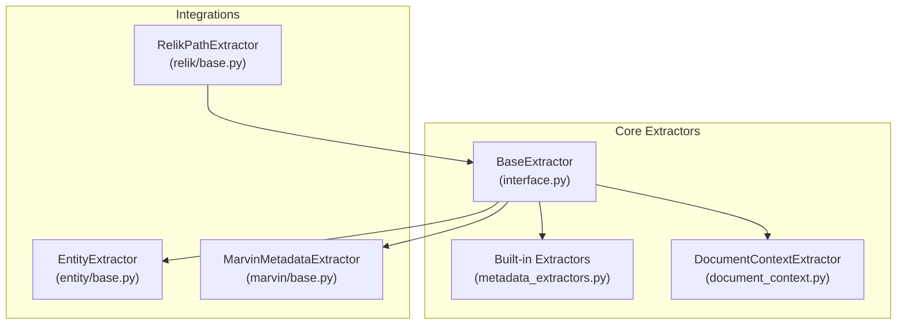
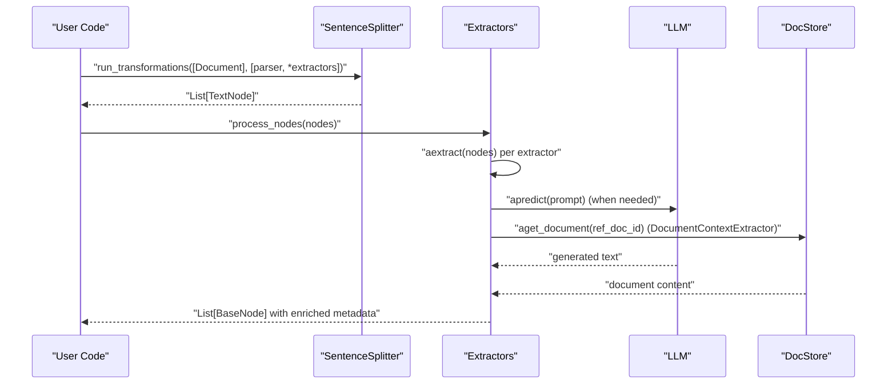
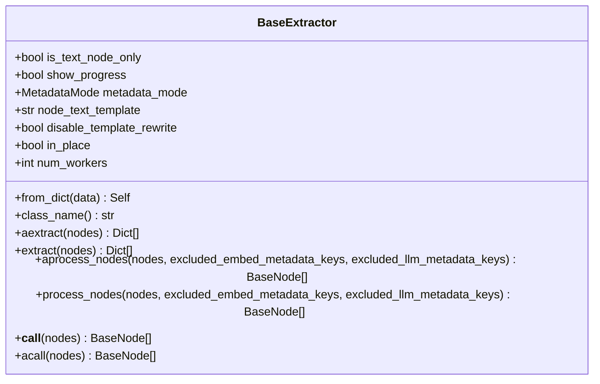
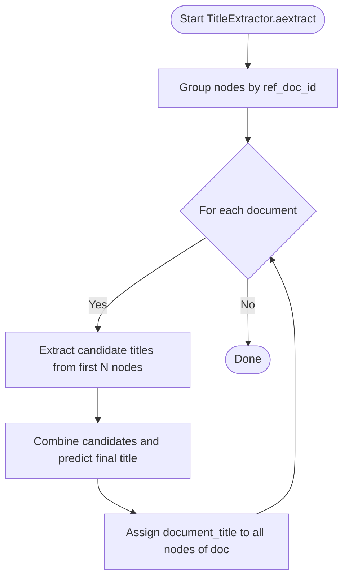
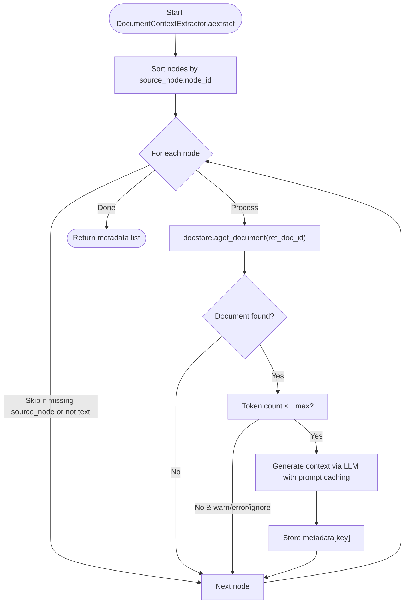
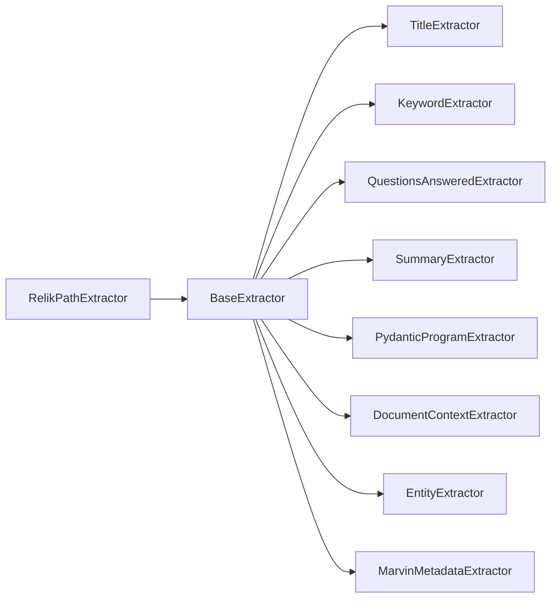

# Metadata Extractors

<cite>
**Referenced Files in This Document**
- [interface.py](file://llama-index-core/llama_index/core/extractors/interface.py)
- [metadata_extractors.py](file://llama-index-core/llama_index/core/extractors/metadata_extractors.py)
- [document_context.py](file://llama-index-core/llama_index/core/extractors/document_context.py)
- [__init__.py](file://llama-index-core/llama_index/core/extractors/__init__.py)
- [loading.py](file://llama-index-core/llama_index/core/extractors/loading.py)
- [entity/base.py](file://llama-index-integrations/extractors/llama-index-extractors-entity/llama_index/extractors/entity/base.py)
- [marvin/base.py](file://llama-index-integrations/extractors/llama-index-extractors-marvin/llama_index/extractors/marvin/base.py)
- [relik/base.py](file://llama-index-integrations/extractors/llama-index-extractors-relik/llama_index/extractors/relik/base.py)
- [metadata_extractor.py](file://llama-index-core/tests/node_parser/metadata_extractor.py)
</cite>

## Table of Contents
1. [Introduction](#introduction)
2. [Project Structure](#project-structure)
3. [Core Components](#core-components)
4. [Architecture Overview](#architecture-overview)
5. [Detailed Component Analysis](#detailed-component-analysis)
6. [Dependency Analysis](#dependency-analysis)
7. [Performance Considerations](#performance-considerations)
8. [Troubleshooting Guide](#troubleshooting-guide)
9. [Conclusion](#conclusion)
10. [Appendices](#appendices)

## Introduction
This document explains metadata extraction transformations in LlamaIndex with a focus on the Extractor interface and built-in extractors. It covers how extractors enrich node metadata, how to preserve and reuse context across nodes, and how to build custom extractors. It also documents strategies for validating and resolving metadata conflicts, and provides guidance for optimizing performance at scale.

## Project Structure
The metadata extraction subsystem is centered around a shared interface and several built-in extractors. Integration packages provide additional specialized extractors.

**Diagram sources**
- [interface.py](file://llama-index-core/llama_index/core/extractors/interface.py#L22-L179)
- [metadata_extractors.py](file://llama-index-core/llama_index/core/extractors/metadata_extractors.py#L54-L536)
- [document_context.py](file://llama-index-core/llama_index/core/extractors/document_context.py#L55-L352)
- [entity/base.py](file://llama-index-integrations/extractors/llama-index-extractors-entity/llama_index/extractors/entity/base.py#L31-L154)
- [marvin/base.py](file://llama-index-integrations/extractors/llama-index-extractors-marvin/llama_index/extractors/marvin/base.py#L16-L74)
- [relik/base.py](file://llama-index-integrations/extractors/llama-index-extractors-relik/llama_index/extractors/relik/base.py#L16-L144)

**Section sources**
- [__init__.py](file://llama-index-core/llama_index/core/extractors/__init__.py#L1-L20)

## Core Components
- BaseExtractor: Defines the extractor contract, asynchronous and synchronous processing, and node post-processing hooks. It supports in-place processing, metadata exclusion lists, and template rewriting for TextNode.
- Built-in extractors: TitleExtractor, KeywordExtractor, QuestionsAnsweredExtractor, SummaryExtractor, PydanticProgramExtractor.
- DocumentContextExtractor: Generates per-node contextual metadata using an LLM and a document store, with robust rate-limit handling and token-length checks.
- Integration extractors: EntityExtractor (SpanMarker NER), MarvinMetadataExtractor (Pydantic casting via Marvin), RelikPathExtractor (triples to knowledge graph).

Key capabilities:
- Metadata enrichment: Adds fields such as document_title, excerpt_keywords, questions_this_excerpt_can_answer, section_summary, prev_section_summary, next_section_summary, marvin_metadata, and entity clusters.
- Context preservation: DocumentContextExtractor ensures each node’s context is grounded in the full document while respecting size limits and rate limits.
- Chaining and composition: Extractors implement a common interface enabling them to be chained with parsers and other transformations.

**Section sources**
- [interface.py](file://llama-index-core/llama_index/core/extractors/interface.py#L22-L179)
- [metadata_extractors.py](file://llama-index-core/llama_index/core/extractors/metadata_extractors.py#L54-L536)
- [document_context.py](file://llama-index-core/llama_index/core/extractors/document_context.py#L55-L352)
- [entity/base.py](file://llama-index-integrations/extractors/llama-index-extractors-entity/llama_index/extractors/entity/base.py#L31-L154)
- [marvin/base.py](file://llama-index-integrations/extractors/llama-index-extractors-marvin/llama_index/extractors/marvin/base.py#L16-L74)
- [relik/base.py](file://llama-index-integrations/extractors/llama-index-extractors-relik/llama_index/extractors/relik/base.py#L16-L144)

## Architecture Overview
The extractor pipeline integrates with the ingestion and transformation workflow. Extractors receive sequences of nodes, compute metadata, and optionally modify nodes in place or return copies with updated metadata.

**Diagram sources**
- [interface.py](file://llama-index-core/llama_index/core/extractors/interface.py#L100-L179)
- [metadata_extractors.py](file://llama-index-core/llama_index/core/extractors/metadata_extractors.py#L113-L171)
- [document_context.py](file://llama-index-core/llama_index/core/extractors/document_context.py#L289-L347)

## Detailed Component Analysis

### BaseExtractor Interface
- Responsibilities:
  - Asynchronous and synchronous extraction APIs.
  - Node post-processing: in-place vs. copy semantics, metadata exclusion lists, and text template rewriting for TextNode.
  - Loading from serialized configuration with support for LLMs and predictors.
- Design highlights:
  - Uses TransformComponent as a base, enabling integration with the broader transformation pipeline.
  - Provides a standardized way to chain extractors and parsers.

**Diagram sources**
- [interface.py](file://llama-index-core/llama_index/core/extractors/interface.py#L22-L179)

**Section sources**
- [interface.py](file://llama-index-core/llama_index/core/extractors/interface.py#L22-L179)

### Built-in Extractors

#### TitleExtractor
- Purpose: Infers a document-level title from the first N nodes and propagates it to all nodes in the same document.
- Behavior:
  - Separates nodes by ref_doc_id, extracts candidate titles from the first N nodes, combines candidates, and predicts a final title.
  - Supports configurable templates and number of nodes.
- Output metadata: document_title.

**Diagram sources**
- [metadata_extractors.py](file://llama-index-core/llama_index/core/extractors/metadata_extractors.py#L113-L171)

**Section sources**
- [metadata_extractors.py](file://llama-index-core/llama_index/core/extractors/metadata_extractors.py#L54-L172)

#### KeywordExtractor
- Purpose: Extracts a comma-separated list of keywords for each node.
- Behavior:
  - Uses a prompt template to generate keywords and stores them under excerpt_keywords.
  - Respects metadata_mode and is_text_node_only.
- Output metadata: excerpt_keywords.

**Section sources**
- [metadata_extractors.py](file://llama-index-core/llama_index/core/extractors/metadata_extractors.py#L178-L250)

#### QuestionsAnsweredExtractor
- Purpose: Generates questions that each node can answer, emphasizing uniqueness and specificity.
- Behavior:
  - Uses a prompt template to produce question sets and stores them under questions_this_excerpt_can_answer.
  - Supports embedding-only mode for downstream indexing.
- Output metadata: questions_this_excerpt_can_answer.

**Section sources**
- [metadata_extractors.py](file://llama-index-core/llama_index/core/extractors/metadata_extractors.py#L267-L345)

#### SummaryExtractor
- Purpose: Produces summaries for the current node and optionally neighboring nodes.
- Behavior:
  - Validates that only TextNode is used.
  - Computes self, previous, and next summaries and attaches them as section_summary, prev_section_summary, next_section_summary.
- Output metadata: section_summary, prev_section_summary, next_section_summary.

**Section sources**
- [metadata_extractors.py](file://llama-index-core/llama_index/core/extractors/metadata_extractors.py#L356-L449)

#### PydanticProgramExtractor
- Purpose: Extracts structured metadata using a Pydantic program and exposes the resulting object as a dictionary.
- Behavior:
  - Formats an extraction prompt with the node content and the target class name.
  - Executes the program and returns a model_dump().
- Output metadata: fields from the Pydantic model.

**Section sources**
- [metadata_extractors.py](file://llama-index-core/llama_index/core/extractors/metadata_extractors.py#L481-L535)

### DocumentContextExtractor
- Purpose: Enhances retrieval accuracy by generating per-node contextual metadata using the parent document.
- Behavior:
  - Retrieves the parent document from a docstore, enforces token limits, and generates succinct context per node using an LLM.
  - Implements retry logic with exponential backoff for rate limits and caches token counts.
  - Skips nodes that already have the target metadata key.
- Output metadata: configurable key (default context) with the generated context string.

**Diagram sources**
- [document_context.py](file://llama-index-core/llama_index/core/extractors/document_context.py#L289-L347)

**Section sources**
- [document_context.py](file://llama-index-core/llama_index/core/extractors/document_context.py#L55-L352)

### Integration Extractors

#### EntityExtractor (SpanMarker)
- Purpose: Extract named entities and group them by coarse-grained types.
- Behavior:
  - Uses a pre-trained SpanMarker model to tag spans and applies thresholds and optional labeling.
  - Aggregates entities into metadata fields (optionally labeled by type).
- Output metadata: entities (and optionally labeled variants depending on configuration).

**Section sources**
- [entity/base.py](file://llama-index-integrations/extractors/llama-index-extractors-entity/llama_index/extractors/entity/base.py#L31-L154)

#### MarvinMetadataExtractor
- Purpose: Cast node content into a user-defined Pydantic model using Marvin and store the result under a dedicated metadata key.
- Behavior:
  - Iterates nodes, casts content to the target model, and returns a dictionary with marvin_metadata.
- Output metadata: marvin_metadata.

**Section sources**
- [marvin/base.py](file://llama-index-integrations/extractors/llama-index-extractors-marvin/llama_index/extractors/marvin/base.py#L16-L74)

#### RelikPathExtractor
- Purpose: Convert node text into a knowledge graph by extracting entities and relations using the Relik library.
- Behavior:
  - Applies a pretrained model to extract spans and triplets, filters by confidence, and writes nodes and relations into metadata keys for downstream graph usage.
- Output metadata: KG nodes and relations appended to node.metadata.

**Section sources**
- [relik/base.py](file://llama-index-integrations/extractors/llama-index-extractors-relik/llama_index/extractors/relik/base.py#L16-L144)

## Dependency Analysis
- Core dependencies:
  - BaseExtractor depends on TransformComponent, LLM, and schema types.
  - Built-in extractors depend on BaseExtractor and LLMs.
  - DocumentContextExtractor depends on LLM, docstore, and tokenization utilities.
  - Integration extractors depend on external libraries (SpanMarker, Marvin, Relik).
- Loading and serialization:
  - Extractors can be loaded from dict via from_dict, including nested LLMs and predictors.

**Diagram sources**
- [interface.py](file://llama-index-core/llama_index/core/extractors/interface.py#L22-L179)
- [metadata_extractors.py](file://llama-index-core/llama_index/core/extractors/metadata_extractors.py#L54-L536)
- [document_context.py](file://llama-index-core/llama_index/core/extractors/document_context.py#L55-L352)
- [entity/base.py](file://llama-index-integrations/extractors/llama-index-extractors-entity/llama_index/extractors/entity/base.py#L31-L154)
- [marvin/base.py](file://llama-index-integrations/extractors/llama-index-extractors-marvin/llama_index/extractors/marvin/base.py#L16-L74)
- [relik/base.py](file://llama-index-integrations/extractors/llama-index-extractors-relik/llama_index/extractors/relik/base.py#L16-L144)

**Section sources**
- [loading.py](file://llama-index-core/llama_index/core/extractors/loading.py#L1-L30)

## Performance Considerations
- Concurrency and batching:
  - Built-in extractors use run_jobs with configurable num_workers to parallelize extraction across nodes.
  - DocumentContextExtractor sorts nodes by source to reduce repeated docstore fetches and optimize prompt caching.
- Rate limiting and retries:
  - DocumentContextExtractor implements exponential backoff with randomized jitter and configurable retry attempts.
- Tokenization and size limits:
  - DocumentContextExtractor caches token counts and truncates or rejects oversized documents according to a configured strategy.
- Memory and CPU:
  - EntityExtractor loads a heavy model; selecting device and tuning thresholds impacts throughput.
- Throughput tips:
  - Prefer batching nodes by document to minimize cross-document overhead.
  - Use in_place processing to avoid deep copying when possible.
  - Limit prompt sizes and reuse LLM resources efficiently.

[No sources needed since this section provides general guidance]

## Troubleshooting Guide
Common issues and resolutions:
- Rate limits during LLM calls:
  - DocumentContextExtractor retries with exponential backoff; adjust max_output_tokens and consider lowering concurrency.
- Missing parent documents:
  - Ensure docstore contains the ref_doc_id; otherwise, DocumentContextExtractor skips those nodes.
- Oversized documents:
  - Configure oversized_document_strategy to warn or error; reduce max_context_length or split documents earlier.
- Non-text nodes:
  - Some extractors require TextNode; filter or convert nodes accordingly.
- Metadata conflicts:
  - Use excluded_embed_metadata_keys and excluded_llm_metadata_keys to prevent unwanted duplication or override.
- Validation errors:
  - Built-in extractors validate inputs (e.g., positive counts); ensure parameters meet constraints.

**Section sources**
- [document_context.py](file://llama-index-core/llama_index/core/extractors/document_context.py#L252-L287)
- [interface.py](file://llama-index-core/llama_index/core/extractors/interface.py#L100-L154)

## Conclusion
LlamaIndex provides a flexible and extensible metadata extraction framework. The BaseExtractor interface unifies extraction workflows, while built-in and integration extractors cover common needs such as titles, keywords, questions, summaries, contextual grounding, entities, and knowledge graph extraction. By leveraging concurrency, robust retry logic, and careful configuration, teams can scale extraction reliably and integrate metadata seamlessly into downstream RAG pipelines.

[No sources needed since this section summarizes without analyzing specific files]

## Appendices

### Example Usage Patterns
- Basic chaining with a node parser and multiple extractors:
  - See [metadata_extractor.py](file://llama-index-core/tests/node_parser/metadata_extractor.py#L14-L35) for a minimal end-to-end example.

- Document-level title extraction:
  - Use TitleExtractor with a suitable LLM and node count.

- Per-node contextual metadata:
  - Use DocumentContextExtractor with a docstore and an appropriate LLM.

- Structured metadata extraction:
  - Use PydanticProgramExtractor with a configured program or MarvinMetadataExtractor with a Pydantic model.

**Section sources**
- [metadata_extractor.py](file://llama-index-core/tests/node_parser/metadata_extractor.py#L14-L35)