# Node Parsers

<cite>
**Referenced Files in This Document**
- [interface.py](file://llama-index-core/llama_index/core/node_parser/interface.py)
- [node_utils.py](file://llama-index-core/llama_index/core/node_parser/node_utils.py)
- [loading.py](file://llama-index-core/llama_index/core/node_parser/loading.py)
- [html.py](file://llama-index-core/llama_index/core/node_parser/file/html.py)
- [markdown.py](file://llama-index-core/llama_index/core/node_parser/file/markdown.py)
- [json.py](file://llama-index-core/llama_index/core/node_parser/file/json.py)
- [simple_file.py](file://llama-index-core/llama_index/core/node_parser/file/simple_file.py)
- [base_element.py](file://llama-index-core/llama_index/core/node_parser/relational/base_element.py)
- [hierarchical.py](file://llama-index-core/llama_index/core/node_parser/relational/hierarchical.py)
- [semantic_splitter.py](file://llama-index-core/llama_index/core/node_parser/text/semantic_splitter.py)
</cite>

## Table of Contents
1. [Introduction](#introduction)
2. [Project Structure](#project-structure)
3. [Core Components](#core-components)
4. [Architecture Overview](#architecture-overview)
5. [Detailed Component Analysis](#detailed-component-analysis)
6. [Dependency Analysis](#dependency-analysis)
7. [Performance Considerations](#performance-considerations)
8. [Troubleshooting Guide](#troubleshooting-guide)
9. [Conclusion](#conclusion)
10. [Appendices](#appendices)

## Introduction
This document explains node parser implementations in LlamaIndex with a focus on the BaseNodeParser interface, node creation strategies, and specialized parsers. It covers:
- BaseNodeParser and TextSplitter contracts
- File-based parsers: HTMLNodeParser, MarkdownNodeParser, JSONNodeParser, and SimpleFileNodeParser
- Relational parsers: BaseElementNodeParser family and HierarchicalNodeParser
- Parser configuration, metadata preservation, node relationships, and custom parser development
- Practical selection criteria and performance optimization techniques

## Project Structure
Node parsers live under the node_parser module, organized by domain:
- Core interface and utilities: interface.py, node_utils.py, loading.py
- File-based parsers: file/html.py, file/markdown.py, file/json.py, file/simple_file.py
- Relational parsers: relational/base_element.py, relational/hierarchical.py
- Text-based semantic splitting: text/semantic_splitter.py

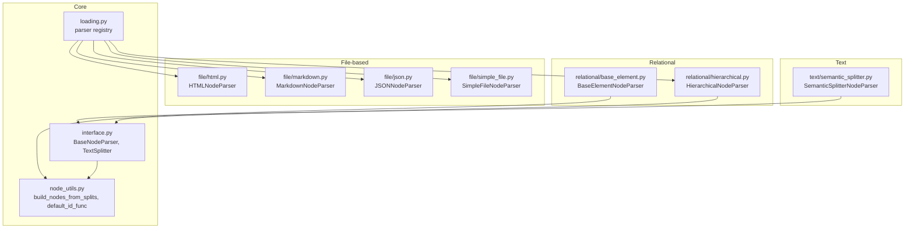

**Diagram sources**
- [interface.py](file://llama-index-core/llama_index/core/node_parser/interface.py#L50-L278)
- [node_utils.py](file://llama-index-core/llama_index/core/node_parser/node_utils.py#L29-L91)
- [loading.py](file://llama-index-core/llama_index/core/node_parser/loading.py#L18-L26)
- [html.py](file://llama-index-core/llama_index/core/node_parser/file/html.py#L18-L144)
- [markdown.py](file://llama-index-core/llama_index/core/node_parser/file/markdown.py#L14-L142)
- [json.py](file://llama-index-core/llama_index/core/node_parser/file/json.py#L13-L108)
- [simple_file.py](file://llama-index-core/llama_index/core/node_parser/file/simple_file.py#L22-L102)
- [base_element.py](file://llama-index-core/llama_index/core/node_parser/relational/base_element.py#L71-L512)
- [hierarchical.py](file://llama-index-core/llama_index/core/node_parser/relational/hierarchical.py#L76-L236)
- [semantic_splitter.py](file://llama-index-core/llama_index/core/node_parser/text/semantic_splitter.py#L35-L313)

**Section sources**
- [interface.py](file://llama-index-core/llama_index/core/node_parser/interface.py#L50-L278)
- [node_utils.py](file://llama-index-core/llama_index/core/node_parser/node_utils.py#L29-L91)
- [loading.py](file://llama-index-core/llama_index/core/node_parser/loading.py#L18-L26)

## Core Components
- BaseNodeParser: Defines the contract for transforming Documents or BaseNode sequences into a list of nodes. Provides lifecycle hooks for pre/post-processing, metadata merging, and relationship establishment.
- TextSplitter: A convenience subclass that splits text content into chunks and builds nodes via a shared utility.
- Node creation utilities: build_nodes_from_splits creates TextNode/ImageNode variants and preserves relationships and metadata templates.

Key behaviors:
- Metadata propagation: Parent document metadata is merged into child nodes with precedence rules.
- Node relationships: SOURCE, PREVIOUS/NEXT, and PARENT/CHILD relationships are established depending on parser and configuration.
- ID generation: A pluggable id_func generates deterministic or unique IDs per chunk.

**Section sources**
- [interface.py](file://llama-index-core/llama_index/core/node_parser/interface.py#L50-L208)
- [node_utils.py](file://llama-index-core/llama_index/core/node_parser/node_utils.py#L29-L91)

## Architecture Overview
The parser pipeline follows a consistent flow:
- Documents enter via get_nodes_from_documents
- Parsers implement _parse_nodes and optionally a post-process step
- Node relationships and metadata are normalized
- Async variants are provided for scalability

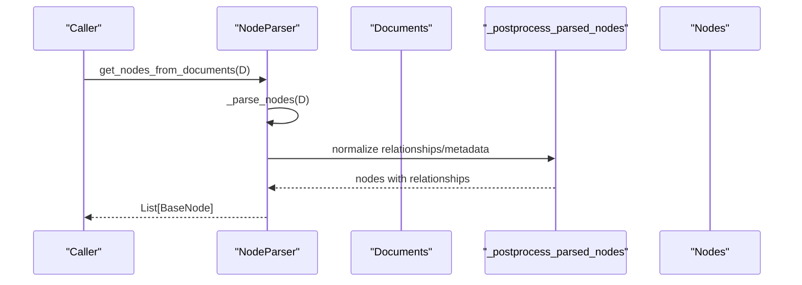

**Diagram sources**
- [interface.py](file://llama-index-core/llama_index/core/node_parser/interface.py#L157-L207)

## Detailed Component Analysis

### BaseNodeParser and TextSplitter
- BaseNodeParser enforces a uniform interface for parsing and exposes:
  - include_metadata and include_prev_next_rel toggles
  - id_func for custom ID generation
  - get_nodes_from_documents and async variants
  - _postprocess_parsed_nodes for relationship and metadata normalization
- TextSplitter specializes parsing for text content by splitting node text and building nodes via build_nodes_from_splits.

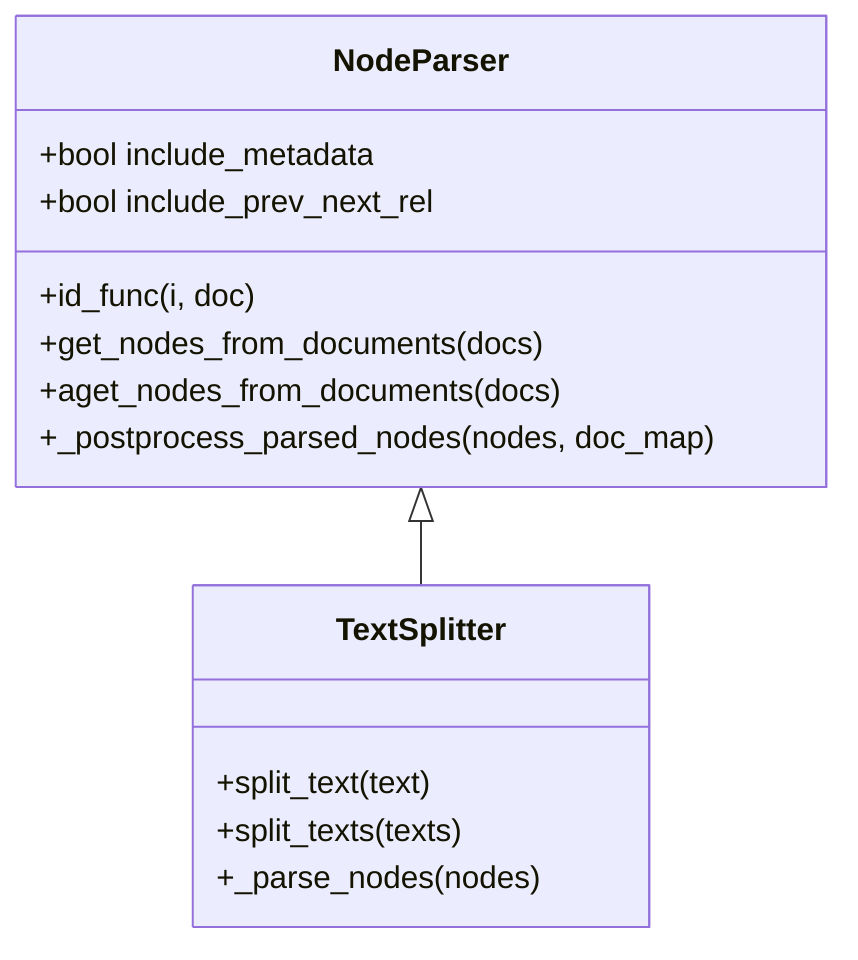

**Diagram sources**
- [interface.py](file://llama-index-core/llama_index/core/node_parser/interface.py#L50-L278)
- [node_utils.py](file://llama-index-core/llama_index/core/node_parser/node_utils.py#L29-L91)

**Section sources**
- [interface.py](file://llama-index-core/llama_index/core/node_parser/interface.py#L50-L278)
- [node_utils.py](file://llama-index-core/llama_index/core/node_parser/node_utils.py#L29-L91)

### HTMLNodeParser
Purpose: Extract and group text by HTML tags, preserving tag context in metadata.

Key features:
- Configurable tags list (default includes common structural tags)
- Builds nodes from concatenated tag content grouped by tag type
- Adds tag metadata to each node when include_metadata is enabled

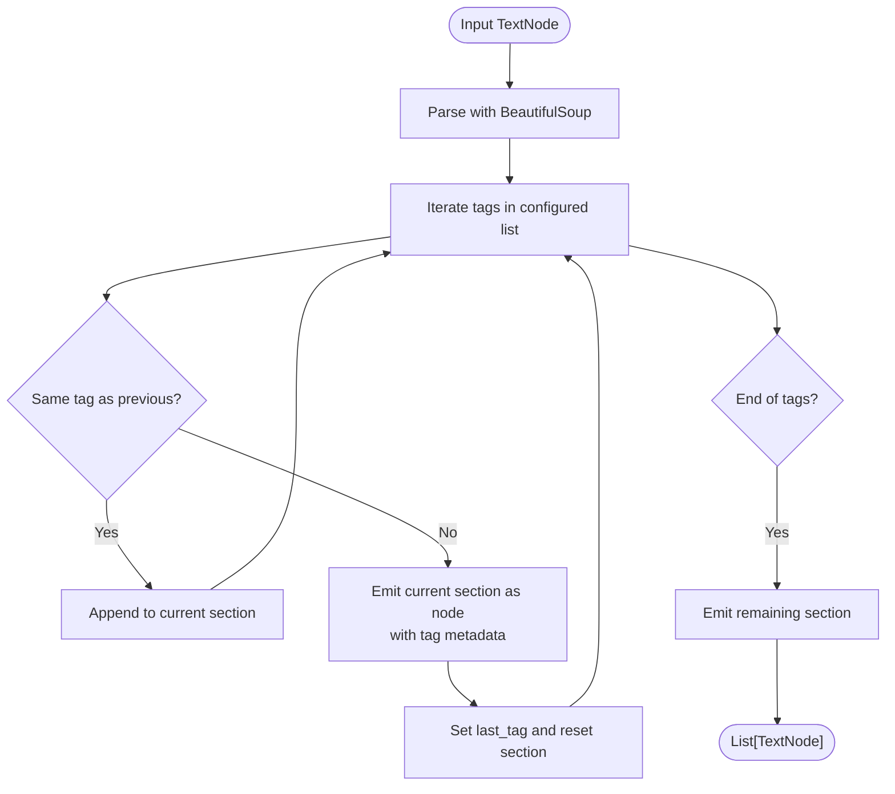

**Diagram sources**
- [html.py](file://llama-index-core/llama_index/core/node_parser/file/html.py#L71-L107)

**Section sources**
- [html.py](file://llama-index-core/llama_index/core/node_parser/file/html.py#L18-L144)

### MarkdownNodeParser
Purpose: Split Markdown by headers while tracking header ancestry to enrich metadata.

Key features:
- Tracks header stack to compute a header path
- Skips code blocks to avoid misinterpreting headers
- Emits nodes with header_path metadata separated by a configurable separator

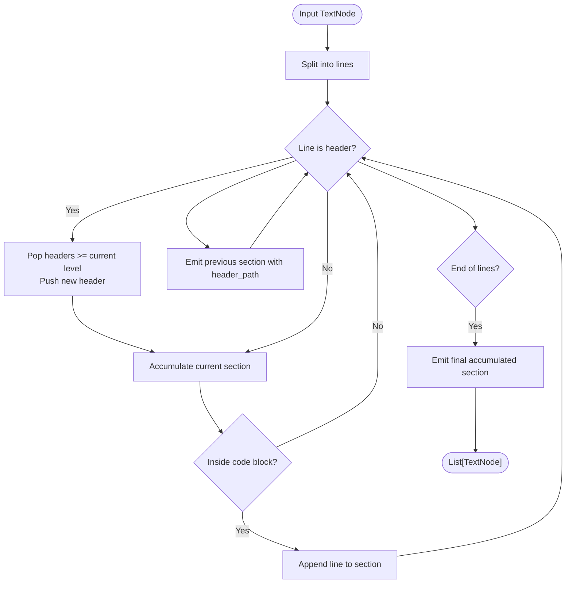

**Diagram sources**
- [markdown.py](file://llama-index-core/llama_index/core/node_parser/file/markdown.py#L48-L107)

**Section sources**
- [markdown.py](file://llama-index-core/llama_index/core/node_parser/file/markdown.py#L14-L142)

### JSONNodeParser
Purpose: Convert JSON content into text nodes using a depth-first traversal.

Key features:
- Validates JSON and supports both dict and list roots
- Traverses recursively and yields leaf values with a configurable path depth
- Builds a single node per JSON object/list by joining yielded tokens

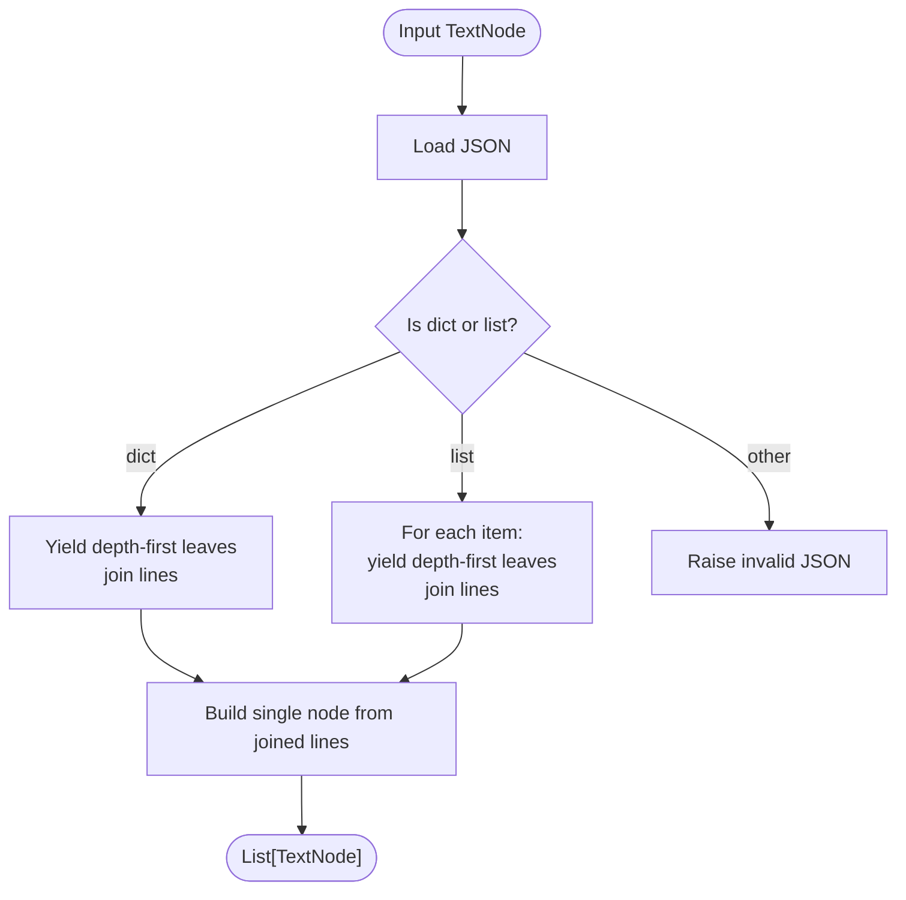

**Diagram sources**
- [json.py](file://llama-index-core/llama_index/core/node_parser/file/json.py#L57-L83)

**Section sources**
- [json.py](file://llama-index-core/llama_index/core/node_parser/file/json.py#L13-L108)

### SimpleFileNodeParser
Purpose: Automatically select a parser based on file extension (.md, .html, .json) and fall back to plain text splitting.

Key features:
- Uses a registry mapping extensions to parsers
- Extracts extension from metadata or file_path
- Delegates to the chosen parser or falls back to building nodes from raw content

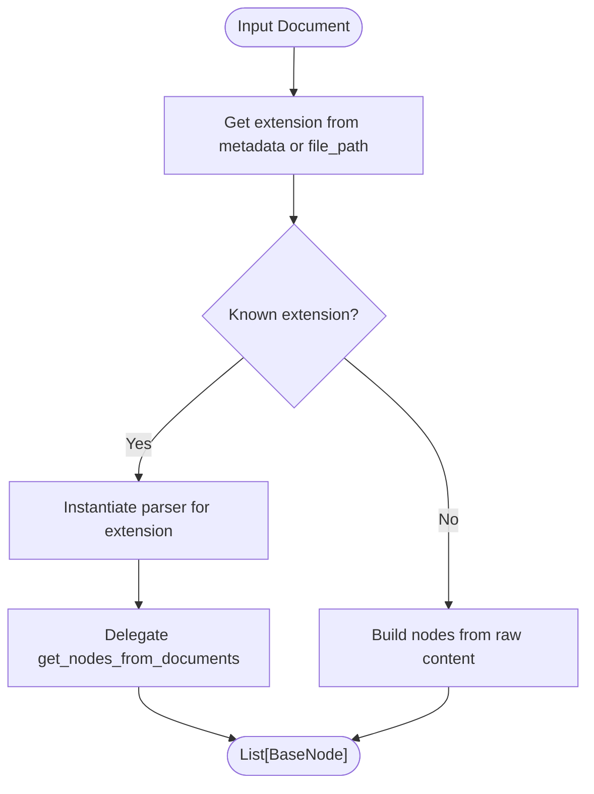

**Diagram sources**
- [simple_file.py](file://llama-index-core/llama_index/core/node_parser/file/simple_file.py#L74-L99)

**Section sources**
- [simple_file.py](file://llama-index-core/llama_index/core/node_parser/file/simple_file.py#L22-L102)

### BaseElementNodeParser (Relational)
Purpose: Extract structured elements (tables and text) from documents and produce both TextNode and IndexNode pairs for relational content.

Highlights:
- Extracts elements from text, identifies tables, and optionally summarizes them using an LLM-backed process
- Serializes tables as Markdown for downstream retrieval and stores column schemas
- Produces paired nodes: a TextNode with summarized content and a sibling IndexNode linking embeddings and retrieval metadata
- Supports async execution and configurable nested node parsing

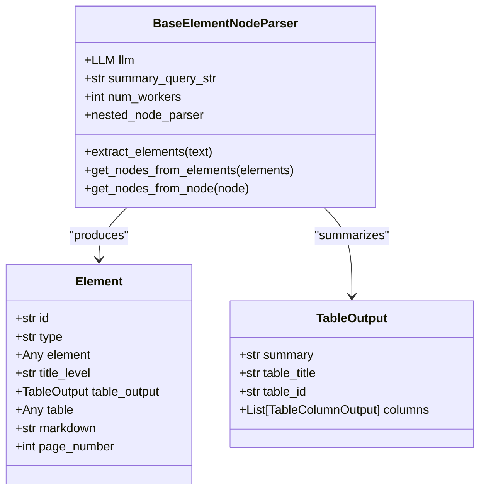

**Diagram sources**
- [base_element.py](file://llama-index-core/llama_index/core/node_parser/relational/base_element.py#L71-L512)

**Section sources**
- [base_element.py](file://llama-index-core/llama_index/core/node_parser/relational/base_element.py#L71-L512)

### HierarchicalNodeParser
Purpose: Recursively split documents into a hierarchy of nodes using different chunk sizes or parsers.

Highlights:
- Accepts either explicit chunk sizes or explicit node parser IDs mapped to parsers
- Establishes parent-child relationships across levels
- Returns a flattened list of nodes with overlapping content across levels

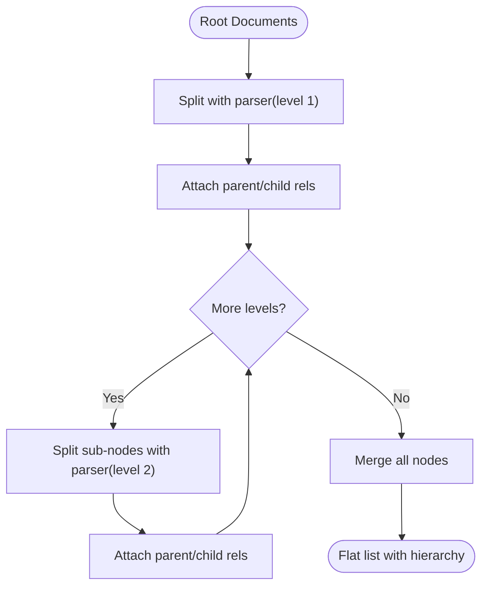

**Diagram sources**
- [hierarchical.py](file://llama-index-core/llama_index/core/node_parser/relational/hierarchical.py#L160-L205)

**Section sources**
- [hierarchical.py](file://llama-index-core/llama_index/core/node_parser/relational/hierarchical.py#L76-L236)

### SemanticSplitterNodeParser (Text)
Purpose: Split text into semantically coherent chunks using sentence embeddings and percentile-based breakpoints.

Highlights:
- Groups adjacent sentences according to buffer_size
- Computes embeddings for combined sentence windows
- Determines breakpoints using cosine distance percentiles
- Produces nodes with optional metadata tracking original text

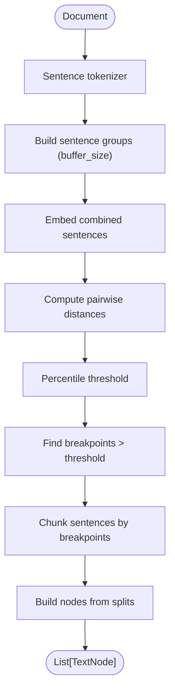

**Diagram sources**
- [semantic_splitter.py](file://llama-index-core/llama_index/core/node_parser/text/semantic_splitter.py#L160-L313)

**Section sources**
- [semantic_splitter.py](file://llama-index-core/llama_index/core/node_parser/text/semantic_splitter.py#L35-L313)

## Dependency Analysis
- Parser registry: loading.py maps class_name() to parser classes for automatic loading.
- Utilities: node_utils.py centralizes node construction and ID generation.
- Relationship and metadata normalization: interface.py consolidates post-processing logic used by most parsers.

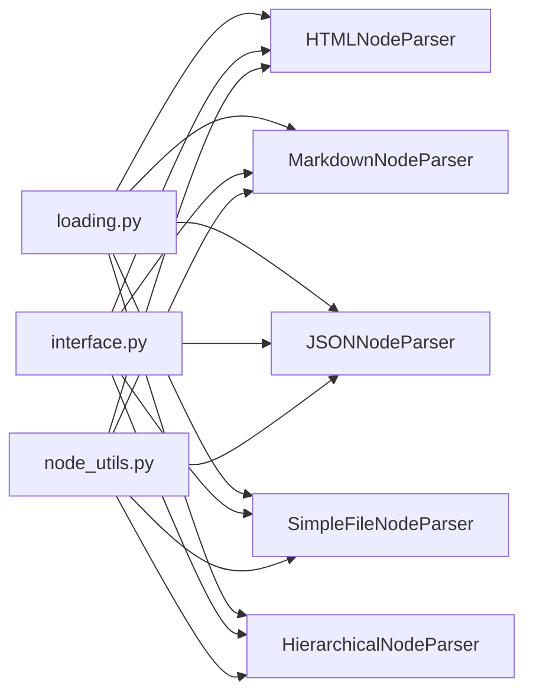

**Diagram sources**
- [loading.py](file://llama-index-core/llama_index/core/node_parser/loading.py#L18-L26)
- [interface.py](file://llama-index-core/llama_index/core/node_parser/interface.py#L50-L208)
- [node_utils.py](file://llama-index-core/llama_index/core/node_parser/node_utils.py#L29-L91)

**Section sources**
- [loading.py](file://llama-index-core/llama_index/core/node_parser/loading.py#L18-L26)
- [interface.py](file://llama-index-core/llama_index/core/node_parser/interface.py#L50-L208)
- [node_utils.py](file://llama-index-core/llama_index/core/node_parser/node_utils.py#L29-L91)

## Performance Considerations
- Prefer async APIs: Use aget_nodes_from_documents and acall when processing large batches to improve throughput.
- Tune chunk sizes: Smaller chunks increase recall but raise index size and cost; larger chunks reduce overhead but may miss fine-grained details.
- Control metadata inclusion: Disable include_metadata when not needed to reduce token usage and indexing overhead.
- Relationship minimization: Disable include_prev_next_rel for downstream tasks that do not require sequential relationships.
- Parallelism: HierarchicalNodeParser and BaseElementNodeParser support worker counts for parallel processing of summaries and splits.
- Preprocessing: For HTML and Markdown, restrict tag lists or header levels to reduce noise and improve signal.
- Embedding efficiency: SemanticSplitterNodeParser benefits from efficient sentence tokenization and appropriate buffer_size to balance granularity and cost.

[No sources needed since this section provides general guidance]

## Troubleshooting Guide
Common issues and resolutions:
- Missing dependencies:
  - HTML parsing requires BeautifulSoup; ensure installation is available.
  - Relational parsing requires pandas; ensure installation is available.
- Invalid JSON input:
  - JSONNodeParser returns empty nodes for malformed JSON; validate inputs upstream.
- Unsupported file extension:
  - SimpleFileNodeParser falls back to raw content; ensure metadata includes a valid extension or file_path.
- Metadata conflicts:
  - When merging parent and node metadata, node values take precedence; review include_metadata settings if unexpected values appear.
- Relationship loops:
  - HierarchicalNodeParser adds parent/child relationships; ensure downstream consumers expect overlapping nodes across levels.

**Section sources**
- [html.py](file://llama-index-core/llama_index/core/node_parser/file/html.py#L74-L76)
- [base_element.py](file://llama-index-core/llama_index/core/node_parser/relational/base_element.py#L370-L374)
- [json.py](file://llama-index-core/llama_index/core/node_parser/file/json.py#L62-L64)
- [simple_file.py](file://llama-index-core/llama_index/core/node_parser/file/simple_file.py#L90-L99)
- [interface.py](file://llama-index-core/llama_index/core/node_parser/interface.py#L121-L132)

## Conclusion
LlamaIndex provides a robust, extensible node parser framework. BaseNodeParser defines a consistent contract, while specialized parsers address common content formats and structures. Proper configuration of metadata, relationships, and chunking strategies enables efficient retrieval and downstream RAG pipelines. For relational content, BaseElementNodeParser and HierarchicalNodeParser offer powerful primitives to preserve both textual and tabular semantics.

[No sources needed since this section summarizes without analyzing specific files]

## Appendices

### Parser Selection Criteria
- Structured text (HTML/Markdown/JSON): Choose the corresponding file-based parser to leverage format-aware splitting and metadata.
- Mixed documents: Use SimpleFileNodeParser to auto-select parsers by extension.
- Hierarchical content: Use HierarchicalNodeParser to create layered chunks for improved recall.
- Semantically coherent chunks: Use SemanticSplitterNodeParser for embedding-based segmentation.
- Relational content: Use BaseElementNodeParser to extract and summarize tables alongside text.

[No sources needed since this section provides general guidance]