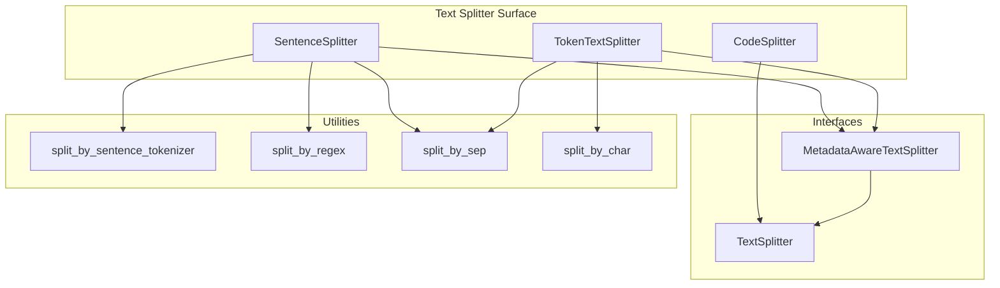
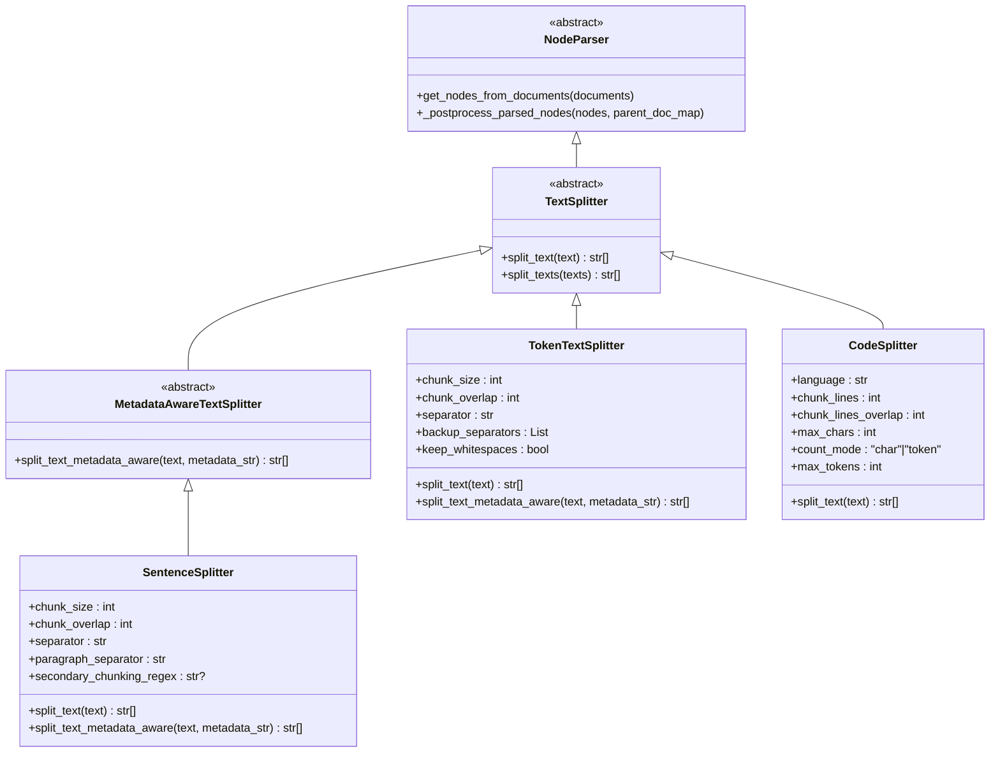
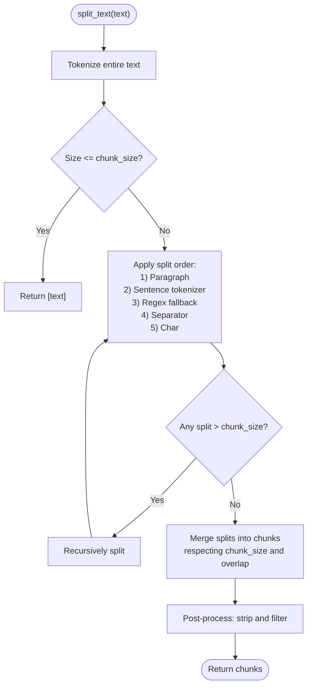
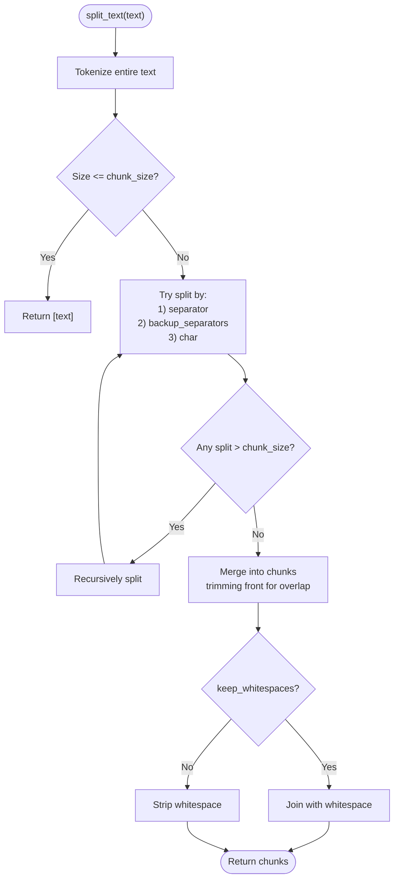
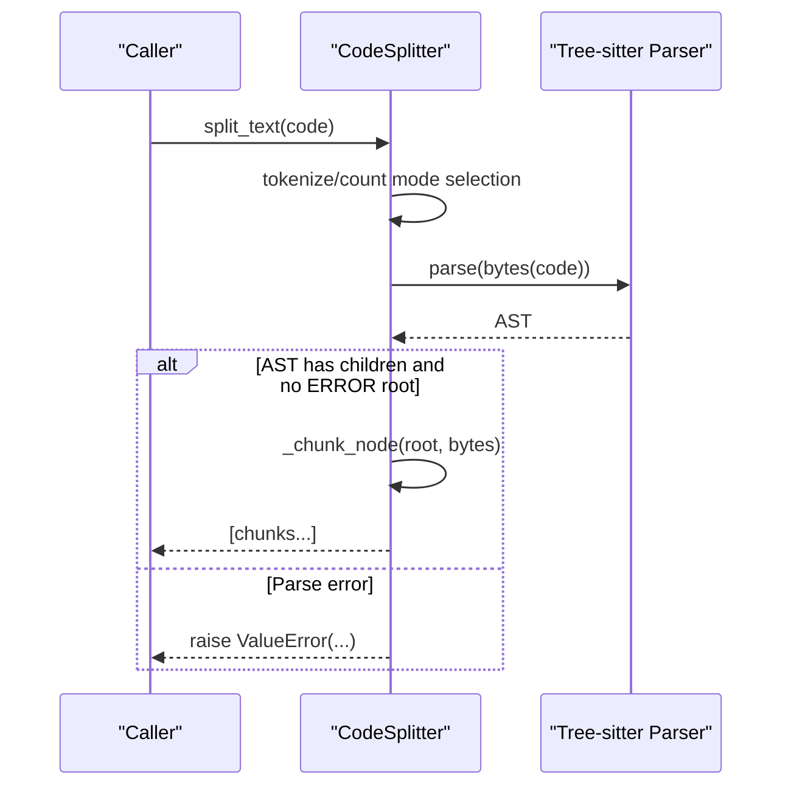
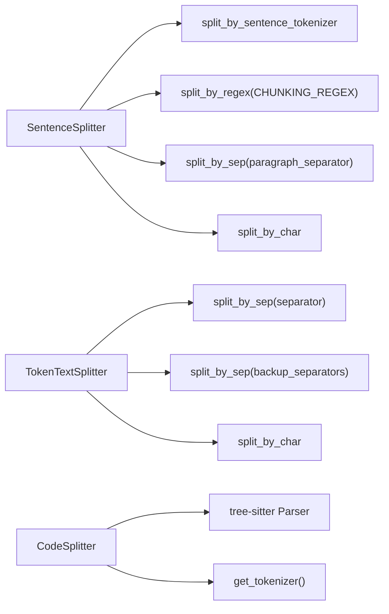

# Text Splitters

<cite>
**Referenced Files in This Document**
- [sentence.py](file://llama-index-core/llama_index/core/node_parser/text/sentence.py)
- [token.py](file://llama-index-core/llama_index/core/node_parser/text/token.py)
- [code.py](file://llama-index-core/llama_index/core/node_parser/text/code.py)
- [interface.py](file://llama-index-core/llama_index/core/node_parser/interface.py)
- [utils.py](file://llama-index-core/llama_index/core/node_parser/text/utils.py)
- [constants.py](file://llama-index-core/llama_index/core/constants.py)
- [__init__.py](file://llama-index-core/llama_index/core/text_splitter/__init__.py)
- [loading.py](file://llama-index-core/llama_index/core/node_parser/loading.py)
</cite>

## Table of Contents
1. [Introduction](#introduction)
2. [Project Structure](#project-structure)
3. [Core Components](#core-components)
4. [Architecture Overview](#architecture-overview)
5. [Detailed Component Analysis](#detailed-component-analysis)
6. [Dependency Analysis](#dependency-analysis)
7. [Performance Considerations](#performance-considerations)
8. [Troubleshooting Guide](#troubleshooting-guide)
9. [Conclusion](#conclusion)

## Introduction
This document explains text splitting transformations in LlamaIndex with a focus on three algorithms:
- Sentence-aware splitting for natural language segmentation
- Token-aware splitting for LLM token budget optimization
- Code-aware splitting for programming language-specific parsing

It covers configuration parameters, chunk size optimization, overlap strategies, performance characteristics, and practical guidance for selecting the right splitter for different content types and use cases.

## Project Structure
The text splitting implementations live under the node parser module and are exposed via a consolidated import surface. The core classes inherit from shared interfaces and utilities.

**Diagram sources**
- [sentence.py](file://llama-index-core/llama_index/core/node_parser/text/sentence.py#L34-L332)
- [token.py](file://llama-index-core/llama_index/core/node_parser/text/token.py#L22-L242)
- [code.py](file://llama-index-core/llama_index/core/node_parser/text/code.py#L19-L266)
- [interface.py](file://llama-index-core/llama_index/core/node_parser/interface.py#L210-L278)
- [utils.py](file://llama-index-core/llama_index/core/node_parser/text/utils.py#L43-L125)

**Section sources**
- [__init__.py](file://llama-index-core/llama_index/core/text_splitter/__init__.py#L1-L13)
- [loading.py](file://llama-index-core/llama_index/core/node_parser/loading.py#L23-L25)

## Core Components
- SentenceSplitter: Prefers sentence boundaries and paragraph separators to minimize fragmented sentences. It supports a secondary regex fallback and maintains overlap between chunks.
- TokenTextSplitter: Splits on separators and characters while respecting token budgets. It supports keeping whitespace and multiple backup separators.
- CodeSplitter: Uses an AST parser (tree-sitter) to split code along syntactic boundaries, with configurable line-based or token-based sizing.

Key defaults and constants:
- Default chunk size and overlap are defined centrally and used by the splitters.
- SentenceSplitter defaults include a paragraph separator and a sentence-aware tokenizer.
- TokenTextSplitter defaults include a primary and optional backup separators.
- CodeSplitter defaults include line chunking parameters and character/token thresholds.

**Section sources**
- [constants.py](file://llama-index-core/llama_index/core/constants.py#L10-L11)
- [sentence.py](file://llama-index-core/llama_index/core/node_parser/text/sentence.py#L43-L61)
- [token.py](file://llama-index-core/llama_index/core/node_parser/text/token.py#L25-L45)
- [code.py](file://llama-index-core/llama_index/core/node_parser/text/code.py#L30-L56)

## Architecture Overview
The splitters implement a common interface hierarchy and rely on shared utilities for splitting strategies. They integrate with the broader node parsing pipeline to produce nodes with optional metadata and relationship tracking.

**Diagram sources**
- [interface.py](file://llama-index-core/llama_index/core/node_parser/interface.py#L50-L278)
- [sentence.py](file://llama-index-core/llama_index/core/node_parser/text/sentence.py#L34-L332)
- [token.py](file://llama-index-core/llama_index/core/node_parser/text/token.py#L22-L242)
- [code.py](file://llama-index-core/llama_index/core/node_parser/text/code.py#L19-L266)

## Detailed Component Analysis

### SentenceSplitter
Purpose:
- Segment natural language into chunks that tend to align with sentence and paragraph boundaries, reducing fragmentation.

Key parameters:
- chunk_size: Target token count per chunk
- chunk_overlap: Overlap tokens between adjacent chunks
- separator: Word-level separator for fallback splitting
- paragraph_separator: Paragraph delimiter
- secondary_chunking_regex: Fallback regex for sentence-like phrases
- tokenizer: Optional custom tokenizer; otherwise resolved via global utility
- chunking_tokenizer_fn: Optional sentence tokenizer; defaults to NLTK-based tokenizer

Processing logic:
- Splits by paragraph, then by sentence tokenizer, then by regex and separators, finally by characters.
- Merges splits into chunks respecting token budgets and overlap.
- Ensures at least one split is included in a new chunk to avoid empty selections.
- Applies post-processing to strip whitespace-only chunks.

Overlap strategy:
- When closing a chunk, the last chunk contributes up to chunk_overlap tokens to the next chunk’s beginning.

Metadata-awareness:
- Computes effective chunk size by subtracting metadata token cost and emits warnings when remaining tokens are very small.

**Diagram sources**
- [sentence.py](file://llama-index-core/llama_index/core/node_parser/text/sentence.py#L179-L332)
- [utils.py](file://llama-index-core/llama_index/core/node_parser/text/utils.py#L43-L125)

**Section sources**
- [sentence.py](file://llama-index-core/llama_index/core/node_parser/text/sentence.py#L34-L122)
- [sentence.py](file://llama-index-core/llama_index/core/node_parser/text/sentence.py#L156-L196)
- [sentence.py](file://llama-index-core/llama_index/core/node_parser/text/sentence.py#L198-L302)
- [sentence.py](file://llama-index-core/llama_index/core/node_parser/text/sentence.py#L320-L332)
- [utils.py](file://llama-index-core/llama_index/core/node_parser/text/utils.py#L72-L94)

### TokenTextSplitter
Purpose:
- Optimize for token budgets by splitting on separators and characters, with configurable overlap and whitespace handling.

Key parameters:
- chunk_size: Target token count per chunk
- chunk_overlap: Overlap tokens between adjacent chunks
- separator: Primary separator for splitting
- backup_separators: Additional separators to try
- keep_whitespaces: Whether to preserve leading/trailing whitespace
- tokenizer: Optional custom tokenizer; otherwise resolved via global utility

Processing logic:
- Attempts to split by primary separator, then backup separators, then by characters.
- Recursively splits oversized segments.
- Merges segments into chunks, maintaining overlap by trimming the front of the next chunk from the previous chunk.

Overlap strategy:
- When exceeding chunk_size, the current chunk is finalized and overlap is pulled from the previous chunk’s start until within overlap bounds.

Metadata-awareness:
- Reserves extra tokens for metadata formatting and warns when remaining tokens are small.

**Diagram sources**
- [token.py](file://llama-index-core/llama_index/core/node_parser/text/token.py#L142-L242)

**Section sources**
- [token.py](file://llama-index-core/llama_index/core/node_parser/text/token.py#L22-L84)
- [token.py](file://llama-index-core/llama_index/core/node_parser/text/token.py#L117-L157)
- [token.py](file://llama-index-core/llama_index/core/node_parser/text/token.py#L159-L186)
- [token.py](file://llama-index-core/llama_index/core/node_parser/text/token.py#L188-L242)

### CodeSplitter
Purpose:
- Split source code using an AST (tree-sitter) to respect language syntax and structure, with configurable line-based or token-based chunking.

Key parameters:
- language: Programming language identifier
- chunk_lines: Number of lines per chunk
- chunk_lines_overlap: Lines of overlap between adjacent chunks
- max_chars: Max characters per chunk (when count_mode="char")
- count_mode: "char" or "token"
- max_tokens: Max tokens per chunk (when count_mode="token")
- tokenizer: Optional tokenizer for token-based counting
- parser: Optional tree-sitter Parser instance

Processing logic:
- Parses code into an AST.
- Recursively traverses nodes, building current chunk text until adding the next child would exceed size limits.
- Supports both character and token-based sizing depending on count_mode.
- Strips whitespace around chunks.

**Diagram sources**
- [code.py](file://llama-index-core/llama_index/core/node_parser/text/code.py#L225-L266)

**Section sources**
- [code.py](file://llama-index-core/llama_index/core/node_parser/text/code.py#L19-L113)
- [code.py](file://llama-index-core/llama_index/core/node_parser/text/code.py#L166-L224)
- [code.py](file://llama-index-core/llama_index/core/node_parser/text/code.py#L225-L266)

## Dependency Analysis
- SentenceSplitter depends on:
  - Sentence tokenizer utility
  - Regex-based phrase splitting
  - Separator and character splitting utilities
  - Global tokenizer resolution
- TokenTextSplitter depends on:
  - Separator and character splitting utilities
  - Global tokenizer resolution
- CodeSplitter depends on:
  - Tree-sitter parser (via language pack)
  - Global tokenizer resolution (when count_mode="token")

**Diagram sources**
- [sentence.py](file://llama-index-core/llama_index/core/node_parser/text/sentence.py#L106-L121)
- [token.py](file://llama-index-core/llama_index/core/node_parser/text/token.py#L83-L84)
- [code.py](file://llama-index-core/llama_index/core/node_parser/text/code.py#L114-L134)
- [utils.py](file://llama-index-core/llama_index/core/node_parser/text/utils.py#L43-L125)

**Section sources**
- [sentence.py](file://llama-index-core/llama_index/core/node_parser/text/sentence.py#L101-L121)
- [token.py](file://llama-index-core/llama_index/core/node_parser/text/token.py#L82-L84)
- [code.py](file://llama-index-core/llama_index/core/node_parser/text/code.py#L114-L134)

## Performance Considerations
- Token budgeting:
  - Both SentenceSplitter and TokenTextSplitter compute token lengths using a tokenizer. Prefer a tokenizer aligned with your target LLM to avoid overruns.
  - CodeSplitter supports token-based sizing when count_mode="token".
- Overlap trade-offs:
  - Higher overlap improves continuity but increases total tokens and processing overhead.
  - SentenceSplitter’s overlap is applied by borrowing from the previous chunk’s tail; TokenTextSplitter trims the next chunk’s head.
- Fallback splitting:
  - SentenceSplitter’s regex and separator fallbacks reduce fragmentation but add complexity; tune secondary_chunking_regex for domain-specific punctuation.
- AST parsing:
  - CodeSplitter requires tree-sitter parsers; ensure the language pack is installed and the parser is valid to avoid runtime errors.

[No sources needed since this section provides general guidance]

## Troubleshooting Guide
Common issues and resolutions:
- Chunk overlap greater than chunk size:
  - Validation raises an error during initialization. Adjust overlap to be less than chunk size.
- Metadata too large for chunk budget:
  - SentenceSplitter and TokenTextSplitter compute effective chunk size by subtracting metadata cost. Increase chunk_size or reduce metadata to avoid negative or tiny effective sizes.
- Single split exceeds chunk size:
  - SentenceSplitter raises an error when a single tokenized unit exceeds the limit. Reduce chunk_size or adjust splitting parameters.
- Code parsing failure:
  - CodeSplitter validates the AST root and raises a ValueError if parsing fails. Verify language support and code correctness.

**Section sources**
- [sentence.py](file://llama-index-core/llama_index/core/node_parser/text/sentence.py#L83-L87)
- [sentence.py](file://llama-index-core/llama_index/core/node_parser/text/sentence.py#L159-L173)
- [token.py](file://llama-index-core/llama_index/core/node_parser/text/token.py#L64-L68)
- [token.py](file://llama-index-core/llama_index/core/node_parser/text/token.py#L121-L135)
- [code.py](file://llama-index-core/llama_index/core/node_parser/text/code.py#L249-L263)

## Practical Guidance: Choosing a Splitter
- Natural language text:
  - Use SentenceSplitter to respect sentence and paragraph boundaries. Tune chunk_size and chunk_overlap for your LLM’s context window.
- General text with varied formatting:
  - Use TokenTextSplitter with appropriate separators and backup_separators. Enable keep_whitespaces only if whitespace is meaningful.
- Source code:
  - Use CodeSplitter with the correct language and choose count_mode="token" for token-aware budgets. Adjust chunk_lines and chunk_lines_overlap to balance readability and retrieval granularity.

[No sources needed since this section provides general guidance]

## Conclusion
LlamaIndex offers three complementary text splitters:
- SentenceSplitter for coherent natural language segmentation
- TokenTextSplitter for strict token budget adherence
- CodeSplitter for syntax-aware code chunking

Selecting the right splitter depends on content type and downstream tasks. Proper configuration of chunk size, overlap, and counting mode ensures efficient indexing and retrieval.